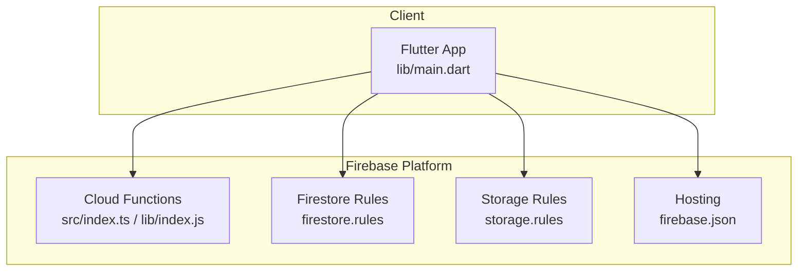
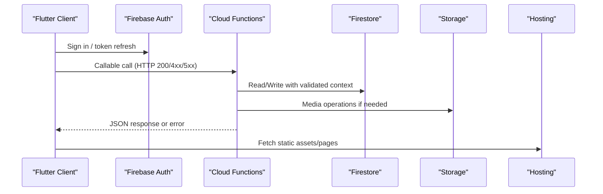
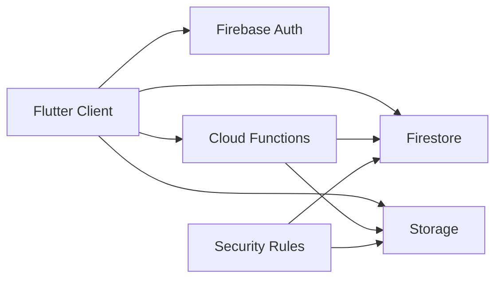

# API Reference

<cite>
**Referenced Files in This Document**
- [functions/src/index.ts](file://functions/src/index.ts)
- [functions/package.json](file://functions/package.json)
- [functions/lib/index.js](file://functions/lib/index.js)
- [firestore.rules](file://firestore.rules)
- [storage.rules](file://storage.rules)
- [firebase.json](file://firebase.json)
- [flutter_app/lib/main.dart](file://flutter_app/lib/main.dart)
- [flutter_app/pubspec.yaml](file://flutter_app/pubspec.yaml)
</cite>

## Table of Contents
1. [Introduction](#introduction)
2. [Project Structure](#project-structure)
3. [Core Components](#core-components)
4. [Architecture Overview](#architecture-overview)
5. [Detailed Component Analysis](#detailed-component-analysis)
6. [Dependency Analysis](#dependency-analysis)
7. [Performance Considerations](#performance-considerations)
8. [Troubleshooting Guide](#troubleshooting-guide)
9. [Conclusion](#conclusion)
10. [Appendices](#appendices)

## Introduction
This document provides a comprehensive API reference for the Gestão Yahweh Premium system. It covers:
- Firebase Cloud Functions callable endpoints (serverless APIs)
- Firestore and Storage security rules that govern access
- Web hosting endpoints exposed by Firebase Hosting
- Flutter client integration points and configuration
- Authentication, error handling, rate limiting, versioning, and testing guidance

The system is built on Firebase (Functions, Firestore, Storage, Hosting) with a Flutter multi-platform client. Server-side logic is implemented as TypeScript functions compiled to JavaScript.

## Project Structure
Key areas relevant to APIs:
- functions/: Cloud Functions source and compiled outputs
- flutter_app/: Flutter client code and configuration
- firestore.rules and storage.rules: Security policies for data and media
- firebase.json: Firebase project configuration including hosting and functions
- flutter_app/lib/main.dart: App entry point and initialization

**Diagram sources**
- [flutter_app/lib/main.dart](file://flutter_app/lib/main.dart)
- [functions/src/index.ts](file://functions/src/index.ts)
- [functions/lib/index.js](file://functions/lib/index.js)
- [firestore.rules](file://firestore.rules)
- [storage.rules](file://storage.rules)
- [firebase.json](file://firebase.json)

**Section sources**
- [functions/src/index.ts](file://functions/src/index.ts)
- [functions/lib/index.js](file://functions/lib/index.js)
- [flutter_app/lib/main.dart](file://flutter_app/lib/main.dart)
- [firebase.json](file://firebase.json)

## Core Components
- Cloud Functions (Callable): Centralized serverless APIs invoked from the Flutter client using Firebase SDKs.
- Firestore Security Rules: Enforce tenant isolation, role-based access, and data validation at query/write time.
- Storage Security Rules: Control media upload/download permissions per tenant and user context.
- Hosting Endpoints: Static assets and web pages served via Firebase Hosting.

Authentication and authorization are enforced through Firebase Auth tokens passed into callable functions and evaluated against Firestore/Storage rules.

**Section sources**
- [functions/src/index.ts](file://functions/src/index.ts)
- [functions/lib/index.js](file://functions/lib/index.js)
- [firestore.rules](file://firestore.rules)
- [storage.rules](file://storage.rules)

## Architecture Overview
High-level flow for API interactions:
- Flutter app authenticates users via Firebase Auth
- Client calls Cloud Functions callable endpoints with typed payloads
- Functions validate context, enforce business logic, and interact with Firestore/Storage
- Responses are returned to the client; errors follow standardized formats
- Hosting serves static web assets and public pages

**Diagram sources**
- [flutter_app/lib/main.dart](file://flutter_app/lib/main.dart)
- [functions/src/index.ts](file://functions/src/index.ts)
- [functions/lib/index.js](file://functions/lib/index.js)
- [firestore.rules](file://firestore.rules)
- [storage.rules](file://storage.rules)
- [firebase.json](file://firebase.json)

## Detailed Component Analysis

### Cloud Functions Callable Endpoints
Callable endpoints are defined in the Functions module and invoked via the Firebase client SDK. Each function typically:
- Receives an authenticated context (user ID, roles, tenant)
- Validates input parameters
- Performs Firestore/Storage operations
- Returns structured responses or throws standardized errors

Common patterns:
- Tenant-scoped operations using churchId or tenantId
- Role checks for admin/member/guest
- Idempotent writes where applicable
- Pagination and filtering for list operations

Typical request/response schema:
- Request body: { data: { ... } }
- Response: { success: boolean, data?: any, error?: string }

Error handling:
- Use Firebase Functions error types to map to HTTP status codes
- Return consistent error messages and codes for client handling

Rate limiting:
- Apply per-user or per-tenant limits within functions or via external throttling
- Use Firestore counters or Redis-like mechanisms if needed

Versioning:
- Prefix endpoints with version segments when evolving APIs
- Maintain backward compatibility during transitions

Security considerations:
- Validate all inputs
- Enforce least privilege based on roles
- Sanitize outputs to avoid leaking sensitive data

Testing approaches:
- Unit tests for function logic
- Integration tests with emulators for Functions/Firestore/Storage
- Contract tests for request/response schemas

[No sources needed since this section provides general guidance]

### Firestore Security Rules
Rules define who can read/write data and under what conditions. Key aspects:
- Tenant isolation: restrict access to churchId/tenantId-scoped documents
- Role-based access: admin vs member vs guest
- Field-level validation: required fields, allowed values, length constraints
- Query safety: prevent expensive queries without indexes

Access control examples:
- Allow reads for authenticated members within their church
- Allow writes only for admins or specific roles
- Deny cross-tenant access

Indexes:
- Define composite indexes for common queries
- Ensure queries match index definitions to avoid runtime errors

**Section sources**
- [firestore.rules](file://firestore.rules)

### Storage Security Rules
Media access is governed by Storage rules:
- Restrict uploads to authenticated users with appropriate roles
- Limit file sizes and MIME types
- Enable signed URLs for secure sharing
- Organize files by tenant/user paths for isolation

Operations:
- Upload: POST to storage bucket with metadata
- Download: GET with signed URL or direct access if permitted
- Delete: Admin-only or owner-only depending on policy

**Section sources**
- [storage.rules](file://storage.rules)

### Hosting Endpoints
Static content and web pages are served via Firebase Hosting:
- Public pages: e.g., login, reset password, marketing pages
- Assets: CSS, JS, images, fonts
- Custom domains and redirects configured in firebase.json

Endpoints:
- GET /index.html
- GET /reset_password.html
- GET /assets/*

Caching:
- Configure cache headers for performance
- Use service workers for offline support

**Section sources**
- [firebase.json](file://firebase.json)

### Flutter Client Integration
The Flutter app integrates with Firebase services:
- Authentication: sign-in, token management, session persistence
- Functions: typed callable wrappers for each endpoint
- Firestore: real-time listeners, batched writes, offline persistence
- Storage: upload progress, resumable uploads, thumbnail generation

Configuration:
- Initialize Firebase in main.dart
- Set environment-specific settings (dev/prod)
- Handle network errors and retries

**Section sources**
- [flutter_app/lib/main.dart](file://flutter_app/lib/main.dart)
- [flutter_app/pubspec.yaml](file://flutter_app/pubspec.yaml)

## Dependency Analysis
Component relationships:
- Flutter client depends on Firebase SDKs for Auth, Functions, Firestore, Storage
- Cloud Functions depend on Firestore and Storage clients
- Security rules enforce boundaries between components

**Diagram sources**
- [flutter_app/lib/main.dart](file://flutter_app/lib/main.dart)
- [functions/src/index.ts](file://functions/src/index.ts)
- [firestore.rules](file://firestore.rules)
- [storage.rules](file://storage.rules)

**Section sources**
- [functions/package.json](file://functions/package.json)
- [flutter_app/pubspec.yaml](file://flutter_app/pubspec.yaml)

## Performance Considerations
Optimization strategies:
- Use Firestore indexes for frequent queries
- Implement pagination and cursor-based loading
- Cache frequently accessed data in memory and local storage
- Minimize payload sizes with selective field retrieval
- Use background tasks for heavy operations
- Leverage CDN caching for static assets

Monitoring:
- Track function execution times and error rates
- Monitor Firestore read/write costs
- Analyze Storage bandwidth usage

## Troubleshooting Guide
Common issues and resolutions:
- Authentication failures: verify token validity and expiration
- Permission denied: check Firestore/Storage rules and user roles
- Network errors: implement retry logic and exponential backoff
- Function timeouts: optimize database queries and reduce payload size
- Storage upload failures: validate file size and MIME type

Debugging tools:
- Firebase Emulator Suite for local testing
- Cloud Functions logs for error tracking
- Firestore and Storage rule testers for validation

**Section sources**
- [functions/src/index.ts](file://functions/src/index.ts)
- [functions/lib/index.js](file://functions/lib/index.js)

## Conclusion
The Gestão Yahweh Premium system provides a robust API layer through Firebase Cloud Functions, secured by comprehensive Firestore and Storage rules. The Flutter client offers a seamless integration experience with proper authentication, error handling, and performance optimizations. Following the guidelines in this document ensures reliable, secure, and scalable API interactions.

## Appendices

### API Testing Approaches
- Use Firebase Emulator Suite for local development
- Write unit tests for individual functions
- Create integration tests for end-to-end flows
- Validate security rules with test cases
- Perform load testing for critical endpoints

### Security Best Practices
- Always validate user input
- Enforce least privilege principles
- Rotate secrets and credentials regularly
- Monitor for suspicious activities
- Keep dependencies updated

### Versioning Strategy
- Use semantic versioning for API changes
- Maintain backward compatibility during transitions
- Deprecate old versions with clear migration guides
- Test thoroughly before releasing new versions