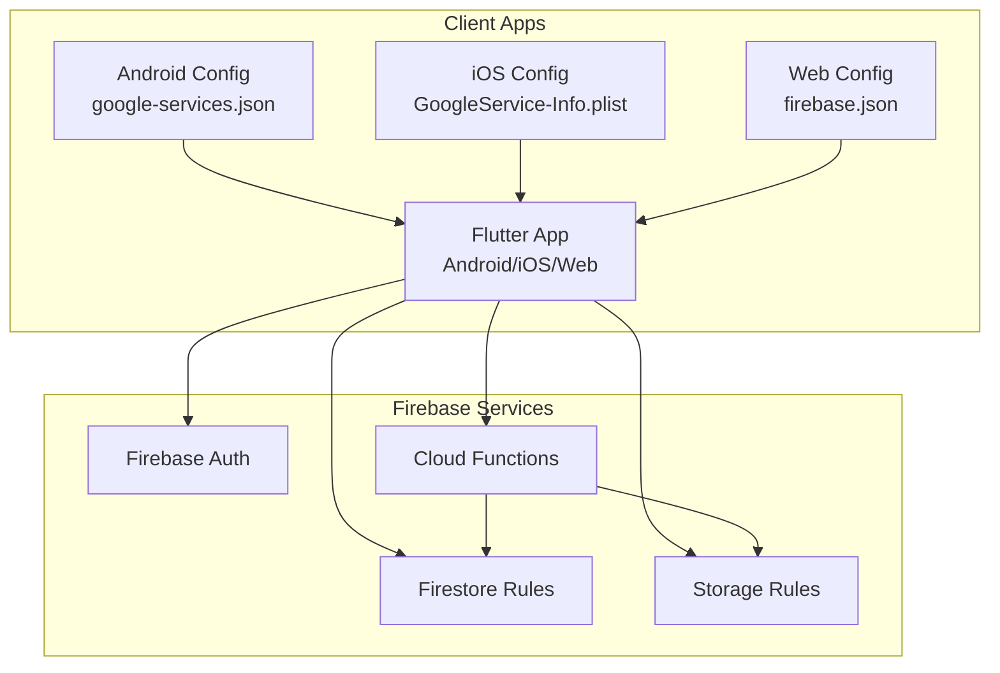
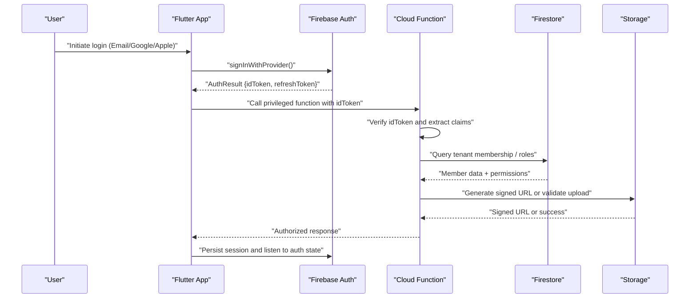
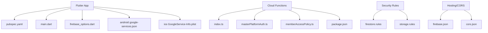

# Authentication & Security

<cite>
**Referenced Files in This Document**
- [firestore.rules](file://firestore.rules)
- [storage.rules](file://storage.rules)
- [functions/index.ts](file://functions/src/index.ts)
- [functions/masterPlatformAuth.ts](file://functions/src/masterPlatformAuth.ts)
- [functions/memberAccessPolicy.ts](file://functions/src/memberAccessPolicy.ts)
- [flutter_app/lib/main.dart](file://flutter_app/lib/main.dart)
- [flutter_app/firebase_options.dart](file://flutter_app/firebase_options.dart)
- [flutter_app/pubspec.yaml](file://flutter_app/pubspec.yaml)
- [android/app/google-services.json](file://flutter_app/android/app/google-services.json)
- [ios/Runner/GoogleService-Info.plist](file://flutter_app/ios/Runner/GoogleService-Info.plist)
- [cors.json](file://cors.json)
- [firebase.json](file://firebase.json)
- [functions/package.json](file://functions/package.json)
</cite>

## Table of Contents
1. Introduction
2. Project Structure
3. Core Components
4. Architecture Overview
5. Detailed Component Analysis
6. Dependency Analysis
7. Performance Considerations
8. Troubleshooting Guide
9. Conclusion

## Introduction
This document provides comprehensive authentication and security guidance for the API surface, covering Firebase Auth integration, JWT token handling, multi-provider login flows, authorization policies, role-based access control (RBAC), permission models, security headers, CORS configuration, input validation, encryption standards, data protection measures, compliance requirements, best practices, vulnerability mitigation, audit logging, session management, token refresh, and logout procedures. It maps these concepts to the actual implementation artifacts present in the repository.

## Project Structure
The project is a multi-platform Flutter application backed by Firebase services:
- Client app (Flutter) integrates Firebase Auth, Firestore, and Storage across Android, iOS, and Web.
- Cloud Functions implement server-side logic, including platform auth utilities and member access policies.
- Security rules enforce fine-grained access control at Firestore and Storage layers.
- Configuration files define Firebase project settings, hosting/CORS, and dependencies.

**Diagram sources**
- [flutter_app/lib/main.dart](file://flutter_app/lib/main.dart)
- [flutter_app/firebase_options.dart](file://flutter_app/firebase_options.dart)
- [android/app/google-services.json](file://flutter_app/android/app/google-services.json)
- [ios/Runner/GoogleService-Info.plist](file://flutter_app/ios/Runner/GoogleService-Info.plist)
- [firebase.json](file://firebase.json)
- [firestore.rules](file://firestore.rules)
- [storage.rules](file://storage.rules)
- [functions/src/index.ts](file://functions/src/index.ts)

**Section sources**
- [flutter_app/lib/main.dart](file://flutter_app/lib/main.dart)
- [flutter_app/firebase_options.dart](file://flutter_app/firebase_options.dart)
- [android/app/google-services.json](file://flutter_app/android/app/google-services.json)
- [ios/Runner/GoogleService-Info.plist](file://flutter_app/ios/Runner/GoogleService-Info.plist)
- [firebase.json](file://firebase.json)

## Core Components
- Firebase Auth: Multi-provider sign-in (email/password, Google, Apple, etc.) via Firebase SDKs on client platforms.
- Cloud Functions: Server-side utilities for platform auth and member access policy enforcement.
- Firestore Rules: Fine-grained read/write permissions based on authenticated user context and tenant membership.
- Storage Rules: Secure media access with tenant-scoped paths and signed URLs where applicable.
- Configuration: Firebase project bindings and web hosting/CORS settings.

Key responsibilities:
- Client apps initialize Firebase and manage auth state.
- Functions provide privileged operations and policy checks not safe to perform on the client.
- Rules enforce least privilege and tenant isolation.
- CORS and hosting ensure secure cross-origin requests.

**Section sources**
- [flutter_app/pubspec.yaml](file://flutter_app/pubspec.yaml)
- [functions/src/index.ts](file://functions/src/index.ts)
- [functions/src/masterPlatformAuth.ts](file://functions/src/masterPlatformAuth.ts)
- [functions/src/memberAccessPolicy.ts](file://functions/src/memberAccessPolicy.ts)
- [firestore.rules](file://firestore.rules)
- [storage.rules](file://storage.rules)
- [firebase.json](file://firebase.json)

## Architecture Overview
The authentication and authorization architecture combines client-side Firebase Auth with server-side policy enforcement and rule-based access control.

**Diagram sources**
- [flutter_app/lib/main.dart](file://flutter_app/lib/main.dart)
- [functions/src/index.ts](file://functions/src/index.ts)
- [functions/src/masterPlatformAuth.ts](file://functions/src/masterPlatformAuth.ts)
- [firestore.rules](file://firestore.rules)
- [storage.rules](file://storage.rules)

## Detailed Component Analysis

### Firebase Auth Integration (Client)
- Initialization: The Flutter app initializes Firebase using platform-specific configuration files.
- Providers: Email/password, Google Sign-In, and Apple Sign-In are supported; providers are configured per platform.
- Session Management: Auth state listeners maintain current user context; tokens are refreshed automatically by the SDK.
- Logout: Clearing local state and calling sign-out ensures session termination.

Best practices:
- Use provider-specific UI flows to minimize custom credential handling.
- Persist minimal auth state; rely on SDK-managed tokens.
- Handle token expiration gracefully by listening to auth state changes.

**Section sources**
- [flutter_app/lib/main.dart](file://flutter_app/lib/main.dart)
- [flutter_app/firebase_options.dart](file://flutter_app/firebase_options.dart)
- [flutter_app/pubspec.yaml](file://flutter_app/pubspec.yaml)
- [android/app/google-services.json](file://flutter_app/android/app/google-services.json)
- [ios/Runner/GoogleService-Info.plist](file://flutter_app/ios/Runner/GoogleService-Info.plist)

### Cloud Functions: Platform Auth and Member Access Policy
- masterPlatformAuth: Provides server-side utilities for validating tokens and extracting claims.
- memberAccessPolicy: Enforces RBAC and tenant-scoped permissions for members.

Operational flow:
- Functions verify incoming idTokens and map them to internal roles.
- Access decisions are made based on tenant membership and role attributes.
- Sensitive operations are centralized in functions to avoid client-side trust issues.

Security considerations:
- Always re-validate tokens server-side.
- Avoid trusting client-supplied roles; derive roles from authoritative data.
- Log access decisions for auditability.

**Section sources**
- [functions/src/index.ts](file://functions/src/index.ts)
- [functions/src/masterPlatformAuth.ts](file://functions/src/masterPlatformAuth.ts)
- [functions/src/memberAccessPolicy.ts](file://functions/src/memberAccessPolicy.ts)
- [functions/package.json](file://functions/package.json)

### Firestore Rules: Authorization Policies and RBAC
- Tenant Isolation: Rules restrict reads/writes to tenant-scoped paths.
- Role-Based Access: Admin, editor, viewer roles determine allowed operations.
- Membership Validation: Checks ensure users belong to the target tenant before granting access.
- Field-Level Controls: Sensitive fields may be restricted even for authorized users.

Recommendations:
- Keep rules concise and testable.
- Use composite conditions for complex policies.
- Regularly review and update rules as roles evolve.

**Section sources**
- [firestore.rules](file://firestore.rules)

### Storage Rules: Data Protection and Media Access
- Path Scoping: Media stored under tenant/user-specific directories.
- Signed URLs: For public or time-limited access, use signed URLs generated server-side.
- Upload Restrictions: Validate MIME types and size limits within rules or pre-upload hooks.

Recommendations:
- Prefer server-generated signed URLs for sensitive assets.
- Enforce content-type and size constraints.
- Audit storage access via logs and monitoring.

**Section sources**
- [storage.rules](file://storage.rules)

### CORS and Security Headers
- Hosting CORS: Configure allowed origins, methods, and headers for web clients.
- Security Headers: Set Content-Security-Policy, X-Frame-Options, and HSTS where applicable.
- Restrict Cross-Origin Requests: Only allow trusted domains and endpoints.

Implementation notes:
- Use firebase.json to configure hosting and CORS behavior.
- Ensure only necessary APIs are exposed publicly.
- Monitor and log cross-origin attempts.

**Section sources**
- [firebase.json](file://firebase.json)
- [cors.json](file://cors.json)

### Input Validation Strategies
- Client-Side Validation: Provide immediate feedback and reduce invalid payloads.
- Server-Side Validation: Re-validate all inputs in Cloud Functions; reject malformed data.
- Schema Enforcement: Use strict typing and schema checks for structured data.

Best practices:
- Never trust client inputs.
- Normalize and sanitize strings.
- Reject unexpected fields and types early.

[No sources needed since this section provides general guidance]

### Encryption Standards and Data Protection
- In Transit: TLS enforced by Firebase Hosting and Cloud Functions.
- At Rest: Firebase manages encryption for Firestore and Storage.
- Secrets Management: Store secrets in environment variables or secret managers; avoid hardcoding.

Compliance considerations:
- Align with GDPR/CCPA for data minimization and consent.
- Implement data retention and deletion policies.
- Maintain audit trails for sensitive operations.

[No sources needed since this section provides general guidance]

### Audit Logging Approaches
- Centralized Logs: Use Cloud Logging for function invocations and access decisions.
- Event Tracking: Record auth events, role changes, and policy violations.
- Retention Policies: Define retention periods aligned with compliance needs.

Recommendations:
- Include user IDs, tenant IDs, and action types in logs.
- Redact sensitive data in logs.
- Alert on anomalous activity patterns.

[No sources needed since this section provides general guidance]

### Session Management, Token Refresh, and Logout
- Session Lifecycle: Managed by Firebase Auth SDK; persist minimal state.
- Token Refresh: Automatic refresh handled by SDK; handle errors gracefully.
- Logout: Clear local caches and call sign-out; invalidate server sessions if used.

Operational tips:
- Listen to auth state changes to react to login/logout.
- On logout, revoke tokens if using custom session stores.
- Ensure background tasks complete before clearing state.

**Section sources**
- [flutter_app/lib/main.dart](file://flutter_app/lib/main.dart)

## Dependency Analysis
The authentication and security components depend on Firebase services and platform configurations.

**Diagram sources**
- [flutter_app/pubspec.yaml](file://flutter_app/pubspec.yaml)
- [flutter_app/lib/main.dart](file://flutter_app/lib/main.dart)
- [flutter_app/firebase_options.dart](file://flutter_app/firebase_options.dart)
- [android/app/google-services.json](file://flutter_app/android/app/google-services.json)
- [ios/Runner/GoogleService-Info.plist](file://flutter_app/ios/Runner/GoogleService-Info.plist)
- [functions/src/index.ts](file://functions/src/index.ts)
- [functions/src/masterPlatformAuth.ts](file://functions/src/masterPlatformAuth.ts)
- [functions/src/memberAccessPolicy.ts](file://functions/src/memberAccessPolicy.ts)
- [functions/package.json](file://functions/package.json)
- [firestore.rules](file://firestore.rules)
- [storage.rules](file://storage.rules)
- [firebase.json](file://firebase.json)
- [cors.json](file://cors.json)

**Section sources**
- [flutter_app/pubspec.yaml](file://flutter_app/pubspec.yaml)
- [functions/package.json](file://functions/package.json)
- [firebase.json](file://firebase.json)
- [cors.json](file://cors.json)

## Performance Considerations
- Minimize network calls by batching requests and caching non-sensitive data.
- Use Cloud Functions for heavy computations to offload clients.
- Optimize Firestore queries with indexes and selective field retrieval.
- Leverage Storage CDN for media delivery.

[No sources needed since this section provides general guidance]

## Troubleshooting Guide
Common issues and resolutions:
- Auth State Not Persisting: Verify platform configs and ensure proper initialization order.
- Permission Denied Errors: Review Firestore/Storage rules and tenant membership.
- CORS Errors: Check allowed origins and request headers.
- Function Failures: Inspect Cloud Logging for error details and input validation failures.

Diagnostic steps:
- Enable verbose logging in development.
- Test rules locally with emulator suites.
- Validate provider configurations per platform.

**Section sources**
- [firestore.rules](file://firestore.rules)
- [storage.rules](file://storage.rules)
- [firebase.json](file://firebase.json)
- [functions/src/index.ts](file://functions/src/index.ts)

## Conclusion
This documentation outlines the authentication and security model implemented across the Flutter client, Cloud Functions, and Firebase services. By combining Firebase Auth, robust Firestore and Storage rules, and server-side policy enforcement, the system enforces strong authorization and data protection. Adhering to the recommended best practices, validation strategies, and audit logging approaches will further strengthen security posture and compliance alignment.