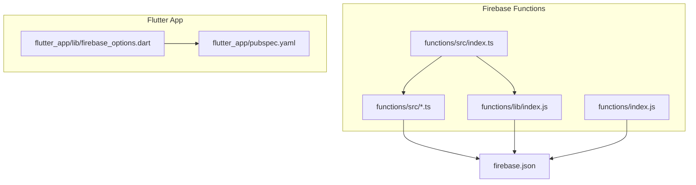
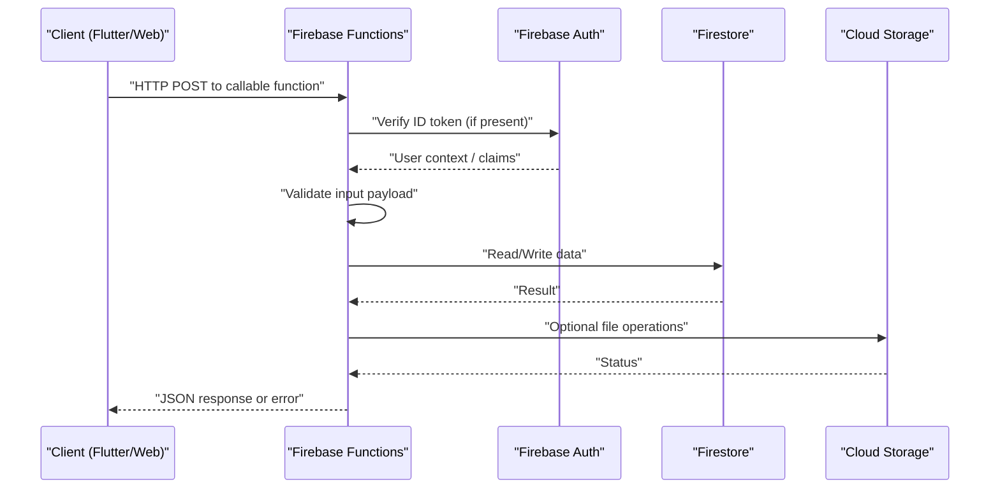
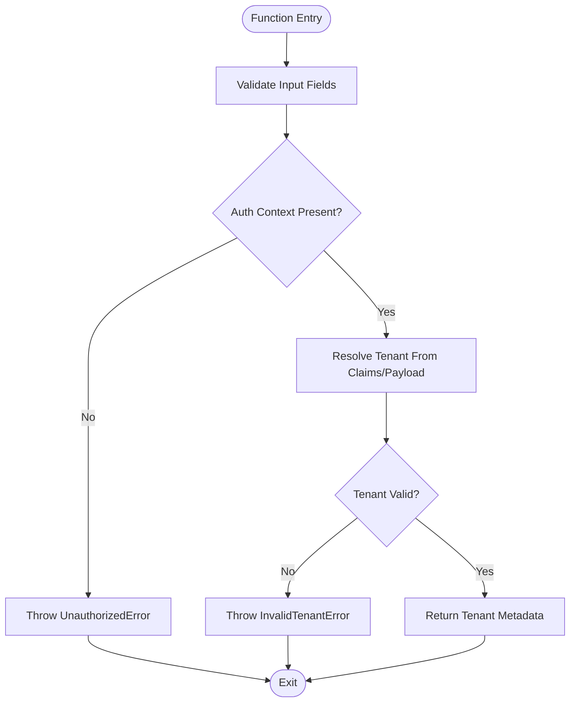
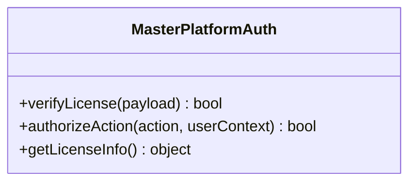
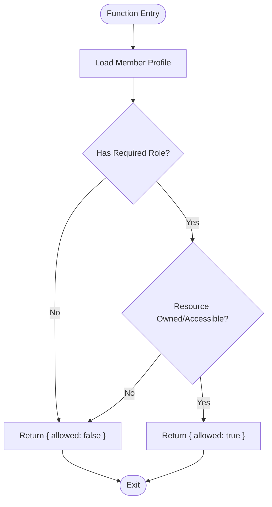
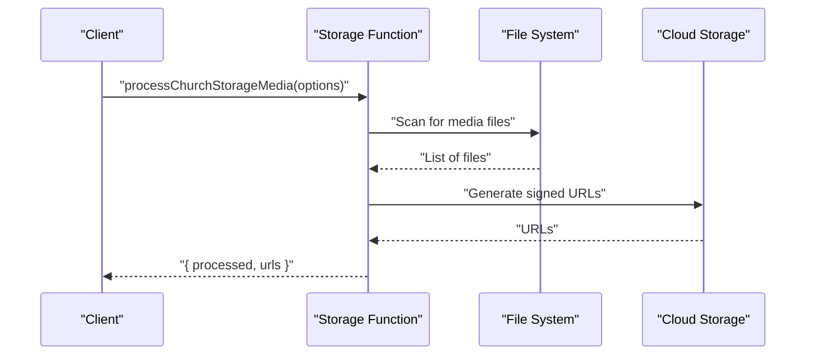
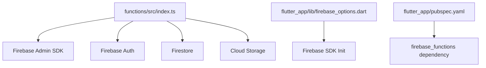

# Callable Functions

<cite>
**Referenced Files in This Document**
- [functions/src/index.ts](file://functions/src/index.ts)
- [functions/index.js](file://functions/index.js)
- [firebase.json](file://firebase.json)
- [functions/package.json](file://functions/package.json)
- [flutter_app/lib/firebase_options.dart](file://flutter_app/lib/firebase_options.dart)
- [flutter_app/pubspec.yaml](file://flutter_app/pubspec.yaml)
- [functions/src/tenantCallableResolve.ts](file://functions/src/tenantCallableResolve.ts)
- [functions/src/masterPlatformAuth.ts](file://functions/src/masterPlatformAuth.ts)
- [functions/src/memberAccessPolicy.ts](file://functions/src/memberAccessPolicy.ts)
- [functions/src/churchTenantFields.ts](file://functions/src/churchTenantFields.ts)
- [functions/src/churchTenantProvisioning.ts](file://functions/src/churchTenantProvisioning.ts)
- [functions/src/publicSignupEmail.ts](file://functions/src/publicSignupEmail.ts)
- [functions/src/membroSessionSync.ts](file://functions/src/membroSessionSync.ts)
- [functions/src/cleanupOrphanFiles.ts](file://functions/src/cleanupOrphanFiles.ts)
- [functions/src/storageDisplayUrls.ts](file://functions/src/storageDisplayUrls.ts)
- [functions/src/processChurchStorageMedia.ts](file://functions/src/processChurchStorageMedia.ts)
- [functions/src/panelDashboardCache.ts](file://functions/src/panelDashboardCache.ts)
- [functions/src/panelFinanceSummary.ts](file://functions/src/panelFinanceSummary.ts)
- [functions/src/reportsSnapshot.ts](file://functions/src/reportsSnapshot.ts)
</cite>

## Table of Contents
1. [Introduction](#introduction)
2. [Project Structure](#project-structure)
3. [Core Components](#core-components)
4. [Architecture Overview](#architecture-overview)
5. [Detailed Component Analysis](#detailed-component-analysis)
6. [Dependency Analysis](#dependency-analysis)
7. [Performance Considerations](#performance-considerations)
8. [Troubleshooting Guide](#troubleshooting-guide)
9. [Conclusion](#conclusion)
10. [Appendices](#appendices)

## Introduction
This document provides comprehensive guidance for Firebase callable functions that implement serverless business logic in this project. It covers function signatures, parameters, return values, execution context, authentication integration, error handling patterns, and performance considerations. It also includes client-side invocation examples using the Flutter SDK and web clients, details on function lifecycle, timeout limits, best practices for production deployment, debugging techniques, logging strategies, and monitoring approaches.

## Project Structure
The callable functions are implemented as a Node.js/TypeScript Firebase Cloud Functions module. The entry points include both TypeScript sources under functions/src and compiled JavaScript outputs under functions/lib, with an additional legacy index at functions/index.js. The Firebase configuration for functions is defined in firebase.json. The Flutter app initializes Firebase via generated options and depends on the Firebase Functions package.



**Diagram sources**
- [functions/src/index.ts](file://functions/src/index.ts)
- [functions/index.js](file://functions/index.js)
- [firebase.json](file://firebase.json)
- [flutter_app/lib/firebase_options.dart](file://flutter_app/lib/firebase_options.dart)
- [flutter_app/pubspec.yaml](file://flutter_app/pubspec.yaml)

**Section sources**
- [functions/src/index.ts](file://functions/src/index.ts)
- [functions/index.js](file://functions/index.js)
- [firebase.json](file://firebase.json)
- [flutter_app/lib/firebase_options.dart](file://flutter_app/lib/firebase_options.dart)
- [flutter_app/pubspec.yaml](file://flutter_app/pubspec.yaml)

## Core Components
This project organizes callable functions by feature domains such as tenant resolution, platform auth, member access policies, church provisioning, email notifications, session synchronization, storage processing, caching, and reporting. Each function encapsulates a specific business operation, validates inputs, enforces authorization, performs data operations, and returns structured results or errors.

Key responsibilities:
- Tenant resolution and multi-tenancy routing
- Platform-level authentication and license checks
- Member access policy enforcement
- Church tenant field management and provisioning
- Public signup email workflows
- Session synchronization for members
- Storage cleanup and media processing
- Dashboard and finance cache generation
- Reporting snapshots

**Section sources**
- [functions/src/tenantCallableResolve.ts](file://functions/src/tenantCallableResolve.ts)
- [functions/src/masterPlatformAuth.ts](file://functions/src/masterPlatformAuth.ts)
- [functions/src/memberAccessPolicy.ts](file://functions/src/memberAccessPolicy.ts)
- [functions/src/churchTenantFields.ts](file://functions/src/churchTenantFields.ts)
- [functions/src/churchTenantProvisioning.ts](file://functions/src/churchTenantProvisioning.ts)
- [functions/src/publicSignupEmail.ts](file://functions/src/publicSignupEmail.ts)
- [functions/src/membroSessionSync.ts](file://functions/src/membroSessionSync.ts)
- [functions/src/cleanupOrphanFiles.ts](file://functions/src/cleanupOrphanFiles.ts)
- [functions/src/storageDisplayUrls.ts](file://functions/src/storageDisplayUrls.ts)
- [functions/src/processChurchStorageMedia.ts](file://functions/src/processChurchStorageMedia.ts)
- [functions/src/panelDashboardCache.ts](file://functions/src/panelDashboardCache.ts)
- [functions/src/panelFinanceSummary.ts](file://functions/src/panelFinanceSummary.ts)
- [functions/src/reportsSnapshot.ts](file://functions/src/reportsSnapshot.ts)

## Architecture Overview
Callable functions are invoked from clients (Flutter or Web) over HTTPS. The Firebase Functions runtime authenticates the request using Firebase Auth tokens when available, extracts the caller identity, and passes it into the function context. Functions validate inputs, enforce policies, perform Firestore/Storage operations, and return JSON responses or throw typed errors.



**Diagram sources**
- [functions/src/index.ts](file://functions/src/index.ts)
- [functions/src/masterPlatformAuth.ts](file://functions/src/masterPlatformAuth.ts)
- [functions/src/memberAccessPolicy.ts](file://functions/src/memberAccessPolicy.ts)

## Detailed Component Analysis

### Tenant Resolution Function
Purpose: Resolve the active tenant for a callable request based on user claims, headers, or payload fields. Returns tenant metadata required for subsequent operations.

- Signature: callable function
- Parameters: { tenantHint?: string; churchId?: string }
- Return value: { tenantId, tenantName, settings }
- Execution context: Uses Firebase Auth context to determine ownership and permissions
- Error handling: Throws domain-specific errors for invalid tenants or unauthorized access



**Diagram sources**
- [functions/src/tenantCallableResolve.ts](file://functions/src/tenantCallableResolve.ts)

**Section sources**
- [functions/src/tenantCallableResolve.ts](file://functions/src/tenantCallableResolve.ts)

### Platform Authentication and License Checks
Purpose: Verify platform-level authentication and license validity for privileged operations. Integrates with master platform services and enforces licensing constraints.

- Signature: callable function
- Parameters: { action: string; payload: object }
- Return value: { authorized: boolean; licenseInfo: object }
- Execution context: Requires admin-like privileges or verified platform claims
- Error handling: Throws AuthorizationError or LicenseValidationError



**Diagram sources**
- [functions/src/masterPlatformAuth.ts](file://functions/src/masterPlatformAuth.ts)

**Section sources**
- [functions/src/masterPlatformAuth.ts](file://functions/src/masterPlatformAuth.ts)

### Member Access Policy Enforcement
Purpose: Enforce per-member access policies based on roles, church membership, and resource ownership.

- Signature: callable function
- Parameters: { resourceId: string; requestedAction: string }
- Return value: { allowed: boolean; reason: string }
- Execution context: Uses Firebase Auth UID and Firestore membership records
- Error handling: Throws PermissionDeniedError for insufficient privileges



**Diagram sources**
- [functions/src/memberAccessPolicy.ts](file://functions/src/memberAccessPolicy.ts)

**Section sources**
- [functions/src/memberAccessPolicy.ts](file://functions/src/memberAccessPolicy.ts)

### Church Tenant Fields Management
Purpose: Manage church-specific tenant fields, including backfills and schema migrations.

- Signature: callable function
- Parameters: { churchId: string; fields: object; operation: string }
- Return value: { updated: number, errors: array }
- Execution context: Admin or church owner role required
- Error handling: Throws FieldValidationException for invalid schemas

**Section sources**
- [functions/src/churchTenantFields.ts](file://functions/src/churchTenantFields.ts)

### Church Tenant Provisioning
Purpose: Provision new church tenants with default configurations, collections, and seed data.

- Signature: callable function
- Parameters: { churchId: string; config: object }
- Return value: { provisioned: boolean, details: object }
- Execution context: Requires provisioning privileges
- Error handling: Throws ProvisioningError on failures

**Section sources**
- [functions/src/churchTenantProvisioning.ts](file://functions/src/churchTenantProvisioning.ts)

### Public Signup Email Workflow
Purpose: Handle public signup requests and send confirmation emails.

- Signature: callable function
- Parameters: { email: string; name: string; churchId: string }
- Return value: { sent: boolean, messageId: string }
- Execution context: Validates email format and church existence
- Error handling: Throws EmailValidationError or SendFailureError

**Section sources**
- [functions/src/publicSignupEmail.ts](file://functions/src/publicSignupEmail.ts)

### Member Session Synchronization
Purpose: Sync member sessions across devices and platforms.

- Signature: callable function
- Parameters: { sessionId: string; deviceInfo: object; actions: array }
- Return value: { synced: boolean, conflicts: array }
- Execution context: Requires authenticated member
- Error handling: Throws SessionConflictError

**Section sources**
- [functions/src/membroSessionSync.ts](file://functions/src/membroSessionSync.ts)

### Storage Cleanup and Media Processing
Purpose: Clean up orphan files, generate display URLs, and process church media assets.

- Signature: callable function
- Parameters: { operation: string; paths: array; options: object }
- Return value: { processed: number, urls: array }
- Execution context: Requires storage write permissions
- Error handling: Throws StorageOperationError



**Diagram sources**
- [functions/src/cleanupOrphanFiles.ts](file://functions/src/cleanupOrphanFiles.ts)
- [functions/src/storageDisplayUrls.ts](file://functions/src/storageDisplayUrls.ts)
- [functions/src/processChurchStorageMedia.ts](file://functions/src/processChurchStorageMedia.ts)

**Section sources**
- [functions/src/cleanupOrphanFiles.ts](file://functions/src/cleanupOrphanFiles.ts)
- [functions/src/storageDisplayUrls.ts](file://functions/src/storageDisplayUrls.ts)
- [functions/src/processChurchStorageMedia.ts](file://functions/src/processChurchStorageMedia.ts)

### Dashboard and Finance Cache Generation
Purpose: Generate cached summaries for dashboard and financial reports.

- Signature: callable function
- Parameters: { churchId: string; timeRange: object }
- Return value: { cacheKey: string, data: object }
- Execution context: Requires read access to financial data
- Error handling: Throws CacheGenerationError

**Section sources**
- [functions/src/panelDashboardCache.ts](file://functions/src/panelDashboardCache.ts)
- [functions/src/panelFinanceSummary.ts](file://functions/src/panelFinanceSummary.ts)

### Reports Snapshot
Purpose: Create immutable snapshots of reports for auditing and archival.

- Signature: callable function
- Parameters: { reportId: string, format: string }
- Return value: { snapshotUrl: string, timestamp: string }
- Execution context: Requires report access permissions
- Error handling: Throws ReportSnapshotError

**Section sources**
- [functions/src/reportsSnapshot.ts](file://functions/src/reportsSnapshot.ts)

## Dependency Analysis
Callable functions depend on Firebase Admin SDK for database operations, Firebase Auth for identity verification, and external services for email and storage. The functions module is configured through firebase.json and initialized via the main index file.



**Diagram sources**
- [functions/src/index.ts](file://functions/src/index.ts)
- [flutter_app/lib/firebase_options.dart](file://flutter_app/lib/firebase_options.dart)
- [flutter_app/pubspec.yaml](file://flutter_app/pubspec.yaml)

**Section sources**
- [functions/src/index.ts](file://functions/src/index.ts)
- [flutter_app/lib/firebase_options.dart](file://flutter_app/lib/firebase_options.dart)
- [flutter_app/pubspec.yaml](file://flutter_app/pubspec.yaml)

## Performance Considerations
- Keep functions stateless and idempotent where possible
- Use batched writes for multiple Firestore operations
- Implement caching strategies for frequently accessed data
- Minimize cold starts by keeping dependencies lightweight
- Set appropriate timeouts based on operation complexity
- Use streaming for large data transfers
- Implement retry logic with exponential backoff for transient failures
- Monitor memory usage and optimize data structures

## Troubleshooting Guide
Common issues and solutions:
- Authentication failures: Verify ID token validity and expiration
- Permission denied: Check Firestore security rules and function-level authorization
- Timeout errors: Optimize database queries and reduce payload sizes
- Storage errors: Validate file paths and permissions
- Cold start delays: Pre-warm functions during peak hours

Debugging techniques:
- Use structured logging with correlation IDs
- Enable detailed error messages in development
- Monitor function execution metrics in Firebase Console
- Use local emulators for testing
- Implement health check endpoints

Monitoring approaches:
- Track error rates and latency percentiles
- Set up alerts for critical failures
- Log business metrics for analytics
- Use distributed tracing for complex workflows

**Section sources**
- [functions/src/index.ts](file://functions/src/index.ts)

## Conclusion
Firebase callable functions provide a powerful mechanism for implementing serverless business logic in this project. By following the patterns and best practices outlined in this document, developers can create secure, efficient, and maintainable functions that integrate seamlessly with the Flutter application and other clients. Proper authentication, error handling, and performance optimization are key to successful deployment and operation.

## Appendices

### Client-Side Invocation Examples

#### Flutter SDK Example
```dart
// Initialize Firebase Functions
final functions = FirebaseFunctions.instance;

// Call a function
final result = await functions.httpsCallable('tenantResolve').call({
  'churchId': 'church123',
  'tenantHint': 'main'
});

print(result.data);
```

#### Web Client Example
```javascript
// Initialize Firebase Functions
const functions = firebase.functions();

// Call a function
const result = await functions.httpsCallable('tenantResolve')({
  churchId: 'church123',
  tenantHint: 'main'
});

console.log(result.data);
```

### Function Lifecycle and Limits
- Maximum execution time: 9 minutes for HTTP functions
- Memory limits: 1GB standard, 2GB high memory instances
- Concurrent executions: Limited by project quotas
- Cold start times: Typically 1-3 seconds
- Retry behavior: Automatic retries for failed invocations

### Best Practices for Production Deployment
- Implement comprehensive error handling
- Use environment variables for configuration
- Set up proper logging and monitoring
- Test thoroughly with different user roles
- Implement rate limiting and throttling
- Use versioned APIs for backward compatibility
- Regularly update dependencies
- Monitor costs and optimize resource usage