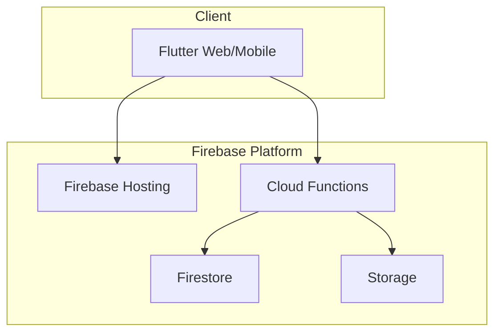
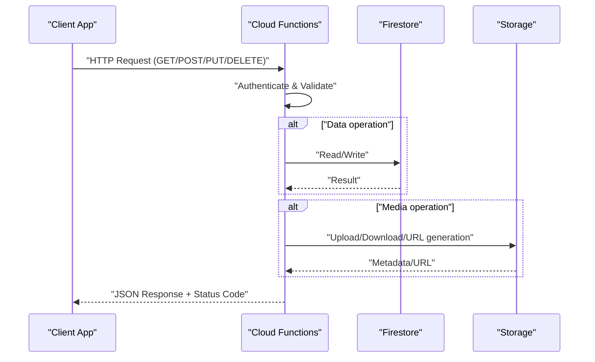
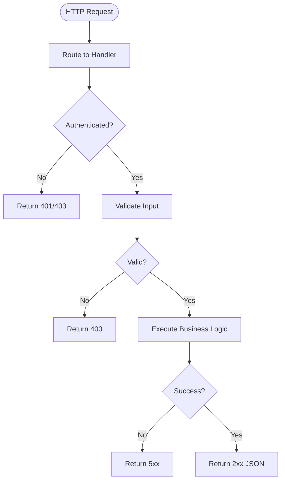
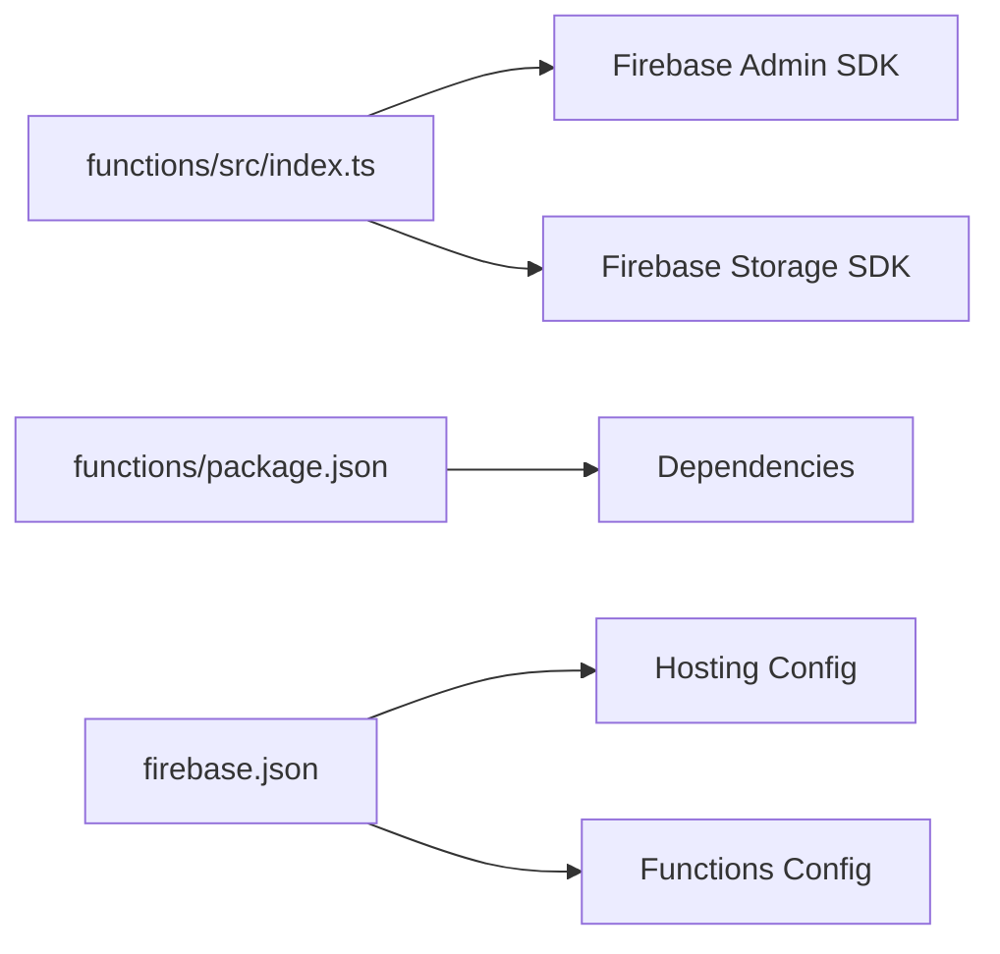

# REST API Endpoints

<cite>
**Referenced Files in This Document**
- [functions/src/index.ts](file://functions/src/index.ts)
- [functions/package.json](file://functions/package.json)
- [firebase.json](file://firebase.json)
- [firestore.rules](file://firestore.rules)
- [storage.rules](file://storage.rules)
</cite>

## Table of Contents
1. [Introduction](#introduction)
2. [Project Structure](#project-structure)
3. [Core Components](#core-components)
4. [Architecture Overview](#architecture-overview)
5. [Detailed Component Analysis](#detailed-component-analysis)
6. [Dependency Analysis](#dependency-analysis)
7. [Performance Considerations](#performance-considerations)
8. [Troubleshooting Guide](#troubleshooting-guide)
9. [Conclusion](#conclusion)
10. [Appendices](#appendices)

## Introduction
This document provides comprehensive REST API documentation for the Gestão Yahweh Premium system’s public HTTP endpoints. It focuses on Firebase Cloud Functions that expose HTTP(S) endpoints, including authentication requirements, request/response schemas, error handling, rate limiting considerations, and client implementation guidance. Where applicable, it also references Firestore and Storage security rules that govern access to data and media resources.

## Project Structure
The project is a multi-platform application with:
- A Flutter app (mobile/web/desktop)
- Firebase configuration and hosting
- Firebase Cloud Functions implementing business logic and HTTP endpoints
- Firestore and Storage security rules governing data and media access

Key areas relevant to REST APIs:
- functions/src/index.ts: Entry point for Cloud Functions, including HTTP function registration
- firebase.json: Hosting and Functions configuration
- firestore.rules and storage.rules: Access control for database and media

[No sources needed since this diagram shows conceptual workflow, not actual code structure]

**Section sources**
- [functions/src/index.ts](file://functions/src/index.ts)
- [firebase.json](file://firebase.json)
- [firestore.rules](file://firestore.rules)
- [storage.rules](file://storage.rules)

## Core Components
- HTTP entrypoint: The Cloud Functions index file registers HTTP functions that serve as REST endpoints. These functions handle authentication, input validation, business logic, and responses.
- Data layer: Firestore collections and documents are accessed via admin SDK or authenticated context within functions.
- Media layer: Storage buckets store and serve media assets; functions may generate signed URLs or metadata.
- Security: Firestore and Storage rules enforce tenant isolation, role-based access, and content policies.

**Section sources**
- [functions/src/index.ts](file://functions/src/index.ts)
- [functions/package.json](file://functions/package.json)
- [firestore.rules](file://firestore.rules)
- [storage.rules](file://storage.rules)

## Architecture Overview
The REST API follows a serverless architecture using Firebase Cloud Functions:
- Clients call HTTPS endpoints exposed by Cloud Functions.
- Functions authenticate requests using Firebase Auth tokens or custom headers.
- Functions read/write Firestore data and interact with Storage as needed.
- Responses are returned as JSON with appropriate status codes.

[No sources needed since this diagram shows conceptual workflow, not actual code structure]

## Detailed Component Analysis

### HTTP Entrypoint and Function Registration
- Purpose: Centralizes HTTP endpoint definitions and routes requests to handlers.
- Key responsibilities:
  - Register HTTP functions for specific paths
  - Parse and validate incoming requests
  - Enforce authentication and authorization
  - Invoke domain-specific handlers
  - Return standardized JSON responses and error formats

**Section sources**
- [functions/src/index.ts](file://functions/src/index.ts)

### Authentication and Authorization
- Authentication:
  - Prefer Firebase ID token verification for user-scoped operations
  - Use service accounts or platform tokens for admin-only endpoints
- Authorization:
  - Enforce tenant isolation based on church/tenant identifiers
  - Validate roles/permissions before mutating data
- Error handling:
  - 401 Unauthorized for missing/invalid tokens
  - 403 Forbidden for insufficient permissions

**Section sources**
- [functions/src/index.ts](file://functions/src/index.ts)
- [firestore.rules](file://firestore.rules)
- [storage.rules](file://storage.rules)

### Input Validation and Schema Enforcement
- Validate required fields, types, and constraints
- Sanitize inputs to prevent injection and malformed payloads
- Return detailed validation errors with field-level messages

**Section sources**
- [functions/src/index.ts](file://functions/src/index.ts)

### Data Access Patterns
- Read operations:
  - Query Firestore with indexes optimized for common filters
  - Paginate results where necessary
- Write operations:
  - Use transactions or batch writes for consistency
  - Apply tenant scoping to all mutations

**Section sources**
- [functions/src/index.ts](file://functions/src/index.ts)
- [firestore.rules](file://firestore.rules)

### Media Handling
- Uploads:
  - Accept multipart/form-data or base64-encoded payloads
  - Store under tenant-scoped paths
- Downloads:
  - Generate signed URLs for secure, time-limited access
- Metadata:
  - Maintain thumbnails and derived assets

**Section sources**
- [functions/src/index.ts](file://functions/src/index.ts)
- [storage.rules](file://storage.rules)

### Public Endpoints
- Examples include:
  - Church slug resolution
  - Public site media prefetch
  - Certificate validation helpers
- Characteristics:
  - No authentication required
  - Rate limiting recommended at gateway level
  - Strict input validation to prevent abuse

**Section sources**
- [functions/src/index.ts](file://functions/src/index.ts)

### Admin and Internal Endpoints
- Examples include:
  - Tenant provisioning and backfill tasks
  - Cache refreshers and dashboards
  - Maintenance utilities
- Characteristics:
  - Require admin/service account authentication
  - Restricted to internal use or trusted clients

**Section sources**
- [functions/src/index.ts](file://functions/src/index.ts)

## Dependency Analysis
- Cloud Functions depend on:
  - Firebase Admin SDK for Firestore and Auth
  - Storage SDK for media operations
  - Third-party libraries as declared in package.json
- Hosting serves static assets and redirects to functions when configured

**Diagram sources**
- [functions/src/index.ts](file://functions/src/index.ts)
- [functions/package.json](file://functions/package.json)
- [firebase.json](file://firebase.json)

**Section sources**
- [functions/package.json](file://functions/package.json)
- [firebase.json](file://firebase.json)

## Performance Considerations
- Cold starts:
  - Keep initialization lightweight
  - Reuse connections and caches across invocations
- Database queries:
  - Use composite indexes and limit result sets
  - Implement pagination and caching strategies
- Media operations:
  - Stream large files when possible
  - Use CDN-backed hosting for static assets
- Concurrency:
  - Avoid blocking I/O in synchronous paths
  - Offload heavy tasks to background triggers

[No sources needed since this section provides general guidance]

## Troubleshooting Guide
Common issues and resolutions:
- Authentication failures:
  - Verify token validity and expiration
  - Ensure correct audience and issuer settings
- Permission denied:
  - Check Firestore/Storage rules for tenant and role checks
  - Confirm caller identity and scopes
- Validation errors:
  - Inspect request payload against schema
  - Review field-level error messages
- Timeouts:
  - Optimize long-running operations
  - Use background tasks for heavy processing

**Section sources**
- [firestore.rules](file://firestore.rules)
- [storage.rules](file://storage.rules)

## Conclusion
The Gestão Yahweh Premium REST API leverages Firebase Cloud Functions to provide secure, scalable endpoints for data and media operations. By following the authentication, validation, and security guidelines outlined here, clients can reliably integrate with the system while maintaining performance and safety.

[No sources needed since this section summarizes without analyzing specific files]

## Appendices

### API Endpoint Reference Template
For each endpoint, provide:
- Method and URL pattern
- Authentication requirement
- Request schema (fields, types, constraints)
- Response schema (success and error structures)
- Status codes and meanings
- Example request and response
- Common use cases and pitfalls

[No sources needed since this section provides general guidance]

### Client Implementation Guidelines
- Preferred languages:
  - JavaScript/TypeScript (Node.js)
  - Python
  - Java/Kotlin (Android)
  - Swift/Objective-C (iOS)
- Best practices:
  - Always attach valid Firebase ID tokens for protected endpoints
  - Handle retries with exponential backoff
  - Respect rate limits and cache responses where appropriate
  - Log errors with correlation IDs for debugging

[No sources needed since this section provides general guidance]