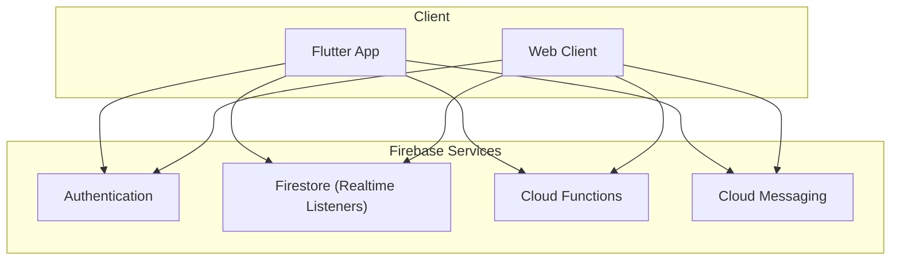
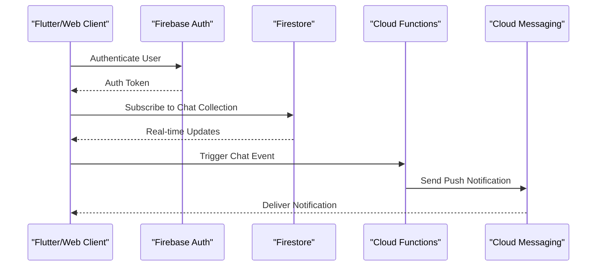
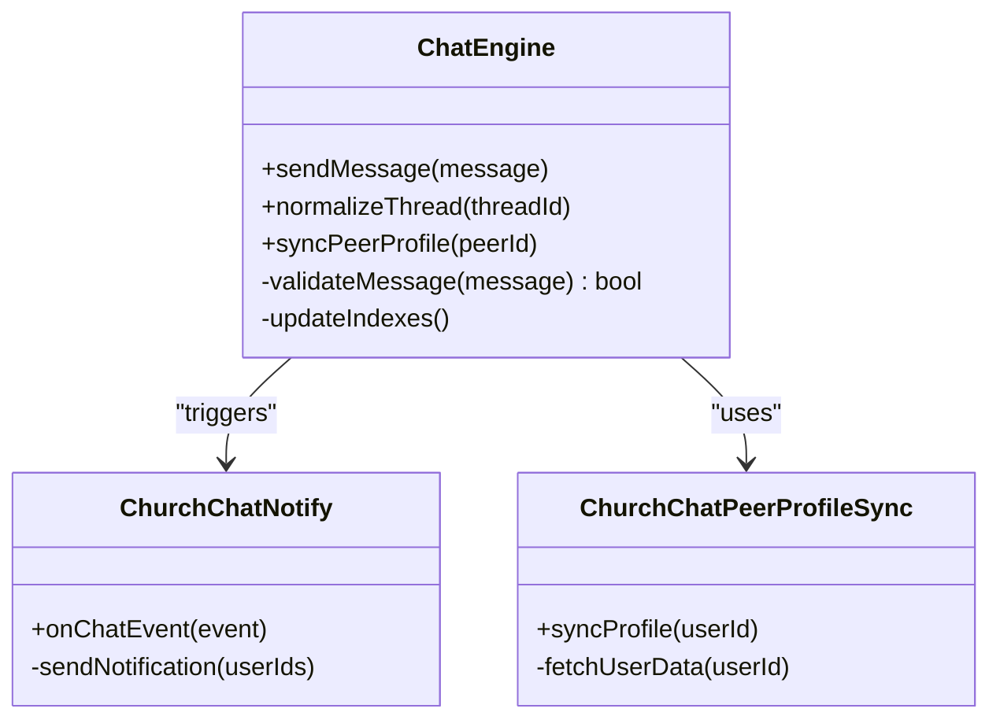
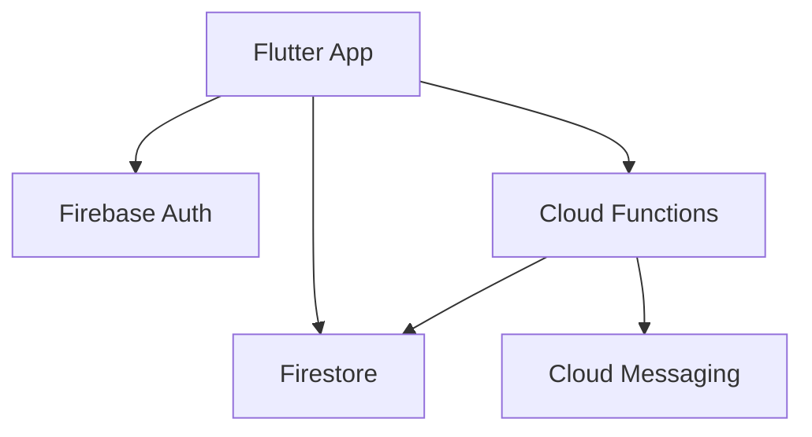

# WebSocket APIs

<cite>
**Referenced Files in This Document**
- [CHAT_ENGINE.md](file://CHAT_ENGINE.md)
- [functions/src/churchChatNotify.ts](file://functions/src/churchChatNotify.ts)
- [functions/src/churchChatPeerProfileSync.ts](file://functions/src/churchChatPeerProfileSync.ts)
- [functions/src/churchChatRetention.ts](file://functions/src/churchChatRetention.ts)
- [functions/src/membroSessionSync.ts](file://functions/src/membroSessionSync.ts)
- [flutter_app/lib/main.dart](file://flutter_app/lib/main.dart)
- [flutter_app/pubspec.yaml](file://flutter_app/pubspec.yaml)
- [firebase.json](file://firebase.json)
- [firestore.rules](file://firestore.rules)
</cite>

## Table of Contents
1. [Introduction](#introduction)
2. [Project Structure](#project-structure)
3. [Core Components](#core-components)
4. [Architecture Overview](#architecture-overview)
5. [Detailed Component Analysis](#detailed-component-analysis)
6. [Dependency Analysis](#dependency-analysis)
7. [Performance Considerations](#performance-considerations)
8. [Troubleshooting Guide](#troubleshooting-guide)
9. [Conclusion](#conclusion)
10. [Appendices](#appendices)

## Introduction
This document provides comprehensive WebSocket API documentation for real-time communication features in the project. It covers connection establishment, message protocols, event types, state management, chat messaging, notifications, and real-time data synchronization patterns. It also specifies message formats, authentication flows, connection lifecycle management, client implementation examples for Flutter and web platforms, reliability and reconnection strategies, error recovery mechanisms, performance optimization techniques, and scaling considerations.

## Project Structure
The project is a multi-platform Flutter application with Firebase Functions as the backend. Real-time communication is primarily implemented through Firebase Firestore’s real-time listeners and Cloud Messaging for push notifications. The chat engine and related server-side logic are defined in dedicated files under functions/src and documented in CHAT_ENGINE.md.



**Diagram sources**
- [firebase.json:1-50](file://firebase.json#L1-L50)
- [flutter_app/lib/main.dart:1-100](file://flutter_app/lib/main.dart#L1-L100)

**Section sources**
- [firebase.json:1-50](file://firebase.json#L1-L50)
- [flutter_app/lib/main.dart:1-100](file://flutter_app/lib/main.dart#L1-L100)

## Core Components
- Chat Engine: Centralized logic for chat operations, including message handling, thread normalization, and peer profile synchronization.
- Notifications: Server-side triggers to send push notifications upon chat events.
- Session Sync: Real-time synchronization of member sessions across devices.
- Retention Policies: Automated cleanup and retention rules for chat data.

Key files:
- Chat Engine Documentation: [CHAT_ENGINE.md](file://CHAT_ENGINE.md)
- Chat Notification Function: [churchChatNotify.ts](file://functions/src/churchChatNotify.ts)
- Peer Profile Sync Function: [churchChatPeerProfileSync.ts](file://functions/src/churchChatPeerProfileSync.ts)
- Retention Function: [churchChatRetention.ts](file://functions/src/churchChatRetention.ts)
- Member Session Sync Function: [membroSessionSync.ts](file://functions/src/membroSessionSync.ts)

**Section sources**
- [CHAT_ENGINE.md:1-200](file://CHAT_ENGINE.md#L1-L200)
- [functions/src/churchChatNotify.ts:1-100](file://functions/src/churchChatNotify.ts#L1-L100)
- [functions/src/churchChatPeerProfileSync.ts:1-100](file://functions/src/churchChatPeerProfileSync.ts#L1-L100)
- [functions/src/churchChatRetention.ts:1-100](file://functions/src/churchChatRetention.ts#L1-L100)
- [functions/src/membroSessionSync.ts:1-100](file://functions/src/membroSessionSync.ts#L1-L100)

## Architecture Overview
The real-time architecture leverages Firebase Firestore for live data synchronization and Cloud Functions for server-side processing. Clients connect via Flutter or Web, authenticate using Firebase Auth, and subscribe to Firestore collections for real-time updates. Chat events trigger Cloud Functions to handle notifications, sync peer profiles, and enforce retention policies.



**Diagram sources**
- [firebase.json:1-50](file://firebase.json#L1-L50)
- [functions/src/churchChatNotify.ts:1-100](file://functions/src/churchChatNotify.ts#L1-L100)

**Section sources**
- [firebase.json:1-50](file://firebase.json#L1-L50)
- [functions/src/churchChatNotify.ts:1-100](file://functions/src/churchChatNotify.ts#L1-L100)

## Detailed Component Analysis

### Chat Engine
The chat engine manages message creation, threading, and peer profile synchronization. It ensures consistency across clients and enforces business rules.



**Diagram sources**
- [CHAT_ENGINE.md:1-200](file://CHAT_ENGINE.md#L1-L200)
- [functions/src/churchChatNotify.ts:1-100](file://functions/src/churchChatNotify.ts#L1-L100)
- [functions/src/churchChatPeerProfileSync.ts:1-100](file://functions/src/churchChatPeerProfileSync.ts#L1-L100)

**Section sources**
- [CHAT_ENGINE.md:1-200](file://CHAT_ENGINE.md#L1-L200)
- [functions/src/churchChatNotify.ts:1-100](file://functions/src/churchChatNotify.ts#L1-L100)
- [functions/src/churchChatPeerProfileSync.ts:1-100](file://functions/src/churchChatPeerProfileSync.ts#L1-L100)

### Message Protocols
Messages follow a structured format with fields for content, metadata, and timestamps. Authentication is handled via Firebase Auth tokens, ensuring secure access to chat resources.

Key message fields:
- senderId: Unique identifier of the message sender
- recipientId: Unique identifier of the message recipient
- content: Text or media payload
- timestamp: Unix timestamp of message creation
- status: Delivery and read status flags

**Section sources**
- [CHAT_ENGINE.md:1-200](file://CHAT_ENGINE.md#L1-L200)

### Connection Lifecycle Management
Clients establish connections through Firebase Auth and Firestore subscriptions. Reconnection strategies include exponential backoff and jitter to handle network interruptions gracefully.

Lifecycle stages:
- Initialization: Configure Firebase services and authenticate user
- Subscription: Subscribe to relevant Firestore collections
- Maintenance: Monitor connection health and reconnect on failure
- Termination: Clean up subscriptions and release resources

**Section sources**
- [flutter_app/lib/main.dart:1-100](file://flutter_app/lib/main.dart#L1-L100)
- [flutter_app/pubspec.yaml:1-100](file://flutter_app/pubspec.yaml#L1-L100)

### Error Handling and Recovery
Error handling includes retry mechanisms for failed requests, offline queueing for messages, and graceful degradation when services are unavailable.

Recovery strategies:
- Retry with exponential backoff for transient errors
- Queue messages locally and sync when connectivity is restored
- Fallback to cached data when real-time updates are unavailable

**Section sources**
- [CHAT_ENGINE.md:1-200](file://CHAT_ENGINE.md#L1-L200)

## Dependency Analysis
The system relies on Firebase services for authentication, real-time data synchronization, and push notifications. Cloud Functions handle server-side logic for chat-related operations.



**Diagram sources**
- [firebase.json:1-50](file://firebase.json#L1-L50)
- [flutter_app/pubspec.yaml:1-100](file://flutter_app/pubspec.yaml#L1-L100)

**Section sources**
- [firebase.json:1-50](file://firebase.json#L1-L50)
- [flutter_app/pubspec.yaml:1-100](file://flutter_app/pubspec.yaml#L1-L100)

## Performance Considerations
Optimization techniques include efficient Firestore queries, batching updates, and minimizing payload sizes. Scaling considerations involve sharding chat collections and leveraging CDN for media assets.

Recommendations:
- Use composite indexes for complex queries
- Implement pagination for large datasets
- Cache frequently accessed data on the client side
- Monitor and optimize function execution times

**Section sources**
- [CHAT_ENGINE.md:1-200](file://CHAT_ENGINE.md#L1-L200)

## Troubleshooting Guide
Common issues include authentication failures, connection drops, and message delivery delays. Debugging steps involve checking Firebase logs, validating Firestore rules, and testing network connectivity.

Debugging tips:
- Enable verbose logging in development mode
- Verify Firestore security rules for proper access control
- Test reconnection logic under simulated network conditions
- Monitor Cloud Function invocations for errors

**Section sources**
- [firestore.rules:1-100](file://firestore.rules#L1-L100)

## Conclusion
The WebSocket API documentation outlines the real-time communication architecture, focusing on Firebase-based solutions for chat, notifications, and data synchronization. By following the provided guidelines, developers can implement robust, scalable, and user-friendly real-time features across Flutter and web platforms.

## Appendices

### Client Implementation Examples

#### Flutter Example
Initialize Firebase, authenticate users, and subscribe to chat collections for real-time updates.

```dart
// Initialize Firebase
await Firebase.initializeApp();

// Authenticate user
final user = await FirebaseAuth.instance.signInWithEmailAndPassword(
  email: 'user@example.com',
  password: 'password',
);

// Subscribe to chat collection
FirebaseFirestore.instance.collection('chats').snapshots().listen((snapshot) {
  // Handle real-time updates
});
```

#### Web Example
Use JavaScript SDK to connect to Firebase and listen for chat events.

```javascript
// Initialize Firebase
firebase.initializeApp(config);

// Authenticate user
firebase.auth().signInWithEmailAndPassword('user@example.com', 'password');

// Listen for chat updates
firebase.firestore().collection('chats').onSnapshot((snapshot) => {
  snapshot.docChanges().forEach((change) => {
    console.log(change.type, change.doc.data());
  });
});
```

**Section sources**
- [flutter_app/lib/main.dart:1-100](file://flutter_app/lib/main.dart#L1-L100)
- [firebase.json:1-50](file://firebase.json#L1-L50)