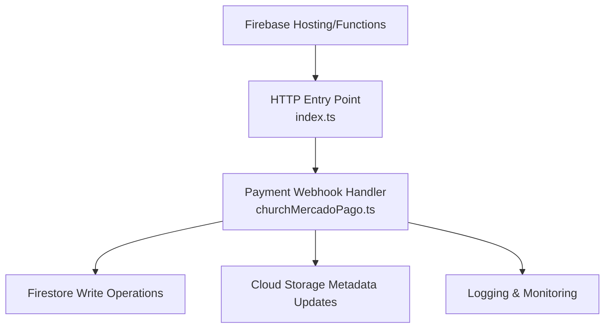
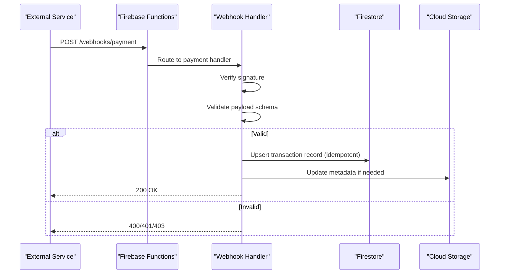
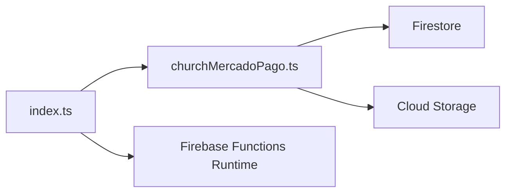
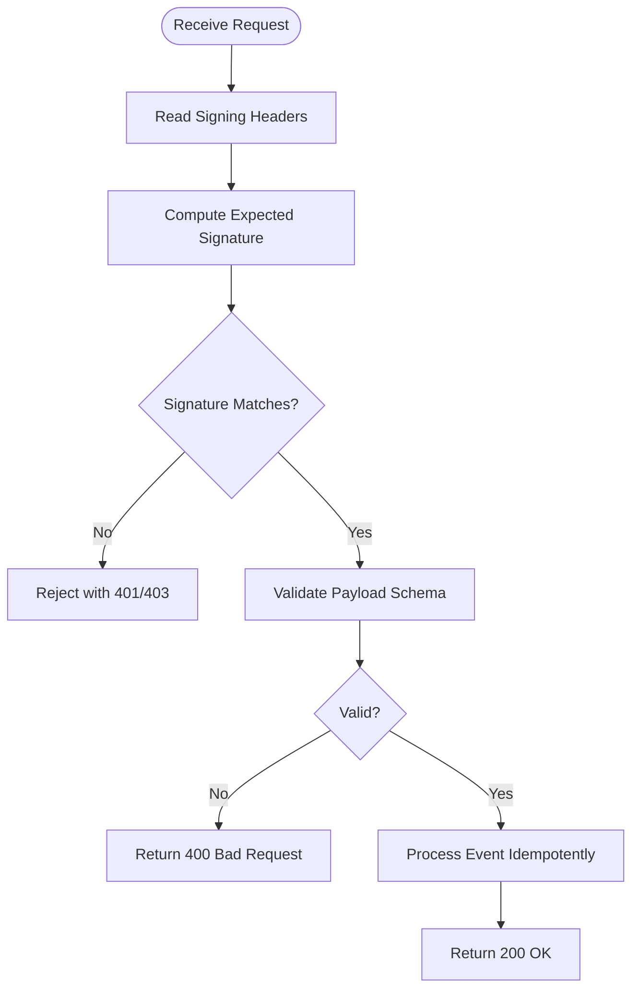

# Webhook Integrations

<cite>
**Referenced Files in This Document**
- [functions/src/index.ts](file://functions/src/index.ts)
- [functions/src/churchMercadoPago.ts](file://functions/src/churchMercadoPago.ts)
- [functions/lib/churchMercadoPago.js](file://functions/lib/churchMercadoPago.js)
- [functions/package.json](file://functions/package.json)
- [firebase.json](file://firebase.json)
- [firestore.rules](file://firestore.rules)
- [storage.rules](file://storage.rules)
</cite>

## Table of Contents
1. [Introduction](#introduction)
2. [Project Structure](#project-structure)
3. [Core Components](#core-components)
4. [Architecture Overview](#architecture-overview)
5. [Detailed Component Analysis](#detailed-component-analysis)
6. [Dependency Analysis](#dependency-analysis)
7. [Performance Considerations](#performance-considerations)
8. [Troubleshooting Guide](#troubleshooting-guide)
9. [Conclusion](#conclusion)
10. [Appendices](#appendices)

## Introduction
This document provides a comprehensive guide to webhook integrations for external service callbacks and event-driven architecture within the project. It focuses on how incoming webhooks are received, authenticated, validated, processed, and persisted, with emphasis on payment gateway webhooks (Mercado Pago), email services, and third-party integrations. It also covers signature verification, security measures, retry policies, monitoring, logging, and troubleshooting strategies.

## Project Structure
The webhook-related functionality is implemented as Firebase Cloud Functions. The main entry point registers HTTP endpoints and routes requests to specialized handlers. Payment-specific logic is encapsulated in dedicated modules.

**Diagram sources**
- [functions/src/index.ts](file://functions/src/index.ts)
- [functions/src/churchMercadoPago.ts](file://functions/src/churchMercadoPago.ts)

**Section sources**
- [functions/src/index.ts](file://functions/src/index.ts)
- [functions/src/churchMercadoPago.ts](file://functions/src/churchMercadoPago.ts)
- [functions/lib/churchMercadoPago.js](file://functions/lib/churchMercadoPago.js)
- [firebase.json](file://firebase.json)

## Core Components
- HTTP entry point: Registers and routes webhook endpoints.
- Payment webhook handler: Validates signatures, parses payloads, updates Firestore, and returns appropriate responses.
- Security rules: Enforce access control for Firestore and Storage resources touched by webhook processing.

Key responsibilities:
- Endpoint registration and routing
- Signature verification and payload validation
- Idempotent writes to Firestore
- Error handling and retries
- Logging and observability

**Section sources**
- [functions/src/index.ts](file://functions/src/index.ts)
- [functions/src/churchMercadoPago.ts](file://functions/src/churchMercadoPago.ts)
- [functions/lib/churchMercadoPago.js](file://functions/lib/churchMercadoPago.js)
- [firestore.rules](file://firestore.rules)
- [storage.rules](file://storage.rules)

## Architecture Overview
Incoming webhooks follow a consistent flow: receive request, authenticate via signature, validate payload, process business logic, persist changes, and respond. For payments, the handler ensures idempotency and reconciles state with the provider’s records.

**Diagram sources**
- [functions/src/index.ts](file://functions/src/index.ts)
- [functions/src/churchMercadoPago.ts](file://functions/src/churchMercadoPago.ts)

## Detailed Component Analysis

### HTTP Entry Point
- Purpose: Register webhook endpoints and route requests to specific handlers.
- Behavior: Parses HTTP methods and paths, delegates to domain-specific handlers, and standardizes error responses.

Implementation highlights:
- Centralized routing for all webhook endpoints
- Consistent response codes and headers
- Early rejection of malformed requests

**Section sources**
- [functions/src/index.ts](file://functions/src/index.ts)

### Payment Webhook Handler (Mercado Pago)
- Purpose: Receive and process Mercado Pago webhook events securely and reliably.
- Responsibilities:
  - Signature verification using provider-provided secrets or tokens
  - Payload validation against expected schema
  - Idempotent updates to Firestore to prevent duplicate processing
  - Updating related storage metadata when necessary
  - Returning correct HTTP status codes to signal success or failure

Processing flow:
1. Receive webhook request
2. Verify signature from headers
3. Parse and validate JSON body
4. Identify event type and entity IDs
5. Perform idempotent write to Firestore
6. Optionally update Cloud Storage metadata
7. Respond with 200 OK on success, or appropriate error code

Idempotency strategy:
- Use unique event IDs or transaction IDs to detect duplicates
- Check existing records before writing
- Avoid reprocessing identical events

Error handling:
- Reject invalid signatures immediately
- Return 4xx for client errors (invalid payload, missing fields)
- Log internal errors and return 5xx only for unexpected failures

Security considerations:
- Never trust the request source without signature verification
- Store secrets securely via environment variables
- Limit exposed endpoints to required paths only

**Section sources**
- [functions/src/churchMercadoPago.ts](file://functions/src/churchMercadoPago.ts)
- [functions/lib/churchMercadoPago.js](file://functions/lib/churchMercadoPago.js)

### Security Rules
- Firestore rules: Restrict writes to authorized contexts, including webhook-triggered operations.
- Storage rules: Control access to media files referenced by webhook-updated records.

Best practices:
- Validate tenant context in rules
- Ensure only verified functions can perform sensitive writes
- Use granular permissions per resource type

**Section sources**
- [firestore.rules](file://firestore.rules)
- [storage.rules](file://storage.rules)

### Configuration and Deployment
- Firebase configuration defines hosting and function deployment settings.
- Function dependencies are declared in package manifests.

Operational notes:
- Ensure environment variables for secrets are set in production
- Deploy updated functions after modifying endpoints or handlers
- Monitor logs during rollout to catch issues early

**Section sources**
- [firebase.json](file://firebase.json)
- [functions/package.json](file://functions/package.json)

## Dependency Analysis
The webhook system relies on Firebase Functions runtime and integrates with Firestore and Cloud Storage. Handlers depend on secure configuration and strict input validation.

**Diagram sources**
- [functions/src/index.ts](file://functions/src/index.ts)
- [functions/src/churchMercadoPago.ts](file://functions/src/churchMercadoPago.ts)

**Section sources**
- [functions/src/index.ts](file://functions/src/index.ts)
- [functions/src/churchMercadoPago.ts](file://functions/src/churchMercadoPago.ts)

## Performance Considerations
- Keep webhook handlers fast and idempotent; avoid heavy computations inside the request path.
- Use batched writes where appropriate to reduce Firestore round trips.
- Cache frequently accessed read-only data at the edge if needed.
- Implement timeouts and backoff strategies for downstream calls.
- Minimize payload sizes and avoid unnecessary logging of sensitive data.

[No sources needed since this section provides general guidance]

## Troubleshooting Guide
Common issues and resolutions:
- Signature verification failures:
  - Confirm secret alignment between provider and environment
  - Inspect header names and values used for signing
- Duplicate processing:
  - Verify idempotency keys are present and checked before writes
  - Review Firestore queries for uniqueness constraints
- Malformed payloads:
  - Add schema validation and log field presence checks
  - Return clear 4xx errors with actionable messages
- Slow responses:
  - Profile database writes and external calls
  - Offload long-running tasks to background jobs

Monitoring and logging:
- Log structured events with correlation IDs
- Track latency, error rates, and retry counts
- Alert on repeated signature failures or high error rates

**Section sources**
- [functions/src/churchMercadoPago.ts](file://functions/src/churchMercadoPago.ts)
- [functions/lib/churchMercadoPago.js](file://functions/lib/churchMercadoPago.js)

## Conclusion
The webhook integration follows a robust pattern centered on secure authentication, strict validation, idempotent processing, and reliable persistence. By adhering to these principles and leveraging Firebase Functions, Firestore, and Cloud Storage, the system ensures resilience and correctness for external callbacks such as payment gateways, email services, and third-party integrations.

[No sources needed since this section summarizes without analyzing specific files]

## Appendices

### Webhook Endpoints Reference
- Payment webhooks:
  - Endpoint: POST /webhooks/payment
  - Authentication: Signature verification via headers
  - Payload: Event object with provider-specific fields
  - Response: 200 OK on success; 4xx/5xx on errors

- Email service webhooks:
  - Endpoint: POST /webhooks/email
  - Authentication: Token-based or IP allowlist
  - Payload: Delivery/bounce/complaint events
  - Response: 200 OK upon acceptance

- Third-party integrations:
  - Endpoint: POST /webhooks/thirdparty/{service}
  - Authentication: Per-service signature or token
  - Payload: Domain-specific event structures
  - Response: Standardized acknowledgment

[No sources needed since this section provides conceptual definitions]

### Signature Verification Flow

[No sources needed since this diagram shows conceptual workflow, not actual code structure]

### Retry Policies
- Provider-side retries:
  - Respect exponential backoff and jitter
  - Honor rate limits and throttle accordingly
- Application-side handling:
  - Treat non-2xx responses as failures
  - Implement local deduplication to avoid double-processing
  - Queue failed events for asynchronous retry if necessary

[No sources needed since this section provides general guidance]

### Implementation Guide for Custom Webhooks
Steps to add a new webhook:
1. Define endpoint path and method in the HTTP entry point
2. Create a handler module for the specific service
3. Implement signature verification using provider documentation
4. Validate payload against an expected schema
5. Perform idempotent writes to Firestore
6. Update related resources (e.g., Storage metadata)
7. Return standardized responses and log outcomes
8. Configure environment secrets and deploy

Security checklist:
- Use HTTPS-only endpoints
- Validate signatures strictly
- Sanitize inputs and reject unknown fields
- Limit permissions in Firestore and Storage rules

[No sources needed since this section provides general guidance]