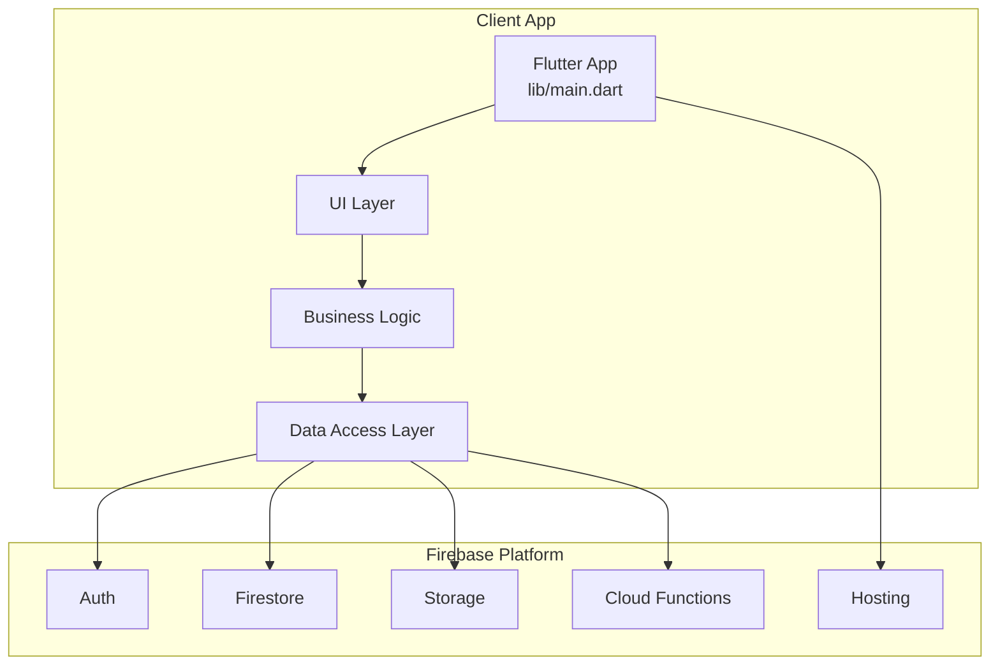
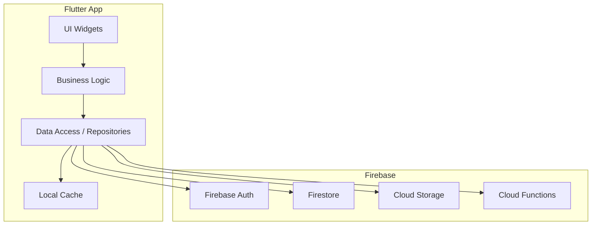
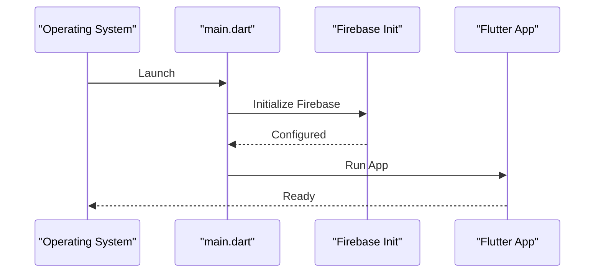
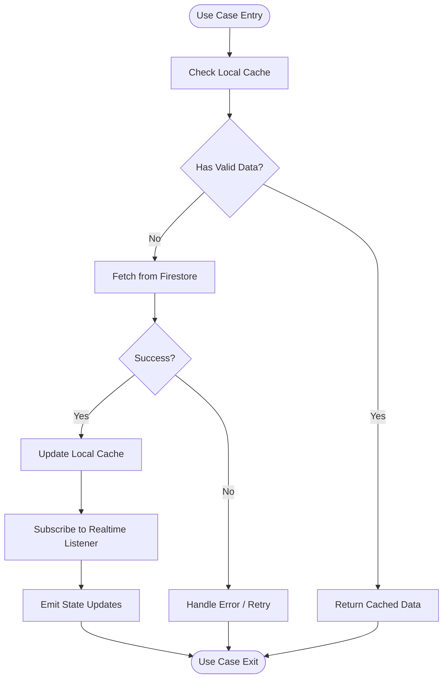
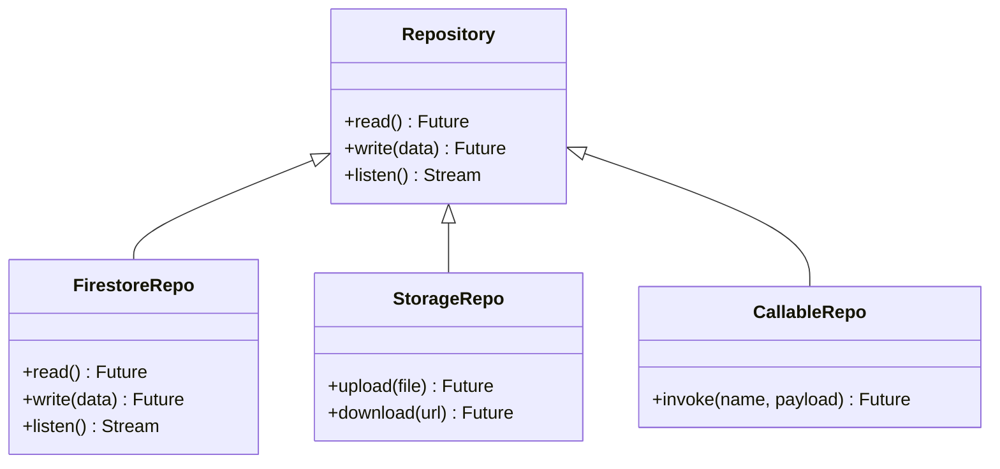
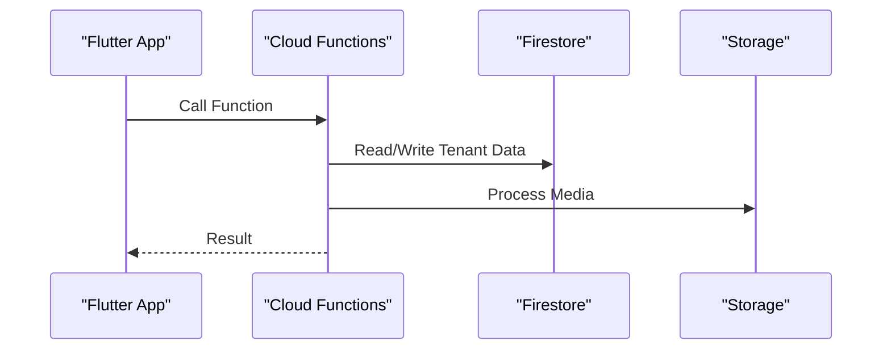
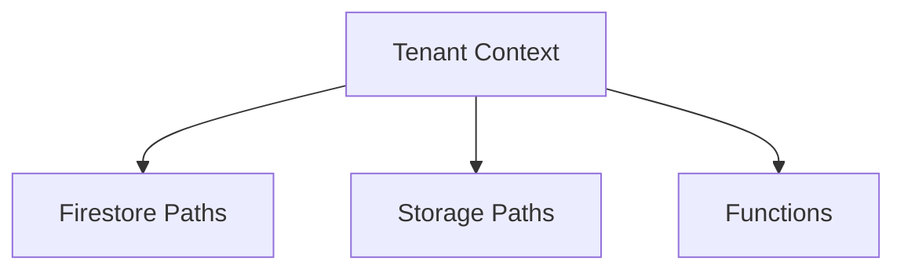
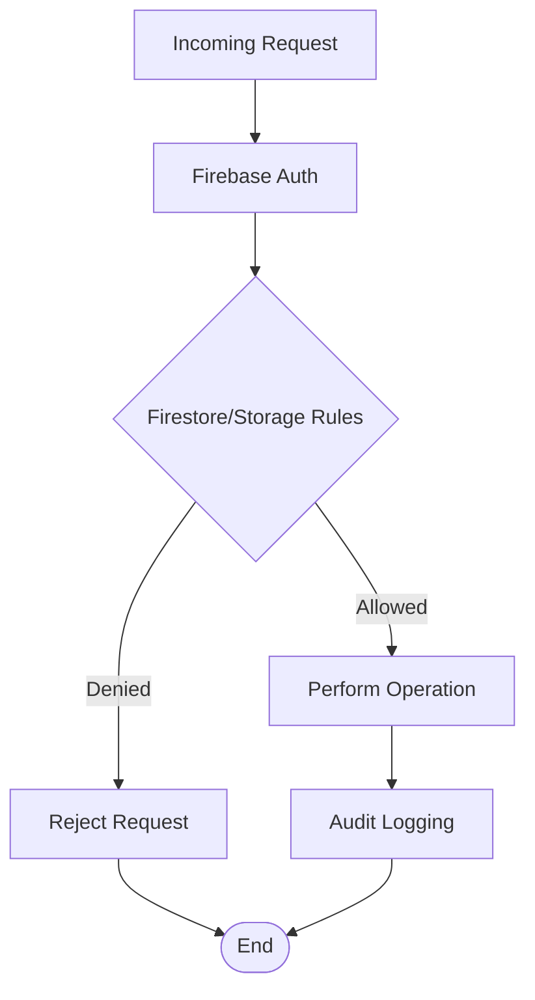
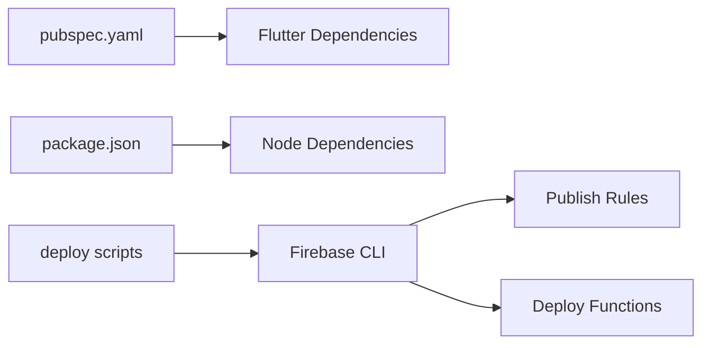
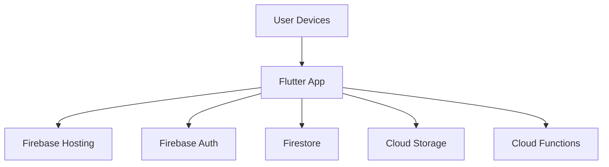

# Architecture & Design

<cite>
**Referenced Files in This Document**
- [flutter_app/lib/main.dart](file://flutter_app/lib/main.dart)
- [flutter_app/pubspec.yaml](file://flutter_app/pubspec.yaml)
- [functions/src/index.ts](file://functions/src/index.ts)
- [functions/package.json](file://functions/package.json)
- [firebase.json](file://firebase.json)
- [firestore.rules](file://firestore.rules)
- [storage.rules](file://storage.rules)
- [firestore.indexes.json](file://firestore.indexes.json)
- [flutter_app/firestore_rules_gcp_publish.cjs](file://flutter_app/firestore_rules_gcp_publish.cjs)
- [scripts/deploy_full_gestao_yahweh.ps1](file://scripts/deploy_full_gestao_yahweh.ps1)
- [docs/ARCHITECTURE_INSTANT_UX.md](file://docs/ARCHITECTURE_INSTANT_UX.md)
- [docs/ARCHITECTURE_PERFORMANCE_MULTI_PLATFORM.md](file://docs/ARCHITECTURE_PERFORMANCE_MULTI_PLATFORM.md)
- [docs/ARQUITETURA_RESILIENCIA.md](file://docs/ARQUITETURA_RESILIENCIA.md)
- [docs/FIREBASE_OBSERVABILITY.md](file://docs/FIREBASE_OBSERVABILITY.md)
- [docs/multi-tenant-impact-report.md](file://docs/multi-tenant-impact-report.md)
</cite>

## Table of Contents
1. [Introduction](#introduction)
2. [Project Structure](#project-structure)
3. [Core Components](#core-components)
4. [Architecture Overview](#architecture-overview)
5. [Detailed Component Analysis](#detailed-component-analysis)
6. [Dependency Analysis](#dependency-analysis)
7. [Performance Considerations](#performance-considerations)
8. [Troubleshooting Guide](#troubleshooting-guide)
9. [Conclusion](#conclusion)
10. [Appendices](#appendices)

## Introduction
This document describes the architecture and design of the Gestão Yahweh Premium system, a multi-tenant, offline-first Flutter application backed by Firebase (Firestore, Storage, Functions, Auth). It explains how Clean Architecture principles are applied across UI, business logic, and data layers; how multi-tenancy is implemented per tenant (“church”); and how server-side Cloud Functions complement client capabilities for security, orchestration, and performance. The document also covers real-time synchronization strategies, scalability considerations, deployment topology, and technology stack choices.

## Project Structure
The repository follows a monorepo layout with three primary areas:
- flutter_app: Cross-platform Flutter application (Android, iOS, Web, Windows, macOS, Linux)
- functions: Serverless Cloud Functions (TypeScript/JavaScript) for backend logic
- Root configuration and scripts: Firebase configuration, rules, indexes, and deployment automation

**Diagram sources**
- [flutter_app/lib/main.dart](file://flutter_app/lib/main.dart)
- [functions/src/index.ts](file://functions/src/index.ts)
- [firebase.json](file://firebase.json)

**Section sources**
- [flutter_app/lib/main.dart](file://flutter_app/lib/main.dart)
- [flutter_app/pubspec.yaml](file://flutter_app/pubspec.yaml)
- [functions/src/index.ts](file://functions/src/index.ts)
- [functions/package.json](file://functions/package.json)
- [firebase.json](file://firebase.json)

## Core Components
- Client app entrypoint initializes platform-specific configurations and bootstraps the Flutter engine.
- Business logic layer implements domain use cases, state management, and offline-first caching.
- Data access layer abstracts Firestore, Storage, and callable functions behind repositories.
- Cloud Functions encapsulate server-side operations such as tenant provisioning, media processing, reminders, and integrations.
- Security boundaries are enforced via Firestore and Storage rules, with additional validation in Functions.

Key responsibilities:
- UI: Presentation, navigation, user interactions
- Business Logic: Domain rules, state transitions, offline sync orchestration
- Data Access: Repository pattern, local cache, remote sync, error handling
- Functions: Secure server-side execution, background jobs, third-party integrations

**Section sources**
- [flutter_app/lib/main.dart](file://flutter_app/lib/main.dart)
- [functions/src/index.ts](file://functions/src/index.ts)

## Architecture Overview
The system applies Clean Architecture to separate concerns and improve testability and maintainability. Multi-tenancy isolates each church’s data and configuration. Offline-first ensures responsive UX even without connectivity, while real-time listeners keep clients synchronized when online.

**Diagram sources**
- [flutter_app/lib/main.dart](file://flutter_app/lib/main.dart)
- [functions/src/index.ts](file://functions/src/index.ts)
- [firebase.json](file://firebase.json)

## Detailed Component Analysis

### Flutter App Entry and Initialization
- Initializes Firebase options per platform and configures URL strategy for web.
- Sets up theme, localization, and global services before running the app.

**Diagram sources**
- [flutter_app/lib/main.dart](file://flutter_app/lib/main.dart)

**Section sources**
- [flutter_app/lib/main.dart](file://flutter_app/lib/main.dart)

### Business Logic and Offline-First Sync
- Implements use cases that coordinate local cache updates and remote synchronization.
- Uses real-time listeners to reflect changes instantly when connected.
- Applies conflict resolution and optimistic updates for smooth UX.

[No sources needed since this diagram shows conceptual workflow, not actual code structure]

### Data Access Layer and Repositories
- Abstracts persistence behind repository interfaces.
- Manages Firestore reads/writes, Storage uploads/downloads, and callable function invocations.
- Ensures consistent error handling and retry policies.

[No sources needed since this diagram shows conceptual relationships]

### Cloud Functions Backend
- Centralizes server-side logic including tenant provisioning, reminders, media processing, and analytics.
- Exposes callable endpoints for secure client interactions.
- Orchestrates background tasks and integrates with external services.

**Diagram sources**
- [functions/src/index.ts](file://functions/src/index.ts)

**Section sources**
- [functions/src/index.ts](file://functions/src/index.ts)
- [functions/package.json](file://functions/package.json)

### Multi-Tenant Architecture
- Each “church” is isolated via dedicated collections and paths under Firestore and Storage.
- Functions enforce tenant context and validate permissions.
- Client resolves tenant context early and scopes all requests accordingly.

[No sources needed since this diagram shows conceptual relationships]

**Section sources**
- [docs/multi-tenant-impact-report.md](file://docs/multi-tenant-impact-report.md)

### Security Boundaries and Rules
- Firestore and Storage rules enforce read/write permissions based on authenticated users and tenant membership.
- Functions provide additional validation and authorization checks.
- Hosting serves static assets with appropriate headers and CSP.

**Diagram sources**
- [firestore.rules](file://firestore.rules)
- [storage.rules](file://storage.rules)

**Section sources**
- [firestore.rules](file://firestore.rules)
- [storage.rules](file://storage.rules)

## Dependency Analysis
The Flutter app depends on Firebase SDKs and plugins defined in pubspec.yaml. Cloud Functions depend on Node.js modules specified in package.json. Deployment scripts orchestrate builds and rule publishing.

**Diagram sources**
- [flutter_app/pubspec.yaml](file://flutter_app/pubspec.yaml)
- [functions/package.json](file://functions/package.json)
- [scripts/deploy_full_gestao_yahweh.ps1](file://scripts/deploy_full_gestao_yahweh.ps1)

**Section sources**
- [flutter_app/pubspec.yaml](file://flutter_app/pubspec.yaml)
- [functions/package.json](file://functions/package.json)
- [scripts/deploy_full_gestao_yahweh.ps1](file://scripts/deploy_full_gestao_yahweh.ps1)

## Performance Considerations
- Offline-first caching reduces latency and improves resilience.
- Real-time listeners minimize polling and ensure timely updates.
- Indexed queries and optimized Firestore rules reduce read costs and latency.
- Media processing offloaded to Cloud Functions avoids blocking UI threads.

Recommendations:
- Use composite indexes judiciously to support common queries.
- Implement pagination and virtualization for large lists.
- Cache frequently accessed data locally with TTL strategies.
- Monitor performance via Firebase Analytics and Observability tools.

**Section sources**
- [docs/ARCHITECTURE_INSTANT_UX.md](file://docs/ARCHITECTURE_INSTANT_UX.md)
- [docs/ARCHITECTURE_PERFORMANCE_MULTI_PLATFORM.md](file://docs/ARCHITECTURE_PERFORMANCE_MULTI_PLATFORM.md)
- [docs/ARQUITETURA_RESILIENCIA.md](file://docs/ARQUITETURA_RESILIENCIA.md)
- [docs/FIREBASE_OBSERVABILITY.md](file://docs/FIREBASE_OBSERVABILITY.md)

## Troubleshooting Guide
Common issues and resolutions:
- Authentication failures: Verify Firebase Auth configuration and token validity.
- Permission denied: Review Firestore and Storage rules for tenant scoping.
- Sync conflicts: Implement deterministic conflict resolution strategies.
- Performance bottlenecks: Analyze query patterns and optimize indexes.

Debugging steps:
- Enable verbose logging in development mode.
- Use Firebase Emulator Suite for local testing.
- Inspect Cloud Functions logs for server-side errors.
- Validate rules using Firestore Rules Playground.

**Section sources**
- [docs/FIREBASE_OBSERVABILITY.md](file://docs/FIREBASE_OBSERVABILITY.md)

## Conclusion
Gestão Yahweh Premium leverages Clean Architecture, multi-tenancy, and offline-first design to deliver a robust, scalable, and responsive cross-platform application. Firebase provides a comprehensive backend ecosystem, while Cloud Functions extend capabilities for complex operations. The separation between client and server ensures security, maintainability, and performance optimization opportunities.

## Appendices

### Technology Stack
- Frontend: Flutter (Android, iOS, Web, Desktop)
- Backend: Firebase (Auth, Firestore, Storage, Functions, Hosting)
- DevOps: GitHub Actions, CodeMagic, PowerShell scripts

### Deployment Topology

[No sources needed since this diagram shows conceptual topology]