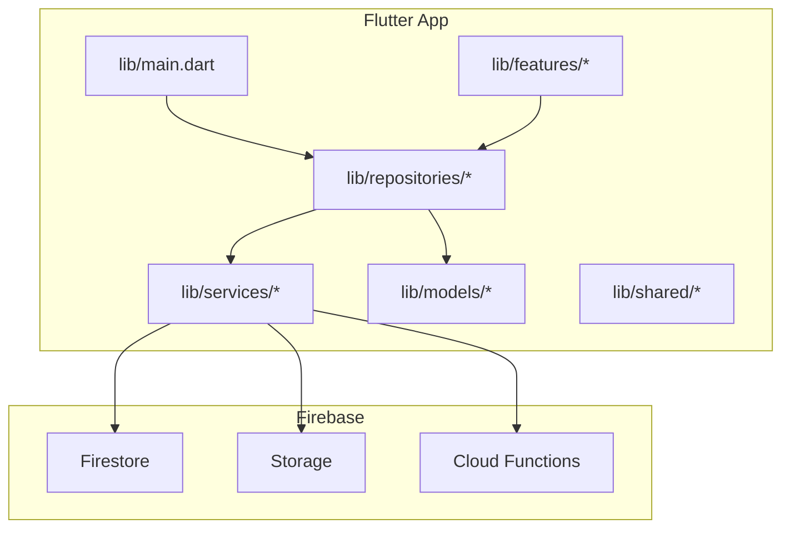
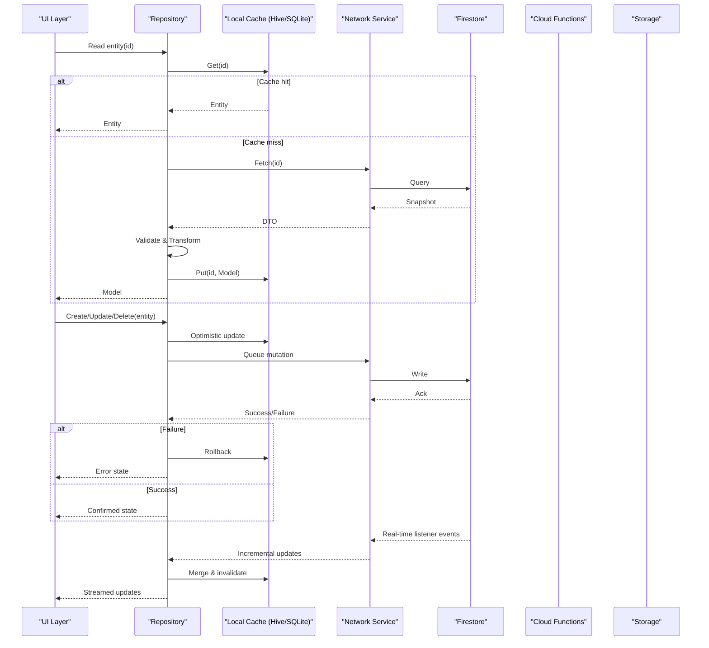
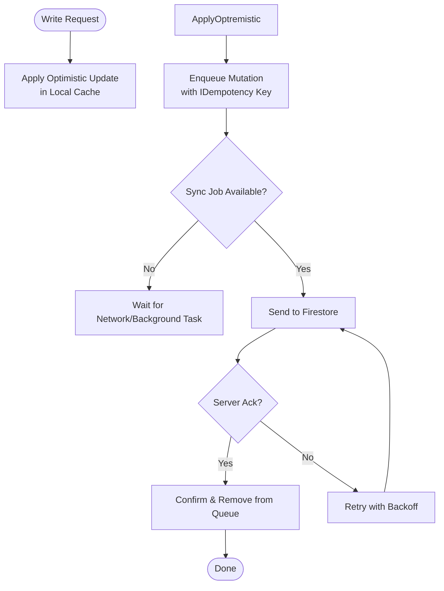
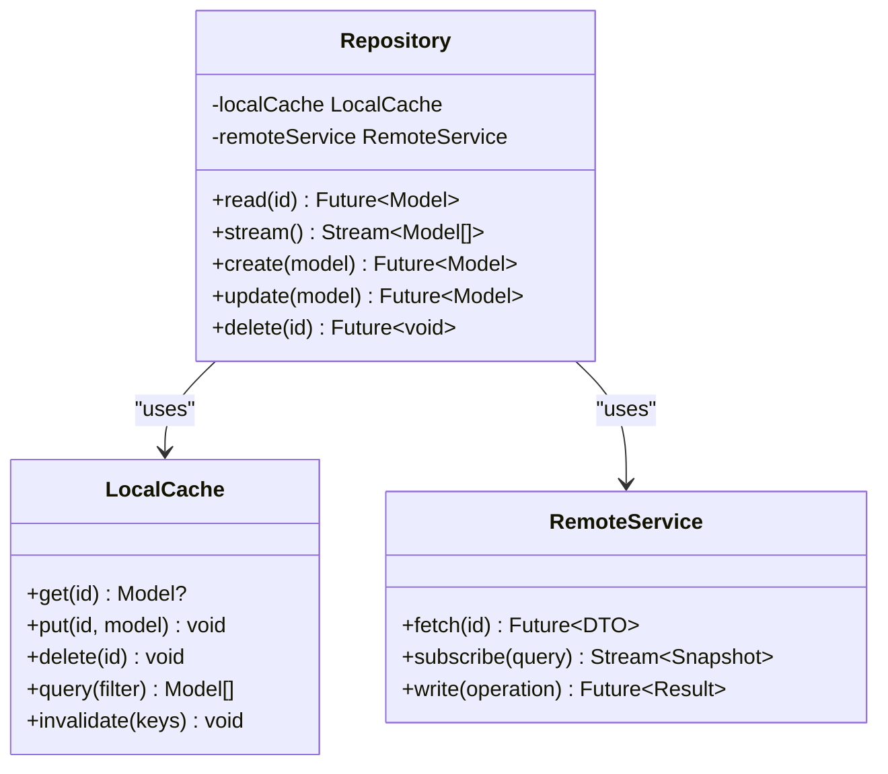
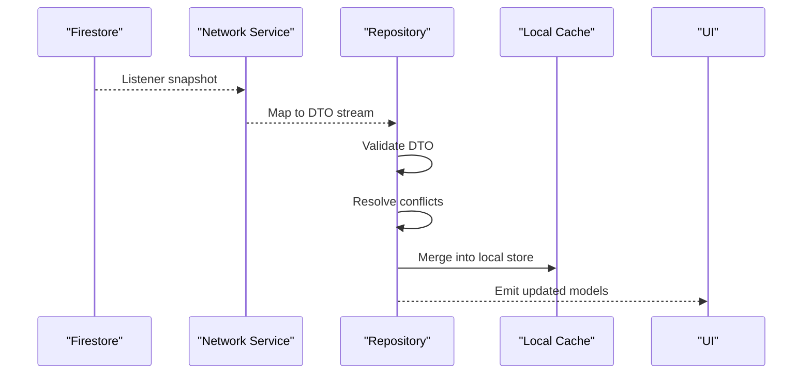
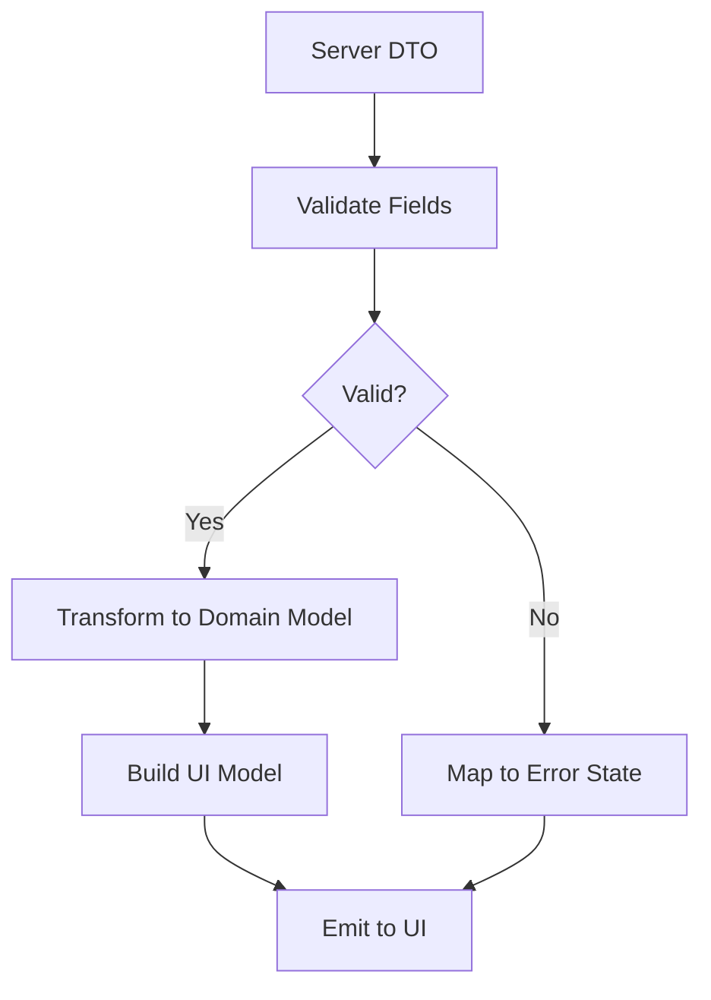
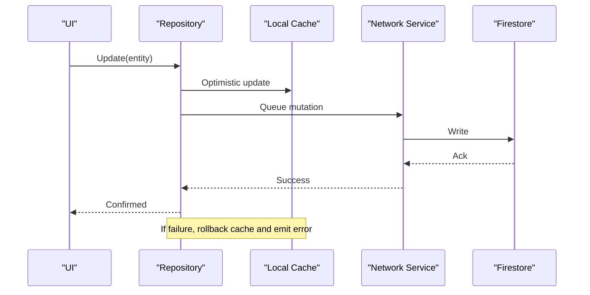
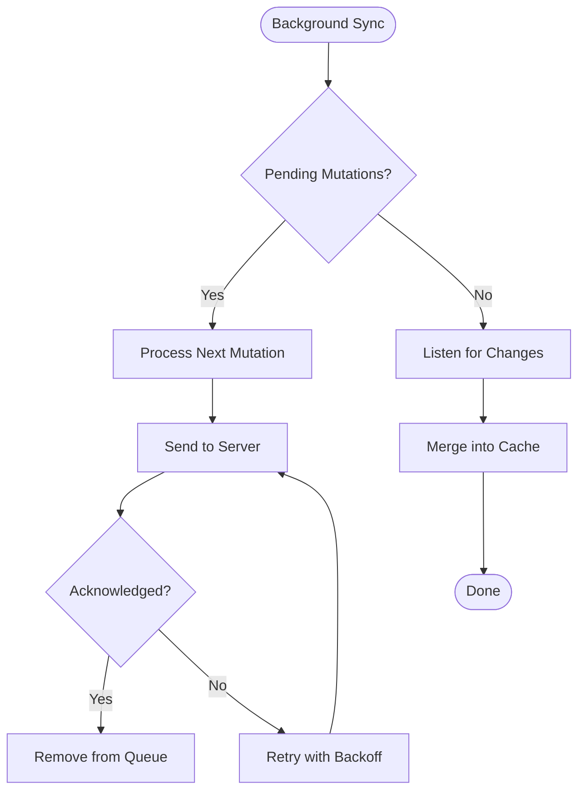
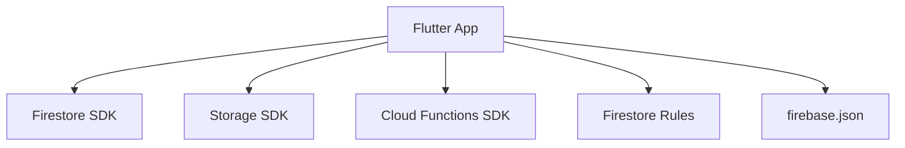

# Data Flow & Synchronization

<cite>
**Referenced Files in This Document**
- [main.dart](file://flutter_app/lib/main.dart)
- [pubspec.yaml](file://flutter_app/pubspec.yaml)
- [firestore.rules](file://firestore.rules)
- [storage.rules](file://storage.rules)
- [firebase.json](file://flutter_app/firebase.json)
- [ARCHITECTURE_PERFORMANCE_MULTI_PLATFORM.md](file://docs/ARCHITECTURE_PERFORMANCE_MULTI_PLATFORM.md)
- [ARCHITECTURE_PERFORMANCE_V4.md](file://docs/ARCHITECTURE_PERFORMANCE_V4.md)
- [RELATORIO_OFFLINE_FIRST_FASE1_FASE2.md](file://docs/RELATORIO_OFFLINE_FIRST_FASE1_FASE2.md)
- [FIREBASE_OBSERVABILITY.md](file://docs/FIREBASE_OBSERVABILITY.md)
- [CAMADA_DADOS_ESTABILIDADE.md](file://docs/CAMADA_DADOS_ESTABILIDADE.md)
- [ARQUITETURA_RESILIENCIA.md](file://docs/ARQUITETURA_RESILIENCIA.md)
</cite>

## Table of Contents
1. [Introduction](#introduction)
2. [Project Structure](#project-structure)
3. [Core Components](#core-components)
4. [Architecture Overview](#architecture-overview)
5. [Detailed Component Analysis](#detailed-component-analysis)
6. [Dependency Analysis](#dependency-analysis)
7. [Performance Considerations](#performance-considerations)
8. [Troubleshooting Guide](#troubleshooting-guide)
9. [Conclusion](#conclusion)

## Introduction
This document explains the data flow and synchronization patterns used by Gestão Yahweh Premium, focusing on an offline-first architecture with local caching (Hive/SQLite) and real-time synchronization with Firestore. It covers the repository pattern for data abstraction, conflict resolution strategies, background sync processes, data transformation pipelines from server responses to UI models, validation and error handling, real-time listeners, optimistic updates, rollback mechanisms, and performance optimizations such as pagination, lazy loading, and cache invalidation. It also provides guidance for handling network failures, ensuring data consistency, and debugging synchronization issues across distributed systems.

## Project Structure
The Flutter application is organized into feature-oriented modules under flutter_app/lib, with shared infrastructure for repositories, services, models, and utilities. Firebase configuration and rules are defined at the project root and within the Flutter app directory. Documentation artifacts describe performance, resilience, and offline-first design decisions.

**Diagram sources**
- [main.dart](file://flutter_app/lib/main.dart)
- [pubspec.yaml](file://flutter_app/pubspec.yaml)

**Section sources**
- [main.dart](file://flutter_app/lib/main.dart)
- [pubspec.yaml](file://flutter_app/pubspec.yaml)

## Core Components
- Offline-first data layer: Local persistence via Hive or SQLite, providing immediate reads and writes while queuing mutations for later sync.
- Repository pattern: Abstraction over local and remote data sources, exposing consistent APIs to features and UI.
- Real-time sync: Firestore listeners feed incremental updates into local caches; mutations are queued and reconciled.
- Background sync: Periodic or event-driven jobs reconcile pending operations and resolve conflicts.
- Data transformation pipeline: Server DTOs are validated and transformed into domain models and UI models.
- Optimistic UI: Immediate local updates with rollback on failure.
- Performance: Pagination, lazy loading, and cache invalidation strategies ensure responsive UX.

**Section sources**
- [ARCHITECTURE_PERFORMANCE_MULTI_PLATFORM.md](file://docs/ARCHITECTURE_PERFORMANCE_MULTI_PLATFORM.md)
- [ARCHITECTURE_PERFORMANCE_V4.md](file://docs/ARCHITECTURE_PERFORMANCE_V4.md)
- [RELATORIO_OFFLINE_FIRST_FASE1_FASE2.md](file://docs/RELATORIO_OFFLINE_FIRST_FASE1_FASE2.md)
- [FIREBASE_OBSERVABILITY.md](file://docs/FIREBASE_OBSERVABILITY.md)
- [CAMADA_DADOS_ESTABILIDADE.md](file://docs/CAMADA_DADOS_ESTABILIDADE.md)
- [ARQUITETURA_RESILIENCIA.md](file://docs/ARQUITETURA_RESILIENCIA.md)

## Architecture Overview
The system implements an offline-first architecture where the UI interacts with a repository that manages local and remote data sources. Firestore serves as the source of truth and real-time channel. Cloud Functions handle server-side transformations and background tasks. Storage handles media assets.

**Diagram sources**
- [firestore.rules](file://firestore.rules)
- [storage.rules](file://storage.rules)
- [firebase.json](file://flutter_app/firebase.json)

## Detailed Component Analysis

### Offline-First Data Layer
- Local cache stores entities keyed by stable IDs, with metadata for versioning and sync status.
- Writes are applied locally first (optimistic), then enqueued for background sync.
- Reads prefer local cache; fallback to network when missing or stale.
- Cache invalidation triggers on explicit updates or incoming real-time changes.

**Section sources**
- [RELATORIO_OFFLINE_FIRST_FASE1_FASE2.md](file://docs/RELATORIO_OFFLINE_FIRST_FASE1_FASE2.md)
- [CAMADA_DADOS_ESTABILIDADE.md](file://docs/CAMADA_DADOS_ESTABILIDADE.md)

### Repository Pattern Implementation
- Repositories expose unified methods for CRUD and queries.
- Each repository coordinates between local cache and remote service.
- Repositories handle transformation, validation, and error mapping.
- They manage subscription lifecycles for real-time streams.

**Section sources**
- [ARCHITECTURE_PERFORMANCE_MULTI_PLATFORM.md](file://docs/ARCHITECTURE_PERFORMANCE_MULTI_PLATFORM.md)
- [ARCHITECTURE_PERFORMANCE_V4.md](file://docs/ARCHITECTURE_PERFORMANCE_V4.md)

### Real-Time Synchronization with Firestore
- Firestore listeners provide incremental updates to repositories.
- Repositories merge incoming snapshots into local cache, preserving user edits and conflict resolution policies.
- Conflict resolution strategies include last-write-wins with timestamps, field-level merges, or custom business rules.

**Section sources**
- [FIREBASE_OBSERVABILITY.md](file://docs/FIREBASE_OBSERVABILITY.md)
- [firestore.rules](file://firestore.rules)

### Data Transformation Pipeline
- Server DTOs are validated against schema constraints.
- DTOs are transformed into domain models and UI models.
- Errors during validation or transformation are mapped to user-friendly states.
- The pipeline ensures type safety and consistent shapes across layers.

**Section sources**
- [ARCHITECTURE_PERFORMANCE_V4.md](file://docs/ARCHITECTURE_PERFORMANCE_V4.md)
- [CAMADA_DADOS_ESTABILIDADE.md](file://docs/CAMADA_DADOS_ESTABILIDADE.md)

### Optimistic Updates and Rollback Mechanisms
- On write, apply changes immediately to local cache and UI.
- Queue mutation with idempotency keys.
- On success, confirm and remove from queue.
- On failure, rollback local state and notify UI.

**Section sources**
- [RELATORIO_OFFLINE_FIRST_FASE1_FASE2.md](file://docs/RELATORIO_OFFLINE_FIRST_FASE1_FASE2.md)
- [ARQUITETURA_RESILIENCIA.md](file://docs/ARQUITETURA_RESILIENCIA.md)

### Background Sync Processes
- Background tasks reconcile pending mutations and fetch latest data.
- Tasks respect rate limits and backoff strategies.
- Observability logs track sync progress and errors.

**Section sources**
- [FIREBASE_OBSERVABILITY.md](file://docs/FIREBASE_OBSERVABILITY.md)
- [ARQUITETURA_RESILIENCIA.md](file://docs/ARQUITETURA_RESILIENCIA.md)

## Dependency Analysis
The Flutter app depends on Firebase packages for Firestore, Storage, and Cloud Functions. Rules define access control and security boundaries. Configuration files specify environment settings and deployment targets.

**Diagram sources**
- [pubspec.yaml](file://flutter_app/pubspec.yaml)
- [firestore.rules](file://firestore.rules)
- [storage.rules](file://storage.rules)
- [firebase.json](file://flutter_app/firebase.json)

**Section sources**
- [pubspec.yaml](file://flutter_app/pubspec.yaml)
- [firestore.rules](file://firestore.rules)
- [storage.rules](file://storage.rules)
- [firebase.json](file://flutter_app/firebase.json)

## Performance Considerations
- Pagination: Use cursor-based pagination for large lists to minimize payload sizes.
- Lazy loading: Load data on demand to reduce initial load time.
- Cache invalidation: Invalidate specific keys on updates to keep cache fresh without full reloads.
- Debouncing: Debounce rapid writes to batch mutations.
- Indexes: Define Firestore indexes to optimize query performance.

[No sources needed since this section provides general guidance]

## Troubleshooting Guide
- Observe sync queues and retry counts to identify stuck mutations.
- Log validation errors and transformation failures to pinpoint data issues.
- Monitor Firestore listener streams for unexpected gaps or duplicates.
- Use observability tools to trace requests and responses across layers.
- Verify storage rules and firestore rules for permission denials.

**Section sources**
- [FIREBASE_OBSERVABILITY.md](file://docs/FIREBASE_OBSERVABILITY.md)
- [CAMADA_DADOS_ESTABILIDADE.md](file://docs/CAMADA_DADOS_ESTABILIDADE.md)
- [ARQUITETURA_RESILIENCIA.md](file://docs/ARQUITETURA_RESILIENCIA.md)

## Conclusion
Gestão Yahweh Premium employs a robust offline-first architecture leveraging local caching and real-time Firestore synchronization. The repository pattern abstracts data sources, enabling consistent APIs and clear separation of concerns. Conflict resolution, optimistic updates, and background sync ensure reliability and responsiveness. Performance optimizations like pagination, lazy loading, and cache invalidation enhance UX. Observability and troubleshooting practices help maintain data consistency and diagnose issues in distributed environments.