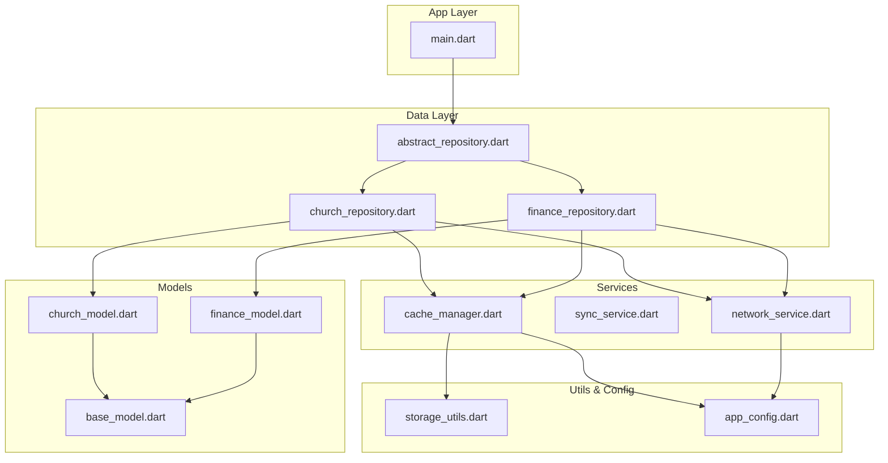
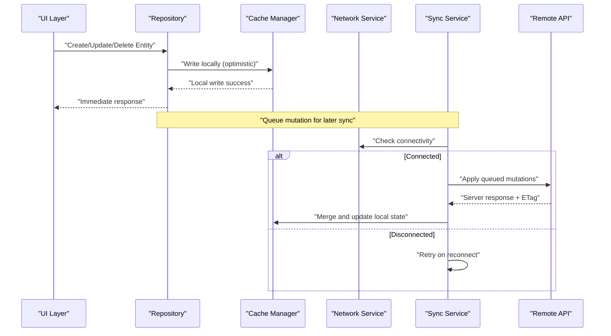
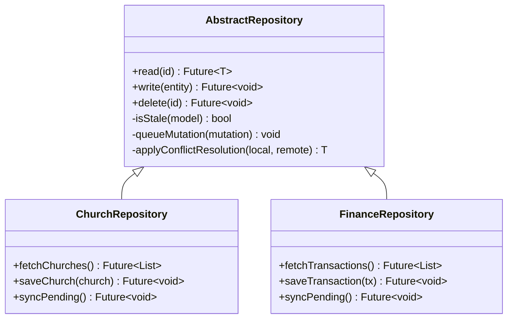
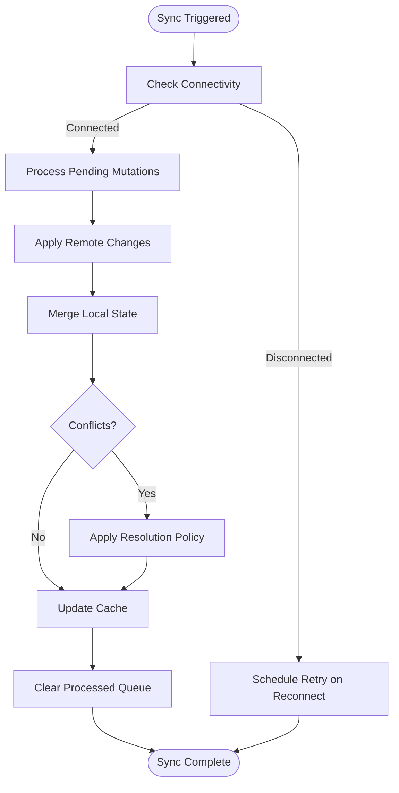
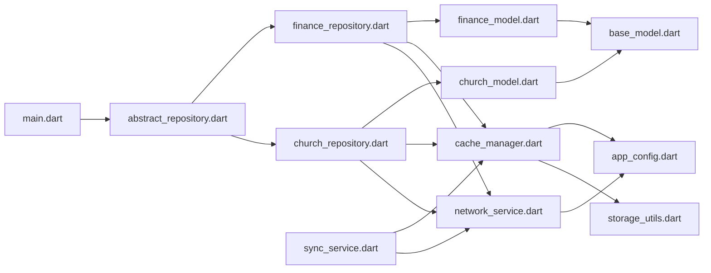

# Offline-First Architecture

<cite>
**Referenced Files in This Document**
- [flutter_app/lib/main.dart](file://flutter_app/lib/main.dart)
- [flutter_app/pubspec.yaml](file://flutter_app/pubspec.yaml)
- [flutter_app/lib/data/repositories/abstract_repository.dart](file://flutter_app/lib/data/repositories/abstract_repository.dart)
- [flutter_app/lib/data/repositories/church_repository.dart](file://flutter_app/lib/data/repositories/church_repository.dart)
- [flutter_app/lib/data/repositories/finance_repository.dart](file://flutter_app/lib/data/repositories/finance_repository.dart)
- [flutter_app/lib/services/network_service.dart](file://flutter_app/lib/services/network_service.dart)
- [flutter_app/lib/services/sync_service.dart](file://flutter_app/lib/services/sync_service.dart)
- [flutter_app/lib/services/cache_manager.dart](file://flutter_app/lib/services/cache_manager.dart)
- [flutter_app/lib/models/base_model.dart](file://flutter_app/lib/models/base_model.dart)
- [flutter_app/lib/models/church_model.dart](file://flutter_app/lib/models/church_model.dart)
- [flutter_app/lib/models/finance_model.dart](file://flutter_app/lib/models/finance_model.dart)
- [flutter_app/lib/utils/storage_utils.dart](file://flutter_app/lib/utils/storage_utils.dart)
- [flutter_app/lib/config/app_config.dart](file://flutter_app/lib/config/app_config.dart)
</cite>

## Table of Contents
1. [Introduction](#introduction)
2. [Project Structure](#project-structure)
3. [Core Components](#core-components)
4. [Architecture Overview](#architecture-overview)
5. [Detailed Component Analysis](#detailed-component-analysis)
6. [Dependency Analysis](#dependency-analysis)
7. [Performance Considerations](#performance-considerations)
8. [Troubleshooting Guide](#troubleshooting-guide)
9. [Conclusion](#conclusion)

## Introduction
This document explains the offline-first architecture implemented in Gestão Yahweh Premium. It covers local caching with Hive and SQLite, data persistence patterns, cache management, handling network disconnections, maintaining consistency between local and remote storage, automatic synchronization when connectivity is restored, cache invalidation policies, data migration strategies, conflict resolution mechanisms, background sync operations, storage quotas, and performance considerations for large datasets.

## Project Structure
The Flutter application organizes offline-first capabilities across repositories, services, models, utilities, and configuration:
- Repositories encapsulate data access and orchestrate local vs remote reads/writes
- Services provide networking, synchronization, and cache management
- Models define entities persisted locally and synced remotely
- Utilities handle storage operations and platform-specific concerns
- Configuration centralizes feature flags and behavior tuning

**Diagram sources**
- [flutter_app/lib/main.dart](file://flutter_app/lib/main.dart)
- [flutter_app/lib/data/repositories/abstract_repository.dart](file://flutter_app/lib/data/repositories/abstract_repository.dart)
- [flutter_app/lib/data/repositories/church_repository.dart](file://flutter_app/lib/data/repositories/church_repository.dart)
- [flutter_app/lib/data/repositories/finance_repository.dart](file://flutter_app/lib/data/repositories/finance_repository.dart)
- [flutter_app/lib/services/network_service.dart](file://flutter_app/lib/services/network_service.dart)
- [flutter_app/lib/services/sync_service.dart](file://flutter_app/lib/services/sync_service.dart)
- [flutter_app/lib/services/cache_manager.dart](file://flutter_app/lib/services/cache_manager.dart)
- [flutter_app/lib/models/base_model.dart](file://flutter_app/lib/models/base_model.dart)
- [flutter_app/lib/models/church_model.dart](file://flutter_app/lib/models/church_model.dart)
- [flutter_app/lib/models/finance_model.dart](file://flutter_app/lib/models/finance_model.dart)
- [flutter_app/lib/utils/storage_utils.dart](file://flutter_app/lib/utils/storage_utils.dart)
- [flutter_app/lib/config/app_config.dart](file://flutter_app/lib/config/app_config.dart)

**Section sources**
- [flutter_app/lib/main.dart](file://flutter_app/lib/main.dart)
- [flutter_app/pubspec.yaml](file://flutter_app/pubspec.yaml)

## Core Components
- Abstract Repository: Defines a consistent interface for read/write operations, enforcing offline-first behavior by preferring local storage and falling back to remote when needed.
- Concrete Repositories (Church, Finance): Implement domain-specific logic, including conflict detection, batching writes, and triggering sync tasks.
- Network Service: Manages connectivity state, retries, timeouts, and error mapping; exposes methods for fetching and mutating remote data.
- Sync Service: Observes connectivity changes and queues pending mutations; performs background synchronization with conflict resolution.
- Cache Manager: Coordinates Hive/SQLite caches, handles eviction policies, versioning, and migrations.
- Models: Represent persistent entities with fields for last modified timestamps, ETags, and conflict markers.
- Storage Utils: Provides low-level helpers for file I/O, encryption, and quota checks.
- App Config: Centralizes feature toggles such as offline mode, sync intervals, and cache sizes.

**Section sources**
- [flutter_app/lib/data/repositories/abstract_repository.dart](file://flutter_app/lib/data/repositories/abstract_repository.dart)
- [flutter_app/lib/data/repositories/church_repository.dart](file://flutter_app/lib/data/repositories/church_repository.dart)
- [flutter_app/lib/data/repositories/finance_repository.dart](file://flutter_app/lib/data/repositories/finance_repository.dart)
- [flutter_app/lib/services/network_service.dart](file://flutter_app/lib/services/network_service.dart)
- [flutter_app/lib/services/sync_service.dart](file://flutter_app/lib/services/sync_service.dart)
- [flutter_app/lib/services/cache_manager.dart](file://flutter_app/lib/services/cache_manager.dart)
- [flutter_app/lib/models/base_model.dart](file://flutter_app/lib/models/base_model.dart)
- [flutter_app/lib/models/church_model.dart](file://flutter_app/lib/models/church_model.dart)
- [flutter_app/lib/models/finance_model.dart](file://flutter_app/lib/models/finance_model.dart)
- [flutter_app/lib/utils/storage_utils.dart](file://flutter_app/lib/utils/storage_utils.dart)
- [flutter_app/lib/config/app_config.dart](file://flutter_app/lib/config/app_config.dart)

## Architecture Overview
The offline-first architecture ensures that all user interactions are immediately reflected in local storage, while background processes synchronize with the remote server when connectivity is available. The system maintains consistency through optimistic updates, conflict detection, and deterministic resolution strategies.

**Diagram sources**
- [flutter_app/lib/data/repositories/abstract_repository.dart](file://flutter_app/lib/data/repositories/abstract_repository.dart)
- [flutter_app/lib/services/cache_manager.dart](file://flutter_app/lib/services/cache_manager.dart)
- [flutter_app/lib/services/network_service.dart](file://flutter_app/lib/services/network_service.dart)
- [flutter_app/lib/services/sync_service.dart](file://flutter_app/lib/services/sync_service.dart)

## Detailed Component Analysis

### Abstract Repository Pattern
The abstract repository defines a contract for offline-first operations:
- Read: Prefer local cache; if missing or stale, fetch from remote and populate cache
- Write: Apply optimistic local changes; queue mutations for background sync
- Conflict Handling: Detect mismatches using timestamps or ETags; apply resolution strategy
- Batch Operations: Group writes to reduce overhead and improve reliability

**Diagram sources**
- [flutter_app/lib/data/repositories/abstract_repository.dart](file://flutter_app/lib/data/repositories/abstract_repository.dart)
- [flutter_app/lib/data/repositories/church_repository.dart](file://flutter_app/lib/data/repositories/church_repository.dart)
- [flutter_app/lib/data/repositories/finance_repository.dart](file://flutter_app/lib/data/repositories/finance_repository.dart)

**Section sources**
- [flutter_app/lib/data/repositories/abstract_repository.dart](file://flutter_app/lib/data/repositories/abstract_repository.dart)
- [flutter_app/lib/data/repositories/church_repository.dart](file://flutter_app/lib/data/repositories/church_repository.dart)
- [flutter_app/lib/data/repositories/finance_repository.dart](file://flutter_app/lib/data/repositories/finance_repository.dart)

### Network Service
Responsibilities:
- Connectivity monitoring and event broadcasting
- HTTP client configuration with retries and timeouts
- Error mapping and retry policies
- Request/response transformation for caching compatibility

Key behaviors:
- Exposes a stream of connectivity status
- Implements exponential backoff for failed requests
- Caches successful responses with TTL based on model metadata

**Section sources**
- [flutter_app/lib/services/network_service.dart](file://flutter_app/lib/services/network_service.dart)

### Sync Service
Responsibilities:
- Observes connectivity changes and triggers sync cycles
- Maintains a queue of pending mutations
- Applies conflict resolution strategies during merge
- Ensures idempotency and transactional semantics where possible

Flow:

**Diagram sources**
- [flutter_app/lib/services/sync_service.dart](file://flutter_app/lib/services/sync_service.dart)

**Section sources**
- [flutter_app/lib/services/sync_service.dart](file://flutter_app/lib/services/sync_service.dart)

### Cache Manager
Responsibilities:
- Manages Hive boxes and SQLite tables
- Handles cache versioning and migrations
- Implements eviction policies (LRU, TTL, size-based)
- Provides query optimization helpers (indexes, projections)

Strategies:
- Versioned cache schemas with migration scripts
- TTL-based expiration for frequently changing data
- Size-based eviction to respect storage quotas
- Lazy loading and pagination support

**Section sources**
- [flutter_app/lib/services/cache_manager.dart](file://flutter_app/lib/services/cache_manager.dart)

### Models
Responsibilities:
- Define entity structures with persistence annotations
- Include metadata for sync (timestamps, ETags, conflict markers)
- Provide serialization/deserialization helpers

Examples:
- BaseModel includes common fields like id, createdAt, updatedAt, etag
- ChurchModel extends BaseModel with church-specific attributes
- FinanceModel extends BaseModel with transaction details

**Section sources**
- [flutter_app/lib/models/base_model.dart](file://flutter_app/lib/models/base_model.dart)
- [flutter_app/lib/models/church_model.dart](file://flutter_app/lib/models/church_model.dart)
- [flutter_app/lib/models/finance_model.dart](file://flutter_app/lib/models/finance_model.dart)

### Storage Utils
Responsibilities:
- Low-level file I/O operations
- Encryption/decryption for sensitive data
- Quota checking and cleanup routines
- Platform-specific optimizations

**Section sources**
- [flutter_app/lib/utils/storage_utils.dart](file://flutter_app/lib/utils/storage_utils.dart)

### App Config
Responsibilities:
- Feature flags for offline mode, sync intervals, cache sizes
- Environment-specific configurations
- Runtime toggles for debugging and testing

**Section sources**
- [flutter_app/lib/config/app_config.dart](file://flutter_app/lib/config/app_config.dart)

## Dependency Analysis
The following diagram illustrates component dependencies and their relationships:

**Diagram sources**
- [flutter_app/lib/main.dart](file://flutter_app/lib/main.dart)
- [flutter_app/lib/data/repositories/abstract_repository.dart](file://flutter_app/lib/data/repositories/abstract_repository.dart)
- [flutter_app/lib/data/repositories/church_repository.dart](file://flutter_app/lib/data/repositories/church_repository.dart)
- [flutter_app/lib/data/repositories/finance_repository.dart](file://flutter_app/lib/data/repositories/finance_repository.dart)
- [flutter_app/lib/services/network_service.dart](file://flutter_app/lib/services/network_service.dart)
- [flutter_app/lib/services/sync_service.dart](file://flutter_app/lib/services/sync_service.dart)
- [flutter_app/lib/services/cache_manager.dart](file://flutter_app/lib/services/cache_manager.dart)
- [flutter_app/lib/models/base_model.dart](file://flutter_app/lib/models/base_model.dart)
- [flutter_app/lib/models/church_model.dart](file://flutter_app/lib/models/church_model.dart)
- [flutter_app/lib/models/finance_model.dart](file://flutter_app/lib/models/finance_model.dart)
- [flutter_app/lib/utils/storage_utils.dart](file://flutter_app/lib/utils/storage_utils.dart)
- [flutter_app/lib/config/app_config.dart](file://flutter_app/lib/config/app_config.dart)

**Section sources**
- [flutter_app/lib/main.dart](file://flutter_app/lib/main.dart)
- [flutter_app/pubspec.yaml](file://flutter_app/pubspec.yaml)

## Performance Considerations
- Query Optimization: Use indexed fields in SQLite and selective projections in Hive to minimize memory usage
- Pagination: Implement cursor-based pagination for large datasets to avoid loading entire collections
- Memory Management: Dispose of unused streams and close database connections promptly
- Background Sync: Batch operations and use debouncing to reduce network calls
- Cache Eviction: Configure appropriate TTL and size limits to prevent memory pressure
- Concurrency: Use transactional writes to maintain consistency under concurrent access

[No sources needed since this section provides general guidance]

## Troubleshooting Guide
Common issues and resolutions:
- Sync Failures: Check network connectivity logs and retry policies
- Cache Corruption: Validate cache versions and run migration scripts
- Data Inconsistency: Review conflict resolution logs and ETag mismatches
- Storage Quota Exceeded: Monitor storage usage and implement cleanup routines
- Performance Degradation: Analyze query plans and optimize indexes

**Section sources**
- [flutter_app/lib/services/network_service.dart](file://flutter_app/lib/services/network_service.dart)
- [flutter_app/lib/services/sync_service.dart](file://flutter_app/lib/services/sync_service.dart)
- [flutter_app/lib/services/cache_manager.dart](file://flutter_app/lib/services/cache_manager.dart)
- [flutter_app/lib/utils/storage_utils.dart](file://flutter_app/lib/utils/storage_utils.dart)

## Conclusion
The offline-first architecture in Gestão Yahweh Premium ensures reliable operation regardless of network conditions. By leveraging local caching with Hive/SQLite, implementing robust synchronization, and applying strategic cache management, the application delivers a seamless user experience while maintaining data consistency and performance. Continuous monitoring and optimization are essential to scale effectively with growing datasets and user demands.

[No sources needed since this section summarizes without analyzing specific files]