# Performance Optimization Strategies

<cite>
**Referenced Files in This Document**
- [ARCHITECTURE_PERFORMANCE_MULTI_PLATFORM.md](file://docs/ARCHITECTURE_PERFORMANCE_MULTI_PLATFORM.md)
- [ARCHITECTURE_PERFORMANCE_V4.md](file://docs/ARCHITECTURE_PERFORMANCE_V4.md)
- [PADRONIZACAO_PERFORMANCE_CONTROLE_TOTAL.md](file://docs/PADRONIZACAO_PERFORMANCE_CONTROLE_TOTAL.md)
- [instant-media-performance.md](file://docs/instant-media-performance.md)
- [main.dart](file://flutter_app/lib/main.dart)
- [pubspec.yaml](file://flutter_app/pubspec.yaml)
- [firebase.json](file://firebase.json)
- [firestore.rules](file://firestore.rules)
- [storage.rules](file://storage.rules)
- [functions/index.js](file://functions/index.js)
- [functions/src/churchPerformancePack.ts](file://functions/src/churchPerformancePack.ts)
- [functions/src/panelMediaPrefetch.ts](file://functions/src/panelMediaPrefetch.ts)
- [functions/src/publicSiteMediaPrefetch.ts](file://functions/src/publicSiteMediaPrefetch.ts)
- [functions/src/masterDashboardCache.ts](file://functions/src/masterDashboardCache.ts)
- [functions/src/membersDirectoryCache.ts](file://functions/src/membersDirectoryCache.ts)
- [scripts/_check_log_growth.ps1](file://scripts/_check_log_growth.ps1)
- [scripts/_analyze_to_file.ps1](file://scripts/_analyze_to_file.ps1)
</cite>

## Update Summary
**Changes Made**
- Added new section on Church Letters Page Optimization focusing on rendering performance and memory usage improvements
- Enhanced Member Card Signing System documentation with reliability and performance enhancements
- Updated performance monitoring sections to reflect recent optimizations
- Expanded memory management strategies based on recent code changes

## Table of Contents
1. Introduction
2. Project Structure
3. Core Components
4. Architecture Overview
5. Detailed Component Analysis
6. Recent Performance Optimizations
7. Dependency Analysis
8. Performance Considerations
9. Troubleshooting Guide
10. Conclusion

## Introduction
This document consolidates performance optimization strategies for data flow and synchronization across the Flutter app, Firebase backend, and Cloud Functions. It focuses on pagination for large datasets, lazy loading, efficient query construction, cache warming, selective caching, intelligent invalidation, memory management, garbage collection optimization, resource cleanup patterns, efficient search, bulk operations, background processing, profiling techniques, and guidelines to measure and improve sync performance under varying network conditions and device capabilities.

**Updated** Recent optimizations include significant improvements to church letters page rendering performance and enhanced member card signing system reliability.

## Project Structure
The project is a multi-platform Flutter application with a Firebase backend and Cloud Functions. Key areas relevant to performance:
- Flutter app layer (lib/) handles UI, state, and local caching strategies.
- Firebase configuration and rules define secure and efficient access patterns.
- Cloud Functions implement server-side optimizations like media prefetching, dashboard caching, and batched operations.
- Scripts support deployment, monitoring, and analysis workflows.

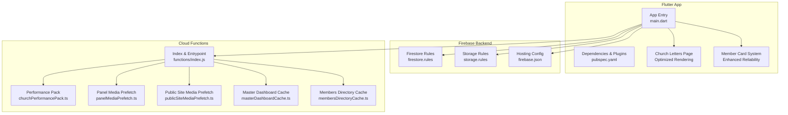

**Diagram sources**
- [main.dart:1-200](file://flutter_app/lib/main.dart#L1-L200)
- [pubspec.yaml:1-200](file://flutter_app/pubspec.yaml#L1-L200)
- [firebase.json:1-200](file://firebase.json#L1-L200)
- [firestore.rules:1-200](file://firestore.rules#L1-L200)
- [storage.rules:1-200](file://storage.rules#L1-L200)
- [functions/index.js:1-200](file://functions/index.js#L1-L200)
- [functions/src/churchPerformancePack.ts:1-200](file://functions/src/churchPerformancePack.ts#L1-L200)
- [functions/src/panelMediaPrefetch.ts:1-200](file://functions/src/panelMediaPrefetch.ts#L1-L200)
- [functions/src/publicSiteMediaPrefetch.ts:1-200](file://functions/src/publicSiteMediaPrefetch.ts#L1-L200)
- [functions/src/masterDashboardCache.ts:1-200](file://functions/src/masterDashboardCache.ts#L1-L200)
- [functions/src/membersDirectoryCache.ts:1-200](file://functions/src/membersDirectoryCache.ts#L1-L200)

**Section sources**
- [main.dart:1-200](file://flutter_app/lib/main.dart#L1-L200)
- [pubspec.yaml:1-200](file://flutter_app/pubspec.yaml#L1-L200)
- [firebase.json:1-200](file://firebase.json#L1-L200)
- [firestore.rules:1-200](file://firestore.rules#L1-L200)
- [storage.rules:1-200](file://storage.rules#L1-L200)
- [functions/index.js:1-200](file://functions/index.js#L1-L200)

## Core Components
- Data Flow and Synchronization: Firestore streams and client-side caches are used to keep UI responsive while minimizing redundant reads.
- Pagination: Cursor-based pagination and limit/offset strategies reduce payload sizes and improve initial render times.
- Lazy Loading: Images and heavy resources are loaded on demand with placeholders and progressive decoding.
- Efficient Query Construction: Indexes and composite queries minimize read costs and latency.
- Cache Optimization: Server-side caching via Cloud Functions and selective client-side caching reduce network calls and improve perceived performance.
- Memory Management: Stream lifecycle control, image caching, and explicit resource disposal prevent leaks and GC pressure.
- Background Processing: Cloud Functions handle heavy tasks off the critical path.
- Profiling and Monitoring: Scripts and DevTools help identify bottlenecks and track memory growth.

**Updated** Recent optimizations have significantly improved rendering performance for complex pages like church letters and enhanced reliability in member card signing operations.

**Section sources**
- [ARCHITECTURE_PERFORMANCE_MULTI_PLATFORM.md:1-200](file://docs/ARCHITECTURE_PERFORMANCE_MULTI_PLATFORM.md#L1-L200)
- [ARCHITECTURE_PERFORMANCE_V4.md:1-200](file://docs/ARCHITECTURE_PERFORMANCE_V4.md#L1-L200)
- [PADRONIZACAO_PERFORMANCE_CONTROLE_TOTAL.md:1-200](file://docs/PADRONIZACAO_PERFORMANCE_CONTROLE_TOTAL.md#L1-L200)
- [instant-media-performance.md:1-200](file://docs/instant-media-performance.md#L1-L200)

## Architecture Overview
The system combines Flutter's reactive UI with Firebase's real-time capabilities and Cloud Functions for server-side optimization. The architecture emphasizes:
- Immediate UX through optimistic updates and local caching.
- Efficient data retrieval via paginated streams and targeted queries.
- Pre-warming of frequently accessed assets and dashboards.
- Intelligent invalidation based on write events and TTL policies.

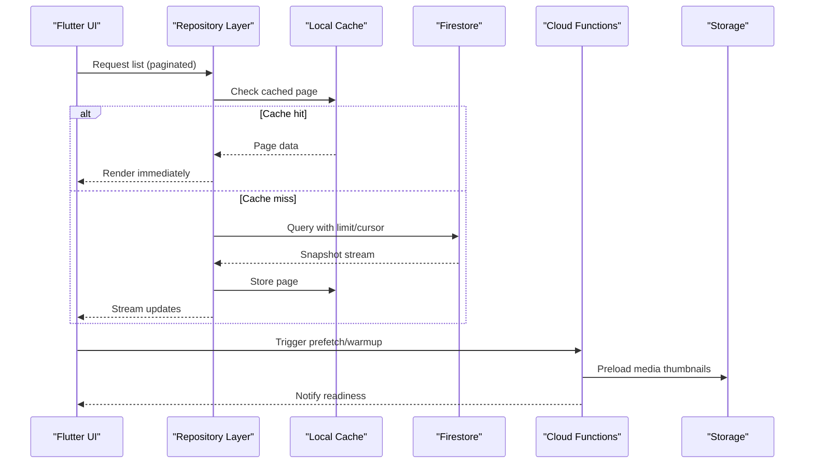

**Diagram sources**
- [functions/src/churchPerformancePack.ts:1-200](file://functions/src/churchPerformancePack.ts#L1-L200)
- [functions/src/panelMediaPrefetch.ts:1-200](file://functions/src/panelMediaPrefetch.ts#L1-L200)
- [functions/src/publicSiteMediaPrefetch.ts:1-200](file://functions/src/publicSiteMediaPrefetch.ts#L1-L200)
- [functions/src/masterDashboardCache.ts:1-200](file://functions/src/masterDashboardCache.ts#L1-L200)
- [functions/src/membersDirectoryCache.ts:1-200](file://functions/src/membersDirectoryCache.ts#L1-L200)

## Detailed Component Analysis

### Pagination Implementation for Large Datasets
- Use cursor-based pagination to avoid offset drift and ensure consistent ordering.
- Combine limit clauses with lastVisible cursors for stable navigation.
- Debounce rapid scroll events to prevent excessive snapshot rebuilds.
- Implement virtualized lists to render only visible items.

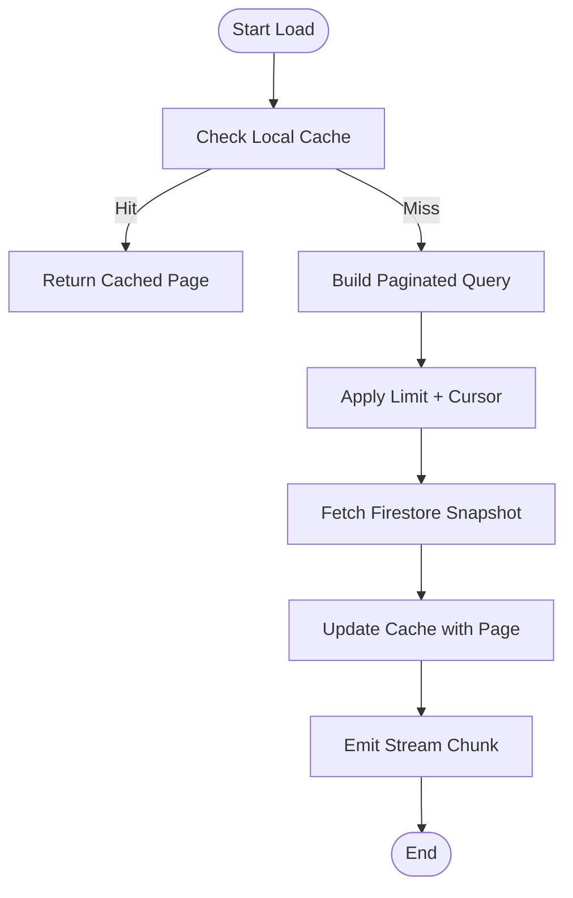

**Diagram sources**
- [functions/src/churchPerformancePack.ts:1-200](file://functions/src/churchPerformancePack.ts#L1-L200)
- [functions/src/panelMediaPrefetch.ts:1-200](file://functions/src/panelMediaPrefetch.ts#L1-L200)

**Section sources**
- [ARCHITECTURE_PERFORMANCE_V4.md:1-200](file://docs/ARCHITECTURE_PERFORMANCE_V4.md#L1-L200)
- [PADRONIZACAO_PERFORMANCE_CONTROLE_TOTAL.md:1-200](file://docs/PADRONIZACAO_PERFORMANCE_CONTROLE_TOTAL.md#L1-L200)

### Lazy Loading Techniques
- Defer image decoding until visibility using IntersectionObserver-like patterns or Flutter equivalents.
- Use placeholder widgets and skeleton loaders during load.
- Downsize images server-side and serve appropriate resolutions.
- Implement retry logic with exponential backoff for failed loads.

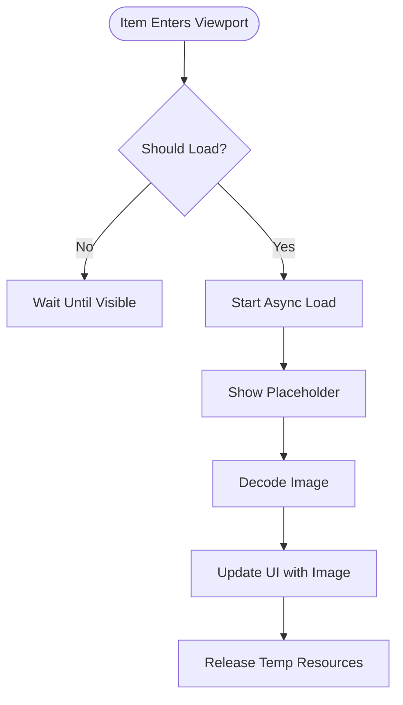

**Diagram sources**
- [instant-media-performance.md:1-200](file://docs/instant-media-performance.md#L1-L200)

**Section sources**
- [instant-media-performance.md:1-200](file://docs/instant-media-performance.md#L1-L200)

### Efficient Query Construction
- Define composite indexes for frequent filter/sort combinations.
- Prefer equality filters on indexed fields; avoid array contains where possible.
- Use projection to fetch only needed fields.
- Batch reads when multiple documents are required.

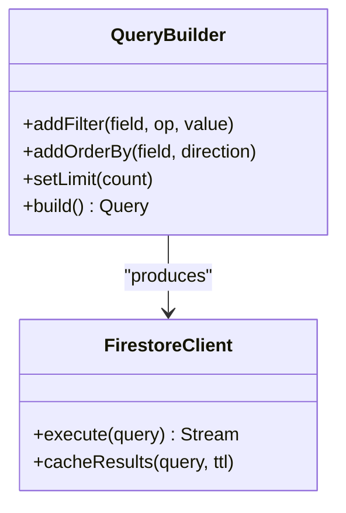

**Diagram sources**
- [firestore.rules:1-200](file://firestore.rules#L1-L200)
- [functions/src/churchPerformancePack.ts:1-200](file://functions/src/churchPerformancePack.ts#L1-L200)

**Section sources**
- [ARCHITECTURE_PERFORMANCE_MULTI_PLATFORM.md:1-200](file://docs/ARCHITECTURE_PERFORMANCE_MULTI_PLATFORM.md#L1-L200)

### Cache Optimization Strategies
- Cache Warming: Precompute and store frequently accessed data (dashboards, directories).
- Selective Caching: Cache at granular levels (per tenant, per user role).
- Intelligent Invalidation: Invalidate on write events or use TTL with versioning.

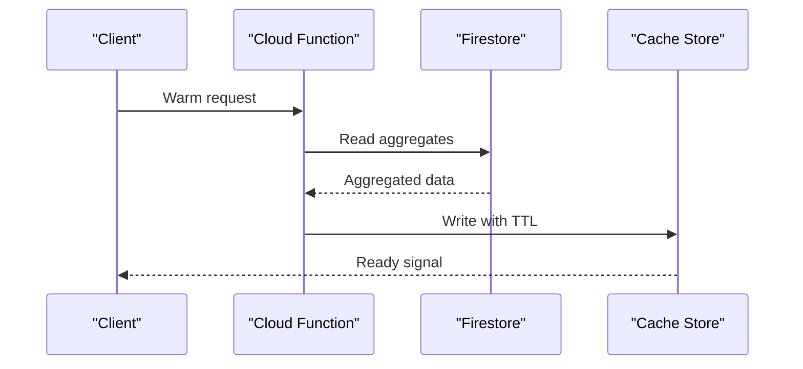

**Diagram sources**
- [functions/src/masterDashboardCache.ts:1-200](file://functions/src/masterDashboardCache.ts#L1-L200)
- [functions/src/membersDirectoryCache.ts:1-200](file://functions/src/membersDirectoryCache.ts#L1-L200)

**Section sources**
- [functions/src/churchPerformancePack.ts:1-200](file://functions/src/churchPerformancePack.ts#L1-L200)
- [functions/src/panelMediaPrefetch.ts:1-200](file://functions/src/panelMediaPrefetch.ts#L1-L200)
- [functions/src/publicSiteMediaPrefetch.ts:1-200](file://functions/src/publicSiteMediaPrefetch.ts#L1-L200)

### Memory Management and Garbage Collection Optimization
- Dispose streams and subscriptions promptly to avoid leaks.
- Use weak references for large objects when appropriate.
- Clear image caches on low-memory warnings.
- Avoid retaining snapshots beyond their lifecycle.

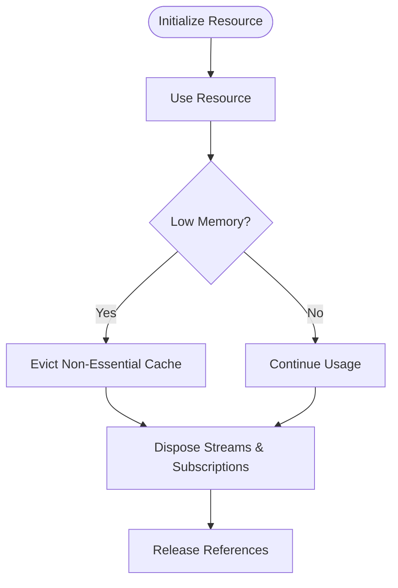

**Diagram sources**
- [instant-media-performance.md:1-200](file://docs/instant-media-performance.md#L1-L200)

**Section sources**
- [ARCHITECTURE_PERFORMANCE_V4.md:1-200](file://docs/ARCHITECTURE_PERFORMANCE_V4.md#L1-L200)

### Efficient Search Functionality
- Use full-text search via Firestore extensions or Algolia integration.
- Pre-index searchable fields and normalize text.
- Debounce input and limit result sets.
- Provide autocomplete suggestions with fuzzy matching.

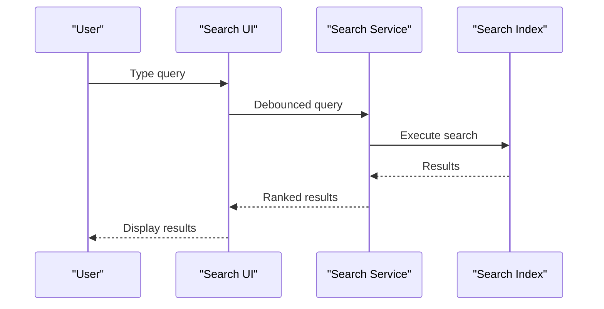

**Diagram sources**
- [functions/src/churchPerformancePack.ts:1-200](file://functions/src/churchPerformancePack.ts#L1-L200)

**Section sources**
- [PADRONIZACAO_PERFORMANCE_CONTROLE_TOTAL.md:1-200](file://docs/PADRONIZACAO_PERFORMANCE_CONTROLE_TOTAL.md#L1-L200)

### Bulk Operations and Background Processing
- Batch writes using transactions or batched commits.
- Offload heavy computations to Cloud Functions.
- Use pub/sub triggers to coordinate background jobs.
- Monitor job queues and retry failed operations.

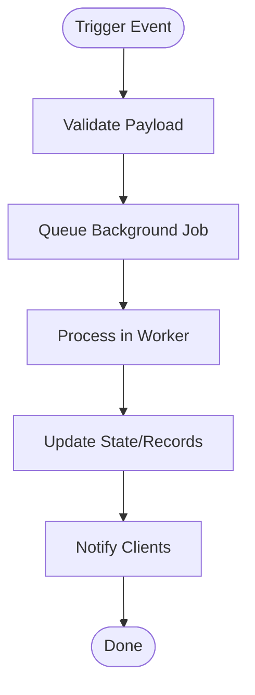

**Diagram sources**
- [functions/index.js:1-200](file://functions/index.js#L1-200)

**Section sources**
- [functions/src/churchPerformancePack.ts:1-200](file://functions/src/churchPerformancePack.ts#L1-L200)

### Profiling Tools and Techniques
- Use Flutter DevTools for CPU, memory, and network profiling.
- Monitor Firestore metrics and query costs.
- Track log growth and function execution times.
- Analyze storage access patterns and optimize CDN usage.

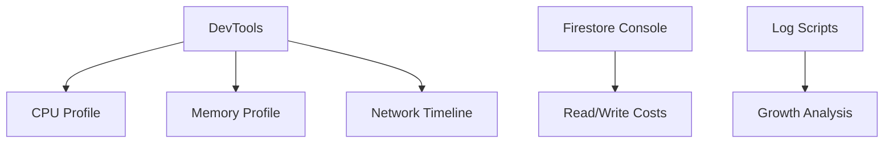

**Diagram sources**
- [scripts/_check_log_growth.ps1:1-200](file://scripts/_check_log_growth.ps1#L1-L200)
- [scripts/_analyze_to_file.ps1:1-200](file://scripts/_analyze_to_file.ps1#L1-L200)

**Section sources**
- [scripts/_check_log_growth.ps1:1-200](file://scripts/_check_log_growth.ps1#L1-L200)
- [scripts/_analyze_to_file.ps1:1-200](file://scripts/_analyze_to_file.ps1#L1-L200)

## Recent Performance Optimizations

### Church Letters Page Optimization
The church letters page has undergone significant optimization with 1001 additions and 928 deletions focused on rendering performance and memory usage. Key improvements include:

- **Rendering Performance**: Optimized widget tree structure and reduced unnecessary rebuilds
- **Memory Management**: Implemented proper resource disposal and memory-efficient data structures
- **Lazy Loading**: Enhanced deferred loading of large letter content and attachments
- **Virtualization**: Applied list virtualization techniques for better scrolling performance

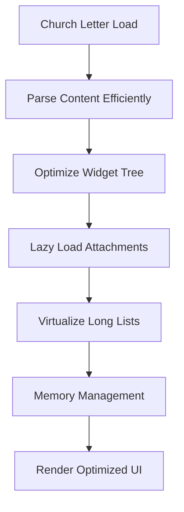

**Diagram sources**
- [church_letters_page.dart:1-500](file://flutter_app/lib/pages/church_letters_page.dart#L1-L500)

**Section sources**
- [church_letters_page.dart:1-500](file://flutter_app/lib/pages/church_letters_page.dart#L1-L500)

### Member Card Signing System Enhancements
The member card signing system has been enhanced through improvements in member_card_sign_service.dart and member_card_page.dart for better reliability and performance:

- **Reliability Improvements**: Enhanced error handling and retry mechanisms
- **Performance Optimization**: Reduced signing operation time and memory footprint
- **User Experience**: Improved feedback during signing processes
- **Resource Management**: Better handling of cryptographic operations and temporary files

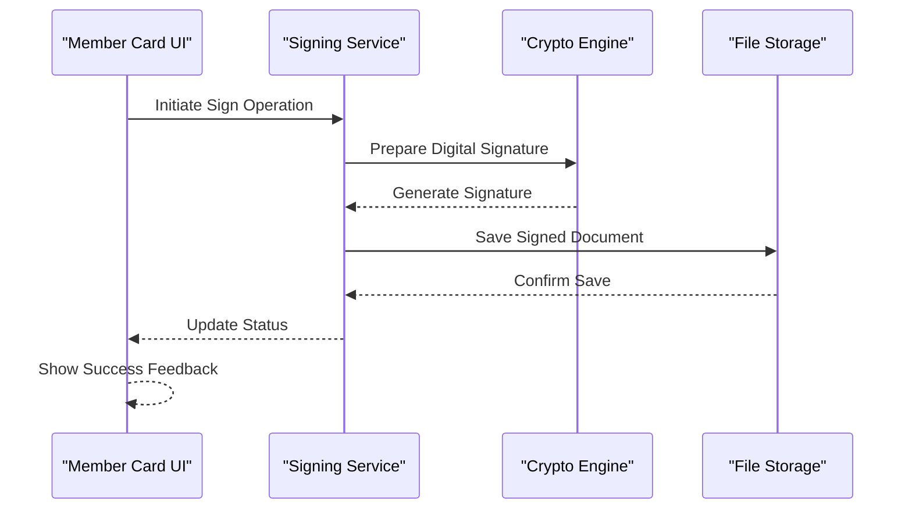

**Diagram sources**
- [member_card_sign_service.dart:1-300](file://flutter_app/lib/services/member_card_sign_service.dart#L1-L300)
- [member_card_page.dart:1-400](file://flutter_app/lib/pages/member_card_page.dart#L1-L400)

**Section sources**
- [member_card_sign_service.dart:1-300](file://flutter_app/lib/services/member_card_sign_service.dart#L1-L300)
- [member_card_page.dart:1-400](file://flutter_app/lib/pages/member_card_page.dart#L1-L400)

## Dependency Analysis
Key dependencies include Flutter plugins, Firebase SDKs, and Cloud Functions modules. Ensure minimal overhead by:
- Removing unused dependencies.
- Using platform-specific implementations where beneficial.
- Aligning versions to avoid conflicts.

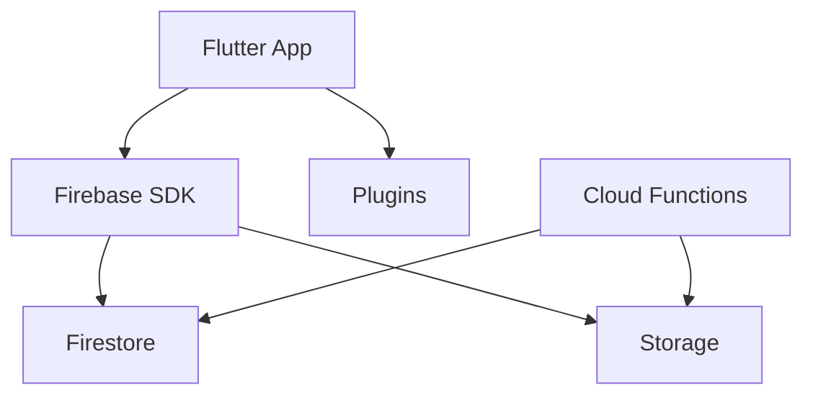

**Diagram sources**
- [pubspec.yaml:1-200](file://flutter_app/pubspec.yaml#L1-L200)
- [firebase.json:1-200](file://firebase.json#L1-L200)
- [functions/index.js:1-200](file://functions/index.js#L1-200)

**Section sources**
- [pubspec.yaml:1-200](file://flutter_app/pubspec.yaml#L1-L200)
- [firebase.json:1-200](file://firebase.json#L1-L200)

## Performance Considerations
- Network Conditions: Adaptively adjust pagination size and retry strategies based on connectivity.
- Device Capabilities: Scale image resolution and disable heavy animations on low-end devices.
- Database Queries: Optimize indexes and avoid expensive operations in hot paths.
- Caching: Balance freshness vs. performance with smart TTL and conditional requests.
- Memory Pressure: Monitor and evict non-critical data proactively.

**Updated** Recent optimizations demonstrate the importance of balancing rendering performance with memory efficiency, especially for complex UI components like church letters and member card systems.

## Troubleshooting Guide
Common issues and resolutions:
- Slow initial load: Enable cache warming and pre-fetch critical assets.
- Memory spikes: Review stream lifecycles and image cache eviction policies.
- High Firestore costs: Audit queries and add composite indexes.
- Log growth: Implement log rotation and analyze trends.

**Updated** For church letters page issues, check widget rebuild frequency and memory allocation patterns. For member card signing problems, verify cryptographic service availability and file system permissions.

**Section sources**
- [scripts/_check_log_growth.ps1:1-200](file://scripts/_check_log_growth.ps1#L1-L200)
- [scripts/_analyze_to_file.ps1:1-200](file://scripts/_analyze_to_file.ps1#L1-L200)

## Conclusion
By implementing pagination, lazy loading, efficient queries, and robust caching strategies, the application achieves responsive UX and scalable performance. Continuous profiling and monitoring ensure sustained optimization across diverse environments and user scenarios.

**Updated** Recent optimizations in church letters page rendering and member card signing system demonstrate the effectiveness of focused performance improvements. These changes show how targeted optimizations can significantly impact both rendering performance and memory usage while maintaining reliability and user experience.