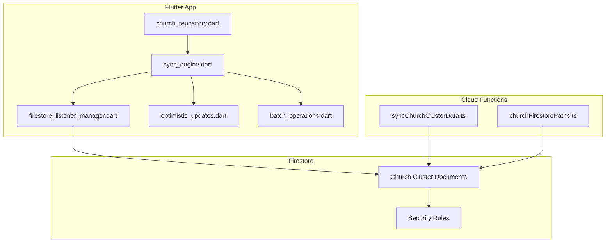
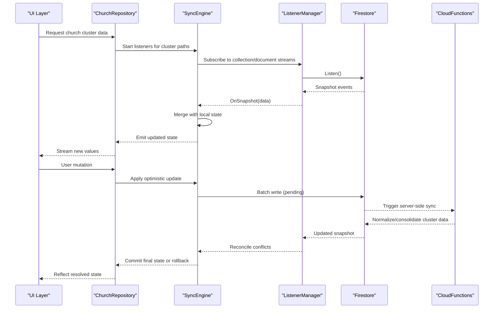
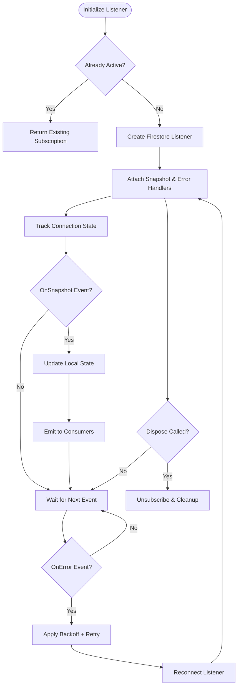
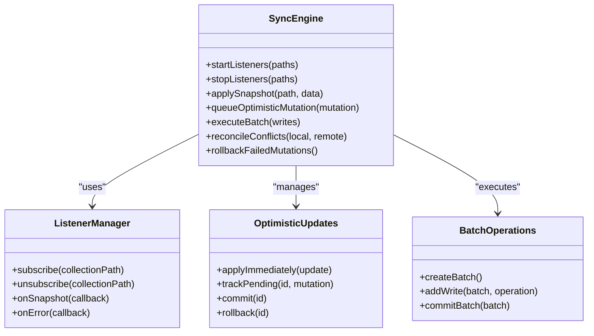
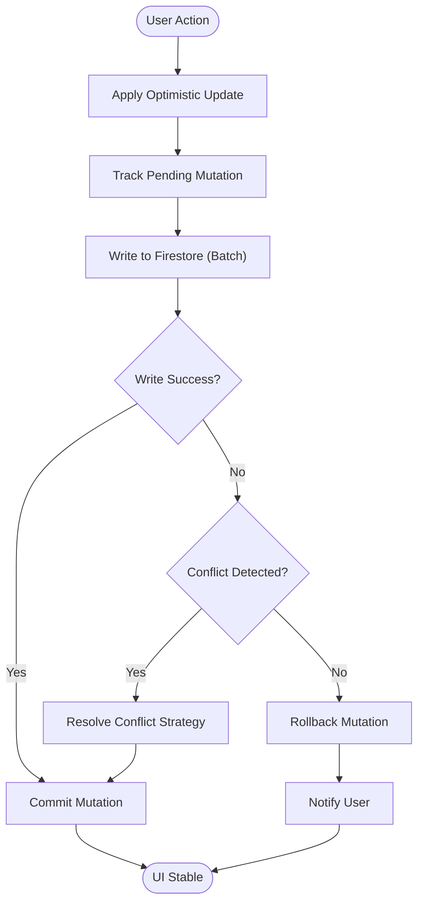
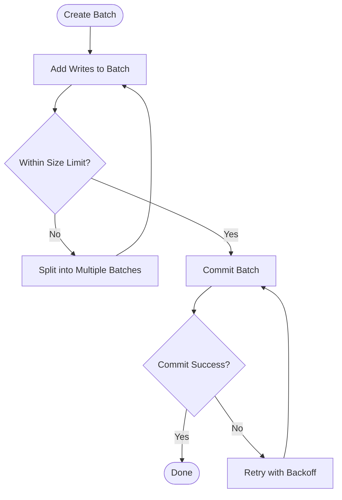
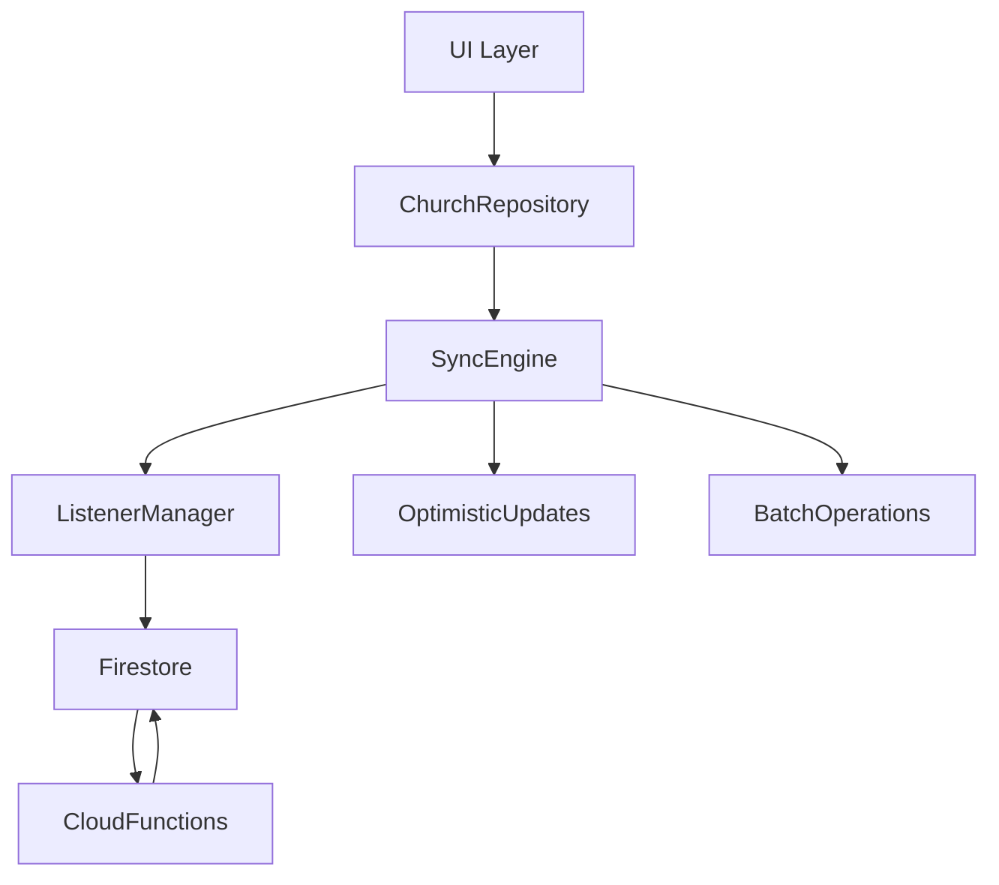

# Real-Time Synchronization

<cite>
**Referenced Files in This Document**
- [lib/main.dart](file://flutter_app/lib/main.dart)
- [lib/controle_total_sync/sync_engine.dart](file://flutter_app/lib/controle_total_sync/sync_engine.dart)
- [lib/controle_total_sync/firestore_listener_manager.dart](file://flutter_app/lib/controle_total_sync/firestore_listener_manager.dart)
- [lib/controle_total_sync/optimistic_updates.dart](file://flutter_app/lib/controle_total_sync/optimistic_updates.dart)
- [lib/controle_total_sync/batch_operations.dart](file://flutter_app/lib/controle_total_sync/batch_operations.dart)
- [lib/repositories/church_repository.dart](file://flutter_app/lib/repositories/church_repository.dart)
- [functions/src/syncChurchClusterData.ts](file://functions/src/syncChurchClusterData.ts)
- [functions/src/churchFirestorePaths.ts](file://functions/src/churchFirestorePaths.ts)
- [firestore.rules](file://firestore.rules)
- [firebase.json](file://firebase.json)
</cite>

## Table of Contents
1. [Introduction](#introduction)
2. [Project Structure](#project-structure)
3. [Core Components](#core-components)
4. [Architecture Overview](#architecture-overview)
5. [Detailed Component Analysis](#detailed-component-analysis)
6. [Dependency Analysis](#dependency-analysis)
7. [Performance Considerations](#performance-considerations)
8. [Troubleshooting Guide](#troubleshooting-guide)
9. [Conclusion](#conclusion)
10. [Appendices](#appendices)

## Introduction
This document explains the real-time synchronization mechanisms used to keep the Flutter application consistent with Firestore, focusing on listener-based updates, event-driven state synchronization, and church cluster data synchronization. It covers bidirectional sync patterns, conflict detection and resolution, optimistic UI updates with rollback, batch operations for performance, and robust error handling for failed synchronizations. It also provides practical guidance for setting up listeners, managing connection states and subscription lifecycles, debugging sync issues, monitoring performance, and optimizing listener usage to minimize Firestore costs.

## Project Structure
The real-time sync implementation spans the Flutter app layer (listeners, state management, optimistic updates, batch writes) and Cloud Functions (server-side consolidation and normalization). Key directories and files:
- flutter_app/lib/controle_total_sync: Core sync engine, Firestore listener manager, optimistic updates, and batch operations
- flutter_app/lib/repositories: Data access abstractions that coordinate local state and remote sync
- functions/src: Cloud Functions orchestrating server-side sync and path utilities
- firestore.rules: Security rules governing read/write permissions and validation
- firebase.json: Firebase project configuration including hosting and functions settings

**Diagram sources**
- [lib/controle_total_sync/sync_engine.dart](file://flutter_app/lib/controle_total_sync/sync_engine.dart)
- [lib/controle_total_sync/firestore_listener_manager.dart](file://flutter_app/lib/controle_total_sync/firestore_listener_manager.dart)
- [lib/controle_total_sync/optimistic_updates.dart](file://flutter_app/lib/controle_total_sync/optimistic_updates.dart)
- [lib/controle_total_sync/batch_operations.dart](file://flutter_app/lib/controle_total_sync/batch_operations.dart)
- [lib/repositories/church_repository.dart](file://flutter_app/lib/repositories/church_repository.dart)
- [functions/src/syncChurchClusterData.ts](file://functions/src/syncChurchClusterData.ts)
- [functions/src/churchFirestorePaths.ts](file://functions/src/churchFirestorePaths.ts)
- [firestore.rules](file://firestore.rules)

**Section sources**
- [firebase.json](file://firebase.json)
- [firestore.rules](file://firestore.rules)

## Core Components
- Sync Engine: Orchestrates lifecycle of listeners, coordinates optimistic updates and batch operations, and reconciles local state with remote snapshots.
- Firestore Listener Manager: Manages subscriptions to collections and documents, handles reconnection, backoff, and cleanup.
- Optimistic Updates: Applies immediate UI changes while tracking pending mutations; rolls back on failure or conflict.
- Batch Operations: Groups multiple writes into atomic batches to reduce round-trips and improve consistency.
- Church Repository: Encapsulates domain-specific sync logic for church cluster data, exposing APIs to UI layers.
- Cloud Functions: Normalize and consolidate data across clusters, enforce policies, and trigger downstream sync tasks.

**Section sources**
- [lib/controle_total_sync/sync_engine.dart](file://flutter_app/lib/controle_total_sync/sync_engine.dart)
- [lib/controle_total_sync/firestore_listener_manager.dart](file://flutter_app/lib/controle_total_sync/firestore_listener_manager.dart)
- [lib/controle_total_sync/optimistic_updates.dart](file://flutter_app/lib/controle_total_sync/optimistic_updates.dart)
- [lib/controle_total_sync/batch_operations.dart](file://flutter_app/lib/controle_total_sync/batch_operations.dart)
- [lib/repositories/church_repository.dart](file://flutter_app/lib/repositories/church_repository.dart)
- [functions/src/syncChurchClusterData.ts](file://functions/src/syncChurchClusterData.ts)
- [functions/src/churchFirestorePaths.ts](file://functions/src/churchFirestorePaths.ts)

## Architecture Overview
Real-time sync is event-driven: Firestore listeners emit snapshots that update local state; user actions trigger optimistic updates and batched writes; Cloud Functions normalize and reconcile data across clusters. The flow ensures eventual consistency with strong UX responsiveness.

**Diagram sources**
- [lib/repositories/church_repository.dart](file://flutter_app/lib/repositories/church_repository.dart)
- [lib/controle_total_sync/sync_engine.dart](file://flutter_app/lib/controle_total_sync/sync_engine.dart)
- [lib/controle_total_sync/firestore_listener_manager.dart](file://flutter_app/lib/controle_total_sync/firestore_listener_manager.dart)
- [functions/src/syncChurchClusterData.ts](file://functions/src/syncChurchClusterData.ts)

## Detailed Component Analysis

### Firestore Listener Manager
Responsibilities:
- Create and manage listeners for collections and documents
- Handle connection states (connected, disconnected, reconnecting)
- Implement exponential backoff and jitter for resilience
- Clean up subscriptions on disposal to prevent leaks

Key behaviors:
- Subscription lifecycle tied to widget/component lifecycle
- Debounced re-subscriptions after transient errors
- Metrics collection for listener count and latency

**Diagram sources**
- [lib/controle_total_sync/firestore_listener_manager.dart](file://flutter_app/lib/controle_total_sync/firestore_listener_manager.dart)

**Section sources**
- [lib/controle_total_sync/firestore_listener_manager.dart](file://flutter_app/lib/controle_total_sync/firestore_listener_manager.dart)

### Sync Engine
Responsibilities:
- Coordinate listener subscriptions per feature/module
- Merge incoming snapshots with local state using deterministic strategies
- Manage optimistic update queues and reconciliation
- Trigger batch operations when appropriate

Key behaviors:
- Path-aware subscription management
- Conflict detection via version fields or timestamps
- Rollback mechanism on write failures or server-rejected mutations

**Diagram sources**
- [lib/controle_total_sync/sync_engine.dart](file://flutter_app/lib/controle_total_sync/sync_engine.dart)
- [lib/controle_total_sync/firestore_listener_manager.dart](file://flutter_app/lib/controle_total_sync/firestore_listener_manager.dart)
- [lib/controle_total_sync/optimistic_updates.dart](file://flutter_app/lib/controle_total_sync/optimistic_updates.dart)
- [lib/controle_total_sync/batch_operations.dart](file://flutter_app/lib/controle_total_sync/batch_operations.dart)

**Section sources**
- [lib/controle_total_sync/sync_engine.dart](file://flutter_app/lib/controle_total_sync/sync_engine.dart)

### Optimistic Updates
Responsibilities:
- Immediately reflect user intent in the UI
- Track pending mutations with unique IDs
- Commit or roll back based on server response or conflict resolution

Key behaviors:
- Idempotent mutation keys
- Conflict detection against server state
- Automatic rollback with user feedback

**Diagram sources**
- [lib/controle_total_sync/optimistic_updates.dart](file://flutter_app/lib/controle_total_sync/optimistic_updates.dart)

**Section sources**
- [lib/controle_total_sync/optimistic_updates.dart](file://flutter_app/lib/controle_total_sync/optimistic_updates.dart)

### Batch Operations
Responsibilities:
- Group multiple writes into a single transactional batch
- Reduce network overhead and ensure atomicity
- Handle partial failures gracefully

Key behaviors:
- Batch size limits enforced by Firestore
- Retry logic with exponential backoff
- Logging and metrics for batch performance

**Diagram sources**
- [lib/controle_total_sync/batch_operations.dart](file://flutter_app/lib/controle_total_sync/batch_operations.dart)

**Section sources**
- [lib/controle_total_sync/batch_operations.dart](file://flutter_app/lib/controle_total_sync/batch_operations.dart)

### Church Repository
Responsibilities:
- Expose domain APIs for church cluster data
- Coordinate sync engine calls for listeners and mutations
- Provide reactive streams for UI consumption

Key behaviors:
- Path mapping to Firestore collections
- Error propagation and retry policies
- Integration with optimistic updates and batch operations

**Section sources**
- [lib/repositories/church_repository.dart](file://flutter_app/lib/repositories/church_repository.dart)

### Cloud Functions: Server-Side Sync
Responsibilities:
- Normalize and consolidate church cluster data
- Enforce business rules and security policies
- Trigger downstream tasks (e.g., indexing, caching)

Key behaviors:
- Idempotent operations with deduplication
- Conflict resolution strategies (last-write-wins, merge, or custom)
- Observability via logging and metrics

**Section sources**
- [functions/src/syncChurchClusterData.ts](file://functions/src/syncChurchClusterData.ts)
- [functions/src/churchFirestorePaths.ts](file://functions/src/churchFirestorePaths.ts)

## Dependency Analysis
The sync system has clear boundaries between client and server responsibilities. Client components focus on responsiveness and local state consistency, while server functions handle normalization and policy enforcement.

**Diagram sources**
- [lib/repositories/church_repository.dart](file://flutter_app/lib/repositories/church_repository.dart)
- [lib/controle_total_sync/sync_engine.dart](file://flutter_app/lib/controle_total_sync/sync_engine.dart)
- [lib/controle_total_sync/firestore_listener_manager.dart](file://flutter_app/lib/controle_total_sync/firestore_listener_manager.dart)
- [lib/controle_total_sync/optimistic_updates.dart](file://flutter_app/lib/controle_total_sync/optimistic_updates.dart)
- [lib/controle_total_sync/batch_operations.dart](file://flutter_app/lib/controle_total_sync/batch_operations.dart)
- [functions/src/syncChurchClusterData.ts](file://functions/src/syncChurchClusterData.ts)

**Section sources**
- [lib/repositories/church_repository.dart](file://flutter_app/lib/repositories/church_repository.dart)
- [functions/src/syncChurchClusterData.ts](file://functions/src/syncChurchClusterData.ts)

## Performance Considerations
- Minimize listener scope: subscribe only to needed documents/collections
- Use pagination and limit queries to reduce payload size
- Debounce rapid mutations to avoid excessive writes
- Leverage batch operations for grouped updates
- Monitor listener count and latency metrics
- Implement offline-first caching where appropriate
- Avoid nested listeners; flatten data models when possible

[No sources needed since this section provides general guidance]

## Troubleshooting Guide
Common issues and resolutions:
- Listener not receiving updates: verify paths, permissions, and active subscriptions
- Stale data: check for missing snapshot handlers or incorrect merge logic
- Failed writes: inspect error codes, implement retry/backoff, and validate input
- High Firestore costs: audit listener scope, query efficiency, and write frequency
- Conflicts: review conflict resolution strategy and ensure idempotency

Debugging techniques:
- Enable verbose logging for listener events and write operations
- Use Firebase Console to monitor Firestore usage and errors
- Instrument metrics for listener lifecycle and batch performance
- Simulate network failures to test rollback behavior

**Section sources**
- [lib/controle_total_sync/firestore_listener_manager.dart](file://flutter_app/lib/controle_total_sync/firestore_listener_manager.dart)
- [lib/controle_total_sync/optimistic_updates.dart](file://flutter_app/lib/controle_total_sync/optimistic_updates.dart)
- [lib/controle_total_sync/batch_operations.dart](file://flutter_app/lib/controle_total_sync/batch_operations.dart)

## Conclusion
The real-time synchronization system combines responsive UI updates with robust backend reconciliation. By leveraging Firestore listeners, optimistic updates, and batch operations, the application achieves high performance and reliability. Cloud Functions ensure data consistency and policy enforcement across church clusters. Proper listener management, conflict resolution, and observability are key to maintaining scalability and cost-efficiency.

[No sources needed since this section summarizes without analyzing specific files]

## Appendices

### Setting Up Real-Time Listeners
- Initialize listener manager with required paths
- Attach snapshot and error handlers
- Manage lifecycle with component disposal

**Section sources**
- [lib/controle_total_sync/firestore_listener_manager.dart](file://flutter_app/lib/controle_total_sync/firestore_listener_manager.dart)

### Handling Connection States
- Track connected/disconnected states
- Implement automatic reconnection with backoff
- Gracefully handle network interruptions

**Section sources**
- [lib/controle_total_sync/firestore_listener_manager.dart](file://flutter_app/lib/controle_total_sync/firestore_listener_manager.dart)

### Managing Subscription Lifecycles
- Tie subscriptions to widget/component lifecycle
- Ensure proper cleanup to prevent memory leaks
- Monitor active listener counts

**Section sources**
- [lib/controle_total_sync/firestore_listener_manager.dart](file://flutter_app/lib/controle_total_sync/firestore_listener_manager.dart)

### Bidirectional Sync Patterns
- Apply local changes immediately (optimistic)
- Sync with server via Cloud Functions
- Reconcile conflicts using deterministic strategies

**Section sources**
- [lib/controle_total_sync/sync_engine.dart](file://flutter_app/lib/controle_total_sync/sync_engine.dart)
- [functions/src/syncChurchClusterData.ts](file://functions/src/syncChurchClusterData.ts)

### Conflict Detection and Resolution
- Use version fields or timestamps for conflict detection
- Implement last-write-wins or merge strategies
- Provide user feedback for manual resolution

**Section sources**
- [lib/controle_total_sync/optimistic_updates.dart](file://flutter_app/lib/controle_total_sync/optimistic_updates.dart)

### Optimistic UI Updates with Rollback
- Apply immediate UI changes
- Track pending mutations
- Rollback on failure or conflict

**Section sources**
- [lib/controle_total_sync/optimistic_updates.dart](file://flutter_app/lib/controle_total_sync/optimistic_updates.dart)

### Batch Operations for Performance
- Group related writes into batches
- Enforce size limits and retry policies
- Monitor batch success rates

**Section sources**
- [lib/controle_total_sync/batch_operations.dart](file://flutter_app/lib/controle_total_sync/batch_operations.dart)

### Error Handling for Failed Synchronizations
- Implement retry with exponential backoff
- Log detailed error information
- Provide fallback UI states

**Section sources**
- [lib/controle_total_sync/firestore_listener_manager.dart](file://flutter_app/lib/controle_total_sync/firestore_listener_manager.dart)
- [lib/controle_total_sync/batch_operations.dart](file://flutter_app/lib/controle_total_sync/batch_operations.dart)

### Debugging Techniques for Sync Issues
- Enable verbose logging
- Use Firebase Console for monitoring
- Instrument custom metrics

**Section sources**
- [lib/controle_total_sync/firestore_listener_manager.dart](file://flutter_app/lib/controle_total_sync/firestore_listener_manager.dart)

### Monitoring Sync Performance
- Track listener count and latency
- Monitor write success rates
- Analyze Firestore usage patterns

**Section sources**
- [lib/controle_total_sync/sync_engine.dart](file://flutter_app/lib/controle_total_sync/sync_engine.dart)

### Optimizing Listener Usage to Minimize Costs
- Scope listeners narrowly
- Use pagination and limits
- Avoid redundant subscriptions

**Section sources**
- [lib/controle_total_sync/firestore_listener_manager.dart](file://flutter_app/lib/controle_total_sync/firestore_listener_manager.dart)