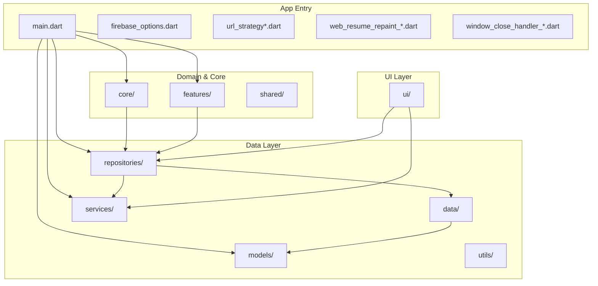
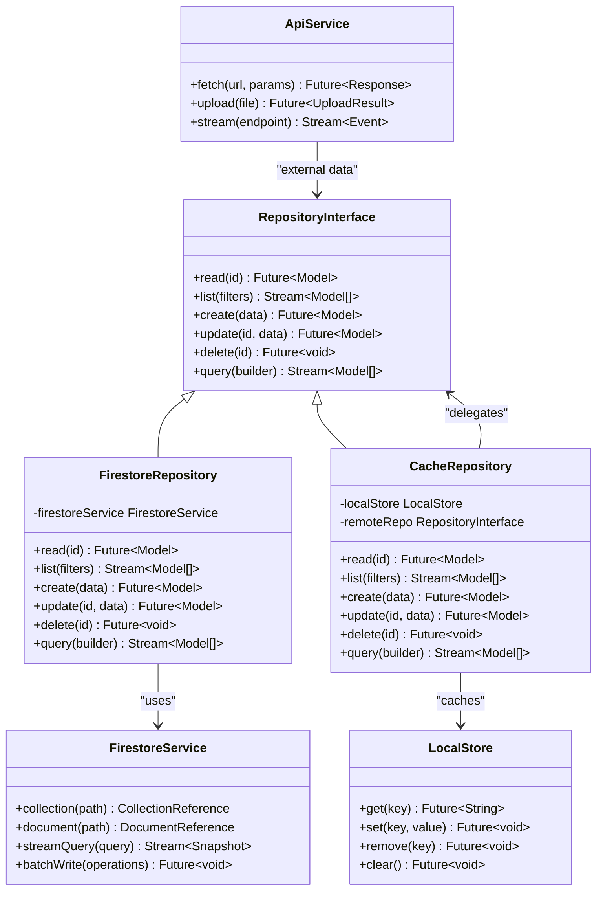
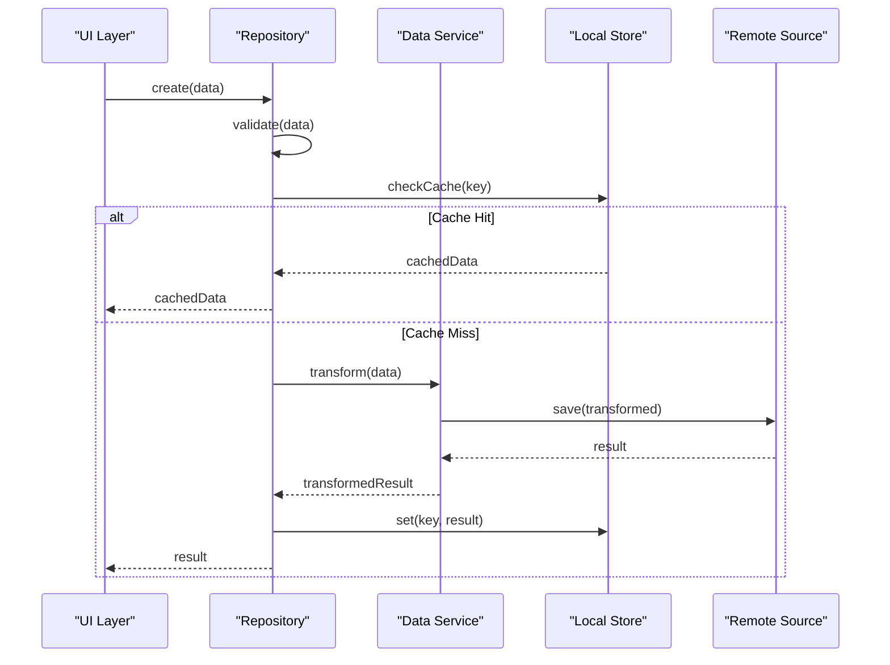
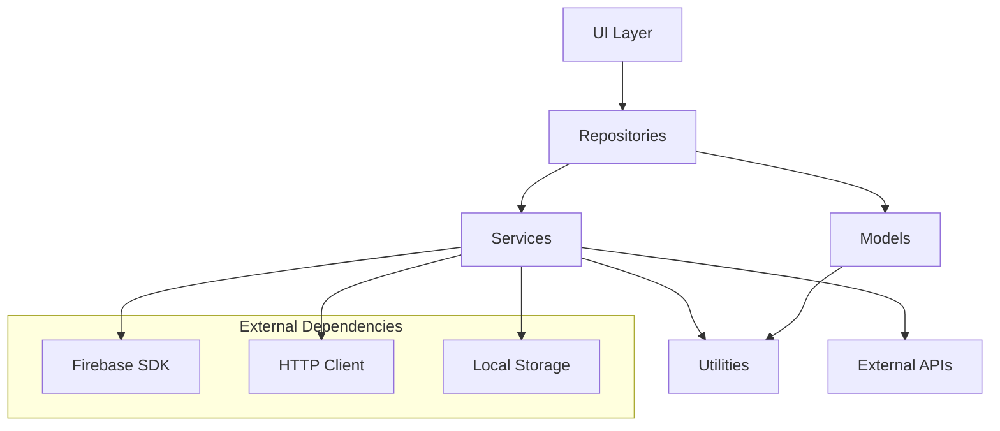

# Repository Pattern Implementation

<cite>
**Referenced Files in This Document**
- [main.dart](file://flutter_app/lib/main.dart)
- [app_theme.dart](file://flutter_app/lib/app_theme.dart)
- [url_strategy.dart](file://flutter_app/lib/url_strategy.dart)
- [url_strategy_stub.dart](file://flutter_app/lib/url_strategy_stub.dart)
- [url_strategy_web.dart](file://flutter_app/lib/url_strategy_web.dart)
- [web_resume_repaint_stub.dart](file://flutter_app/lib/web_resume_repaint_stub.dart)
- [web_resume_repaint_web.dart](file://flutter_app/lib/web_resume_repaint_web.dart)
- [window_close_handler_io.dart](file://flutter_app/lib/window_close_handler_io.dart)
- [window_close_handler_stub.dart](file://flutter_app/lib/window_close_handler_stub.dart)
- [firebase_options.dart](file://flutter_app/lib/firebase_options.dart)
- [repositories/](file://flutter_app/lib/repositories/)
- [data/](file://flutter_app/lib/data/)
- [services/](file://flutter_app/lib/services/)
- [models/](file://flutter_app/lib/models/)
- [core/](file://flutter_app/lib/core/)
- [features/](file://flutter_app/lib/features/)
- [shared/](file://flutter_app/lib/shared/)
- [utils/](file://flutter_app/lib/utils/)
- [ui/](file://flutter_app/lib/ui/)
- [pubspec.yaml](file://flutter_app/pubspec.yaml)
- [README.md](file://flutter_app/README.md)
</cite>

## Table of Contents
1. [Introduction](#introduction)
2. [Project Structure](#project-structure)
3. [Core Components](#core-components)
4. [Architecture Overview](#architecture-overview)
5. [Detailed Component Analysis](#detailed-component-analysis)
6. [Dependency Analysis](#dependency-analysis)
7. [Performance Considerations](#performance-considerations)
8. [Troubleshooting Guide](#troubleshooting-guide)
9. [Conclusion](#conclusion)
10. [Appendices](#appendices)

## Introduction
This document explains the repository pattern implementation across the application, focusing on the abstraction layer design, interface definitions, and concrete implementations for different data sources such as Firestore, local cache, and external APIs. It also documents the data transformation pipeline from server responses to UI models, including validation, mapping, and error handling. The guide covers CRUD operations, query builders, complex data access patterns, examples of creating new repositories, implementing data source switching, and handling asynchronous operations. Finally, it provides testing strategies for repositories, mocking data sources, and ensuring consistent behavior across environments.

## Project Structure
The Flutter application organizes code into clear layers:
- Entry points and platform configuration files are located at the root of the lib directory.
- Business logic and domain abstractions live under core and features.
- Data access is encapsulated in repositories and data modules.
- Services provide cross-cutting capabilities like networking, caching, and Firebase integration.
- Models define the shape of data used throughout the app.
- UI components consume repositories via services or state management.

**Diagram sources**
- [main.dart](file://flutter_app/lib/main.dart)
- [firebase_options.dart](file://flutter_app/lib/firebase_options.dart)
- [url_strategy.dart](file://flutter_app/lib/url_strategy.dart)
- [url_strategy_stub.dart](file://flutter_app/lib/url_strategy_stub.dart)
- [url_strategy_web.dart](file://flutter_app/lib/url_strategy_web.dart)
- [web_resume_repaint_stub.dart](file://flutter_app/lib/web_resume_repaint_stub.dart)
- [web_resume_repaint_web.dart](file://flutter_app/lib/web_resume_repaint_web.dart)
- [window_close_handler_io.dart](file://flutter_app/lib/window_close_handler_io.dart)
- [window_close_handler_stub.dart](file://flutter_app/lib/window_close_handler_stub.dart)

**Section sources**
- [main.dart](file://flutter_app/lib/main.dart)
- [pubspec.yaml](file://flutter_app/pubspec.yaml)
- [README.md](file://flutter_app/README.md)

## Core Components
The repository pattern centers around:
- Abstraction interfaces defining contracts for data operations (CRUD, queries).
- Concrete implementations for specific data sources (Firestore, local cache, external APIs).
- Data transformation pipelines that map raw responses to domain/UI models with validation and error handling.
- Query builders and complex data access patterns to compose filters, sorts, and joins.
- Asynchronous operation handling using streams and futures for reactive updates and error propagation.

Key responsibilities:
- Encapsulate data source details behind a stable interface.
- Provide caching strategies and fallbacks.
- Normalize payloads and enforce schema validation.
- Centralize error handling and retry policies.
- Expose typed results and stream-based updates.

**Section sources**
- [repositories/](file://flutter_app/lib/repositories/)
- [data/](file://flutter_app/lib/data/)
- [services/](file://flutter_app/lib/services/)
- [models/](file://flutter_app/lib/models/)
- [core/](file://flutter_app/lib/core/)

## Architecture Overview
The architecture separates concerns through layered design:
- UI consumes repositories without knowing underlying data sources.
- Repositories implement interfaces and delegate to services and data modules.
- Services handle networking, caching, and Firebase integrations.
- Models represent domain entities and DTOs.
- Utilities provide common helpers for validation, mapping, and error formatting.

**Diagram sources**
- [repositories/](file://flutter_app/lib/repositories/)
- [data/](file://flutter_app/lib/data/)
- [services/](file://flutter_app/lib/services/)
- [models/](file://flutter_app/lib/models/)

## Detailed Component Analysis

### Repository Interface Design
The repository interface defines a consistent contract for data operations:
- Read single entity by ID with future-based async response.
- List entities with stream-based real-time updates.
- Create, update, and delete operations returning typed results.
- Query builder support for complex filtering and sorting.

Implementation patterns:
- Abstract base classes for shared logic.
- Mixins for caching, retry, and error handling.
- Dependency injection for pluggable data sources.

**Section sources**
- [repositories/](file://flutter_app/lib/repositories/)

### Firestore Repository Implementation
The Firestore repository implements the repository interface using Firebase Firestore:
- Uses Firestore service for collection and document operations.
- Converts snapshots to domain models with validation.
- Handles connection errors and offline persistence.
- Supports batch writes for atomic updates.

Data transformation pipeline:
- Raw Firestore documents are mapped to model instances.
- Field validation ensures data integrity.
- Error codes are normalized for consistent handling.

**Section sources**
- [repositories/](file://flutter_app/lib/repositories/)
- [services/](file://flutter_app/lib/services/)

### Cache Repository Implementation
The cache repository provides a hybrid approach combining local storage and remote data:
- Checks local store first for fast reads.
- Falls back to remote repository if cache miss occurs.
- Updates cache asynchronously after successful remote calls.
- Implements cache invalidation strategies.

Caching strategies:
- Time-to-live (TTL) based expiration.
- Priority-based cache warming.
- Conflict resolution for concurrent updates.

**Section sources**
- [repositories/](file://flutter_app/lib/repositories/)
- [data/](file://flutter_app/lib/data/)

### External API Repository Implementation
The external API repository handles RESTful service interactions:
- Uses HTTP client for network requests.
- Implements retry logic with exponential backoff.
- Handles authentication tokens and refresh flows.
- Maps JSON responses to domain models.

Error handling:
- Network timeout and connectivity errors.
- HTTP status code interpretation.
- Rate limiting and circuit breaker patterns.

**Section sources**
- [services/](file://flutter_app/lib/services/)
- [repositories/](file://flutter_app/lib/repositories/)

### Data Transformation Pipeline
The transformation pipeline ensures data consistency across layers:
- Input validation against schema definitions.
- Type coercion and default value assignment.
- Nested object mapping and array transformations.
- Custom validators for business rules.

Validation strategies:
- Schema-based validation using JSON schemas.
- Runtime type checking with Dart's type system.
- Custom validation functions for complex constraints.

**Section sources**
- [models/](file://flutter_app/lib/models/)
- [utils/](file://flutter_app/lib/utils/)

### Query Builder Implementation
The query builder provides a fluent API for constructing complex queries:
- Method chaining for filters, sorts, and limits.
- Support for nested field queries and aggregations.
- Query optimization and index usage hints.
- Cross-source query composition.

Query composition patterns:
- Logical operators (AND, OR, NOT).
- Range queries and text search.
- Pagination and cursor-based navigation.

**Section sources**
- [data/](file://flutter_app/lib/data/)
- [repositories/](file://flutter_app/lib/repositories/)

### CRUD Operations Flow
The CRUD operations follow a consistent flow across all repositories:
- Input validation and sanitization.
- Data source selection and routing.
- Operation execution with error handling.
- Result transformation and caching.

**Diagram sources**
- [repositories/](file://flutter_app/lib/repositories/)
- [data/](file://flutter_app/lib/data/)
- [services/](file://flutter_app/lib/services/)

### Complex Data Access Patterns
Advanced patterns include:
- Event-driven updates with streams.
- Batch operations for performance.
- Optimistic updates with rollback support.
- Multi-source data aggregation.

Stream processing:
- Real-time synchronization with Firestore.
- Debouncing rapid updates.
- Error recovery and reconnection logic.

**Section sources**
- [repositories/](file://flutter_app/lib/repositories/)
- [services/](file://flutter_app/lib/services/)

## Dependency Analysis
The dependency structure follows clean architecture principles:
- UI depends on repositories through interfaces.
- Repositories depend on services and data modules.
- Services depend on external libraries and platforms.
- Models are independent and reusable across layers.

**Diagram sources**
- [pubspec.yaml](file://flutter_app/pubspec.yaml)
- [services/](file://flutter_app/lib/services/)
- [repositories/](file://flutter_app/lib/repositories/)

**Section sources**
- [pubspec.yaml](file://flutter_app/pubspec.yaml)

## Performance Considerations
Optimization strategies implemented in the repository layer:
- Lazy loading and pagination for large datasets.
- Connection pooling and request deduplication.
- Memory-efficient streaming for real-time data.
- Background processing for heavy operations.

Caching strategies:
- In-memory caching for frequently accessed data.
- Disk-based persistence for offline support.
- Cache warming for predicted user actions.

Memory management:
- Proper disposal of streams and subscriptions.
- Weak references for large objects.
- Garbage collection optimization.

## Troubleshooting Guide
Common issues and solutions:
- Connection failures: Implement retry logic and fallback mechanisms.
- Data inconsistencies: Use optimistic locking and conflict resolution.
- Memory leaks: Monitor stream subscriptions and dispose properly.
- Performance bottlenecks: Profile database queries and optimize indexes.

Debugging techniques:
- Enable detailed logging for repository operations.
- Use development tools to inspect network requests.
- Implement health checks for data source availability.

Error handling patterns:
- Centralized error classification and reporting.
- User-friendly error messages with technical details.
- Automatic recovery attempts where possible.

**Section sources**
- [services/](file://flutter_app/lib/services/)
- [utils/](file://flutter_app/lib/utils/)

## Conclusion
The repository pattern implementation provides a robust foundation for data access in the application. The abstraction layer ensures testability and flexibility, while concrete implementations support multiple data sources with consistent interfaces. The data transformation pipeline maintains data integrity across layers, and the comprehensive error handling ensures reliability. The modular design allows for easy extension and maintenance, supporting both current requirements and future scalability needs.

## Appendices

### Creating New Repositories
Steps to implement a new repository:
1. Define the repository interface extending the base interface.
2. Implement the concrete repository with required data source logic.
3. Register the repository in the dependency injection container.
4. Add unit tests for all CRUD operations and edge cases.
5. Integrate with existing services and models.

### Testing Strategies
Testing approaches for repositories:
- Mock data sources using test doubles.
- Test both success and failure scenarios.
- Verify caching behavior and invalidation.
- Test async operations with proper timeouts.
- Use integration tests for end-to-end validation.

### Data Source Switching
Implementing data source switching:
- Use factory patterns for dynamic instantiation.
- Configure environment-specific settings.
- Implement feature flags for gradual rollout.
- Monitor performance metrics per data source.

### Asynchronous Operations
Best practices for async handling:
- Use streams for real-time updates.
- Implement proper error boundaries.
- Handle cancellation gracefully.
- Monitor resource usage and cleanup.