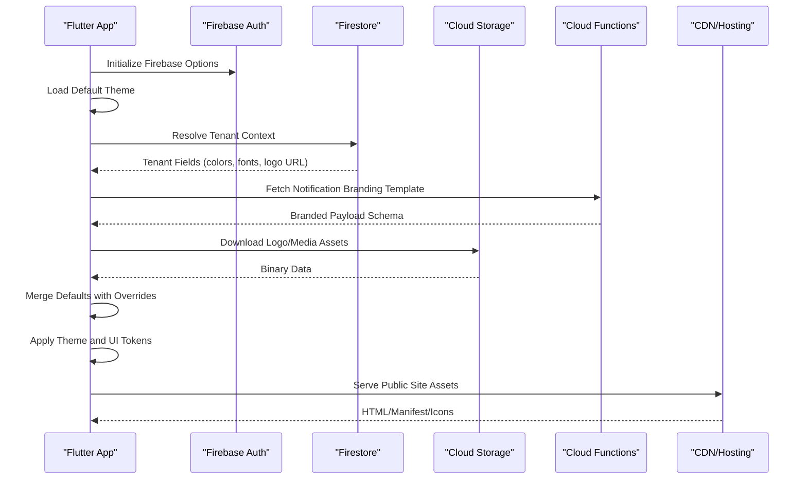
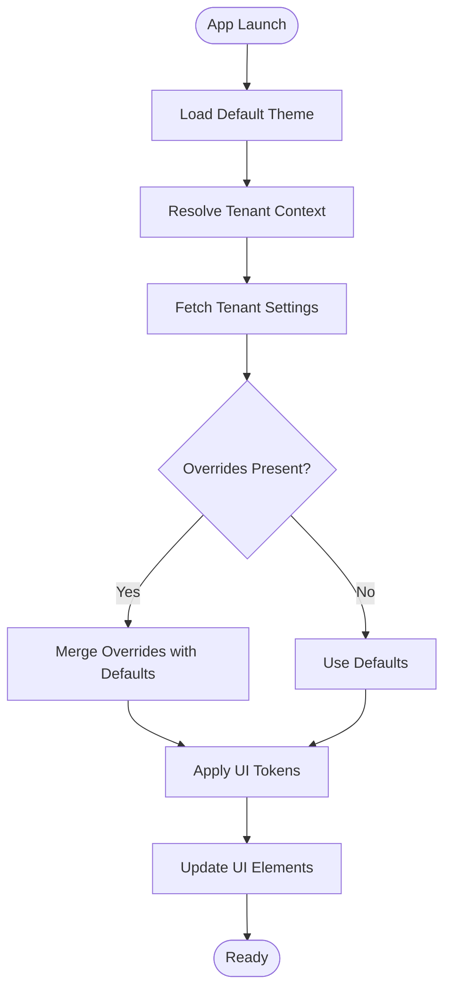
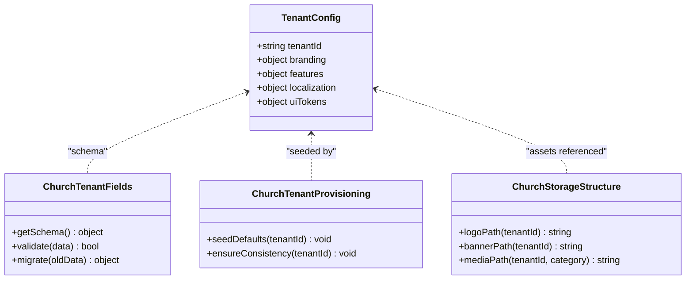
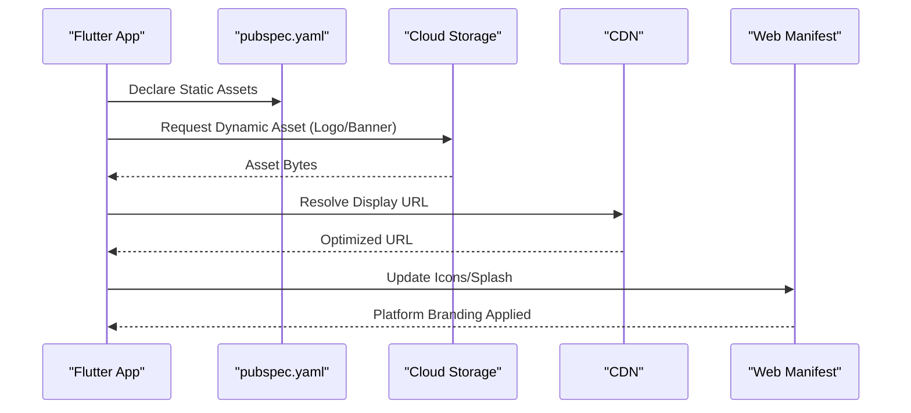
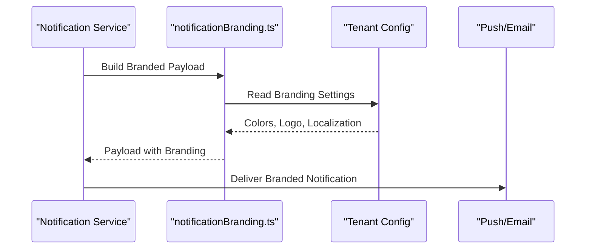
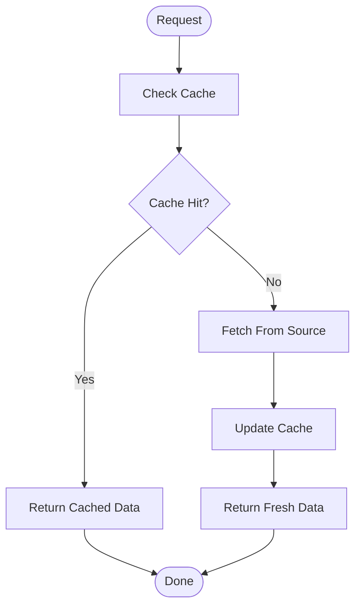
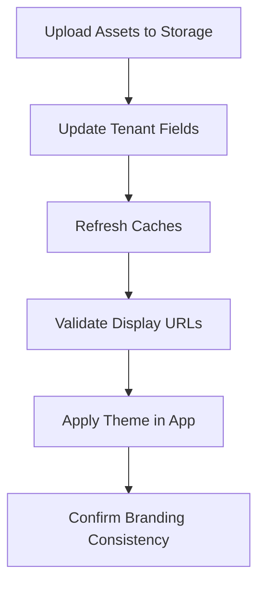

# Custom Branding & Configuration

<cite>
**Referenced Files in This Document**
- [flutter_app/lib/app_theme.dart](file://flutter_app/lib/app_theme.dart)
- [functions/src/notificationBranding.ts](file://functions/src/notificationBranding.ts)
- [functions/notificationBranding.js](file://functions/notificationBranding.js)
- [flutter_app/pubspec.yaml](file://flutter_app/pubspec.yaml)
- [flutter_app/web/manifest.json](file://flutter_app/web/manifest.json)
- [flutter_app/android/app/google-services.json](file://flutter_app/android/app/google-services.json)
- [flutter_app/ios/Runner/GoogleService-Info.plist](file://flutter_app/ios/Runner/GoogleService-Info.plist)
- [flutter_app/lib/firebase_options.dart](file://flutter_app/lib/firebase_options.dart)
- [flutter_app/lib/main.dart](file://flutter_app/lib/main.dart)
- [flutter_app/assets/images/banks/README.md](file://flutter_app/assets/images/banks/README.md)
- [flutter_app/tool/sync_brand_icons.py](file://flutter_app/tool/sync_brand_icons.py)
- [flutter_app/public/reset_password.html](file://flutter_app/public/reset_password.html)
- [flutter_app/web/index.html](file://flutter_app/web/index.html)
- [flutter_app/web/flutter_bootstrap.js](file://flutter_app/web/flutter_bootstrap.js)
- [flutter_app/web/assetlinks.json](file://flutter_app/web/assetlinks.json)
- [functions/src/churchTenantFields.ts](file://functions/src/churchTenantFields.ts)
- [functions/src/churchTenantProvisioning.ts](file://functions/src/churchTenantProvisioning.ts)
- [functions/src/churchStorageStructure.ts](file://functions/src/churchStorageStructure.ts)
- [functions/src/masterChurchesListCache.ts](file://functions/src/masterChurchesListCache.ts)
- [functions/src/panelPublicSiteCache.ts](file://functions/src/panelPublicSiteCache.ts)
- [functions/src/panelDashboardCache.ts](file://functions/src/panelDashboardCache.ts)
- [functions/src/panelFinanceAccountsCache.ts](file://functions/src/panelFinanceAccountsCache.ts)
- [functions/src/panelStatisticsCache.ts](file://functions/src/panelStatisticsCache.ts)
- [functions/src/panelMediaPrefetch.ts](file://functions/src/panelMediaPrefetch.ts)
- [functions/src/publicSiteMediaPrefetch.ts](file://functions/src/publicSiteMediaPrefetch.ts)
- [functions/src/storageDisplayUrls.ts](file://functions/src/storageDisplayUrls.ts)
- [functions/src/churchChatNotify.ts](file://functions/src/churchChatNotify.ts)
- [functions/src/memberNotificationEmail.ts](file://functions/src/memberNotificationEmail.ts)
- [functions/src/pushNovoConteudo.ts](file://functions/src/pushNovoConteudo.ts)
- [functions/src/churchWelcomeSeed.ts](file://functions/src/churchWelcomeSeed.ts)
</cite>

## Table of Contents
1. [Introduction](#introduction)
2. [Project Structure](#project-structure)
3. [Core Components](#core-components)
4. [Architecture Overview](#architecture-overview)
5. [Detailed Component Analysis](#detailed-component-analysis)
6. [Dependency Analysis](#dependency-analysis)
7. [Performance Considerations](#performance-considerations)
8. [Troubleshooting Guide](#troubleshooting-guide)
9. [Conclusion](#conclusion)
10. [Appendices](#appendices)

## Introduction
This document explains how each church organization (tenant) can customize the application appearance and behavior, including logos, color schemes, fonts, UI elements, feature flags, and localization options. It covers the theme system architecture, dynamic asset loading, runtime configuration updates, notification branding for push notifications and emails, performance optimization strategies, and guidelines for extending the branding system.

## Project Structure
The project is a multi-platform Flutter app with Firebase Cloud Functions serving tenant metadata, assets, and notification branding. Key areas:
- Flutter app theme and assets: defines default themes and static assets; supports dynamic overrides via runtime configuration.
- Firebase functions: provide tenant fields, provisioning, storage structure, caching, and notification branding utilities.
- Web platform files: manifest and bootstrap that can be customized per tenant at build or runtime.

```mermaid
graph TB
subgraph "Flutter App"
A["app_theme.dart"]
B["main.dart"]
C["firebase_options.dart"]
D["pubspec.yaml"]
E["web/manifest.json"]
F["public/reset_password.html"]
G["web/index.html"]
H["web/flutter_bootstrap.js"]
end
subgraph "Firebase Functions"
I["churchTenantFields.ts"]
J["churchTenantProvisioning.ts"]
K["churchStorageStructure.ts"]
L["notificationBranding.ts"]
M["masterChurchesListCache.ts"]
N["panelPublicSiteCache.ts"]
O["panelDashboardCache.ts"]
P["panelFinanceAccountsCache.ts"]
Q["panelStatisticsCache.ts"]
R["panelMediaPrefetch.ts"]
S["publicSiteMediaPrefetch.ts"]
T["storageDisplayUrls.ts"]
U["churchChatNotify.ts"]
V["memberNotificationEmail.ts"]
W["pushNovoConteudo.ts"]
X["churchWelcomeSeed.ts"]
end
A --> B
B --> C
D --> A
E --> G
G --> H
B --> I
B --> J
B --> K
B --> L
B --> M
B --> N
B --> O
B --> P
B --> Q
B --> R
B --> S
B --> T
B --> U
B --> V
B --> W
B --> X
```

**Diagram sources**
- [flutter_app/lib/app_theme.dart](file://flutter_app/lib/app_theme.dart)
- [flutter_app/lib/main.dart](file://flutter_app/lib/main.dart)
- [flutter_app/lib/firebase_options.dart](file://flutter_app/lib/firebase_options.dart)
- [flutter_app/pubspec.yaml](file://flutter_app/pubspec.yaml)
- [flutter_app/web/manifest.json](file://flutter_app/web/manifest.json)
- [flutter_app/public/reset_password.html](file://flutter_app/public/reset_password.html)
- [flutter_app/web/index.html](file://flutter_app/web/index.html)
- [flutter_app/web/flutter_bootstrap.js](file://flutter_app/web/flutter_bootstrap.js)
- [functions/src/churchTenantFields.ts](file://functions/src/churchTenantFields.ts)
- [functions/src/churchTenantProvisioning.ts](file://functions/src/churchTenantProvisioning.ts)
- [functions/src/churchStorageStructure.ts](file://functions/src/churchStorageStructure.ts)
- [functions/src/notificationBranding.ts](file://functions/src/notificationBranding.ts)
- [functions/src/masterChurchesListCache.ts](file://functions/src/masterChurchesListCache.ts)
- [functions/src/panelPublicSiteCache.ts](file://functions/src/panelPublicSiteCache.ts)
- [functions/src/panelDashboardCache.ts](file://functions/src/panelDashboardCache.ts)
- [functions/src/panelFinanceAccountsCache.ts](file://functions/src/panelFinanceAccountsCache.ts)
- [functions/src/panelStatisticsCache.ts](file://functions/src/panelStatisticsCache.ts)
- [functions/src/panelMediaPrefetch.ts](file://functions/src/panelMediaPrefetch.ts)
- [functions/src/publicSiteMediaPrefetch.ts](file://functions/src/publicSiteMediaPrefetch.ts)
- [functions/src/storageDisplayUrls.ts](file://functions/src/storageDisplayUrls.ts)
- [functions/src/churchChatNotify.ts](file://functions/src/churchChatNotify.ts)
- [functions/src/memberNotificationEmail.ts](file://functions/src/memberNotificationEmail.ts)
- [functions/src/pushNovoConteudo.ts](file://functions/src/pushNovoConteudo.ts)
- [functions/src/churchWelcomeSeed.ts](file://functions/src/churchWelcomeSeed.ts)

**Section sources**
- [flutter_app/lib/app_theme.dart](file://flutter_app/lib/app_theme.dart)
- [flutter_app/lib/main.dart](file://flutter_app/lib/main.dart)
- [flutter_app/lib/firebase_options.dart](file://flutter_app/lib/firebase_options.dart)
- [flutter_app/pubspec.yaml](file://flutter_app/pubspec.yaml)
- [flutter_app/web/manifest.json](file://flutter_app/web/manifest.json)
- [flutter_app/public/reset_password.html](file://flutter_app/public/reset_password.html)
- [flutter_app/web/index.html](file://flutter_app/web/index.html)
- [flutter_app/web/flutter_bootstrap.js](file://flutter_app/web/flutter_bootstrap.js)
- [functions/src/churchTenantFields.ts](file://functions/src/churchTenantFields.ts)
- [functions/src/churchTenantProvisioning.ts](file://functions/src/churchTenantProvisioning.ts)
- [functions/src/churchStorageStructure.ts](file://functions/src/churchStorageStructure.ts)
- [functions/src/notificationBranding.ts](file://functions/src/notificationBranding.ts)
- [functions/src/masterChurchesListCache.ts](file://functions/src/masterChurchesListCache.ts)
- [functions/src/panelPublicSiteCache.ts](file://functions/src/panelPublicSiteCache.ts)
- [functions/src/panelDashboardCache.ts](file://functions/src/panelDashboardCache.ts)
- [functions/src/panelFinanceAccountsCache.ts](file://functions/src/panelFinanceAccountsCache.ts)
- [functions/src/panelStatisticsCache.ts](file://functions/src/panelStatisticsCache.ts)
- [functions/src/panelMediaPrefetch.ts](file://functions/src/panelMediaPrefetch.ts)
- [functions/src/publicSiteMediaPrefetch.ts](file://functions/src/publicSiteMediaPrefetch.ts)
- [functions/src/storageDisplayUrls.ts](file://functions/src/storageDisplayUrls.ts)
- [functions/src/churchChatNotify.ts](file://functions/src/churchChatNotify.ts)
- [functions/src/memberNotificationEmail.ts](file://functions/src/memberNotificationEmail.ts)
- [functions/src/pushNovoConteudo.ts](file://functions/src/pushNovoConteudo.ts)
- [functions/src/churchWelcomeSeed.ts](file://functions/src/churchWelcomeSeed.ts)

## Core Components
- Theme System: Centralized theme definition and runtime overrides for colors, typography, and UI tokens.
- Tenant Configuration: Firestore-backed tenant fields and provisioning to supply per-church settings.
- Asset Management: Static assets bundled via pubspec and dynamic assets served from storage with CDN-friendly URLs.
- Notification Branding: Unified branding for push notifications and emails using function-generated payloads.
- Caching and Prefetch: Cached lists and media prefetch to reduce latency and bandwidth.

Key responsibilities:
- app_theme.dart: Defines theme model and provides methods to merge defaults with tenant overrides.
- main.dart: Bootstraps app, loads Firebase options, initializes theme and tenant context.
- firebase_options.dart: Platform-specific Firebase configuration used by the app.
- churchTenantFields.ts / churchTenantProvisioning.ts: Define schema and seed data for tenant configurations.
- churchStorageStructure.ts: Standardizes storage paths for tenant assets.
- notificationBranding.ts: Builds consistent notification payloads with tenant branding.
- panel* cache functions and public site caches: Cache tenant-specific dashboards and public pages.
- storageDisplayUrls.ts: Generate optimized display URLs for images and media.

**Section sources**
- [flutter_app/lib/app_theme.dart](file://flutter_app/lib/app_theme.dart)
- [flutter_app/lib/main.dart](file://flutter_app/lib/main.dart)
- [flutter_app/lib/firebase_options.dart](file://flutter_app/lib/firebase_options.dart)
- [functions/src/churchTenantFields.ts](file://functions/src/churchTenantFields.ts)
- [functions/src/churchTenantProvisioning.ts](file://functions/src/churchTenantProvisioning.ts)
- [functions/src/churchStorageStructure.ts](file://functions/src/churchStorageStructure.ts)
- [functions/src/notificationBranding.ts](file://functions/src/notificationBranding.ts)
- [functions/src/panelDashboardCache.ts](file://functions/src/panelDashboardCache.ts)
- [functions/src/panelPublicSiteCache.ts](file://functions/src/panelPublicSiteCache.ts)
- [functions/src/storageDisplayUrls.ts](file://functions/src/storageDisplayUrls.ts)

## Architecture Overview
The branding and configuration architecture combines client-side theming with server-side tenant metadata and asset management. The app loads Firebase options, resolves tenant context, fetches theme and branding settings, and applies them dynamically. Notifications are branded consistently across channels using function-generated payloads.

**Diagram sources**
- [flutter_app/lib/main.dart](file://flutter_app/lib/main.dart)
- [flutter_app/lib/firebase_options.dart](file://flutter_app/lib/firebase_options.dart)
- [flutter_app/lib/app_theme.dart](file://flutter_app/lib/app_theme.dart)
- [functions/src/churchTenantFields.ts](file://functions/src/churchTenantFields.ts)
- [functions/src/notificationBranding.ts](file://functions/src/notificationBranding.ts)
- [functions/src/churchStorageStructure.ts](file://functions/src/churchStorageStructure.ts)
- [flutter_app/web/manifest.json](file://flutter_app/web/manifest.json)
- [flutter_app/web/index.html](file://flutter_app/web/index.html)

## Detailed Component Analysis

### Theme System and Runtime Configuration
- Central theme model allows merging defaults with tenant overrides.
- Runtime updates occur when tenant fields change; the app re-applies theme tokens without rebuilds where possible.
- Fonts and colors are resolved from tenant configuration; fallbacks ensure graceful degradation.

**Diagram sources**
- [flutter_app/lib/app_theme.dart](file://flutter_app/lib/app_theme.dart)
- [flutter_app/lib/main.dart](file://flutter_app/lib/main.dart)
- [functions/src/churchTenantFields.ts](file://functions/src/churchTenantFields.ts)

**Section sources**
- [flutter_app/lib/app_theme.dart](file://flutter_app/lib/app_theme.dart)
- [flutter_app/lib/main.dart](file://flutter_app/lib/main.dart)
- [functions/src/churchTenantFields.ts](file://functions/src/churchTenantFields.ts)

### Tenant Configuration Schema and Provisioning
- Tenant fields define keys for branding, feature flags, and localization.
- Provisioning seeds initial values and ensures consistency across new tenants.
- Storage structure standardizes asset paths for logos, banners, and media.

**Diagram sources**
- [functions/src/churchTenantFields.ts](file://functions/src/churchTenantFields.ts)
- [functions/src/churchTenantProvisioning.ts](file://functions/src/churchTenantProvisioning.ts)
- [functions/src/churchStorageStructure.ts](file://functions/src/churchStorageStructure.ts)

**Section sources**
- [functions/src/churchTenantFields.ts](file://functions/src/churchTenantFields.ts)
- [functions/src/churchTenantProvisioning.ts](file://functions/src/churchTenantProvisioning.ts)
- [functions/src/churchStorageStructure.ts](file://functions/src/churchStorageStructure.ts)

### Dynamic Asset Loading and Version Control
- Assets are managed via pubspec for static resources and cloud storage for dynamic assets.
- Display URLs are generated for optimized delivery and caching.
- Web manifest and index files support platform-specific branding.

**Diagram sources**
- [flutter_app/pubspec.yaml](file://flutter_app/pubspec.yaml)
- [flutter_app/web/manifest.json](file://flutter_app/web/manifest.json)
- [flutter_app/web/index.html](file://flutter_app/web/index.html)
- [flutter_app/web/flutter_bootstrap.js](file://flutter_app/web/flutter_bootstrap.js)
- [functions/src/storageDisplayUrls.ts](file://functions/src/storageDisplayUrls.ts)

**Section sources**
- [flutter_app/pubspec.yaml](file://flutter_app/pubspec.yaml)
- [flutter_app/web/manifest.json](file://flutter_app/web/manifest.json)
- [flutter_app/web/index.html](file://flutter_app/web/index.html)
- [flutter_app/web/flutter_bootstrap.js](file://flutter_app/web/flutter_bootstrap.js)
- [functions/src/storageDisplayUrls.ts](file://functions/src/storageDisplayUrls.ts)

### Notification Branding System
- Function generates branded payloads for push notifications and emails.
- Templates incorporate tenant logos, colors, and localized text.
- Consistent branding across channels maintains identity.

**Diagram sources**
- [functions/src/notificationBranding.ts](file://functions/src/notificationBranding.ts)
- [functions/src/churchChatNotify.ts](file://functions/src/churchChatNotify.ts)
- [functions/src/memberNotificationEmail.ts](file://functions/src/memberNotificationEmail.ts)
- [functions/src/pushNovoConteudo.ts](file://functions/src/pushNovoConteudo.ts)

**Section sources**
- [functions/src/notificationBranding.ts](file://functions/src/notificationBranding.ts)
- [functions/src/churchChatNotify.ts](file://functions/src/churchChatNotify.ts)
- [functions/src/memberNotificationEmail.ts](file://functions/src/memberNotificationEmail.ts)
- [functions/src/pushNovoConteudo.ts](file://functions/src/pushNovoConteudo.ts)

### Caching and Prefetch Strategies
- Panel and public site caches store tenant-specific data to reduce latency.
- Media prefetch anticipates user actions and preloads assets.
- Master churches list cache accelerates tenant discovery.

**Diagram sources**
- [functions/src/masterChurchesListCache.ts](file://functions/src/masterChurchesListCache.ts)
- [functions/src/panelPublicSiteCache.ts](file://functions/src/panelPublicSiteCache.ts)
- [functions/src/panelDashboardCache.ts](file://functions/src/panelDashboardCache.ts)
- [functions/src/panelFinanceAccountsCache.ts](file://functions/src/panelFinanceAccountsCache.ts)
- [functions/src/panelStatisticsCache.ts](file://functions/src/panelStatisticsCache.ts)
- [functions/src/panelMediaPrefetch.ts](file://functions/src/panelMediaPrefetch.ts)
- [functions/src/publicSiteMediaPrefetch.ts](file://functions/src/publicSiteMediaPrefetch.ts)

**Section sources**
- [functions/src/masterChurchesListCache.ts](file://functions/src/masterChurchesListCache.ts)
- [functions/src/panelPublicSiteCache.ts](file://functions/src/panelPublicSiteCache.ts)
- [functions/src/panelDashboardCache.ts](file://functions/src/panelDashboardCache.ts)
- [functions/src/panelFinanceAccountsCache.ts](file://functions/src/panelFinanceAccountsCache.ts)
- [functions/src/panelStatisticsCache.ts](file://functions/src/panelStatisticsCache.ts)
- [functions/src/panelMediaPrefetch.ts](file://functions/src/panelMediaPrefetch.ts)
- [functions/src/publicSiteMediaPrefetch.ts](file://functions/src/publicSiteMediaPrefetch.ts)

### Concrete Branding Customization Workflow
- Upload logo and banner to tenant storage path.
- Update tenant fields with branding settings (colors, fonts, logo URL).
- Trigger cache refresh if needed; assets are served via optimized URLs.
- Verify web manifest and platform icons reflect changes.

**Diagram sources**
- [flutter_app/tool/sync_brand_icons.py](file://flutter_app/tool/sync_brand_icons.py)
- [functions/src/churchStorageStructure.ts](file://functions/src/churchStorageStructure.ts)
- [functions/src/storageDisplayUrls.ts](file://functions/src/storageDisplayUrls.ts)
- [flutter_app/web/manifest.json](file://flutter_app/web/manifest.json)

**Section sources**
- [flutter_app/tool/sync_brand_icons.py](file://flutter_app/tool/sync_brand_icons.py)
- [functions/src/churchStorageStructure.ts](file://functions/src/churchStorageStructure.ts)
- [functions/src/storageDisplayUrls.ts](file://functions/src/storageDisplayUrls.ts)
- [flutter_app/web/manifest.json](file://flutter_app/web/manifest.json)

## Dependency Analysis
The branding system depends on Firebase services and functions for tenant resolution, asset delivery, and notification branding. Caching functions reduce load times and improve reliability.

```mermaid
graph TB
App["Flutter App"] --> Theme["app_theme.dart"]
App --> Main["main.dart"]
App --> Options["firebase_options.dart"]
App --> Pubspec["pubspec.yaml"]
App --> WebManifest["web/manifest.json"]
App --> WebIndex["web/index.html"]
App --> Bootstrap["web/flutter_bootstrap.js"]
App --> TenantFields["churchTenantFields.ts"]
App --> TenantProv["churchTenantProvisioning.ts"]
App --> StorageStruct["churchStorageStructure.ts"]
App --> NotifBrand["notificationBranding.ts"]
App --> MasterCache["masterChurchesListCache.ts"]
App --> PanelCaches["panel* cache functions"]
App --> MediaPrefetch["panelMediaPrefetch.ts / publicSiteMediaPrefetch.ts"]
App --> DisplayUrls["storageDisplayUrls.ts"]
```

**Diagram sources**
- [flutter_app/lib/app_theme.dart](file://flutter_app/lib/app_theme.dart)
- [flutter_app/lib/main.dart](file://flutter_app/lib/main.dart)
- [flutter_app/lib/firebase_options.dart](file://flutter_app/lib/firebase_options.dart)
- [flutter_app/pubspec.yaml](file://flutter_app/pubspec.yaml)
- [flutter_app/web/manifest.json](file://flutter_app/web/manifest.json)
- [flutter_app/web/index.html](file://flutter_app/web/index.html)
- [flutter_app/web/flutter_bootstrap.js](file://flutter_app/web/flutter_bootstrap.js)
- [functions/src/churchTenantFields.ts](file://functions/src/churchTenantFields.ts)
- [functions/src/churchTenantProvisioning.ts](file://functions/src/churchTenantProvisioning.ts)
- [functions/src/churchStorageStructure.ts](file://functions/src/churchStorageStructure.ts)
- [functions/src/notificationBranding.ts](file://functions/src/notificationBranding.ts)
- [functions/src/masterChurchesListCache.ts](file://functions/src/masterChurchesListCache.ts)
- [functions/src/panelPublicSiteCache.ts](file://functions/src/panelPublicSiteCache.ts)
- [functions/src/panelDashboardCache.ts](file://functions/src/panelDashboardCache.ts)
- [functions/src/panelFinanceAccountsCache.ts](file://functions/src/panelFinanceAccountsCache.ts)
- [functions/src/panelStatisticsCache.ts](file://functions/src/panelStatisticsCache.ts)
- [functions/src/panelMediaPrefetch.ts](file://functions/src/panelMediaPrefetch.ts)
- [functions/src/publicSiteMediaPrefetch.ts](file://functions/src/publicSiteMediaPrefetch.ts)
- [functions/src/storageDisplayUrls.ts](file://functions/src/storageDisplayUrls.ts)

**Section sources**
- [flutter_app/lib/app_theme.dart](file://flutter_app/lib/app_theme.dart)
- [flutter_app/lib/main.dart](file://flutter_app/lib/main.dart)
- [flutter_app/lib/firebase_options.dart](file://flutter_app/lib/firebase_options.dart)
- [flutter_app/pubspec.yaml](file://flutter_app/pubspec.yaml)
- [flutter_app/web/manifest.json](file://flutter_app/web/manifest.json)
- [flutter_app/web/index.html](file://flutter_app/web/index.html)
- [flutter_app/web/flutter_bootstrap.js](file://flutter_app/web/flutter_bootstrap.js)
- [functions/src/churchTenantFields.ts](file://functions/src/churchTenantFields.ts)
- [functions/src/churchTenantProvisioning.ts](file://functions/src/churchTenantProvisioning.ts)
- [functions/src/churchStorageStructure.ts](file://functions/src/churchStorageStructure.ts)
- [functions/src/notificationBranding.ts](file://functions/src/notificationBranding.ts)
- [functions/src/masterChurchesListCache.ts](file://functions/src/masterChurchesListCache.ts)
- [functions/src/panelPublicSiteCache.ts](file://functions/src/panelPublicSiteCache.ts)
- [functions/src/panelDashboardCache.ts](file://functions/src/panelDashboardCache.ts)
- [functions/src/panelFinanceAccountsCache.ts](file://functions/src/panelFinanceAccountsCache.ts)
- [functions/src/panelStatisticsCache.ts](file://functions/src/panelStatisticsCache.ts)
- [functions/src/panelMediaPrefetch.ts](file://functions/src/panelMediaPrefetch.ts)
- [functions/src/publicSiteMediaPrefetch.ts](file://functions/src/publicSiteMediaPrefetch.ts)
- [functions/src/storageDisplayUrls.ts](file://functions/src/storageDisplayUrls.ts)

## Performance Considerations
- Prefer CDN-hosted assets and use optimized display URLs to minimize payload size and improve load times.
- Implement aggressive caching for tenant fields and dashboard data; invalidate only when necessary.
- Preload critical assets (logos, primary colors) during app startup to avoid layout shifts.
- Use incremental updates for theme tokens to prevent full rebuilds where possible.
- Monitor network requests and cache hit ratios to identify bottlenecks.

[No sources needed since this section provides general guidance]

## Troubleshooting Guide
Common issues and resolutions:
- Missing or incorrect tenant fields: Validate schema and ensure provisioning seeded defaults.
- Asset loading failures: Verify storage paths and CORS rules; check display URL generation.
- Inconsistent branding across channels: Confirm notification branding templates include all required fields.
- Cache staleness: Force cache refresh after updating tenant settings; monitor cache invalidation events.

**Section sources**
- [functions/src/churchTenantFields.ts](file://functions/src/churchTenantFields.ts)
- [functions/src/churchTenantProvisioning.ts](file://functions/src/churchTenantProvisioning.ts)
- [functions/src/churchStorageStructure.ts](file://functions/src/churchStorageStructure.ts)
- [functions/src/storageDisplayUrls.ts](file://functions/src/storageDisplayUrls.ts)
- [functions/src/notificationBranding.ts](file://functions/src/notificationBranding.ts)

## Conclusion
The custom branding and configuration system enables each church organization to tailor the application’s appearance and behavior while maintaining consistency across platforms and communication channels. By combining client-side theming with server-side tenant metadata, optimized asset delivery, and robust caching, the system delivers a responsive and brand-aligned experience. Extensibility is supported through clear schemas and modular functions, allowing new customization options to be integrated seamlessly.

[No sources needed since this section summarizes without analyzing specific files]

## Appendices

### Guidelines for Extending the Branding System
- Add new tenant fields to the schema and ensure provisioning seeds defaults.
- Extend theme merging logic to handle new tokens gracefully.
- Update notification branding templates to include new branding elements.
- Implement caching and prefetch strategies for any new dynamic assets.
- Validate asset paths and display URL generation for new categories.

**Section sources**
- [functions/src/churchTenantFields.ts](file://functions/src/churchTenantFields.ts)
- [functions/src/churchTenantProvisioning.ts](file://functions/src/churchTenantProvisioning.ts)
- [flutter_app/lib/app_theme.dart](file://flutter_app/lib/app_theme.dart)
- [functions/src/notificationBranding.ts](file://functions/src/notificationBranding.ts)
- [functions/src/churchStorageStructure.ts](file://functions/src/churchStorageStructure.ts)