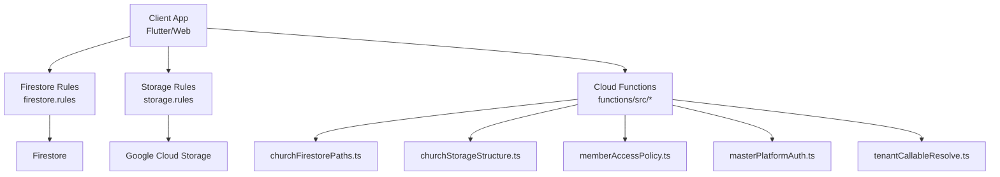
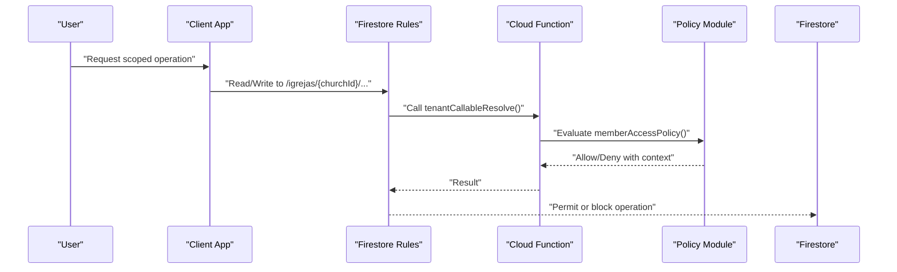
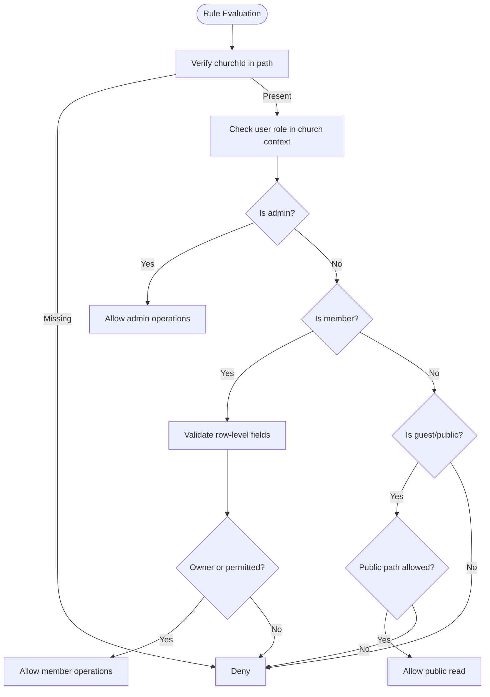
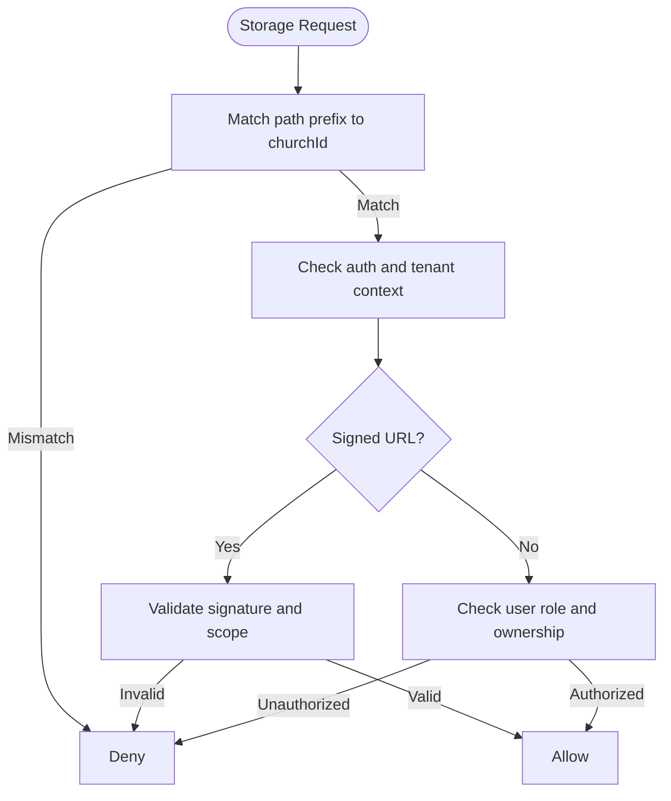
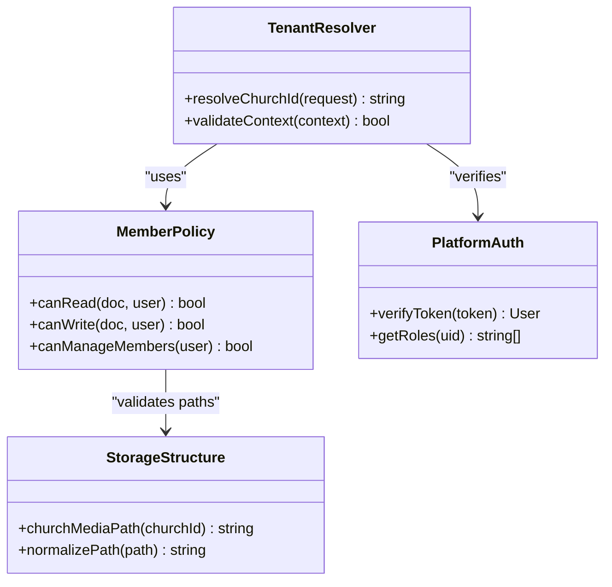
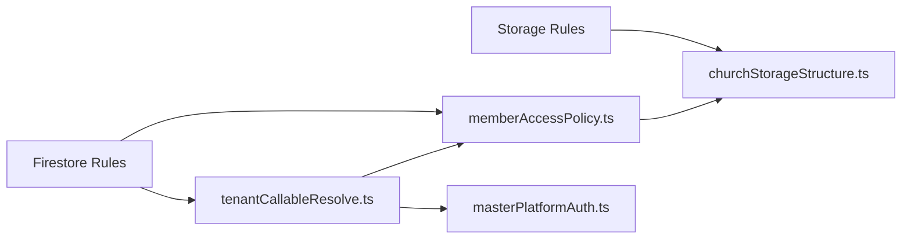

# Data Isolation & Security

<cite>
**Referenced Files in This Document**
- [firestore.rules](file://firestore.rules)
- [storage.rules](file://storage.rules)
- [firebase.json](file://firebase.json)
- [functions/index.ts](file://functions/src/index.ts)
- [functions/churchFirestorePaths.ts](file://functions/src/churchFirestorePaths.ts)
- [functions/churchStorageStructure.ts](file://functions/src/churchStorageStructure.ts)
- [functions/memberAccessPolicy.ts](file://functions/src/memberAccessPolicy.ts)
- [functions/masterPlatformAuth.ts](file://functions/src/masterPlatformAuth.ts)
- [functions/tenantCallableResolve.ts](file://functions/src/tenantCallableResolve.ts)
- [scripts/firebase_rules_gcp_publish.cjs](file://scripts/firebase_rules_gcp_publish.cjs)
- [security_rules_test_firestore/test/firestore.rules.test.js](file://security_rules_test_firestore/test/firestore.rules.test.js)
</cite>

## Table of Contents
1. [Introduction](#introduction)
2. [Project Structure](#project-structure)
3. [Core Components](#core-components)
4. [Architecture Overview](#architecture-overview)
5. [Detailed Component Analysis](#detailed-component-analysis)
6. [Dependency Analysis](#dependency-analysis)
7. [Performance Considerations](#performance-considerations)
8. [Troubleshooting Guide](#troubleshooting-guide)
9. [Conclusion](#conclusion)

## Introduction
This document explains how the multi-tenant system enforces data isolation and security using Firestore security rules, Cloud Storage rules, and server-side helpers. It focuses on path-based tenant boundaries (church-specific documents and collections), row-level and field-level access control, dynamic permission evaluation, and storage isolation for media assets. It also provides role-based examples (church admin, member, guest), common vulnerabilities and mitigations, and troubleshooting guidance for debugging security rule evaluation.

## Project Structure
The security implementation spans three layers:
- Firestore rules defining tenant-scoped read/write permissions and role checks
- Cloud Storage rules isolating media per tenant and enforcing authorization
- Cloud Functions that provide shared logic for tenant resolution, path construction, and policy evaluation

**Diagram sources**
- [firestore.rules](file://firestore.rules)
- [storage.rules](file://storage.rules)
- [functions/src/index.ts](file://functions/src/index.ts)
- [functions/src/churchFirestorePaths.ts](file://functions/src/churchFirestorePaths.ts)
- [functions/src/churchStorageStructure.ts](file://functions/src/churchStorageStructure.ts)
- [functions/src/memberAccessPolicy.ts](file://functions/src/memberAccessPolicy.ts)
- [functions/src/masterPlatformAuth.ts](file://functions/src/masterPlatformAuth.ts)
- [functions/src/tenantCallableResolve.ts](file://functions/src/tenantCallableResolve.ts)

**Section sources**
- [firebase.json](file://firebase.json)

## Core Components
- Firestore rules enforce tenant boundaries by requiring all reads/writes to include a church identifier in the path and validating user roles against church membership or administrative privileges.
- Storage rules isolate media under tenant-specific folders and require signed URLs or authenticated requests with matching tenant context.
- Cloud Functions centralize tenant resolution and policy evaluation, ensuring consistent behavior across client calls and background tasks.

Key responsibilities:
- Path validation and normalization for tenant-scoped resources
- Role-based access control (RBAC) for church admins, members, and guests
- Field-level restrictions for sensitive attributes
- Dynamic permission checks via callable functions and helper modules

**Section sources**
- [firestore.rules](file://firestore.rules)
- [storage.rules](file://storage.rules)
- [functions/src/churchFirestorePaths.ts](file://functions/src/churchFirestorePaths.ts)
- [functions/src/churchStorageStructure.ts](file://functions/src/churchStorageStructure.ts)
- [functions/src/memberAccessPolicy.ts](file://functions/src/memberAccessPolicy.ts)
- [functions/src/masterPlatformAuth.ts](file://functions/src/masterPlatformAuth.ts)
- [functions/src/tenantCallableResolve.ts](file://functions/src/tenantCallableResolve.ts)

## Architecture Overview
The system uses a tenant-first design where every resource belongs to a church tenant. Access is granted only when:
- The request targets a path containing the correct church ID
- The authenticated user has an appropriate role within that church
- Any additional conditions (e.g., ownership, time windows) are satisfied

**Diagram sources**
- [firestore.rules](file://firestore.rules)
- [functions/src/tenantCallableResolve.ts](file://functions/src/tenantCallableResolve.ts)
- [functions/src/memberAccessPolicy.ts](file://functions/src/memberAccessPolicy.ts)

## Detailed Component Analysis

### Firestore Security Rules
- Tenant boundary enforcement: All paths must include a church identifier segment; operations outside this structure are denied.
- Role-based access: Church admins can manage church-scoped collections; members have limited read/write based on membership status; guests may access public endpoints only.
- Row-level security: Each document includes fields indicating ownership or association (e.g., memberId, roleId); rules validate these fields against the requesting user.
- Field-level access: Sensitive fields are restricted to specific roles or owners; updates are validated to prevent unauthorized mutations.
- Dynamic evaluation: Complex policies are delegated to Cloud Functions for consistency and maintainability.

**Diagram sources**
- [firestore.rules](file://firestore.rules)
- [functions/src/memberAccessPolicy.ts](file://functions/src/memberAccessPolicy.ts)

**Section sources**
- [firestore.rules](file://firestore.rules)
- [functions/src/memberAccessPolicy.ts](file://functions/src/memberAccessPolicy.ts)

### Cloud Storage Rules
- Media isolation: Files are stored under tenant-specific prefixes (e.g., igrejas/{churchId}/media/...), preventing cross-tenant access.
- Authorization: Uploads and downloads require either signed URLs generated by trusted functions or authenticated requests with matching tenant context.
- Validation: File metadata (e.g., contentType, size) is enforced; operations are blocked if tenant context does not match the file’s path.

**Diagram sources**
- [storage.rules](file://storage.rules)
- [functions/src/churchStorageStructure.ts](file://functions/src/churchStorageStructure.ts)

**Section sources**
- [storage.rules](file://storage.rules)
- [functions/src/churchStorageStructure.ts](file://functions/src/churchStorageStructure.ts)

### Cloud Functions for Tenant Resolution and Policy
- Tenant resolution: Callable functions resolve the active church context from request headers, tokens, or parameters.
- Policy evaluation: Shared modules evaluate permissions consistently across clients and background tasks.
- Path generation: Helpers construct canonical paths for Firestore and Storage, reducing client errors and ensuring rule compliance.

**Diagram sources**
- [functions/src/tenantCallableResolve.ts](file://functions/src/tenantCallableResolve.ts)
- [functions/src/memberAccessPolicy.ts](file://functions/src/memberAccessPolicy.ts)
- [functions/src/churchStorageStructure.ts](file://functions/src/churchStorageStructure.ts)
- [functions/src/masterPlatformAuth.ts](file://functions/src/masterPlatformAuth.ts)

**Section sources**
- [functions/src/tenantCallableResolve.ts](file://functions/src/tenantCallableResolve.ts)
- [functions/src/memberAccessPolicy.ts](file://functions/src/memberAccessPolicy.ts)
- [functions/src/churchStorageStructure.ts](file://functions/src/churchStorageStructure.ts)
- [functions/src/masterPlatformAuth.ts](file://functions/src/masterPlatformAuth.ts)

### Role-Based Access Examples
- Church admin: Full access to church-scoped collections, including member management and content moderation; can update sensitive fields.
- Member: Read access to public church data; write access limited to personal records and approved workflows; cannot modify admin-only fields.
- Guest: Read-only access to explicitly public endpoints; no write operations; cannot access private church resources.

These patterns are enforced through:
- Path constraints ensuring tenant scoping
- Role checks against membership records
- Field-level guards for sensitive attributes

**Section sources**
- [firestore.rules](file://firestore.rules)
- [functions/src/memberAccessPolicy.ts](file://functions/src/memberAccessPolicy.ts)

### Row-Level and Field-Level Security
- Row-level: Documents include owner or association fields; rules compare these against the requesting user’s identity and role.
- Field-level: Updates are validated to allow only permitted field mutations; reads restrict exposure of sensitive fields to authorized roles.

Implementation highlights:
- Use of request.resource and request.auth to validate changes
- Conditional allows based on ownership and role matrices
- Delegation to policy modules for complex decisions

**Section sources**
- [firestore.rules](file://firestore.rules)
- [functions/src/memberAccessPolicy.ts](file://functions/src/memberAccessPolicy.ts)

### Storage Isolation for Media Files
- Tenant-specific prefixes ensure files are isolated per church.
- Signed URLs are generated by trusted functions with explicit scopes and expiration.
- Clients must present valid tokens or signed URLs; otherwise, requests are denied.

**Section sources**
- [storage.rules](file://storage.rules)
- [functions/src/churchStorageStructure.ts](file://functions/src/churchStorageStructure.ts)

## Dependency Analysis
Security components depend on each other to enforce consistent policies:
- Firestore rules rely on Cloud Functions for dynamic evaluations
- Storage rules depend on function-generated signed URLs and tenant path conventions
- Functions share policy modules to avoid duplication and drift

**Diagram sources**
- [firestore.rules](file://firestore.rules)
- [storage.rules](file://storage.rules)
- [functions/src/tenantCallableResolve.ts](file://functions/src/tenantCallableResolve.ts)
- [functions/src/memberAccessPolicy.ts](file://functions/src/memberAccessPolicy.ts)
- [functions/src/churchStorageStructure.ts](file://functions/src/churchStorageStructure.ts)
- [functions/src/masterPlatformAuth.ts](file://functions/src/masterPlatformAuth.ts)

**Section sources**
- [functions/src/index.ts](file://functions/src/index.ts)

## Performance Considerations
- Minimize expensive function calls in hot paths; cache tenant context where safe.
- Prefer path-based scoping to reduce rule complexity and improve evaluation speed.
- Use indexes aligned with tenant-scoped queries to avoid full collection scans.
- Avoid broad wildcard rules; be explicit about allowed paths and operations.

[No sources needed since this section provides general guidance]

## Troubleshooting Guide
Common issues and resolutions:
- Cross-tenant access attempts: Ensure all paths include the correct churchId and that clients do not hardcode or guess IDs.
- Permission denied on writes: Verify row-level fields (owner, roleId) and field-level guards; confirm user roles in membership records.
- Storage access failures: Confirm signed URL validity, scope, and expiration; check tenant prefix alignment.
- Inconsistent behavior: Centralize policy logic in functions and reuse across clients; test with rule tests.

Debugging techniques:
- Use the Firebase Emulator Suite to simulate rule evaluations locally.
- Add logging in Cloud Functions to trace tenant resolution and policy outcomes.
- Run automated tests in the security_rules_test_firestore directory to validate rule changes.

**Section sources**
- [security_rules_test_firestore/test/firestore.rules.test.js](file://security_rules_test_firestore/test/firestore.rules.test.js)
- [functions/src/tenantCallableResolve.ts](file://functions/src/tenantCallableResolve.ts)
- [functions/src/memberAccessPolicy.ts](file://functions/src/memberAccessPolicy.ts)

## Conclusion
The multi-tenant system enforces robust data isolation through strict Firestore and Storage rules, reinforced by centralized Cloud Functions for tenant resolution and policy evaluation. By anchoring access control to church-specific paths and roles, the system prevents cross-tenant leakage while enabling fine-grained row and field-level permissions. Consistent use of helpers and policy modules ensures maintainability and reduces security risks. Regular testing and careful rule design are essential to sustain secure operations at scale.