# Multi-Tenant Architecture

<cite>
**Referenced Files in This Document**
- [firestore.rules](file://firestore.rules)
- [storage.rules](file://storage.rules)
- [functions/src/churchTenantProvisioning.ts](file://functions/src/churchTenantProvisioning.ts)
- [functions/src/churchTenantFields.ts](file://functions/src/churchTenantFields.ts)
- [functions/src/churchTenantConsolidation.ts](file://functions/src/churchTenantConsolidation.ts)
- [functions/src/churchFirestorePaths.ts](file://functions/src/churchFirestorePaths.ts)
- [functions/src/churchStorageStructure.ts](file://functions/src/churchStorageStructure.ts)
- [functions/src/tenantCallableResolve.ts](file://functions/src/tenantCallableResolve.ts)
- [functions/src/memberAccessPolicy.ts](file://functions/src/memberAccessPolicy.ts)
- [functions/src/notificationBranding.ts](file://functions/src/notificationBranding.ts)
- [functions/src/migrateTenantFirestoreCollections.ts](file://functions/src/migrateTenantFirestoreCollections.ts)
- [functions/src/cleanupOrphanFiles.js](file://functions/src/cleanupOrphanFiles.js)
- [functions/index.ts](file://functions/index.ts)
- [flutter_app/lib/firebase_options.dart](file://flutter_app/lib/firebase_options.dart)
- [flutter_app/pubspec.yaml](file://flutter_app/pubspec.yaml)
- [firebase.json](file://firebase.json)
- [firestore.indexes.json](file://firestore.indexes.json)
</cite>

## Table of Contents
1. [Introduction](#introduction)
2. [Project Structure](#project-structure)
3. [Core Components](#core-components)
4. [Architecture Overview](#architecture-overview)
5. [Detailed Component Analysis](#detailed-component-analysis)
6. [Dependency Analysis](#dependency-analysis)
7. [Performance Considerations](#performance-considerations)
8. [Troubleshooting Guide](#troubleshooting-guide)
9. [Conclusion](#conclusion)
10. [Appendices](#appendices)

## Introduction
This document explains the multi-tenant architecture implemented in Gestão Yahweh Premium for isolating data and configuration across multiple church organizations (tenants) within a single application instance. It covers tenant provisioning, Firestore security rules-based isolation, custom branding per tenant, database schema organization, access control mechanisms, role-based permissions, cross-tenant communication restrictions, migration strategies, backup approaches, performance optimization, troubleshooting guidance, and best practices for extending the system.

## Project Structure
The multi-tenant implementation spans several layers:
- Cloud Functions orchestration and utilities for tenant lifecycle, paths, storage structure, and policies
- Firestore and Storage security rules enforcing tenant-scoped access
- Flutter app initialization and runtime tenant resolution
- Indexing and deployment configuration

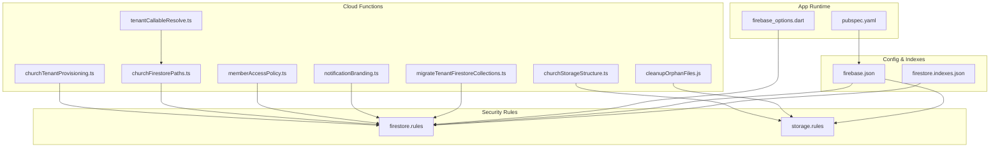

**Diagram sources**
- [functions/src/churchTenantProvisioning.ts](file://functions/src/churchTenantProvisioning.ts)
- [functions/src/churchFirestorePaths.ts](file://functions/src/churchFirestorePaths.ts)
- [functions/src/churchStorageStructure.ts](file://functions/src/churchStorageStructure.ts)
- [functions/src/memberAccessPolicy.ts](file://functions/src/memberAccessPolicy.ts)
- [functions/src/notificationBranding.ts](file://functions/src/notificationBranding.ts)
- [functions/src/tenantCallableResolve.ts](file://functions/src/tenantCallableResolve.ts)
- [functions/src/migrateTenantFirestoreCollections.ts](file://functions/src/migrateTenantFirestoreCollections.ts)
- [functions/src/cleanupOrphanFiles.js](file://functions/src/cleanupOrphanFiles.js)
- [firestore.rules](file://firestore.rules)
- [storage.rules](file://storage.rules)
- [flutter_app/lib/firebase_options.dart](file://flutter_app/lib/firebase_options.dart)
- [flutter_app/pubspec.yaml](file://flutter_app/pubspec.yaml)
- [firebase.json](file://firebase.json)
- [firestore.indexes.json](file://firestore.indexes.json)

**Section sources**
- [functions/index.ts](file://functions/index.ts)
- [firebase.json](file://firebase.json)
- [firestore.indexes.json](file://firestore.indexes.json)

## Core Components
- Tenant Provisioning: Creates and initializes tenant metadata, default collections, and baseline configuration during onboarding.
- Path Resolution: Centralizes tenant-scoped path construction to ensure consistent scoping across Firestore and Storage.
- Storage Structure: Defines bucket/folder layout per tenant to isolate media and documents.
- Access Policy: Enforces role-based permissions scoped to the active tenant.
- Branding: Supplies tenant-specific branding assets and notification templates.
- Callable Resolve: Resolves the effective tenant context for callable functions based on request context.
- Migration Utilities: Backfills and migrates tenant fields and collections safely.
- Cleanup Utilities: Removes orphaned files and enforces storage hygiene per tenant.

**Section sources**
- [functions/src/churchTenantProvisioning.ts](file://functions/src/churchTenantProvisioning.ts)
- [functions/src/churchFirestorePaths.ts](file://functions/src/churchFirestorePaths.ts)
- [functions/src/churchStorageStructure.ts](file://functions/src/churchStorageStructure.ts)
- [functions/src/memberAccessPolicy.ts](file://functions/src/memberAccessPolicy.ts)
- [functions/src/notificationBranding.ts](file://functions/src/notificationBranding.ts)
- [functions/src/tenantCallableResolve.ts](file://functions/src/tenantCallableResolve.ts)
- [functions/src/migrateTenantFirestoreCollections.ts](file://functions/src/migrateTenantFirestoreCollections.ts)
- [functions/src/cleanupOrphanFiles.js](file://functions/src/cleanupOrphanFiles.js)

## Architecture Overview
The system uses a single Firestore project and a single Storage bucket with strict tenant scoping enforced by security rules and server-side helpers. Each tenant is represented by a canonical identifier used consistently across all resources. Clients authenticate via Firebase Auth; serverless functions resolve the tenant context and enforce policies before any read/write operation.

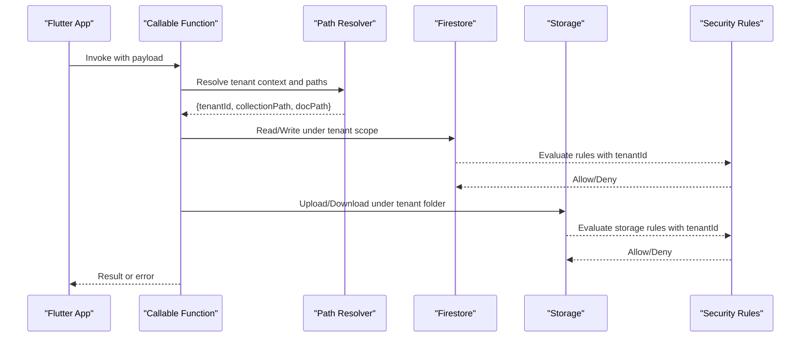

**Diagram sources**
- [functions/src/tenantCallableResolve.ts](file://functions/src/tenantCallableResolve.ts)
- [functions/src/churchFirestorePaths.ts](file://functions/src/churchFirestorePaths.ts)
- [functions/src/churchStorageStructure.ts](file://functions/src/churchStorageStructure.ts)
- [firestore.rules](file://firestore.rules)
- [storage.rules](file://storage.rules)

## Detailed Component Analysis

### Tenant Provisioning
- Purpose: Initialize tenant metadata, default collections, and baseline settings when a new church joins the platform.
- Key responsibilities:
  - Create tenant record with unique identifiers and status flags
  - Seed default collections and reference data
  - Configure initial roles and admin users
  - Prepare storage folders and default assets
- Integration points:
  - Invoked by admin flows or self-service signup pipelines
  - Uses centralized path builders to ensure consistency

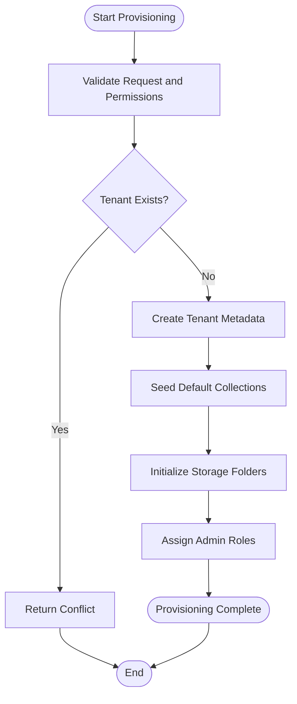

**Diagram sources**
- [functions/src/churchTenantProvisioning.ts](file://functions/src/churchTenantProvisioning.ts)

**Section sources**
- [functions/src/churchTenantProvisioning.ts](file://functions/src/churchTenantProvisioning.ts)

### Tenant Path Resolution
- Purpose: Provide deterministic, tenant-scoped paths for Firestore collections and documents.
- Responsibilities:
  - Normalize tenant identifiers
  - Build safe paths for collections, documents, and nested nodes
  - Prevent path traversal and injection
- Usage:
  - All server-side operations must use these helpers to avoid accidental cross-tenant access

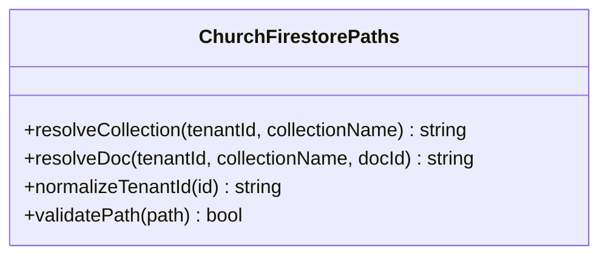

**Diagram sources**
- [functions/src/churchFirestorePaths.ts](file://functions/src/churchFirestorePaths.ts)

**Section sources**
- [functions/src/churchFirestorePaths.ts](file://functions/src/churchFirestorePaths.ts)

### Storage Structure and Isolation
- Purpose: Organize Storage buckets by tenant to isolate media and attachments.
- Responsibilities:
  - Define folder hierarchy per tenant
  - Map Firestore document references to Storage paths
  - Ensure cleanup hooks remove tenant artifacts on deletion
- Security:
  - Storage rules validate tenant ownership and user roles

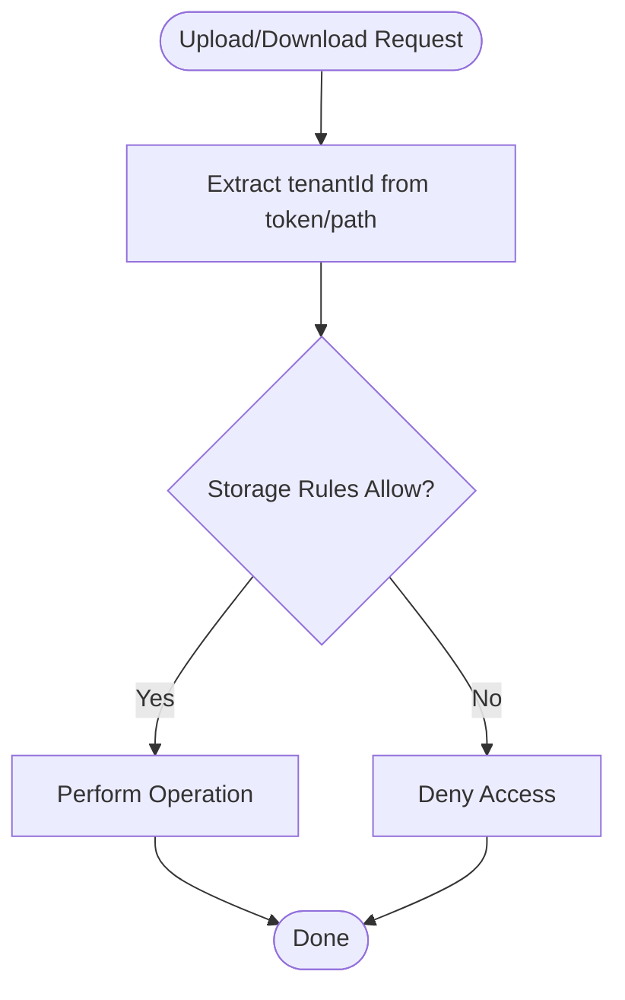

**Diagram sources**
- [functions/src/churchStorageStructure.ts](file://functions/src/churchStorageStructure.ts)
- [storage.rules](file://storage.rules)

**Section sources**
- [functions/src/churchStorageStructure.ts](file://functions/src/churchStorageStructure.ts)
- [storage.rules](file://storage.rules)

### Access Control and Role-Based Permissions
- Purpose: Enforce tenant-scoped RBAC for members and administrators.
- Responsibilities:
  - Validate user membership in the target tenant
  - Check role-based permissions for each operation
  - Restrict cross-tenant actions unless explicitly allowed
- Integration:
  - Used by Cloud Functions and enforced by Firestore rules

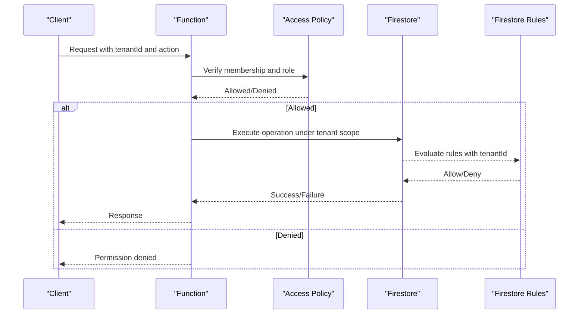

**Diagram sources**
- [functions/src/memberAccessPolicy.ts](file://functions/src/memberAccessPolicy.ts)
- [firestore.rules](file://firestore.rules)

**Section sources**
- [functions/src/memberAccessPolicy.ts](file://functions/src/memberAccessPolicy.ts)
- [firestore.rules](file://firestore.rules)

### Custom Branding per Tenant
- Purpose: Deliver tenant-specific branding for UI and notifications.
- Responsibilities:
  - Store branding assets and templates per tenant
  - Serve correct branding based on resolved tenant context
  - Cache branding for performance where appropriate

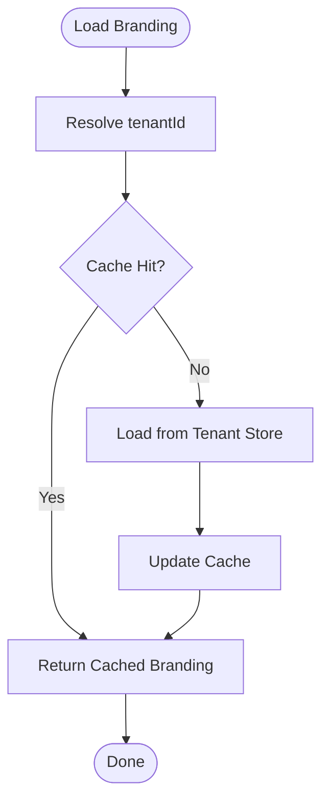

**Diagram sources**
- [functions/src/notificationBranding.ts](file://functions/src/notificationBranding.ts)

**Section sources**
- [functions/src/notificationBranding.ts](file://functions/src/notificationBranding.ts)

### Tenant Context Resolution for Callable Functions
- Purpose: Determine the effective tenant for function invocations using request context.
- Responsibilities:
  - Extract tenantId from headers, tokens, or payloads
  - Validate tenant existence and active status
  - Fail fast on invalid or missing tenant context

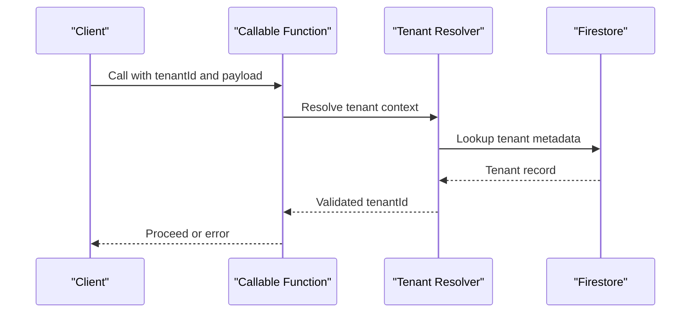

**Diagram sources**
- [functions/src/tenantCallableResolve.ts](file://functions/src/tenantCallableResolve.ts)

**Section sources**
- [functions/src/tenantCallableResolve.ts](file://functions/src/tenantCallableResolve.ts)

### Data Migration and Backfill Utilities
- Purpose: Safely migrate tenant data structures and backfill missing fields.
- Responsibilities:
  - Idempotent migrations with version tracking
  - Batch processing with retries and error handling
  - Validation and rollback strategies

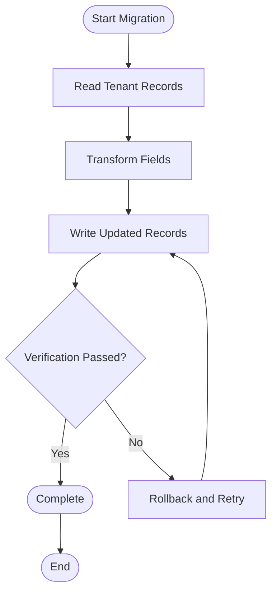

**Diagram sources**
- [functions/src/migrateTenantFirestoreCollections.ts](file://functions/src/migrateTenantFirestoreCollections.ts)

**Section sources**
- [functions/src/migrateTenantFirestoreCollections.ts](file://functions/src/migrateTenantFirestoreCollections.ts)

### Orphan File Cleanup
- Purpose: Remove unused media and temporary files per tenant to maintain storage hygiene.
- Responsibilities:
  - Scan tenant storage folders
  - Cross-reference with Firestore references
  - Delete orphans and update counters

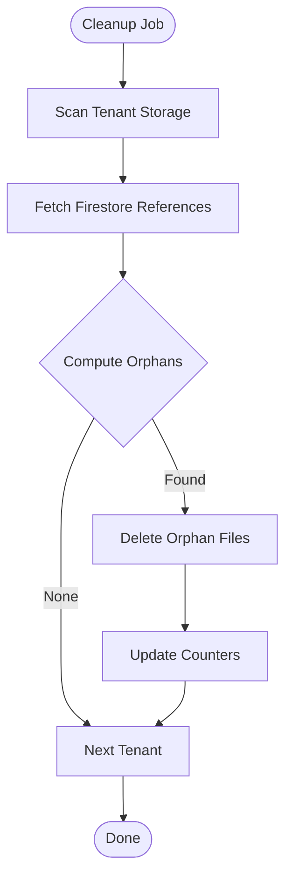

**Diagram sources**
- [functions/src/cleanupOrphanFiles.js](file://functions/src/cleanupOrphanFiles.js)

**Section sources**
- [functions/src/cleanupOrphanFiles.js](file://functions/src/cleanupOrphanFiles.js)

## Dependency Analysis
The multi-tenant system relies on tight integration between Cloud Functions, security rules, and app configuration:

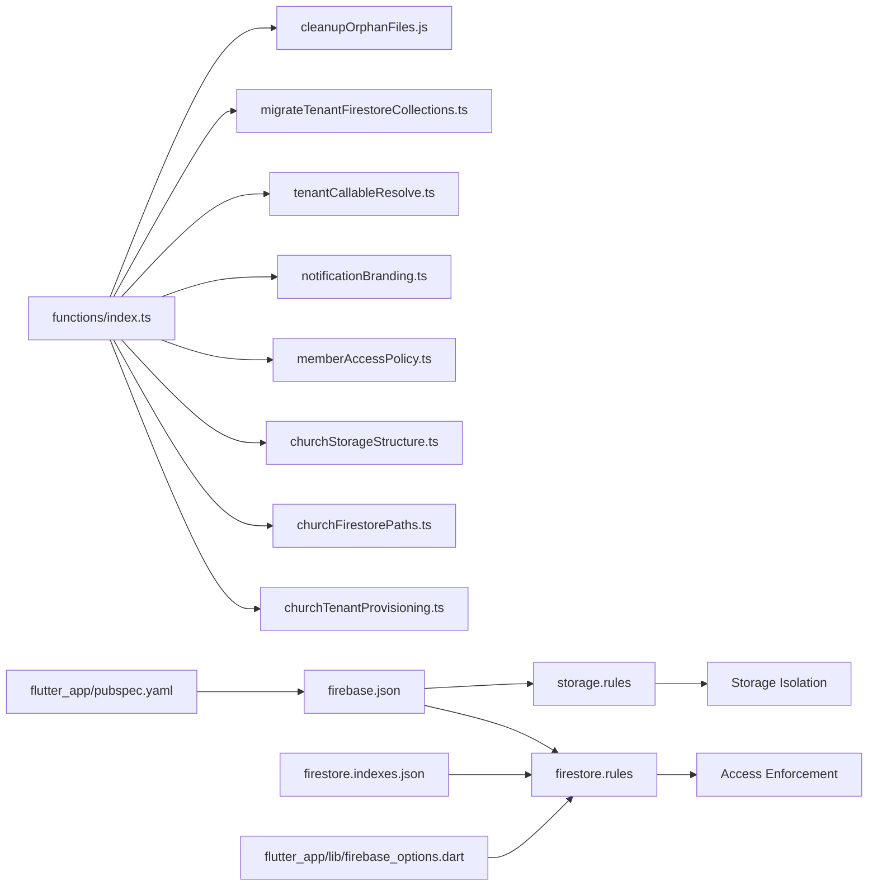

**Diagram sources**
- [functions/index.ts](file://functions/index.ts)
- [firestore.rules](file://firestore.rules)
- [storage.rules](file://storage.rules)
- [firebase.json](file://firebase.json)
- [firestore.indexes.json](file://firestore.indexes.json)
- [flutter_app/lib/firebase_options.dart](file://flutter_app/lib/firebase_options.dart)
- [flutter_app/pubspec.yaml](file://flutter_app/pubspec.yaml)

**Section sources**
- [functions/index.ts](file://functions/index.ts)
- [firebase.json](file://firebase.json)
- [firestore.indexes.json](file://firestore.indexes.json)

## Performance Considerations
- Use tenant-scoped indexes defined in the indexes configuration to optimize queries.
- Prefer reading minimal tenant metadata at startup and caching branding and settings.
- Batch write operations during provisioning and migrations to reduce round trips.
- Leverage Cloud Functions concurrency limits and retry policies for robustness.
- Avoid scanning entire tenants; use targeted queries and pagination.
- Monitor Firestore reads/writes per tenant to identify hotspots and optimize accordingly.

[No sources needed since this section provides general guidance]

## Troubleshooting Guide
Common issues and resolutions:
- Tenant not found:
  - Verify tenant existence and active status via resolver functions
  - Check provisioning logs and seed data creation
- Permission denied:
  - Confirm user membership and role in the target tenant
  - Review Firestore and Storage rules for tenant-scoped conditions
- Storage upload failures:
  - Ensure correct tenant folder path and permissions
  - Validate CORS and bucket configurations
- Migration errors:
  - Inspect batch job logs and retry counts
  - Validate field transformations and idempotency keys
- Performance regressions:
  - Analyze query patterns and add tenant-scoped indexes
  - Reduce unnecessary reads by leveraging caches and denormalization

**Section sources**
- [functions/src/tenantCallableResolve.ts](file://functions/src/tenantCallableResolve.ts)
- [functions/src/memberAccessPolicy.ts](file://functions/src/memberAccessPolicy.ts)
- [functions/src/churchStorageStructure.ts](file://functions/src/churchStorageStructure.ts)
- [functions/src/migrateTenantFirestoreCollections.ts](file://functions/src/migrateTenantFirestoreCollections.ts)
- [firestore.rules](file://firestore.rules)
- [storage.rules](file://storage.rules)

## Conclusion
Gestão Yahweh Premium implements a robust multi-tenant architecture centered on tenant-scoped paths, strict security rules, and server-side policy enforcement. The design ensures data isolation, customizable branding, and scalable access control while providing tools for migration, cleanup, and performance tuning. Extending the system involves adhering to centralized path resolvers, updating security rules consistently, and maintaining idempotent migration utilities.

[No sources needed since this section summarizes without analyzing specific files]

## Appendices

### Tenant Data Model Overview
- Tenant metadata includes identifiers, status, configuration flags, and branding references
- User-to-tenant membership records store roles and permissions
- Media and documents are organized under tenant-scoped paths in both Firestore and Storage

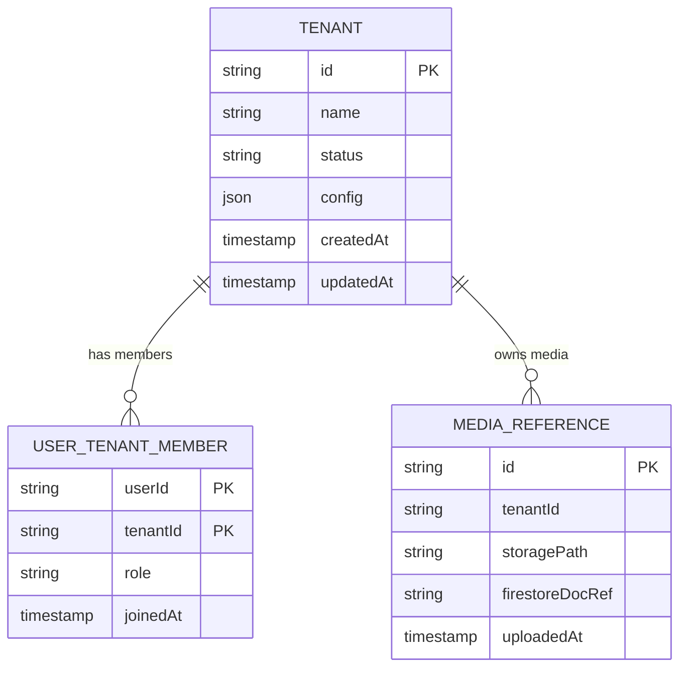

**Diagram sources**
- [functions/src/churchTenantProvisioning.ts](file://functions/src/churchTenantProvisioning.ts)
- [functions/src/churchStorageStructure.ts](file://functions/src/churchStorageStructure.ts)
- [functions/src/memberAccessPolicy.ts](file://functions/src/memberAccessPolicy.ts)

### Best Practices for Extending the Multi-Tenant System
- Always use centralized path resolvers for Firestore and Storage
- Enforce tenant checks in every Cloud Function entry point
- Keep security rules aligned with function logic and data models
- Implement idempotent migrations with version tracking
- Add tenant-scoped indexes for frequent query patterns
- Log tenant context in all operations for auditability

[No sources needed since this section provides general guidance]