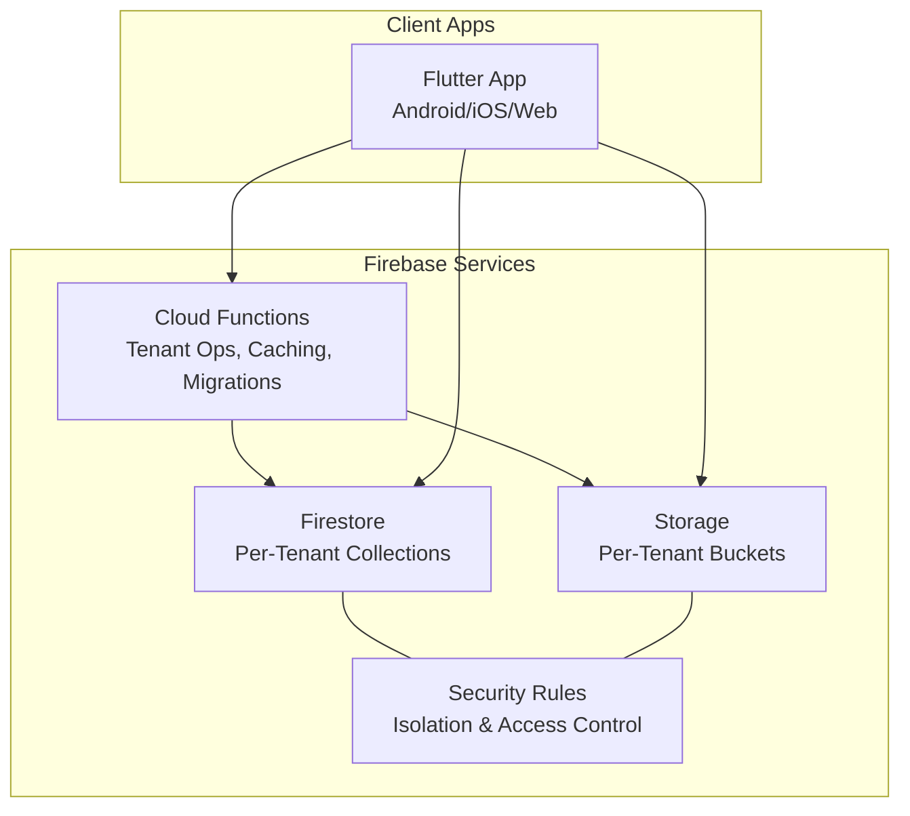
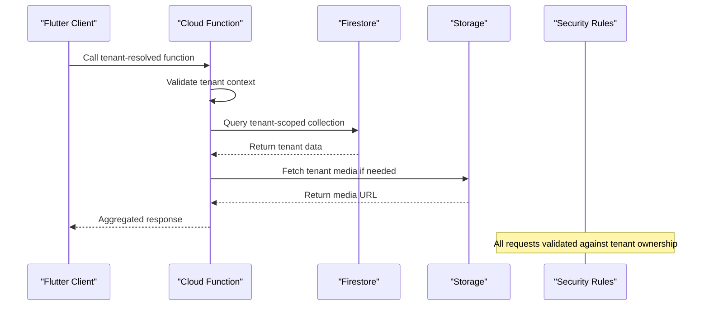
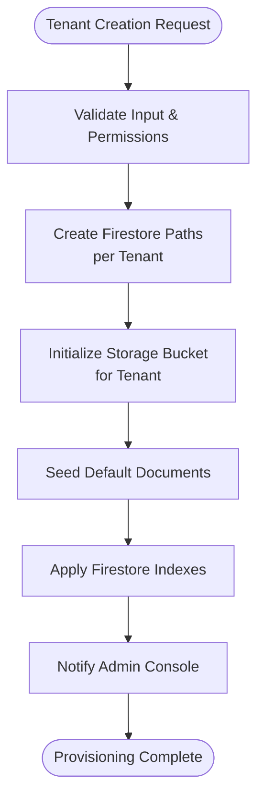
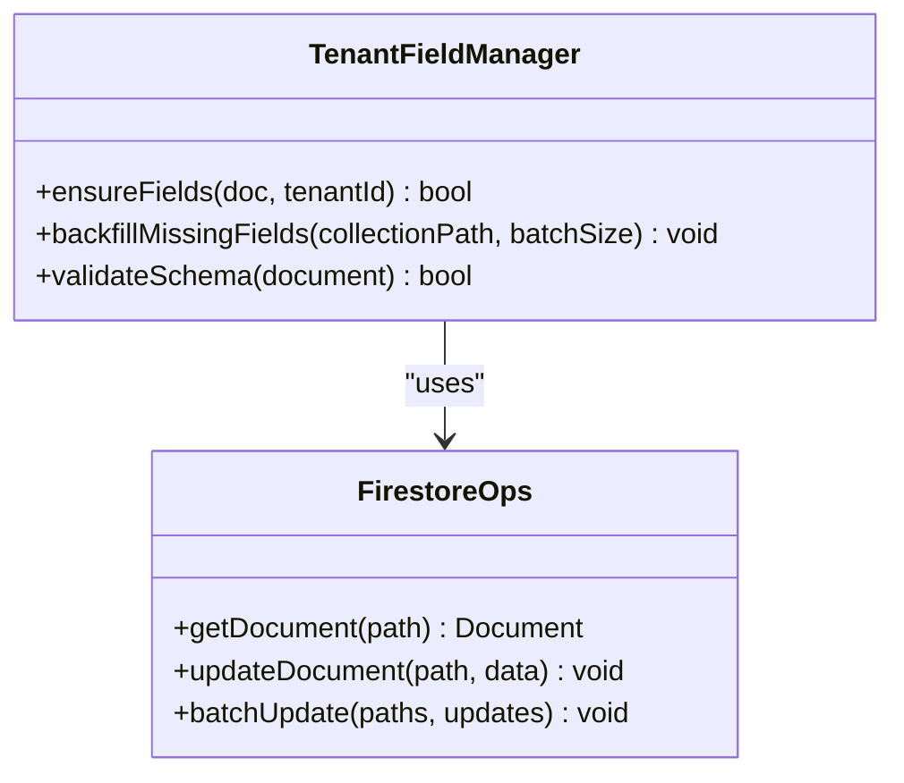
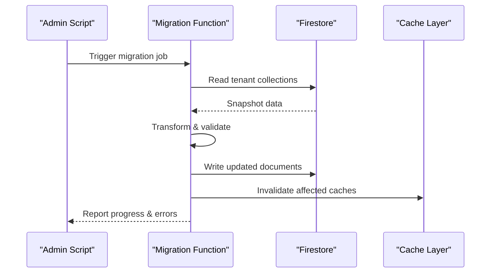
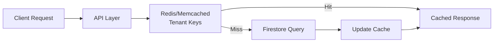
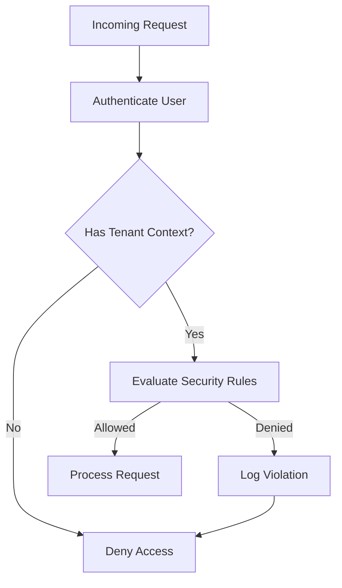
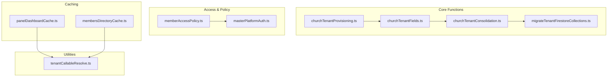

# Multi-Tenant Best Practices

<cite>
**Referenced Files in This Document**
- [README.md](file://README.md)
- [firebase.json](file://firebase.json)
- [firestore.rules](file://firestore.rules)
- [storage.rules](file://storage.rules)
- [functions/index.ts](file://functions/src/index.ts)
- [functions/churchTenantFields.ts](file://functions/src/churchTenantFields.ts)
- [functions/churchTenantProvisioning.ts](file://functions/src/churchTenantProvisioning.ts)
- [functions/churchTenantConsolidation.ts](file://functions/src/churchTenantConsolidation.ts)
- [functions/migrateTenantFirestoreCollections.ts](file://functions/src/migrateTenantFirestoreCollections.ts)
- [functions/masterPlatformAuth.ts](file://functions/src/masterPlatformAuth.ts)
- [functions/memberAccessPolicy.ts](file://functions/src/memberAccessPolicy.ts)
- [functions/panelDashboardCache.ts](file://functions/src/panelDashboardCache.ts)
- [functions/membersDirectoryCache.ts](file://functions/src/membersDirectoryCache.ts)
- [functions/publicChurchSlugIndex.ts](file://functions/src/publicChurchSlugResolver.ts)
- [functions/tenantCallableResolve.ts](file://functions/src/tenantCallableResolve.ts)
- [scripts/migrate_legacy_multi_tenant_data.py](file://scripts/migrate_legacy_multi_tenant_data.py)
- [scripts/migrate_legacy_storage.py](file://scripts/migrate_legacy_storage.py)
- [docs/multi-tenant-impact-report.md](file://docs/multi-tenant-impact-report.md)
- [docs/FIREBASE_OBSERVABILITY.md](file://docs/FIREBASE_OBSERVABILITY.md)
- [docs/ARCHITECTURE_PERFORMANCE_MULTI_PLATFORM.md](file://docs/ARCHITECTURE_PERFORMANCE_MULTI_PLATFORM.md)
</cite>

## Table of Contents
1. Introduction
2. Project Structure
3. Core Components
4. Architecture Overview
5. Detailed Component Analysis
6. Dependency Analysis
7. Performance Considerations
8. Troubleshooting Guide
9. Conclusion
10. Appendices

## Introduction
This document consolidates best practices and architectural patterns for multi-tenant system design, grounded in the repository’s Firebase-based architecture. It covers proven strategies for scaling multi-tenant applications (database partitioning, caching, resource allocation), performance optimization techniques (query optimization, connection pooling, memory management), anti-patterns and their solutions, monitoring and observability, backup and disaster recovery, migration strategies, troubleshooting, and testing guidelines. The content is tailored to a Firestore + Cloud Functions + Storage environment with strict tenant isolation enforced via security rules and server-side logic.

## Project Structure
The project follows a multi-platform Flutter app backed by Firebase services:
- Frontend: Flutter application across Android, iOS, Web, macOS, Windows, Linux
- Backend: Cloud Functions (TypeScript/JavaScript) orchestrating tenant provisioning, data migrations, caching, and cross-tenant operations
- Data: Firestore collections organized per tenant, Storage buckets scoped per tenant, Security Rules enforcing isolation
- Tooling: Scripts for migrations, backups, and deployment automation

**Diagram sources**
- [firebase.json](file://firebase.json)
- [firestore.rules](file://firestore.rules)
- [storage.rules](file://storage.rules)
- [functions/src/index.ts](file://functions/src/index.ts)

**Section sources**
- [README.md](file://README.md)
- [firebase.json](file://firebase.json)

## Core Components
Key multi-tenant components implemented in Cloud Functions and configuration files:
- Tenant Provisioning: Automated setup of Firestore structure and Storage buckets per tenant
- Tenant Field Management: Ensuring consistent tenant-scoped fields across documents
- Tenant Consolidation: Normalizing legacy data into canonical tenant structures
- Migration Utilities: Batch updates and schema evolution across tenants
- Access Policies: Role-based access control within tenant boundaries
- Caching Layer: Dashboard and directory caches optimized for multi-tenant reads
- Callable Resolvers: Secure tenant resolution from client calls

**Section sources**
- [functions/src/churchTenantProvisioning.ts](file://functions/src/churchTenantProvisioning.ts)
- [functions/src/churchTenantFields.ts](file://functions/src/churchTenantFields.ts)
- [functions/src/churchTenantConsolidation.ts](file://functions/src/churchTenantConsolidation.ts)
- [functions/src/migrateTenantFirestoreCollections.ts](file://functions/src/migrateTenantFirestoreCollections.ts)
- [functions/src/memberAccessPolicy.ts](file://functions/src/memberAccessPolicy.ts)
- [functions/src/panelDashboardCache.ts](file://functions/src/panelDashboardCache.ts)
- [functions/src/membersDirectoryCache.ts](file://functions/src/membersDirectoryCache.ts)
- [functions/src/tenantCallableResolve.ts](file://functions/src/tenantCallableResolve.ts)

## Architecture Overview
The multi-tenant architecture leverages Firestore’s hierarchical data model and Storage bucket scoping to isolate tenants. Cloud Functions enforce business logic, while Security Rules ensure runtime isolation. Caching reduces read latency for frequently accessed tenant data.

**Diagram sources**
- [functions/src/tenantCallableResolve.ts](file://functions/src/tenantCallableResolve.ts)
- [functions/src/churchTenantFields.ts](file://functions/src/churchTenantFields.ts)
- [firestore.rules](file://firestore.rules)
- [storage.rules](file://storage.rules)

## Detailed Component Analysis

### Tenant Provisioning Workflow
Automated provisioning ensures each tenant gets isolated Firestore paths and Storage buckets.

**Diagram sources**
- [functions/src/churchTenantProvisioning.ts](file://functions/src/churchTenantProvisioning.ts)

**Section sources**
- [functions/src/churchTenantProvisioning.ts](file://functions/src/churchTenantProvisioning.ts)

### Tenant Field Consistency
Ensures all tenant documents include required fields like churchId, createdAt, updatedAt, and audit trails.

**Diagram sources**
- [functions/src/churchTenantFields.ts](file://functions/src/churchTenantFields.ts)

**Section sources**
- [functions/src/churchTenantFields.ts](file://functions/src/churchTenantFields.ts)

### Data Migration Strategy
Batch migrations evolve schemas across tenants without downtime.

**Diagram sources**
- [functions/src/migrateTenantFirestoreCollections.ts](file://functions/src/migrateTenantFirestoreCollections.ts)
- [scripts/migrate_legacy_multi_tenant_data.py](file://scripts/migrate_legacy_multi_tenant_data.py)

**Section sources**
- [functions/src/migrateTenantFirestoreCollections.ts](file://functions/src/migrateTenantFirestoreCollections.ts)
- [scripts/migrate_legacy_multi_tenant_data.py](file://scripts/migrate_legacy_multi_tenant_data.py)

### Caching Architecture
Optimizes read-heavy operations with tenant-scoped caches.

**Diagram sources**
- [functions/src/panelDashboardCache.ts](file://functions/src/panelDashboardCache.ts)
- [functions/src/membersDirectoryCache.ts](file://functions/src/membersDirectoryCache.ts)

**Section sources**
- [functions/src/panelDashboardCache.ts](file://functions/src/panelDashboardCache.ts)
- [functions/src/membersDirectoryCache.ts](file://functions/src/membersDirectoryCache.ts)

### Security & Access Control
Enforces tenant isolation through Firestore Security Rules and server-side validation.

**Diagram sources**
- [firestore.rules](file://firestore.rules)
- [storage.rules](file://storage.rules)
- [functions/src/memberAccessPolicy.ts](file://functions/src/memberAccessPolicy.ts)

**Section sources**
- [firestore.rules](file://firestore.rules)
- [storage.rules](file://storage.rules)
- [functions/src/memberAccessPolicy.ts](file://functions/src/memberAccessPolicy.ts)

## Dependency Analysis
Cloud Functions orchestrate tenant operations with clear separation of concerns:

**Diagram sources**
- [functions/src/churchTenantProvisioning.ts](file://functions/src/churchTenantProvisioning.ts)
- [functions/src/churchTenantFields.ts](file://functions/src/churchTenantFields.ts)
- [functions/src/churchTenantConsolidation.ts](file://functions/src/churchTenantConsolidation.ts)
- [functions/src/migrateTenantFirestoreCollections.ts](file://functions/src/migrateTenantFirestoreCollections.ts)
- [functions/src/memberAccessPolicy.ts](file://functions/src/memberAccessPolicy.ts)
- [functions/src/masterPlatformAuth.ts](file://functions/src/masterPlatformAuth.ts)
- [functions/src/panelDashboardCache.ts](file://functions/src/panelDashboardCache.ts)
- [functions/src/membersDirectoryCache.ts](file://functions/src/membersDirectoryCache.ts)
- [functions/src/tenantCallableResolve.ts](file://functions/src/tenantCallableResolve.ts)

**Section sources**
- [functions/src/index.ts](file://functions/src/index.ts)

## Performance Considerations
- **Query Optimization**: Use composite indexes for tenant-scoped queries; avoid wildcard searches
- **Connection Pooling**: Leverage Firestore’s built-in connection management; minimize cold starts in Cloud Functions
- **Memory Management**: Process large datasets in batches; use streaming APIs where possible
- **Caching Strategy**: Implement cache invalidation on writes; use tenant-specific keys
- **Storage Optimization**: Compress media files; use CDN for static assets

[No sources needed since this section provides general guidance]

## Troubleshooting Guide
Common multi-tenant issues and resolutions:
- **Data Leakage**: Verify Security Rules enforce tenant boundaries; audit cross-tenant queries
- **Performance Degradation**: Monitor slow queries; optimize indexes; implement pagination
- **Configuration Drift**: Standardize tenant configurations; use infrastructure-as-code
- **Backup Failures**: Validate backup integrity; test restoration procedures regularly

**Section sources**
- [docs/FIREBASE_OBSERVABILITY.md](file://docs/FIREBASE_OBSERVABILITY.md)
- [docs/multi-tenant-impact-report.md](file://docs/multi-tenant-impact-report.md)

## Conclusion
This multi-tenant architecture demonstrates robust isolation, scalability, and maintainability through careful design of Firestore structures, Security Rules, and Cloud Functions. By following the outlined best practices, teams can build resilient multi-tenant applications that scale efficiently while maintaining data security and performance.

[No sources needed since this section summarizes without analyzing specific files]

## Appendices

### Backup and Disaster Recovery
- **Tenant Isolation**: Back up per-tenant Firestore exports; store in tenant-scoped GCS buckets
- **Selective Restoration**: Restore individual tenants without affecting others
- **Versioning**: Maintain versioned backups with retention policies

### Testing Multi-Tenant Functionality
- **Mock Tenants**: Create test tenants with isolated data sets
- **Chaos Testing**: Simulate tenant failures and verify isolation
- **Load Testing**: Stress-test tenant-specific endpoints with realistic data volumes

### Migration Strategies
- **Blue-Green Deployments**: Switch between old and new schemas atomically
- **Feature Flags**: Gradually roll out schema changes per tenant
- **Rollback Plans**: Maintain rollback procedures for failed migrations

**Section sources**
- [scripts/migrate_legacy_storage.py](file://scripts/migrate_legacy_storage.py)
- [docs/ARCHITECTURE_PERFORMANCE_MULTI_PLATFORM.md](file://docs/ARCHITECTURE_PERFORMANCE_MULTI_PLATFORM.md)