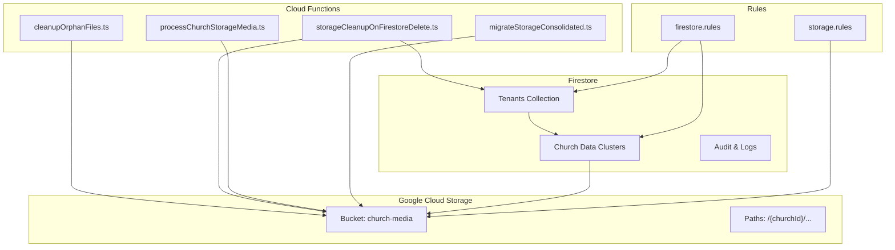
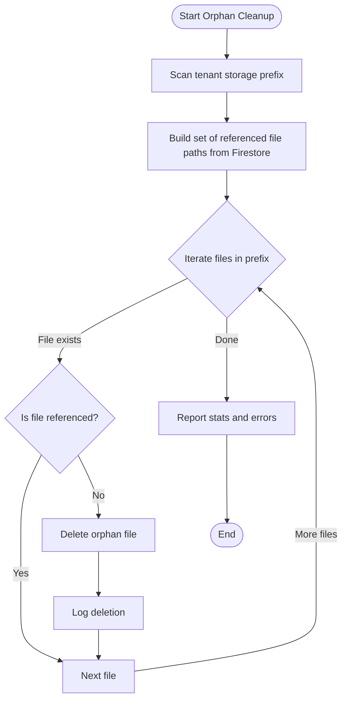
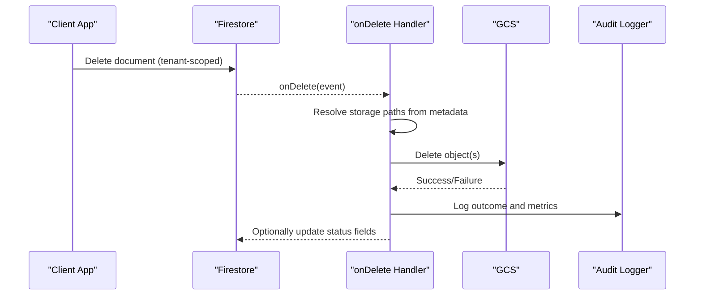
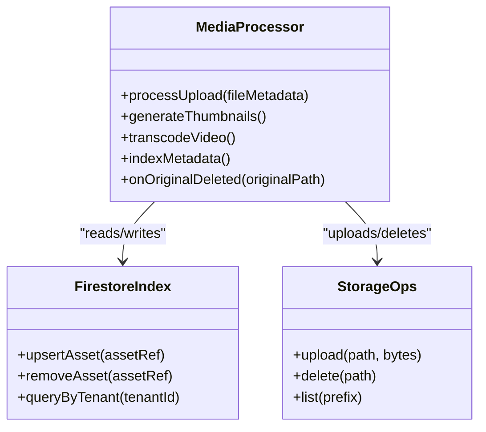
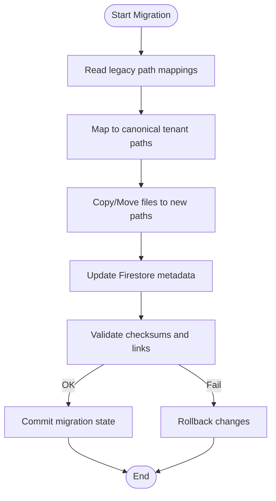
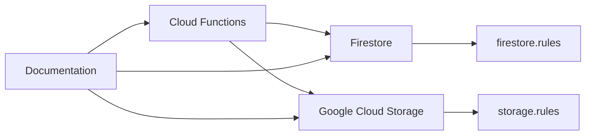

# Tenant Cleanup Operations

<cite>
**Referenced Files in This Document**
- [cleanupOrphanFiles.ts](file://functions/src/cleanupOrphanFiles.ts)
- [storageCleanupOnFirestoreDelete.ts](file://functions/src/storageCleanupOnFirestoreDelete.ts)
- [churchStorageStructure.ts](file://functions/src/churchStorageStructure.ts)
- [migrateStorageConsolidated.ts](file://functions/src/migrateStorageConsolidated.ts)
- [processChurchStorageMedia.ts](file://functions/src/processChurchStorageMedia.ts)
- [firestore.rules](file://firestore.rules)
- [storage.rules](file://storage.rules)
- [firebase.json](file://firebase.json)
- [MIDIA_STORAGE_PADRAO_ECOFIRE.md](file://flutter_app/MIDIA_STORAGE_PADRAO_ECOFIRE.md)
- [MAPEAMENTO_MIDIA_WISDOMAPP_IMPLEMENTACAO_CIRURGICA.md](file://docs/MAPEAMENTO_MIDIA_WISDOMAPP_IMPLEMENTACAO_CIRURGICA.md)
</cite>

## Table of Contents
1. [Introduction](#introduction)
2. [Project Structure](#project-structure)
3. [Core Components](#core-components)
4. [Architecture Overview](#architecture-overview)
5. [Detailed Component Analysis](#detailed-component-analysis)
6. [Dependency Analysis](#dependency-analysis)
7. [Performance Considerations](#performance-considerations)
8. [Troubleshooting Guide](#troubleshooting-guide)
9. [Conclusion](#conclusion)
10. [Appendices](#appendices)

## Introduction
This document explains how tenant cleanup and deletion are implemented across Firestore and Google Cloud Storage, focusing on the complete data removal process when a tenant is deleted. It covers cascade deletion patterns, transaction safety, rollback mechanisms for failed cleanup operations, orphan file cleanup, storage bucket organization, media asset removal strategies, soft delete vs hard delete approaches, data retention policies, compliance considerations, monitoring/logging, performance optimization for large datasets, and verification procedures to ensure complete data removal.

## Project Structure
Tenant cleanup spans multiple layers:
- Cloud Functions orchestrate cleanup workflows triggered by Firestore events or scheduled jobs.
- Firestore rules enforce access control and can trigger server-side deletions.
- Storage rules govern media access and lifecycle management.
- Documentation files describe storage conventions and mapping strategies used by the app and functions.



**Diagram sources**
- [cleanupOrphanFiles.ts](file://functions/src/cleanupOrphanFiles.ts)
- [storageCleanupOnFirestoreDelete.ts](file://functions/src/storageCleanupOnFirestoreDelete.ts)
- [processChurchStorageMedia.ts](file://functions/src/processChurchStorageMedia.ts)
- [migrateStorageConsolidated.ts](file://functions/src/migrateStorageConsolidated.ts)
- [firestore.rules](file://firestore.rules)
- [storage.rules](file://storage.rules)

**Section sources**
- [firebase.json](file://firebase.json)
- [MIDIA_STORAGE_PADRAO_ECOFIRE.md](file://flutter_app/MIDIA_STORAGE_PADRAO_ECOFIRE.md)
- [MAPEAMENTO_MIDIA_WISDOMAPP_IMPLEMENTACAO_CIRURGICA.md](file://docs/MAPEAMENTO_MIDIA_WISDOMAPP_IMPLEMENTACAO_CIRURGICA.md)

## Core Components
- Orphan File Cleanup Function: Scans storage paths under tenant-scoped buckets and deletes files not referenced by Firestore metadata.
- Firestore Delete Triggered Storage Cleanup: Ensures that when Firestore documents are deleted, corresponding storage objects are removed.
- Media Processing Pipeline: Normalizes, resizes, and indexes media assets; also participates in cleanup by removing derived assets when originals are deleted.
- Storage Consolidation Migration: Moves legacy media into consolidated, tenant-scoped paths to simplify cleanup and auditing.

Key responsibilities:
- Identify tenant scope via churchId or tenantId.
- Enumerate collections and documents belonging to the tenant.
- Traverse associated storage paths and remove unreferenced or orphaned files.
- Maintain audit logs and metrics for observability.
- Enforce idempotency and safe retries.

**Section sources**
- [cleanupOrphanFiles.ts](file://functions/src/cleanupOrphanFiles.ts)
- [storageCleanupOnFirestoreDelete.ts](file://functions/src/storageCleanupOnFirestoreDelete.ts)
- [processChurchStorageMedia.ts](file://functions/src/processChurchStorageMedia.ts)
- [migrateStorageConsolidated.ts](file://functions/src/migrateStorageConsolidated.ts)

## Architecture Overview
The tenant deletion workflow combines event-driven triggers with batch processing:

```mermaid
sequenceDiagram
participant Admin as "Admin Action"
participant FS as "Firestore"
participant FuncDel as "storageCleanupOnFirestoreDelete.ts"
participant Store as "GCS Bucket"
participant Audit as "Audit Logs"
Admin->>FS : Delete tenant root document(s)
FS-->>FuncDel : onDelete event (tenant context)
FuncDel->>FS : Query tenant-scoped references
FuncDel->>Store : Delete associated media objects
FuncDel->>Audit : Log deletion progress and results
FuncDel-->>FS : Update status counters
Note over FuncDel,Store : Idempotent deletes; safe retries
```

**Diagram sources**
- [storageCleanupOnFirestoreDelete.ts](file://functions/src/storageCleanupOnFirestoreDelete.ts)
- [firestore.rules](file://firestore.rules)
- [storage.rules](file://storage.rules)

## Detailed Component Analysis

### Orphan File Cleanup
Purpose:
- Remove storage files that are no longer referenced by Firestore metadata within a tenant’s scope.
- Handle partial failures gracefully and support resumable runs.

Behavior highlights:
- Scans predefined storage prefixes per tenant (e.g., /{churchId}/...).
- Cross-references Firestore indices or metadata documents to identify live assets.
- Deletes only files without valid references; preserves shared or system assets.
- Emits structured logs for each operation and aggregates counts.



**Diagram sources**
- [cleanupOrphanFiles.ts](file://functions/src/cleanupOrphanFiles.ts)

**Section sources**
- [cleanupOrphanFiles.ts](file://functions/src/cleanupOrphanFiles.ts)

### Firestore Delete Triggered Storage Cleanup
Purpose:
- Ensure storage objects are removed when their Firestore counterparts are deleted.
- Provide transactional-like consistency between Firestore and Storage through event-driven cleanup.

Behavior highlights:
- Listens to onDelete events for tenant-related documents.
- Extracts storage paths from document metadata.
- Calls storage delete APIs with idempotency checks.
- Updates counters and writes audit entries.



**Diagram sources**
- [storageCleanupOnFirestoreDelete.ts](file://functions/src/storageCleanupOnFirestoreDelete.ts)
- [firestore.rules](file://firestore.rules)
- [storage.rules](file://storage.rules)

**Section sources**
- [storageCleanupOnFirestoreDelete.ts](file://functions/src/storageCleanupOnFirestoreDelete.ts)

### Media Processing Pipeline
Purpose:
- Normalize and index media assets for tenants.
- Participate in cleanup by removing derived assets when originals are deleted.

Behavior highlights:
- On upload, generates thumbnails, transcodes videos, and updates Firestore metadata.
- On deletion of original, cascades to remove derived assets.
- Maintains versioning and checksums for integrity.



**Diagram sources**
- [processChurchStorageMedia.ts](file://functions/src/processChurchStorageMedia.ts)

**Section sources**
- [processChurchStorageMedia.ts](file://functions/src/processChurchStorageMedia.ts)

### Storage Consolidation Migration
Purpose:
- Migrate legacy storage paths into a consolidated, tenant-scoped structure to simplify cleanup and auditing.

Behavior highlights:
- Reads legacy paths and maps them to new canonical paths per tenant.
- Copies or moves files to new locations and updates Firestore metadata.
- Validates integrity post-migration and rolls back on critical failures.



**Diagram sources**
- [migrateStorageConsolidated.ts](file://functions/src/migrateStorageConsolidated.ts)

**Section sources**
- [migrateStorageConsolidated.ts](file://functions/src/migrateStorageConsolidated.ts)

## Dependency Analysis
- Functions depend on Firestore and GCS SDKs for data and storage operations.
- Rules enforce access boundaries and can trigger server-side actions.
- Documentation files define conventions for storage paths and metadata schemas.



**Diagram sources**
- [firebase.json](file://firebase.json)
- [firestore.rules](file://firestore.rules)
- [storage.rules](file://storage.rules)
- [MIDIA_STORAGE_PADRAO_ECOFIRE.md](file://flutter_app/MIDIA_STORAGE_PADRAO_ECOFIRE.md)
- [MAPEAMENTO_MIDIA_WISDOMAPP_IMPLEMENTACAO_CIRURGICA.md](file://docs/MAPEAMENTO_MIDIA_WISDOMAPP_IMPLEMENTACAO_CIRURGICA.md)

**Section sources**
- [firebase.json](file://firebase.json)
- [firestore.rules](file://firestore.rules)
- [storage.rules](file://storage.rules)

## Performance Considerations
- Batch operations: Use batched writes and parallel deletes where possible to reduce latency.
- Pagination: Paginate Firestore queries and storage listings to avoid timeouts.
- Idempotency: Implement retry-safe operations with deduplication keys.
- Indexing: Maintain efficient indexes for tenant-scoped queries to minimize read costs.
- Backpressure: Apply rate limiting and queueing for large-scale cleanup tasks.
- Caching: Cache reference sets for repeated scans to reduce Firestore reads.

[No sources needed since this section provides general guidance]

## Troubleshooting Guide
Common issues and resolutions:
- Partial deletions: Verify audit logs and re-run cleanup with resume capability.
- Permission errors: Confirm service account permissions for Firestore and Storage.
- Orphan detection false positives: Review reference resolution logic and metadata schema.
- Large dataset timeouts: Increase concurrency limits and implement chunked processing.
- Inconsistent state: Run reconciliation jobs to compare Firestore references against storage contents.

Recommended diagnostics:
- Inspect function logs for error traces and counts.
- Validate storage path conventions and metadata completeness.
- Use dry-run modes to preview deletions before executing.

**Section sources**
- [cleanupOrphanFiles.ts](file://functions/src/cleanupOrphanFiles.ts)
- [storageCleanupOnFirestoreDelete.ts](file://functions/src/storageCleanupOnFirestoreDelete.ts)

## Conclusion
Tenant cleanup and deletion rely on coordinated efforts between Firestore and Google Cloud Storage, orchestrated by Cloud Functions. By following tenant-scoped path conventions, maintaining robust metadata, and implementing idempotent, auditable cleanup processes, the system ensures reliable data removal while preserving compliance and operational stability. Continuous monitoring, performance tuning, and verification procedures are essential to maintain data hygiene at scale.

[No sources needed since this section summarizes without analyzing specific files]

## Appendices

### Soft Delete vs Hard Delete Strategies
- Soft delete: Mark documents as deleted and retain data for a grace period; schedule periodic purges.
- Hard delete: Immediately remove documents and associated storage objects; requires careful cascade handling.
- Compliance: Align retention periods with legal requirements and provide export capabilities before deletion.

[No sources needed since this section provides general guidance]

### Monitoring and Logging
- Emit structured logs for each step of cleanup operations.
- Track metrics: files scanned, deleted, errors, duration.
- Integrate with centralized logging and alerting systems.

[No sources needed since this section provides general guidance]

### Verification Procedures
- Reconcile Firestore references with storage contents post-cleanup.
- Generate reports of remaining orphans and inconsistencies.
- Perform spot audits on random tenant samples.

[No sources needed since this section provides general guidance]