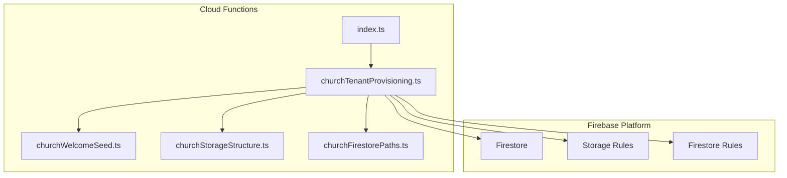
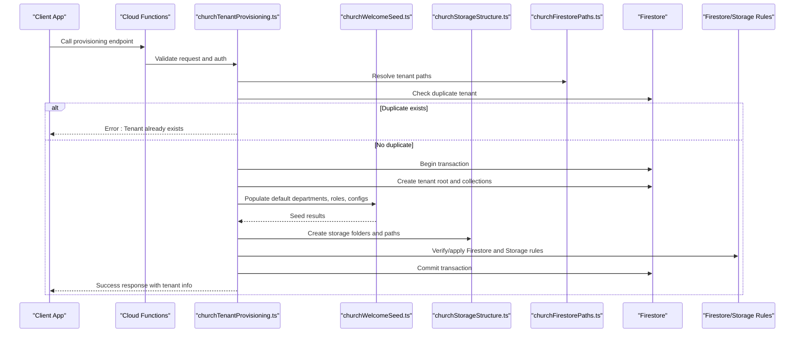
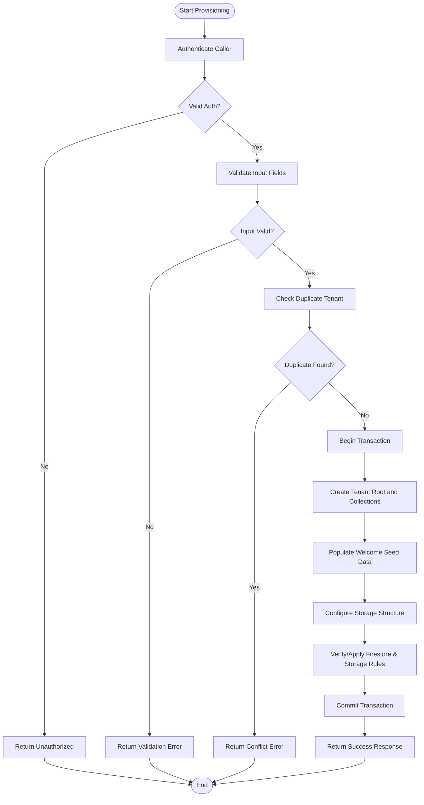
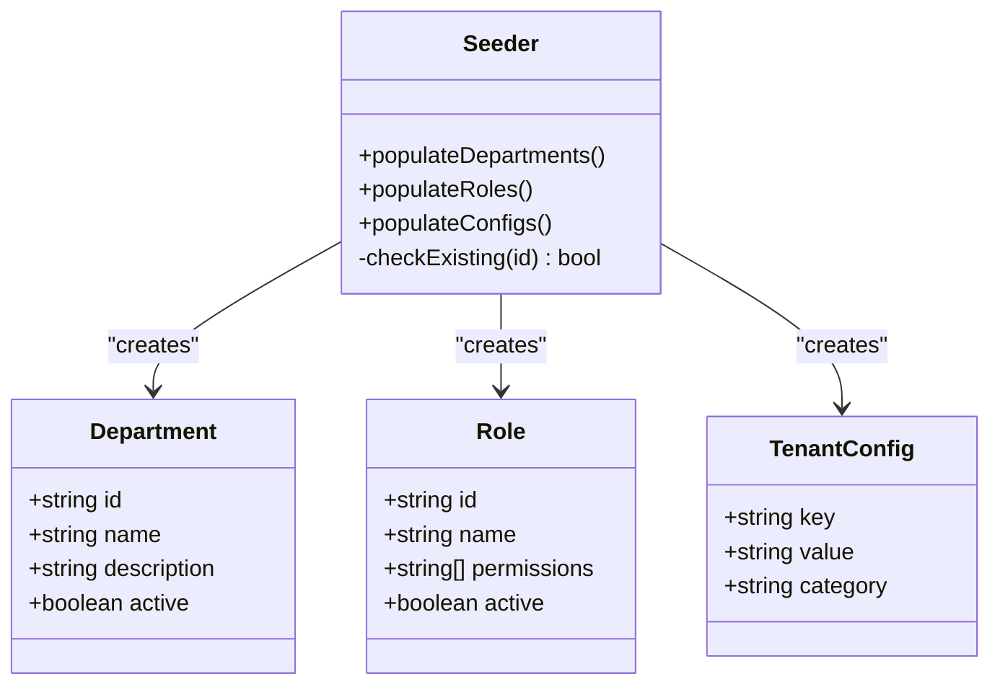
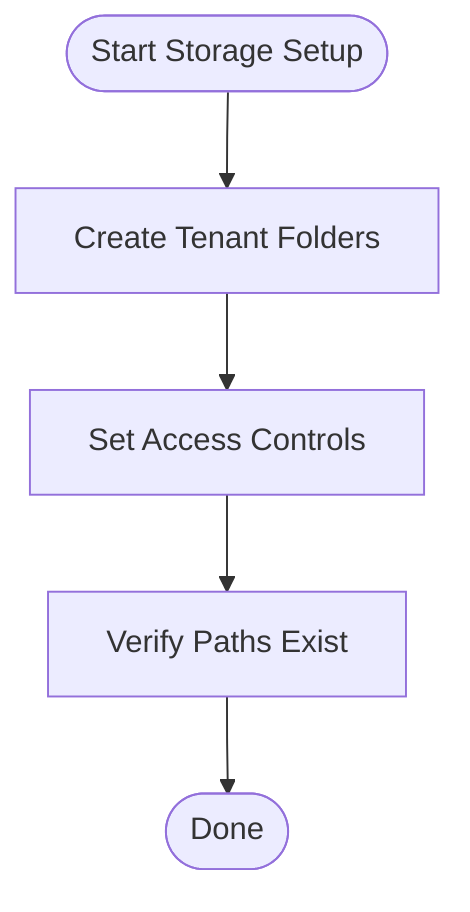
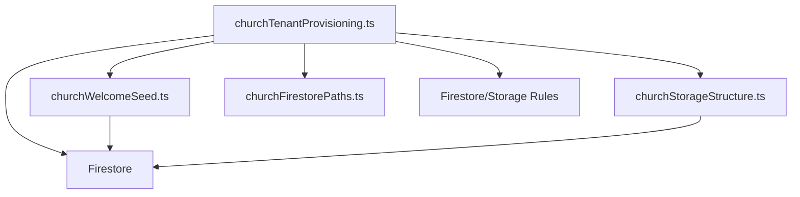

# Tenant Creation Process

<cite>
**Referenced Files in This Document**
- [churchTenantProvisioning.ts](file://functions/src/churchTenantProvisioning.ts)
- [churchWelcomeSeed.ts](file://functions/src/churchWelcomeSeed.ts)
- [churchStorageStructure.ts](file://functions/src/churchStorageStructure.ts)
- [churchFirestorePaths.ts](file://functions/src/churchFirestorePaths.ts)
- [index.ts](file://functions/src/index.ts)
- [firestore.rules](file://firestore.rules)
- [storage.rules](file://storage.rules)
- [firebase.json](file://firebase.json)
- [README.md](file://README.md)
</cite>

## Table of Contents
1. [Introduction](#introduction)
2. [Project Structure](#project-structure)
3. [Core Components](#core-components)
4. [Architecture Overview](#architecture-overview)
5. [Detailed Component Analysis](#detailed-component-analysis)
6. [Dependency Analysis](#dependency-analysis)
7. [Performance Considerations](#performance-considerations)
8. [Troubleshooting Guide](#troubleshooting-guide)
9. [Conclusion](#conclusion)

## Introduction
This document explains the tenant creation process for the multi-tenant system, focusing on how a new church (tenant) is provisioned end-to-end. It covers the workflow from initial registration through database schema initialization and default data population, the provisioning API endpoints, request/response schemas, authentication requirements, automatic Firestore collection creation, Firestore rules setup, and storage bucket configuration. It also includes examples of provisioning function calls, error handling patterns, transaction rollback mechanisms, and details about the welcome seed data that gets populated during tenant creation.

## Project Structure
The tenant provisioning logic is implemented as Cloud Functions with TypeScript sources under functions/src. Key files include:
- Provisioning orchestration and lifecycle management
- Welcome seed data population
- Storage structure setup
- Firestore path utilities
- Function index and exports
- Security rules for Firestore and Storage
- Firebase configuration

**Diagram sources**
- [index.ts](file://functions/src/index.ts)
- [churchTenantProvisioning.ts](file://functions/src/churchTenantProvisioning.ts)
- [churchWelcomeSeed.ts](file://functions/src/churchWelcomeSeed.ts)
- [churchStorageStructure.ts](file://functions/src/churchStorageStructure.ts)
- [churchFirestorePaths.ts](file://functions/src/churchFirestorePaths.ts)
- [firestore.rules](file://firestore.rules)
- [storage.rules](file://storage.rules)

**Section sources**
- [README.md](file://README.md)
- [firebase.json](file://firebase.json)

## Core Components
- Provisioning Orchestrator: Coordinates tenant creation, including Firestore writes, storage setup, and rule application.
- Welcome Seed Populator: Inserts default departments, roles, and system configurations into the new tenant’s database.
- Storage Structure Manager: Creates required folders and sets up storage paths for media and documents.
- Firestore Path Utilities: Provides canonical paths for tenant-scoped resources.
- Security Rules: Enforce access control at Firestore and Storage levels based on tenant context.

Key responsibilities:
- Validate inputs and detect duplicates
- Create tenant root and collections
- Populate seed data within a transaction
- Configure storage buckets and paths
- Apply or verify Firestore rules
- Handle errors and rollbacks

**Section sources**
- [churchTenantProvisioning.ts](file://functions/src/churchTenantProvisioning.ts)
- [churchWelcomeSeed.ts](file://functions/src/churchWelcomeSeed.ts)
- [churchStorageStructure.ts](file://functions/src/churchStorageStructure.ts)
- [churchFirestorePaths.ts](file://functions/src/churchFirestorePaths.ts)

## Architecture Overview
The tenant creation flow is triggered by a callable or HTTP function exposed via Cloud Functions. The orchestrator validates the request, checks for existing tenants, initializes Firestore collections, seeds default data, configures storage, and ensures security rules are applied.

**Diagram sources**
- [churchTenantProvisioning.ts](file://functions/src/churchTenantProvisioning.ts)
- [churchWelcomeSeed.ts](file://functions/src/churchWelcomeSeed.ts)
- [churchStorageStructure.ts](file://functions/src/churchStorageStructure.ts)
- [churchFirestorePaths.ts](file://functions/src/churchFirestorePaths.ts)
- [firestore.rules](file://firestore.rules)
- [storage.rules](file://storage.rules)

## Detailed Component Analysis

### Provisioning Orchestrator
Responsibilities:
- Authenticate requests using platform auth helpers
- Validate input fields and enforce business rules
- Detect duplicate tenants by unique identifiers
- Manage transactions to ensure atomicity
- Coordinate Firestore writes, seed data insertion, and storage setup
- Apply or verify Firestore and Storage rules
- Return structured responses and handle errors consistently

Error handling and rollback:
- Use Firestore transactions to group writes
- On any failure, rollback all changes to maintain consistency
- Provide clear error messages indicating which step failed

Authentication requirements:
- Requires valid admin or service account credentials
- Validates caller permissions before proceeding

Request/response schema:
- Request includes tenant metadata such as name, slug, region, and owner identifiers
- Response includes created tenant ID, paths, and status flags

**Diagram sources**
- [churchTenantProvisioning.ts](file://functions/src/churchTenantProvisioning.ts)

**Section sources**
- [churchTenantProvisioning.ts](file://functions/src/churchTenantProvisioning.ts)

### Welcome Seed Data Population
Responsibilities:
- Insert default departments (e.g., worship, children, finance)
- Create default roles and permission sets
- Populate system configurations and tenant settings
- Ensure idempotency to avoid duplicate seed entries

Data model highlights:
- Departments: predefined categories with metadata
- Roles: role definitions with associated permissions
- Configs: key-value pairs for tenant behavior

Idempotency strategy:
- Check for existing seed records before insertion
- Skip or update based on versioning or timestamps

**Diagram sources**
- [churchWelcomeSeed.ts](file://functions/src/churchWelcomeSeed.ts)

**Section sources**
- [churchWelcomeSeed.ts](file://functions/src/churchWelcomeSeed.ts)

### Storage Structure Manager
Responsibilities:
- Create tenant-specific storage folders for media, documents, and backups
- Set up consistent path conventions across the app
- Ensure proper access controls via Storage Rules

Path conventions:
- Organize by tenant ID and resource type
- Separate public and private content

**Diagram sources**
- [churchStorageStructure.ts](file://functions/src/churchStorageStructure.ts)

**Section sources**
- [churchStorageStructure.ts](file://functions/src/churchStorageStructure.ts)

### Firestore Path Utilities
Responsibilities:
- Provide canonical paths for tenant-scoped resources
- Normalize and validate path segments
- Support hierarchical organization of collections

Usage:
- Centralized path generation reduces inconsistencies
- Ensures correct scoping for queries and rules

**Section sources**
- [churchFirestorePaths.ts](file://functions/src/churchFirestorePaths.ts)

### Function Index and Exports
Responsibilities:
- Export callable and HTTP endpoints for provisioning
- Wire up middleware for authentication and validation
- Map routes to handler functions

**Section sources**
- [index.ts](file://functions/src/index.ts)

### Security Rules
Firestore Rules:
- Enforce tenant isolation
- Restrict writes to authorized users and admins
- Validate data shapes and relationships

Storage Rules:
- Control read/write access per tenant
- Protect sensitive directories
- Allow public assets where appropriate

**Section sources**
- [firestore.rules](file://firestore.rules)
- [storage.rules](file://storage.rules)

## Dependency Analysis
The provisioning module depends on:
- Firestore for data persistence and transactions
- Storage for media and file management
- Security rules for access enforcement
- Path utilities for consistent resource addressing

**Diagram sources**
- [churchTenantProvisioning.ts](file://functions/src/churchTenantProvisioning.ts)
- [churchWelcomeSeed.ts](file://functions/src/churchWelcomeSeed.ts)
- [churchStorageStructure.ts](file://functions/src/churchStorageStructure.ts)
- [churchFirestorePaths.ts](file://functions/src/churchFirestorePaths.ts)
- [firestore.rules](file://firestore.rules)
- [storage.rules](file://storage.rules)

**Section sources**
- [index.ts](file://functions/src/index.ts)

## Performance Considerations
- Batch Firestore writes within transactions to minimize round trips
- Use idempotent operations to prevent redundant work
- Precompute and cache frequently accessed paths
- Avoid large seed payloads; split into smaller chunks if necessary
- Monitor rule evaluation costs and optimize conditions

[No sources needed since this section provides general guidance]

## Troubleshooting Guide
Common issues:
- Authentication failures: Ensure caller has sufficient privileges
- Duplicate tenant errors: Check uniqueness constraints and pre-checks
- Transaction conflicts: Retry logic should be implemented for transient errors
- Rule mismatches: Verify Firestore and Storage rules align with expected access patterns
- Storage path errors: Confirm folder creation and ACL settings

Debugging steps:
- Inspect function logs for detailed error traces
- Validate input schemas against documented requirements
- Test rule evaluations locally or via test suites
- Verify tenant existence before provisioning attempts

**Section sources**
- [churchTenantProvisioning.ts](file://functions/src/churchTenantProvisioning.ts)
- [firestore.rules](file://firestore.rules)
- [storage.rules](file://storage.rules)

## Conclusion
The tenant creation process is a coordinated effort involving authentication, validation, Firestore transactions, seed data population, storage setup, and security rule enforcement. By following the outlined workflows and leveraging the provided components, new tenants can be provisioned reliably and securely. Proper error handling, idempotency, and performance optimizations ensure a robust experience for both administrators and end-users.

[No sources needed since this section summarizes without analyzing specific files]