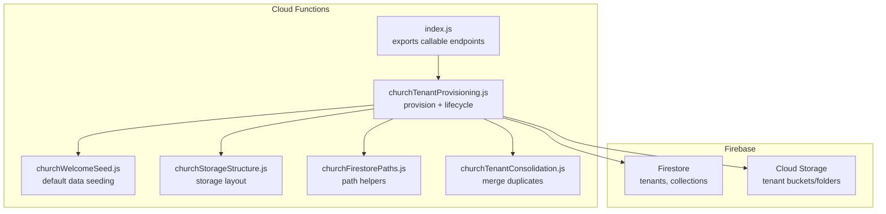
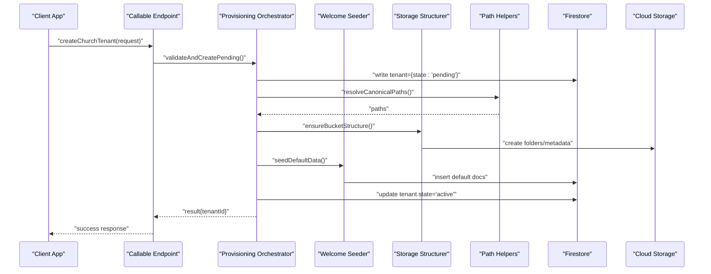
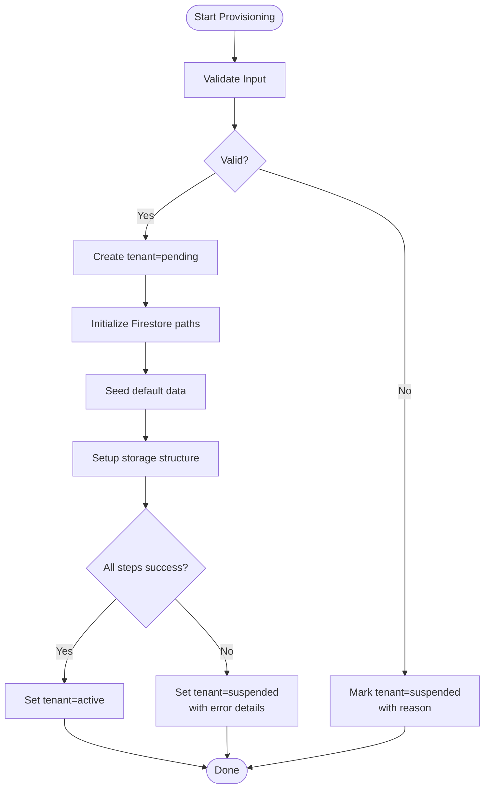
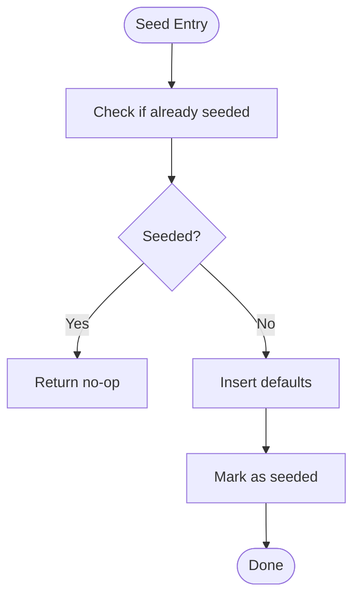
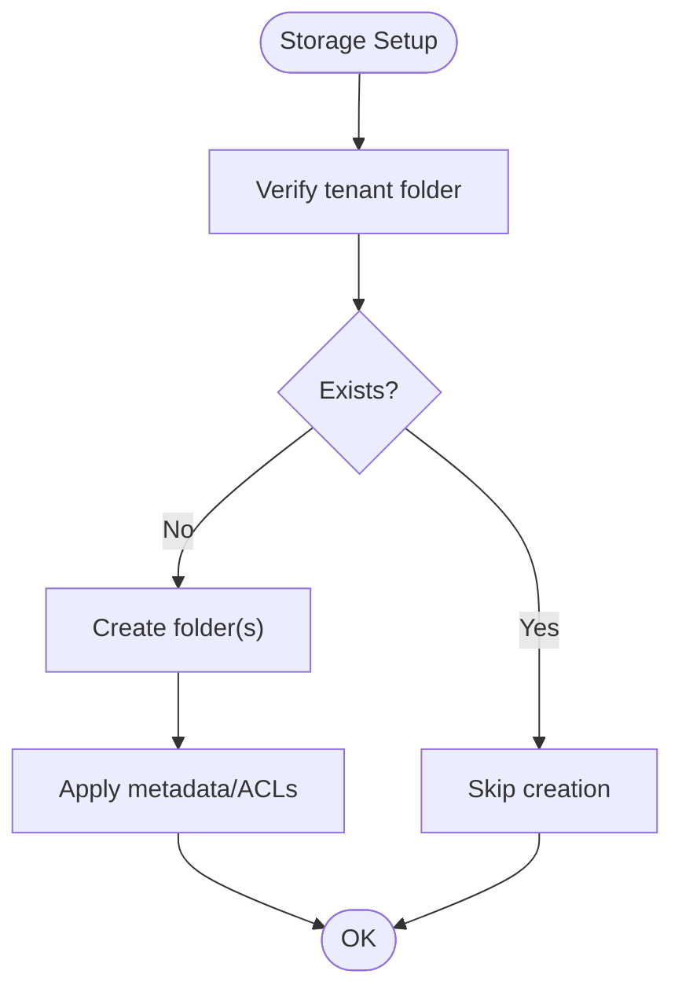
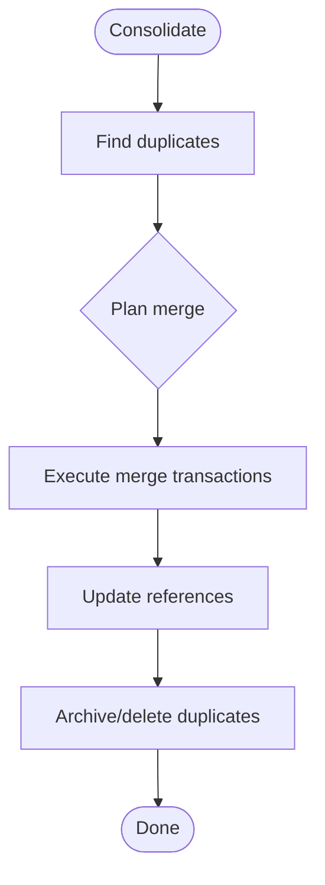
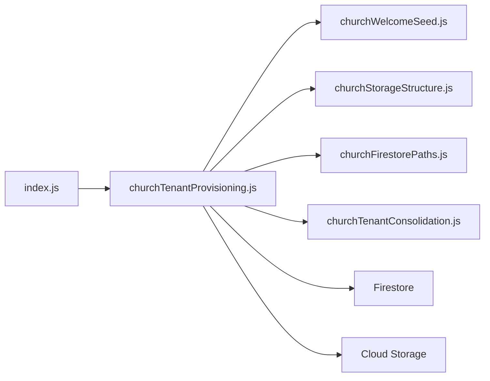

# Tenant Provisioning & Lifecycle

<cite>
**Referenced Files in This Document**
- [churchTenantProvisioning.js](file://functions/lib/churchTenantProvisioning.js)
- [churchTenantConsolidation.js](file://functions/lib/churchTenantConsolidation.js)
- [churchWelcomeSeed.js](file://functions/lib/churchWelcomeSeed.js)
- [churchStorageStructure.js](file://functions/lib/churchStorageStructure.js)
- [churchFirestorePaths.js](file://functions/lib/churchFirestorePaths.js)
- [index.js](file://functions/lib/index.js)
- [firestore.rules](file://firestore.rules)
- [storage.rules](file://storage.rules)
</cite>

## Table of Contents
1. [Introduction](#introduction)
2. [Project Structure](#project-structure)
3. [Core Components](#core-components)
4. [Architecture Overview](#architecture-overview)
5. [Detailed Component Analysis](#detailed-component-analysis)
6. [Dependency Analysis](#dependency-analysis)
7. [Performance Considerations](#performance-considerations)
8. [Troubleshooting Guide](#troubleshooting-guide)
9. [Conclusion](#conclusion)
10. [Appendices](#appendices)

## Introduction
This document explains the multi-tenant provisioning and lifecycle management for church tenants. It covers the end-to-end flow from registration to an active tenant, including database schema initialization, default data seeding, storage setup, service activation, state transitions, consolidation of duplicates, and deletion cleanup. It also provides API call examples, error handling patterns, rollback strategies, performance guidance for bulk operations, and monitoring recommendations.

## Project Structure
The tenant provisioning system is implemented as Firebase Cloud Functions with TypeScript sources compiled to JavaScript under functions/lib. Key responsibilities are split across focused modules:
- Provisioning orchestration and state machine
- Data seeding (welcome/default content)
- Storage structure initialization
- Firestore path helpers and canonical resolution
- Consolidation of duplicate tenants
- Rules enforcement for Firestore and Storage

**Diagram sources**
- [index.js:1-200](file://functions/lib/index.js#L1-L200)
- [churchTenantProvisioning.js:1-300](file://functions/lib/churchTenantProvisioning.js#L1-L300)
- [churchWelcomeSeed.js:1-200](file://functions/lib/churchWelcomeSeed.js#L1-L200)
- [churchStorageStructure.js:1-200](file://functions/lib/churchStorageStructure.js#L1-L200)
- [churchFirestorePaths.js:1-200](file://functions/lib/churchFirestorePaths.js#L1-L200)
- [churchTenantConsolidation.js:1-200](file://functions/lib/churchTenantConsolidation.js#L1-L200)

**Section sources**
- [index.js:1-200](file://functions/lib/index.js#L1-L200)
- [churchTenantProvisioning.js:1-300](file://functions/lib/churchTenantProvisioning.js#L1-L300)
- [churchWelcomeSeed.js:1-200](file://functions/lib/churchWelcomeSeed.js#L1-L200)
- [churchStorageStructure.js:1-200](file://functions/lib/churchStorageStructure.js#L1-L200)
- [churchFirestorePaths.js:1-200](file://functions/lib/churchFirestorePaths.js#L1-L200)
- [churchTenantConsolidation.js:1-200](file://functions/lib/churchTenantConsolidation.js#L1-L200)

## Core Components
- Provisioning Orchestrator: Creates a new tenant record, initializes Firestore paths, seeds default data, sets up storage structure, and transitions the tenant to active.
- Welcome Seeder: Populates initial documents and configuration templates required by the app.
- Storage Structurer: Ensures bucket/folder hierarchy exists and applies appropriate metadata or ACLs.
- Path Helpers: Provides canonical paths and resolves tenant-scoped resources.
- Consolidation Service: Merges duplicate tenants while preserving ownership and audit trails.
- Rules Enforcement: Firestore and Storage rules enforce access boundaries per tenant.

Key responsibilities and interactions are detailed in subsequent sections.

**Section sources**
- [churchTenantProvisioning.js:1-300](file://functions/lib/churchTenantProvisioning.js#L1-L300)
- [churchWelcomeSeed.js:1-200](file://functions/lib/churchWelcomeSeed.js#L1-L200)
- [churchStorageStructure.js:1-200](file://functions/lib/churchStorageStructure.js#L1-L200)
- [churchFirestorePaths.js:1-200](file://functions/lib/churchFirestorePaths.js#L1-L200)
- [churchTenantConsolidation.js:1-200](file://functions/lib/churchTenantConsolidation.js#L1-L200)

## Architecture Overview
The provisioning workflow is exposed via a callable function that validates input, creates a pending tenant, runs sequential steps (schema init, seed, storage), and commits final state changes atomically where possible. Errors trigger compensating actions and update the tenant state accordingly.

**Diagram sources**
- [index.js:1-200](file://functions/lib/index.js#L1-L200)
- [churchTenantProvisioning.js:1-300](file://functions/lib/churchTenantProvisioning.js#L1-L300)
- [churchWelcomeSeed.js:1-200](file://functions/lib/churchWelcomeSeed.js#L1-L200)
- [churchStorageStructure.js:1-200](file://functions/lib/churchStorageStructure.js#L1-L200)
- [churchFirestorePaths.js:1-200](file://functions/lib/churchFirestorePaths.js#L1-L200)

## Detailed Component Analysis

### Provisioning Orchestrator
Responsibilities:
- Validate request payload and uniqueness constraints
- Create tenant record with initial state
- Initialize Firestore paths and indexes
- Seed default data
- Initialize storage structure
- Transition tenant state to active
- Handle errors with compensating updates and rollback markers

State Machine:
- States: pending, active, suspended, archived
- Transitions:
  - pending -> active on successful provisioning
  - active -> suspended on policy violation or admin action
  - suspended -> active on remediation
  - any -> archived on compliance/legal requirement
  - pending -> suspended on validation failure requiring review

Error Handling and Rollback:
- On partial failure, mark tenant as suspended with reason code
- Revert non-idempotent writes where possible
- Log detailed error context for auditing

**Diagram sources**
- [churchTenantProvisioning.js:1-300](file://functions/lib/churchTenantProvisioning.js#L1-L300)

**Section sources**
- [churchTenantProvisioning.js:1-300](file://functions/lib/churchTenantProvisioning.js#L1-L300)

### Welcome Seeder
Responsibilities:
- Insert default configuration documents
- Create initial roles/users/templates
- Populate reference data needed at startup

Idempotency:
- Uses upsert semantics to avoid overwriting existing data
- Tracks seeded items to support re-seeding safely

**Diagram sources**
- [churchWelcomeSeed.js:1-200](file://functions/lib/churchWelcomeSeed.js#L1-L200)

**Section sources**
- [churchWelcomeSeed.js:1-200](file://functions/lib/churchWelcomeSeed.js#L1-L200)

### Storage Structurer
Responsibilities:
- Ensure tenant-specific folder hierarchy exists
- Apply consistent naming conventions
- Set metadata or ACLs as required by policies

Idempotency:
- Checks existence before creating
- Skips redundant operations

**Diagram sources**
- [churchStorageStructure.js:1-200](file://functions/lib/churchStorageStructure.js#L1-L200)

**Section sources**
- [churchStorageStructure.js:1-200](file://functions/lib/churchStorageStructure.js#L1-L200)

### Firestore Path Helpers
Responsibilities:
- Provide canonical paths for tenant-scoped resources
- Resolve aliases and normalize identifiers
- Centralize path construction to ensure consistency

Usage:
- Used by provisioning, seeding, and runtime services to build correct paths

**Section sources**
- [churchFirestorePaths.js:1-200](file://functions/lib/churchFirestorePaths.js#L1-L200)

### Consolidation Service
Responsibilities:
- Detect duplicate tenants based on matching criteria
- Merge data while preserving ownership and audit trails
- Update references and indexes post-merge
- Archive or delete redundant records according to policy

Workflow:
- Identify candidates
- Plan merge operations
- Execute transactions
- Post-process indexes and caches

**Diagram sources**
- [churchTenantConsolidation.js:1-200](file://functions/lib/churchTenantConsolidation.js#L1-L200)

**Section sources**
- [churchTenantConsolidation.js:1-200](file://functions/lib/churchTenantConsolidation.js#L1-L200)

### Callable Endpoints and API Surface
Exposed endpoints include:
- createChurchTenant: Initiates provisioning
- consolidateTenants: Triggers merge process
- suspendTenant / activateTenant: Admin lifecycle controls
- archiveTenant: Compliance-driven archival

Request/Response Patterns:
- Input validation with clear error messages
- Async operation tracking via tenant state
- Idempotency keys where applicable

Error Handling:
- Standardized error codes and messages
- Retry guidance for transient failures

**Section sources**
- [index.js:1-200](file://functions/lib/index.js#L1-L200)

### Rules Enforcement
Firestore Rules:
- Enforce tenant isolation
- Restrict writes to authorized roles
- Validate document structure

Storage Rules:
- Scope access to tenant folders
- Enforce file size/type constraints

**Section sources**
- [firestore.rules:1-500](file://firestore.rules#L1-L500)
- [storage.rules:1-500](file://storage.rules#L1-L500)

## Dependency Analysis
The provisioning flow depends on helper modules for paths, seeding, and storage. The callable endpoint orchestrates these components and interacts with Firestore and Storage.

**Diagram sources**
- [index.js:1-200](file://functions/lib/index.js#L1-L200)
- [churchTenantProvisioning.js:1-300](file://functions/lib/churchTenantProvisioning.js#L1-L300)
- [churchWelcomeSeed.js:1-200](file://functions/lib/churchWelcomeSeed.js#L1-L200)
- [churchStorageStructure.js:1-200](file://functions/lib/churchStorageStructure.js#L1-L200)
- [churchFirestorePaths.js:1-200](file://functions/lib/churchFirestorePaths.js#L1-L200)
- [churchTenantConsolidation.js:1-200](file://functions/lib/churchTenantConsolidation.js#L1-L200)

**Section sources**
- [index.js:1-200](file://functions/lib/index.js#L1-L200)
- [churchTenantProvisioning.js:1-300](file://functions/lib/churchTenantProvisioning.js#L1-L300)

## Performance Considerations
- Batch writes: Group Firestore operations into minimal transactions to reduce round-trips.
- Idempotency: Use idempotency keys for retries to prevent duplicate work.
- Concurrency control: Limit parallel provisioning tasks to avoid resource contention.
- Lazy seeding: Defer heavy seeding until first use when feasible.
- Storage optimization: Pre-create only necessary folders; apply metadata in batches.
- Monitoring: Track provisioning duration, success rate, and error distribution.

[No sources needed since this section provides general guidance]

## Troubleshooting Guide
Common issues and resolutions:
- Validation failures: Review input fields and constraints; check error codes returned by the endpoint.
- Partial provisioning: Inspect tenant state for suspended status and reason; re-run provisioning after fixing issues.
- Duplicate detection: Use consolidation endpoint to merge overlapping tenants; verify references post-merge.
- Access denied: Confirm Firestore and Storage rules allow intended operations for the tenant context.

Operational checks:
- Verify tenant record exists and has expected state
- Confirm storage folders exist and have correct permissions
- Review logs for specific step failures during provisioning

**Section sources**
- [churchTenantProvisioning.js:1-300](file://functions/lib/churchTenantProvisioning.js#L1-L300)
- [churchTenantConsolidation.js:1-200](file://functions/lib/churchTenantConsolidation.js#L1-L200)
- [firestore.rules:1-500](file://firestore.rules#L1-L500)
- [storage.rules:1-500](file://storage.rules#L1-L500)

## Conclusion
The tenant provisioning system provides a robust, auditable, and scalable approach to onboarding church tenants. By separating concerns across dedicated modules and enforcing strict state transitions and rules, it ensures reliable initialization, consistent data, and secure access. Consolidation and cleanup processes maintain data integrity over time, while performance and monitoring practices support operational excellence.

[No sources needed since this section summarizes without analyzing specific files]

## Appendices

### API Call Examples
- Create tenant:
  - Endpoint: createChurchTenant
  - Request: { name, email, region, plan }
  - Response: { tenantId, state }
- Consolidate tenants:
  - Endpoint: consolidateTenants
  - Request: { targetTenantId, sourceTenantIds[] }
  - Response: { mergedCount, archivedCount }
- Suspend/Activate/Archive:
  - Endpoint: updateTenantState
  - Request: { tenantId, newState, reason }
  - Response: { success, updatedState }

[No sources needed since this section provides conceptual examples]

### State Transition Reference
- pending -> active: Successful provisioning completion
- active -> suspended: Policy violation or admin action
- suspended -> active: Remediation completed
- any -> archived: Compliance/legal requirement

[No sources needed since this section provides conceptual reference]