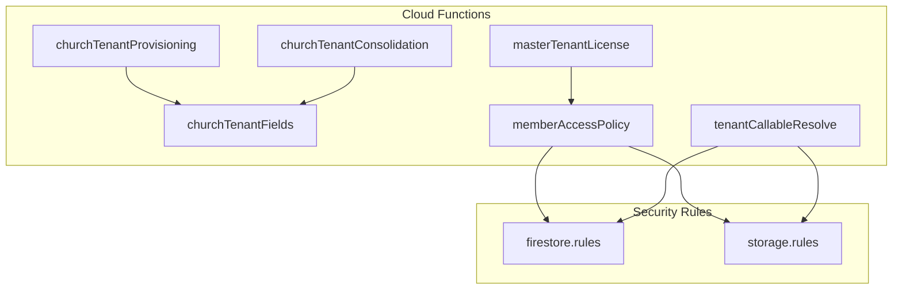
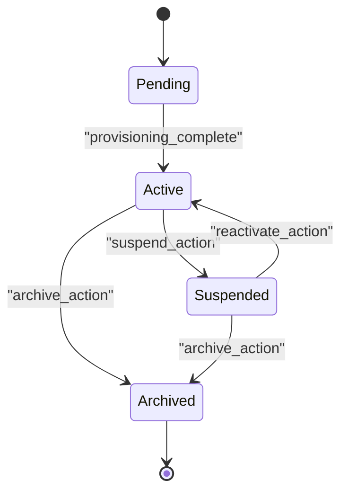
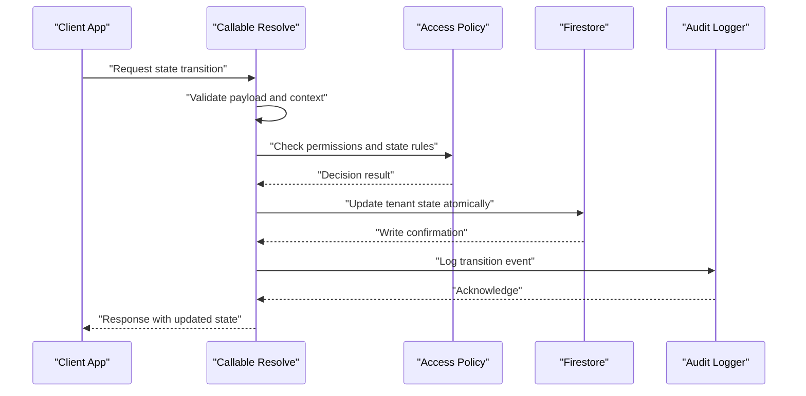
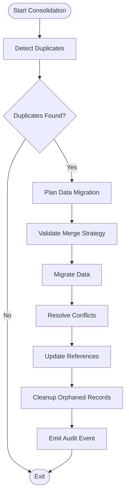
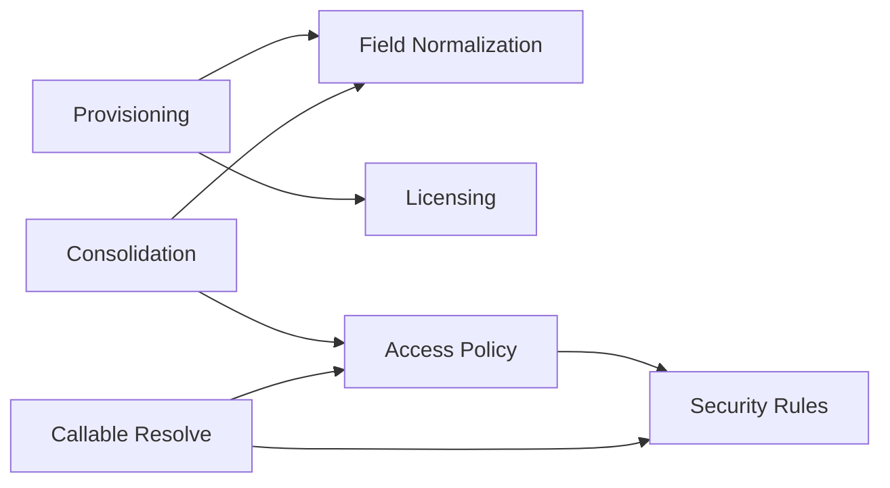

# Tenant State Management

<cite>
**Referenced Files in This Document**
- [churchTenantConsolidation.js](file://functions/lib/churchTenantConsolidation.js)
- [churchTenantFields.js](file://functions/lib/churchTenantFields.js)
- [churchTenantProvisioning.js](file://functions/lib/churchTenantProvisioning.js)
- [masterTenantLicense.js](file://functions/lib/masterTenantLicense.js)
- [memberAccessPolicy.js](file://functions/lib/memberAccessPolicy.js)
- [firestore.rules](file://firestore.rules)
- [storage.rules](file://storage.rules)
- [index.ts](file://functions/src/index.ts)
- [tenantCallableResolve.js](file://functions/lib/tenantCallableResolve.js)
</cite>

## Table of Contents
1. [Introduction](#introduction)
2. [Project Structure](#project-structure)
3. [Core Components](#core-components)
4. [Architecture Overview](#architecture-overview)
5. [Detailed Component Analysis](#detailed-component-analysis)
6. [Dependency Analysis](#dependency-analysis)
7. [Performance Considerations](#performance-considerations)
8. [Troubleshooting Guide](#troubleshooting-guide)
9. [Conclusion](#conclusion)
10. [Appendices](#appendices)

## Introduction
This document explains the tenant state management and lifecycle transitions for multi-tenant entities (tenants). It covers the complete state machine, transition rules, persistence mechanisms, event logging, audit trails, consolidation workflows, access control, feature toggles, and service activation/deactivation based on tenant status. The goal is to provide a clear, actionable reference for developers and operators managing tenant lifecycles across provisioning, operation, suspension, and archival phases.

## Project Structure
The tenant lifecycle is implemented primarily through Cloud Functions and security rules:
- Provisioning and field normalization are handled by dedicated functions.
- Consolidation merges duplicate tenants with data migration strategies.
- Access policies enforce permissions based on tenant state.
- Security rules govern Firestore and Storage access according to tenant status.
- Callable endpoints resolve tenant context and enforce constraints.

**Diagram sources**
- [churchTenantProvisioning.js](file://functions/lib/churchTenantProvisioning.js)
- [churchTenantFields.js](file://functions/lib/churchTenantFields.js)
- [churchTenantConsolidation.js](file://functions/lib/churchTenantConsolidation.js)
- [masterTenantLicense.js](file://functions/lib/masterTenantLicense.js)
- [memberAccessPolicy.js](file://functions/lib/memberAccessPolicy.js)
- [tenantCallableResolve.js](file://functions/lib/tenantCallableResolve.js)
- [firestore.rules](file://firestore.rules)
- [storage.rules](file://storage.rules)

**Section sources**
- [churchTenantProvisioning.js](file://functions/lib/churchTenantProvisioning.js)
- [churchTenantFields.js](file://functions/lib/churchTenantFields.js)
- [churchTenantConsolidation.js](file://functions/lib/churchTenantConsolidation.js)
- [masterTenantLicense.js](file://functions/lib/masterTenantLicense.js)
- [memberAccessPolicy.js](file://functions/lib/memberAccessPolicy.js)
- [tenantCallableResolve.js](file://functions/lib/tenantCallableResolve.js)
- [firestore.rules](file://firestore.rules)
- [storage.rules](file://storage.rules)

## Core Components
- Provisioning: Initializes new tenants, sets initial state, and seeds required fields.
- Field Normalization: Ensures consistent schema and default values for tenant documents.
- Consolidation: Merges duplicate tenants, migrates data, and resolves conflicts.
- Licensing: Validates and enforces license-based features per tenant.
- Access Policy: Enforces role-based and state-aware access control.
- Callable Resolve: Resolves tenant context for callable functions and validates operations.

Key responsibilities:
- Maintain tenant state transitions with validation and audit logging.
- Persist state changes atomically and consistently.
- Gate feature availability and service activation based on tenant status.
- Provide robust error handling and rollback strategies where applicable.

**Section sources**
- [churchTenantProvisioning.js](file://functions/lib/churchTenantProvisioning.js)
- [churchTenantFields.js](file://functions/lib/churchTenantFields.js)
- [churchTenantConsolidation.js](file://functions/lib/churchTenantConsolidation.js)
- [masterTenantLicense.js](file://functions/lib/masterTenantLicense.js)
- [memberAccessPolicy.js](file://functions/lib/memberAccessPolicy.js)
- [tenantCallableResolve.js](file://functions/lib/tenantCallableResolve.js)

## Architecture Overview
The tenant lifecycle spans multiple stages:
- Pending: Initial creation; awaiting validation or setup completion.
- Active: Fully operational; services enabled; features available.
- Suspended: Temporarily disabled; limited access; no new writes unless explicitly allowed.
- Archived: Read-only or decommissioned; minimal access; historical retention.

Transitions:
- Pending → Active: After successful provisioning and validation.
- Active → Suspended: Due to policy violations, non-payment, or admin action.
- Suspended → Active: After remediation and revalidation.
- Active → Archived: On permanent deactivation or compliance requirements.
- Suspended → Archived: When suspension becomes permanent.

[No sources needed since this diagram shows conceptual workflow, not actual code structure]

## Detailed Component Analysis

### Provisioning and Initialization
- Creates tenant document with initial state set to pending.
- Seeds required fields and default configurations.
- Triggers background tasks for indexing and cache initialization.
- Emits an audit event for tenant creation.

Validation and constraints:
- Unique identifiers enforced at write time.
- Required fields validated before transitioning to active.
- License checks performed during activation.

Error handling:
- Retries transient failures.
- Logs detailed errors for debugging.
- Rolls back partial writes when necessary.

**Section sources**
- [churchTenantProvisioning.js](file://functions/lib/churchTenantProvisioning.js)
- [churchTenantFields.js](file://functions/lib/churchTenantFields.js)
- [masterTenantLicense.js](file://functions/lib/masterTenantLicense.js)

### Field Normalization and Schema Enforcement
- Ensures consistent schema across tenant documents.
- Applies defaults and transforms legacy fields.
- Backfills missing fields using batch updates.

Data integrity:
- Validates types and formats.
- Prevents invalid state values.
- Maintains referential integrity across related collections.

Audit trail:
- Records field changes with timestamps and actor IDs.
- Supports diff tracking for compliance reviews.

**Section sources**
- [churchTenantFields.js](file://functions/lib/churchTenantFields.js)

### Consolidation and Duplicate Resolution
- Detects duplicate tenants via canonical identifiers.
- Migrates data from source to target tenant.
- Resolves conflicts using merge strategies (e.g., latest-wins, owner-priority).
- Updates references and indexes post-migration.

Conflict resolution:
- Prioritizes authoritative sources.
- Preserves critical metadata.
- Notifies stakeholders of significant changes.

Post-consolidation:
- Cleans up orphaned records.
- Rebuilds caches and indices.
- Emits consolidation audit events.

**Section sources**
- [churchTenantConsolidation.js](file://functions/lib/churchTenantConsolidation.js)

### Access Control and State-Based Policies
- Enforces read/write permissions based on tenant state.
- Restricts operations for suspended/archived tenants.
- Allows administrative overrides with explicit authorization.

Feature toggles:
- Activates/deactivates features based on license and state.
- Exposes capability flags to clients.

Service activation:
- Enables/disables integrations per tenant status.
- Controls webhook subscriptions and notifications.

**Section sources**
- [memberAccessPolicy.js](file://functions/lib/memberAccessPolicy.js)
- [firestore.rules](file://firestore.rules)
- [storage.rules](file://storage.rules)

### Callable Resolution and Context Validation
- Resolves tenant context from request headers or tokens.
- Validates caller permissions against tenant membership.
- Enforces state-based constraints before executing operations.

Security:
- Prevents unauthorized state transitions.
- Validates input payloads against schemas.
- Returns standardized error responses.

**Section sources**
- [tenantCallableResolve.js](file://functions/lib/tenantCallableResolve.js)

### Sequence Diagram: State Transition Workflow

**Diagram sources**
- [tenantCallableResolve.js](file://functions/lib/tenantCallableResolve.js)
- [memberAccessPolicy.js](file://functions/lib/memberAccessPolicy.js)
- [firestore.rules](file://firestore.rules)

### Flowchart: Consolidation Process

**Diagram sources**
- [churchTenantConsolidation.js](file://functions/lib/churchTenantConsolidation.js)

## Dependency Analysis
The tenant lifecycle components depend on each other and external services:
- Provisioning depends on licensing and field normalization.
- Consolidation relies on field normalization and access policies.
- Access policies enforce rules defined in security files.
- Callable resolution integrates with all components for context validation.

**Diagram sources**
- [churchTenantProvisioning.js](file://functions/lib/churchTenantProvisioning.js)
- [churchTenantFields.js](file://functions/lib/churchTenantFields.js)
- [churchTenantConsolidation.js](file://functions/lib/churchTenantConsolidation.js)
- [masterTenantLicense.js](file://functions/lib/masterTenantLicense.js)
- [memberAccessPolicy.js](file://functions/lib/memberAccessPolicy.js)
- [firestore.rules](file://firestore.rules)
- [storage.rules](file://storage.rules)

**Section sources**
- [churchTenantProvisioning.js](file://functions/lib/churchTenantProvisioning.js)
- [churchTenantFields.js](file://functions/lib/churchTenantFields.js)
- [churchTenantConsolidation.js](file://functions/lib/churchTenantConsolidation.js)
- [masterTenantLicense.js](file://functions/lib/masterTenantLicense.js)
- [memberAccessPolicy.js](file://functions/lib/memberAccessPolicy.js)
- [firestore.rules](file://firestore.rules)
- [storage.rules](file://storage.rules)

## Performance Considerations
- Use batched writes for large-scale field updates.
- Implement caching for frequently accessed tenant states.
- Optimize queries with proper indexing on state and identifiers.
- Avoid synchronous blocking operations in critical paths.
- Monitor function execution times and adjust concurrency settings.

[No sources needed since this section provides general guidance]

## Troubleshooting Guide
Common issues and resolutions:
- Invalid state transitions: Verify permission checks and input validation.
- Failed provisioning: Check licensing status and required fields.
- Consolidation conflicts: Review merge strategy and conflict resolution logs.
- Access denied errors: Ensure caller has appropriate roles and tenant membership.

Debugging steps:
- Inspect audit logs for state change events.
- Validate Firestore and Storage rules for correct permissions.
- Test callable endpoints with mock payloads.
- Use diagnostic tools to trace function executions.

**Section sources**
- [memberAccessPolicy.js](file://functions/lib/memberAccessPolicy.js)
- [firestore.rules](file://firestore.rules)
- [storage.rules](file://storage.rules)

## Conclusion
The tenant state management system provides a robust framework for managing multi-tenant lifecycles. By enforcing strict state transitions, maintaining comprehensive audit trails, and implementing secure access controls, the system ensures data integrity and operational reliability. Operators can confidently manage tenant states while leveraging feature toggles and service activation mechanisms tailored to tenant status.

[No sources needed since this section summarizes without analyzing specific files]

## Appendices

### Appendix A: State Definitions and Constraints
- Pending: Initial state requiring validation and setup.
- Active: Operational state with full feature access.
- Suspended: Restricted state with limited functionality.
- Archived: Decommissioned state with read-only access.

### Appendix B: API Examples for State Transitions
- Transition to Active: Requires successful provisioning and license validation.
- Suspend Tenant: Requires administrative privileges and reason documentation.
- Reactivate Tenant: Requires remediation confirmation and revalidation.
- Archive Tenant: Requires compliance approval and data retention verification.

### Appendix C: Error Handling Patterns
- Validation Errors: Return structured error messages with field details.
- Permission Errors: Indicate insufficient roles or invalid tenant context.
- System Errors: Log stack traces and retry policies for transient failures.

**Section sources**
- [churchTenantProvisioning.js](file://functions/lib/churchTenantProvisioning.js)
- [memberAccessPolicy.js](file://functions/lib/memberAccessPolicy.js)
- [tenantCallableResolve.js](file://functions/lib/tenantCallableResolve.js)