# Caching & Memory Management

<cite>
**Referenced Files in This Document**
- [flutter_app/lib/main.dart](file://flutter_app/lib/main.dart)
- [flutter_app/pubspec.yaml](file://flutter_app/pubspec.yaml)
- [functions/src/masterDashboardCache.ts](file://functions/src/masterDashboardCache.ts)
- [functions/src/membersDirectoryCache.ts](file://functions/src/membersDirectoryCache.ts)
- [functions/src/panelDashboardCache.ts](file://functions/src/panelDashboardCache.ts)
- [functions/src/panelFinanceAccountsCache.ts](file://functions/src/panelFinanceAccountsCache.ts)
- [functions/src/publicSiteMediaPrefetch.ts](file://functions/src/publicSiteMediaPrefetch.ts)
- [functions/src/panelPublicSiteCache.ts](file://functions/src/panelPublicSiteCache.ts)
- [functions/src/cleanupOrphanFiles.js](file://functions/src/cleanupOrphanFiles.js)
- [functions/src/purgeStalePendingUploads.js](file://functions/src/purgeStalePendingUploads.js)
- [functions/package.json](file://functions/package.json)
- [storage.rules](file://storage.rules)
- [firestore.rules](file://firestore.rules)
- [firebase.json](file://firebase.json)
- [flutter_app/android/app/build.gradle.kts](file://flutter_app/android/app/build.gradle.kts)
- [flutter_app/ios/Runner/Info.plist](file://flutter_app/ios/Runner/Info.plist)
- [flutter_app/web/index.html](file://flutter_app/web/index.html)
- [flutter_app/web/flutter_bootstrap.js](file://flutter_app/web/flutter_bootstrap.js)
</cite>

## Table of Contents
1. [Introduction](#introduction)
2. [Project Structure](#project-structure)
3. [Core Components](#core-components)
4. [Architecture Overview](#architecture-overview)
5. [Detailed Component Analysis](#detailed-component-analysis)
6. [Dependency Analysis](#dependency-analysis)
7. [Performance Considerations](#performance-considerations)
8. [Troubleshooting Guide](#troubleshooting-guide)
9. [Conclusion](#conclusion)
10. [Appendices](#appendices)

## Introduction
This document explains the multi-level caching architecture and memory management strategies implemented in Gestão Yahweh Premium. It covers HTTP response caching, Firestore query result caching, local storage optimization, and CDN integration on the client side, as well as server-side caching via Cloud Functions and Firebase Hosting. It also details Flutter-specific memory management techniques including widget tree optimization, image caching strategies, garbage collection tuning, background synchronization, and platform-specific constraints for iOS and Android. Cache invalidation policies, stale-while-revalidate patterns, and conflict resolution strategies are documented with concrete examples from the codebase.

## Project Structure
The project is a Flutter application with a Firebase backend (Firestore, Storage, Hosting, Functions). Caching spans multiple layers:
- Client-side: Flutter app uses packages and configuration to cache HTTP responses, images, and data locally.
- Server-side: Cloud Functions implement cache pre-warming, prefetching, and cleanup tasks.
- Edge/CDN: Firebase Hosting serves static assets with cache headers; Storage rules govern media access and caching behavior.

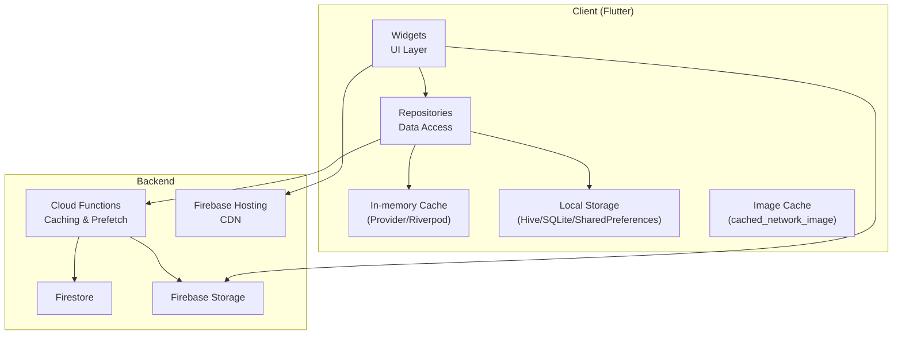

**Diagram sources**
- [flutter_app/lib/main.dart](file://flutter_app/lib/main.dart)
- [flutter_app/pubspec.yaml](file://flutter_app/pubspec.yaml)
- [functions/src/masterDashboardCache.ts](file://functions/src/masterDashboardCache.ts)
- [functions/src/membersDirectoryCache.ts](file://functions/src/membersDirectoryCache.ts)
- [functions/src/panelDashboardCache.ts](file://functions/src/panelDashboardCache.ts)
- [functions/src/panelFinanceAccountsCache.ts](file://functions/src/panelFinanceAccountsCache.ts)
- [functions/src/publicSiteMediaPrefetch.ts](file://functions/src/publicSiteMediaPrefetch.ts)
- [functions/src/panelPublicSiteCache.ts](file://functions/src/panelPublicSiteCache.ts)
- [firebase.json](file://firebase.json)
- [storage.rules](file://storage.rules)

**Section sources**
- [flutter_app/lib/main.dart](file://flutter_app/lib/main.dart)
- [flutter_app/pubspec.yaml](file://flutter_app/pubspec.yaml)
- [firebase.json](file://firebase.json)

## Core Components
- HTTP Response Caching: Enabled via network interceptors and package configuration to cache API responses and reduce latency.
- Firestore Query Result Caching: Local snapshots and in-memory caches minimize reads and improve responsiveness.
- Local Storage Optimization: Persistent stores keep critical state and recent queries offline-first.
- CDN Integration: Firebase Hosting serves static assets with appropriate cache-control headers; Storage URLs leverage CDN.
- Server-Side Caching: Cloud Functions precompute and cache dashboard and directory data; scheduled jobs maintain freshness and clean up stale artifacts.

Key implementation references:
- Network and dependency setup: [flutter_app/lib/main.dart](file://flutter_app/lib/main.dart), [flutter_app/pubspec.yaml](file://flutter_app/pubspec.yaml)
- Function-based caches: [functions/src/masterDashboardCache.ts](file://functions/src/masterDashboardCache.ts), [functions/src/membersDirectoryCache.ts](file://functions/src/membersDirectoryCache.ts), [functions/src/panelDashboardCache.ts](file://functions/src/panelDashboardCache.ts), [functions/src/panelFinanceAccountsCache.ts](file://functions/src/panelFinanceAccountsCache.ts)
- Media prefetch and public site cache: [functions/src/publicSiteMediaPrefetch.ts](file://functions/src/publicSiteMediaPrefetch.ts), [functions/src/panelPublicSiteCache.ts](file://functions/src/panelPublicSiteCache.ts)
- Cleanup routines: [functions/src/cleanupOrphanFiles.js](file://functions/src/cleanupOrphanFiles.js), [functions/src/purgeStalePendingUploads.js](file://functions/src/purgeStalePendingUploads.js)

**Section sources**
- [flutter_app/lib/main.dart](file://flutter_app/lib/main.dart)
- [flutter_app/pubspec.yaml](file://flutter_app/pubspec.yaml)
- [functions/src/masterDashboardCache.ts](file://functions/src/masterDashboardCache.ts)
- [functions/src/membersDirectoryCache.ts](file://functions/src/membersDirectoryCache.ts)
- [functions/src/panelDashboardCache.ts](file://functions/src/panelDashboardCache.ts)
- [functions/src/panelFinanceAccountsCache.ts](file://functions/src/panelFinanceAccountsCache.ts)
- [functions/src/publicSiteMediaPrefetch.ts](file://functions/src/publicSiteMediaPrefetch.ts)
- [functions/src/panelPublicSiteCache.ts](file://functions/src/panelPublicSiteCache.ts)
- [functions/src/cleanupOrphanFiles.js](file://functions/src/cleanupOrphanFiles.js)
- [functions/src/purgeStalePendingUploads.js](file://functions/src/purgeStalePendingUploads.js)

## Architecture Overview
The system implements a layered caching strategy:
- L1 In-memory cache: Fastest access for active widgets and recent queries.
- L2 Local persistent cache: Survives app restarts; used for offline-first UX.
- L3 CDN/Hosting cache: Static assets and generated pages cached at edge.
- L4 Backend cache: Precomputed aggregates and thumbnails served by functions.

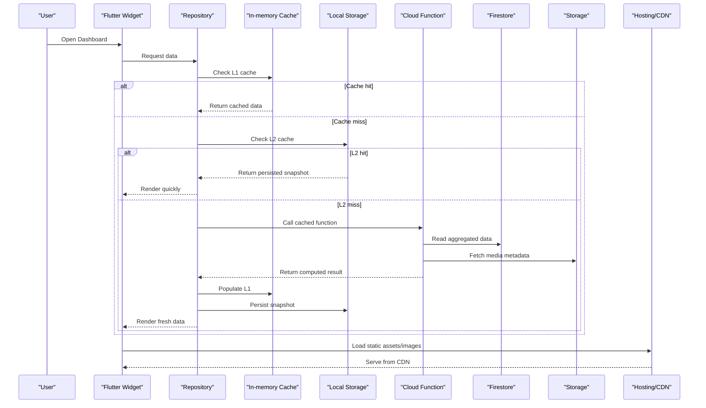

**Diagram sources**
- [flutter_app/lib/main.dart](file://flutter_app/lib/main.dart)
- [functions/src/masterDashboardCache.ts](file://functions/src/masterDashboardCache.ts)
- [functions/src/publicSiteMediaPrefetch.ts](file://functions/src/publicSiteMediaPrefetch.ts)
- [firebase.json](file://firebase.json)

## Detailed Component Analysis

### HTTP Response Caching
- Strategy: Use an HTTP client interceptor or provider configuration to cache GET responses with TTL and conditional requests.
- Benefits: Reduces network usage, improves perceived performance, and supports offline-first when combined with local persistence.
- Implementation pointers:
  - Configure caching options in dependencies: [flutter_app/pubspec.yaml](file://flutter_app/pubspec.yaml)
  - Initialize providers and interceptors at app start: [flutter_app/lib/main.dart](file://flutter_app/lib/main.dart)

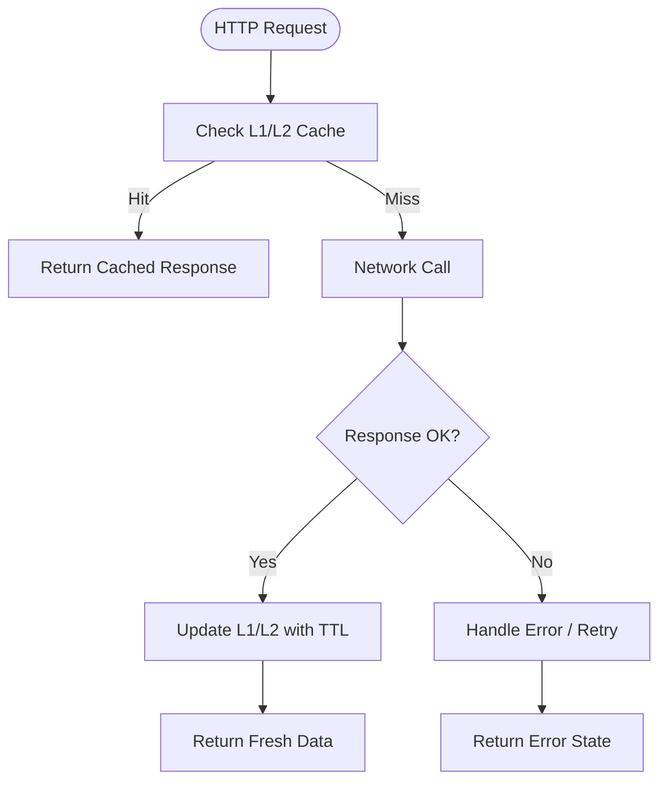

**Section sources**
- [flutter_app/pubspec.yaml](file://flutter_app/pubspec.yaml)
- [flutter_app/lib/main.dart](file://flutter_app/lib/main.dart)

### Firestore Query Result Caching
- Strategy: Combine real-time listeners with local snapshots and in-memory deduplication to avoid redundant reads.
- Benefits: Lower read costs, faster UI updates, resilient offline experience.
- Implementation pointers:
  - Repository layer subscribes to streams and merges with local cache.
  - Stale-while-revalidate pattern: serve from cache immediately, then update on new snapshot.

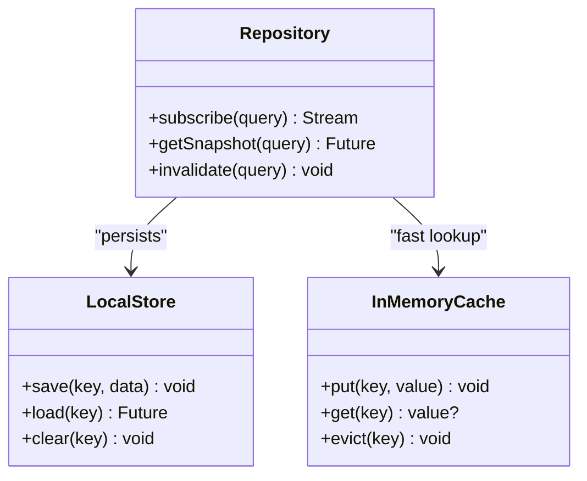

**Diagram sources**
- [flutter_app/lib/main.dart](file://flutter_app/lib/main.dart)

**Section sources**
- [flutter_app/lib/main.dart](file://flutter_app/lib/main.dart)

### Local Storage Optimization
- Strategy: Use efficient key-value or object stores for small-to-medium datasets; batch writes and compress where applicable.
- Benefits: Faster cold starts, reliable offline mode, reduced re-fetch overhead.
- Implementation pointers:
  - Define keys and TTL policies per feature.
  - Eviction policy based on size or recency.

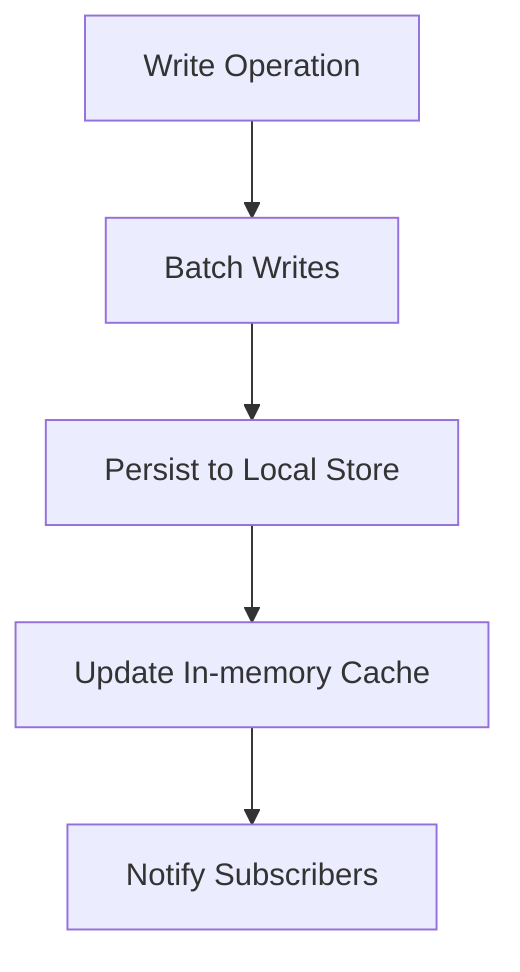

**Section sources**
- [flutter_app/lib/main.dart](file://flutter_app/lib/main.dart)

### CDN Integration (Firebase Hosting)
- Strategy: Host static assets and generated pages with cache-control headers; leverage CDN for global distribution.
- Benefits: Reduced latency, lower bandwidth, improved TTFB.
- Implementation pointers:
  - Configure hosting rules and asset caching: [firebase.json](file://firebase.json)
  - Ensure web bootstrap loads optimized bundles: [flutter_app/web/index.html](file://flutter_app/web/index.html), [flutter_app/web/flutter_bootstrap.js](file://flutter_app/web/flutter_bootstrap.js)

**Diagram sources**
- [firebase.json](file://firebase.json)
- [flutter_app/web/index.html](file://flutter_app/web/index.html)
- [flutter_app/web/flutter_bootstrap.js](file://flutter_app/web/flutter_bootstrap.js)

**Section sources**
- [firebase.json](file://firebase.json)
- [flutter_app/web/index.html](file://flutter_app/web/index.html)
- [flutter_app/web/flutter_bootstrap.js](file://flutter_app/web/flutter_bootstrap.js)

### Server-Side Caching with Cloud Functions
- Strategy: Precompute expensive queries and store results in Firestore or external caches; expose via callable endpoints.
- Examples:
  - Master dashboard cache: [functions/src/masterDashboardCache.ts](file://functions/src/masterDashboardCache.ts)
  - Members directory cache: [functions/src/membersDirectoryCache.ts](file://functions/src/membersDirectoryCache.ts)
  - Panel dashboards and finance accounts: [functions/src/panelDashboardCache.ts](file://functions/src/panelDashboardCache.ts), [functions/src/panelFinanceAccountsCache.ts](file://functions/src/panelFinanceAccountsCache.ts)
  - Public site cache and media prefetch: [functions/src/panelPublicSiteCache.ts](file://functions/src/panelPublicSiteCache.ts), [functions/src/publicSiteMediaPrefetch.ts](file://functions/src/publicSiteMediaPrefetch.ts)

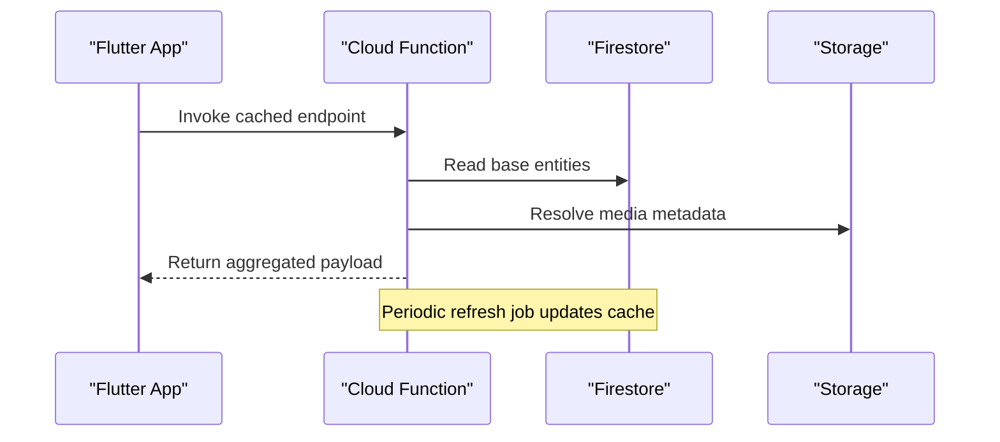

**Diagram sources**
- [functions/src/masterDashboardCache.ts](file://functions/src/masterDashboardCache.ts)
- [functions/src/membersDirectoryCache.ts](file://functions/src/membersDirectoryCache.ts)
- [functions/src/panelDashboardCache.ts](file://functions/src/panelDashboardCache.ts)
- [functions/src/panelFinanceAccountsCache.ts](file://functions/src/panelFinanceAccountsCache.ts)
- [functions/src/publicSiteMediaPrefetch.ts](file://functions/src/publicSiteMediaPrefetch.ts)
- [functions/src/panelPublicSiteCache.ts](file://functions/src/panelPublicSiteCache.ts)

**Section sources**
- [functions/src/masterDashboardCache.ts](file://functions/src/masterDashboardCache.ts)
- [functions/src/membersDirectoryCache.ts](file://functions/src/membersDirectoryCache.ts)
- [functions/src/panelDashboardCache.ts](file://functions/src/panelDashboardCache.ts)
- [functions/src/panelFinanceAccountsCache.ts](file://functions/src/panelFinanceAccountsCache.ts)
- [functions/src/publicSiteMediaPrefetch.ts](file://functions/src/publicSiteMediaPrefetch.ts)
- [functions/src/panelPublicSiteCache.ts](file://functions/src/publicSiteCache.ts)

### Image Caching Strategies
- Strategy: Use a robust image caching library to cache network images in memory and disk; set appropriate sizes and placeholders.
- Benefits: Smoother scrolling, reduced bandwidth, better offline UX.
- Implementation pointers:
  - Add dependencies and configure caching policies: [flutter_app/pubspec.yaml](file://flutter_app/pubspec.yaml)
  - Apply caching in widgets through repository or service layer: [flutter_app/lib/main.dart](file://flutter_app/lib/main.dart)

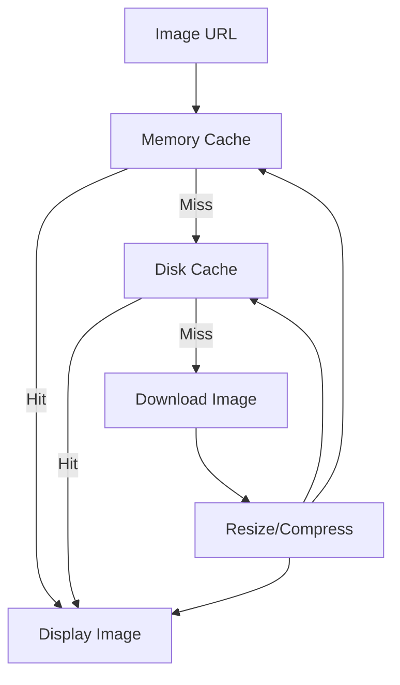

**Section sources**
- [flutter_app/pubspec.yaml](file://flutter_app/pubspec.yaml)
- [flutter_app/lib/main.dart](file://flutter_app/lib/main.dart)

### Background Data Synchronization
- Strategy: Sync critical data in background using periodic tasks or event-driven triggers; reconcile conflicts with last-write-wins or merge strategies.
- Implementation pointers:
  - Use background isolates or platform services to fetch and persist updates.
  - Debounce rapid changes and coalesce writes.

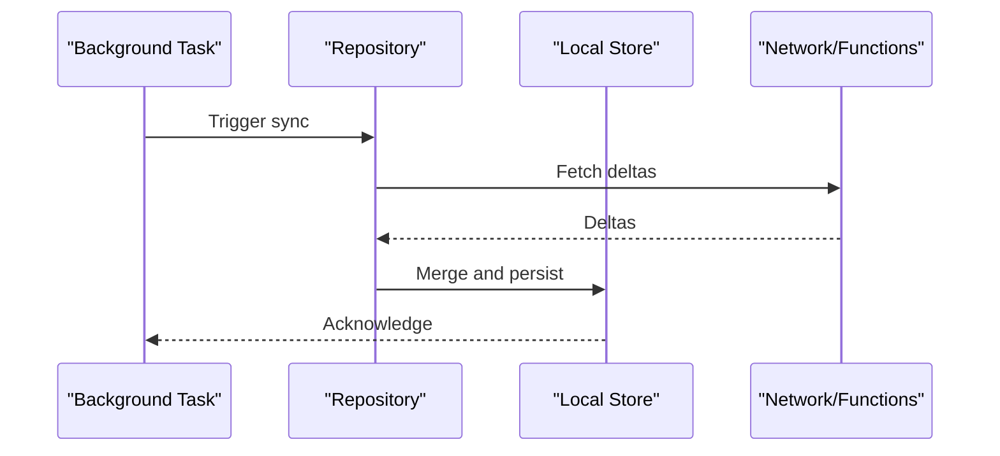

**Section sources**
- [flutter_app/lib/main.dart](file://flutter_app/lib/main.dart)

### Cache Invalidation Policies and Stale-While-Revalidate
- Policy: Assign TTLs per data type; invalidate on mutations; serve stale while refreshing in background.
- Conflict Resolution: Prefer server authority; use timestamps and version fields; handle partial failures gracefully.

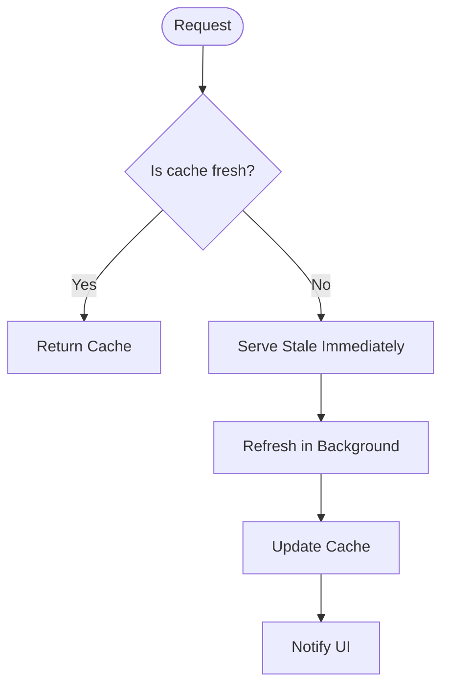

**Section sources**
- [flutter_app/lib/main.dart](file://flutter_app/lib/main.dart)

### Platform-Specific Memory Constraints (iOS and Android)
- iOS:
  - Monitor memory pressure via system notifications; clear large caches and release image bitmaps.
  - Tune launch settings and ensure proper resource disposal in native bridges.
- Android:
  - Respect low-memory killer thresholds; avoid holding large byte arrays; use efficient decoders.
  - Configure ProGuard/R8 rules to optimize runtime memory footprint.

Implementation pointers:
- Android build optimizations: [flutter_app/android/app/build.gradle.kts](file://flutter_app/android/app/build.gradle.kts)
- iOS Info.plist configurations: [flutter_app/ios/Runner/Info.plist](file://flutter_app/ios/Runner/Info.plist)

**Section sources**
- [flutter_app/android/app/build.gradle.kts](file://flutter_app/android/app/build.gradle.kts)
- [flutter_app/ios/Runner/Info.plist](file://flutter_app/ios/Runner/Info.plist)

### Automatic Cache Cleanup Mechanisms
- Orphan file cleanup: Remove unused media files to free storage.
- Stale pending uploads: Purge incomplete uploads older than threshold.

Implementation pointers:
- Cleanup orphan files: [functions/src/cleanupOrphanFiles.js](file://functions/src/cleanupOrphanFiles.js)
- Purge stale pending uploads: [functions/src/purgeStalePendingUploads.js](file://functions/src/purgeStalePendingUploads.js)

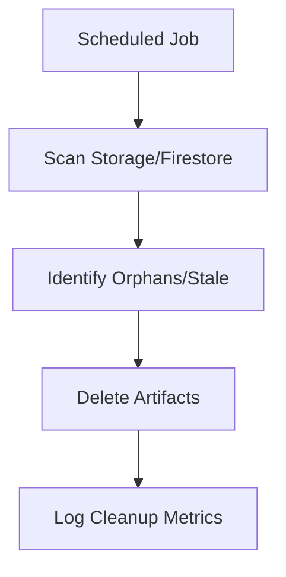

**Diagram sources**
- [functions/src/cleanupOrphanFiles.js](file://functions/src/cleanupOrphanFiles.js)
- [functions/src/purgeStalePendingUploads.js](file://functions/src/purgeStalePendingUploads.js)

**Section sources**
- [functions/src/cleanupOrphanFiles.js](file://functions/src/cleanupOrphanFiles.js)
- [functions/src/purgeStalePendingUploads.js](file://functions/src/purgeStalePendingUploads.js)

## Dependency Analysis
The caching ecosystem depends on Flutter packages, Firebase services, and Cloud Functions. The following diagram maps core dependencies:

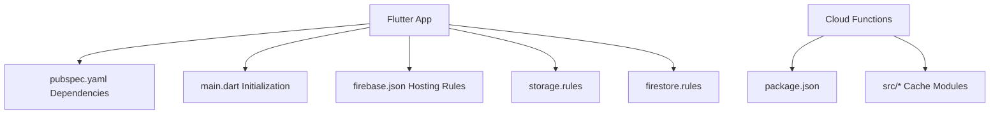

**Diagram sources**
- [flutter_app/pubspec.yaml](file://flutter_app/pubspec.yaml)
- [flutter_app/lib/main.dart](file://flutter_app/lib/main.dart)
- [firebase.json](file://firebase.json)
- [storage.rules](file://storage.rules)
- [firestore.rules](file://firestore.rules)
- [functions/package.json](file://functions/package.json)
- [functions/src/masterDashboardCache.ts](file://functions/src/masterDashboardCache.ts)
- [functions/src/membersDirectoryCache.ts](file://functions/src/membersDirectoryCache.ts)
- [functions/src/panelDashboardCache.ts](file://functions/src/panelDashboardCache.ts)
- [functions/src/panelFinanceAccountsCache.ts](file://functions/src/panelFinanceAccountsCache.ts)
- [functions/src/publicSiteMediaPrefetch.ts](file://functions/src/publicSiteMediaPrefetch.ts)
- [functions/src/panelPublicSiteCache.ts](file://functions/src/panelPublicSiteCache.ts)

**Section sources**
- [flutter_app/pubspec.yaml](file://flutter_app/pubspec.yaml)
- [flutter_app/lib/main.dart](file://flutter_app/lib/main.dart)
- [firebase.json](file://firebase.json)
- [storage.rules](file://storage.rules)
- [firestore.rules](file://firestore.rules)
- [functions/package.json](file://functions/package.json)

## Performance Considerations
- Prefer L1/L2 cache hits for frequent reads; limit network calls to deltas.
- Use pagination and virtualization for large lists to reduce memory pressure.
- Compress and resize images before caching; avoid loading full-resolution assets unnecessarily.
- Set appropriate TTLs per data category; hot data gets shorter TTLs, cold data longer.
- Batch writes and debounce user input to reduce write storms.
- Monitor memory usage and adjust cache sizes dynamically based on device capabilities.

[No sources needed since this section provides general guidance]

## Troubleshooting Guide
Common issues and resolutions:
- Stale data displayed: Verify TTL and invalidation triggers; check background refresh jobs.
- High memory usage: Inspect image cache sizes; ensure proper disposal of streams and subscriptions.
- Slow cold starts: Reduce initial payload; defer non-critical data loading.
- Storage bloat: Run cleanup jobs; audit orphan files and stale uploads.

Relevant implementation references:
- Cleanup routines: [functions/src/cleanupOrphanFiles.js](file://functions/src/cleanupOrphanFiles.js), [functions/src/purgeStalePendingUploads.js](file://functions/src/purgeStalePendingUploads.js)
- App initialization and dependency wiring: [flutter_app/lib/main.dart](file://flutter_app/lib/main.dart)

**Section sources**
- [functions/src/cleanupOrphanFiles.js](file://functions/src/cleanupOrphanFiles.js)
- [functions/src/purgeStalePendingUploads.js](file://functions/src/purgeStalePendingUploads.js)
- [flutter_app/lib/main.dart](file://flutter_app/lib/main.dart)

## Conclusion
Gestão Yahweh Premium employs a comprehensive multi-level caching strategy that balances speed, cost, and reliability. By combining in-memory caches, persistent storage, CDN delivery, and server-side precomputation, the app delivers responsive UX under varying network conditions. Flutter-specific memory management practices, along with platform-aware cleanup mechanisms, ensure stable performance across iOS and Android. Continuous monitoring and iterative tuning of TTLs, cache sizes, and background sync schedules will further enhance scalability and user experience.

[No sources needed since this section summarizes without analyzing specific files]

## Appendices

### Example: Efficient Database Query Caching
- Pattern: Subscribe to Firestore streams, merge with local snapshots, and cache results with TTL.
- References:
  - Repository initialization and stream handling: [flutter_app/lib/main.dart](file://flutter_app/lib/main.dart)
  - Function-based aggregation for heavy queries: [functions/src/masterDashboardCache.ts](file://functions/src/masterDashboardCache.ts)

**Section sources**
- [flutter_app/lib/main.dart](file://flutter_app/lib/main.dart)
- [functions/src/masterDashboardCache.ts](file://functions/src/masterDashboardCache.ts)

### Example: Background Data Synchronization
- Pattern: Periodic background tasks fetch deltas, merge with local store, and notify UI subscribers.
- References:
  - Background task orchestration: [flutter_app/lib/main.dart](file://flutter_app/lib/main.dart)
  - Cleanup and maintenance jobs: [functions/src/cleanupOrphanFiles.js](file://functions/src/cleanupOrphanFiles.js), [functions/src/purgeStalePendingUploads.js](file://functions/src/purgeStalePendingUploads.js)

**Section sources**
- [flutter_app/lib/main.dart](file://flutter_app/lib/main.dart)
- [functions/src/cleanupOrphanFiles.js](file://functions/src/cleanupOrphanFiles.js)
- [functions/src/purgeStalePendingUploads.js](file://functions/src/purgeStalePendingUploads.js)

### Example: Memory Leak Prevention
- Practices:
  - Cancel streams and dispose controllers on widget deactivation.
  - Avoid retaining large objects in global state; prefer scoped caches.
  - Use weak references for callbacks and observers.
- References:
  - App lifecycle and initialization: [flutter_app/lib/main.dart](file://flutter_app/lib/main.dart)
  - Android build optimizations: [flutter_app/android/app/build.gradle.kts](file://flutter_app/android/app/build.gradle.kts)
  - iOS configuration: [flutter_app/ios/Runner/Info.plist](file://flutter_app/ios/Runner/Info.plist)

**Section sources**
- [flutter_app/lib/main.dart](file://flutter_app/lib/main.dart)
- [flutter_app/android/app/build.gradle.kts](file://flutter_app/android/app/build.gradle.kts)
- [flutter_app/ios/Runner/Info.plist](file://flutter_app/ios/Runner/Info.plist)