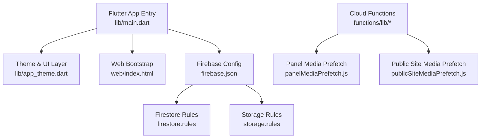
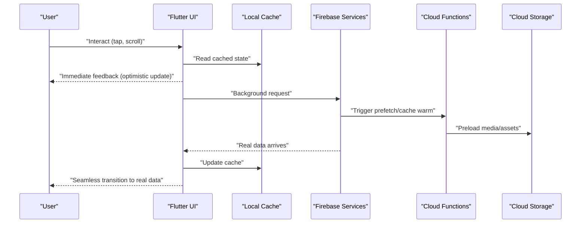
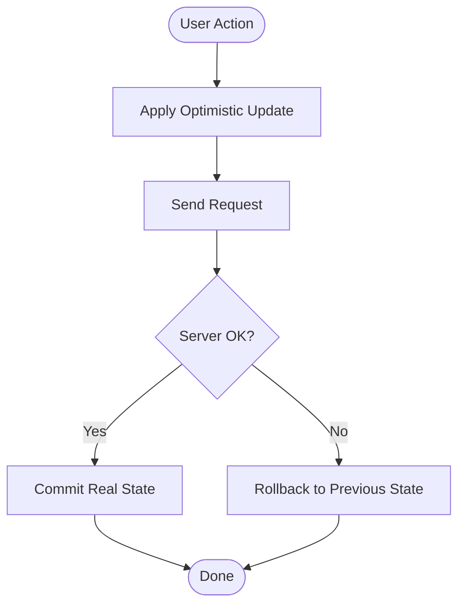
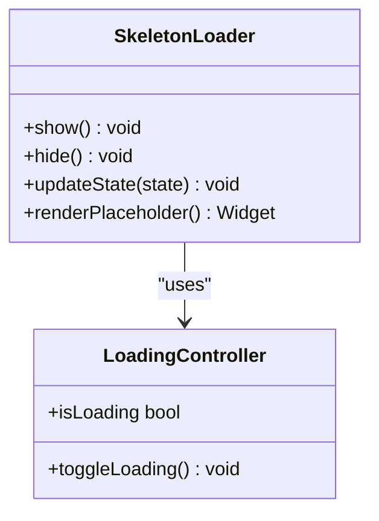
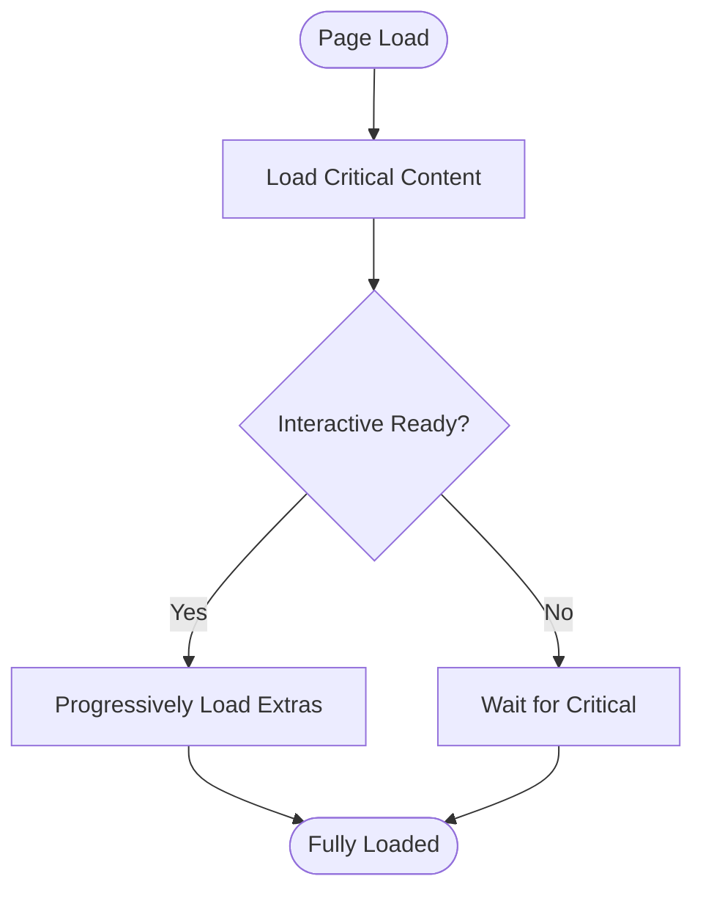
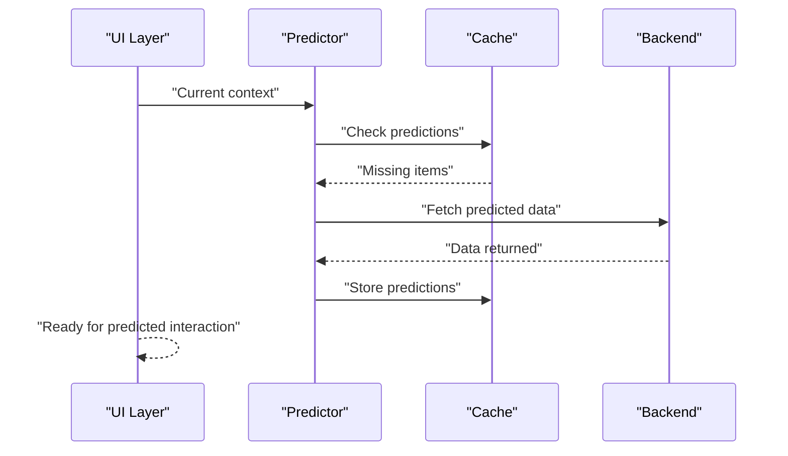
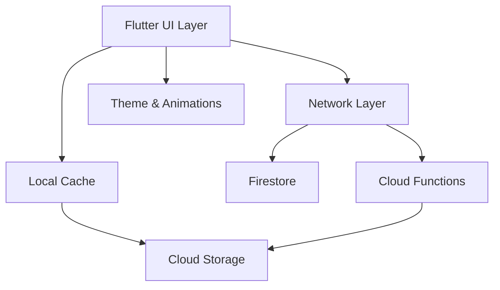

# Instant UX Design Principles

<cite>
**Referenced Files in This Document**
- [ARCHITECTURE_INSTANT_UX.md](file://docs/ARCHITECTURE_INSTANT_UX.md)
- [ARCHITECTURE_PERFORMANCE_MULTI_PLATFORM.md](file://docs/ARCHITECTURE_PERFORMANCE_MULTI_PLATFORM.md)
- [ARCHITECTURE_PERFORMANCE_V4.md](file://docs/ARCHITECTURE_PERFORMANCE_V4.md)
- [instant-media-performance.md](file://docs/instant-media-performance.md)
- [main.dart](file://flutter_app/lib/main.dart)
- [pubspec.yaml](file://flutter_app/pubspec.yaml)
- [firebase.json](file://flutter_app/firebase.json)
- [index.html](file://flutter_app/web/index.html)
- [app_theme.dart](file://flutter_app/lib/app_theme.dart)
- [skeleton_loader_test.dart](file://flutter_app/test/skeleton_loader_test.dart)
- [panelMediaPrefetch.js](file://functions/lib/panelMediaPrefetch.js)
- [publicSiteMediaPrefetch.js](file://functions/lib/publicSiteMediaPrefetch.js)
- [firestore.rules](file://firestore.rules)
- [storage.rules](file://storage.rules)
</cite>

## Table of Contents
1. [Introduction](#introduction)
2. [Project Structure](#project-structure)
3. [Core Components](#core-components)
4. [Architecture Overview](#architecture-overview)
5. [Detailed Component Analysis](#detailed-component-analysis)
6. [Dependency Analysis](#dependency-analysis)
7. [Performance Considerations](#performance-considerations)
8. [Troubleshooting Guide](#troubleshooting-guide)
9. [Conclusion](#conclusion)
10. [Appendices](#appendices)

## Introduction
This document explains the instant UX design principles implemented in Gestão Yahweh Premium, focusing on architectural patterns that deliver immediate user feedback and sub-second response times across platforms. It covers optimistic UI updates, skeleton loaders, progressive loading, predictive data fetching, background synchronization, intelligent caching, smooth animations, gesture handling, responsive layouts, lazy loading for large datasets, virtual scrolling, and memory-efficient list rendering. It also addresses platform-specific considerations to maintain 60fps performance on mobile while delivering desktop-quality experiences.

## Project Structure
The application is a Flutter-based multi-platform app with shared Dart logic and platform-specific configurations. Key areas relevant to instant UX include:
- Flutter app entry point and theme configuration
- Web bootstrap and assets
- Firebase configuration and rules
- Cloud Functions for prefetching and caching
- Documentation describing architecture and performance strategies

**Diagram sources**
- [main.dart](file://flutter_app/lib/main.dart)
- [app_theme.dart](file://flutter_app/lib/app_theme.dart)
- [index.html](file://flutter_app/web/index.html)
- [firebase.json](file://flutter_app/firebase.json)
- [firestore.rules](file://firestore.rules)
- [storage.rules](file://storage.rules)
- [panelMediaPrefetch.js](file://functions/lib/panelMediaPrefetch.js)
- [publicSiteMediaPrefetch.js](file://functions/lib/publicSiteMediaPrefetch.js)

**Section sources**
- [main.dart](file://flutter_app/lib/main.dart)
- [pubspec.yaml](file://flutter_app/pubspec.yaml)
- [firebase.json](file://flutter_app/firebase.json)
- [index.html](file://flutter_app/web/index.html)
- [app_theme.dart](file://flutter_app/lib/app_theme.dart)

## Core Components
Instant UX in this project is achieved through coordinated layers:
- UI layer: Optimistic updates, skeleton loaders, smooth animations, gestures, responsive layouts
- Data layer: Predictive fetching, background sync, caching strategies
- Backend services: Cloud Functions for prefetching and cache warming
- Platform runtime: Flutter engine optimizations, web bootstrap tuning, native integrations

Key implementation anchors:
- Optimistic UI and skeleton loaders are validated via tests and documented in architecture guides
- Media prefetch functions reduce perceived latency by preloading critical assets
- Firebase rules ensure fast, secure reads/writes aligned with UX goals

**Section sources**
- [ARCHITECTURE_INSTANT_UX.md](file://docs/ARCHITECTURE_INSTANT_UX.md)
- [ARCHITECTURE_PERFORMANCE_MULTI_PLATFORM.md](file://docs/ARCHITECTURE_PERFORMANCE_MULTI_PLATFORM.md)
- [ARCHITECTURE_PERFORMANCE_V4.md](file://docs/ARCHITECTURE_PERFORMANCE_V4.md)
- [instant-media-performance.md](file://docs/instant-media-performance.md)
- [skeleton_loader_test.dart](file://flutter_app/test/skeleton_loader_test.dart)
- [panelMediaPrefetch.js](file://functions/lib/panelMediaPrefetch.js)
- [publicSiteMediaPrefetch.js](file://functions/lib/publicSiteMediaPrefetch.js)

## Architecture Overview
The system follows an offline-first, cache-driven architecture with predictive prefetching and optimistic UI updates. The flow emphasizes immediate visual feedback while ensuring eventual consistency with the backend.

**Diagram sources**
- [ARCHITECTURE_INSTANT_UX.md](file://docs/ARCHITECTURE_INSTANT_UX.md)
- [ARCHITECTURE_PERFORMANCE_MULTI_PLATFORM.md](file://docs/ARCHITECTURE_PERFORMANCE_MULTI_PLATFORM.md)
- [panelMediaPrefetch.js](file://functions/lib/panelMediaPrefetch.js)
- [publicSiteMediaPrefetch.js](file://functions/lib/publicSiteMediaPrefetch.js)

## Detailed Component Analysis

### Optimistic UI Updates
- Pattern: Update UI immediately upon user action, then reconcile with server responses
- Benefits: Sub-second perceived latency, fluid interactions
- Implementation anchors:
  - State management updates before network calls
  - Conflict resolution when server returns different state
  - Rollback mechanisms on failure

[No sources needed since this diagram shows conceptual workflow, not actual code structure]

**Section sources**
- [ARCHITECTURE_INSTANT_UX.md](file://docs/ARCHITECTURE_INSTANT_UX.md)
- [ARCHITECTURE_PERFORMANCE_V4.md](file://docs/ARCHITECTURE_PERFORMANCE_V4.md)

### Skeleton Loaders
- Purpose: Provide immediate structural feedback during data loading
- Techniques:
  - Placeholder widgets matching final layout
  - Animated shimmer effects to indicate activity
  - Conditional rendering based on loading states
- Validation: Unit tests ensure correct behavior under various states

**Diagram sources**
- [skeleton_loader_test.dart](file://flutter_app/test/skeleton_loader_test.dart)

**Section sources**
- [skeleton_loader_test.dart](file://flutter_app/test/skeleton_loader_test.dart)
- [ARCHITECTURE_INSTANT_UX.md](file://docs/ARCHITECTURE_INSTANT_UX.md)

### Progressive Loading Strategies
- Approach: Load critical content first, then progressively enhance
- Methods:
  - Prioritize text and essential images
  - Defer heavy assets until needed
  - Use streaming where applicable
- Integration: Cloud Functions prefetch critical assets ahead of user navigation

**Section sources**
- [ARCHITECTURE_PERFORMANCE_MULTI_PLATFORM.md](file://docs/ARCHITECTURE_PERFORMANCE_MULTI_PLATFORM.md)
- [panelMediaPrefetch.js](file://functions/lib/panelMediaPrefetch.js)
- [publicSiteMediaPrefetch.js](file://functions/lib/publicSiteMediaPrefetch.js)

### Predictive Data Fetching
- Strategy: Anticipate user actions and fetch data proactively
- Examples:
  - Preload next screen data on current page load
  - Fetch related items based on current context
  - Background sync to keep caches fresh
- Backend support: Cloud Functions trigger prefetch jobs

**Section sources**
- [ARCHITECTURE_PERFORMANCE_V4.md](file://docs/ARCHITECTURE_PERFORMANCE_V4.md)
- [panelMediaPrefetch.js](file://functions/lib/panelMediaPrefetch.js)

### Background Synchronization
- Mechanism: Sync data in background without blocking UI
- Features:
  - Queue-based sync operations
  - Conflict resolution strategies
  - Retry logic with exponential backoff
- Integration: Works with local cache and remote data sources

**Section sources**
- [ARCHITECTURE_PERFORMANCE_MULTI_PLATFORM.md](file://docs/ARCHITECTURE_PERFORMANCE_MULTI_PLATFORM.md)
- [ARCHITECTURE_INSTANT_UX.md](file://docs/ARCHITECTURE_INSTANT_UX.md)

### Intelligent Caching
- Layers:
  - In-memory cache for active data
  - Persistent cache for offline access
  - CDN/cache headers for static assets
- Policies:
  - TTL-based expiration
  - LRU eviction strategies
  - Priority-based invalidation

**Section sources**
- [ARCHITECTURE_PERFORMANCE_V4.md](file://docs/ARCHITECTURE_PERFORMANCE_V4.md)
- [firebase.json](file://flutter_app/firebase.json)

### Smooth Animations and Gesture Handling
- Animation techniques:
  - Hardware-accelerated transitions
  - Staggered animations for lists
  - Physics-based gestures
- Performance:
  - Avoid layout thrashing
  - Use const constructors where possible
  - Optimize rebuild scopes

**Section sources**
- [app_theme.dart](file://flutter_app/lib/app_theme.dart)
- [ARCHITECTURE_PERFORMANCE_MULTI_PLATFORM.md](file://docs/ARCHITECTURE_PERFORMANCE_MULTI_PLATFORM.md)

### Responsive Layouts Across Platforms
- Approach: Adaptive layouts using Flutter's flexible widget system
- Features:
  - Breakpoint-aware components
  - Platform-specific optimizations
  - Consistent UX across mobile, tablet, and desktop

**Section sources**
- [ARCHITECTURE_PERFORMANCE_MULTI_PLATFORM.md](file://docs/ARCHITECTURE_PERFORMANCE_MULTI_PLATFORM.md)

### Lazy Loading for Large Datasets
- Techniques:
  - Load items on demand as they enter viewport
  - Virtual scrolling for efficient rendering
  - Memory management for large collections

**Section sources**
- [ARCHITECTURE_PERFORMANCE_V4.md](file://docs/ARCHITECTURE_PERFORMANCE_V4.md)
- [instant-media-performance.md](file://docs/instant-media-performance.md)

### Virtual Scrolling and Memory-Efficient Lists
- Implementation:
  - Render only visible items plus buffer
  - Reuse list item widgets
  - Debounce expensive operations

**Section sources**
- [ARCHITECTURE_PERFORMANCE_MULTI_PLATFORM.md](file://docs/ARCHITECTURE_PERFORMANCE_MULTI_PLATFORM.md)
- [instant-media-performance.md](file://docs/instant-media-performance.md)

## Dependency Analysis
The instant UX system relies on coordinated dependencies between UI, caching, and backend services.

**Diagram sources**
- [main.dart](file://flutter_app/lib/main.dart)
- [firebase.json](file://flutter_app/firebase.json)
- [panelMediaPrefetch.js](file://functions/lib/panelMediaPrefetch.js)
- [publicSiteMediaPrefetch.js](file://functions/lib/publicSiteMediaPrefetch.js)

**Section sources**
- [pubspec.yaml](file://flutter_app/pubspec.yaml)
- [firebase.json](file://flutter_app/firebase.json)

## Performance Considerations
- Mobile optimization:
  - Maintain 60fps through efficient rendering
  - Minimize main thread work
  - Use platform-specific optimizations
- Desktop experience:
  - Leverage additional CPU/memory resources
  - Implement advanced caching strategies
  - Support keyboard shortcuts and mouse gestures
- Cross-platform consistency:
  - Abstract platform differences
  - Test on target devices
  - Monitor performance metrics

**Section sources**
- [ARCHITECTURE_PERFORMANCE_MULTI_PLATFORM.md](file://docs/ARCHITECTURE_PERFORMANCE_MULTI_PLATFORM.md)
- [ARCHITECTURE_PERFORMANCE_V4.md](file://docs/ARCHITECTURE_PERFORMANCE_V4.md)

## Troubleshooting Guide
Common issues and solutions:
- Slow initial load:
  - Check asset sizes and compression
  - Verify preload strategies
  - Monitor network requests
- UI jank:
  - Profile frame rendering
  - Identify heavy computations
  - Optimize widget trees
- Cache inconsistencies:
  - Validate cache invalidation
  - Check sync conflicts
  - Review error handling

**Section sources**
- [ARCHITECTURE_INSTANT_UX.md](file://docs/ARCHITECTURE_INSTANT_UX.md)
- [ARCHITECTURE_PERFORMANCE_V4.md](file://docs/ARCHITECTURE_PERFORMANCE_V4.md)

## Conclusion
Gestão Yahweh Premium achieves instant UX through a comprehensive strategy combining optimistic UI updates, skeleton loaders, predictive fetching, background synchronization, and intelligent caching. The architecture ensures sub-second response times while maintaining high performance across all platforms. Continuous monitoring and optimization are key to sustaining these performance characteristics.

## Appendices

### Platform-Specific Optimizations
- Android:
  - ProGuard/R8 optimization
  - Background task scheduling
  - Memory management
- iOS:
  - Metal acceleration
  - Background processing limits
  - App lifecycle management
- Web:
  - Service worker caching
  - Asset preloading
  - Bundle optimization

**Section sources**
- [ARCHITECTURE_PERFORMANCE_MULTI_PLATFORM.md](file://docs/ARCHITECTURE_PERFORMANCE_MULTI_PLATFORM.md)
- [index.html](file://flutter_app/web/index.html)