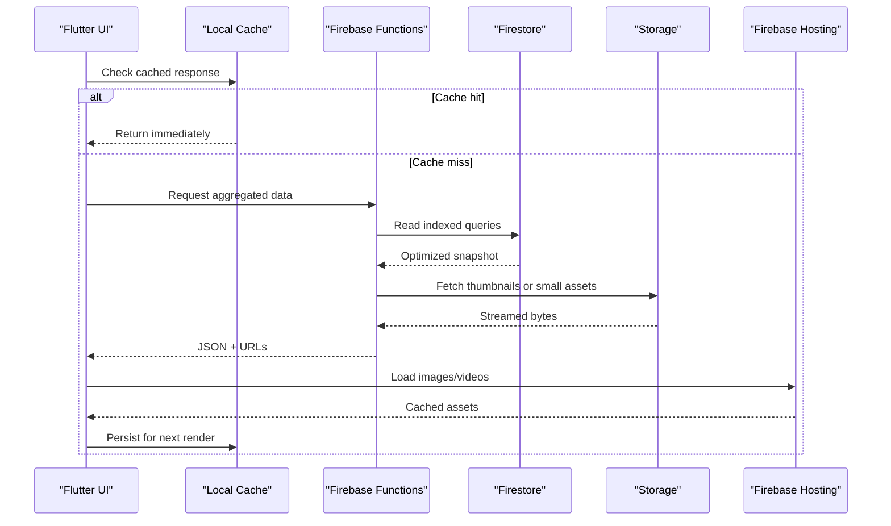
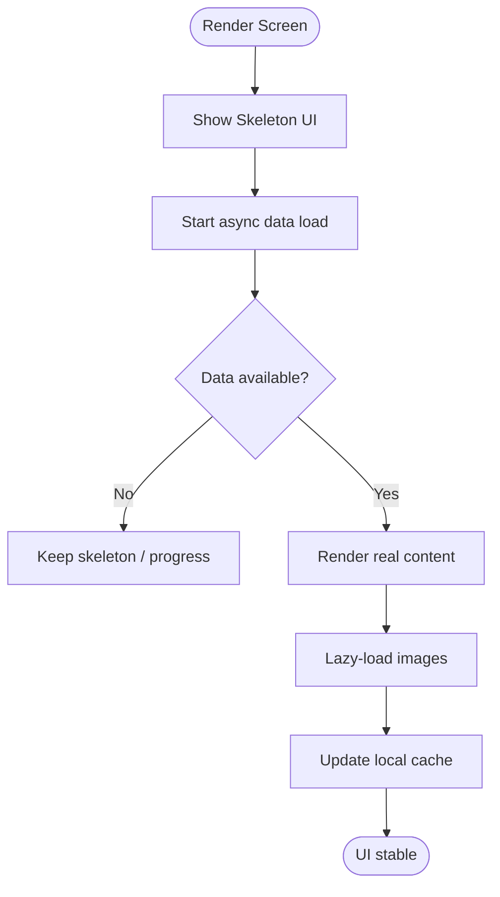
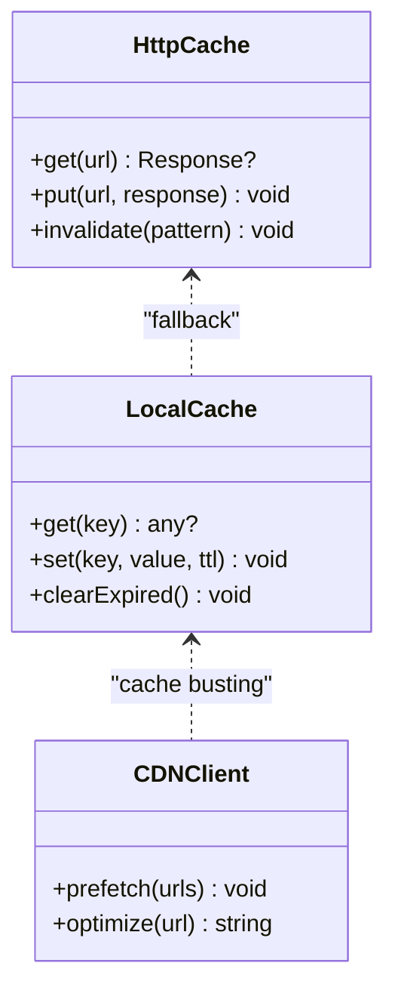
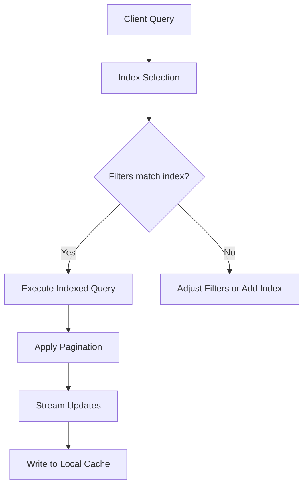
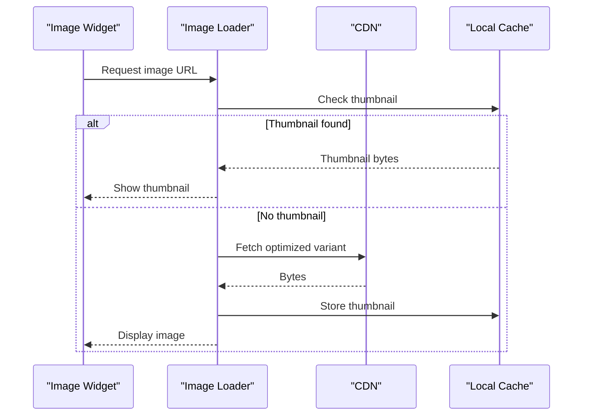
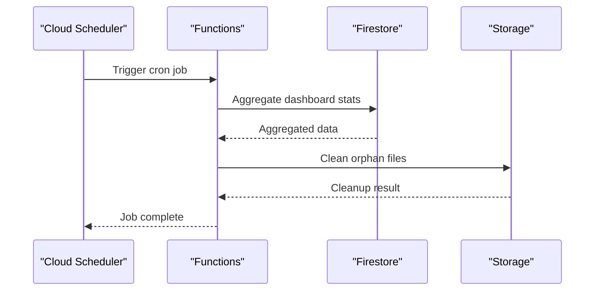
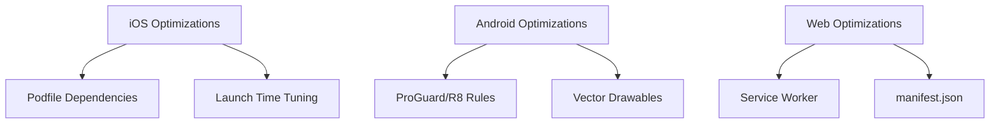
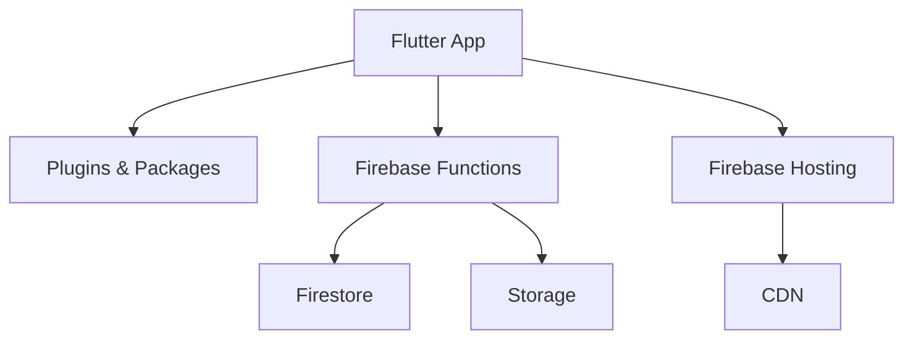

# Performance Architecture

<cite>
**Referenced Files in This Document**
- [ARCHITECTURE_PERFORMANCE_MULTI_PLATFORM.md](file://docs/ARCHITECTURE_PERFORMANCE_MULTI_PLATFORM.md)
- [ARCHITECTURE_PERFORMANCE_V4.md](file://docs/ARCHITECTURE_PERFORMANCE_V4.md)
- [ARCHITECTURE_INSTANT_UX.md](file://docs/ARCHITECTURE_INSTANT_UX.md)
- [PADRONIZACAO_PERFORMANCE_CONTROLE_TOTAL.md](file://docs/PADRONIZACAO_PERFORMANCE_CONTROLE_TOTAL.md)
- [instant-media-performance.md](file://docs/instant-media-performance.md)
- [FIREBASE_OBSERVABILITY.md](file://docs/FIREBASE_OBSERVABILITY.md)
- [main.dart](file://flutter_app/lib/main.dart)
- [pubspec.yaml](file://flutter_app/pubspec.yaml)
- [firebase.json](file://flutter_app/firebase.json)
- [storage_cors.json](file://flutter_app/storage_cors.json)
- [index.html](file://flutter_app/web/index.html)
- [manifest.json](file://flutter_app/web/manifest.json)
- [firebase-messaging-sw.js](file://flutter_app/web/firebase-messaging-sw.js)
- [build.gradle.kts](file://flutter_app/android/app/build.gradle.kts)
- [Podfile](file://flutter_app/ios/Podfile)
- [churchPerformancePack.js](file://functions/lib/churchPerformancePack.js)
- [panelMediaPrefetch.js](file://functions/lib/panelMediaPrefetch.js)
- [publicSiteMediaPrefetch.js](file://functions/lib/publicSiteMediaPrefetch.js)
- [masterDashboardCache.js](file://functions/lib/masterDashboardCache.js)
- [membersDirectoryCache.js](file://functions/lib/membersDirectoryCache.js)
- [panelDashboardCache.js](file://functions/lib/panelDashboardCache.js)
- [panelFinanceAccountsCache.js](file://functions/lib/panelFinanceAccountsCache.js)
- [panelPublicSiteCache.js](file://functions/lib/panelPublicSiteCache.js)
- [panelStatisticsCache.js](file://functions/lib/panelStatisticsCache.js)
- [storageDisplayUrls.js](file://functions/lib/storageDisplayUrls.js)
- [cleanupOrphanFiles.js](file://functions/lib/cleanupOrphanFiles.js)
- [firestore.rules](file://firestore.rules)
- [storage.rules](file://storage.rules)
- [PERFORMANCE_REPORT.md](file://PERFORMANCE_REPORT.md)
</cite>

## Table of Contents
1. [Introduction](#introduction)
2. [Project Structure](#project-structure)
3. [Core Components](#core-components)
4. [Architecture Overview](#architecture-overview)
5. [Detailed Component Analysis](#detailed-component-analysis)
6. [Dependency Analysis](#dependency-analysis)
7. [Performance Considerations](#performance-considerations)
8. [Troubleshooting Guide](#troubleshooting-guide)
9. [Conclusion](#conclusion)
10. [Appendices](#appendices)

## Introduction
This document explains the performance architecture and optimization strategies for Gestão Yahweh Premium across mobile (iOS, Android), web, and backend services. It focuses on instant UX design principles, lazy loading, memory management, multi-level caching (HTTP, local storage, CDN), monitoring and profiling, database query optimization, efficient image handling, background task scheduling, platform-specific optimizations, testing methodologies, load balancing, and scaling strategies.

## Project Structure
The project is a Flutter application with native iOS and Android targets, a web target, Firebase Functions for server-side logic, and extensive documentation describing performance patterns and standards. Key areas:
- Flutter app entry and configuration
- Web assets and service worker
- Android build and ProGuard rules
- iOS CocoaPods dependencies
- Firebase Functions for caching, prefetching, and maintenance tasks
- Firestore and Storage security rules
- Documentation that codifies performance practices

```mermaid
graph TB
subgraph "Flutter App"
A["lib/main.dart"]
B["pubspec.yaml"]
C["web/index.html"]
D["web/manifest.json"]
E["web/firebase-messaging-sw.js"]
end
subgraph "Android"
F["android/app/build.gradle.kts"]
end
subgraph "iOS"
G["ios/Podfile"]
end
subgraph "Firebase Functions"
H["churchPerformancePack.js"]
I["panelMediaPrefetch.js"]
J["publicSiteMediaPrefetch.js"]
K["masterDashboardCache.js"]
L["membersDirectoryCache.js"]
M["panelDashboardCache.js"]
N["panelFinanceAccountsCache.js"]
O["panelPublicSiteCache.js"]
P["panelStatisticsCache.js"]
Q["storageDisplayUrls.js"]
R["cleanupOrphanFiles.js"]
end
subgraph "Storage & Rules"
S["storage.rules"]
T["firestore.rules"]
U["storage_cors.json"]
end
A --> B
A --> C
C --> E
A --> F
A --> G
A --> H
A --> I
A --> J
A --> K
A --> L
A --> M
A --> N
A --> O
A --> P
A --> Q
A --> R
H --> S
I --> S
J --> S
K --> T
L --> T
M --> T
N --> T
O --> T
P --> T
Q --> S
R --> S
U --> S
```

**Diagram sources**
- [main.dart](file://flutter_app/lib/main.dart)
- [pubspec.yaml](file://flutter_app/pubspec.yaml)
- [index.html](file://flutter_app/web/index.html)
- [manifest.json](file://flutter_app/web/manifest.json)
- [firebase-messaging-sw.js](file://flutter_app/web/firebase-messaging-sw.js)
- [build.gradle.kts](file://flutter_app/android/app/build.gradle.kts)
- [Podfile](file://flutter_app/ios/Podfile)
- [churchPerformancePack.js](file://functions/lib/churchPerformancePack.js)
- [panelMediaPrefetch.js](file://functions/lib/panelMediaPrefetch.js)
- [publicSiteMediaPrefetch.js](file://functions/lib/publicSiteMediaPrefetch.js)
- [masterDashboardCache.js](file://functions/lib/masterDashboardCache.js)
- [membersDirectoryCache.js](file://functions/lib/membersDirectoryCache.js)
- [panelDashboardCache.js](file://functions/lib/panelDashboardCache.js)
- [panelFinanceAccountsCache.js](file://functions/lib/panelFinanceAccountsCache.js)
- [panelPublicSiteCache.js](file://functions/lib/panelPublicSiteCache.js)
- [panelStatisticsCache.js](file://functions/lib/panelStatisticsCache.js)
- [storageDisplayUrls.js](file://functions/lib/storageDisplayUrls.js)
- [cleanupOrphanFiles.js](file://functions/lib/cleanupOrphanFiles.js)
- [storage.rules](file://storage.rules)
- [firestore.rules](file://firestore.rules)
- [storage_cors.json](file://flutter_app/storage_cors.json)

**Section sources**
- [ARCHITECTURE_PERFORMANCE_MULTI_PLATFORM.md](file://docs/ARCHITECTURE_PERFORMANCE_MULTI_PLATFORM.md)
- [ARCHITECTURE_PERFORMANCE_V4.md](file://docs/ARCHITECTURE_PERFORMANCE_V4.md)
- [ARCHITECTURE_INSTANT_UX.md](file://docs/ARCHITECTURE_INSTANT_UX.md)
- [PADRONIZACAO_PERFORMANCE_CONTROLE_TOTAL.md](file://docs/PADRONIZACAO_PERFORMANCE_CONTROLE_TOTAL.md)

## Core Components
- Instant UX Design Principles: Emphasizes immediate responsiveness, skeleton UI, optimistic updates, and progressive content rendering to minimize perceived latency.
- Lazy Loading: Defers heavy work until needed, including images, lists, and feature modules.
- Memory Management: Careful lifecycle handling, image cache tuning, and avoiding retain cycles on mobile platforms.
- Multi-Level Caching: HTTP caching headers, local caches (in-memory and persistent), and CDN-backed static assets.
- Background Tasks: Scheduled functions and background fetches to keep data fresh without blocking UI.
- Observability: Centralized logging, metrics, and error tracking via Firebase tools.

**Section sources**
- [ARCHITECTURE_INSTANT_UX.md](file://docs/ARCHITECTURE_INSTANT_UX.md)
- [PADRONIZACAO_PERFORMANCE_CONTROLE_TOTAL.md](file://docs/PADRONIZACAO_PERFORMANCE_CONTROLE_TOTAL.md)
- [instant-media-performance.md](file://docs/instant-media-performance.md)
- [FIREBASE_OBSERVABILITY.md](file://docs/FIREBASE_OBSERVABILITY.md)

## Architecture Overview
The system uses a layered approach:
- Client layer (Flutter) handles UI, caching, and network requests.
- Edge layer (Firebase Functions) precomputes and caches aggregates, prefetchs media, and serves optimized responses.
- Data layer (Firestore and Storage) stores structured data and media with strict rules and CORS policies.
- CDN layer (Firebase Hosting) serves static assets with cache-control and compression.

**Diagram sources**
- [churchPerformancePack.js](file://functions/lib/churchPerformancePack.js)
- [panelMediaPrefetch.js](file://functions/lib/panelMediaPrefetch.js)
- [publicSiteMediaPrefetch.js](file://functions/lib/publicSiteMediaPrefetch.js)
- [masterDashboardCache.js](file://functions/lib/masterDashboardCache.js)
- [membersDirectoryCache.js](file://functions/lib/membersDirectoryCache.js)
- [panelDashboardCache.js](file://functions/lib/panelDashboardCache.js)
- [panelFinanceAccountsCache.js](file://functions/lib/panelFinanceAccountsCache.js)
- [panelPublicSiteCache.js](file://functions/lib/panelPublicSiteCache.js)
- [panelStatisticsCache.js](file://functions/lib/panelStatisticsCache.js)
- [storageDisplayUrls.js](file://functions/lib/storageDisplayUrls.js)
- [storage.rules](file://storage.rules)
- [firestore.rules](file://firestore.rules)
- [firebase.json](file://flutter_app/firebase.json)

## Detailed Component Analysis

### Instant UX and Lazy Loading
- Skeleton screens and placeholder widgets reduce layout shifts and perceived wait time.
- Deferred image decoding and thumbnail-first rendering improve initial paint speed.
- Feature modules loaded on demand to keep startup fast.

**Diagram sources**
- [ARCHITECTURE_INSTANT_UX.md](file://docs/ARCHITECTURE_INSTANT_UX.md)
- [instant-media-performance.md](file://docs/instant-media-performance.md)

**Section sources**
- [ARCHITECTURE_INSTANT_UX.md](file://docs/ARCHITECTURE_INSTANT_UX.md)
- [instant-media-performance.md](file://docs/instant-media-performance.md)

### Caching Architecture
- HTTP Caching: Use cache-control headers for static assets served by Firebase Hosting; leverage ETags where applicable.
- Local Storage Caching: In-memory maps for hot data, persistent key-value store for offline-first scenarios.
- CDN Optimization: Preload critical fonts and icons; use responsive image variants and WebP/AVIF when supported.

**Diagram sources**
- [firebase.json](file://flutter_app/firebase.json)
- [storage_cors.json](file://flutter_app/storage_cors.json)
- [index.html](file://flutter_app/web/index.html)
- [manifest.json](file://flutter_app/web/manifest.json)

**Section sources**
- [firebase.json](file://flutter_app/firebase.json)
- [storage_cors.json](file://flutter_app/storage_cors.json)
- [index.html](file://flutter_app/web/index.html)
- [manifest.json](file://flutter_app/web/manifest.json)

### Database Query Optimization
- Use composite indexes and query filters to minimize reads and avoid full scans.
- Denormalize frequently read fields to reduce joins and client-side aggregation.
- Paginate large datasets and stream incremental updates.

**Diagram sources**
- [firestore.rules](file://firestore.rules)
- [masterDashboardCache.js](file://functions/lib/masterDashboardCache.js)
- [membersDirectoryCache.js](file://functions/lib/membersDirectoryCache.js)

**Section sources**
- [firestore.rules](file://firestore.rules)
- [masterDashboardCache.js](file://functions/lib/masterDashboardCache.js)
- [membersDirectoryCache.js](file://functions/lib/membersDirectoryCache.js)

### Efficient Image Loading
- Thumbnail-first strategy with progressive decoding.
- Adaptive sizing based on device pixel ratio and viewport.
- Prefetch common assets during idle periods.

**Diagram sources**
- [instant-media-performance.md](file://docs/instant-media-performance.md)
- [storageDisplayUrls.js](file://functions/lib/storageDisplayUrls.js)
- [panelMediaPrefetch.js](file://functions/lib/panelMediaPrefetch.js)

**Section sources**
- [instant-media-performance.md](file://docs/instant-media-performance.md)
- [storageDisplayUrls.js](file://functions/lib/storageDisplayUrls.js)
- [panelMediaPrefetch.js](file://functions/lib/panelMediaPrefetch.js)

### Background Task Scheduling
- Cloud Functions scheduled jobs refresh dashboards, prune stale media, and maintain indices.
- On-device background fetches update caches during low-power windows.

**Diagram sources**
- [churchPerformancePack.js](file://functions/lib/churchPerformancePack.js)
- [cleanupOrphanFiles.js](file://functions/lib/cleanupOrphanFiles.js)
- [panelDashboardCache.js](file://functions/lib/panelDashboardCache.js)
- [panelStatisticsCache.js](file://functions/lib/panelStatisticsCache.js)

**Section sources**
- [churchPerformancePack.js](file://functions/lib/churchPerformancePack.js)
- [cleanupOrphanFiles.js](file://functions/lib/cleanupOrphanFiles.js)
- [panelDashboardCache.js](file://functions/lib/panelDashboardCache.js)
- [panelStatisticsCache.js](file://functions/lib/panelStatisticsCache.js)

### Platform-Specific Optimizations
- iOS:
  - Tune memory limits and image cache sizes via Podfile dependencies and runtime settings.
  - Optimize launch time by minimizing main-thread work and using lightweight launch screens.
- Android:
  - Configure ProGuard/R8 rules to shrink code and remove unused resources.
  - Use adaptive icons and vector drawables to reduce APK size.
- Web:
  - Enable Service Worker for offline caching and background sync.
  - Use manifest.json for app metadata and caching hints.

**Diagram sources**
- [Podfile](file://flutter_app/ios/Podfile)
- [build.gradle.kts](file://flutter_app/android/app/build.gradle.kts)
- [firebase-messaging-sw.js](file://flutter_app/web/firebase-messaging-sw.js)
- [manifest.json](file://flutter_app/web/manifest.json)

**Section sources**
- [Podfile](file://flutter_app/ios/Podfile)
- [build.gradle.kts](file://flutter_app/android/app/build.gradle.kts)
- [firebase-messaging-sw.js](file://flutter_app/web/firebase-messaging-sw.js)
- [manifest.json](file://flutter_app/web/manifest.json)

### Monitoring and Profiling
- Use Firebase Analytics, Crashlytics, and Performance Monitoring to track metrics and errors.
- Profile Flutter apps with DevTools to identify frame drops and memory spikes.
- Implement custom telemetry for critical user journeys.

**Section sources**
- [FIREBASE_OBSERVABILITY.md](file://docs/FIREBASE_OBSERVABILITY.md)
- [PERFORMANCE_REPORT.md](file://PERFORMANCE_REPORT.md)

## Dependency Analysis
Key dependencies and their roles:
- Flutter core and plugins define UI and platform integrations.
- Firebase Functions provide server-side caching and prefetching.
- Firestore and Storage rules enforce access control and optimize retrieval.
- Web assets are served through Firebase Hosting with CDN benefits.

**Diagram sources**
- [pubspec.yaml](file://flutter_app/pubspec.yaml)
- [firebase.json](file://flutter_app/firebase.json)
- [firestore.rules](file://firestore.rules)
- [storage.rules](file://storage.rules)

**Section sources**
- [pubspec.yaml](file://flutter_app/pubspec.yaml)
- [firebase.json](file://flutter_app/firebase.json)
- [firestore.rules](file://firestore.rules)
- [storage.rules](file://storage.rules)

## Performance Considerations
- Reduce payload sizes by compressing responses and using efficient formats.
- Prefer streaming over bulk downloads for large datasets.
- Cache aggressively at all layers but implement invalidation strategies.
- Monitor memory usage and set appropriate limits per platform.
- Use background workers to offload heavy computations from the UI thread.

[No sources needed since this section provides general guidance]

## Troubleshooting Guide
Common issues and resolutions:
- Slow initial load: Verify lazy loading and skeleton UI implementation; check CDN cache hits.
- High memory usage: Inspect image cache sizes and ensure proper disposal of streams and listeners.
- Stale data: Review cache TTLs and invalidation triggers; ensure background refresh jobs run successfully.
- Network failures: Implement retry policies and fallback to cached data; log errors via observability tools.

**Section sources**
- [FIREBASE_OBSERVABILITY.md](file://docs/FIREBASE_OBSERVABILITY.md)
- [PERFORMANCE_REPORT.md](file://PERFORMANCE_REPORT.md)

## Conclusion
Gestão Yahweh Premium’s performance architecture combines instant UX principles, multi-level caching, efficient data access, and robust monitoring. By applying platform-specific optimizations and disciplined background task scheduling, the system delivers responsive experiences across iOS, Android, and Web while scaling effectively under high traffic.

[No sources needed since this section summarizes without analyzing specific files]

## Appendices
- Performance Testing Methodologies:
  - Use synthetic load tests to simulate peak traffic and measure latency percentiles.
  - Conduct real-user monitoring to capture field performance.
- Load Balancing Considerations:
  - Leverage Firebase Hosting CDN for global distribution.
  - Scale Functions horizontally by optimizing cold starts and request throughput.
- Scaling Strategies:
  - Denormalize hot paths and precompute aggregates.
  - Partition data by tenant and shard collections to limit query scope.

[No sources needed since this section provides general guidance]