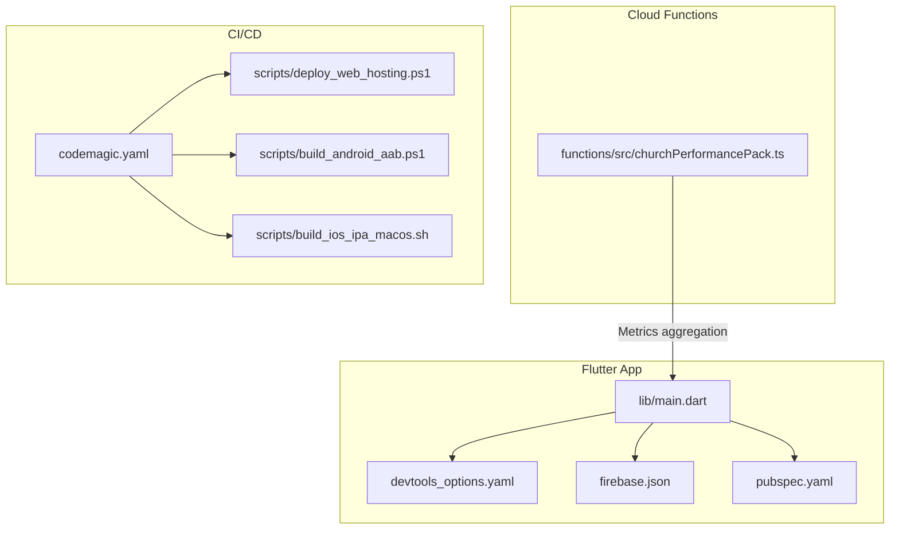
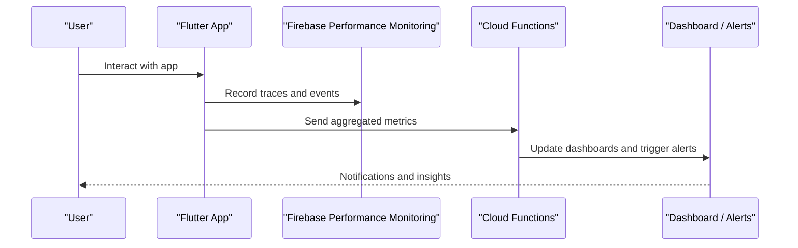
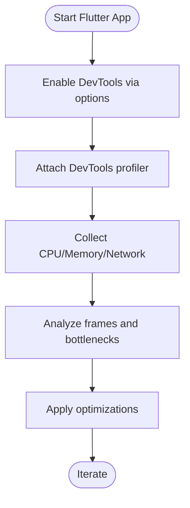
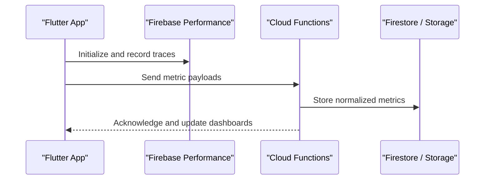
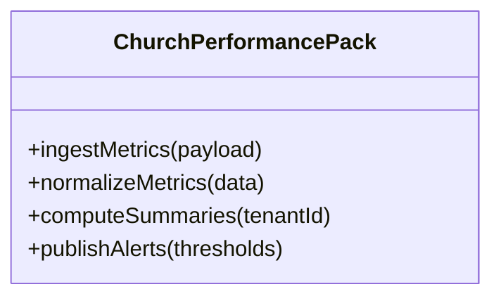
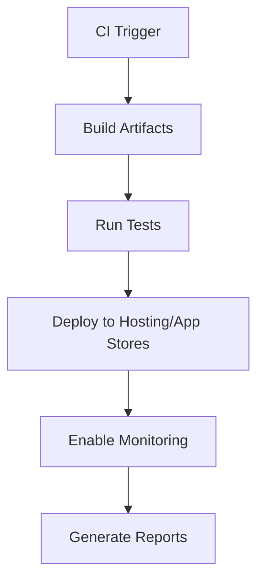
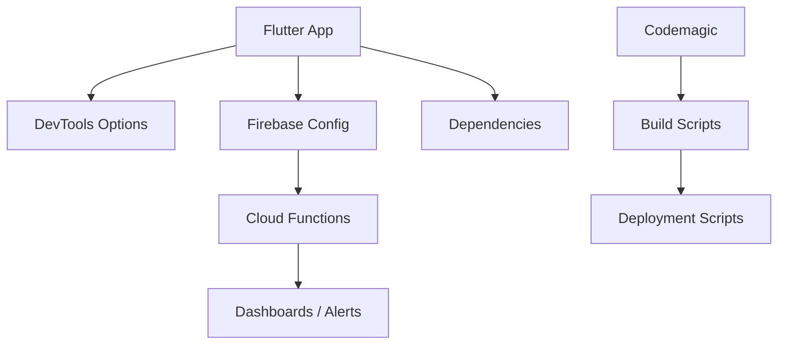

# Performance Monitoring & Profiling

<cite>
**Referenced Files in This Document**
- [README.md](file://README.md)
- [PERFORMANCE_REPORT.md](file://PERFORMANCE_REPORT.md)
- [FIREBASE_OBSERVABILITY.md](file://docs/FIREBASE_OBSERVABILITY.md)
- [ARCHITECTURE_PERFORMANCE_MULTI_PLATFORM.md](file://docs/ARCHITECTURE_PERFORMANCE_MULTI_PLATFORM.md)
- [ARCHITECTURE_PERFORMANCE_V4.md](file://docs/ARCHITECTURE_PERFORMANCE_V4.md)
- [PADRONIZACAO_PERFORMANCE_CONTROLE_TOTAL.md](file://docs/PADRONIZACAO_PERFORMANCE_CONTROLE_TOTAL.md)
- [instant-media-performance.md](file://docs/instant-media-performance.md)
- [devtools_options.yaml](file://flutter_app/devtools_options.yaml)
- [firebase.json](file://flutter_app/firebase.json)
- [pubspec.yaml](file://flutter_app/pubspec.yaml)
- [main.dart](file://flutter_app/lib/main.dart)
- [churchPerformancePack.ts](file://functions/src/churchPerformancePack.ts)
- [codemagic.yaml](file://codemagic.yaml)
- [deploy_web_hosting.ps1](file://scripts/deploy_web_hosting.ps1)
- [build_android_aab.ps1](file://scripts/build_android_aab.ps1)
- [build_ios_ipa_macos.sh](file://scripts/build_ios_ipa_macos.sh)
</cite>

## Table of Contents
1. Introduction
2. Project Structure
3. Core Components
4. Architecture Overview
5. Detailed Component Analysis
6. Dependency Analysis
7. Performance Considerations
8. Troubleshooting Guide
9. Conclusion
10. Appendices

## Introduction
This document provides a comprehensive guide to performance monitoring and profiling for Gestão Yahweh Premium across Flutter (Web, Android, iOS), Firebase Functions, and CI/CD pipelines. It covers metrics collection, custom analytics tracking, real-time dashboards, profiling tool usage (Flutter DevTools, Firebase Performance Monitoring, platform profilers), bottleneck identification techniques, automated and load testing strategies, continuous performance monitoring, production alerting, regression detection, and performance budgets.

## Project Structure
The project is a multi-platform Flutter application with:
- Flutter app under flutter_app/ containing configuration files for DevTools, Firebase, and dependencies.
- Cloud Functions under functions/ including a dedicated performance pack module.
- CI/CD via Codemagic and deployment scripts for Web, Android, and iOS.
- Documentation under docs/ detailing architecture and performance standards.

**Diagram sources**
- [main.dart](file://flutter_app/lib/main.dart)
- [devtools_options.yaml](file://flutter_app/devtools_options.yaml)
- [firebase.json](file://flutter_app/firebase.json)
- [pubspec.yaml](file://flutter_app/pubspec.yaml)
- [churchPerformancePack.ts](file://functions/src/churchPerformancePack.ts)
- [codemagic.yaml](file://codemagic.yaml)
- [deploy_web_hosting.ps1](file://scripts/deploy_web_hosting.ps1)
- [build_android_aab.ps1](file://scripts/build_android_aab.ps1)
- [build_ios_ipa_macos.sh](file://scripts/build_ios_ipa_macos.sh)

**Section sources**
- [README.md](file://README.md)
- [ARCHITECTURE_PERFORMANCE_MULTI_PLATFORM.md](file://docs/ARCHITECTURE_PERFORMANCE_MULTI_PLATFORM.md)
- [ARCHITECTURE_PERFORMANCE_V4.md](file://docs/ARCHITECTURE_PERFORMANCE_V4.md)
- [PADRONIZACAO_PERFORMANCE_CONTROLE_TOTAL.md](file://docs/PADRONIZACAO_PERFORMANCE_CONTROLE_TOTAL.md)

## Core Components
- Flutter DevTools integration for CPU, memory, network, and rendering insights.
- Firebase Performance Monitoring for app-level traces and HTTP/network metrics.
- Cloud Functions performance pack for server-side metrics aggregation and reporting.
- CI/CD pipeline hooks for performance-sensitive builds and deployments.

Key implementation anchors:
- DevTools options file configures profiling behavior and feature flags.
- Firebase configuration enables performance monitoring and data collection.
- Pubspec lists performance-related dependencies and plugins.
- Main entry initializes the app and can bootstrap performance instrumentation.
- Cloud Functions module aggregates tenant-specific performance metrics.

**Section sources**
- [devtools_options.yaml](file://flutter_app/devtools_options.yaml)
- [firebase.json](file://flutter_app/firebase.json)
- [pubspec.yaml](file://flutter_app/pubspec.yaml)
- [main.dart](file://flutter_app/lib/main.dart)
- [churchPerformancePack.ts](file://functions/src/churchPerformancePack.ts)

## Architecture Overview
The performance system spans client, server, and CI layers:
- Client-side: Flutter app collects UI, network, and custom metrics; DevTools supports interactive profiling.
- Server-side: Cloud Functions aggregate and normalize metrics for dashboards and alerts.
- CI/CD: Automated builds run tests and deploy artifacts with performance checks.

**Diagram sources**
- [main.dart](file://flutter_app/lib/main.dart)
- [firebase.json](file://flutter_app/firebase.json)
- [churchPerformancePack.ts](file://functions/src/churchPerformancePack.ts)

## Detailed Component Analysis

### Flutter DevTools Integration
- Purpose: Real-time CPU, memory, network, and rendering profiling during development and debugging.
- Configuration: devtools_options.yaml controls available tools and behaviors.
- Usage: Launch DevTools from IDE or command line; attach to running app instances on Web, Android, and iOS.

**Diagram sources**
- [devtools_options.yaml](file://flutter_app/devtools_options.yaml)
- [main.dart](file://flutter_app/lib/main.dart)

**Section sources**
- [devtools_options.yaml](file://flutter_app/devtools_options.yaml)
- [main.dart](file://flutter_app/lib/main.dart)

### Firebase Performance Monitoring
- Purpose: Track app startup, navigation, HTTP requests, and custom traces.
- Configuration: firebase.json sets up Firebase services and performance settings.
- Data flow: Client records traces and events; backend functions aggregate and report.

**Diagram sources**
- [firebase.json](file://flutter_app/firebase.json)
- [churchPerformancePack.ts](file://functions/src/churchPerformancePack.ts)

**Section sources**
- [firebase.json](file://flutter_app/firebase.json)
- [churchPerformancePack.ts](file://functions/src/churchPerformancePack.ts)

### Cloud Functions Performance Pack
- Purpose: Aggregate tenant-specific performance metrics, compute summaries, and support dashboards/alerts.
- Implementation: churchPerformancePack.ts handles ingestion, normalization, and reporting logic.

**Diagram sources**
- [churchPerformancePack.ts](file://functions/src/churchPerformancePack.ts)

**Section sources**
- [churchPerformancePack.ts](file://functions/src/churchPerformancePack.ts)

### CI/CD Performance Hooks
- Purpose: Ensure performance-sensitive builds and deployments are consistent and monitored.
- Scripts: codemagic.yaml orchestrates builds; deployment scripts handle Web, Android, and iOS artifacts.

**Diagram sources**
- [codemagic.yaml](file://codemagic.yaml)
- [deploy_web_hosting.ps1](file://scripts/deploy_web_hosting.ps1)
- [build_android_aab.ps1](file://scripts/build_android_aab.ps1)
- [build_ios_ipa_macos.sh](file://scripts/build_ios_ipa_macos.sh)

**Section sources**
- [codemagic.yaml](file://codemagic.yaml)
- [deploy_web_hosting.ps1](file://scripts/deploy_web_hosting.ps1)
- [build_android_aab.ps1](file://scripts/build_android_aab.ps1)
- [build_ios_ipa_macos.sh](file://scripts/build_ios_ipa_macos.sh)

### Conceptual Overview
- Metrics collection strategy: instrument critical paths, track user journeys, and capture resource usage.
- Custom analytics: define KPIs per tenant and feature; ensure privacy and compliance.
- Real-time dashboards: visualize latency, error rates, and resource consumption.

[No sources needed since this section doesn't analyze specific files]

## Dependency Analysis
Performance components depend on:
- Flutter framework and DevTools for client profiling.
- Firebase ecosystem for monitoring and storage.
- Cloud Functions for aggregation and reporting.
- CI/CD tools for automated builds and deployments.

**Diagram sources**
- [devtools_options.yaml](file://flutter_app/devtools_options.yaml)
- [firebase.json](file://flutter_app/firebase.json)
- [pubspec.yaml](file://flutter_app/pubspec.yaml)
- [churchPerformancePack.ts](file://functions/src/churchPerformancePack.ts)
- [codemagic.yaml](file://codemagic.yaml)
- [deploy_web_hosting.ps1](file://scripts/deploy_web_hosting.ps1)
- [build_android_aab.ps1](file://scripts/build_android_aab.ps1)
- [build_ios_ipa_macos.sh](file://scripts/build_ios_ipa_macos.sh)

**Section sources**
- [pubspec.yaml](file://flutter_app/pubspec.yaml)
- [firebase.json](file://flutter_app/firebase.json)
- [devtools_options.yaml](file://flutter_app/devtools_options.yaml)
- [churchPerformancePack.ts](file://functions/src/churchPerformancePack.ts)
- [codemagic.yaml](file://codemagic.yaml)

## Performance Considerations
- CPU-intensive operations: profile frame rendering, avoid heavy computations on the main thread, use isolates/background tasks where appropriate.
- Memory leaks: monitor heap growth, inspect object retention, and validate lifecycle management.
- Network latency: cache responses, optimize payloads, and implement retry/backoff strategies.
- Database queries: index frequently accessed fields, reduce read/write operations, and batch updates.
- Media performance: follow instant-media guidelines for efficient loading and playback.

[No sources needed since this section provides general guidance]

## Troubleshooting Guide
Common issues and resolutions:
- DevTools not attaching: verify DevTools options and ensure the app is built with debug symbols.
- Missing Firebase metrics: confirm initialization order and permissions in firebase.json.
- Function errors: check logs in Cloud Functions and validate payload schemas.
- CI failures: review build logs and ensure environment variables are set correctly.

**Section sources**
- [PERFORMANCE_REPORT.md](file://PERFORMANCE_REPORT.md)
- [FIREBASE_OBSERVABILITY.md](file://docs/FIREBASE_OBSERVABILITY.md)

## Conclusion
Gestão Yahweh Premium’s performance monitoring integrates Flutter DevTools, Firebase Performance Monitoring, and Cloud Functions to provide end-to-end visibility. By adopting structured metrics collection, automated testing, and continuous monitoring, teams can identify bottlenecks early, enforce performance budgets, and maintain stable, responsive experiences across platforms.

[No sources needed since this section summarizes without analyzing specific files]

## Appendices
- Interpreting metrics: focus on p95/p99 latencies, error rates, and resource utilization trends.
- Optimization opportunities: prioritize high-impact areas like media loading, database access, and UI rendering.
- Performance budgets: define thresholds per feature and enforce via CI checks.

[No sources needed since this section provides general guidance]