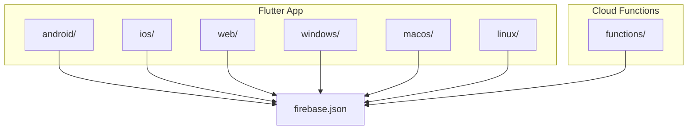
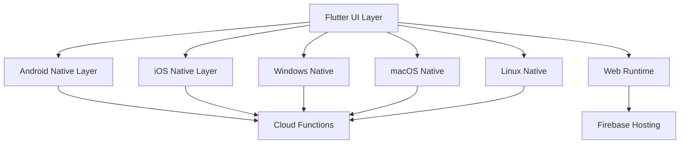
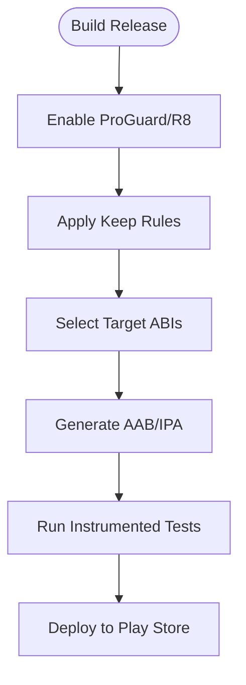
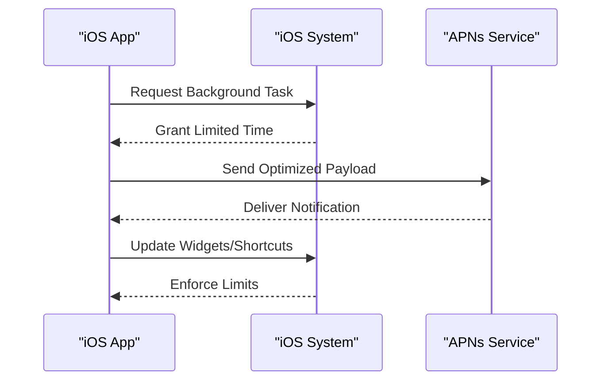
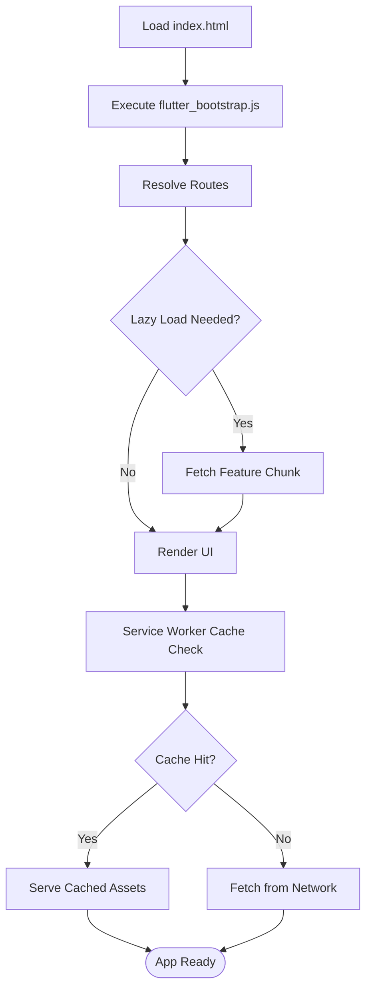
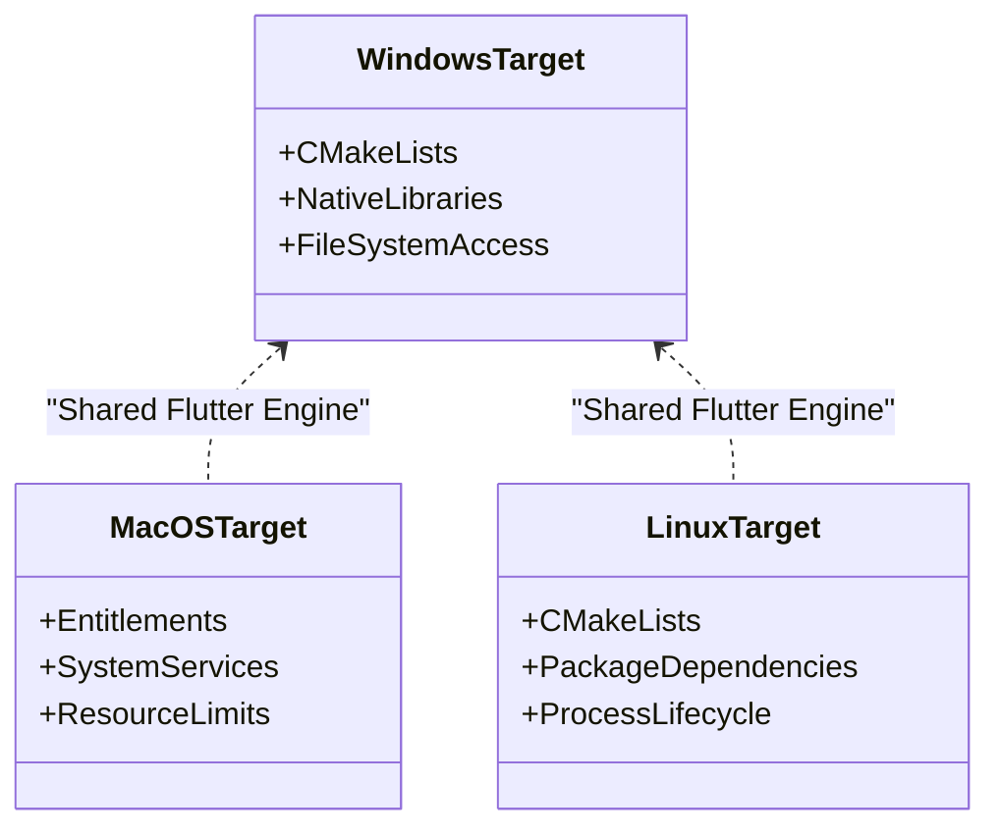
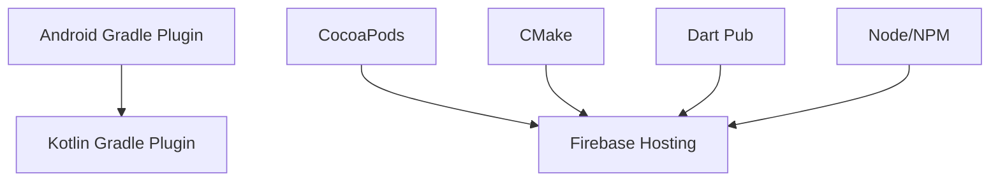

# Platform-Specific Optimizations

<cite>
**Referenced Files in This Document**
- [flutter_app/android/app/proguard-rules.pro](file://flutter_app/android/app/proguard-rules.pro)
- [flutter_app/android/app/src/main/AndroidManifest.xml](file://flutter_app/android/app/src/main/AndroidManifest.xml)
- [flutter_app/android/build.gradle.kts](file://flutter_app/android/build.gradle.kts)
- [flutter_app/android/app/build.gradle.kts](file://flutter_app/android/app/build.gradle.kts)
- [flutter_app/android/gradle.properties](file://flutter_app/android/gradle.properties)
- [flutter_app/lib/url_strategy_web.dart](file://flutter_app/lib/url_strategy_web.dart)
- [flutter_app/web/flutter_bootstrap.js](file://flutter_app/web/flutter_bootstrap.js)
- [flutter_app/web/index.html](file://flutter_app/web/index.html)
- [flutter_app/web/manifest.json](file://flutter_app/web/manifest.json)
- [flutter_app/web/firebase-messaging-sw.js](file://flutter_app/web/firebase-messaging-sw.js)
- [flutter_app/ios/Runner/Info.plist](file://flutter_app/ios/Runner/Info.plist)
- [flutter_app/ios/Podfile](file://flutter_app/ios/Podfile)
- [flutter_app/macos/Runner/Release.entitlements](file://flutter_app/macos/Runner/Release.entitlements)
- [flutter_app/linux/CMakeLists.txt](file://flutter_app/linux/CMakeLists.txt)
- [flutter_app/windows/CMakeLists.txt](file://flutter_app/windows/CMakeLists.txt)
- [functions/package.json](file://functions/package.json)
- [firebase.json](file://firebase.json)
- [scripts/deploy_web_hosting_skwasm.ps1](file://scripts/deploy_web_hosting_skwasm.ps1)
- [scripts/deploy_web_hosting_html_dom.ps1](file://scripts/deploy_web_hosting_html_dom.ps1)
- [scripts/deploy_web_hosting_html.ps1](file://scripts/deploy_web_hosting_html.ps1)
</cite>

## Table of Contents
1. [Introduction](#introduction)
2. [Project Structure](#project-structure)
3. [Core Components](#core-components)
4. [Architecture Overview](#architecture-overview)
5. [Detailed Component Analysis](#detailed-component-analysis)
6. [Dependency Analysis](#dependency-analysis)
7. [Performance Considerations](#performance-considerations)
8. [Troubleshooting Guide](#troubleshooting-guide)
9. [Conclusion](#conclusion)
10. [Appendices](#appendices)

## Introduction
This document provides comprehensive guidance for platform-specific performance optimizations in Gestão Yahweh Premium across Android, iOS, Web, and Desktop (Windows, macOS, Linux). It consolidates build-time and runtime strategies such as code shrinking and native library loading on Android, memory management and background execution constraints on iOS, bundle splitting and service worker usage on Web, and native integration patterns on Desktop. It also outlines profiling tools, debugging techniques, and monitoring approaches to ensure optimal user experience and efficient resource utilization.

## Project Structure
The project is a Flutter-based multi-platform application with:
- Android module under flutter_app/android with ProGuard rules and Gradle configuration
- iOS module under flutter_app/ios with Podfile and Info.plist settings
- Web module under flutter_app/web including bootstrap scripts and manifest
- Desktop modules under flutter_app/windows, flutter_app/macos, and flutter_app/linux with CMake configurations
- Cloud functions under functions with package.json and Firebase hosting configuration at the root

**Diagram sources**
- [flutter_app/android/build.gradle.kts](file://flutter_app/android/build.gradle.kts)
- [flutter_app/ios/Podfile](file://flutter_app/ios/Podfile)
- [flutter_app/web/index.html](file://flutter_app/web/index.html)
- [flutter_app/windows/CMakeLists.txt](file://flutter_app/windows/CMakeLists.txt)
- [flutter_app/macos/Runner/Release.entitlements](file://flutter_app/macos/Runner/Release.entitlements)
- [flutter_app/linux/CMakeLists.txt](file://flutter_app/linux/CMakeLists.txt)
- [functions/package.json](file://functions/package.json)
- [firebase.json](file://firebase.json)

**Section sources**
- [flutter_app/android/build.gradle.kts](file://flutter_app/android/build.gradle.kts)
- [flutter_app/ios/Podfile](file://flutter_app/ios/Podfile)
- [flutter_app/web/index.html](file://flutter_app/web/index.html)
- [flutter_app/windows/CMakeLists.txt](file://flutter_app/windows/CMakeLists.txt)
- [flutter_app/macos/Runner/Release.entitlements](file://flutter_app/macos/Runner/Release.entitlements)
- [flutter_app/linux/CMakeLists.txt](file://flutter_app/linux/CMakeLists.txt)
- [functions/package.json](file://functions/package.json)
- [firebase.json](file://firebase.json)

## Core Components
Key components that influence performance across platforms include:
- Android build pipeline and code shrinking via ProGuard
- iOS dependency management and entitlements
- Web bootstrapping, service workers, and hosting configuration
- Desktop CMake targets and native integrations
- Cloud functions packaging and Firebase hosting integration

**Section sources**
- [flutter_app/android/app/proguard-rules.pro](file://flutter_app/android/app/proguard-rules.pro)
- [flutter_app/android/app/build.gradle.kts](file://flutter_app/android/app/build.gradle.kts)
- [flutter_app/ios/Podfile](file://flutter_app/ios/Podfile)
- [flutter_app/web/flutter_bootstrap.js](file://flutter_app/web/flutter_bootstrap.js)
- [flutter_app/web/firebase-messaging-sw.js](file://flutter_app/web/firebase-messaging-sw.js)
- [flutter_app/windows/CMakeLists.txt](file://flutter_app/windows/CMakeLists.txt)
- [flutter_app/macos/Runner/Release.entitlements](file://flutter_app/macos/Runner/Release.entitlements)
- [flutter_app/linux/CMakeLists.txt](file://flutter_app/linux/CMakeLists.txt)
- [functions/package.json](file://functions/package.json)
- [firebase.json](file://firebase.json)

## Architecture Overview
The application uses a layered architecture where Flutter UI interacts with platform-specific engines and services. Performance-critical paths are optimized per platform through build-time configurations and runtime behaviors.

[No sources needed since this diagram shows conceptual workflow, not actual code structure]

## Detailed Component Analysis

### Android Optimizations
Focus areas:
- ProGuard configuration for code shrinking and obfuscation
- Native library loading and ABI targeting
- Background task scheduling and battery optimization
- Build-time optimizations via Gradle properties

Key files:
- ProGuard rules: [proguard-rules.pro](file://flutter_app/android/app/proguard-rules.pro)
- Android manifest: [AndroidManifest.xml](file://flutter_app/android/app/src/main/AndroidManifest.xml)
- App build script: [app/build.gradle.kts](file://flutter_app/android/app/build.gradle.kts)
- Project build script: [build.gradle.kts](file://flutter_app/android/build.gradle.kts)
- Gradle properties: [gradle.properties](file://flutter_app/android/gradle.properties)

Optimization strategies:
- Enable minification and resource shrinking in release builds
- Configure keep rules to preserve critical classes and annotations
- Target specific ABIs to reduce APK size
- Use WorkManager or foreground services judiciously to respect Doze and app standby
- Avoid heavy initialization on startup; defer non-critical tasks

**Diagram sources**
- [flutter_app/android/app/proguard-rules.pro](file://flutter_app/android/app/proguard-rules.pro)
- [flutter_app/android/app/build.gradle.kts](file://flutter_app/android/app/build.gradle.kts)
- [flutter_app/android/build.gradle.kts](file://flutter_app/android/build.gradle.kts)
- [flutter_app/android/gradle.properties](file://flutter_app/android/gradle.properties)

**Section sources**
- [flutter_app/android/app/proguard-rules.pro](file://flutter_app/android/app/proguard-rules.pro)
- [flutter_app/android/app/src/main/AndroidManifest.xml](file://flutter_app/android/app/src/main/AndroidManifest.xml)
- [flutter_app/android/app/build.gradle.kts](file://flutter_app/android/app/build.gradle.kts)
- [flutter_app/android/build.gradle.kts](file://flutter_app/android/build.gradle.kts)
- [flutter_app/android/gradle.properties](file://flutter_app/android/gradle.properties)

### iOS Optimizations
Focus areas:
- Memory management and ARC behavior
- Background execution limits and App Extensions
- Push notification optimization and APNs configuration
- App Store performance requirements and review guidelines

Key files:
- Podfile: [Podfile](file://flutter_app/ios/Podfile)
- Runner Info.plist: [Info.plist](file://flutter_app/ios/Runner/Info.plist)

Optimization strategies:
- Use weak references and avoid retain cycles
- Offload heavy computations to background queues
- Limit background task duration and use appropriate background modes
- Optimize push payloads and batch updates
- Ensure compliance with App Store performance criteria (cold start, memory footprint, frame drops)

**Diagram sources**
- [flutter_app/ios/Podfile](file://flutter_app/ios/Podfile)
- [flutter_app/ios/Runner/Info.plist](file://flutter_app/ios/Runner/Info.plist)

**Section sources**
- [flutter_app/ios/Podfile](file://flutter_app/ios/Podfile)
- [flutter_app/ios/Runner/Info.plist](file://flutter_app/ios/Runner/Info.plist)

### Web Optimizations
Focus areas:
- Bundle splitting and lazy loading
- Service worker implementation for caching and offline support
- Browser compatibility considerations and rendering backends

Key files:
- Bootstrap script: [flutter_bootstrap.js](file://flutter_app/web/flutter_bootstrap.js)
- Entry HTML: [index.html](file://flutter_app/web/index.html)
- Manifest: [manifest.json](file://flutter_app/web/manifest.json)
- Service worker: [firebase-messaging-sw.js](file://flutter_app/web/firebase-messaging-sw.js)
- URL strategy: [url_strategy_web.dart](file://flutter_app/lib/url_strategy_web.dart)

Optimization strategies:
- Split bundles by feature routes and load on demand
- Implement service workers to cache static assets and API responses
- Choose appropriate rendering backend (CanvasKit vs DOM) based on target devices
- Defer non-critical JavaScript and images
- Monitor bundle sizes and tree-shake unused code

**Diagram sources**
- [flutter_app/web/index.html](file://flutter_app/web/index.html)
- [flutter_app/web/flutter_bootstrap.js](file://flutter_app/web/flutter_bootstrap.js)
- [flutter_app/web/firebase-messaging-sw.js](file://flutter_app/web/firebase-messaging-sw.js)
- [flutter_app/lib/url_strategy_web.dart](file://flutter_app/lib/url_strategy_web.dart)

**Section sources**
- [flutter_app/web/flutter_bootstrap.js](file://flutter_app/web/flutter_bootstrap.js)
- [flutter_app/web/index.html](file://flutter_app/web/index.html)
- [flutter_app/web/manifest.json](file://flutter_app/web/manifest.json)
- [flutter_app/web/firebase-messaging-sw.js](file://flutter_app/web/firebase-messaging-sw.js)
- [flutter_app/lib/url_strategy_web.dart](file://flutter_app/lib/url_strategy_web.dart)

### Desktop Optimizations (Windows, macOS, Linux)
Focus areas:
- Native code integration and CMake targets
- File system access and permissions
- System resource management and process lifecycle

Key files:
- Windows CMake: [CMakeLists.txt](file://flutter_app/windows/CMakeLists.txt)
- macOS Entitlements: [Release.entitlements](file://flutter_app/macos/Runner/Release.entitlements)
- Linux CMake: [CMakeLists.txt](file://flutter_app/linux/CMakeLists.txt)

Optimization strategies:
- Link only necessary native libraries to reduce binary size
- Use asynchronous I/O for file operations to avoid blocking the UI thread
- Respect OS-specific resource limits and power management policies
- Profile CPU and memory usage using platform-native tools

**Diagram sources**
- [flutter_app/windows/CMakeLists.txt](file://flutter_app/windows/CMakeLists.txt)
- [flutter_app/macos/Runner/Release.entitlements](file://flutter_app/macos/Runner/Release.entitlements)
- [flutter_app/linux/CMakeLists.txt](file://flutter_app/linux/CMakeLists.txt)

**Section sources**
- [flutter_app/windows/CMakeLists.txt](file://flutter_app/windows/CMakeLists.txt)
- [flutter_app/macos/Runner/Release.entitlements](file://flutter_app/macos/Runner/Release.entitlements)
- [flutter_app/linux/CMakeLists.txt](file://flutter_app/linux/CMakeLists.txt)

## Dependency Analysis
Platform dependencies are managed through Gradle (Android), CocoaPods (iOS), and CMake (Desktop). Cloud functions are packaged separately and integrated via Firebase hosting.

**Diagram sources**
- [flutter_app/android/build.gradle.kts](file://flutter_app/android/build.gradle.kts)
- [flutter_app/ios/Podfile](file://flutter_app/ios/Podfile)
- [flutter_app/windows/CMakeLists.txt](file://flutter_app/windows/CMakeLists.txt)
- [flutter_app/macos/Runner/Release.entitlements](file://flutter_app/macos/Runner/Release.entitlements)
- [flutter_app/linux/CMakeLists.txt](file://flutter_app/linux/CMakeLists.txt)
- [functions/package.json](file://functions/package.json)
- [firebase.json](file://firebase.json)

**Section sources**
- [flutter_app/android/build.gradle.kts](file://flutter_app/android/build.gradle.kts)
- [flutter_app/ios/Podfile](file://flutter_app/ios/Podfile)
- [flutter_app/windows/CMakeLists.txt](file://flutter_app/windows/CMakeLists.txt)
- [flutter_app/macos/Runner/Release.entitlements](file://flutter_app/macos/Runner/Release.entitlements)
- [flutter_app/linux/CMakeLists.txt](file://flutter_app/linux/CMakeLists.txt)
- [functions/package.json](file://functions/package.json)
- [firebase.json](file://firebase.json)

## Performance Considerations
General recommendations:
- Profile early and often using platform-specific tools (Android Studio Profiler, Xcode Instruments, Chrome DevTools, Visual Studio Profiler)
- Monitor memory leaks and CPU hotspots during development and production
- Optimize network requests with caching, pagination, and compression
- Reduce initial load time by deferring non-critical features
- Validate performance against platform store requirements before release

[No sources needed since this section provides general guidance]

## Troubleshooting Guide
Common issues and resolutions:
- Android: ProGuard obfuscation errors due to missing keep rules; add explicit keep directives for reflection-heavy libraries
- iOS: Background task termination; ensure proper background mode declarations and minimize work in background contexts
- Web: Service worker conflicts; clear caches and verify fetch handlers
- Desktop: Missing native dependencies; validate CMake targets and package managers

Debugging techniques:
- Use logging and telemetry to capture runtime metrics
- Reproduce issues on emulators/simulators with realistic device profiles
- Analyze crash reports and stack traces to identify bottlenecks

[No sources needed since this section provides general guidance]

## Conclusion
By applying platform-specific optimizations across Android, iOS, Web, and Desktop, Gestão Yahweh Premium can achieve improved performance, reduced resource consumption, and enhanced user experience. Continuous profiling, testing, and adherence to platform guidelines are essential for maintaining high-quality releases.

[No sources needed since this section summarizes without analyzing specific files]

## Appendices
Additional resources:
- Firebase hosting configuration: [firebase.json](file://firebase.json)
- Web deployment scripts: [deploy_web_hosting_skwasm.ps1](file://scripts/deploy_web_hosting_skwasm.ps1), [deploy_web_hosting_html_dom.ps1](file://scripts/deploy_web_hosting_html_dom.ps1), [deploy_web_hosting_html.ps1](file://scripts/deploy_web_hosting_html.ps1)
- Cloud functions package: [package.json](file://functions/package.json)

**Section sources**
- [firebase.json](file://firebase.json)
- [scripts/deploy_web_hosting_skwasm.ps1](file://scripts/deploy_web_hosting_skwasm.ps1)
- [scripts/deploy_web_hosting_html_dom.ps1](file://scripts/deploy_web_hosting_html_dom.ps1)
- [scripts/deploy_web_hosting_html.ps1](file://scripts/deploy_web_hosting_html.ps1)
- [functions/package.json](file://functions/package.json)