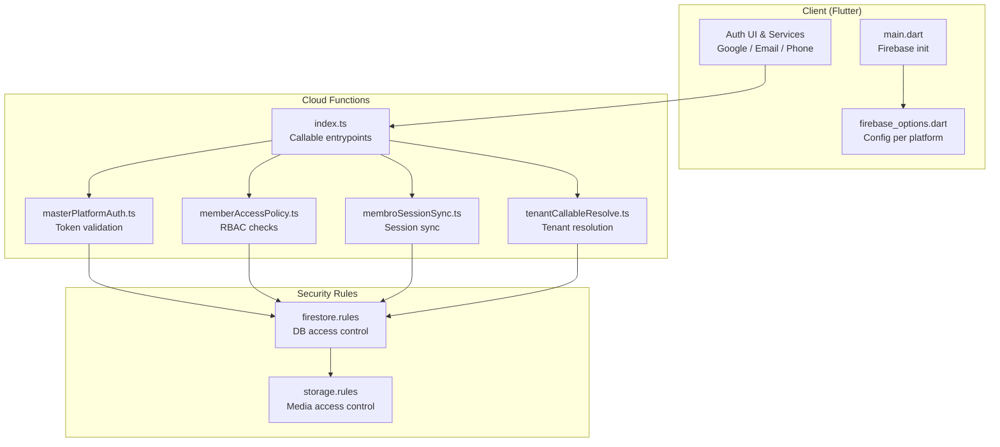
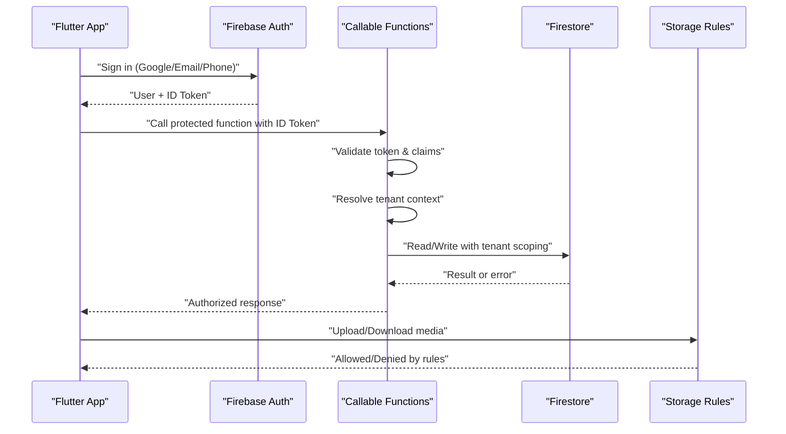
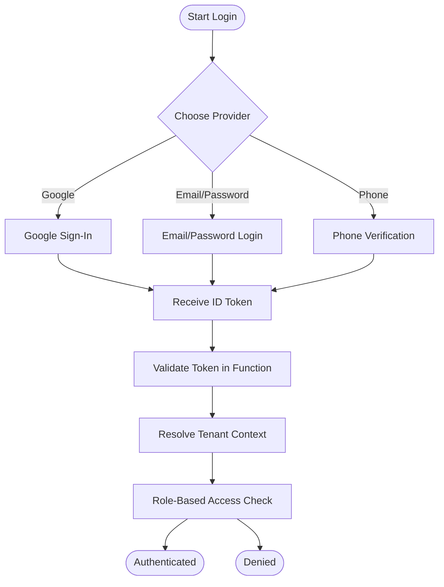
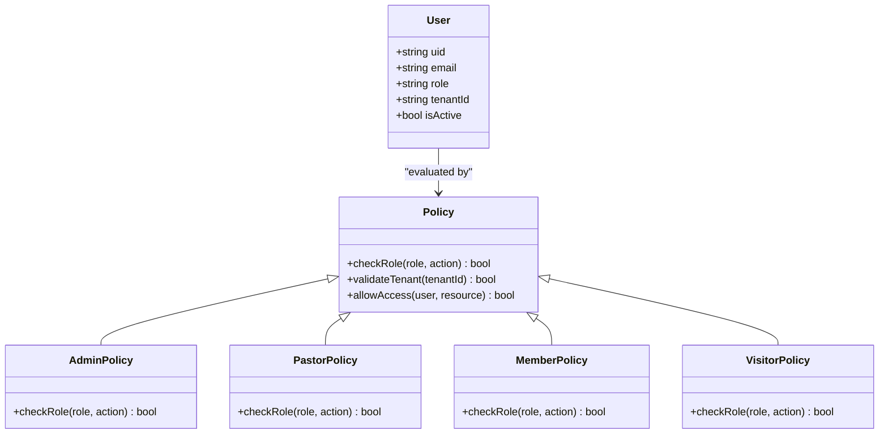
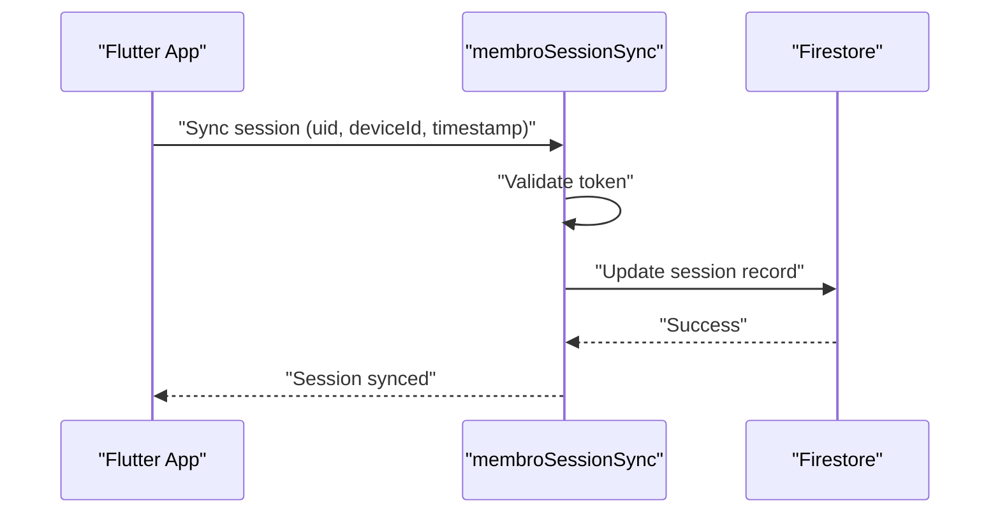
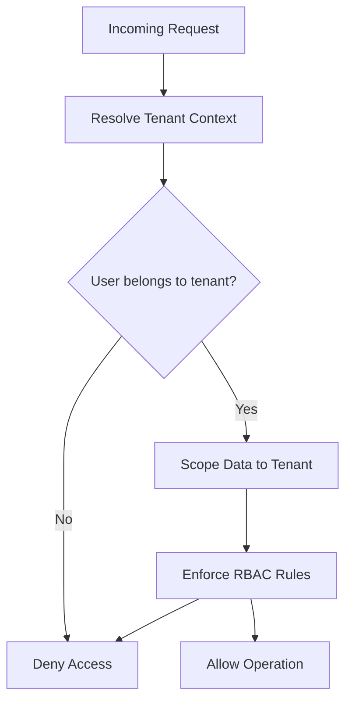
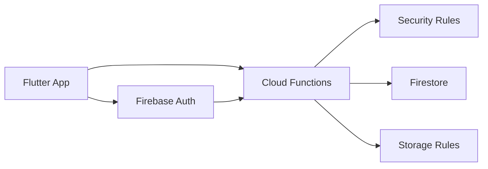

# Authentication & Authorization

<cite>
**Referenced Files in This Document**
- [firestore.rules](file://firestore.rules)
- [storage.rules](file://storage.rules)
- [functions/index.ts](file://functions/src/index.ts)
- [functions/masterPlatformAuth.ts](file://functions/src/masterPlatformAuth.ts)
- [functions/memberAccessPolicy.ts](file://functions/src/memberAccessPolicy.ts)
- [functions/membroSessionSync.ts](file://functions/src/membroSessionSync.ts)
- [functions/tenantCallableResolve.ts](file://functions/src/tenantCallableResolve.ts)
- [flutter_app/lib/main.dart](file://flutter_app/lib/main.dart)
- [flutter_app/lib/firebase_options.dart](file://flutter_app/lib/firebase_options.dart)
- [android/google-services.json](file://flutter_app/android/google-services.json)
- [ios/Runner/GoogleService-Info.plist](file://flutter_app/ios/Runner/GoogleService-Info.plist)
</cite>

## Table of Contents
1. [Introduction](#introduction)
2. [Project Structure](#project-structure)
3. [Core Components](#core-components)
4. [Architecture Overview](#architecture-overview)
5. [Detailed Component Analysis](#detailed-component-analysis)
6. [Dependency Analysis](#dependency-analysis)
7. [Performance Considerations](#performance-considerations)
8. [Troubleshooting Guide](#troubleshooting-guide)
9. [Conclusion](#conclusion)

## Introduction
This document explains the authentication and authorization system in Gestão Yahweh Premium. It covers multi-provider authentication (Google, Email/Password, Phone), role-based access control (RBAC) for admin, pastor, member, and visitor roles, session management, token handling, secure storage patterns, tenant isolation, and cross-tenant security boundaries. It also provides concrete examples of authentication flows, permission checks, and role validation, along with troubleshooting guidance and security best practices.

## Project Structure
The authentication and authorization implementation spans three layers:
- Client layer (Flutter app): initializes Firebase, configures providers, manages sessions, and enforces UI-level permissions.
- Serverless functions layer: validates tokens, resolves tenants, enforces policies, and synchronizes sessions.
- Security rules layer: Firestore and Storage rules enforce data access based on authenticated user identity, roles, and tenant context.

**Diagram sources**
- [flutter_app/lib/main.dart](file://flutter_app/lib/main.dart)
- [flutter_app/lib/firebase_options.dart](file://flutter_app/lib/firebase_options.dart)
- [functions/src/index.ts](file://functions/src/index.ts)
- [functions/src/masterPlatformAuth.ts](file://functions/src/masterPlatformAuth.ts)
- [functions/src/memberAccessPolicy.ts](file://functions/src/memberAccessPolicy.ts)
- [functions/src/membroSessionSync.ts](file://functions/src/membroSessionSync.ts)
- [functions/src/tenantCallableResolve.ts](file://functions/src/tenantCallableResolve.ts)
- [firestore.rules](file://firestore.rules)
- [storage.rules](file://storage.rules)

**Section sources**
- [flutter_app/lib/main.dart](file://flutter_app/lib/main.dart)
- [flutter_app/lib/firebase_options.dart](file://flutter_app/lib/firebase_options.dart)
- [functions/src/index.ts](file://functions/src/index.ts)
- [firestore.rules](file://firestore.rules)
- [storage.rules](file://storage.rules)

## Core Components
- Multi-provider authentication: Google Sign-In, Email/Password, Phone verification via Firebase Auth.
- Role-based access control: Roles include admin, pastor, member, visitor; enforced by functions and security rules.
- Session management: Cloud Function to synchronize client-side session state with server-side records.
- Token handling: ID token validation and claims inspection in callable functions.
- Tenant isolation: Tenant resolution and enforcement at function and rule levels to prevent cross-tenant access.
- Secure storage: Storage rules restrict media access based on auth state and tenant membership.

Key responsibilities:
- Client initializes Firebase and provider-specific configurations.
- Callable functions validate tokens, resolve tenant, and enforce RBAC.
- Security rules enforce read/write permissions based on user identity, roles, and tenant context.

**Section sources**
- [functions/src/masterPlatformAuth.ts](file://functions/src/masterPlatformAuth.ts)
- [functions/src/memberAccessPolicy.ts](file://functions/src/memberAccessPolicy.ts)
- [functions/src/membroSessionSync.ts](file://functions/src/membroSessionSync.ts)
- [functions/src/tenantCallableResolve.ts](file://functions/src/tenantCallableResolve.ts)
- [firestore.rules](file://firestore.rules)
- [storage.rules](file://storage.rules)

## Architecture Overview
Authentication and authorization flow across layers:

**Diagram sources**
- [flutter_app/lib/main.dart](file://flutter_app/lib/main.dart)
- [functions/src/index.ts](file://functions/src/index.ts)
- [functions/src/masterPlatformAuth.ts](file://functions/src/masterPlatformAuth.ts)
- [functions/src/tenantCallableResolve.ts](file://functions/src/tenantCallableResolve.ts)
- [firestore.rules](file://firestore.rules)
- [storage.rules](file://storage.rules)

## Detailed Component Analysis

### Multi-Provider Authentication
- Google Sign-In: Uses platform-specific credentials (Android google-services.json, iOS GoogleService-Info.plist). The Flutter app initializes Firebase and triggers sign-in flows.
- Email/Password: Standard email/password login through Firebase Auth.
- Phone: Phone number verification via Firebase Auth.

Client responsibilities:
- Initialize Firebase with platform options.
- Configure providers and handle sign-in callbacks.
- Maintain session state and refresh tokens when needed.

Server responsibilities:
- Validate ID tokens in callable functions.
- Enforce tenant context and role checks before processing requests.

**Diagram sources**
- [flutter_app/lib/main.dart](file://flutter_app/lib/main.dart)
- [flutter_app/lib/firebase_options.dart](file://flutter_app/lib/firebase_options.dart)
- [android/google-services.json](file://flutter_app/android/google-services.json)
- [ios/Runner/GoogleService-Info.plist](file://flutter_app/ios/Runner/GoogleService-Info.plist)
- [functions/src/masterPlatformAuth.ts](file://functions/src/masterPlatformAuth.ts)
- [functions/src/tenantCallableResolve.ts](file://functions/src/tenantCallableResolve.ts)

**Section sources**
- [flutter_app/lib/main.dart](file://flutter_app/lib/main.dart)
- [flutter_app/lib/firebase_options.dart](file://flutter_app/lib/firebase_options.dart)
- [android/google-services.json](file://flutter_app/android/google-services.json)
- [ios/Runner/GoogleService-Info.plist](file://flutter_app/ios/Runner/GoogleService-Info.plist)
- [functions/src/masterPlatformAuth.ts](file://functions/src/masterPlatformAuth.ts)

### Role-Based Access Control (RBAC)
Roles:
- Admin: Full access to administrative features and tenant configuration.
- Pastor: Access to pastoral tools and member management within tenant.
- Member: Limited access to personal and shared resources within tenant.
- Visitor: Read-only or restricted access to public resources.

Implementation:
- Role stored in user profile or membership record.
- Callable functions check roles before allowing operations.
- Security rules enforce additional constraints based on roles and tenant membership.

**Diagram sources**
- [functions/src/memberAccessPolicy.ts](file://functions/src/memberAccessPolicy.ts)
- [firestore.rules](file://firestore.rules)

**Section sources**
- [functions/src/memberAccessPolicy.ts](file://functions/src/memberAccessPolicy.ts)
- [firestore.rules](file://firestore.rules)

### Session Management and Token Handling
- Session synchronization: Cloud Function updates session records to reflect current user activity and device information.
- Token validation: Callable functions validate ID tokens and extract claims for authorization decisions.
- Secure storage: Storage rules ensure only authenticated users with proper roles can access media files.

**Diagram sources**
- [functions/src/membroSessionSync.ts](file://functions/src/membroSessionSync.ts)
- [firestore.rules](file://firestore.rules)

**Section sources**
- [functions/src/membroSessionSync.ts](file://functions/src/membroSessionSync.ts)
- [firestore.rules](file://firestore.rules)

### Tenant Isolation and Cross-Tenant Security
- Tenant resolution: Callable functions determine the tenant context from request parameters or user membership.
- Data scoping: All database operations are scoped to the resolved tenant to prevent cross-tenant access.
- Rule enforcement: Firestore and Storage rules verify tenant membership and role permissions.

**Diagram sources**
- [functions/src/tenantCallableResolve.ts](file://functions/src/tenantCallableResolve.ts)
- [firestore.rules](file://firestore.rules)
- [storage.rules](file://storage.rules)

**Section sources**
- [functions/src/tenantCallableResolve.ts](file://functions/src/tenantCallableResolve.ts)
- [firestore.rules](file://firestore.rules)
- [storage.rules](file://storage.rules)

## Dependency Analysis
The authentication and authorization system has clear dependencies between layers:

**Diagram sources**
- [flutter_app/lib/main.dart](file://flutter_app/lib/main.dart)
- [functions/src/index.ts](file://functions/src/index.ts)
- [firestore.rules](file://firestore.rules)
- [storage.rules](file://storage.rules)

**Section sources**
- [flutter_app/lib/main.dart](file://flutter_app/lib/main.dart)
- [functions/src/index.ts](file://functions/src/index.ts)
- [firestore.rules](file://firestore.rules)
- [storage.rules](file://storage.rules)

## Performance Considerations
- Minimize token validation overhead by caching validated claims where appropriate.
- Use efficient Firestore queries with proper indexes to reduce latency.
- Implement pagination for large datasets to avoid loading entire collections.
- Leverage Storage rules to offload access control checks to the edge.
- Avoid unnecessary session sync calls; batch updates when possible.

[No sources needed since this section provides general guidance]

## Troubleshooting Guide
Common issues and resolutions:
- Token expiration: Ensure clients refresh ID tokens periodically and handle expired token errors gracefully.
- Invalid tenant context: Verify tenant resolution logic and user membership records.
- Permission denied: Check role assignments and security rule conditions.
- Storage access failures: Confirm Storage rules allow access for authenticated users with appropriate roles.

Debugging steps:
- Log token validation results in callable functions.
- Inspect Firestore security rules during development using the simulator.
- Test Storage rules with different user scenarios.
- Verify tenant isolation by attempting cross-tenant operations.

**Section sources**
- [functions/src/masterPlatformAuth.ts](file://functions/src/masterPlatformAuth.ts)
- [functions/src/memberAccessPolicy.ts](file://functions/src/memberAccessPolicy.ts)
- [firestore.rules](file://firestore.rules)
- [storage.rules](file://storage.rules)

## Conclusion
The authentication and authorization system in Gestão Yahweh Premium provides a robust, multi-layered approach to security. By combining Firebase Auth for multi-provider sign-in, Cloud Functions for token validation and policy enforcement, and Security Rules for data access control, the system ensures secure, tenant-isolated operations. Proper session management, role-based access control, and secure storage patterns contribute to a reliable and scalable authentication framework.

[No sources needed since this section summarizes without analyzing specific files]