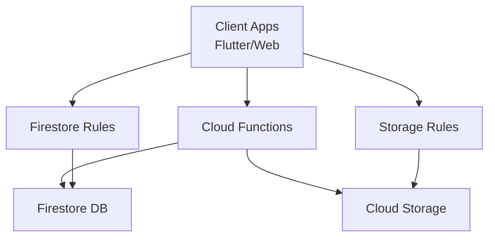
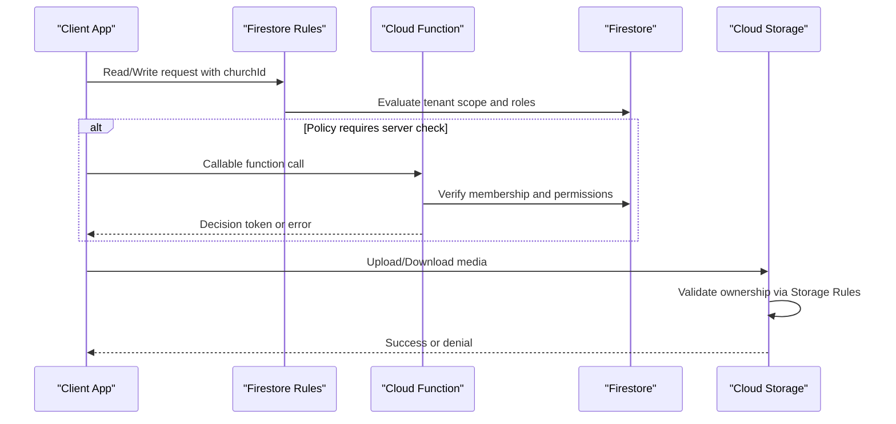
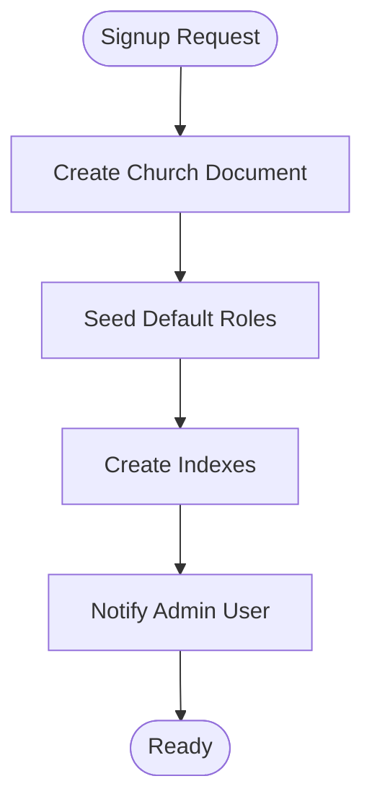
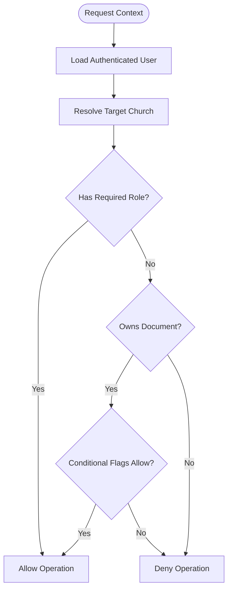
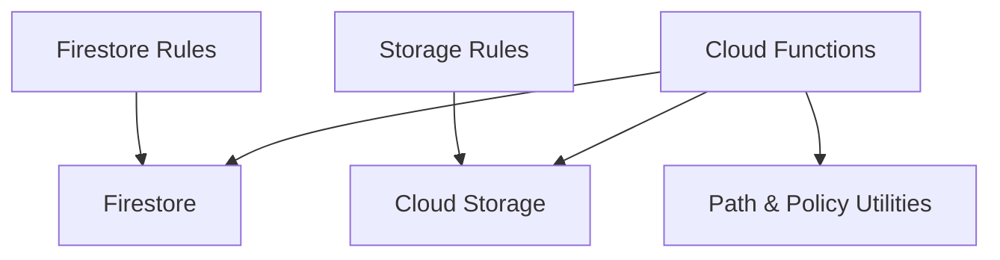

# Data Access Control

<cite>
**Referenced Files in This Document**
- [firestore.rules](file://firestore.rules)
- [storage.rules](file://storage.rules)
- [functions/index.ts](file://functions/src/index.ts)
- [functions/churchTenantProvisioning.ts](file://functions/src/churchTenantProvisioning.ts)
- [functions/memberAccessPolicy.ts](file://functions/src/memberAccessPolicy.ts)
- [functions/tenantCallableResolve.ts](file://functions/src/tenantCallableResolve.ts)
- [functions/churchFirestorePaths.ts](file://functions/src/churchFirestorePaths.ts)
- [functions/masterPlatformAuth.ts](file://functions/src/masterPlatformAuth.ts)
- [functions/migrateTenantFirestoreCollections.ts](file://functions/src/migrateTenantFirestoreCollections.ts)
- [scripts/deploy_firebase_rules.ps1](file://scripts/deploy_firebase_rules.ps1)
- [scripts/firebase_rules_gcp_publish.cjs](file://scripts/firebase_rules_gcp_publish.cjs)
- [security_rules_test_firestore/test/firestore.rules.test.js](file://security_rules_test_firestore/test/firestore.rules.test.js)
</cite>

## Table of Contents
1. [Introduction](#introduction)
2. [Project Structure](#project-structure)
3. [Core Components](#core-components)
4. [Architecture Overview](#architecture-overview)
5. [Detailed Component Analysis](#detailed-component-analysis)
6. [Dependency Analysis](#dependency-analysis)
7. [Performance Considerations](#performance-considerations)
8. [Troubleshooting Guide](#troubleshooting-guide)
9. [Conclusion](#conclusion)
10. [Appendices](#appendices)

## Introduction
This document explains the data access control mechanisms in Gestão Yahweh Premium, focusing on Firestore Security Rules and Cloud Functions that enforce tenant isolation, role-based permissions, field-level access, and conditional checks. It provides guidance for implementing secure multi-tenant behavior where each church’s data is isolated at the database level, while allowing controlled sharing and hierarchical access patterns. It also covers query optimization for security rules, performance considerations, debugging techniques, and complex permission scenarios such as shared documents and dynamic evaluation.

## Project Structure
The security surface spans three primary layers:
- Firestore Security Rules: Enforce read/write permissions at the database boundary with tenant scoping and role checks.
- Storage Rules: Secure media assets per tenant and validate ownership before serving or writing files.
- Cloud Functions: Implement server-side policies, provisioning, and cross-document operations that cannot be expressed purely in rules.

[No sources needed since this diagram shows conceptual workflow, not actual code structure]

## Core Components
- Firestore Security Rules: Centralized rules define tenant-scoped paths, role-based access, and field-level restrictions. They ensure only authenticated users within a specific church can access its data and that sensitive fields are protected.
- Storage Rules: Validate file ownership and tenant boundaries for media uploads and downloads.
- Cloud Functions: Provide additional enforcement for complex policies, background tasks, and administrative operations. Examples include tenant provisioning, member access policy resolution, and platform authentication.

Key responsibilities:
- Tenant isolation: All reads/writes must include the tenant identifier (church ID).
- Role-based access: Differentiate between admin, pastor, secretary, and member roles.
- Field-level access: Restrict write access to sensitive fields based on user roles.
- Conditional access: Allow shared documents when explicit conditions are met.
- Query safety: Ensure queries are indexed and scoped to prevent rule bypasses.

**Section sources**
- [firestore.rules](file://firestore.rules)
- [storage.rules](file://storage.rules)
- [functions/index.ts](file://functions/src/index.ts)

## Architecture Overview
The system enforces multi-tenancy by embedding the church identifier into every document path and validating it against the authenticated user’s membership. Cloud Functions handle provisioning and policy resolution, while Firestore and Storage Rules act as the final gatekeepers.

**Diagram sources**
- [firestore.rules](file://firestore.rules)
- [storage.rules](file://storage.rules)
- [functions/tenantCallableResolve.ts](file://functions/src/tenantCallableResolve.ts)

## Detailed Component Analysis

### Firestore Security Rules
- Tenant isolation: Every collection path includes the church identifier. Reads and writes require matching the authenticated user’s church context.
- Role-based permissions: Admins have full access; pastors and secretaries have restricted write privileges; members typically have read-only or limited write access.
- Field-level access: Sensitive fields (e.g., financial amounts, personal identifiers) are writable only by authorized roles.
- Conditional access: Shared documents allow cross-church visibility when explicitly marked and approved by owners.

Best practices:
- Use match blocks scoped to church IDs to avoid wildcard leaks.
- Validate request.auth.uid exists and belongs to the requested church.
- Deny by default; explicitly allow permitted operations.

**Section sources**
- [firestore.rules](file://firestore.rules)

### Storage Rules
- Ownership validation: Files are stored under church-specific directories. Uploads require proof of ownership via token or metadata checks.
- Download controls: Public assets may be served without auth; private assets require verified membership.
- Cleanup policies: Orphaned files are removed by scheduled functions triggered by deletions.

**Section sources**
- [storage.rules](file://storage.rules)

### Cloud Functions for Security Policies
- Tenant provisioning: Creates initial church data structures, indexes, and default roles upon signup.
- Member access policy: Resolves effective permissions for a user across multiple collections and documents.
- Platform authentication: Validates master platform tokens for administrative actions outside tenant boundaries.
- Path utilities: Provides canonical church paths to ensure consistency across clients and functions.

Examples:
- A callable function verifies if a user can edit a specific document by checking role, ownership, and flags.
- Background jobs synchronize counters and audit logs after mutations.

**Section sources**
- [functions/churchTenantProvisioning.ts](file://functions/src/churchTenantProvisioning.ts)
- [functions/memberAccessPolicy.ts](file://functions/src/memberAccessPolicy.ts)
- [functions/masterPlatformAuth.ts](file://functions/src/masterPlatformAuth.ts)
- [functions/churchFirestorePaths.ts](file://functions/src/churchFirestorePaths.ts)

### Multi-Tenant Provisioning Flow

**Diagram sources**
- [functions/churchTenantProvisioning.ts](file://functions/src/churchTenantProvisioning.ts)

### Member Access Policy Evaluation

**Diagram sources**
- [functions/memberAccessPolicy.ts](file://functions/src/memberAccessPolicy.ts)

### Query Optimization for Security Rules
- Scope queries to church IDs to prevent scanning unrelated data.
- Use composite indexes for frequently filtered fields (e.g., status + updatedAt).
- Avoid client-side filtering that could bypass rules; rely on server-side constraints.

**Section sources**
- [firestore.rules](file://firestore.rules)

### Complex Permission Scenarios
- Shared documents: Allow read access to external users when a share flag is set and the document owner approves.
- Hierarchical access: Department leaders can manage subordinates’ records within their department.
- Dynamic evaluation: Combine role, ownership, and document properties to decide access.

**Section sources**
- [firestore.rules](file://firestore.rules)
- [functions/memberAccessPolicy.ts](file://functions/src/memberAccessPolicy.ts)

## Dependency Analysis
Security components interact through well-defined interfaces:
- Firestore Rules depend on document structure and authentication context.
- Storage Rules depend on file metadata and ownership tokens.
- Cloud Functions depend on Firestore and Storage APIs, plus internal utilities for path resolution and policy evaluation.

**Diagram sources**
- [firestore.rules](file://firestore.rules)
- [storage.rules](file://storage.rules)
- [functions/churchFirestorePaths.ts](file://functions/src/churchFirestorePaths.ts)
- [functions/memberAccessPolicy.ts](file://functions/src/memberAccessPolicy.ts)

**Section sources**
- [functions/index.ts](file://functions/src/index.ts)

## Performance Considerations
- Minimize rule complexity: Keep conditions simple and indexed to reduce evaluation time.
- Batch operations: Group writes to reduce round trips and rule evaluations.
- Cache results: Use Cloud Functions to cache policy decisions for frequent reads.
- Monitor costs: Track rule evaluations and function invocations to identify bottlenecks.

[No sources needed since this section provides general guidance]

## Troubleshooting Guide
- Debugging Firestore Rules: Use the Firebase Emulator Suite and test suites to simulate requests and verify outcomes.
- Logging: Add structured logs in Cloud Functions to trace policy decisions and errors.
- Common issues: Misconfigured tenant IDs, missing indexes, and incorrect role mappings often cause access denials.

Recommended steps:
- Run local tests with sample payloads.
- Inspect emulator logs for rule violations.
- Validate storage metadata for upload failures.

**Section sources**
- [security_rules_test_firestore/test/firestore.rules.test.js](file://security_rules_test_firestore/test/firestore.rules.test.js)

## Conclusion
Gestão Yahweh Premium enforces robust data access control through layered security: Firestore and Storage Rules provide boundary enforcement, while Cloud Functions implement complex policies and administrative workflows. By adhering to tenant isolation, role-based permissions, and field-level controls, the system ensures secure multi-tenancy and scalable operations. Continuous testing, monitoring, and optimization are essential to maintain performance and reliability.

[No sources needed since this section summarizes without analyzing specific files]

## Appendices

### Deployment Scripts for Rules
- Deploy Firestore and Storage rules using provided scripts to ensure consistent environments.
- Automate rule publishing via CI/CD pipelines for production deployments.

**Section sources**
- [scripts/deploy_firebase_rules.ps1](file://scripts/deploy_firebase_rules.ps1)
- [scripts/firebase_rules_gcp_publish.cjs](file://scripts/firebase_rules_gcp_publish.cjs)

### Migration Utilities
- Migrate legacy collections to new tenant-aware structures.
- Backfill missing fields and indexes to support updated rules.

**Section sources**
- [functions/migrateTenantFirestoreCollections.ts](file://functions/src/migrateTenantFirestoreCollections.ts)