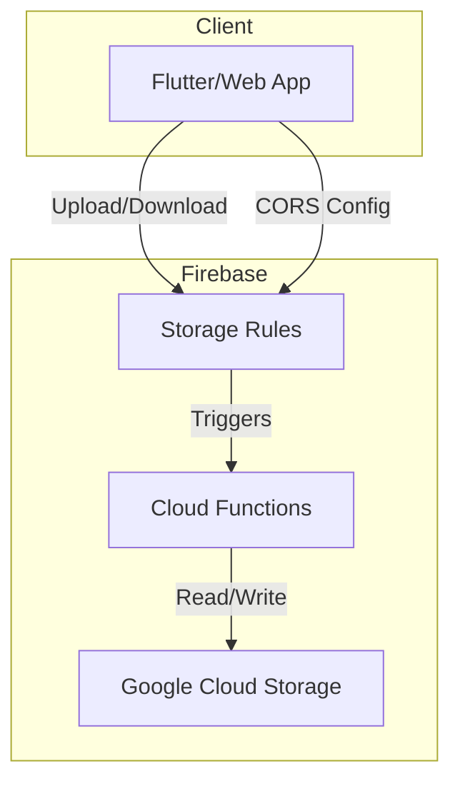
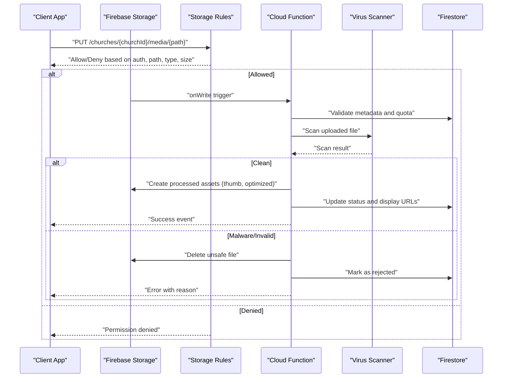
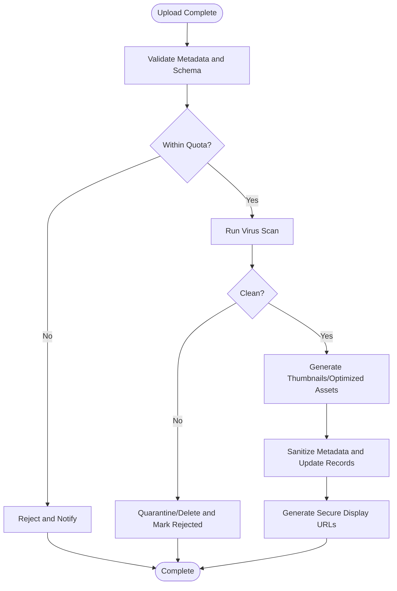
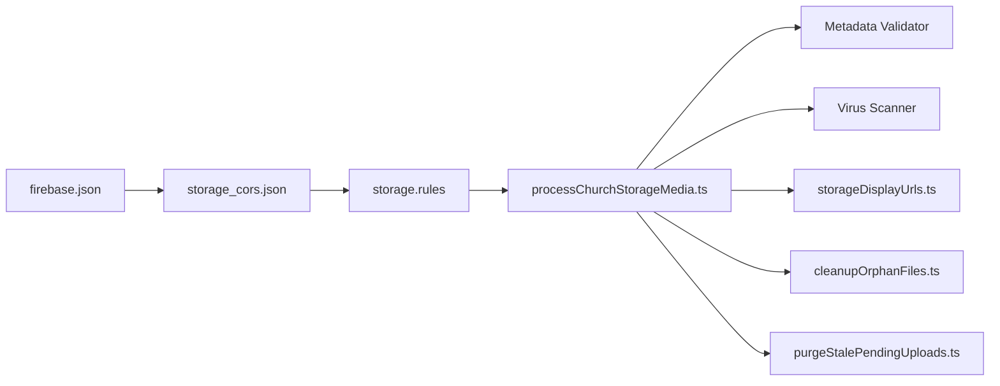

# File Security & Validation

<cite>
**Referenced Files in This Document**
- [storage.rules](file://storage.rules)
- [firestore.rules](file://firestore.rules)
- [firebase.json](file://firebase.json)
- [storage_cors.json](file://flutter_app/storage_cors.json)
- [STORAGE_CORS_README.txt](file://flutter_app/STORAGE_CORS_README.txt)
- [MIDIA_STORAGE_PADRAO_ECOFIRE.md](file://flutter_app/MIDIA_STORAGE_PADRAO_ECOFIRE.md)
- [processChurchStorageMedia.js](file://functions/lib/processChurchStorageMedia.js)
- [processChurchStorageMedia.ts](file://functions/src/processChurchStorageMedia.ts)
- [cleanupOrphanFiles.js](file://functions/lib/cleanupOrphanFiles.js)
- [cleanupOrphanFiles.ts](file://functions/src/cleanupOrphanFiles.ts)
- [storageDisplayUrls.js](file://functions/lib/storageDisplayUrls.js)
- [storageDisplayUrls.ts](file://functions/src/storageDisplayUrls.ts)
- [purgeStalePendingUploads.js](file://functions/lib/purgeStalePendingUploads.js)
- [purgeStalePendingUploads.ts](file://functions/src/purgeStalePendingUploads.ts)
- [apply_storage_cors.ps1](file://scripts/apply_storage_cors.ps1)
- [apply_firebase_rules.ps1](file://scripts/deploy_firebase_rules.ps1)
</cite>

## Table of Contents
1. [Introduction](#introduction)
2. [Project Structure](#project-structure)
3. [Core Components](#core-components)
4. [Architecture Overview](#architecture-overview)
5. [Detailed Component Analysis](#detailed-component-analysis)
6. [Dependency Analysis](#dependency-analysis)
7. [Performance Considerations](#performance-considerations)
8. [Troubleshooting Guide](#troubleshooting-guide)
9. [Conclusion](#conclusion)

## Introduction
This document explains the file security and validation systems used by Gestão Yahweh Premium for media handling. It covers Storage Rules for upload permissions, download restrictions, and file type validation; the media processing pipeline with security checks at each stage; file size limits; virus scanning integration; malicious content detection; secure sharing patterns using temporary access tokens; CDN security configuration; metadata sanitization; path traversal prevention; and storage quota management. It also provides troubleshooting guidance for common upload failures, permission denied errors, and media processing issues.

## Project Structure
The file security and validation system spans several layers:
- Firebase Storage Rules define access control and basic validation at the storage layer.
- Cloud Functions implement server-side validation, processing, and cleanup tasks.
- Flutter app includes CORS configuration and documentation for storage behavior.
- Scripts automate deployment of rules and CORS policies.

**Diagram sources**
- [storage.rules](file://storage.rules)
- [firebase.json](file://firebase.json)
- [processChurchStorageMedia.ts](file://functions/src/processChurchStorageMedia.ts)

**Section sources**
- [storage.rules](file://storage.rules)
- [firebase.json](file://firebase.json)
- [storage_cors.json](file://flutter_app/storage_cors.json)
- [STORAGE_CORS_README.txt](file://flutter_app/STORAGE_CORS_README.txt)

## Core Components
- Storage Rules: Enforce tenant-scoped paths, authenticated users, allowed MIME types, and size limits. They prevent path traversal and restrict downloads to authorized contexts.
- Cloud Functions: Validate uploads, process media (e.g., thumbnails), sanitize metadata, scan for malware, enforce quotas, and manage lifecycle (cleanup orphans, purge stale pending uploads).
- CORS Configuration: Restricts cross-origin requests to trusted domains and methods.
- Deployment Scripts: Apply Storage Rules and CORS settings consistently across environments.

Key responsibilities:
- Upload permissions: Require authentication and tenant ownership.
- Download restrictions: Allow read only when necessary and safe.
- File type validation: Whitelist MIME types and extensions.
- Size limits: Reject oversized files early.
- Virus scanning: Integrate external scanners via functions.
- Malicious content detection: Heuristics and scanner results gating.
- Metadata sanitization: Strip dangerous EXIF/IPTC fields.
- Path traversal prevention: Normalize and validate paths.
- Quota management: Track usage per tenant/user and reject over-quota.

**Section sources**
- [storage.rules](file://storage.rules)
- [processChurchStorageMedia.ts](file://functions/src/processChurchStorageMedia.ts)
- [cleanupOrphanFiles.ts](file://functions/src/cleanupOrphanFiles.ts)
- [storageDisplayUrls.ts](file://functions/src/storageDisplayUrls.ts)
- [purgeStalePendingUploads.ts](file://functions/src/purgeStalePendingUploads.ts)
- [storage_cors.json](file://flutter_app/storage_cors.json)
- [STORAGE_CORS_README.txt](file://flutter_app/STORAGE_CORS_README.txt)

## Architecture Overview
The media pipeline enforces security at multiple stages:

**Diagram sources**
- [storage.rules](file://storage.rules)
- [processChurchStorageMedia.ts](file://functions/src/processChurchStorageMedia.ts)
- [storageDisplayUrls.ts](file://functions/src/storageDisplayUrls.ts)

## Detailed Component Analysis

### Storage Rules: Upload Permissions, Download Restrictions, and File Type Validation
- Authentication and tenant scoping: Only authenticated users can write within their church’s folder structure. Reads are restricted to authorized tenants or public endpoints where explicitly allowed.
- Path normalization and traversal prevention: Paths must match a strict pattern under churches/{churchId}/... to avoid directory traversal and ensure isolation.
- File type validation: Only whitelisted MIME types are accepted (images, videos, PDFs). Extensions are validated against MIME types.
- Size limits: Maximum file sizes are enforced per type to protect storage and processing resources.
- Download controls: Public reads are limited to specific paths and may require signed URLs or tokenized access for sensitive content.

Security outcomes:
- Prevents unauthorized writes and reads.
- Blocks malicious file types and oversized payloads.
- Ensures tenant isolation and safe path resolution.

**Section sources**
- [storage.rules](file://storage.rules)

### Media Processing Pipeline with Security Checks
- Trigger: On upload completion, a Cloud Function validates metadata, checks quotas, and scans the file.
- Validation: Verifies that Firestore records exist and match expected schemas; rejects mismatched data.
- Scanning: Integrates a virus scanner service; if flagged, the file is quarantined or deleted and the record marked as rejected.
- Processing: Generates thumbnails and optimized versions; updates metadata safely.
- URL generation: Produces secure display URLs with short-lived tokens for shared links.

**Diagram sources**
- [processChurchStorageMedia.ts](file://functions/src/processChurchStorageMedia.ts)
- [storageDisplayUrls.ts](file://functions/src/storageDisplayUrls.ts)

**Section sources**
- [processChurchStorageMedia.ts](file://functions/src/processChurchStorageMedia.ts)
- [storageDisplayUrls.ts](file://functions/src/storageDisplayUrls.ts)

### File Size Limits and Malicious Content Detection
- Size limits: Enforced at the Storage Rules layer to fail fast on large uploads.
- Malicious content detection: Integrated virus scanning in Cloud Functions; files flagged as unsafe are removed and records updated accordingly.
- Heuristics: Additional checks for suspicious filenames, embedded scripts, or anomalous metadata.

Operational notes:
- Reject oversized files immediately to reduce bandwidth and storage costs.
- Maintain logs for scanned files and decisions for auditability.

**Section sources**
- [storage.rules](file://storage.rules)
- [processChurchStorageMedia.ts](file://functions/src/processChurchStorageMedia.ts)

### Secure File Sharing, Temporary Access Tokens, and CDN Security
- Temporary access tokens: Generate short-lived signed URLs for secure sharing; expire after a configured window.
- CDN configuration: Use caching headers and origin restrictions to prevent abuse; enable HTTPS-only delivery.
- Referer and IP allowlists: Restrict direct hotlinking and limit access to known clients.

Best practices:
- Prefer signed URLs over public links for sensitive media.
- Set cache-control appropriately to balance performance and freshness.
- Monitor CDN access logs for anomalies.

**Section sources**
- [storageDisplayUrls.ts](file://functions/src/storageDisplayUrls.ts)
- [firebase.json](file://firebase.json)
- [storage_cors.json](file://flutter_app/storage_cors.json)

### Metadata Sanitization and Path Traversal Prevention
- Metadata sanitization: Remove EXIF/IPTC fields that could contain executable code or tracking data; normalize titles and descriptions.
- Path traversal prevention: Canonicalize paths, reject sequences like “../”, and enforce strict regex patterns for storage keys.
- Tenant isolation: Ensure operations are scoped to the correct churchId and user context.

Implementation highlights:
- Validate all incoming metadata before persisting.
- Reject any path components that do not conform to the allowed schema.

**Section sources**
- [processChurchStorageMedia.ts](file://functions/src/processChurchStorageMedia.ts)
- [storage.rules](file://storage.rules)

### Storage Quota Management
- Per-tenant quotas: Track total bytes and file counts per church; block uploads exceeding limits.
- Graceful degradation: Provide clear error messages and fallback UI states when quotas are reached.
- Cleanup routines: Periodically remove orphaned files and stale pending uploads to reclaim space.

Operational tasks:
- Background jobs to purge stale pending uploads and clean up orphaned assets.
- Alerts when approaching quota thresholds.

**Section sources**
- [processChurchStorageMedia.ts](file://functions/src/processChurchStorageMedia.ts)
- [cleanupOrphanFiles.ts](file://functions/src/cleanupOrphanFiles.ts)
- [purgeStalePendingUploads.ts](file://functions/src/purgeStalePendingUploads.ts)

## Dependency Analysis
The security and validation system depends on coordinated interactions between Storage Rules, Cloud Functions, and configuration files.

**Diagram sources**
- [storage.rules](file://storage.rules)
- [processChurchStorageMedia.ts](file://functions/src/processChurchStorageMedia.ts)
- [storageDisplayUrls.ts](file://functions/src/storageDisplayUrls.ts)
- [cleanupOrphanFiles.ts](file://functions/src/cleanupOrphanFiles.ts)
- [purgeStalePendingUploads.ts](file://functions/src/purgeStalePendingUploads.ts)
- [storage_cors.json](file://flutter_app/storage_cors.json)
- [firebase.json](file://firebase.json)

**Section sources**
- [storage.rules](file://storage.rules)
- [processChurchStorageMedia.ts](file://functions/src/processChurchStorageMedia.ts)
- [storageDisplayUrls.ts](file://functions/src/storageDisplayUrls.ts)
- [cleanupOrphanFiles.ts](file://functions/src/cleanupOrphanFiles.ts)
- [purgeStalePendingUploads.ts](file://functions/src/purgeStalePendingUploads.ts)
- [storage_cors.json](file://flutter_app/storage_cors.json)
- [firebase.json](file://firebase.json)

## Performance Considerations
- Enforce size limits at the edge (Storage Rules) to avoid unnecessary network transfers.
- Use background processing for heavy tasks (thumbnails, optimization) to keep uploads responsive.
- Cache CDN responses with appropriate TTLs; invalidate selectively when content changes.
- Monitor function execution times and optimize database reads/writes during processing.

[No sources needed since this section provides general guidance]

## Troubleshooting Guide
Common issues and resolutions:
- Upload fails with “Permission denied”:
  - Verify user authentication and tenant membership.
  - Confirm the target path matches the allowed pattern.
  - Check MIME type whitelist and file extension alignment.
- Upload blocked due to size:
  - Reduce file size or adjust limits if appropriate.
  - Review Storage Rules size constraints.
- Media processing errors:
  - Inspect Cloud Function logs for validation failures or scanner rejections.
  - Ensure metadata schema compliance and tenant scoping.
- Orphaned files or stale pending uploads:
  - Run cleanup and purge jobs; verify cron schedules and permissions.
- CORS errors on web/mobile:
  - Apply correct CORS configuration and trusted origins.

Diagnostic steps:
- Check Storage Rules deployment and active version.
- Review Cloud Function logs for detailed error traces.
- Validate CORS JSON and firebase.json hosting settings.
- Use scripts to reapply rules and CORS policies consistently.

**Section sources**
- [storage.rules](file://storage.rules)
- [processChurchStorageMedia.ts](file://functions/src/processChurchStorageMedia.ts)
- [cleanupOrphanFiles.ts](file://functions/src/cleanupOrphanFiles.ts)
- [purgeStalePendingUploads.ts](file://functions/src/purgeStalePendingUploads.ts)
- [storage_cors.json](file://flutter_app/storage_cors.json)
- [STORAGE_CORS_README.txt](file://flutter_app/STORAGE_CORS_README.txt)
- [apply_storage_cors.ps1](file://scripts/apply_storage_cors.ps1)
- [apply_firebase_rules.ps1](file://scripts/deploy_firebase_rules.ps1)

## Conclusion
Gestão Yahweh Premium implements a robust, multi-layered approach to file security and validation. Storage Rules provide immediate enforcement of access, type, and size constraints. Cloud Functions add deep validation, scanning, processing, and lifecycle management. Together with careful CORS configuration and deployment automation, the system ensures secure, scalable, and maintainable media handling. Following the troubleshooting guidance helps quickly resolve common issues while preserving security posture.

[No sources needed since this section summarizes without analyzing specific files]