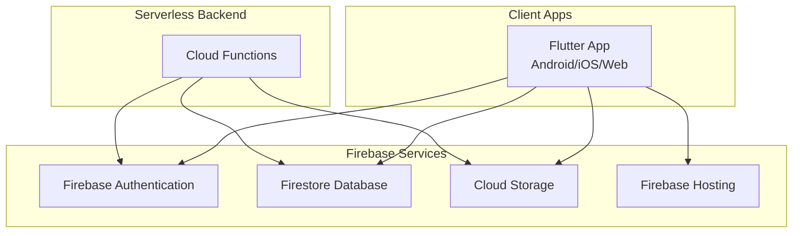
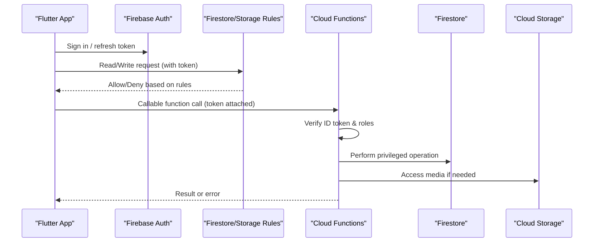
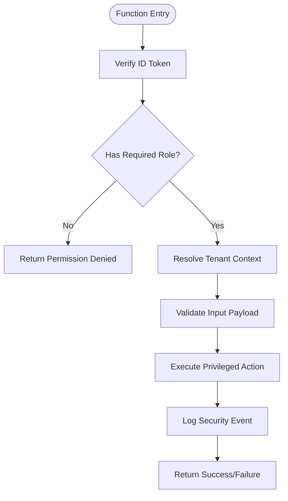
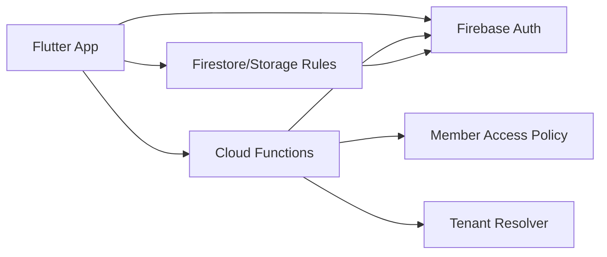

# Security Architecture

<cite>
**Referenced Files in This Document**
- [firestore.rules](file://firestore.rules)
- [storage.rules](file://storage.rules)
- [functions/index.ts](file://functions/src/index.ts)
- [functions/memberAccessPolicy.ts](file://functions/src/memberAccessPolicy.ts)
- [functions/masterPlatformAuth.ts](file://functions/src/masterPlatformAuth.ts)
- [functions/tenantCallableResolve.ts](file://functions/src/tenantCallableResolve.ts)
- [flutter_app/lib/firebase_options.dart](file://flutter_app/lib/firebase_options.dart)
- [flutter_app/android/app/google-services.json](file://flutter_app/android/app/google-services.json)
- [flutter_app/ios/Runner/GoogleService-Info.plist](file://flutter_app/ios/Runner/GoogleService-Info.plist)
- [firebase.json](file://firebase.json)
- [scripts/deploy_firebase_rules.ps1](file://scripts/deploy_firebase_rules.ps1)
- [scripts/firestore_rules_gcp_publish.cjs](file://scripts/firestore_rules_gcp_publish.cjs)
- [security_rules_test_firestore/test/firestore.rules.test.js](file://security_rules_test_firestore/test/firestore.rules.test.js)
</cite>

## Table of Contents
1. [Introduction](#introduction)
2. [Project Structure](#project-structure)
3. [Core Components](#core-components)
4. [Architecture Overview](#architecture-overview)
5. [Detailed Component Analysis](#detailed-component-analysis)
6. [Dependency Analysis](#dependency-analysis)
7. [Performance Considerations](#performance-considerations)
8. [Troubleshooting Guide](#troubleshooting-guide)
9. [Conclusion](#conclusion)
10. [Appendices](#appendices)

## Introduction
This document explains the security architecture for Gestão Yahweh Premium, focusing on a multi-layered approach that combines Firebase Authentication, Firestore Security Rules, Storage Rules, and Cloud Functions authorization. It details role-based access control (RBAC), tenant isolation enforcement, data validation at multiple layers, session management, token handling, secure communication patterns, audit logging strategies, compliance considerations, and troubleshooting guidance for authentication failures, permission errors, and policy violations.

## Project Structure
The project is organized into:
- Flutter application with platform-specific configuration files for Firebase initialization
- Firebase configuration and rules at the repository root
- Cloud Functions source code under functions/src
- Scripts to deploy and manage rules and configurations
- A dedicated test directory for Firestore rules testing

**Diagram sources**
- [firebase.json](file://firebase.json)
- [flutter_app/lib/firebase_options.dart](file://flutter_app/lib/firebase_options.dart)
- [functions/src/index.ts](file://functions/src/index.ts)

**Section sources**
- [firebase.json](file://firebase.json)
- [flutter_app/lib/firebase_options.dart](file://flutter_app/lib/firebase_options.dart)
- [functions/src/index.ts](file://functions/src/index.ts)

## Core Components
- Firebase Authentication: Manages user identity across platforms using Firebase SDKs configured via platform-specific files.
- Firestore Security Rules: Enforce fine-grained access control and tenant isolation at the database layer.
- Storage Rules: Control file upload/download permissions per tenant and role.
- Cloud Functions: Provide server-side authorization, RBAC checks, and secure operations not possible from the client.
- Deployment scripts: Automate publishing of rules and ensure consistency across environments.

Key responsibilities:
- Validate requests at the edge (rules) and enforce business logic securely in functions.
- Isolate tenants by path and field-level checks.
- Centralize sensitive operations behind authenticated callable endpoints.

**Section sources**
- [firestore.rules](file://firestore.rules)
- [storage.rules](file://storage.rules)
- [functions/src/index.ts](file://functions/src/index.ts)
- [functions/src/memberAccessPolicy.ts](file://functions/src/memberAccessPolicy.ts)
- [functions/src/masterPlatformAuth.ts](file://functions/src/masterPlatformAuth.ts)
- [functions/src/tenantCallableResolve.ts](file://functions/src/tenantCallableResolve.ts)

## Architecture Overview
The security architecture follows a layered defense model:
- Client layer: Secure app initialization and minimal trust boundary; no secrets in client code.
- Edge layer: Firestore and Storage rules enforce immediate access decisions based on auth state and request context.
- Server layer: Cloud Functions validate roles, perform tenant resolution, and execute privileged actions.
- Audit layer: Centralized logging and analytics for security events.

**Diagram sources**
- [functions/src/index.ts](file://functions/src/index.ts)
- [functions/src/memberAccessPolicy.ts](file://functions/src/memberAccessPolicy.ts)
- [functions/src/masterPlatformAuth.ts](file://functions/src/masterPlatformAuth.ts)
- [functions/src/tenantCallableResolve.ts](file://functions/src/tenantCallableResolve.ts)
- [firestore.rules](file://firestore.rules)
- [storage.rules](file://storage.rules)

## Detailed Component Analysis

### Firebase Authentication and Session Management
- Platform initialization uses Firebase options embedded in platform-specific files to connect to the correct project.
- Tokens are managed by the Firebase SDK; clients should rely on automatic refresh and avoid manual token persistence beyond what the SDK provides.
- Secure communication patterns include HTTPS-only endpoints, short-lived tokens, and least-privilege scopes.

Implementation anchors:
- Flutter Firebase options initialization
- Android Google services configuration
- iOS Google services configuration

**Section sources**
- [flutter_app/lib/firebase_options.dart](file://flutter_app/lib/firebase_options.dart)
- [flutter_app/android/app/google-services.json](file://flutter_app/android/app/google-services.json)
- [flutter_app/ios/Runner/GoogleService-Info.plist](file://flutter_app/ios/Runner/GoogleService-Info.plist)

### Firestore Security Rules and Tenant Isolation
- Rules enforce read/write permissions based on authentication state, tenant identifiers, and role attributes.
- Tenant isolation is achieved by scoping paths to tenant IDs and validating ownership through fields.
- Data validation includes required fields, allowed values, and cross-field constraints.

Operational highlights:
- Path-scoped rules for tenant collections
- Role-based conditions for admin/editor/viewer
- Field-level write guards and sanitization hints

**Section sources**
- [firestore.rules](file://firestore.rules)

### Storage Rules and Media Permissions
- Storage rules restrict uploads/downloads to authenticated users within the appropriate tenant folder structure.
- File size limits, MIME type checks, and path validations prevent misuse.
- Public assets may be exposed selectively while private content remains restricted.

Operational highlights:
- Tenant-scoped storage paths
- Role-aware read/write conditions
- Validation of metadata and content types

**Section sources**
- [storage.rules](file://storage.rules)

### Cloud Functions Authorization and RBAC
- Callable functions verify ID tokens and enforce RBAC before executing privileged operations.
- Tenant resolution ensures operations target the correct tenant context.
- Centralized policies encapsulate role checks and access decisions.

Key modules:
- Member access policy enforcement
- Master platform authentication utilities
- Tenant resolution helpers for callable endpoints

**Diagram sources**
- [functions/src/memberAccessPolicy.ts](file://functions/src/memberAccessPolicy.ts)
- [functions/src/masterPlatformAuth.ts](file://functions/src/masterPlatformAuth.ts)
- [functions/src/tenantCallableResolve.ts](file://functions/src/tenantCallableResolve.ts)

**Section sources**
- [functions/src/index.ts](file://functions/src/index.ts)
- [functions/src/memberAccessPolicy.ts](file://functions/src/memberAccessPolicy.ts)
- [functions/src/masterPlatformAuth.ts](file://functions/src/masterPlatformAuth.ts)
- [functions/src/tenantCallableResolve.ts](file://functions/src/tenantCallableResolve.ts)

### Data Validation at Multiple Levels
- Client-side validation improves UX but must not be trusted.
- Firestore rules enforce schema constraints and business invariants.
- Cloud Functions perform deep validation and cross-document checks.

Validation strategy:
- Define strict schemas in rules and functions
- Reject malformed payloads early
- Normalize inputs and sanitize outputs

**Section sources**
- [firestore.rules](file://firestore.rules)
- [functions/src/memberAccessPolicy.ts](file://functions/src/memberAccessPolicy.ts)

### API Endpoint Protection
- Use callable functions for sensitive operations instead of direct database writes from clients.
- Protect endpoints with token verification and role checks.
- Rate-limit and monitor suspicious activity via logs and metrics.

Protection patterns:
- Minimal client privileges
- Server-side authorization gates
- Audit trails for all privileged calls

**Section sources**
- [functions/src/index.ts](file://functions/src/index.ts)
- [functions/src/masterPlatformAuth.ts](file://functions/src/masterPlatformAuth.ts)

### Audit Logging Strategies
- Log authentication events, rule denials, and function invocations.
- Include contextual metadata such as tenant ID, user ID, and action type.
- Aggregate logs for compliance reporting and incident response.

Best practices:
- Structured logging with consistent fields
- Redact sensitive data in logs
- Retain logs according to compliance requirements

[No sources needed since this section provides general guidance]

### Compliance Considerations
- Align data handling with privacy regulations (e.g., GDPR, LGPD).
- Implement data minimization and purpose limitation.
- Ensure consent management and right-to-deletion workflows.

[No sources needed since this section provides general guidance]

## Dependency Analysis
Security components interact as follows:
- Flutter apps depend on Firebase SDKs configured via platform files.
- Firestore and Storage rules depend on auth context and request variables.
- Cloud Functions depend on verified tokens and centralized policy modules.

**Diagram sources**
- [flutter_app/lib/firebase_options.dart](file://flutter_app/lib/firebase_options.dart)
- [functions/src/memberAccessPolicy.ts](file://functions/src/memberAccessPolicy.ts)
- [functions/src/tenantCallableResolve.ts](file://functions/src/tenantCallableResolve.ts)
- [functions/src/masterPlatformAuth.ts](file://functions/src/masterPlatformAuth.ts)

**Section sources**
- [flutter_app/lib/firebase_options.dart](file://flutter_app/lib/firebase_options.dart)
- [functions/src/memberAccessPolicy.ts](file://functions/src/memberAccessPolicy.ts)
- [functions/src/tenantCallableResolve.ts](file://functions/src/tenantCallableResolve.ts)
- [functions/src/masterPlatformAuth.ts](file://functions/src/masterPlatformAuth.ts)

## Performance Considerations
- Prefer rule-based denials to reduce unnecessary function calls.
- Cache frequently accessed, non-sensitive data where appropriate.
- Optimize Firestore queries to minimize reads and rule evaluations.
- Avoid heavy computations in rules; offload to functions when necessary.

[No sources needed since this section provides general guidance]

## Troubleshooting Guide
Common issues and resolutions:
- Authentication failures:
  - Verify Firebase project configuration in platform files.
  - Ensure correct sign-in flow and token refresh behavior.
- Permission errors:
  - Inspect Firestore and Storage rules for tenant and role mismatches.
  - Confirm user roles and tenant membership in backend policies.
- Security policy violations:
  - Review function logs for denied actions and missing claims.
  - Validate input payloads against expected schemas.

Diagnostic steps:
- Enable verbose logging in development.
- Use the Firestore rules tester to simulate scenarios.
- Monitor Cloud Functions logs for errors and denials.

**Section sources**
- [security_rules_test_firestore/test/firestore.rules.test.js](file://security_rules_test_firestore/test/firestore.rules.test.js)
- [functions/src/memberAccessPolicy.ts](file://functions/src/memberAccessPolicy.ts)
- [functions/src/masterPlatformAuth.ts](file://functions/src/masterPlatformAuth.ts)

## Conclusion
Gestão Yahweh Premium employs a robust, multi-layered security architecture combining Firebase Authentication, Firestore and Storage rules, and Cloud Functions with strong RBAC and tenant isolation. By enforcing validation at every layer, centralizing authorization in serverless functions, and maintaining comprehensive audit logs, the system mitigates common vulnerabilities and supports compliance requirements. Continuous testing and monitoring ensure resilience against evolving threats.

[No sources needed since this section summarizes without analyzing specific files]

## Appendices

### Deployment and Rule Management
- Deploy Firestore and Storage rules using provided scripts to maintain environment parity.
- Use automated pipelines to publish rules consistently across stages.

**Section sources**
- [scripts/deploy_firebase_rules.ps1](file://scripts/deploy_firebase_rules.ps1)
- [scripts/firestore_rules_gcp_publish.cjs](file://scripts/firestore_rules_gcp_publish.cjs)
- [firebase.json](file://firebase.json)