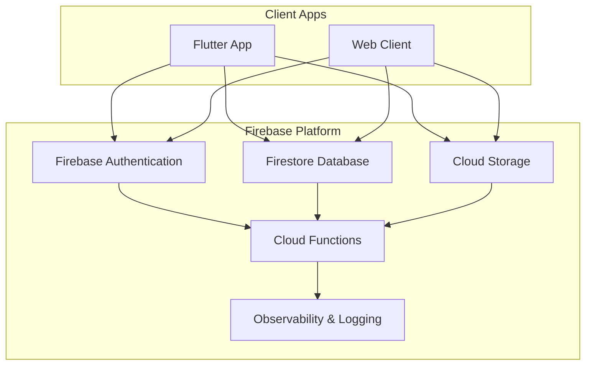
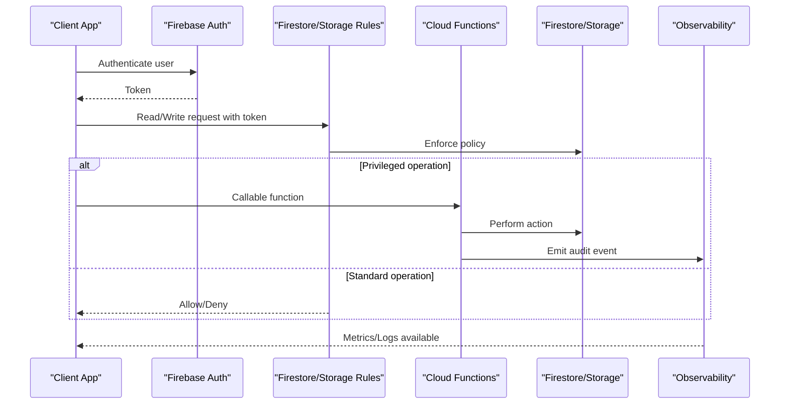
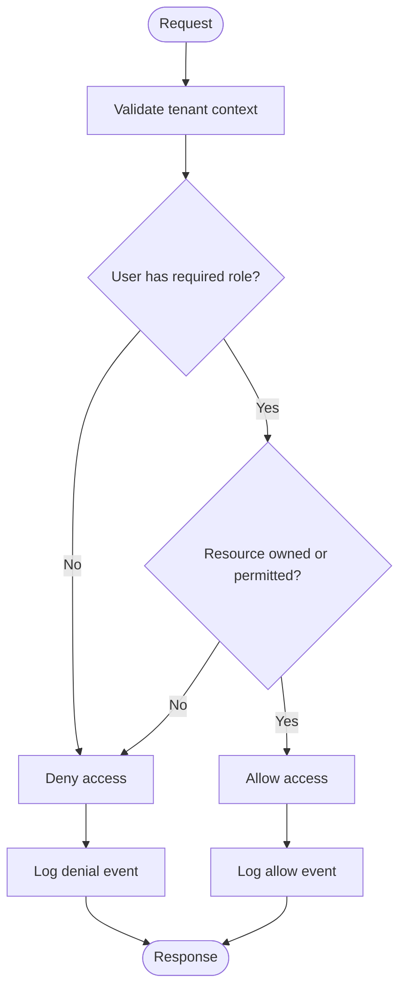
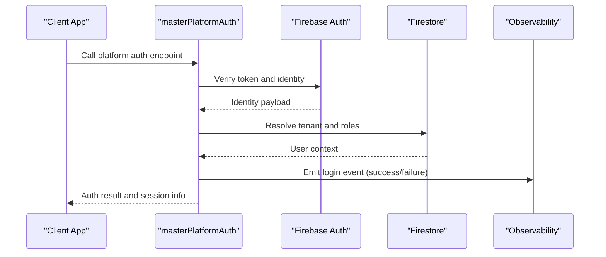
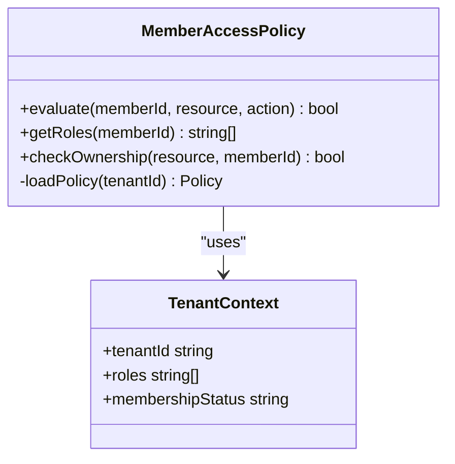
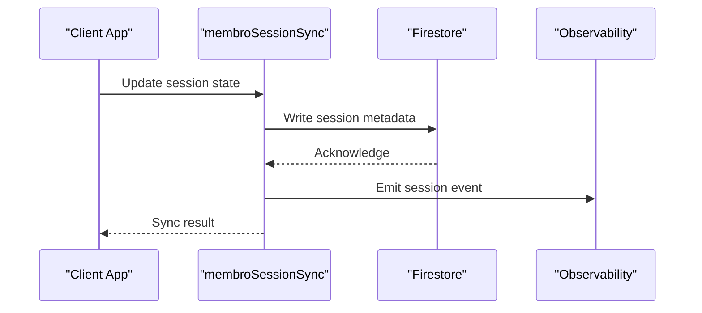
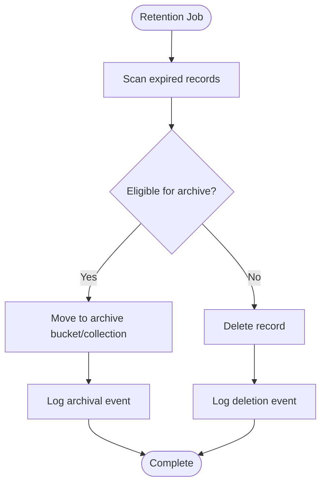
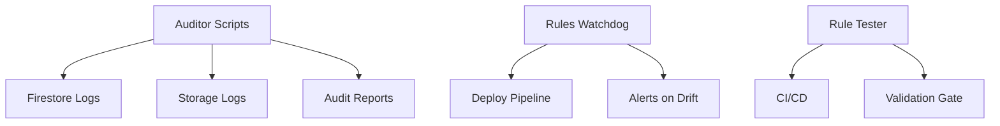
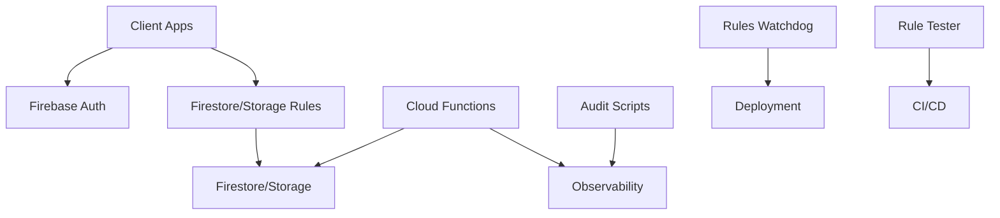

# Security Monitoring & Auditing

<cite>
**Referenced Files in This Document**
- [firestore.rules](file://firestore.rules)
- [storage.rules](file://storage.rules)
- [functions/index.ts](file://functions/src/index.ts)
- [functions/masterPlatformAuth.ts](file://functions/src/masterPlatformAuth.ts)
- [functions/memberAccessPolicy.ts](file://functions/src/memberAccessPolicy.ts)
- [functions/membroSessionSync.ts](file://functions/src/membroSessionSync.ts)
- [functions/churchChatRetention.ts](file://functions/src/churchChatRetention.ts)
- [scripts/auditoria_acessos_firestore_storage.ps1](file://scripts/auditoria_acessos_firestore_storage.ps1)
- [scripts/auditoria_camada_dados.ps1](file://scripts/auditoria_camada_dados.ps1)
- [scripts/firestore_rules_gcp_watchdog.ps1](file://scripts/firestore_rules_gcp_watchdog.ps1)
- [scripts/test_rules_api_post.cjs](file://scripts/test_rules_api_post.cjs)
- [security_rules_test_firestore/test/firestore.rules.test.js](file://security_rules_test_firestore/test/firestore.rules.test.js)
- [docs/FIREBASE_OBSERVABILITY.md](file://docs/FIREBASE_OBSERVABILITY.md)
- [docs/AUDITORIA_PUBLICACAO_AVISOS_EVENTOS_CHAT.md](file://docs/AUDITORIA_PUBLICACAO_AVISOS_EVENTOS_CHAT.md)
- [docs/RELATORIO_AUDITORIA_CIRURGICA_CHAT_PUBLISH_CACHE.md](file://docs/RELATORIO_AUDITORIA_CIRURGICA_CHAT_PUBLISH_CACHE.md)
- [docs/RELATORIO_AUDITORIA_PRODUCAO_BLINDAGEM.md](file://docs/RELATORIO_AUDITORIA_PRODUCAO_BLINDAGEM.md)
- [docs/ANALISE_CUSTO_LUCRO_IGREJA_100.md](file://ANALISE_CUSTO_LUCRO_IGREJA_100.md)
</cite>

## Table of Contents
1. [Introduction](#introduction)
2. [Project Structure](#project-structure)
3. [Core Components](#core-components)
4. [Architecture Overview](#architecture-overview)
5. [Detailed Component Analysis](#detailed-component-analysis)
6. [Dependency Analysis](#dependency-analysis)
7. [Performance Considerations](#performance-considerations)
8. [Troubleshooting Guide](#troubleshooting-guide)
9. [Conclusion](#conclusion)
10. [Appendices](#appendices)

## Introduction
This document explains the security monitoring and auditing capabilities implemented in Gestão Yahweh Premium. It covers how authentication events, authorization decisions, and data access patterns are observed and recorded; how logs are aggregated and alerted upon; and how to build dashboards for real-time monitoring and compliance reporting. It also includes guidance on anomaly detection, incident response procedures, log analysis techniques, and managing performance overhead from monitoring.

## Project Structure
Security-related code spans several areas:
- Firestore and Storage Rules define access control at the data layer.
- Cloud Functions implement platform auth flows, session synchronization, retention policies, and member access policies.
- Scripts provide audit utilities, rule testing, and watchdogs for rules deployment.
- Documentation outlines observability practices and audit reports.

[No sources needed since this diagram shows conceptual workflow, not actual code structure]

## Core Components
- Access Control via Firestore and Storage Rules: Centralized authorization logic enforced at the database and storage layers.
- Platform Authentication Flow: Server-side handling for platform-specific authentication scenarios.
- Member Access Policy: Fine-grained permissions for tenant members.
- Session Synchronization: Ensures consistent session state across services.
- Chat Retention: Data lifecycle management with audit implications.
- Audit Utilities and Watchdogs: Scripts to analyze access patterns, validate rules, and monitor deployments.

**Section sources**
- [firestore.rules](file://firestore.rules)
- [storage.rules](file://storage.rules)
- [functions/masterPlatformAuth.ts](file://functions/src/masterPlatformAuth.ts)
- [functions/memberAccessPolicy.ts](file://functions/src/memberAccessPolicy.ts)
- [functions/membroSessionSync.ts](file://functions/src/membroSessionSync.ts)
- [functions/churchChatRetention.ts](file://functions/src/churchChatRetention.ts)
- [scripts/auditoria_acessos_firestore_storage.ps1](file://scripts/auditoria_acessos_firestore_storage.ps1)
- [scripts/auditoria_camada_dados.ps1](file://scripts/auditoria_camada_dados.ps1)
- [scripts/firestore_rules_gcp_watchdog.ps1](file://scripts/firestore_rules_gcp_watchdog.ps1)

## Architecture Overview
The system enforces security through layered controls:
- Client requests authenticate via Firebase Authentication.
- Firestore and Storage Rules evaluate each read/write operation against tenant context and user roles.
- Cloud Functions handle sensitive operations (e.g., platform auth, policy resolution, session sync, retention).
- Observability captures metrics and logs for audit trails and alerting.

**Diagram sources**
- [firestore.rules](file://firestore.rules)
- [storage.rules](file://storage.rules)
- [functions/index.ts](file://functions/src/index.ts)

**Section sources**
- [firestore.rules](file://firestore.rules)
- [storage.rules](file://storage.rules)
- [functions/index.ts](file://functions/src/index.ts)

## Detailed Component Analysis

### Firestore and Storage Rules
- Purpose: Define fine-grained access control for tenants, users, and resources.
- Key aspects:
  - Tenant isolation and role-based checks.
  - Conditional writes based on ownership and permissions.
  - Storage path validation and media access restrictions.
- Audit considerations:
  - Deny decisions should be logged by client or server wrappers.
  - Rule evaluation metrics can be captured via platform observability.

**Diagram sources**
- [firestore.rules](file://firestore.rules)
- [storage.rules](file://storage.rules)

**Section sources**
- [firestore.rules](file://firestore.rules)
- [storage.rules](file://storage.rules)

### Platform Authentication Flow
- Purpose: Handle platform-specific authentication scenarios securely.
- Responsibilities:
  - Validate tokens and map to internal identities.
  - Create or update user sessions.
  - Emit audit events for login success/failure.
- Integration points:
  - Firebase Authentication provider integration.
  - Cloud Function entry point for callable endpoints.

**Diagram sources**
- [functions/masterPlatformAuth.ts](file://functions/src/masterPlatformAuth.ts)

**Section sources**
- [functions/masterPlatformAuth.ts](file://functions/src/masterPlatformAuth.ts)

### Member Access Policy
- Purpose: Enforce per-member permissions within a tenant.
- Capabilities:
  - Role-based access control for church members.
  - Dynamic policy evaluation based on membership status and department roles.
- Audit considerations:
  - Record authorization decisions for compliance.
  - Track privilege escalation attempts.

**Diagram sources**
- [functions/memberAccessPolicy.ts](file://functions/src/memberAccessPolicy.ts)

**Section sources**
- [functions/memberAccessPolicy.ts](file://functions/src/memberAccessPolicy.ts)

### Session Synchronization
- Purpose: Keep session state consistent across services and devices.
- Operations:
  - Sync session metadata to Firestore.
  - Invalidate stale sessions.
  - Emit session lifecycle events for audit.

**Diagram sources**
- [functions/membroSessionSync.ts](file://functions/src/membroSessionSync.ts)

**Section sources**
- [functions/membroSessionSync.ts](file://functions/src/membroSessionSync.ts)

### Chat Retention
- Purpose: Manage lifecycle of chat data with retention policies.
- Features:
  - Scheduled cleanup of old messages/media.
  - Audit logging for deletions and archival.
  - Compliance with data retention requirements.

**Diagram sources**
- [functions/churchChatRetention.ts](file://functions/src/churchChatRetention.ts)

**Section sources**
- [functions/churchChatRetention.ts](file://functions/src/churchChatRetention.ts)

### Audit Utilities and Watchdogs
- Purpose: Provide tools for analyzing access patterns, validating rules, and monitoring deployments.
- Tools:
  - Firestore/Storage access auditor scripts.
  - Data layer audit utilities.
  - Firestore rules watchdog for deployment consistency.
  - Rule testing harness for CI/CD.

**Diagram sources**
- [scripts/auditoria_acessos_firestore_storage.ps1](file://scripts/auditoria_acessos_firestore_storage.ps1)
- [scripts/auditoria_camada_dados.ps1](file://scripts/auditoria_camada_dados.ps1)
- [scripts/firestore_rules_gcp_watchdog.ps1](file://scripts/firestore_rules_gcp_watchdog.ps1)
- [scripts/test_rules_api_post.cjs](file://scripts/test_rules_api_post.cjs)
- [security_rules_test_firestore/test/firestore.rules.test.js](file://security_rules_test_firestore/test/firestore.rules.test.js)

**Section sources**
- [scripts/auditoria_acessos_firestore_storage.ps1](file://scripts/auditoria_acessos_firestore_storage.ps1)
- [scripts/auditoria_camada_dados.ps1](file://scripts/auditoria_camada_dados.ps1)
- [scripts/firestore_rules_gcp_watchdog.ps1](file://scripts/firestore_rules_gcp_watchdog.ps1)
- [scripts/test_rules_api_post.cjs](file://scripts/test_rules_api_post.cjs)
- [security_rules_test_firestore/test/firestore.rules.test.js](file://security_rules_test_firestore/test/firestore.rules.test.js)

## Dependency Analysis
Security components interact as follows:
- Client apps depend on Firebase Authentication and enforce rules at the data layer.
- Cloud Functions depend on Firestore and Storage for state and persistence.
- Audit utilities depend on platform logs and APIs to extract access patterns.
- Watchdogs and testers ensure rules remain consistent and validated.

**Diagram sources**
- [firestore.rules](file://firestore.rules)
- [storage.rules](file://storage.rules)
- [functions/index.ts](file://functions/src/index.ts)
- [scripts/auditoria_acessos_firestore_storage.ps1](file://scripts/auditoria_acessos_firestore_storage.ps1)
- [scripts/firestore_rules_gcp_watchdog.ps1](file://scripts/firestore_rules_gcp_watchdog.ps1)
- [security_rules_test_firestore/test/firestore.rules.test.js](file://security_rules_test_firestore/test/firestore.rules.test.js)

**Section sources**
- [firestore.rules](file://firestore.rules)
- [storage.rules](file://storage.rules)
- [functions/index.ts](file://functions/src/index.ts)
- [scripts/auditoria_acessos_firestore_storage.ps1](file://scripts/auditoria_acessos_firestore_storage.ps1)
- [scripts/firestore_rules_gcp_watchdog.ps1](file://scripts/firestore_rules_gcp_watchdog.ps1)
- [security_rules_test_firestore/test/firestore.rules.test.js](file://security_rules_test_firestore/test/firestore.rules.test.js)

## Performance Considerations
- Rule evaluation cost: Minimize complex expressions in Firestore/Storage Rules to reduce latency.
- Function invocation overhead: Batch operations where possible and avoid unnecessary reads/writes.
- Log volume: Filter high-cardinality fields in audit logs to control costs and improve query performance.
- Retention policies: Schedule cleanup jobs during off-peak hours to minimize impact.
- Caching strategies: Cache frequently accessed policies and tenant contexts to reduce repeated lookups.

[No sources needed since this section provides general guidance]

## Troubleshooting Guide
Common issues and resolutions:
- Authentication failures:
  - Verify token validity and expiration.
  - Check platform-specific auth mappings in functions.
- Authorization denials:
  - Inspect Firestore/Storage Rules for tenant and role mismatches.
  - Use rule testers to simulate requests and validate outcomes.
- Audit gaps:
  - Ensure observability is enabled and logs are exported.
  - Confirm audit scripts have proper permissions and correct log paths.
- Deployment drift:
  - Run watchdogs to detect rule changes outside pipelines.
  - Re-deploy validated rules from CI/CD artifacts.

**Section sources**
- [scripts/test_rules_api_post.cjs](file://scripts/test_rules_api_post.cjs)
- [security_rules_test_firestore/test/firestore.rules.test.js](file://security_rules_test_firestore/test/firestore.rules.test.js)
- [scripts/firestore_rules_gcp_watchdog.ps1](file://scripts/firestore_rules_gcp_watchdog.ps1)

## Conclusion
Gestão Yahweh Premium implements robust security monitoring and auditing through layered access controls, server-side authentication flows, and comprehensive audit utilities. By leveraging Firestore and Storage Rules, Cloud Functions, and observability platforms, the system ensures secure tenant isolation, detailed audit trails, and actionable insights for threat detection and compliance. Proper configuration of dashboards, alerts, and retention policies enables proactive security management while maintaining performance and regulatory adherence.

[No sources needed since this section summarizes without analyzing specific files]

## Appendices

### Security Metrics Collection
- Authentication metrics: Login success/failure rates, token refresh frequency.
- Authorization metrics: Denial rates by tenant and resource type.
- Data access metrics: Read/write volumes, slow queries, and rule evaluation times.
- Anomaly detection: Thresholds for unusual activity spikes or policy violations.

**Section sources**
- [docs/FIREBASE_OBSERVABILITY.md](file://docs/FIREBASE_OBSERVABILIDADE.md)

### Alerting Mechanisms
- Real-time alerts for failed authentications and authorization denials.
- Scheduled alerts for retention policy violations and data drift.
- Integration with notification channels (email, Slack, PagerDuty).

**Section sources**
- [docs/FIREBASE_OBSERVABILITY.md](file://docs/FIREBASE_OBSERVABILIDADE.md)

### Compliance Reporting
- Generate periodic reports for audit trails and access patterns.
- Export logs for regulatory reviews and forensic analysis.
- Maintain immutable audit logs for critical operations.

**Section sources**
- [docs/AUDITORIA_PUBLICACAO_AVISOS_EVENTOS_CHAT.md](file://docs/AUDITORIA_PUBLICACAO_AVISOS_EVENTOS_CHAT.md)
- [docs/RELATORIO_AUDITORIA_CIRURGICA_CHAT_PUBLISH_CACHE.md](file://docs/RELATORIO_AUDITORIA_CIRURGICA_CHAT_PUBLISH_CACHE.md)
- [docs/RELATORIO_AUDITORIA_PRODUCAO_BLINDAGEM.md](file://docs/RELATORIO_AUDITORIA_PRODUCAO_BLINDAGEM.md)

### Incident Response Procedures
- Detect anomalies via dashboards and alerts.
- Isolate affected tenants or users.
- Investigate using audit logs and forensic tools.
- Remediate and document lessons learned.

**Section sources**
- [ANALISE_CUSTO_LUCRO_IGREJA_100.md](file://ANALISE_CUSTO_LUCRO_IGREJA_100.md)