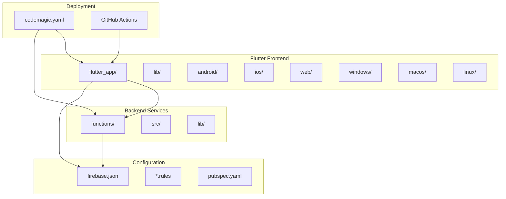
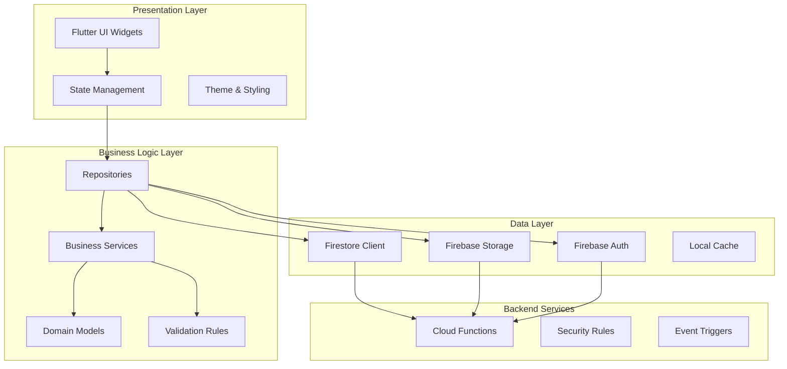
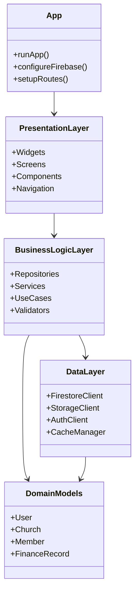
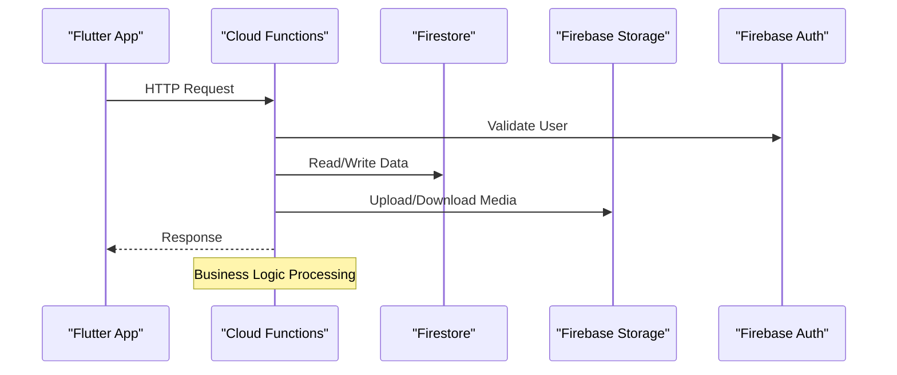
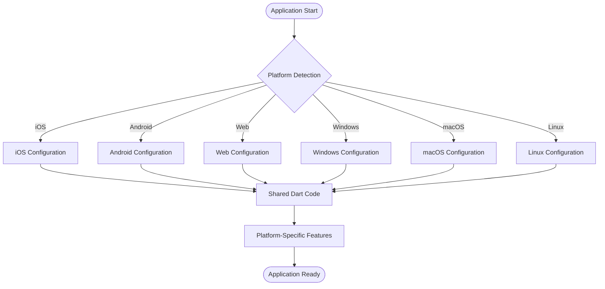
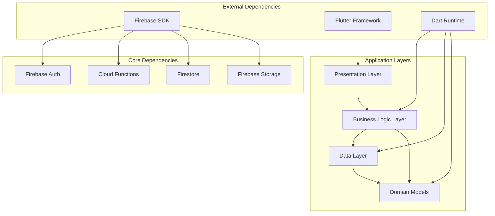

# System Architecture Overview

<cite>
**Referenced Files in This Document**
- [README.md](file://README.md)
- [flutter_app/pubspec.yaml](file://flutter_app/pubspec.yaml)
- [flutter_app/lib/main.dart](file://flutter_app/lib/main.dart)
- [functions/src/index.ts](file://functions/src/index.ts)
- [firebase.json](file://firebase.json)
- [firestore.rules](file://firestore.rules)
- [storage.rules](file://storage.rules)
- [codemagic.yaml](file://codemagic.yaml)
- [.github/workflows/deploy-web.yml](file://.github/workflows/deploy-web.yml)
</cite>

## Table of Contents
1. [Introduction](#introduction)
2. [Project Structure](#project-structure)
3. [Core Components](#core-components)
4. [Architecture Overview](#architecture-overview)
5. [Detailed Component Analysis](#detailed-component-analysis)
6. [Dependency Analysis](#dependency-analysis)
7. [Performance Considerations](#performance-considerations)
8. [Troubleshooting Guide](#troubleshooting-guide)
9. [Conclusion](#conclusion)
10. [Appendices](#appendices)

## Introduction
This document provides a comprehensive architectural overview of the Gestão Yahweh Premium system. It explains how the application is structured using Clean Architecture principles, with clear separation between presentation, business logic, and data layers. The system is implemented as a multi-platform Flutter application that targets iOS, Android, Web, Windows, macOS, and Linux from a single codebase. The backend leverages Firebase Cloud Functions to implement server-side logic, while Firebase services (Authentication, Firestore, Storage, Hosting, and Messaging) provide core platform capabilities.

The architecture emphasizes scalability, maintainability, and cross-platform consistency, enabling rapid feature delivery across all supported platforms while maintaining robust security and performance characteristics.

## Project Structure
The project follows a monorepo structure with distinct directories for the Flutter frontend application, Firebase Cloud Functions backend, deployment configurations, and documentation:

**Diagram sources**
- [flutter_app/pubspec.yaml](file://flutter_app/pubspec.yaml)
- [functions/src/index.ts](file://functions/src/index.ts)
- [firebase.json](file://firebase.json)

**Section sources**
- [README.md](file://README.md)
- [flutter_app/pubspec.yaml](file://flutter_app/pubspec.yaml)
- [firebase.json](file://firebase.json)

## Core Components
The system is built around several key components that work together to provide a complete church management solution:

### Flutter Application Layer
The Flutter application serves as the unified interface across all platforms, implementing Clean Architecture patterns with clear separation of concerns between UI, business logic, and data access layers.

### Firebase Backend Services
Cloud Functions handle business logic, authentication flows, data processing, and integration with external services. The functions are organized by domain and responsibility, providing modular and maintainable server-side code.

### Data Management
Firestore provides real-time database capabilities with structured data storage, while Firebase Storage handles media files and documents. Security rules ensure proper access control at the data layer.

### Cross-Platform Native Integrations
Each platform has specific native implementations for features like push notifications, file system access, and platform-specific APIs, abstracted through Flutter's plugin system.

**Section sources**
- [flutter_app/lib/main.dart](file://flutter_app/lib/main.dart)
- [functions/src/index.ts](file://functions/src/index.ts)
- [firestore.rules](file://firestore.rules)
- [storage.rules](file://storage.rules)

## Architecture Overview
The system follows Clean Architecture principles with clear separation between presentation, business logic, and data layers. This approach ensures testability, maintainability, and platform independence.

**Diagram sources**
- [flutter_app/lib/main.dart](file://flutter_app/lib/main.dart)
- [functions/src/index.ts](file://functions/src/index.ts)

## Detailed Component Analysis

### Flutter Application Architecture
The Flutter application implements Clean Architecture with distinct layers for UI, business logic, and data management. Each layer has clear responsibilities and dependencies flow inward toward the domain models.

**Diagram sources**
- [flutter_app/lib/main.dart](file://flutter_app/lib/main.dart)
- [flutter_app/pubspec.yaml](file://flutter_app/pubspec.yaml)

### Cloud Functions Backend
The backend consists of modular Cloud Functions organized by functionality, handling authentication, data processing, notifications, and integrations with external services.

**Diagram sources**
- [functions/src/index.ts](file://functions/src/index.ts)

### Multi-Platform Support
The Flutter application supports six platforms through a single codebase, with platform-specific implementations handled through conditional compilation and platform channels.

**Diagram sources**
- [flutter_app/pubspec.yaml](file://flutter_app/pubspec.yaml)

**Section sources**
- [flutter_app/lib/main.dart](file://flutter_app/lib/main.dart)
- [functions/src/index.ts](file://functions/src/index.ts)
- [flutter_app/pubspec.yaml](file://flutter_app/pubspec.yaml)

## Dependency Analysis
The system maintains clear dependency relationships with minimal coupling between components, following Clean Architecture principles where dependencies point inward toward domain models.

**Diagram sources**
- [flutter_app/pubspec.yaml](file://flutter_app/pubspec.yaml)
- [functions/package.json](file://functions/package.json)

**Section sources**
- [flutter_app/pubspec.yaml](file://flutter_app/pubspec.yaml)
- [functions/package.json](file://functions/package.json)

## Performance Considerations
The system incorporates several performance optimization strategies:

### Frontend Optimization
- Efficient state management with proper widget rebuild strategies
- Lazy loading of resources and features
- Image optimization and caching strategies
- Minimal bundle size through tree shaking and code splitting

### Backend Optimization
- Cloud Functions with appropriate memory and timeout settings
- Firestore queries optimized with proper indexing
- Storage operations with resumable uploads
- Real-time listeners with proper cleanup

### Data Synchronization
- Offline-first architecture with local caching
- Conflict resolution strategies for concurrent updates
- Batch operations for efficient data synchronization
- Pagination and lazy loading for large datasets

## Troubleshooting Guide
Common issues and their solutions in the Gestão Yahweh Premium system:

### Authentication Issues
- Verify Firebase configuration files are properly set up for each platform
- Check user permissions and role-based access controls
- Ensure proper token refresh mechanisms are in place

### Data Sync Problems
- Monitor Firestore connection status and retry logic
- Validate data schema compatibility across versions
- Check for circular dependencies in data models

### Platform-Specific Issues
- Review platform-specific build configurations
- Verify native plugin compatibility and versions
- Test platform-specific features on actual devices

### Deployment Issues
- Validate Firebase configuration and permissions
- Check function deployment logs and error messages
- Verify storage bucket permissions and CORS settings

**Section sources**
- [firestore.rules](file://firestore.rules)
- [storage.rules](file://storage.rules)
- [firebase.json](file://firebase.json)

## Conclusion
The Gestão Yahweh Premium system demonstrates a well-architected approach to building multi-platform church management software. By leveraging Clean Architecture principles, Flutter's cross-platform capabilities, and Firebase's scalable backend services, the system achieves excellent maintainability, scalability, and user experience across all supported platforms.

The modular design allows for independent development and testing of components, while the clear separation of concerns enables easy maintenance and future enhancements. The use of modern cloud technologies ensures the system can scale effectively as the organization grows.

## Appendices

### Technology Stack Summary
- **Frontend**: Flutter with Dart for cross-platform development
- **Backend**: Firebase Cloud Functions for serverless computing
- **Database**: Firestore for real-time data synchronization
- **Storage**: Firebase Storage for media and document management
- **Authentication**: Firebase Authentication with role-based access
- **Deployment**: Codemagic CI/CD pipeline with GitHub Actions integration

### Platform Support Matrix
- iOS: Full native support with widgets and app extensions
- Android: Complete implementation with Google Play Services integration
- Web: Progressive web app with offline capabilities
- Windows: Desktop application with native file system access
- macOS: Native desktop experience with system integration
- Linux: Desktop application supporting major distributions

**Section sources**
- [codemagic.yaml](file://codemagic.yaml)
- [.github/workflows/deploy-web.yml](file://.github/workflows/deploy-web.yml)
- [flutter_app/pubspec.yaml](file://flutter_app/pubspec.yaml)