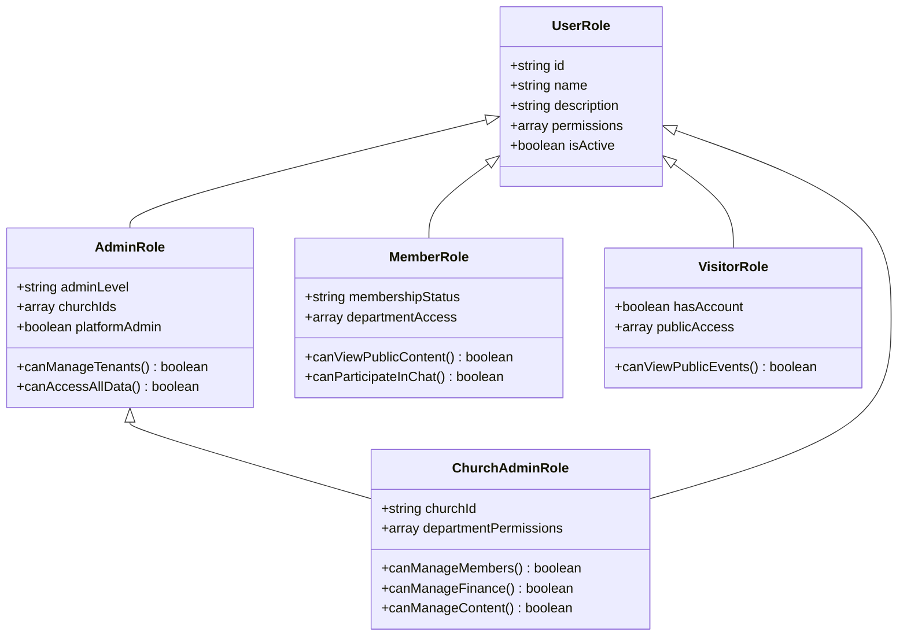
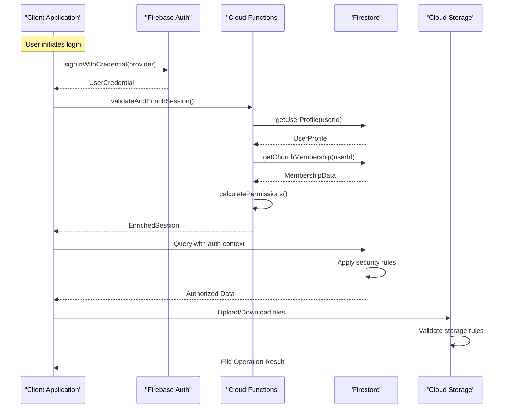
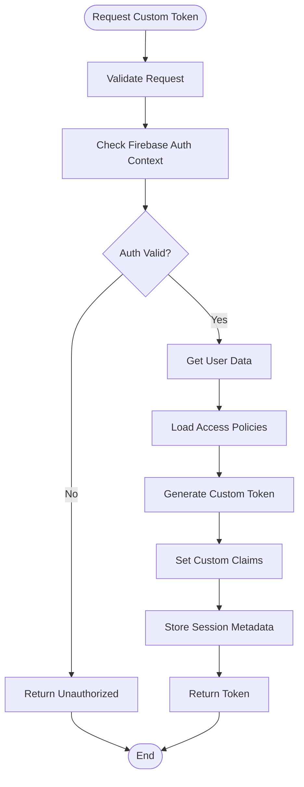
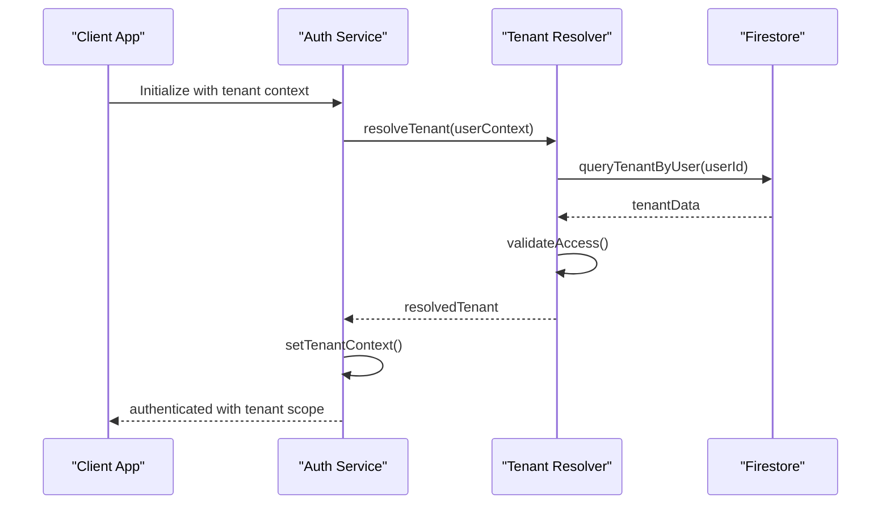

# Authentication & Authorization

<cite>
**Referenced Files in This Document**
- [firestore.rules](file://firestore.rules)
- [storage.rules](file://storage.rules)
- [functions/src/index.ts](file://functions/src/index.ts)
- [flutter_app/lib/main.dart](file://flutter_app/lib/main.dart)
- [flutter_app/lib/firebase_options.dart](file://flutter_app/lib/firebase_options.dart)
- [functions/src/masterPlatformAuth.ts](file://functions/src/masterPlatformAuth.ts)
- [functions/src/memberAccessPolicy.ts](file://functions/src/memberAccessPolicy.ts)
- [functions/src/membroSessionSync.ts](file://functions/src/membroSessionSync.ts)
- [functions/src/tenantCallableResolve.ts](file://functions/src/tenantCallableResolve.ts)
- [functions/package.json](file://functions/package.json)
- [flutter_app/pubspec.yaml](file://flutter_app/pubspec.yaml)
</cite>

## Table of Contents
1. [Introduction](#introduction)
2. [Project Structure](#project-structure)
3. [Core Components](#core-components)
4. [Architecture Overview](#architecture-overview)
5. [Detailed Component Analysis](#detailed-component-analysis)
6. [Dependency Analysis](#dependency-analysis)
7. [Performance Considerations](#performance-considerations)
8. [Troubleshooting Guide](#troubleshooting-guide)
9. [Conclusion](#conclusion)

## Introduction

The Gestão Yahweh Premium system implements a comprehensive multi-provider authentication and authorization framework built on Firebase Authentication and Firestore security rules. The system supports Google Sign-In, Email/Password authentication, and Phone number verification, providing secure access control for church management operations across multiple tenants (churches).

The authentication architecture follows a multi-tenant design where each church operates as an isolated tenant with its own user roles, permissions, and data access policies. The system enforces role-based access control (RBAC) through custom claims, Firestore security rules, and Cloud Functions for server-side validation.

## Project Structure

The authentication system is distributed across multiple layers:

```mermaid
graph TB
subgraph "Client Layer"
Flutter[Flutter App]
Web[Web Interface]
Mobile[Mobile Apps]
end
subgraph "Authentication Layer"
FirebaseAuth[Firebase Auth]
GoogleProvider[Google Provider]
EmailProvider[Email Provider]
PhoneProvider[Phone Provider]
end
sub7="Security Layer"
FirestoreRules[Firestore Rules]
StorageRules[Storage Rules]
CustomClaims[Custom Claims]
end
subgraph "Business Logic Layer"
CloudFunctions[Cloud Functions]
TenantResolver[Tenant Resolver]
AccessPolicy[Access Policy Engine]
end
subgraph "Data Layer"
Firestore[(Firestore)]
Storage[(Cloud Storage)]
Users[(User Collection)]
Tenants[(Tenant Collection)]
end
Flutter --> FirebaseAuth
Web --> FirebaseAuth
Mobile --> FirebaseAuth
FirebaseAuth --> GoogleProvider
FirebaseAuth --> EmailProvider
FirebaseAuth --> PhoneProvider
FirebaseAuth --> FirestoreRules
FirebaseAuth --> StorageRules
FirebaseAuth --> CustomClaims
CloudFunctions --> TenantResolver
CloudFunctions --> AccessPolicy
FirestoreRules --> Firestore
StorageRules --> Storage
AccessPolicy --> Users
AccessPolicy --> Tenants
```

**Diagram sources**
- [flutter_app/lib/main.dart:1-50](file://flutter_app/lib/main.dart#L1-L50)
- [functions/src/index.ts:1-100](file://functions/src/index.ts#L1-L100)
- [firestore.rules:1-200](file://firestore.rules#L1-L200)

**Section sources**
- [flutter_app/lib/main.dart:1-100](file://flutter_app/lib/main.dart#L1-L100)
- [functions/src/index.ts:1-50](file://functions/src/index.ts#L1-L50)

## Core Components

### Multi-Provider Authentication System

The system supports three primary authentication providers:

#### Google Sign-In Integration
- OAuth 2.0 flow with Google Identity Platform
- Automatic profile synchronization
- Cross-platform support (Web, Android, iOS)
- Secure token handling and session management

#### Email/Password Authentication
- Standard email and password authentication
- Password reset functionality
- Email verification requirements
- Account recovery mechanisms

#### Phone Number Authentication
- SMS-based verification codes
- ReCAPTCHA integration for spam prevention
- Silent sign-in capabilities
- International phone number support

### Role-Based Access Control (RBAC)

The system implements a hierarchical role structure:



**Diagram sources**
- [functions/src/memberAccessPolicy.ts:1-150](file://functions/src/memberAccessPolicy.ts#L1-L150)
- [functions/src/masterPlatformAuth.ts:1-100](file://functions/src/masterPlatformAuth.ts#L1-L100)

### Session Management

The system maintains secure sessions through:

- Firebase ID tokens with automatic refresh
- Custom session metadata tracking
- Device fingerprinting for security
- Concurrent session limits per user
- Session activity monitoring

**Section sources**
- [functions/src/membroSessionSync.ts:1-200](file://functions/src/membroSessionSync.ts#L1-L200)
- [functions/src/memberAccessPolicy.ts:1-100](file://functions/src/memberAccessPolicy.ts#L1-L100)

## Architecture Overview

The authentication architecture follows a layered approach with clear separation of concerns:



**Diagram sources**
- [functions/src/tenantCallableResolve.ts:1-150](file://functions/src/tenantCallableResolve.ts#L1-L150)
- [functions/src/membroSessionSync.ts:1-100](file://functions/src/membroSessionSync.ts#L1-L100)

## Detailed Component Analysis

### Firebase Authentication Integration

The Flutter application integrates Firebase Authentication through a centralized service layer:

#### Authentication Service Architecture
- Singleton pattern for consistent auth state management
- Reactive streams for real-time auth state updates
- Error handling and retry mechanisms
- Platform-specific optimizations

#### Provider Configuration
- Dynamic provider enablement based on tenant configuration
- Environment-specific provider settings
- Fallback mechanisms for provider failures
- Analytics integration for provider usage tracking

**Section sources**
- [flutter_app/lib/firebase_options.dart:1-100](file://flutter_app/lib/firebase_options.dart#L1-L100)
- [flutter_app/pubspec.yaml:1-50](file://flutter_app/pubspec.yaml#L1-L50)

### Custom Token Generation and Validation

Cloud Functions handle custom token generation for enhanced security:

#### Token Generation Flow


**Diagram sources**
- [functions/src/masterPlatformAuth.ts:1-200](file://functions/src/masterPlatformAuth.ts#L1-L200)
- [functions/src/memberAccessPolicy.ts:1-150](file://functions/src/memberAccessPolicy.ts#L1-L150)

### Permission Enforcement Through Firestore Rules

Firestore security rules enforce fine-grained access control:

#### Rule Structure
- Tenant isolation at collection level
- Role-based document access
- Field-level permissions
- Conditional access based on data relationships

#### Security Rule Categories
- **User Management**: Profile access and modification
- **Church Data**: Tenant-scoped data access
- **Member Management**: Role-based member operations
- **Financial Data**: Restricted financial information access
- **Content Management**: Role-based content operations

**Section sources**
- [firestore.rules:1-300](file://firestore.rules#L1-L300)
- [storage.rules:1-200](file://storage.rules#L1-L200)

### Tenant-Specific Authentication

The system implements multi-tenant authentication with complete data isolation:

#### Tenant Resolution Process


**Diagram sources**
- [functions/src/tenantCallableResolve.ts:1-150](file://functions/src/tenantCallableResolve.ts#L1-L150)

### Admin Privileges and Member Access Levels

The system provides granular permission controls:

#### Admin Hierarchy
- **Platform Administrators**: Full system access
- **Church Administrators**: Tenant-specific administrative access
- **Department Managers**: Department-scoped permissions
- **Regular Members**: Basic member access
- **Visitors**: Limited public access

#### Permission Matrix
- **User Management**: Create, read, update, delete operations
- **Content Management**: Publish, edit, moderate content
- **Financial Operations**: View reports, manage transactions
- **System Administration**: Configure settings, manage users

**Section sources**
- [functions/src/memberAccessPolicy.ts:1-200](file://functions/src/memberAccessPolicy.ts#L1-L200)

## Dependency Analysis

The authentication system has well-defined dependencies between components:

```mermaid
graph TD
subgraph "Client Dependencies"
FlutterAuth[firebase_auth]
FlutterFire[firebase_core]
FlutterStorage[firebase_storage]
end
subgraph "Server Dependencies"
FirebaseAdmin[firebase-admin]
FirestoreDB[@google-cloud/firestore]
StorageSDK[@google-cloud/storage]
end
subgraph "Shared Dependencies"
JWT[jwt]
Crypto[crypto]
Validation[zod]
end
FlutterAuth --> FlutterFire
FlutterStorage --> FlutterFire
FirebaseAdmin --> FirestoreDB
FirebaseAdmin --> StorageSDK
FlutterAuth --> JWT
FirebaseAdmin --> JWT
JWT --> Crypto
Validation --> Crypto
```

**Diagram sources**
- [functions/package.json:1-100](file://functions/package.json#L1-L100)
- [flutter_app/pubspec.yaml:1-100](file://flutter_app/pubspec.yaml#L1-L100)

**Section sources**
- [functions/package.json:1-150](file://functions/package.json#L1-L150)
- [flutter_app/pubspec.yaml:1-150](file://flutter_app/pubspec.yaml#L1-L150)

## Performance Considerations

### Authentication Performance Optimizations
- **Caching Strategies**: Local caching of user profiles and permissions
- **Connection Pooling**: Efficient database connections for Cloud Functions
- **Lazy Loading**: Deferred loading of non-critical authentication data
- **Batch Operations**: Grouped Firestore queries for better performance

### Security Performance Impact
- **Rule Optimization**: Minimized Firestore rule complexity
- **Index Usage**: Proper indexing for authentication queries
- **Function Cold Starts**: Optimized Cloud Function initialization
- **Network Optimization**: Reduced round-trips for authentication flows

## Troubleshooting Guide

### Common Authentication Issues

#### Provider Configuration Problems
- Verify provider credentials in Firebase Console
- Check domain restrictions for web applications
- Ensure proper redirect URIs are configured
- Validate SSL certificates for production environments

#### Permission Denied Errors
- Review Firestore security rules syntax
- Verify user roles and claims are properly set
- Check tenant context resolution
- Validate data ownership relationships

#### Session Management Issues
- Monitor token expiration and refresh cycles
- Clear corrupted local storage
- Reset authentication state when needed
- Handle concurrent session conflicts

### Debugging Tools and Techniques
- **Firebase Console**: Real-time authentication logs
- **Cloud Functions Logging**: Server-side authentication flow debugging
- **Browser DevTools**: Network request inspection
- **Mobile Debugging**: Platform-specific authentication debugging

**Section sources**
- [functions/src/membroSessionSync.ts:1-100](file://functions/src/membroSessionSync.ts#L1-L100)

## Conclusion

The Gestão Yahweh Premium authentication and authorization system provides a robust, scalable, and secure foundation for multi-tenant church management. The implementation leverages Firebase's native authentication capabilities while extending them with custom business logic through Cloud Functions and fine-grained access control through Firestore security rules.

Key strengths of the system include:
- **Multi-Provider Support**: Flexible authentication options for diverse user bases
- **Role-Based Access Control**: Granular permissions aligned with organizational structures
- **Tenant Isolation**: Complete data separation between different churches
- **Security Best Practices**: Comprehensive protection against common vulnerabilities
- **Scalability**: Architecture designed to handle growing user bases and data volumes

The system's modular design allows for easy extension and customization while maintaining security and performance standards. Future enhancements can build upon this foundation to add additional authentication providers, enhance security measures, or expand role definitions as organizational needs evolve.