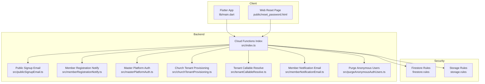
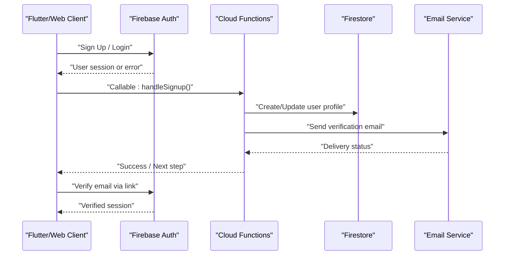
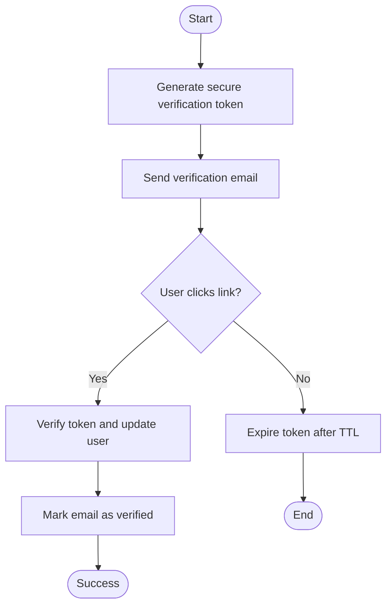
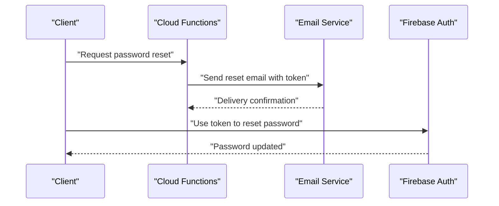
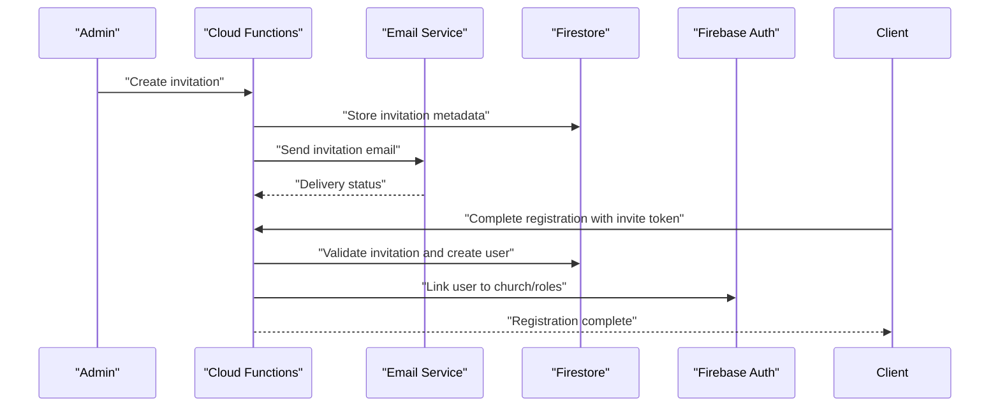
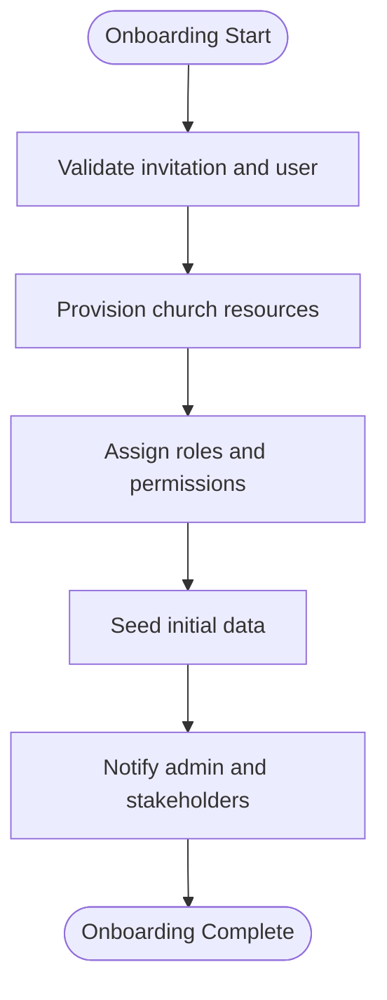
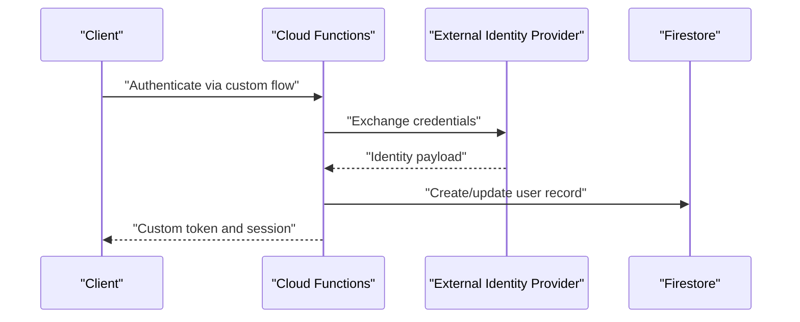
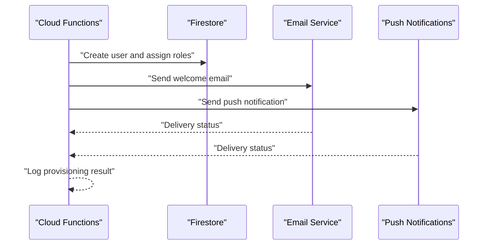
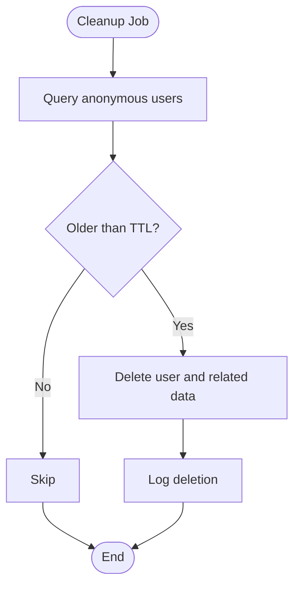
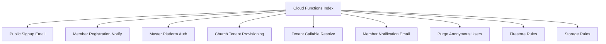

# Custom Authentication Flows

<cite>
**Referenced Files in This Document**
- [functions/src/index.ts](file://functions/src/index.ts)
- [functions/src/publicSignupEmail.ts](file://functions/src/publicSignupEmail.ts)
- [functions/src/memberRegistrationNotify.ts](file://functions/src/memberRegistrationNotify.ts)
- [functions/src/masterPlatformAuth.ts](file://functions/src/masterPlatformAuth.ts)
- [functions/src/churchTenantProvisioning.ts](file://functions/src/churchTenantProvisioning.ts)
- [functions/src/tenantCallableResolve.ts](file://functions/src/tenantCallableResolve.ts)
- [functions/src/memberNotificationEmail.ts](file://functions/src/memberNotificationEmail.ts)
- [functions/src/purgeAnonymousAuthUsers.ts](file://functions/src/purgeAnonymousAuthUsers.ts)
- [functions/package.json](file://functions/package.json)
- [firestore.rules](file://firestore.rules)
- [storage.rules](file://storage.rules)
- [flutter_app/lib/main.dart](file://flutter_app/lib/main.dart)
- [flutter_app/public/reset_password.html](file://flutter_app/public/reset_password.html)
</cite>

## Table of Contents
1. [Introduction](#introduction)
2. [Project Structure](#project-structure)
3. [Core Components](#core-components)
4. [Architecture Overview](#architecture-overview)
5. [Detailed Component Analysis](#detailed-component-analysis)
6. [Dependency Analysis](#dependency-analysis)
7. [Performance Considerations](#performance-considerations)
8. [Troubleshooting Guide](#troubleshooting-guide)
9. [Conclusion](#conclusion)
10. [Appendices](#appendices)

## Introduction
This document explains the custom authentication flows implemented in Gestão Yahweh Premium, focusing on:
- Email verification and password reset
- Invitation-based registration
- Church-specific onboarding and tenant provisioning
- Custom token generation and webhook integrations
- Automated user provisioning and notification systems
- Implementation guidance for custom auth endpoints, invite-only registration, and external identity provider integration
- Error handling, UX optimization, and security considerations

The system combines Firebase Authentication with Cloud Functions to orchestrate secure, scalable workflows across mobile, web, and backend services.

## Project Structure
At a high level, the project is organized into:
- Flutter app (client): handles UI, local state, and calls to Firebase APIs and Cloud Functions
- Cloud Functions (backend): implements business logic for auth flows, notifications, tenant provisioning, and integrations
- Security rules (Firestore and Storage): enforce access control and data validation
- Web assets: static pages such as password reset templates

**Diagram sources**
- [flutter_app/lib/main.dart](file://flutter_app/lib/main.dart)
- [flutter_app/public/reset_password.html](file://flutter_app/public/reset_password.html)
- [functions/src/index.ts](file://functions/src/index.ts)
- [functions/src/publicSignupEmail.ts](file://functions/src/publicSignupEmail.ts)
- [functions/src/memberRegistrationNotify.ts](file://functions/src/memberRegistrationNotify.ts)
- [functions/src/masterPlatformAuth.ts](file://functions/src/masterPlatformAuth.ts)
- [functions/src/churchTenantProvisioning.ts](file://functions/src/churchTenantProvisioning.ts)
- [functions/src/tenantCallableResolve.ts](file://functions/src/tenantCallableResolve.ts)
- [functions/src/memberNotificationEmail.ts](file://functions/src/memberNotificationEmail.ts)
- [functions/src/purgeAnonymousAuthUsers.ts](file://functions/src/purgeAnonymousAuthUsers.ts)
- [firestore.rules](file://firestore.rules)
- [storage.rules](file://storage.rules)

**Section sources**
- [functions/package.json](file://functions/package.json)
- [firestore.rules](file://firestore.rules)
- [storage.rules](file://storage.rules)
- [flutter_app/lib/main.dart](file://flutter_app/lib/main.dart)
- [flutter_app/public/reset_password.html](file://flutter_app/public/reset_password.html)

## Core Components
- Cloud Functions entrypoint and routing: centralizes callable and HTTP functions for auth flows
- Public signup email handler: processes public signups and triggers verification emails
- Member registration notifier: emits events when new members register
- Master platform auth: manages platform-level authentication and cross-tenant operations
- Church tenant provisioning: provisions church-specific resources and onboards users
- Tenant callable resolver: resolves tenant context for multi-tenant requests
- Member notification email: sends templated emails for member-related events
- Anonymous user purger: cleans up stale anonymous accounts

These components collaborate to implement secure, auditable, and scalable authentication and onboarding.

**Section sources**
- [functions/src/index.ts](file://functions/src/index.ts)
- [functions/src/publicSignupEmail.ts](file://functions/src/publicSignupEmail.ts)
- [functions/src/memberRegistrationNotify.ts](file://functions/src/memberRegistrationNotify.ts)
- [functions/src/masterPlatformAuth.ts](file://functions/src/masterPlatformAuth.ts)
- [functions/src/churchTenantProvisioning.ts](file://functions/src/churchTenantProvisioning.ts)
- [functions/src/tenantCallableResolve.ts](file://functions/src/tenantCallableResolve.ts)
- [functions/src/memberNotificationEmail.ts](file://functions/src/memberNotificationEmail.ts)
- [functions/src/purgeAnonymousAuthUsers.ts](file://functions/src/purgeAnonymousAuthUsers.ts)

## Architecture Overview
The authentication architecture follows a client-server pattern with Firebase Authentication and Cloud Functions orchestrating flows:

**Diagram sources**
- [functions/src/index.ts](file://functions/src/index.ts)
- [functions/src/publicSignupEmail.ts](file://functions/src/publicSignupEmail.ts)
- [functions/src/memberRegistrationNotify.ts](file://functions/src/memberRegistrationNotify.ts)

## Detailed Component Analysis

### Email Verification Flow
- Triggered after successful signup via Cloud Function
- Generates a secure verification token and sends an email with a verification link
- On click, redirects to a web page that verifies the token and updates the user’s verified status

**Diagram sources**
- [functions/src/publicSignupEmail.ts](file://functions/src/publicSignupEmail.ts)
- [flutter_app/public/reset_password.html](file://flutter_app/public/reset_password.html)

**Section sources**
- [functions/src/publicSignupEmail.ts](file://functions/src/publicSignupEmail.ts)
- [flutter_app/public/reset_password.html](file://flutter_app/public/reset_password.html)

### Password Reset Flow
- User initiates reset from client or web page
- Cloud Function generates a secure reset token and sends a reset email
- Web page validates token and allows setting a new password

**Diagram sources**
- [functions/src/memberNotificationEmail.ts](file://functions/src/memberNotificationEmail.ts)
- [flutter_app/public/reset_password.html](file://flutter_app/public/reset_password.html)

**Section sources**
- [functions/src/memberNotificationEmail.ts](file://functions/src/memberNotificationEmail.ts)
- [flutter_app/public/reset_password.html](file://flutter_app/public/reset_password.html)

### Invitation-Based Registration
- Admin generates an invitation with a unique token
- Invitee receives an email with a registration link
- On completion, the system creates the user, assigns roles, and provisions church resources

**Diagram sources**
- [functions/src/memberRegistrationNotify.ts](file://functions/src/memberRegistrationNotify.ts)
- [functions/src/churchTenantProvisioning.ts](file://functions/src/churchTenantProvisioning.ts)

**Section sources**
- [functions/src/memberRegistrationNotify.ts](file://functions/src/memberRegistrationNotify.ts)
- [functions/src/churchTenantProvisioning.ts](file://functions/src/churchTenantProvisioning.ts)

### Church-Specific Onboarding
- Upon successful registration, the system provisions church-specific resources
- Assigns roles, initializes church data structures, and sets up permissions

**Diagram sources**
- [functions/src/churchTenantProvisioning.ts](file://functions/src/churchTenantProvisioning.ts)

**Section sources**
- [functions/src/churchTenantProvisioning.ts](file://functions/src/churchTenantProvisioning.ts)

### Custom Token Generation and Webhook Integrations
- Custom tokens can be generated for service-to-service authentication
- Webhooks integrate with external identity providers and third-party services

**Diagram sources**
- [functions/src/masterPlatformAuth.ts](file://functions/src/masterPlatformAuth.ts)
- [functions/src/tenantCallableResolve.ts](file://functions/src/tenantCallableResolve.ts)

**Section sources**
- [functions/src/masterPlatformAuth.ts](file://functions/src/masterPlatformAuth.ts)
- [functions/src/tenantCallableResolve.ts](file://functions/src/tenantCallableResolve.ts)

### Automated User Provisioning and Notifications
- New users are automatically provisioned with necessary resources
- Notifications are sent to admins and relevant parties

**Diagram sources**
- [functions/src/memberRegistrationNotify.ts](file://functions/src/memberRegistrationNotify.ts)
- [functions/src/memberNotificationEmail.ts](file://functions/src/memberNotificationEmail.ts)

**Section sources**
- [functions/src/memberRegistrationNotify.ts](file://functions/src/memberRegistrationNotify.ts)
- [functions/src/memberNotificationEmail.ts](file://functions/src/memberNotificationEmail.ts)

### Anonymous User Cleanup
- Periodic cleanup removes stale anonymous accounts to maintain data hygiene

**Diagram sources**
- [functions/src/purgeAnonymousAuthUsers.ts](file://functions/src/purgeAnonymousAuthUsers.ts)

**Section sources**
- [functions/src/purgeAnonymousAuthUsers.ts](file://functions/src/purgeAnonymousAuthUsers.ts)

## Dependency Analysis
Key dependencies include:
- Firebase Authentication for user management
- Firestore for persistent storage and security rules
- Cloud Functions for serverless orchestration
- Email and push notification services for communication
- External identity providers for federated login

**Diagram sources**
- [functions/src/index.ts](file://functions/src/index.ts)
- [functions/src/publicSignupEmail.ts](file://functions/src/publicSignupEmail.ts)
- [functions/src/memberRegistrationNotify.ts](file://functions/src/memberRegistrationNotify.ts)
- [functions/src/masterPlatformAuth.ts](file://functions/src/masterPlatformAuth.ts)
- [functions/src/churchTenantProvisioning.ts](file://functions/src/churchTenantProvisioning.ts)
- [functions/src/tenantCallableResolve.ts](file://functions/src/tenantCallableResolve.ts)
- [functions/src/memberNotificationEmail.ts](file://functions/src/memberNotificationEmail.ts)
- [functions/src/purgeAnonymousAuthUsers.ts](file://functions/src/purgeAnonymousAuthUsers.ts)
- [firestore.rules](file://firestore.rules)
- [storage.rules](file://storage.rules)

**Section sources**
- [functions/package.json](file://functions/package.json)
- [firestore.rules](file://firestore.rules)
- [storage.rules](file://storage.rules)

## Performance Considerations
- Use efficient Firestore queries and indexes to minimize latency
- Cache frequently accessed data where appropriate
- Implement retry logic for external API calls
- Optimize email and push notification delivery with batching
- Monitor function execution times and adjust resource allocation

[No sources needed since this section provides general guidance]

## Troubleshooting Guide
Common issues and resolutions:
- Email delivery failures: check email service configuration and spam filters
- Token expiration: ensure proper TTL settings and reissuance logic
- Permission errors: review Firestore and Storage rules
- Anonymous account cleanup: verify TTL thresholds and deletion policies

**Section sources**
- [functions/src/publicSignupEmail.ts](file://functions/src/publicSignupEmail.ts)
- [functions/src/memberNotificationEmail.ts](file://functions/src/memberNotificationEmail.ts)
- [functions/src/purgeAnonymousAuthUsers.ts](file://functions/src/purgeAnonymousAuthUsers.ts)
- [firestore.rules](file://firestore.rules)
- [storage.rules](file://storage.rules)

## Conclusion
Gestão Yahweh Premium implements robust, scalable authentication flows through Firebase and Cloud Functions. The system supports email verification, password resets, invitation-based registration, and church-specific onboarding. By leveraging secure token generation, webhook integrations, and automated provisioning, it ensures a seamless and secure user experience while maintaining strict security and performance standards.

[No sources needed since this section summarizes without analyzing specific files]

## Appendices
- Best practices for custom auth endpoints
- Guidelines for implementing invite-only registration
- Integration patterns for external identity providers
- Security considerations for token handling and email templates
- UX optimization techniques for authentication flows

[No sources needed since this section provides general guidance]