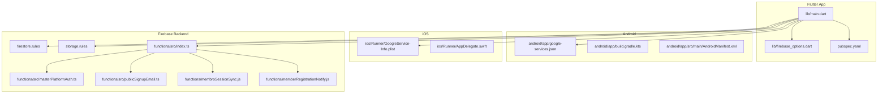
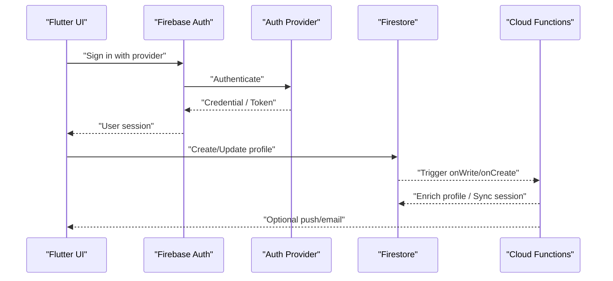
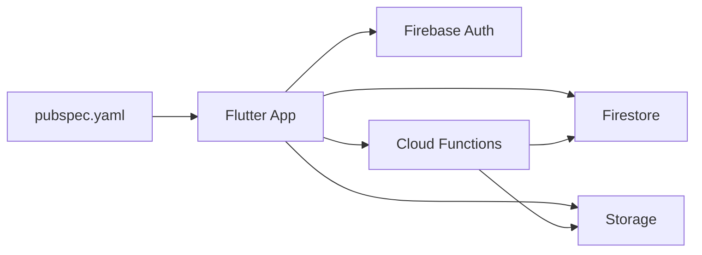

# Multi-Provider Authentication

<cite>
**Referenced Files in This Document**
- [main.dart](file://flutter_app/lib/main.dart)
- [firebase_options.dart](file://flutter_app/lib/firebase_options.dart)
- [pubspec.yaml](file://flutter_app/pubspec.yaml)
- [google-services.json](file://flutter_app/android/app/google-services.json)
- [GoogleService-Info.plist](file://flutter_app/ios/Runner/GoogleService-Info.plist)
- [firestore.rules](file://firestore.rules)
- [storage.rules](file://storage.rules)
- [index.ts](file://functions/src/index.ts)
- [masterPlatformAuth.ts](file://functions/src/masterPlatformAuth.ts)
- [publicSignupEmail.ts](file://functions/src/publicSignupEmail.ts)
- [membroSessionSync.js](file://functions/membroSessionSync.js)
- [memberRegistrationNotify.js](file://functions/memberRegistrationNotify.js)
- [android/build.gradle.kts](file://flutter_app/android/app/build.gradle.kts)
- [AndroidManifest.xml](file://flutter_app/android/app/src/main/AndroidManifest.xml)
- [AppDelegate.swift](file://flutter_app/ios/Runner/AppDelegate.swift)
</cite>

## Table of Contents
1. [Introduction](#introduction)
2. [Project Structure](#project-structure)
3. [Core Components](#core-components)
4. [Architecture Overview](#architecture-overview)
5. [Detailed Component Analysis](#detailed-component-analysis)
6. [Dependency Analysis](#dependency-analysis)
7. [Performance Considerations](#performance-considerations)
8. [Troubleshooting Guide](#troubleshooting-guide)
9. [Conclusion](#conclusion)

## Introduction
This document explains multi-provider authentication for Gestão Yahweh Premium, covering Google Sign-In, Email/Password, Phone authentication, and custom provider implementations. It details Firebase Authentication integration, provider configuration across platforms, user registration flows, state handling, error management, and profile management. It also includes security considerations, provider-specific settings, and troubleshooting guidance.

## Project Structure
The Flutter app integrates Firebase via platform-specific configuration files and a central options file. Authentication providers are enabled through the Firebase console and wired into the app using standard FlutterFire packages. Cloud Functions handle backend tasks such as email notifications and session synchronization. Security is enforced by Firestore and Storage rules.

**Diagram sources**
- [main.dart](file://flutter_app/lib/main.dart)
- [firebase_options.dart](file://flutter_app/lib/firebase_options.dart)
- [pubspec.yaml](file://flutter_app/pubspec.yaml)
- [google-services.json](file://flutter_app/android/app/google-services.json)
- [GoogleService-Info.plist](file://flutter_app/ios/Runner/GoogleService-Info.plist)
- [firestore.rules](file://firestore.rules)
- [storage.rules](file://storage.rules)
- [index.ts](file://functions/src/index.ts)
- [masterPlatformAuth.ts](file://functions/src/masterPlatformAuth.ts)
- [publicSignupEmail.ts](file://functions/src/publicSignupEmail.ts)
- [membroSessionSync.js](file://functions/membroSessionSync.js)
- [memberRegistrationNotify.js](file://functions/memberRegistrationNotify.js)

**Section sources**
- [main.dart](file://flutter_app/lib/main.dart)
- [firebase_options.dart](file://flutter_app/lib/firebase_options.dart)
- [pubspec.yaml](file://flutter_app/pubspec.yaml)
- [google-services.json](file://flutter_app/android/app/google-services.json)
- [GoogleService-Info.plist](file://flutter_app/ios/Runner/GoogleService-Info.plist)
- [firestore.rules](file://firestore.rules)
- [storage.rules](file://storage.rules)
- [index.ts](file://functions/src/index.ts)
- [masterPlatformAuth.ts](file://functions/src/masterPlatformAuth.ts)
- [publicSignupEmail.ts](file://functions/src/publicSignupEmail.ts)
- [membroSessionSync.js](file://functions/membroSessionSync.js)
- [memberRegistrationNotify.js](file://functions/memberRegistrationNotify.js)

## Core Components
- Firebase initialization and options: Centralized configuration ensures consistent setup across platforms.
- Provider enablement: Google, Email/Password, and Phone are configured via Firebase console and FlutterFire.
- State management: Auth state changes drive UI routing and feature access.
- Profile management: User metadata is stored and synchronized with Firestore.
- Cloud Functions: Triggered on auth events to send emails, sync sessions, and enforce policies.

Key responsibilities:
- Initialize Firebase with platform-specific options.
- Provide a unified auth service that abstracts provider calls.
- Listen to auth state changes to update application state.
- Persist and retrieve user profiles from Firestore.
- Enforce security via Firestore and Storage rules.

**Section sources**
- [firebase_options.dart](file://flutter_app/lib/firebase_options.dart)
- [pubspec.yaml](file://flutter_app/pubspec.yaml)
- [firestore.rules](file://firestore.rules)
- [storage.rules](file://storage.rules)
- [index.ts](file://functions/src/index.ts)

## Architecture Overview
Authentication flows span the Flutter client, Firebase Authentication, and Cloud Functions. Providers are invoked from the app, which then updates local state and persists profile data. Backend functions react to auth events to perform side effects like notifications and session syncing.

**Diagram sources**
- [index.ts](file://functions/src/index.ts)
- [masterPlatformAuth.ts](file://functions/src/masterPlatformAuth.ts)
- [publicSignupEmail.ts](file://functions/src/publicSignupEmail.ts)
- [membroSessionSync.js](file://functions/membroSessionSync.js)
- [memberRegistrationNotify.js](file://functions/memberRegistrationNotify.js)

## Detailed Component Analysis

### Firebase Initialization and Options
- Platform-specific configuration files provide project identifiers and API keys.
- The Flutter app loads these options at startup to initialize Firebase services consistently.

Implementation highlights:
- Android uses google-services.json.
- iOS uses GoogleService-Info.plist.
- Flutter uses a generated options file to configure Firebase.

Security notes:
- Keep secrets out of source control; use environment variables or secure storage where applicable.
- Validate domain allowlists for web OAuth callbacks.

**Section sources**
- [google-services.json](file://flutter_app/android/app/google-services.json)
- [GoogleService-Info.plist](file://flutter_app/ios/Runner/GoogleService-Info.plist)
- [firebase_options.dart](file://flutter_app/lib/firebase_options.dart)

### Provider Configuration and Enablement
- Google Sign-In: Configure in Firebase console and ensure platform-specific OAuth settings (Android SHA-1/SHA-256, iOS bundle ID).
- Email/Password: Enable in Firebase console; implement validation and password reset flows.
- Phone: Enable in Firebase console; handle reCAPTCHA verification and rate limiting.
- Custom providers: Use Firebase’s generic sign-in mechanisms or integrate third-party SDKs and exchange tokens server-side.

Best practices:
- Centralize provider toggles and feature flags.
- Validate provider responses before trusting them.
- Handle platform differences gracefully.

**Section sources**
- [pubspec.yaml](file://flutter_app/pubspec.yaml)
- [AndroidManifest.xml](file://flutter_app/android/app/src/main/AndroidManifest.xml)
- [AppDelegate.swift](file://flutter_app/ios/Runner/AppDelegate.swift)

### Authentication State Management
- Subscribe to auth state changes to update UI and route users appropriately.
- Maintain a single source of truth for the current user and role-based permissions.
- Implement logout flows that clear local caches and reset state.

Error handling:
- Catch network errors and transient failures.
- Present user-friendly messages for invalid credentials or account issues.

**Section sources**
- [main.dart](file://flutter_app/lib/main.dart)

### User Registration and Profile Management
- On first login, create a user profile in Firestore with essential fields (display name, email, roles).
- Update profile on provider metadata changes (e.g., display picture).
- Enforce write permissions via Firestore rules.

Data model considerations:
- Normalize tenant/user relationships if multi-tenant.
- Store minimal PII; link sensitive data securely.

**Section sources**
- [firestore.rules](file://firestore.rules)
- [storage.rules](file://storage.rules)

### Cloud Functions Integration
- publicSignupEmail: Sends welcome emails upon new user creation.
- membroSessionSync: Synchronizes session data across tenants or devices.
- masterPlatformAuth: Validates platform-level auth tokens and enforces policies.

Triggers:
- Firestore onCreate/onWrite triggers for profile enrichment.
- Callable functions for secure operations requiring server-side logic.

**Section sources**
- [publicSignupEmail.ts](file://functions/src/publicSignupEmail.ts)
- [membroSessionSync.js](file://functions/membroSessionSync.js)
- [masterPlatformAuth.ts](file://functions/src/masterPlatformAuth.ts)
- [index.ts](file://functions/src/index.ts)

### Security Rules and Access Control
- Firestore rules restrict read/write based on authenticated user and tenant context.
- Storage rules protect media assets and enforce ownership checks.
- Functions validate inputs and enforce business logic beyond client-side checks.

Recommendations:
- Least privilege principle for rule grants.
- Regular audits of rule changes and function permissions.

**Section sources**
- [firestore.rules](file://firestore.rules)
- [storage.rules](file://storage.rules)

### Platform-Specific Setup Details
- Android: Ensure correct package names, signing configurations, and OAuth client IDs.
- iOS: Configure bundle identifiers, associated domains, and Apple Sign-In if used.
- Web: Set up authorized domains and redirect URIs for OAuth.

Build-time considerations:
- Verify Gradle and Pod dependencies align with Firebase versions.
- Avoid hardcoding secrets; use secure injection mechanisms.

**Section sources**
- [android/build.gradle.kts](file://flutter_app/android/app/build.gradle.kts)
- [AndroidManifest.xml](file://flutter_app/android/app/src/main/AndroidManifest.xml)
- [GoogleService-Info.plist](file://flutter_app/ios/Runner/GoogleService-Info.plist)
- [AppDelegate.swift](file://flutter_app/ios/Runner/AppDelegate.swift)

## Dependency Analysis
The app depends on Firebase packages declared in pubspec.yaml. Platform configs wire Firebase into native builds. Cloud Functions depend on Firebase Admin SDK and interact with Firestore and Storage.

**Diagram sources**
- [pubspec.yaml](file://flutter_app/pubspec.yaml)
- [index.ts](file://functions/src/index.ts)

**Section sources**
- [pubspec.yaml](file://flutter_app/pubspec.yaml)
- [index.ts](file://functions/src/index.ts)

## Performance Considerations
- Minimize auth state rebuilds by using efficient state management patterns.
- Cache user profiles locally when appropriate and invalidate on changes.
- Debounce heavy operations triggered by auth events.
- Use Firestore offline persistence judiciously to balance consistency and performance.

[No sources needed since this section provides general guidance]

## Troubleshooting Guide
Common issues and resolutions:
- Google Sign-In fails on Android: Verify SHA-1/SHA-256 fingerprints and OAuth client configuration.
- iOS OAuth redirects fail: Check bundle identifier and associated domains.
- Email/Password login errors: Confirm provider is enabled and credentials match Firestore records.
- Phone verification timeouts: Ensure device supports SMS and reCAPTCHA; check rate limits.
- Firestore permission denied: Review rules and ensure user has required claims or roles.
- Storage upload failures: Validate ownership rules and MIME types.

Debugging steps:
- Inspect Firebase console logs and Crashlytics reports.
- Enable verbose logging during development.
- Test with emulator/device-specific configurations.

**Section sources**
- [firestore.rules](file://firestore.rules)
- [storage.rules](file://storage.rules)
- [AndroidManifest.xml](file://flutter_app/android/app/src/main/AndroidManifest.xml)
- [GoogleService-Info.plist](file://flutter_app/ios/Runner/GoogleService-Info.plist)

## Conclusion
Multi-provider authentication in Gestão Yahweh Premium leverages Firebase Authentication for secure, scalable identity management across Google, Email/Password, Phone, and custom providers. Proper configuration, robust state handling, and strict security rules ensure a reliable user experience. Cloud Functions extend functionality with server-side validations and notifications. Adhering to best practices and troubleshooting guidelines will help maintain a secure and performant authentication system.

[No sources needed since this section summarizes without analyzing specific files]