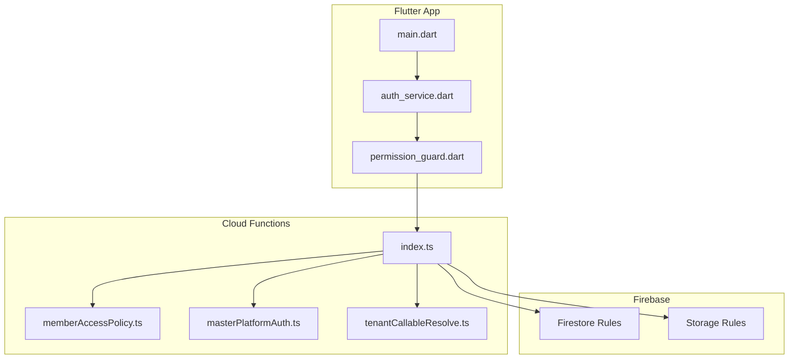
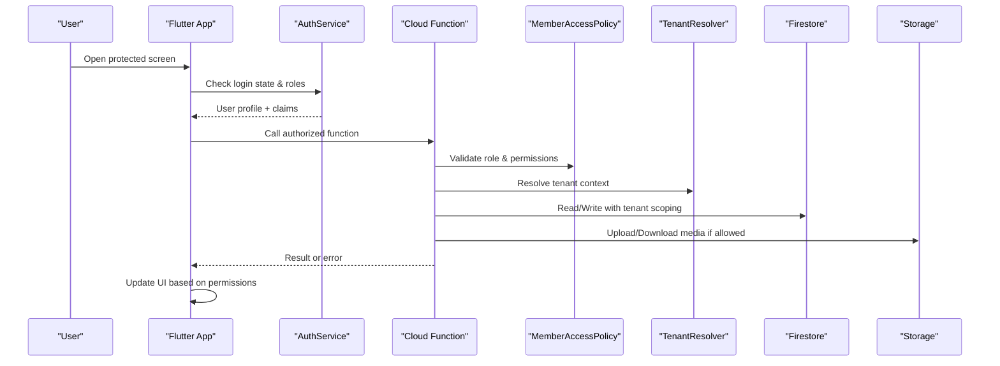
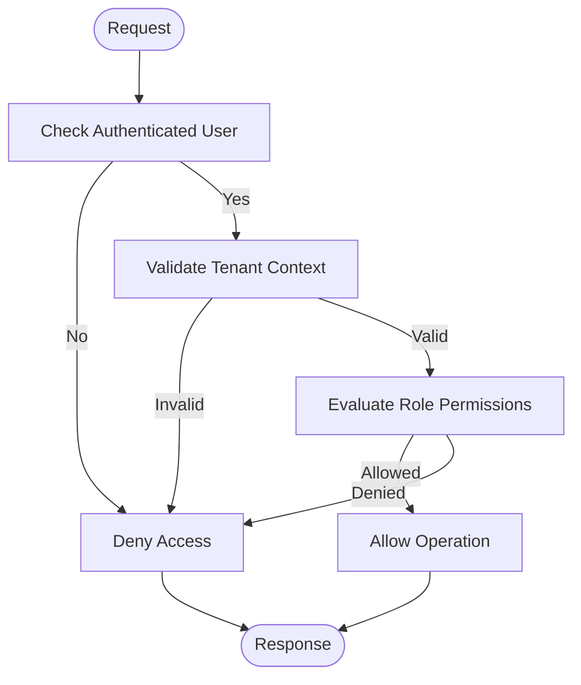
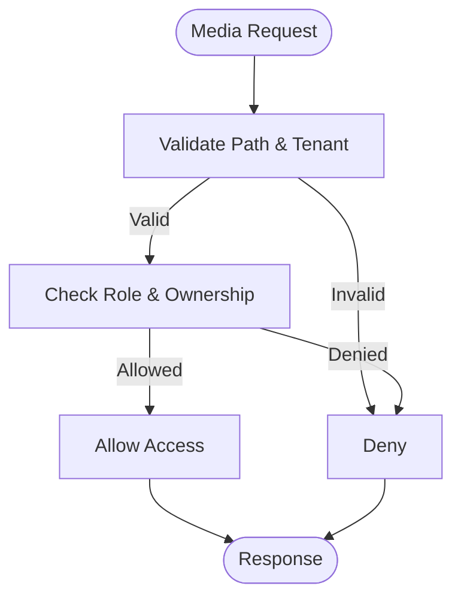
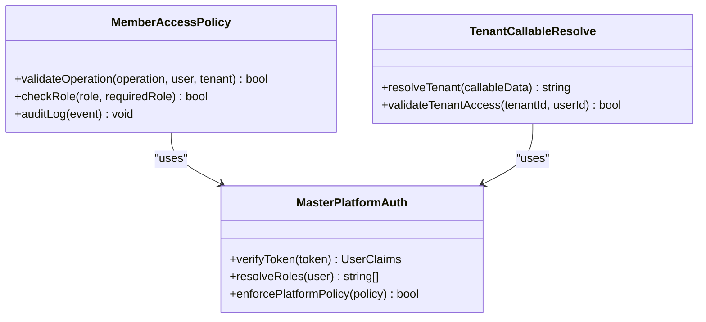
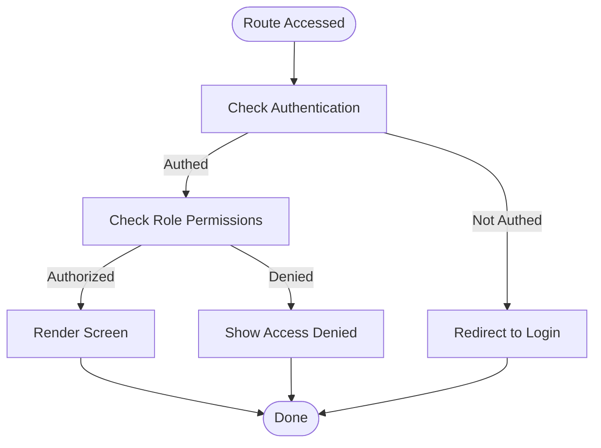
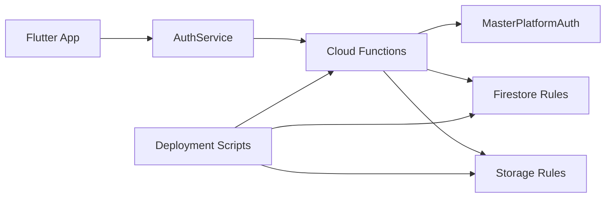

# Role-Based Access Control

<cite>
**Referenced Files in This Document**
- [firestore.rules](file://firestore.rules)
- [storage.rules](file://storage.rules)
- [functions/src/index.ts](file://functions/src/index.ts)
- [functions/src/memberAccessPolicy.ts](file://functions/src/memberAccessPolicy.ts)
- [functions/src/masterPlatformAuth.ts](file://functions/src/masterPlatformAuth.ts)
- [functions/src/tenantCallableResolve.ts](file://functions/src/tenantCallableResolve.ts)
- [flutter_app/lib/main.dart](file://flutter_app/lib/main.dart)
- [flutter_app/lib/services/auth_service.dart](file://flutter_app/lib/services/auth_service.dart)
- [flutter_app/lib/shared/permission_guard.dart](file://flutter_app/lib/shared/permission_guard.dart)
- [scripts/deploy_firebase_rules.ps1](file://scripts/deploy_firebase_rules.ps1)
- [scripts/firebase_rules_gcp_publish.cjs](file://scripts/firebase_rules_gcp_publish.cjs)
</cite>

## Table of Contents
1. [Introduction](#introduction)
2. [Project Structure](#project-structure)
3. [Core Components](#core-components)
4. [Architecture Overview](#architecture-overview)
5. [Detailed Component Analysis](#detailed-component-analysis)
6. [Dependency Analysis](#dependency-analysis)
7. [Performance Considerations](#performance-considerations)
8. [Troubleshooting Guide](#troubleshooting-guide)
9. [Conclusion](#conclusion)
10. [Appendices](#appendices)

## Introduction
This document explains the role-based access control (RBAC) system implemented in Gestão Yahweh Premium. It covers the role hierarchy, permission levels, and access policies across Firestore security rules, Cloud Functions authorization checks, and Flutter-side guards. It also provides guidance for creating custom roles, implementing permission checks, securing database operations, handling tenant-specific permissions, dynamic role assignment, and audit logging for access control.

## Project Structure
The RBAC implementation spans three layers:
- Firestore Security Rules: Enforce read/write permissions at the data layer based on authenticated user claims and tenant context.
- Cloud Functions: Provide server-side authorization checks, role resolution, and tenant scoping for sensitive operations.
- Flutter Application: Implements UI-level permission guards and client-side checks to restrict features and route access.

**Diagram sources**
- [flutter_app/lib/main.dart](file://flutter_app/lib/main.dart)
- [flutter_app/lib/services/auth_service.dart](file://flutter_app/lib/services/auth_service.dart)
- [flutter_app/lib/shared/permission_guard.dart](file://flutter_app/lib/shared/permission_guard.dart)
- [functions/src/index.ts](file://functions/src/index.ts)
- [functions/src/memberAccessPolicy.ts](file://functions/src/memberAccessPolicy.ts)
- [functions/src/masterPlatformAuth.ts](file://functions/src/masterPlatformAuth.ts)
- [functions/src/tenantCallableResolve.ts](file://functions/src/tenantCallableResolve.ts)
- [firestore.rules](file://firestore.rules)
- [storage.rules](file://storage.rules)

**Section sources**
- [firestore.rules](file://firestore.rules)
- [storage.rules](file://storage.rules)
- [functions/src/index.ts](file://functions/src/index.ts)
- [functions/src/memberAccessPolicy.ts](file://functions/src/memberAccessPolicy.ts)
- [functions/src/masterPlatformAuth.ts](file://functions/src/masterPlatformAuth.ts)
- [functions/src/tenantCallableResolve.ts](file://functions/src/tenantCallableResolve.ts)
- [flutter_app/lib/main.dart](file://flutter_app/lib/main.dart)
- [flutter_app/lib/services/auth_service.dart](file://flutter_app/lib/services/auth_service.dart)
- [flutter_app/lib/shared/permission_guard.dart](file://flutter_app/lib/shared/permission_guard.dart)

## Core Components
- Role Hierarchy: admin, pastor, member, visitor. Roles determine feature visibility and data access scope within a tenant (church).
- Permission Levels:
  - Admin: Full access to tenant resources, including configuration, members management, and financials.
  - Pastor: Elevated access to pastoral features, member communications, and limited administrative actions.
  - Member: Standard access to personal and shared church content; restricted from admin-only operations.
  - Visitor: Read-only or minimal access to public-facing features.
- Assignment and Validation:
  - Roles are assigned via Cloud Functions that validate requests and update Firestore documents securely.
  - Client-side guards enforce UI restrictions and prevent unauthorized navigation.
- Enforcement Points:
  - Firestore Rules: Validate token claims and tenant context for all reads/writes.
  - Storage Rules: Restrict media access by role and tenant ownership.
  - Cloud Functions: Centralize authorization logic for sensitive operations and cross-collection updates.
  - Flutter Guards: Hide/disable features and block routes based on current user’s role and permissions.

**Section sources**
- [functions/src/memberAccessPolicy.ts](file://functions/src/memberAccessPolicy.ts)
- [functions/src/masterPlatformAuth.ts](file://functions/src/masterPlatformAuth.ts)
- [functions/src/tenantCallableResolve.ts](file://functions/src/tenantCallableResolve.ts)
- [firestore.rules](file://firestore.rules)
- [storage.rules](file://storage.rules)
- [flutter_app/lib/shared/permission_guard.dart](file://flutter_app/lib/shared/permission_guard.dart)

## Architecture Overview
The RBAC architecture integrates authentication, authorization, and auditing across layers:

**Diagram sources**
- [flutter_app/lib/services/auth_service.dart](file://flutter_app/lib/services/auth_service.dart)
- [functions/src/index.ts](file://functions/src/index.ts)
- [functions/src/memberAccessPolicy.ts](file://functions/src/memberAccessPolicy.ts)
- [functions/src/tenantCallableResolve.ts](file://functions/src/tenantCallableResolve.ts)
- [firestore.rules](file://firestore.rules)
- [storage.rules](file://storage.rules)

## Detailed Component Analysis

### Firestore Security Rules
- Purpose: Enforce tenant-scoped access and role-based permissions for all Firestore operations.
- Key behaviors:
  - Require authenticated users with valid claims.
  - Validate tenant ID matches the requesting user’s organization.
  - Restrict write operations based on role (admin/pastor/member/visitor).
  - Allow read access according to role and resource visibility.
- Audit hooks: Log critical operations through Cloud Functions triggered by writes.

**Diagram sources**
- [firestore.rules](file://firestore.rules)

**Section sources**
- [firestore.rules](file://firestore.rules)

### Storage Rules
- Purpose: Secure media uploads/downloads per tenant and role.
- Key behaviors:
  - Restrict upload paths by tenant folder structure.
  - Limit write permissions to admins and pastors for certain collections.
  - Permit read access based on role and membership status.
  - Prevent path traversal and enforce file size/type constraints.

**Diagram sources**
- [storage.rules](file://storage.rules)

**Section sources**
- [storage.rules](file://storage.rules)

### Cloud Functions Authorization
- Purpose: Centralize authorization logic for sensitive operations, role validation, and tenant scoping.
- Key functions:
  - memberAccessPolicy: Validates member-related operations against role and tenant.
  - masterPlatformAuth: Handles platform-level authentication and claim verification.
  - tenantCallableResolve: Resolves tenant context for callable functions.
- Audit logging: Record access attempts, role changes, and policy violations.

**Diagram sources**
- [functions/src/memberAccessPolicy.ts](file://functions/src/memberAccessPolicy.ts)
- [functions/src/masterPlatformAuth.ts](file://functions/src/masterPlatformAuth.ts)
- [functions/src/tenantCallableResolve.ts](file://functions/src/tenantCallableResolve.ts)

**Section sources**
- [functions/src/memberAccessPolicy.ts](file://functions/src/memberAccessPolicy.ts)
- [functions/src/masterPlatformAuth.ts](file://functions/src/masterPlatformAuth.ts)
- [functions/src/tenantCallableResolve.ts](file://functions/src/tenantCallableResolve.ts)

### Flutter Permission Guards
- Purpose: Enforce UI-level restrictions and route protection based on user roles.
- Key components:
  - AuthService: Manages authentication state and retrieves user roles.
  - PermissionGuard: Wraps widgets/routes to check permissions before rendering.
- Behavior:
  - Hide menu items and buttons for unauthorized roles.
  - Redirect users to appropriate screens based on role.
  - Display error messages for denied access.

**Diagram sources**
- [flutter_app/lib/services/auth_service.dart](file://flutter_app/lib/services/auth_service.dart)
- [flutter_app/lib/shared/permission_guard.dart](file://flutter_app/lib/shared/permission_guard.dart)

**Section sources**
- [flutter_app/lib/services/auth_service.dart](file://flutter_app/lib/services/auth_service.dart)
- [flutter_app/lib/shared/permission_guard.dart](file://flutter_app/lib/shared/permission_guard.dart)

## Dependency Analysis
The RBAC system has clear dependencies between layers:
- Flutter depends on AuthService for role information.
- Cloud Functions depend on MasterPlatformAuth for token validation and role resolution.
- Firestore and Storage rules depend on user claims and tenant context.
- Deployment scripts manage rule updates and function deployments.

**Diagram sources**
- [flutter_app/lib/main.dart](file://flutter_app/lib/main.dart)
- [flutter_app/lib/services/auth_service.dart](file://flutter_app/lib/services/auth_service.dart)
- [functions/src/index.ts](file://functions/src/index.ts)
- [functions/src/masterPlatformAuth.ts](file://functions/src/masterPlatformAuth.ts)
- [firestore.rules](file://firestore.rules)
- [storage.rules](file://storage.rules)
- [scripts/deploy_firebase_rules.ps1](file://scripts/deploy_firebase_rules.ps1)
- [scripts/firebase_rules_gcp_publish.cjs](file://scripts/firebase_rules_gcp_publish.cjs)

**Section sources**
- [flutter_app/lib/main.dart](file://flutter_app/lib/main.dart)
- [flutter_app/lib/services/auth_service.dart](file://flutter_app/lib/services/auth_service.dart)
- [functions/src/index.ts](file://functions/src/index.ts)
- [functions/src/masterPlatformAuth.ts](file://functions/src/masterPlatformAuth.ts)
- [firestore.rules](file://firestore.rules)
- [storage.rules](file://storage.rules)
- [scripts/deploy_firebase_rules.ps1](file://scripts/deploy_firebase_rules.ps1)
- [scripts/firebase_rules_gcp_publish.cjs](file://scripts/firebase_rules_gcp_publish.cjs)

## Performance Considerations
- Minimize client-side permission checks by relying on server-side enforcement.
- Use Firestore rules to reduce unnecessary network calls by denying invalid requests early.
- Cache role information locally in Flutter to avoid repeated API calls.
- Optimize Cloud Functions by validating inputs and returning concise responses.
- Implement audit logging selectively to avoid excessive storage costs.

[No sources needed since this section provides general guidance]

## Troubleshooting Guide
Common issues and resolutions:
- Access Denied Errors: Verify user roles and tenant context in Firestore rules and Cloud Functions.
- Storage Upload Failures: Check storage rules for path and role restrictions.
- Route Protection Issues: Ensure Flutter permission guards are correctly configured.
- Deployment Problems: Use deployment scripts to publish updated rules and functions.

**Section sources**
- [firestore.rules](file://firestore.rules)
- [storage.rules](file://storage.rules)
- [flutter_app/lib/shared/permission_guard.dart](file://flutter_app/lib/shared/permission_guard.dart)
- [scripts/deploy_firebase_rules.ps1](file://scripts/deploy_firebase_rules.ps1)
- [scripts/firebase_rules_gcp_publish.cjs](file://scripts/firebase_rules_gcp_publish.cjs)

## Conclusion
The RBAC system in Gestão Yahweh Premium provides a robust, multi-layered approach to access control. By combining Firestore rules, Cloud Functions, and Flutter guards, it ensures secure, tenant-scoped operations while maintaining flexibility for custom roles and dynamic assignments. Proper deployment and auditing practices further enhance security and compliance.

[No sources needed since this section summarizes without analyzing specific files]

## Appendices

### Creating Custom Roles
- Define new roles in Cloud Functions role resolver.
- Update Firestore rules to include new role permissions.
- Implement Flutter permission checks for new roles.

**Section sources**
- [functions/src/masterPlatformAuth.ts](file://functions/src/masterPlatformAuth.ts)
- [firestore.rules](file://firestore.rules)
- [flutter_app/lib/shared/permission_guard.dart](file://flutter_app/lib/shared/permission_guard.dart)

### Implementing Permission Checks
- Use Cloud Functions for server-side validation.
- Apply Firestore rules for data-level access control.
- Wrap UI components with Flutter permission guards.

**Section sources**
- [functions/src/memberAccessPolicy.ts](file://functions/src/memberAccessPolicy.ts)
- [firestore.rules](file://firestore.rules)
- [flutter_app/lib/shared/permission_guard.dart](file://flutter_app/lib/shared/permission_guard.dart)

### Securing Database Operations
- Validate tenant context in all operations.
- Restrict write permissions based on role.
- Enable audit logging for sensitive actions.

**Section sources**
- [functions/src/tenantCallableResolve.ts](file://functions/src/tenantCallableResolve.ts)
- [firestore.rules](file://firestore.rules)
- [storage.rules](file://storage.rules)

### Tenant-Specific Permissions
- Scope all operations by tenant ID.
- Validate tenant membership before granting access.
- Isolate data per tenant using Firestore paths.

**Section sources**
- [functions/src/tenantCallableResolve.ts](file://functions/src/tenantCallableResolve.ts)
- [firestore.rules](file://firestore.rules)

### Dynamic Role Assignment
- Implement role change endpoints in Cloud Functions.
- Update user claims and Firestore documents atomically.
- Invalidate cached roles on the client side.

**Section sources**
- [functions/src/masterPlatformAuth.ts](file://functions/src/masterPlatformAuth.ts)
- [flutter_app/lib/services/auth_service.dart](file://flutter_app/lib/services/auth_service.dart)

### Audit Logging for Access Control
- Log all authorization decisions in Cloud Functions.
- Include user ID, timestamp, action, and outcome.
- Store logs in a dedicated collection for analysis.

**Section sources**
- [functions/src/memberAccessPolicy.ts](file://functions/src/memberAccessPolicy.ts)
- [functions/src/masterPlatformAuth.ts](file://functions/src/masterPlatformAuth.ts)