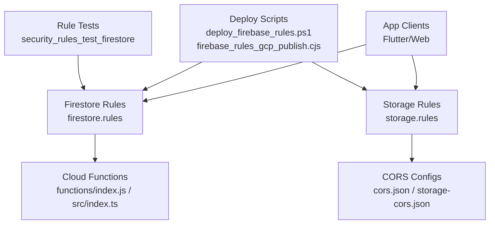
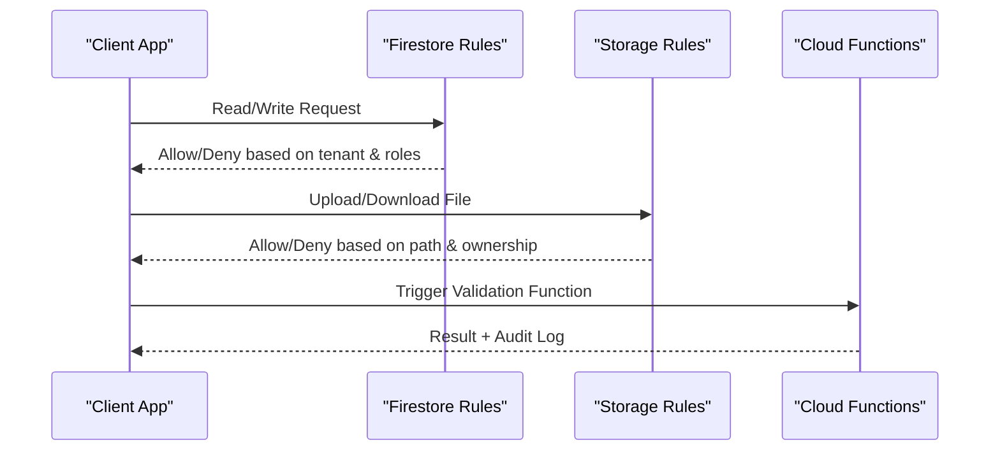
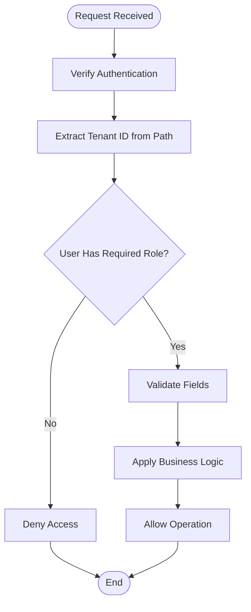
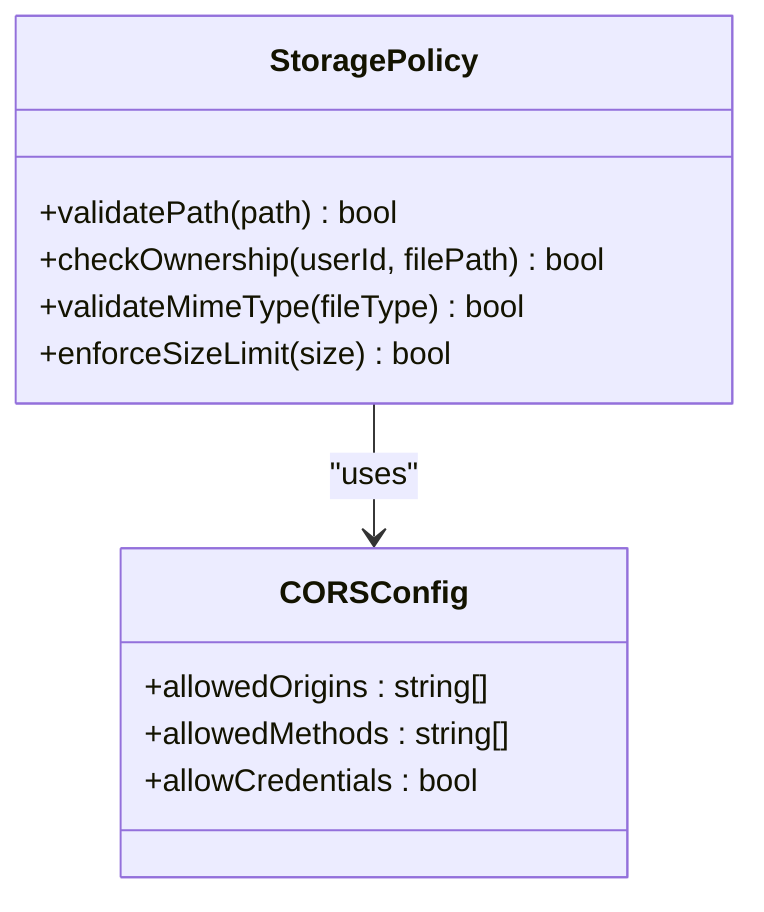
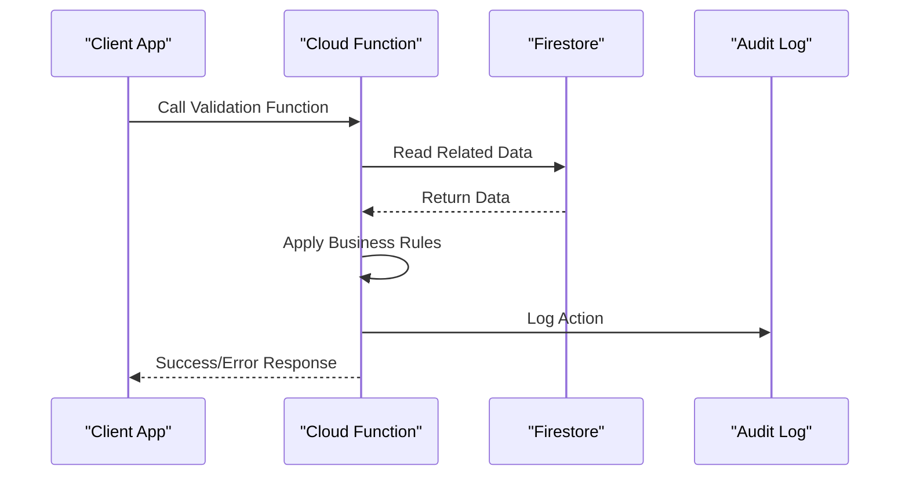
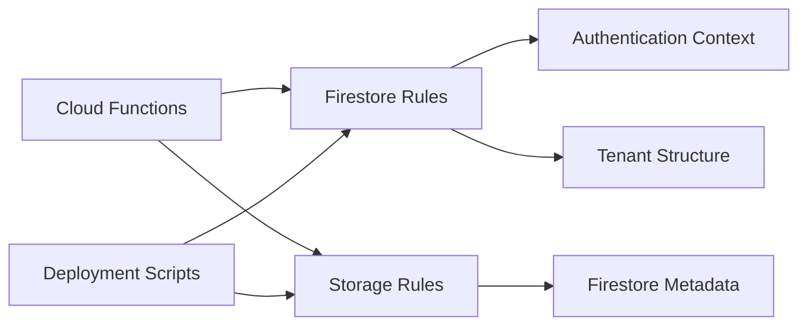

# Security Rules & Policies

<cite>
**Referenced Files in This Document**
- [firestore.rules](file://firestore.rules)
- [storage.rules](file://storage.rules)
- [firebase.json](file://firebase.json)
- [functions/index.js](file://functions/index.js)
- [functions/src/index.ts](file://functions/src/index.ts)
- [functions/lib/index.js](file://functions/lib/index.js)
- [security_rules_test_firestore/test/firestore.rules.test.js](file://security_rules_test_firestore/test/firestore.rules.test.js)
- [scripts/deploy_firebase_rules.ps1](file://scripts/deploy_firebase_rules.ps1)
- [scripts/firebase_rules_gcp_publish.cjs](file://scripts/firebase_rules_gcp_publish.cjs)
- [scripts/firestore_rules_patch_release.cjs](file://scripts/firestore_rules_patch_release.cjs)
- [scripts/apply_storage_cors.ps1](file://scripts/apply_storage_cors.ps1)
- [scripts/cors_storage_wide_open.json](file://scripts/cors_storage_wide_open.json)
- [scripts/storage-cors.json](file://scripts/storage-cors.json)
- [cors.json](file://cors.json)
- [flutter_app/storage_cors.json](file://flutter_app/storage_cors.json)
- [flutter_app/FIREBASE_DATABASES.md](file://flutter_app/FIREBASE_DATABASES.md)
- [flutter_app/MIDIA_STORAGE_PADRAO_ECOFIRE.md](file://flutter_app/MIDIA_STORAGE_PADRAO_ECOFIRE.md)
</cite>

## Table of Contents
1. [Introduction](#introduction)
2. [Project Structure](#project-structure)
3. [Core Components](#core-components)
4. [Architecture Overview](#architecture-overview)
5. [Detailed Component Analysis](#detailed-component-analysis)
6. [Dependency Analysis](#dependency-analysis)
7. [Performance Considerations](#performance-considerations)
8. [Troubleshooting Guide](#troubleshooting-guide)
9. [Conclusion](#conclusion)
10. [Appendices](#appendices)

## Introduction
This document provides a comprehensive guide to the security rules and policies for Gestão Yahweh Premium, focusing on Firestore security rules, Firebase Storage policies, and custom validation functions. It explains tenant isolation, data access patterns, and permission enforcement at the database level. It also includes implementation details for writing secure rules, testing security policies, debugging rule violations, protecting sensitive data, implementing row-level security, creating reusable rule functions, optimizing performance, addressing common vulnerabilities, and ensuring compliance.

## Project Structure
The project organizes security-related configuration and code across several key locations:
- Firestore rules are defined centrally and deployed via scripts.
- Storage rules define file-level access control and CORS settings.
- Cloud Functions provide server-side validation and policy enforcement.
- Test suites validate rule behavior under various scenarios.
- Deployment scripts automate publishing rules and CORS configurations.

**Diagram sources**
- [firestore.rules](file://firestore.rules)
- [storage.rules](file://storage.rules)
- [functions/index.js](file://functions/index.js)
- [functions/src/index.ts](file://functions/src/index.ts)
- [scripts/deploy_firebase_rules.ps1](file://scripts/deploy_firebase_rules.ps1)
- [scripts/firebase_rules_gcp_publish.cjs](file://scripts/firebase_rules_gcp_publish.cjs)
- [security_rules_test_firestore/test/firestore.rules.test.js](file://security_rules_test_firestore/test/firestore.rules.test.js)

**Section sources**
- [firebase.json](file://firebase.json)
- [flutter_app/FIREBASE_DATABASES.md](file://flutter_app/FIREBASE_DATABASES.md)

## Core Components
- Firestore Rules: Centralized rules enforcing tenant isolation, role-based access, and field-level permissions.
- Storage Rules: File-level access control with tenant-scoped paths and MIME/type restrictions.
- Cloud Functions: Server-side validations, cross-collection operations, and audit logging.
- Rule Testing: Automated tests simulating client requests to verify rule correctness.
- Deployment Automation: Scripts to publish rules and CORS configurations consistently.

Key responsibilities:
- Tenant isolation by path segments (e.g., churches/{churchId}/...).
- Role checks using authenticated user claims or membership records.
- Field-level write validation for sensitive fields.
- Storage path validation tied to Firestore metadata.

**Section sources**
- [firestore.rules](file://firestore.rules)
- [storage.rules](file://storage.rules)
- [functions/index.js](file://functions/index.js)
- [functions/src/index.ts](file://functions/src/index.ts)

## Architecture Overview
The security architecture enforces multi-tenant isolation and fine-grained access control through layered policies:
- Client requests hit Firestore and Storage endpoints.
- Firestore rules evaluate request context (auth, tenant id, roles).
- Storage rules validate file paths and ownership.
- Cloud Functions perform complex validations and side effects not feasible in rules.

**Diagram sources**
- [firestore.rules](file://firestore.rules)
- [storage.rules](file://storage.rules)
- [functions/index.js](file://functions/index.js)

## Detailed Component Analysis

### Firestore Security Rules
- Structure: Organized by collections and subcollections, with tenant-scoped paths.
- Access Control: Uses authenticated user context and membership checks.
- Validation: Enforces field presence, types, and business constraints.
- Reusability: Encapsulates common checks into helper functions.

**Diagram sources**
- [firestore.rules](file://firestore.rules)

**Section sources**
- [firestore.rules](file://firestore.rules)

### Storage Security Policies
- Path Isolation: Files stored under tenant-specific directories.
- Ownership Verification: Checks against Firestore metadata for file ownership.
- Type Restrictions: Validates MIME types and file sizes.
- CORS Configuration: Controls browser-based access from web clients.

**Diagram sources**
- [storage.rules](file://storage.rules)
- [cors.json](file://cors.json)
- [flutter_app/storage_cors.json](file://flutter_app/storage_cors.json)

**Section sources**
- [storage.rules](file://storage.rules)
- [flutter_app/MIDIA_STORAGE_PADRAO_ECOFIRE.md](file://flutter_app/MIDIA_STORAGE_PADRAO_ECOFIRE.md)

### Custom Validation Functions
- Purpose: Implement complex business logic that cannot be expressed in rules.
- Examples: Cross-collection consistency checks, audit logging, notification triggers.
- Integration: Called via HTTPS or callable functions from client apps.

**Diagram sources**
- [functions/index.js](file://functions/index.js)
- [functions/src/index.ts](file://functions/src/index.ts)

**Section sources**
- [functions/index.js](file://functions/index.js)
- [functions/src/index.ts](file://functions/src/index.ts)

### Tenant Isolation and Row-Level Security
- Tenant Scoping: All data is organized under tenant-specific paths (e.g., churches/{churchId}).
- Membership Validation: Users must belong to the target tenant and have appropriate roles.
- Field-Level Access: Sensitive fields require elevated privileges.
- Query Constraints: Ensures queries only return tenant-scoped data.

**Section sources**
- [firestore.rules](file://firestore.rules)

### Permission Enforcement at Database Level
- Authentication: Requires valid Firebase authentication.
- Authorization: Checks user roles and tenant membership.
- Data Validation: Enforces schema and business rules.
- Audit Trail: Logs all significant operations for compliance.

**Section sources**
- [firestore.rules](file://firestore.rules)
- [functions/index.js](file://functions/index.js)

## Dependency Analysis
Security components depend on each other to enforce comprehensive protection:
- Firestore rules rely on authentication context and tenant structure.
- Storage rules depend on Firestore metadata for ownership verification.
- Cloud functions coordinate between Firestore and Storage for complex operations.
- Deployment scripts ensure consistent rule application across environments.

**Diagram sources**
- [firestore.rules](file://firestore.rules)
- [storage.rules](file://storage.rules)
- [functions/index.js](file://functions/index.js)
- [scripts/deploy_firebase_rules.ps1](file://scripts/deploy_firebase_rules.ps1)

**Section sources**
- [firebase.json](file://firebase.json)
- [scripts/firebase_rules_gcp_publish.cjs](file://scripts/firebase_rules_gcp_publish.cjs)

## Performance Considerations
- Rule Optimization: Minimize nested conditions and expensive operations.
- Index Usage: Ensure proper Firestore indexes for query performance.
- Function Efficiency: Optimize Cloud Functions for quick response times.
- Caching Strategy: Use appropriate caching for frequently accessed data.
- Batch Operations: Group related operations to reduce round trips.

[No sources needed since this section provides general guidance]

## Troubleshooting Guide
Common issues and solutions:
- Rule Violations: Check authentication context and tenant IDs in error messages.
- Storage Access Denied: Verify file paths and ownership metadata.
- Function Errors: Review function logs and input validation.
- CORS Issues: Ensure proper origin configuration in CORS settings.

Debugging steps:
1. Enable detailed logging in development environment.
2. Use Firebase Emulator Suite for local testing.
3. Validate rules with test cases covering edge scenarios.
4. Monitor production logs for error patterns.

**Section sources**
- [security_rules_test_firestore/test/firestore.rules.test.js](file://security_rules_test_firestore/test/firestore.rules.test.js)

## Conclusion
Gestão Yahweh Premium implements a robust security framework through layered policies that enforce tenant isolation, role-based access control, and data validation. The combination of Firestore rules, Storage policies, and Cloud Functions provides comprehensive protection while maintaining performance and scalability. Regular testing and monitoring ensure ongoing security compliance and operational reliability.

[No sources needed since this section summarizes without analyzing specific files]

## Appendices

### Implementation Details for Secure Rules
- Always validate tenant context in every operation.
- Use field-level validation for sensitive data.
- Implement least privilege principles for user roles.
- Add comprehensive audit logging for compliance.

### Testing Security Policies
- Create test cases for all access scenarios.
- Include negative test cases for unauthorized access.
- Test edge cases and boundary conditions.
- Automate rule testing in CI/CD pipelines.

### Debugging Rule Violations
- Analyze error messages for specific violation details.
- Check authentication context and token validity.
- Verify tenant ID extraction from request paths.
- Review Cloud Function logs for validation failures.

### Protecting Sensitive Data
- Encrypt sensitive fields at rest and in transit.
- Implement field-level access controls.
- Use secure defaults for new fields.
- Regularly audit data access patterns.

### Compliance Requirements
- Maintain audit trails for all data modifications.
- Implement data retention policies.
- Ensure GDPR compliance for personal data.
- Regular security assessments and penetration testing.

**Section sources**
- [scripts/deploy_firebase_rules.ps1](file://scripts/deploy_firebase_rules.ps1)
- [scripts/firebase_rules_gcp_publish.cjs](file://scripts/firebase_rules_gcp_publish.cjs)
- [scripts/firestore_rules_patch_release.cjs](file://scripts/firestore_rules_patch_release.cjs)
- [scripts/apply_storage_cors.ps1](file://scripts/apply_storage_cors.ps1)
- [scripts/cors_storage_wide_open.json](file://scripts/cors_storage_wide_open.json)
- [scripts/storage-cors.json](file://scripts/storage-cors.json)