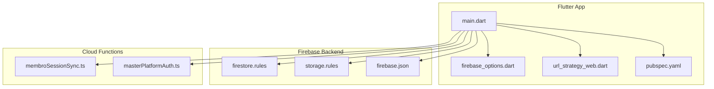
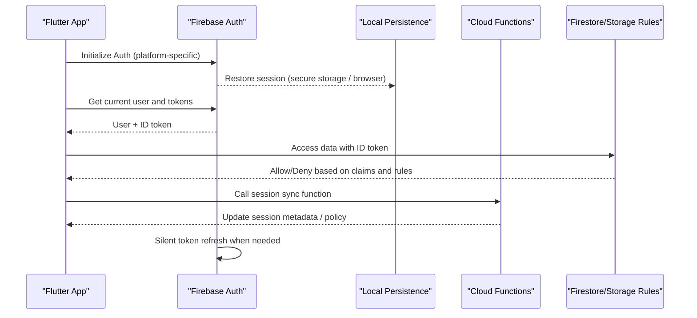
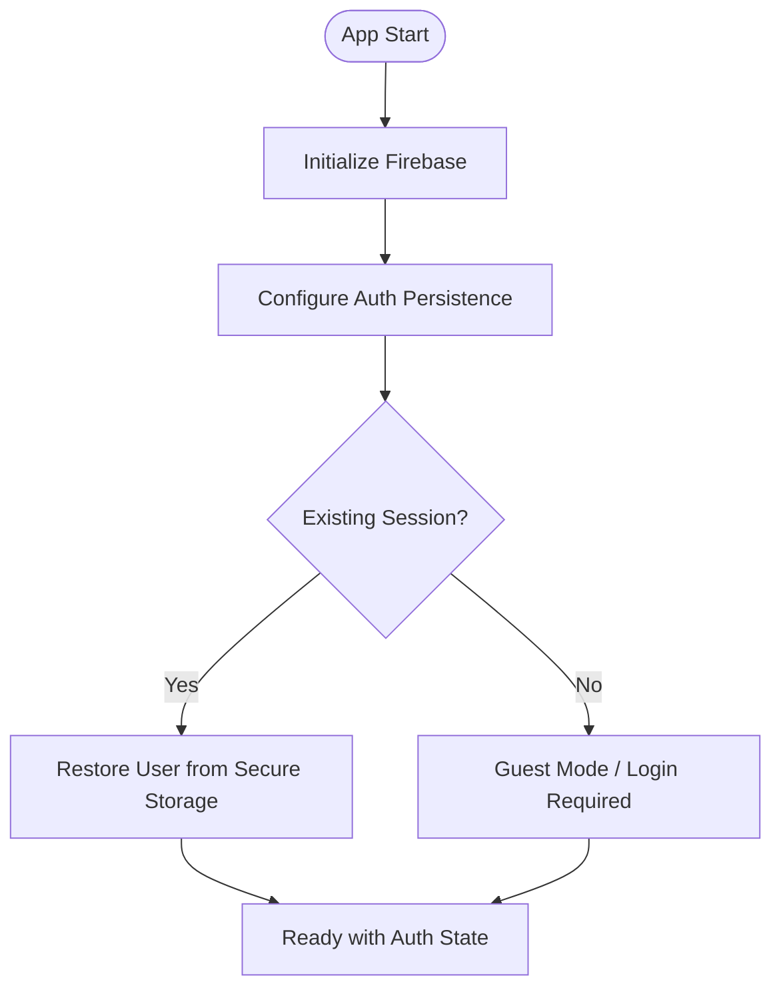
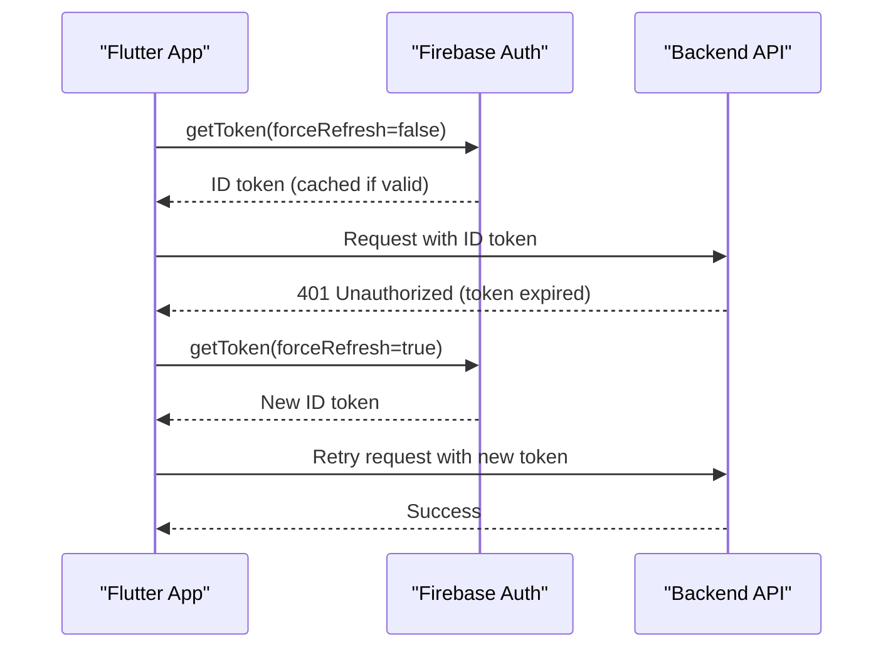
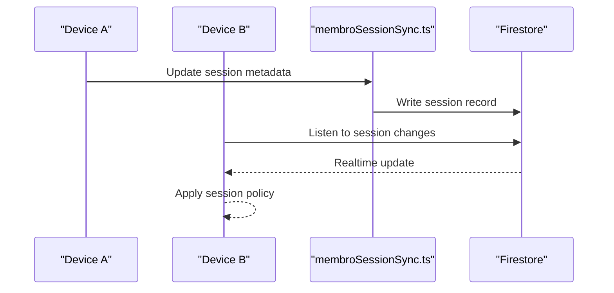
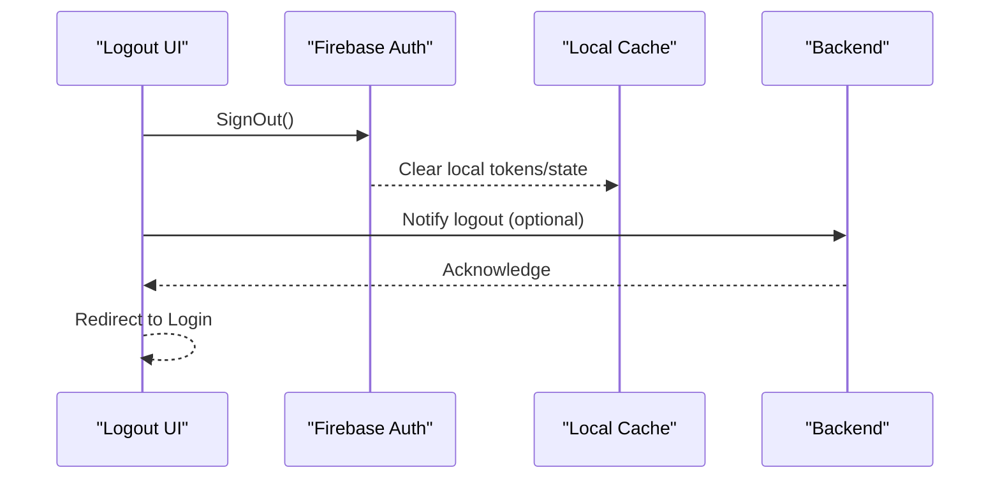
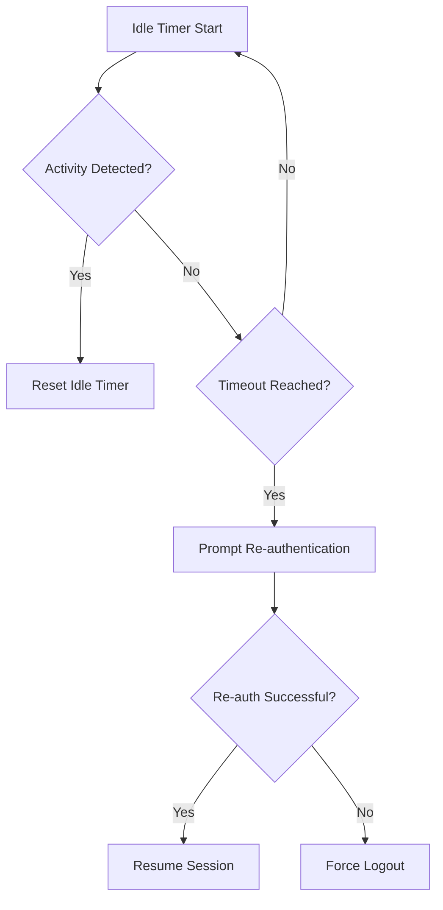
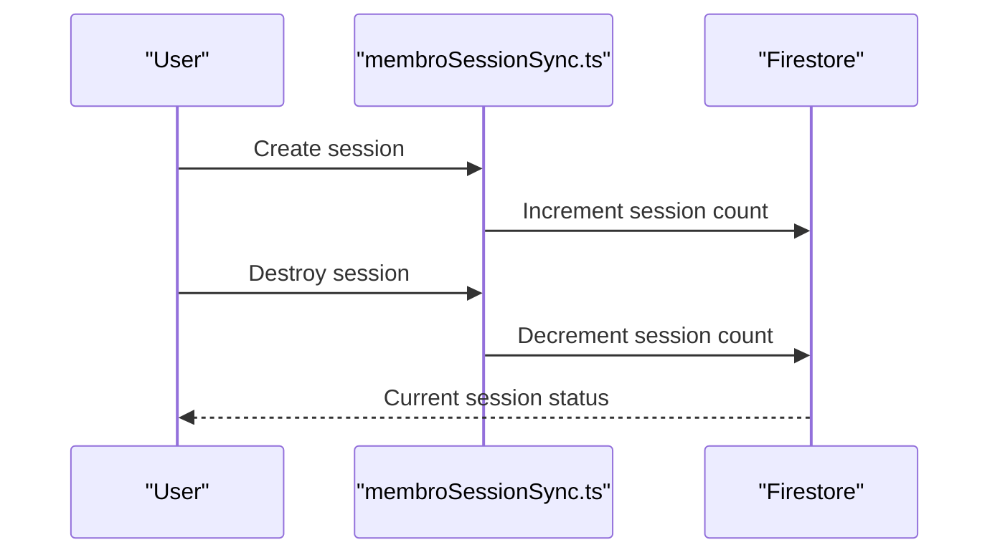
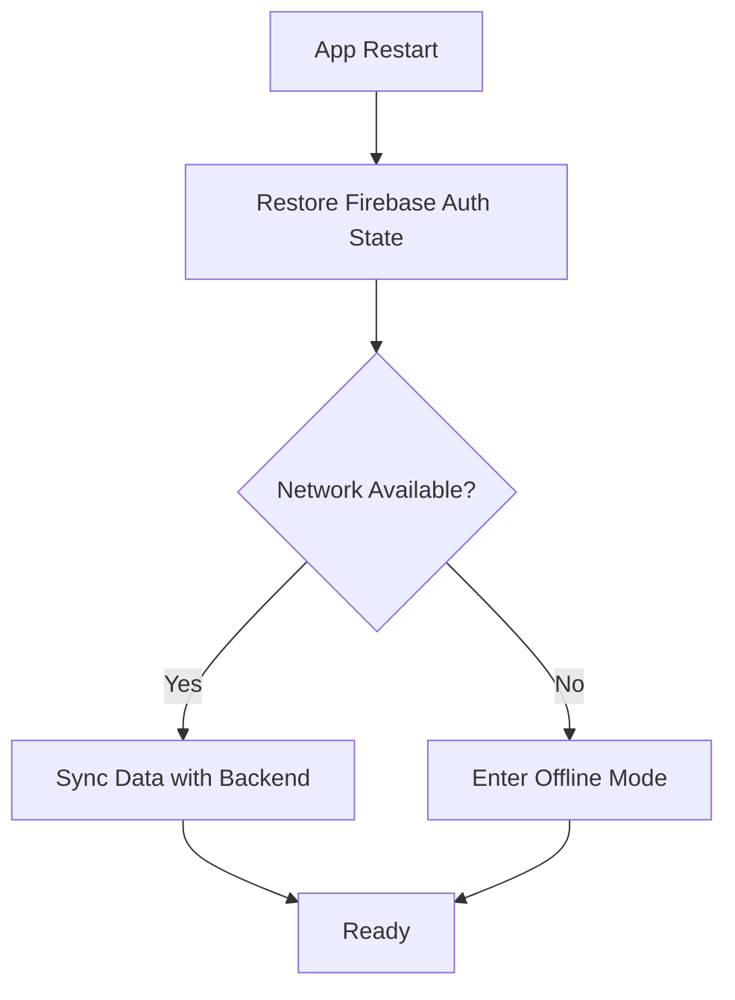
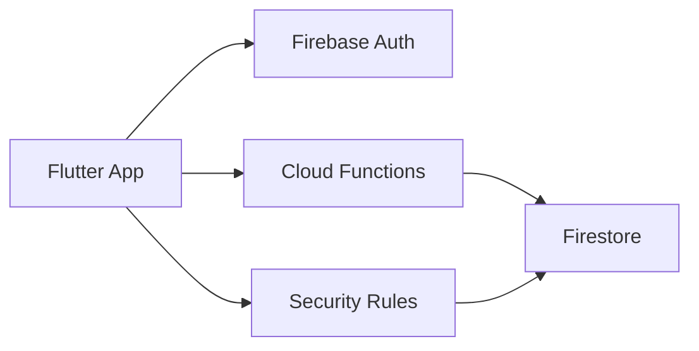

# Session Management

<cite>
**Referenced Files in This Document**
- [main.dart](file://flutter_app/lib/main.dart)
- [firebase_options.dart](file://flutter_app/lib/firebase_options.dart)
- [url_strategy_web.dart](file://flutter_app/lib/url_strategy_web.dart)
- [membroSessionSync.ts](file://functions/src/membroSessionSync.ts)
- [masterPlatformAuth.ts](file://functions/src/masterPlatformAuth.ts)
- [firestore.rules](file://firestore.rules)
- [storage.rules](file://storage.rules)
- [firebase.json](file://flutter_app/firebase.json)
- [pubspec.yaml](file://flutter_app/pubspec.yaml)
</cite>

## Table of Contents
1. [Introduction](#introduction)
2. [Project Structure](#project-structure)
3. [Core Components](#core-components)
4. [Architecture Overview](#architecture-overview)
5. [Detailed Component Analysis](#detailed-component-analysis)
6. [Dependency Analysis](#dependency-analysis)
7. [Performance Considerations](#performance-considerations)
8. [Troubleshooting Guide](#troubleshooting-guide)
9. [Conclusion](#conclusion)
10. [Appendices](#appendices)

## Introduction
This document explains session management for Gestão Yahweh Premium across Flutter web, mobile, and desktop platforms. It covers the Firebase Auth lifecycle, token handling, cross-platform synchronization, automatic re-authentication, session timeouts, concurrent sessions, logout flows, and recovery strategies. It also provides security best practices for token storage, session hijacking prevention, and platform-specific considerations.

## Project Structure
The application is a multi-platform Flutter app with Firebase integration and Cloud Functions supporting session-related operations. Key areas:
- Flutter entry point and initialization
- Firebase configuration per environment
- Web URL strategy to support deep links and resume behavior
- Cloud Functions for session synchronization and platform auth utilities
- Security rules governing Firestore and Storage access based on authenticated sessions

**Diagram sources**
- [main.dart](file://flutter_app/lib/main.dart)
- [firebase_options.dart](file://flutter_app/lib/firebase_options.dart)
- [url_strategy_web.dart](file://flutter_app/lib/url_strategy_web.dart)
- [pubspec.yaml](file://flutter_app/pubspec.yaml)
- [firestore.rules](file://firestore.rules)
- [storage.rules](file://storage.rules)
- [firebase.json](file://flutter_app/firebase.json)
- [membroSessionSync.ts](file://functions/src/membroSessionSync.ts)
- [masterPlatformAuth.ts](file://functions/src/masterPlatformAuth.ts)

**Section sources**
- [main.dart](file://flutter_app/lib/main.dart)
- [firebase_options.dart](file://flutter_app/lib/firebase_options.dart)
- [url_strategy_web.dart](file://flutter_app/lib/url_strategy_web.dart)
- [pubspec.yaml](file://flutter_app/pubspec.yaml)
- [firestore.rules](file://firestore.rules)
- [storage.rules](file://storage.rules)
- [firebase.json](file://flutter_app/firebase.json)
- [membroSessionSync.ts](file://functions/src/membroSessionSync.ts)
- [masterPlatformAuth.ts](file://functions/src/masterPlatformAuth.ts)

## Core Components
- Firebase Authentication state persistence:
  - Mobile/Desktop: managed by platform-native secure storage via firebase_auth plugin.
  - Web: persisted through browser storage mechanisms; ensure same-site cookies and secure headers are configured.
- Token management:
  - Access tokens are short-lived; refresh tokens enable silent renewal.
  - Custom claims and tenant context should be refreshed when needed.
- Cross-platform session sync:
  - Cloud Function synchronizes member session metadata and enforces policies.
- Local storage strategies:
  - Avoid storing raw tokens in app-local storage; rely on Firebase SDK-managed persistence.
  - Use secure storage only for non-sensitive UI state (e.g., last user id).
- Secure token handling:
  - Validate tokens server-side using Firebase Admin SDK or callable functions.
  - Enforce least privilege via Firestore/Storage rules.

**Section sources**
- [pubspec.yaml](file://flutter_app/pubspec.yaml)
- [firestore.rules](file://firestore.rules)
- [storage.rules](file://storage.rules)
- [membroSessionSync.ts](file://functions/src/membroSessionSync.ts)
- [masterPlatformAuth.ts](file://functions/src/masterPlatformAuth.ts)

## Architecture Overview
The session architecture spans client initialization, authentication, token refresh, and backend enforcement.

**Diagram sources**
- [main.dart](file://flutter_app/lib/main.dart)
- [firebase_options.dart](file://flutter_app/lib/firebase_options.dart)
- [membroSessionSync.ts](file://functions/src/membroSessionSync.ts)
- [firestore.rules](file://firestore.rules)
- [storage.rules](file://storage.rules)

## Detailed Component Analysis

### Firebase Auth Initialization and State Restoration
- The app initializes Firebase and sets up platform-specific behaviors:
  - On web, URL strategy ensures consistent routing and deep link handling.
  - On mobile/desktop, native secure storage persists auth state.
- Ensure persistence settings align with platform capabilities and security requirements.

**Diagram sources**
- [main.dart](file://flutter_app/lib/main.dart)
- [firebase_options.dart](file://flutter_app/lib/firebase_options.dart)
- [url_strategy_web.dart](file://flutter_app/lib/url_strategy_web.dart)

**Section sources**
- [main.dart](file://flutter_app/lib/main.dart)
- [firebase_options.dart](file://flutter_app/lib/firebase_options.dart)
- [url_strategy_web.dart](file://flutter_app/lib/url_strategy_web.dart)

### Automatic Re-authentication and Token Refresh
- Firebase Auth automatically refreshes short-lived ID tokens.
- For sensitive operations, call getToken() to obtain a fresh token and pass it to backend calls.
- Implement retry logic for transient network errors during token refresh.

**Diagram sources**
- [membroSessionSync.ts](file://functions/src/membroSessionSync.ts)
- [masterPlatformAuth.ts](file://functions/src/masterPlatformAuth.ts)

**Section sources**
- [membroSessionSync.ts](file://functions/src/membroSessionSync.ts)
- [masterPlatformAuth.ts](file://functions/src/masterPlatformAuth.ts)

### Cross-Platform Session Synchronization
- Cloud Function synchronizes session metadata and enforces tenant-specific policies.
- Use callable functions to update session state and propagate changes across devices.

**Diagram sources**
- [membroSessionSync.ts](file://functions/src/membroSessionSync.ts)

**Section sources**
- [membroSessionSync.ts](file://functions/src/membroSessionSync.ts)

### Logout Flow
- Clear local state and sign out from Firebase Auth.
- Invalidate any cached tokens and redirect to login screen.
- Optionally revoke refresh tokens server-side for enhanced security.

**Section sources**
- [firestore.rules](file://firestore.rules)
- [storage.rules](file://storage.rules)

### Session Timeout Handling
- Detect idle time and prompt re-authentication for sensitive actions.
- Use Firebase Auth state changes to handle unexpected logouts due to token revocation.

**Section sources**
- [firestore.rules](file://firestore.rules)
- [storage.rules](file://storage.rules)

### Concurrent Session Management
- Track active sessions per user and enforce limits if required.
- Use Cloud Functions to manage session records and detect conflicts.

**Section sources**
- [membroSessionSync.ts](file://functions/src/membroSessionSync.ts)

### Session Recovery
- Handle app restarts by restoring Firebase Auth state.
- Recover from network failures by retrying token refresh and re-subscribing to listeners.

**Section sources**
- [main.dart](file://flutter_app/lib/main.dart)
- [firebase_options.dart](file://flutter_app/lib/firebase_options.dart)

## Dependency Analysis
Key dependencies and their roles in session management:
- Flutter app depends on Firebase Auth for identity and token management.
- Cloud Functions provide session synchronization and policy enforcement.
- Security rules enforce access control based on authenticated sessions.

**Diagram sources**
- [pubspec.yaml](file://flutter_app/pubspec.yaml)
- [membroSessionSync.ts](file://functions/src/membroSessionSync.ts)
- [firestore.rules](file://firestore.rules)
- [storage.rules](file://storage.rules)

**Section sources**
- [pubspec.yaml](file://flutter_app/pubspec.yaml)
- [membroSessionSync.ts](file://functions/src/membroSessionSync.ts)
- [firestore.rules](file://firestore.rules)
- [storage.rules](file://storage.rules)

## Performance Considerations
- Minimize token refresh calls by caching tokens where appropriate.
- Use real-time listeners judiciously to avoid excessive bandwidth usage.
- Implement offline-first strategies with local caching and background sync.

[No sources needed since this section provides general guidance]

## Troubleshooting Guide
Common issues and resolutions:
- Session not persisting on web: Verify cookie settings and CORS configuration.
- Token expiration errors: Implement retry logic with forceRefresh.
- Unauthorized access: Review Firestore/Storage rules and custom claims.
- Session sync failures: Check Cloud Function logs and error handling.

**Section sources**
- [firestore.rules](file://firestore.rules)
- [storage.rules](file://storage.rules)
- [membroSessionSync.ts](file://functions/src/membroSessionSync.ts)

## Conclusion
Effective session management in Gestão Yahweh Premium relies on Firebase Auth’s robust persistence, secure token handling, and Cloud Functions for synchronization. By following the patterns and best practices outlined here, you can ensure a seamless and secure user experience across all platforms.

[No sources needed since this section summarizes without analyzing specific files]

## Appendices
- Security Best Practices:
  - Never store raw tokens in app-local storage.
  - Use HTTPS and secure cookies on web.
  - Implement role-based access control with custom claims.
- Platform-Specific Notes:
  - Web: Configure SameSite cookies and CSP headers.
  - Mobile: Leverage platform secure storage.
  - Desktop: Follow OS-specific secure storage guidelines.

[No sources needed since this section provides general guidance]