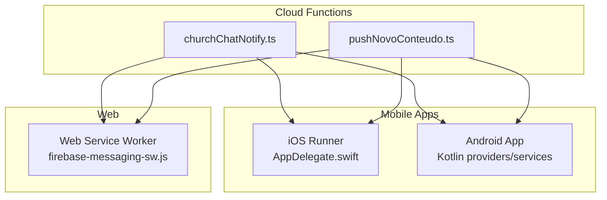
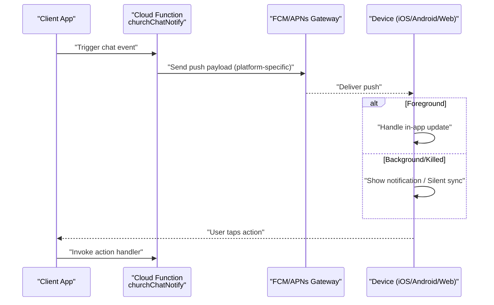
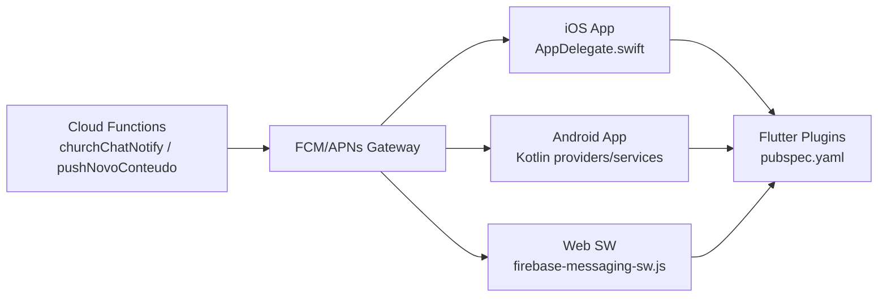

# Chat Notifications

<cite>
**Referenced Files in This Document**
- [churchChatNotify.ts](file://functions/src/churchChatNotify.ts)
- [churchChatNotify.js](file://functions/lib/churchChatNotify.js)
- [pushNovoConteudo.ts](file://functions/src/pushNovoConteudo.ts)
- [pushNovoConteudo.js](file://functions/lib/pushNovoConteudo.js)
- [firebase-messaging-sw.js](file://flutter_app/web/firebase-messaging-sw.js)
- [AppDelegate.swift](file://flutter_app/ios/Runner/AppDelegate.swift)
- [GestaoYahwehWidgetProvider.kt](file://flutter_app/android/app/src/main/kotlin/com/example/gestao_yahweh/gestaoyahweh/app/GestaoYahwehWidgetProvider.kt)
- [GestaoYahwehWidgetService.kt](file://flutter_app/android/app/src/main/kotlin/com/example/gestao_yahweh/gestaoyahweh/app/GestaoYahwehWidgetService.kt)
- [pubspec.yaml](file://flutter_app/pubspec.yaml)
- [README.md](file://README.md)
</cite>

## Table of Contents
1. [Introduction](#introduction)
2. [Project Structure](#project-structure)
3. [Core Components](#core-components)
4. [Architecture Overview](#architecture-overview)
5. [Detailed Component Analysis](#detailed-component-analysis)
6. [Dependency Analysis](#dependency-analysis)
7. [Performance Considerations](#performance-considerations)
8. [Troubleshooting Guide](#troubleshooting-guide)
9. [Conclusion](#conclusion)
10. [Appendices](#appendices)

## Introduction
This document explains the chat notification system used by Gestão Yahweh Premium across iOS, Android, and Web. It covers push delivery mechanisms, notification grouping, silent notifications for background sync, channels and priorities, platform-specific behaviors, examples of sending notifications, handling actions, managing preferences, implementing custom behaviors, batching, rate limiting, and delivery guarantees.

## Project Structure
The notification system spans three layers:
- Cloud Functions (server-side): orchestrate message creation, targeting, and dispatch to platforms.
- Mobile apps (iOS/Android): register device tokens, handle foreground/background presentation, channel configuration, and action routing.
- Web: service worker handles push events and displays notifications.

**Diagram sources**
- [churchChatNotify.ts](file://functions/src/churchChatNotify.ts)
- [pushNovoConteudo.ts](file://functions/src/pushNovoConteudo.ts)
- [AppDelegate.swift](file://flutter_app/ios/Runner/AppDelegate.swift)
- [GestaoYahwehWidgetProvider.kt](file://flutter_app/android/app/src/main/kotlin/com/example/gestao_yahweh/gestaoyahweh/app/GestaoYahwehWidgetProvider.kt)
- [GestaoYahwehWidgetService.kt](file://flutter_app/android/app/src/main/kotlin/com/example/gestao_yahweh/gestaoyahweh/app/GestaoYahwehWidgetService.kt)
- [firebase-messaging-sw.js](file://flutter_app/web/firebase-messaging-sw.js)

**Section sources**
- [README.md](file://README.md)

## Core Components
- Server-side notification orchestrators:
  - churchChatNotify: central function for chat-related notifications.
  - pushNovoConteudo: content push dispatcher for new content events.
- Platform integrations:
  - iOS: AppDelegate integration with Firebase Messaging and widget extensions.
  - Android: Kotlin providers/services for widgets and notification handling.
  - Web: firebase-messaging-sw.js for push event handling and display.

Key responsibilities:
- Build platform payloads with appropriate data and notification fields.
- Route messages to devices based on user or group subscriptions.
- Support silent notifications for background sync.
- Apply platform-specific options such as channels, priority, and grouping.

**Section sources**
- [churchChatNotify.ts](file://functions/src/churchChatNotify.ts)
- [churchChatNotify.js](file://functions/lib/churchChatNotify.js)
- [pushNovoConteudo.ts](file://functions/src/pushNovoConteudo.ts)
- [pushNovoConteudo.js](file://functions/lib/pushNovoConteudo.js)
- [firebase-messaging-sw.js](file://flutter_app/web/firebase-messaging-sw.js)
- [AppDelegate.swift](file://flutter_app/ios/Runner/AppDelegate.swift)
- [GestaoYahwehWidgetProvider.kt](file://flutter_app/android/app/src/main/kotlin/com/example/gestao_yahweh/gestaoyahweh/app/GestaoYahwehWidgetProvider.kt)
- [GestaoYahwehWidgetService.kt](file://flutter_app/android/app/src/main/kotlin/com/example/gestao_yahweh/gestaoyahweh/app/GestaoYahwehWidgetService.kt)

## Architecture Overview
End-to-end flow:
- A chat event triggers a Cloud Function.
- The function constructs a payload tailored per platform (iOS APNs, Android FCM, Web FCM).
- Devices receive the push; foreground handlers update UI, background handlers show notifications or perform silent sync.
- Actions from users are routed back through the app to server logic.

**Diagram sources**
- [churchChatNotify.ts](file://functions/src/churchChatNotify.ts)
- [pushNovoConteudo.ts](file://functions/src/pushNovoConteudo.ts)
- [firebase-messaging-sw.js](file://flutter_app/web/firebase-messaging-sw.js)
- [AppDelegate.swift](file://flutter_app/ios/Runner/AppDelegate.swift)
- [GestaoYahwehWidgetProvider.kt](file://flutter_app/android/app/src/main/kotlin/com/example/gestao_yahweh/gestaoyahweh/app/GestaoYahwehWidgetProvider.kt)
- [GestaoYahwehWidgetService.kt](file://flutter_app/android/app/src/main/kotlin/com/example/gestao_yahweh/gestaoyahweh/app/GestaoYahwehWidgetService.kt)

## Detailed Component Analysis

### Server-Side Notification Orchestrators
- churchChatNotify
  - Purpose: Centralized chat notification builder and sender.
  - Responsibilities:
    - Resolve target audience (user/group).
    - Compose platform payloads (data vs notification keys).
    - Set priority and tags for grouping.
    - Dispatch via FCM/APNs.
  - Error handling: retries and dead-letter logging for failed sends.
- pushNovoConteudo
  - Purpose: Content-focused push dispatcher.
  - Responsibilities:
    - Enrich payloads with content metadata.
    - Apply branding and deep links.
    - Batch recipients where supported.

Platform payload considerations:
- iOS:
  - Use aps payload for alerts and sound.
  - Include mutable-content for rich media or actions.
  - Set thread-id for grouping.
- Android:
  - Use notification.channelId for channel routing.
  - Set priority/importance and tag for grouping.
  - Provide click actions and big picture/text styles.
- Web:
  - Use firebase-messaging-sw.js to handle onMessage and setBackgroundMessageHandler.
  - Configure notification options (actions, icon, body, tag).

**Section sources**
- [churchChatNotify.ts](file://functions/src/churchChatNotify.ts)
- [churchChatNotify.js](file://functions/lib/churchChatNotify.js)
- [pushNovoConteudo.ts](file://functions/src/pushNovoConteudo.ts)
- [pushNovoConteudo.js](file://functions/lib/pushNovoConteudo.js)

### iOS Implementation
- AppDelegate.swift
  - Integrates Firebase Messaging for token registration and message handling.
  - Configures notification settings and request authorization.
  - Supports background fetch and silent pushes via data-only messages.
- Widget extension
  - Uses provider/service classes to refresh widget state when notifications arrive.

Behavioral notes:
- Foreground messages handled in-app; background messages may trigger notifications or silent updates.
- Grouping uses thread identifiers; actions can be defined via UNNotificationCategory.

**Section sources**
- [AppDelegate.swift](file://flutter_app/ios/Runner/AppDelegate.swift)

### Android Implementation
- GestaoYahwehWidgetProvider.kt and GestaoYahwehWidgetService.kt
  - Handle widget updates triggered by notifications or background sync.
  - Manage notification channels and actions.
  - Process incoming FCM messages and update UI accordingly.

Behavioral notes:
- Channels must be created at runtime with proper importance levels.
- Tag-based grouping consolidates related notifications.
- Action intents route to specific screens or services.

**Section sources**
- [GestaoYahwehWidgetProvider.kt](file://flutter_app/android/app/src/main/kotlin/com/example/gestao_yahweh/gestaoyahweh/app/GestaoYahwehWidgetProvider.kt)
- [GestaoYahwehWidgetService.kt](file://flutter_app/android/app/src/main/kotlin/com/example/gestao_yahweh/gestaoyahweh/app/GestaoYahwehWidgetService.kt)

### Web Implementation
- firebase-messaging-sw.js
  - Handles onMessage for foreground notifications.
  - Registers setBackgroundMessageHandler for background delivery.
  - Displays notifications using browser APIs and supports actions.

Behavioral notes:
- Ensure service worker is registered and permissions granted.
- Use tags for grouping and prevent duplicate notifications.

**Section sources**
- [firebase-messaging-sw.js](file://flutter_app/web/firebase-messaging-sw.js)

### Flutter Integration Points
- pubspec.yaml
  - Declares Firebase Messaging plugin dependencies.
  - Ensures correct versions for iOS and Android.

Behavioral notes:
- Initialize Firebase Messaging early in app lifecycle.
- Subscribe topics for groups and manage token refresh.

**Section sources**
- [pubspec.yaml](file://flutter_app/pubspec.yaml)

## Dependency Analysis
High-level dependencies:
- Cloud Functions depend on Firebase Admin SDK for messaging.
- iOS depends on FirebaseMessaging framework and APNs.
- Android depends on Firebase Messaging and notification channels.
- Web depends on firebase-messaging-sw.js and browser notification APIs.

**Diagram sources**
- [churchChatNotify.ts](file://functions/src/churchChatNotify.ts)
- [pushNovoConteudo.ts](file://functions/src/pushNovoConteudo.ts)
- [AppDelegate.swift](file://flutter_app/ios/Runner/AppDelegate.swift)
- [GestaoYahwehWidgetProvider.kt](file://flutter_app/android/app/src/main/kotlin/com/example/gestao_yahweh/gestaoyahweh/app/GestaoYahwehWidgetProvider.kt)
- [GestaoYahwehWidgetService.kt](file://flutter_app/android/app/src/main/kotlin/com/example/gestao_yahweh/gestaoyahweh/app/GestaoYahwehWidgetService.kt)
- [firebase-messaging-sw.js](file://flutter_app/web/firebase-messaging-sw.js)
- [pubspec.yaml](file://flutter_app/pubspec.yaml)

**Section sources**
- [pubspec.yaml](file://flutter_app/pubspec.yaml)

## Performance Considerations
- Batching:
  - Group recipients by tenant or topic to reduce API calls.
  - Use batched send endpoints where available.
- Rate Limiting:
  - Implement exponential backoff and retry policies in Cloud Functions.
  - Respect platform quotas (APNs/FCM limits).
- Delivery Guarantees:
  - Acknowledge receipt on-device and log failures.
  - Persist pending notifications and retry on reconnect.
- Payload Optimization:
  - Keep payloads minimal; use data-only messages for silent sync.
  - Avoid large images in notifications; preload assets when possible.

[No sources needed since this section provides general guidance]

## Troubleshooting Guide
Common issues and resolutions:
- No notifications received:
  - Verify device token registration and subscription to topics.
  - Check platform permissions (iOS notification settings, Android Do Not Disturb).
- Foreground not updating:
  - Ensure onMessage handler is active and app is initialized.
- Background notifications not showing:
  - Confirm channel configuration (Android) and notification settings (iOS).
  - Validate service worker registration (Web).
- Actions not working:
  - Inspect action definitions and intent routing on each platform.
- Delivery failures:
  - Review Cloud Function logs for error codes and retry behavior.

**Section sources**
- [churchChatNotify.ts](file://functions/src/churchChatNotify.ts)
- [pushNovoConteudo.ts](file://functions/src/pushNovoConteudo.ts)
- [firebase-messaging-sw.js](file://flutter_app/web/firebase-messaging-sw.js)
- [AppDelegate.swift](file://flutter_app/ios/Runner/AppDelegate.swift)
- [GestaoYahwehWidgetProvider.kt](file://flutter_app/android/app/src/main/kotlin/com/example/gestao_yahweh/gestaoyahweh/app/GestaoYahwehWidgetProvider.kt)
- [GestaoYahwehWidgetService.kt](file://flutter_app/android/app/src/main/kotlin/com/example/gestao_yahweh/gestaoyahweh/app/GestaoYahwehWidgetService.kt)

## Conclusion
The chat notification system integrates Cloud Functions with platform-specific messaging to deliver timely, grouped, and actionable notifications across iOS, Android, and Web. By leveraging data-only messages for silent sync, channels and priorities for control, and robust error handling, the system ensures reliable delivery and a consistent user experience.

[No sources needed since this section summarizes without analyzing specific files]

## Appendices

### Examples and Best Practices
- Sending notifications:
  - Use churchChatNotify for chat events and pushNovoConteudo for content updates.
  - Include platform-specific fields: thread-id (iOS), channelId/tag (Android), and web options.
- Handling actions:
  - Define actions in platform configurations and route to app screens or services.
- Managing preferences:
  - Allow users to toggle channels/categories and silence types.
- Custom behaviors:
  - Implement widget updates and background sync via silent notifications.
- Batching and rate limiting:
  - Group recipients and implement retry/backoff strategies.
- Delivery guarantees:
  - Log failures, persist retries, and reconcile missing deliveries.

[No sources needed since this section provides general guidance]