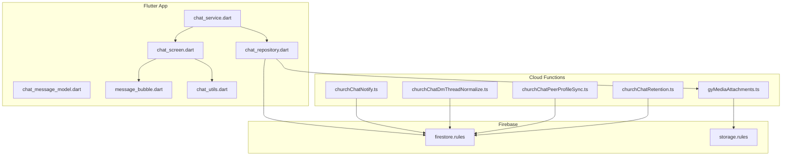
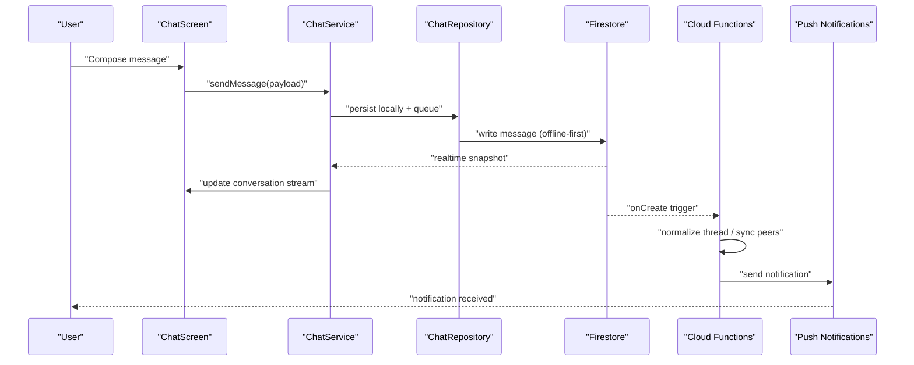
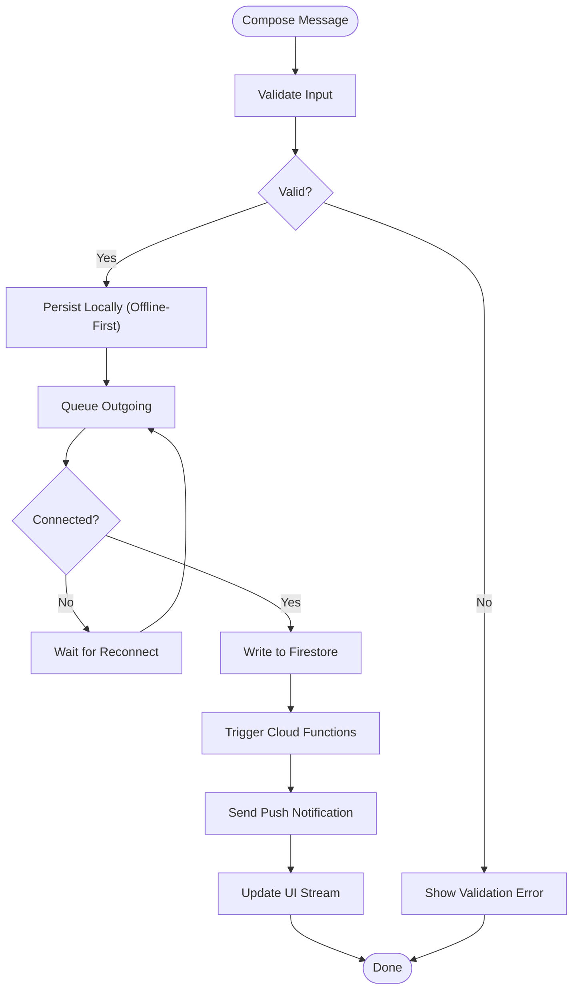
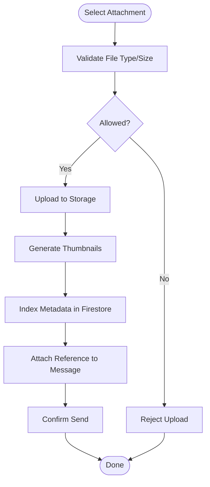
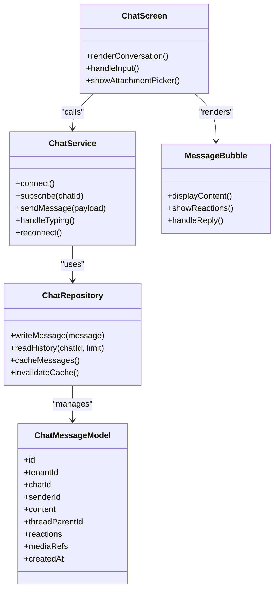
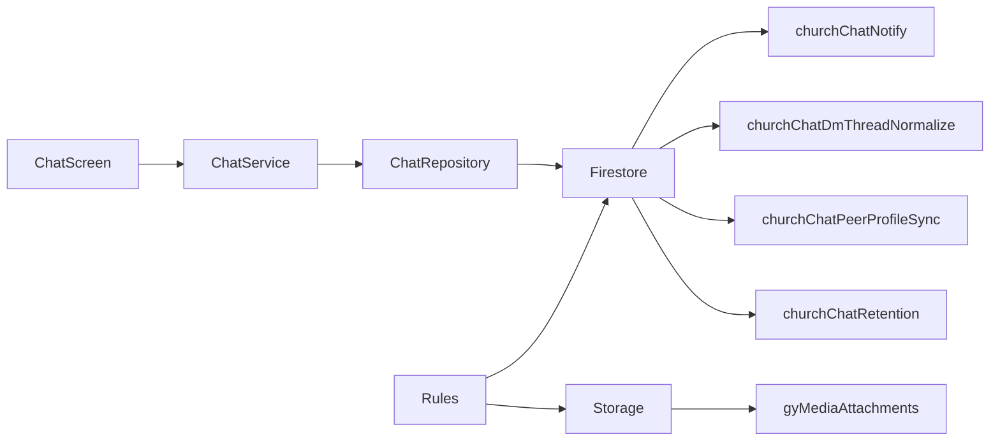

# Chat System

<cite>
**Referenced Files in This Document**
- [CHAT_ENGINE.md](file://CHAT_ENGINE.md)
- [functions/src/churchChatNotify.ts](file://functions/src/churchChatNotify.ts)
- [functions/src/churchChatDmThreadNormalize.ts](file://functions/src/churchChatDmThreadNormalize.ts)
- [functions/src/churchChatPeerProfileSync.ts](file://functions/src/churchChatPeerProfileSync.ts)
- [functions/src/churchChatRetention.ts](file://functions/src/churchChatRetention.ts)
- [functions/src/gyMediaAttachments.ts](file://functions/src/gyMediaAttachments.ts)
- [flutter_app/lib/services/chat_service.dart](file://flutter_app/lib/services/chat_service.dart)
- [flutter_app/lib/repositories/chat_repository.dart](file://flutter_app/lib/repositories/chat_repository.dart)
- [flutter_app/lib/models/chat_message_model.dart](file://flutter_app/lib/models/chat_message_model.dart)
- [flutter_app/lib/features/chat/ui/chat_screen.dart](file://flutter_app/lib/features/chat/ui/chat_screen.dart)
- [flutter_app/lib/shared/chat_widgets/message_bubble.dart](file://flutter_app/lib/shared/chat_widgets/message_bubble.dart)
- [flutter_app/lib/utils/chat_utils.dart](file://flutter_app/lib/utils/chat_utils.dart)
- [firestore.rules](file://firestore.rules)
- [storage.rules](file://storage.rules)
</cite>

## Table of Contents
1. [Introduction](#introduction)
2. [Project Structure](#project-structure)
3. [Core Components](#core-components)
4. [Architecture Overview](#architecture-overview)
5. [Detailed Component Analysis](#detailed-component-analysis)
6. [Dependency Analysis](#dependency-analysis)
7. [Performance Considerations](#performance-considerations)
8. [Troubleshooting Guide](#troubleshooting-guide)
9. [Conclusion](#conclusion)
10. [Appendices](#appendices)

## Introduction
This document provides comprehensive documentation for the chat system of the Gestão Yahweh Premium application. It covers real-time messaging, Telegram integration via TDLIB, message threading, reactions, and media sharing. It explains the chat architecture including WebSocket connections, message synchronization, offline handling, direct messages, group conversations, channel broadcasting, and notifications. Implementation details include sending messages, handling attachments, managing participants, and extending custom features. Performance optimization, delivery guarantees, and scalability considerations for large groups are also addressed.

## Project Structure
The chat system spans Flutter client code, Cloud Functions, and Firebase rules:
- Flutter app: services, repositories, models, UI components, and utilities for chat operations.
- Cloud Functions: chat notifications, thread normalization, peer profile sync, retention policies, and media attachment processing.
- Firestore and Storage rules: access control and security for chat data and media.

**Diagram sources**
- [flutter_app/lib/services/chat_service.dart](file://flutter_app/lib/services/chat_service.dart)
- [flutter_app/lib/repositories/chat_repository.dart](file://flutter_app/lib/repositories/chat_repository.dart)
- [flutter_app/lib/models/chat_message_model.dart](file://flutter_app/lib/models/chat_message_model.dart)
- [flutter_app/lib/features/chat/ui/chat_screen.dart](file://flutter_app/lib/features/chat/ui/chat_screen.dart)
- [flutter_app/lib/shared/chat_widgets/message_bubble.dart](file://flutter_app/lib/shared/chat_widgets/message_bubble.dart)
- [flutter_app/lib/utils/chat_utils.dart](file://flutter_app/lib/utils/chat_utils.dart)
- [functions/src/churchChatNotify.ts](file://functions/src/churchChatNotify.ts)
- [functions/src/churchChatDmThreadNormalize.ts](file://functions/src/churchChatDmThreadNormalize.ts)
- [functions/src/churchChatPeerProfileSync.ts](file://functions/src/churchChatPeerProfileSync.ts)
- [functions/src/churchChatRetention.ts](file://functions/src/churchChatRetention.ts)
- [functions/src/gyMediaAttachments.ts](file://functions/src/gyMediaAttachments.ts)
- [firestore.rules](file://firestore.rules)
- [storage.rules](file://storage.rules)

**Section sources**
- [CHAT_ENGINE.md](file://CHAT_ENGINE.md)

## Core Components
- Chat Service: Orchestrates real-time messaging, WebSocket lifecycle, and event dispatching to UI layers.
- Chat Repository: Encapsulates Firestore interactions, caching strategies, and offline persistence.
- Message Model: Defines message schema, threading fields, reactions, and media metadata.
- Chat UI: Renders conversations, handles input, displays bubbles, and manages user interactions.
- Cloud Functions:
  - Notification: Emits push notifications on new messages.
  - Thread Normalization: Ensures DM threads are canonicalized and consistent.
  - Peer Profile Sync: Keeps participant profiles up-to-date across chats.
  - Retention: Enforces message archival and cleanup policies.
  - Media Attachments: Processes and indexes uploaded media for fast retrieval.
- Rules: Secure read/write access for chat documents and media storage.

**Section sources**
- [flutter_app/lib/services/chat_service.dart](file://flutter_app/lib/services/chat_service.dart)
- [flutter_app/lib/repositories/chat_repository.dart](file://flutter_app/lib/repositories/chat_repository.dart)
- [flutter_app/lib/models/chat_message_model.dart](file://flutter_app/lib/models/chat_message_model.dart)
- [flutter_app/lib/features/chat/ui/chat_screen.dart](file://flutter_app/lib/features/chat/ui/chat_screen.dart)
- [flutter_app/lib/shared/chat_widgets/message_bubble.dart](file://flutter_app/lib/shared/chat_widgets/message_bubble.dart)
- [flutter_app/lib/utils/chat_utils.dart](file://flutter_app/lib/utils/chat_utils.dart)
- [functions/src/churchChatNotify.ts](file://functions/src/churchChatNotify.ts)
- [functions/src/churchChatDmThreadNormalize.ts](file://functions/src/churchChatDmThreadNormalize.ts)
- [functions/src/churchChatPeerProfileSync.ts](file://functions/src/churchChatPeerProfileSync.ts)
- [functions/src/churchChatRetention.ts](file://functions/src/churchChatRetention.ts)
- [functions/src/gyMediaAttachments.ts](file://functions/src/gyMediaAttachments.ts)
- [firestore.rules](file://firestore.rules)
- [storage.rules](file://storage.rules)

## Architecture Overview
The chat system follows an offline-first, event-driven architecture with real-time synchronization:
- Client-side: Flutter service maintains WebSocket connections and local caches; repository writes to Firestore and persists offline.
- Server-side: Cloud Functions handle side effects like notifications, thread normalization, profile sync, retention, and media processing.
- Security: Firestore and Storage rules enforce tenant-scoped access and role-based permissions.

**Diagram sources**
- [flutter_app/lib/features/chat/ui/chat_screen.dart](file://flutter_app/lib/features/chat/ui/chat_screen.dart)
- [flutter_app/lib/services/chat_service.dart](file://flutter_app/lib/services/chat_service.dart)
- [flutter_app/lib/repositories/chat_repository.dart](file://flutter_app/lib/repositories/chat_repository.dart)
- [functions/src/churchChatNotify.ts](file://functions/src/churchChatNotify.ts)
- [functions/src/churchChatDmThreadNormalize.ts](file://functions/src/churchChatDmThreadNormalize.ts)
- [functions/src/churchChatPeerProfileSync.ts](file://functions/src/churchChatPeerProfileSync.ts)

## Detailed Component Analysis

### Chat Service
Responsibilities:
- Manage WebSocket lifecycle and reconnection logic.
- Subscribe to conversation streams and broadcast events to UI.
- Handle typing indicators, read receipts, and presence.
- Integrate with Telegram via TDLIB for cross-platform messaging where applicable.

Key behaviors:
- Establishes persistent connection and handles auth tokens.
- Queues outgoing messages when offline and flushes on reconnect.
- Debounces heavy operations and throttles updates to reduce churn.

**Section sources**
- [flutter_app/lib/services/chat_service.dart](file://flutter_app/lib/services/chat_service.dart)

### Chat Repository
Responsibilities:
- Encapsulate Firestore reads/writes for messages, participants, and metadata.
- Implement optimistic updates and conflict resolution.
- Cache recent messages and paginate history efficiently.
- Coordinate with Cloud Functions for server-side side effects.

Optimizations:
- Batched writes and structured queries.
- Local cache invalidation on mutations.
- Index usage aligned with query patterns.

**Section sources**
- [flutter_app/lib/repositories/chat_repository.dart](file://flutter_app/lib/repositories/chat_repository.dart)

### Message Model
Schema highlights:
- Unique identifiers, timestamps, sender info, and content.
- Threading fields for replies and parent references.
- Reactions map keyed by user IDs.
- Media metadata for attachments and thumbnails.

Complexity considerations:
- Immutable message records with append-only updates.
- Efficient indexing on tenant, chatId, and timestamp.

**Section sources**
- [flutter_app/lib/models/chat_message_model.dart](file://flutter_app/lib/models/chat_message_model.dart)

### Chat UI
Features:
- Real-time rendering of messages and threads.
- Input validation, emoji support, and rich text formatting.
- Attachment picker and preview for images, videos, and files.
- Reaction picker and inline reply flows.

Interactions:
- Pull-to-refresh and infinite scroll.
- Typing indicators and read receipts display.

**Section sources**
- [flutter_app/lib/features/chat/ui/chat_screen.dart](file://flutter_app/lib/features/chat/ui/chat_screen.dart)
- [flutter_app/lib/shared/chat_widgets/message_bubble.dart](file://flutter_app/lib/shared/chat_widgets/message_bubble.dart)

### Cloud Functions
- churchChatNotify: Emits push notifications for new messages and mentions.
- churchChatDmThreadNormalize: Canonicalizes DM threads and ensures consistency.
- churchChatPeerProfileSync: Updates participant profiles across chats.
- churchChatRetention: Archives or purges messages based on policy.
- gyMediaAttachments: Processes uploads, generates thumbnails, and indexes metadata.

Operational notes:
- Idempotent handlers to avoid duplicate notifications.
- Rate limiting and backoff for external integrations.
- Audit logging for compliance and debugging.

**Section sources**
- [functions/src/churchChatNotify.ts](file://functions/src/churchChatNotify.ts)
- [functions/src/churchChatDmThreadNormalize.ts](file://functions/src/churchChatDmThreadNormalize.ts)
- [functions/src/churchChatPeerProfileSync.ts](file://functions/src/churchChatPeerProfileSync.ts)
- [functions/src/churchChatRetention.ts](file://functions/src/churchChatRetention.ts)
- [functions/src/gyMediaAttachments.ts](file://functions/src/gyMediaAttachments.ts)

### Security Rules
- Firestore rules enforce tenant isolation, role-based access, and write permissions.
- Storage rules restrict media access to authenticated users within tenants and validate file types/sizes.

Best practices:
- Validate request payloads at the edge using callable functions.
- Use composite indexes to optimize common queries.

**Section sources**
- [firestore.rules](file://firestore.rules)
- [storage.rules](file://storage.rules)

### Data Flow Diagrams

#### Sending a Message

**Diagram sources**
- [flutter_app/lib/features/chat/ui/chat_screen.dart](file://flutter_app/lib/features/chat/ui/chat_screen.dart)
- [flutter_app/lib/services/chat_service.dart](file://flutter_app/lib/services/chat_service.dart)
- [flutter_app/lib/repositories/chat_repository.dart](file://flutter_app/lib/repositories/chat_repository.dart)
- [functions/src/churchChatNotify.ts](file://functions/src/churchChatNotify.ts)

#### Handling Attachments

**Diagram sources**
- [functions/src/gyMediaAttachments.ts](file://functions/src/gyMediaAttachments.ts)
- [flutter_app/lib/repositories/chat_repository.dart](file://flutter_app/lib/repositories/chat_repository.dart)

### Class Relationships

**Diagram sources**
- [flutter_app/lib/services/chat_service.dart](file://flutter_app/lib/services/chat_service.dart)
- [flutter_app/lib/repositories/chat_repository.dart](file://flutter_app/lib/repositories/chat_repository.dart)
- [flutter_app/lib/models/chat_message_model.dart](file://flutter_app/lib/models/chat_message_model.dart)
- [flutter_app/lib/features/chat/ui/chat_screen.dart](file://flutter_app/lib/features/chat/ui/chat_screen.dart)
- [flutter_app/lib/shared/chat_widgets/message_bubble.dart](file://flutter_app/lib/shared/chat_widgets/message_bubble.dart)

## Dependency Analysis
- Flutter components depend on services and repositories for data and real-time updates.
- Cloud Functions depend on Firestore triggers and Storage events.
- Rules enforce boundaries between clients and server resources.

**Diagram sources**
- [flutter_app/lib/features/chat/ui/chat_screen.dart](file://flutter_app/lib/features/chat/ui/chat_screen.dart)
- [flutter_app/lib/services/chat_service.dart](file://flutter_app/lib/services/chat_service.dart)
- [flutter_app/lib/repositories/chat_repository.dart](file://flutter_app/lib/repositories/chat_repository.dart)
- [functions/src/churchChatNotify.ts](file://functions/src/churchChatNotify.ts)
- [functions/src/churchChatDmThreadNormalize.ts](file://functions/src/churchChatDmThreadNormalize.ts)
- [functions/src/churchChatPeerProfileSync.ts](file://functions/src/churchChatPeerProfileSync.ts)
- [functions/src/churchChatRetention.ts](file://functions/src/churchChatRetention.ts)
- [functions/src/gyMediaAttachments.ts](file://functions/src/gyMediaAttachments.ts)
- [firestore.rules](file://firestore.rules)
- [storage.rules](file://storage.rules)

**Section sources**
- [CHAT_ENGINE.md](file://CHAT_ENGINE.md)

## Performance Considerations
- Offline-first design reduces latency and improves resilience.
- Optimistic UI updates provide immediate feedback while background sync occurs.
- Pagination and virtualization prevent memory spikes in large groups.
- Debounce and throttle incoming events to minimize render churn.
- Use composite indexes aligned with frequent queries.
- Compress and thumbnail media to reduce bandwidth and storage costs.
- Implement idempotent function handlers to avoid duplicate work.

[No sources needed since this section provides general guidance]

## Troubleshooting Guide
Common issues and resolutions:
- Connection drops: Ensure reconnection logic is robust and exponential backoff is applied.
- Duplicate notifications: Verify idempotency keys and deduplication in functions.
- Missing media: Check Storage upload completion and metadata indexing.
- Permission errors: Review Firestore and Storage rules for tenant scoping and roles.
- Stale cache: Invalidate cache on mutations and reconcile with server state.

**Section sources**
- [flutter_app/lib/services/chat_service.dart](file://flutter_app/lib/services/chat_service.dart)
- [flutter_app/lib/repositories/chat_repository.dart](file://flutter_app/lib/repositories/chat_repository.dart)
- [functions/src/churchChatNotify.ts](file://functions/src/churchChatNotify.ts)
- [functions/src/gyMediaAttachments.ts](file://functions/src/gyMediaAttachments.ts)
- [firestore.rules](file://firestore.rules)
- [storage.rules](file://storage.rules)

## Conclusion
The chat system combines a resilient Flutter client with scalable Cloud Functions and secure Firebase infrastructure. It supports real-time messaging, threading, reactions, and media sharing while ensuring offline reliability and performance. By following best practices for caching, indexing, and idempotent processing, the system scales effectively to large groups and high message volumes.

[No sources needed since this section summarizes without analyzing specific files]

## Appendices

### Examples and Usage Patterns
- Sending a message: Compose payload, validate, persist locally, queue, and send via service.
- Handling attachments: Validate type/size, upload to storage, generate thumbnails, index metadata, attach reference.
- Managing participants: Add/remove members, update roles, sync profiles via functions.
- Custom features: Extend message model with custom fields, implement handlers in functions, and render in UI.

[No sources needed since this section provides general guidance]