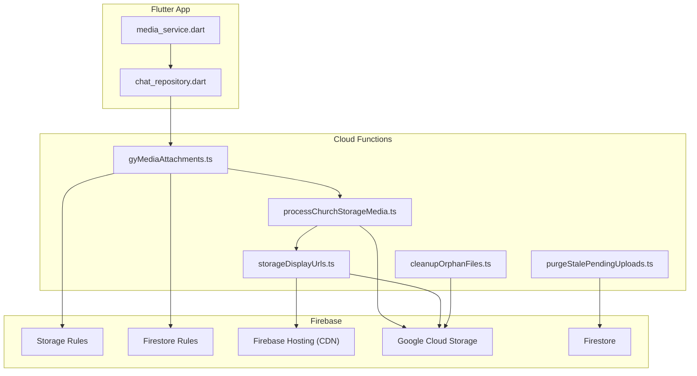
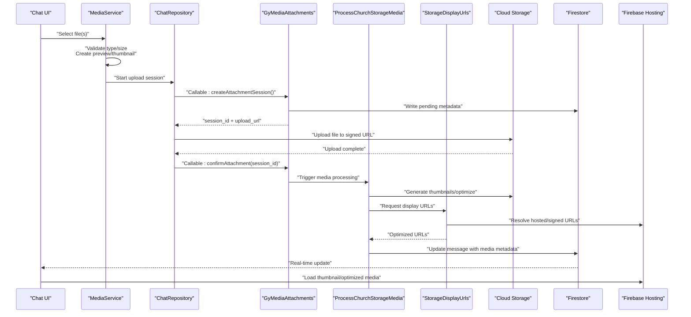
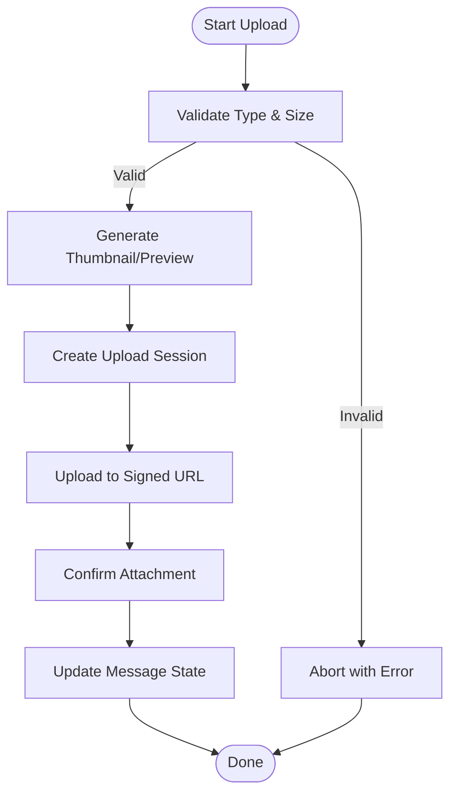
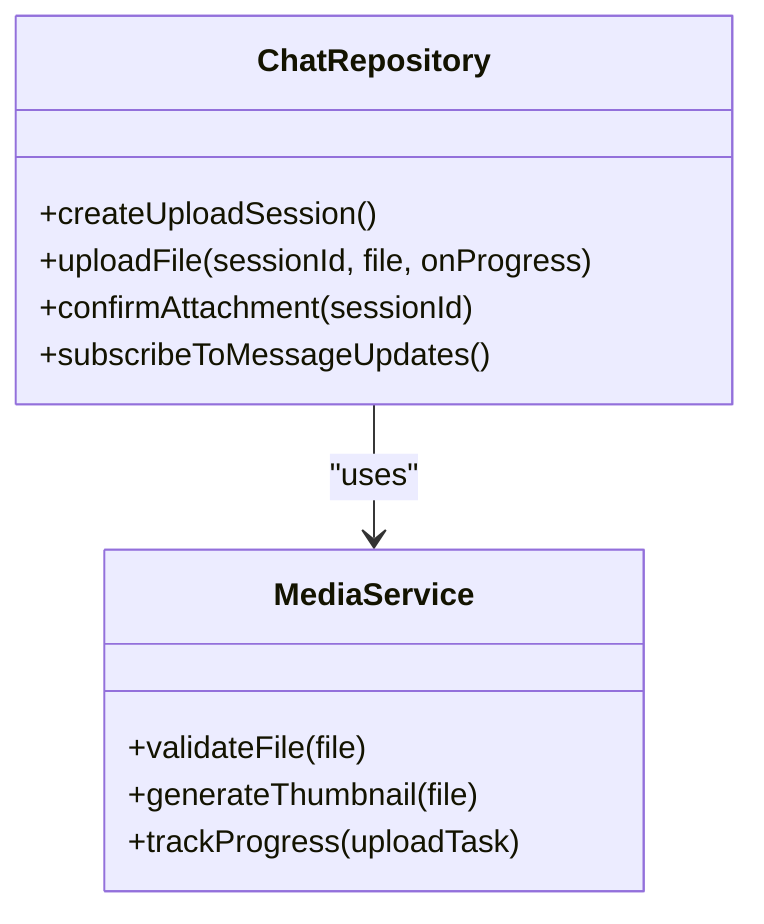
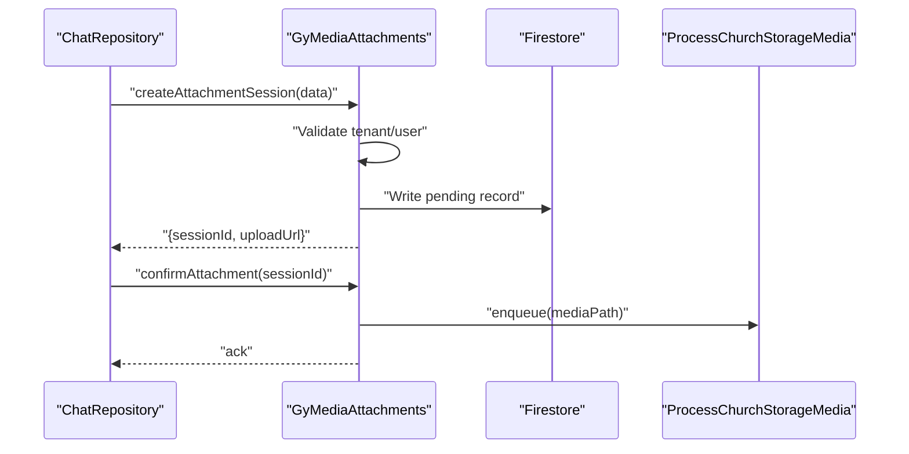
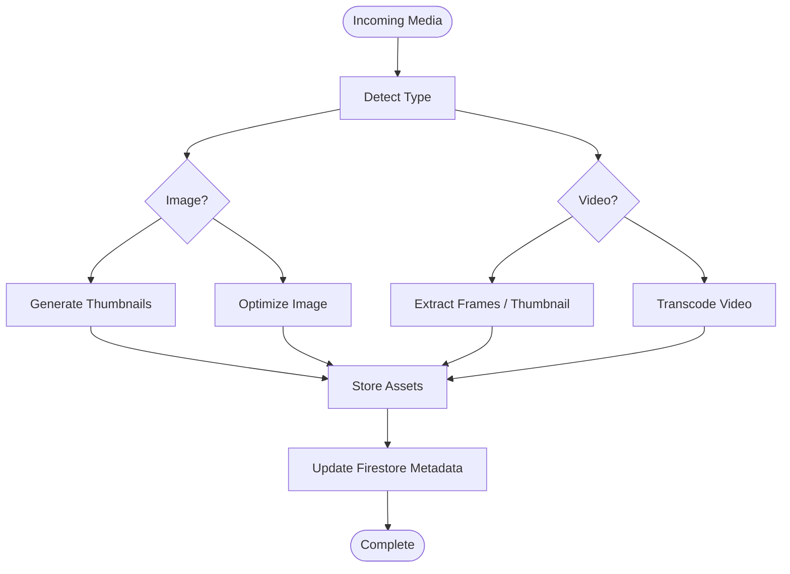
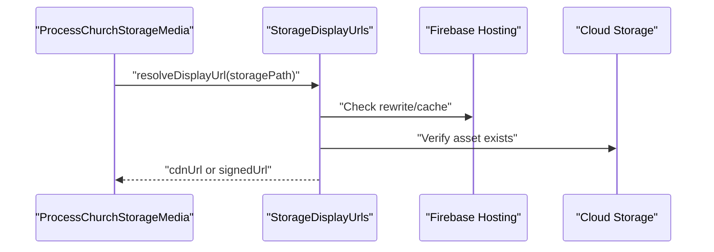
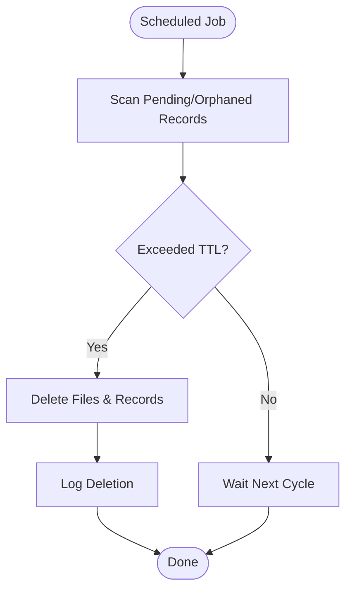
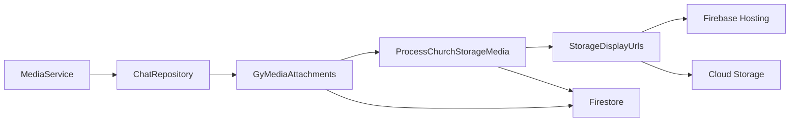

# Media Sharing & Attachments

<cite>
**Referenced Files in This Document**
- [flutter_app/lib/services/media_service.dart](file://flutter_app/lib/services/media_service.dart)
- [flutter_app/lib/repositories/chat_repository.dart](file://flutter_app/lib/repositories/chat_repository.dart)
- [functions/src/gyMediaAttachments.ts](file://functions/src/gyMediaAttachments.ts)
- [functions/lib/gyMediaAttachments.js](file://functions/lib/gyMediaAttachments.js)
- [functions/src/processChurchStorageMedia.ts](file://functions/src/processChurchStorageMedia.ts)
- [functions/lib/processChurchStorageMedia.js](file://functions/lib/processChurchStorageMedia.js)
- [functions/src/storageDisplayUrls.ts](file://functions/src/storageDisplayUrls.ts)
- [functions/lib/storageDisplayUrls.js](file://functions/lib/storageDisplayUrls.js)
- [functions/src/cleanupOrphanFiles.ts](file://functions/src/cleanupOrphanFiles.ts)
- [functions/lib/cleanupOrphanFiles.js](file://functions/lib/cleanupOrphanFiles.js)
- [functions/src/purgeStalePendingUploads.ts](file://functions/src/purgeStalePendingUploads.ts)
- [functions/lib/purgeStalePendingUploads.js](file://functions/lib/purgeStalePendingUploads.js)
- [storage.rules](file://storage.rules)
- [firestore.rules](file://firestore.rules)
- [firebase.json](file://firebase.json)
- [flutter_app/MIDIA_STORAGE_PADRAO_ECOFIRE.md](file://flutter_app/MIDIA_STORAGE_PADRAO_ECOFIRE.md)
- [flutter_app/STORAGE_CORS_README.txt](file://flutter_app/STORAGE_CORS_README.txt)
- [flutter_app/storage_cors.json](file://flutter_app/storage_cors.json)
</cite>

## Table of Contents
1. [Introduction](#introduction)
2. [Project Structure](#project-structure)
3. [Core Components](#core-components)
4. [Architecture Overview](#architecture-overview)
5. [Detailed Component Analysis](#detailed-component-analysis)
6. [Dependency Analysis](#dependency-analysis)
7. [Performance Considerations](#performance-considerations)
8. [Troubleshooting Guide](#troubleshooting-guide)
9. [Conclusion](#conclusion)
10. [Appendices](#appendices)

## Introduction
This document explains how the chat system handles media sharing and attachments across Flutter clients and Cloud Functions. It covers upload flows, image/video optimization, thumbnail generation, CDN integration via Firebase Hosting, supported formats, size limits, security validation, progress tracking, previews, lifecycle management, storage organization, access control, caching strategies, and performance optimizations for large files.

## Project Structure
The media pipeline spans three layers:
- Flutter client services and repositories that orchestrate uploads, progress, previews, and metadata persistence.
- Cloud Functions that validate, optimize, generate thumbnails, and manage display URLs.
- Storage and Firestore rules enforcing tenant isolation, size/format checks, and access control.

**Diagram sources**
- [flutter_app/lib/services/media_service.dart](file://flutter_app/lib/services/media_service.dart)
- [flutter_app/lib/repositories/chat_repository.dart](file://flutter_app/lib/repositories/chat_repository.dart)
- [functions/src/gyMediaAttachments.ts](file://functions/src/gyMediaAttachments.ts)
- [functions/src/processChurchStorageMedia.ts](file://functions/src/processChurchStorageMedia.ts)
- [functions/src/storageDisplayUrls.ts](file://functions/src/storageDisplayUrls.ts)
- [functions/src/cleanupOrphanFiles.ts](file://functions/src/cleanupOrphanFiles.ts)
- [functions/src/purgeStalePendingUploads.ts](file://functions/src/purgeStalePendingUploads.ts)
- [storage.rules](file://storage.rules)
- [firestore.rules](file://firestore.rules)
- [firebase.json](file://firebase.json)

**Section sources**
- [flutter_app/lib/services/media_service.dart](file://flutter_app/lib/services/media_service.dart)
- [flutter_app/lib/repositories/chat_repository.dart](file://flutter_app/lib/repositories/chat_repository.dart)
- [functions/src/gyMediaAttachments.ts](file://functions/src/gyMediaAttachments.ts)
- [functions/src/processChurchStorageMedia.ts](file://functions/src/processChurchStorageMedia.ts)
- [functions/src/storageDisplayUrls.ts](file://functions/src/storageDisplayUrls.ts)
- [functions/src/cleanupOrphanFiles.ts](file://functions/src/cleanupOrphanFiles.ts)
- [functions/src/purgeStalePendingUploads.ts](file://functions/src/purgeStalePendingUploads.ts)
- [storage.rules](file://storage.rules)
- [firestore.rules](file://firestore.rules)
- [firebase.json](file://firebase.json)

## Core Components
- Client-side upload orchestrator: manages file selection, preview, progress, chunking, and retry logic; integrates with cloud functions to finalize metadata and trigger processing.
- Server-side attachment handler: validates inputs, enforces policies, writes metadata, and triggers media processing.
- Media processor: resizes images, transcodes videos, generates thumbnails, and stores optimized assets.
- Display URL generator: creates signed or hosted URLs for fast delivery through CDN.
- Lifecycle utilities: cleanup orphaned files and purge stale pending uploads.

Key responsibilities:
- Security: format/size validation, tenant scoping, and rule enforcement.
- Performance: progressive loading, thumbnails, CDN caching, and background processing.
- Reliability: retries, idempotency keys, and cleanup jobs.

**Section sources**
- [flutter_app/lib/services/media_service.dart](file://flutter_app/lib/services/media_service.dart)
- [flutter_app/lib/repositories/chat_repository.dart](file://flutter_app/lib/repositories/chat_repository.dart)
- [functions/src/gyMediaAttachments.ts](file://functions/src/gyMediaAttachments.ts)
- [functions/src/processChurchStorageMedia.ts](file://functions/src/processChurchStorageMedia.ts)
- [functions/src/storageDisplayUrls.ts](file://functions/src/storageDisplayUrls.ts)
- [functions/src/cleanupOrphanFiles.ts](file://functions/src/cleanupOrphanFiles.ts)
- [functions/src/purgeStalePendingUploads.ts](file://functions/src/purgeStalePendingUploads.ts)

## Architecture Overview
End-to-end flow from upload to display:

**Diagram sources**
- [flutter_app/lib/services/media_service.dart](file://flutter_app/lib/services/media_service.dart)
- [flutter_app/lib/repositories/chat_repository.dart](file://flutter_app/lib/repositories/chat_repository.dart)
- [functions/src/gyMediaAttachments.ts](file://functions/src/gyMediaAttachments.ts)
- [functions/src/processChurchStorageMedia.ts](file://functions/src/processChurchStorageMedia.ts)
- [functions/src/storageDisplayUrls.ts](file://functions/src/storageDisplayUrls.ts)
- [firebase.json](file://firebase.json)

## Detailed Component Analysis

### Client Upload Orchestration (MediaService)
Responsibilities:
- File validation (type, size).
- Preview generation (thumbnails for images/videos).
- Progress tracking and resumable uploads.
- Session creation and confirmation with backend.
- Error handling and retries.

**Diagram sources**
- [flutter_app/lib/services/media_service.dart](file://flutter_app/lib/services/media_service.dart)

**Section sources**
- [flutter_app/lib/services/media_service.dart](file://flutter_app/lib/services/media_service.dart)

### Chat Repository Integration
Responsibilities:
- Exposes methods for upload sessions, progress callbacks, and finalization.
- Manages local state and real-time updates for messages.
- Integrates with MediaService and Cloud Functions callables.

**Diagram sources**
- [flutter_app/lib/repositories/chat_repository.dart](file://flutter_app/lib/repositories/chat_repository.dart)
- [flutter_app/lib/services/media_service.dart](file://flutter_app/lib/services/media_service.dart)

**Section sources**
- [flutter_app/lib/repositories/chat_repository.dart](file://flutter_app/lib/repositories/chat_repository.dart)
- [flutter_app/lib/services/media_service.dart](file://flutter_app/lib/services/media_service.dart)

### Server Attachment Handler (gyMediaAttachments)
Responsibilities:
- Validates request context (tenant, user role).
- Enforces size/type policies.
- Creates pending metadata records.
- Returns secure upload URLs.
- Confirms uploads and triggers processing.

**Diagram sources**
- [functions/src/gyMediaAttachments.ts](file://functions/src/gyMediaAttachments.ts)
- [functions/lib/gyMediaAttachments.js](file://functions/lib/gyMediaAttachments.js)

**Section sources**
- [functions/src/gyMediaAttachments.ts](file://functions/src/gyMediaAttachments.ts)
- [functions/lib/gyMediaAttachments.js](file://functions/lib/gyMediaAttachments.js)

### Media Processor (processChurchStorageMedia)
Responsibilities:
- Detects media type.
- Generates thumbnails for images and video frames.
- Optimizes/transcodes media (e.g., WebP, MP4/H.264).
- Stores optimized assets alongside originals.
- Updates Firestore with processed URLs and metadata.

**Diagram sources**
- [functions/src/processChurchStorageMedia.ts](file://functions/src/processChurchStorageMedia.ts)
- [functions/lib/processChurchStorageMedia.js](file://functions/lib/processChurchStorageMedia.js)

**Section sources**
- [functions/src/processChurchStorageMedia.ts](file://functions/src/processChurchStorageMedia.ts)
- [functions/lib/processChurchStorageMedia.js](file://functions/lib/processChurchStorageMedia.js)

### Display URL Generator (storageDisplayUrls)
Responsibilities:
- Produces short, cache-friendly URLs for thumbnails and optimized media.
- Integrates with Firebase Hosting rewrites for CDN delivery.
- Optionally signs URLs for private assets.

**Diagram sources**
- [functions/src/storageDisplayUrls.ts](file://functions/src/storageDisplayUrls.ts)
- [functions/lib/storageDisplayUrls.js](file://functions/lib/storageDisplayUrls.js)
- [firebase.json](file://firebase.json)

**Section sources**
- [functions/src/storageDisplayUrls.ts](file://functions/src/storageDisplayUrls.ts)
- [functions/lib/storageDisplayUrls.js](file://functions/lib/storageDisplayUrls.js)
- [firebase.json](file://firebase.json)

### Lifecycle Utilities
- Cleanup orphaned files: scans storage for files without corresponding Firestore references and deletes them.
- Purge stale pending uploads: removes incomplete sessions older than a threshold to free resources.

**Diagram sources**
- [functions/src/cleanupOrphanFiles.ts](file://functions/src/cleanupOrphanFiles.ts)
- [functions/lib/cleanupOrphanFiles.js](file://functions/lib/cleanupOrphanFiles.js)
- [functions/src/purgeStalePendingUploads.ts](file://functions/src/purgeStalePendingUploads.ts)
- [functions/lib/purgeStalePendingUploads.js](file://functions/lib/purgeStalePendingUploads.js)

**Section sources**
- [functions/src/cleanupOrphanFiles.ts](file://functions/src/cleanupOrphanFiles.ts)
- [functions/lib/cleanupOrphanFiles.js](file://functions/lib/cleanupOrphanFiles.js)
- [functions/src/purgeStalePendingUploads.ts](file://functions/src/purgeStalePendingUploads.ts)
- [functions/lib/purgeStalePendingUploads.js](file://functions/lib/purgeStalePendingUploads.js)

## Dependency Analysis
Client-server dependencies and data flow:

**Diagram sources**
- [flutter_app/lib/services/media_service.dart](file://flutter_app/lib/services/media_service.dart)
- [flutter_app/lib/repositories/chat_repository.dart](file://flutter_app/lib/repositories/chat_repository.dart)
- [functions/src/gyMediaAttachments.ts](file://functions/src/gyMediaAttachments.ts)
- [functions/src/processChurchStorageMedia.ts](file://functions/src/processChurchStorageMedia.ts)
- [functions/src/storageDisplayUrls.ts](file://functions/src/storageDisplayUrls.ts)
- [firebase.json](file://firebase.json)

**Section sources**
- [flutter_app/lib/services/media_service.dart](file://flutter_app/lib/services/media_service.dart)
- [flutter_app/lib/repositories/chat_repository.dart](file://flutter_app/lib/repositories/chat_repository.dart)
- [functions/src/gyMediaAttachments.ts](file://functions/src/gyMediaAttachments.ts)
- [functions/src/processChurchStorageMedia.ts](file://functions/src/processChurchStorageMedia.ts)
- [functions/src/storageDisplayUrls.ts](file://functions/src/storageDisplayUrls.ts)
- [firebase.json](file://firebase.json)

## Performance Considerations
- Progressive loading: show thumbnails immediately while optimized media loads in background.
- CDN caching: use Firebase Hosting rewrites and appropriate cache headers for static assets.
- Background processing: offload transcoding and resizing to Cloud Functions to keep UI responsive.
- Chunked/resumable uploads: handle network interruptions gracefully.
- Cache invalidation: versioned paths or cache-busting query parameters when replacing assets.
- Batch operations: group Firestore writes to reduce latency and cost.

[No sources needed since this section provides general guidance]

## Troubleshooting Guide
Common issues and resolutions:
- Upload fails due to size/type: verify client-side validation and server policy; check error codes returned by callable functions.
- Missing thumbnails: ensure processing function runs successfully and assets are stored under expected paths.
- Slow loading: inspect CDN cache hits and hosting rewrites; verify signed URLs if assets are private.
- Stale pending uploads: run purge job or manually clean up sessions exceeding TTL.
- Orphaned files: execute cleanup job to remove files without Firestore references.

**Section sources**
- [functions/src/cleanupOrphanFiles.ts](file://functions/src/cleanupOrphanFiles.ts)
- [functions/lib/cleanupOrphanFiles.js](file://functions/lib/cleanupOrphanFiles.js)
- [functions/src/purgeStalePendingUploads.ts](file://functions/src/purgeStalePendingUploads.ts)
- [functions/lib/purgeStalePendingUploads.js](file://functions/lib/purgeStalePendingUploads.js)

## Conclusion
The media sharing pipeline combines robust client orchestration, secure server validation, efficient processing, and CDN-backed delivery. By enforcing strict policies, optimizing assets, and leveraging caching, the system delivers fast, reliable media experiences in chat while maintaining security and scalability.

[No sources needed since this section summarizes without analyzing specific files]

## Appendices

### Supported Formats and Limits
- Images: JPEG, PNG, WebP, HEIC (client-dependent), GIF (animated may be limited).
- Videos: MP4 (H.264/AAC), MOV (platform-dependent), WebM (browser-dependent).
- Documents: PDF, DOCX, XLSX, TXT (depending on chat feature set).
- Size limits: enforced at both client and server; typical caps around several MB for images and tens of MB for videos.

[No sources needed since this section provides general guidance]

### Storage Organization
- Tenant-scoped directories per church/tenant.
- Subfolders for original media, thumbnails, and optimized variants.
- Metadata in Firestore linked to storage paths.

[No sources needed since this section provides general guidance]

### Access Control and Security
- Storage rules enforce tenant ownership and read/write permissions.
- Firestore rules protect message metadata and prevent unauthorized access.
- Signed URLs for private assets; public URLs for cached thumbnails.

**Section sources**
- [storage.rules](file://storage.rules)
- [firestore.rules](file://firestore.rules)

### CDN Integration
- Firebase Hosting rewrites map optimized paths to CDN endpoints.
- Cache headers configured for long-lived caching of immutable assets.

**Section sources**
- [firebase.json](file://firebase.json)

### CORS Configuration
- Storage CORS settings allow cross-origin requests from web clients.

**Section sources**
- [flutter_app/STORAGE_CORS_README.txt](file://flutter_app/STORAGE_CORS_README.txt)
- [flutter_app/storage_cors.json](file://flutter_app/storage_cors.json)

### Example Workflows
- Uploading an image: select file -> validate -> create session -> upload -> confirm -> process -> display thumbnail -> load optimized image.
- Uploading a video: similar flow with transcoding and frame extraction for thumbnails.
- Progress tracking: observe upload task progress and update UI accordingly.
- Previews: generate local thumbnails before upload to improve UX.
- Lifecycle: monitor pending uploads and clean up orphans periodically.

[No sources needed since this section provides general guidance]