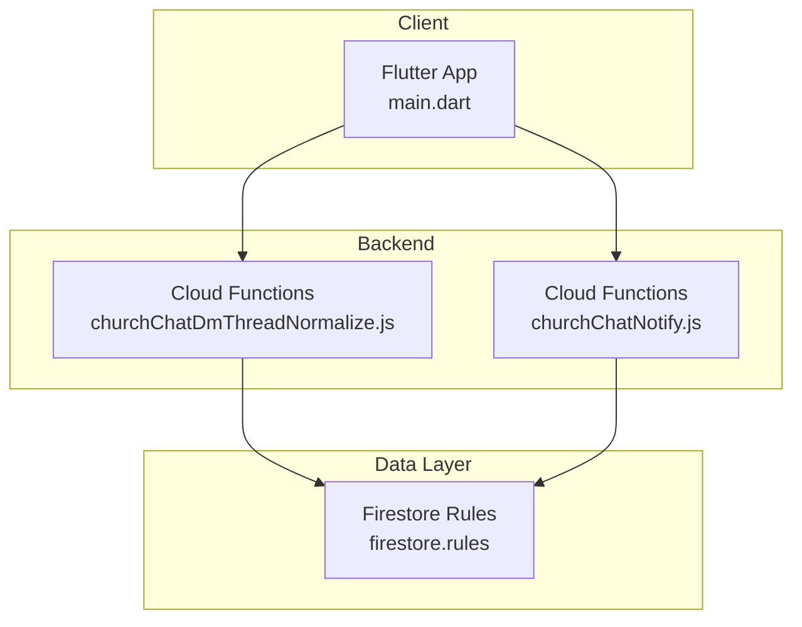
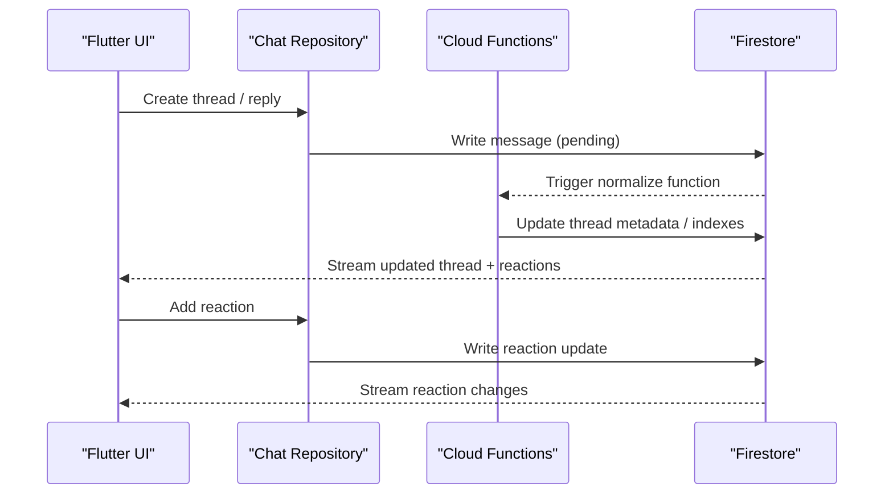
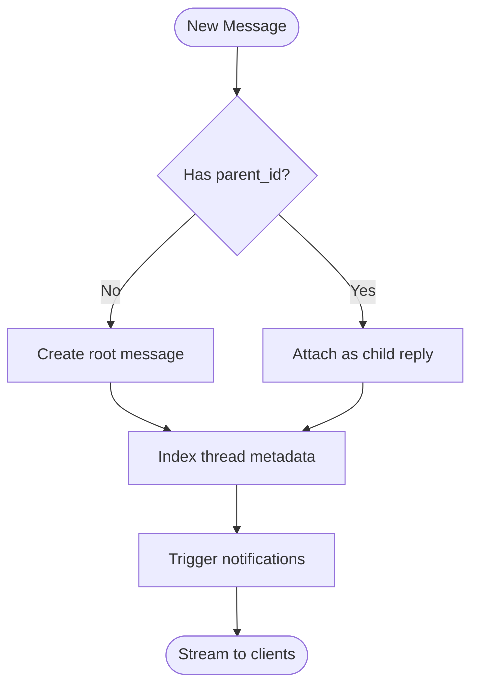
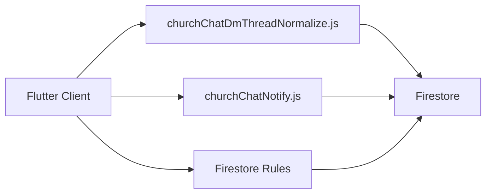

# Message Threading & Reactions

<cite>
**Referenced Files in This Document**
- [CHAT_ENGINE.md](file://CHAT_ENGINE.md)
- [churchChatDmThreadNormalize.js](file://functions/lib/churchChatDmThreadNormalize.js)
- [churchChatNotify.js](file://functions/lib/churchChatNotify.js)
- [firestore.rules](file://firestore.rules)
- [main.dart](file://flutter_app/lib/main.dart)
</cite>

## Table of Contents
1. [Introduction](#introduction)
2. [Project Structure](#project-structure)
3. [Core Components](#core-components)
4. [Architecture Overview](#architecture-overview)
5. [Detailed Component Analysis](#detailed-component-analysis)
6. [Dependency Analysis](#dependency-analysis)
7. [Performance Considerations](#performance-considerations)
8. [Troubleshooting Guide](#troubleshooting-guide)
9. [Conclusion](#conclusion)
10. [Appendices](#appendices)

## Introduction
This document explains the message threading and reaction systems implemented in the chat module. It covers thread hierarchy, nested conversations, reply chains, reaction types and emoji support, real-time updates, data modeling, performance considerations for deep hierarchies, and synchronization strategies for concurrent updates. The goal is to provide both a conceptual overview and code-level insights grounded in the repository’s chat engine documentation and backend functions.

## Project Structure
The chat subsystem spans Flutter client code, Firebase Cloud Functions, and Firestore rules:
- Chat engine design and patterns are documented in a dedicated markdown file.
- Backend normalization and notification logic live in Cloud Functions.
- Security and access control are enforced via Firestore rules.
- The Flutter app entrypoint initializes services that consume chat features.

**Diagram sources**
- [main.dart](file://flutter_app/lib/main.dart)
- [churchChatDmThreadNormalize.js](file://functions/lib/churchChatDmThreadNormalize.js)
- [churchChatNotify.js](file://functions/lib/churchChatNotify.js)
- [firestore.rules](file://firestore.rules)

**Section sources**
- [CHAT_ENGINE.md](file://CHAT_ENGINE.md)
- [churchChatDmThreadNormalize.js](file://functions/lib/churchChatDmThreadNormalize.js)
- [churchChatNotify.js](file://functions/lib/churchChatNotify.js)
- [firestore.rules](file://firestore.rules)
- [main.dart](file://flutter_app/lib/main.dart)

## Core Components
- Thread model and hierarchy: Defines how messages form threads, parent-child relationships, and nested replies.
- Reply chain processing: Ensures ordered rendering and consistent traversal of conversation branches.
- Reaction system: Supports emoji reactions with per-message state and real-time updates.
- Real-time sync: Uses Firestore listeners and function-driven normalization to keep clients consistent.
- Security and validation: Enforced through Firestore rules and server-side functions.

Key responsibilities:
- Client: Compose messages, attach reactions, subscribe to thread streams, render nested views.
- Backend: Normalize thread structures, propagate notifications, enforce policies.
- Data layer: Persist messages, reactions, and metadata; index for efficient queries.

**Section sources**
- [CHAT_ENGINE.md](file://CHAT_ENGINE.md)
- [churchChatDmThreadNormalize.js](file://functions/lib/churchChatDmThreadNormalize.js)
- [churchChatNotify.js](file://functions/lib/churchChatNotify.js)
- [firestore.rules](file://firestore.rules)

## Architecture Overview
The threading and reactions architecture combines client-side streaming with server-side normalization and security enforcement.

**Diagram sources**
- [churchChatDmThreadNormalize.js](file://functions/lib/churchChatDmThreadNormalize.js)
- [churchChatNotify.js](file://functions/lib/churchChatNotify.js)
- [firestore.rules](file://firestore.rules)
- [main.dart](file://flutter_app/lib/main.dart)

## Detailed Component Analysis

### Thread Hierarchy and Nested Conversations
Threads represent hierarchical conversations where each message can have a parent and multiple children. The system supports:
- Root messages forming top-level threads.
- Replies linking to a parent message ID.
- Nested depth limited by application constraints and indexing strategy.
- Ordered traversal using timestamps or sequence numbers.

Implementation highlights:
- Parent-child linkage via explicit fields on messages.
- Normalization function ensures consistent structure and indexes.
- Query patterns optimize fetching a thread and its replies efficiently.

**Diagram sources**
- [churchChatDmThreadNormalize.js](file://functions/lib/churchChatDmThreadNormalize.js)
- [churchChatNotify.js](file://functions/lib/churchChatNotify.js)

**Section sources**
- [CHAT_ENGINE.md](file://CHAT_ENGINE.md)
- [churchChatDmThreadNormalize.js](file://functions/lib/churchChatDmThreadNormalize.js)

### Reply Chains and Ordering
Reply chains must preserve conversational order and context:
- Each reply references its parent message.
- Ordering uses timestamp or sequence fields to maintain chronological flow.
- Rendering logic traverses from parent to children recursively.

Best practices:
- Use stable ordering keys to avoid re-sorting overhead.
- Paginate deep threads to prevent memory pressure.
- Cache partial thread views at the client for faster navigation.

**Section sources**
- [CHAT_ENGINE.md](file://CHAT_ENGINE.md)
- [churchChatDmThreadNormalize.js](file://functions/lib/churchChatDmThreadNormalize.js)

### Reaction Types and Emoji Support
Reactions enable lightweight feedback on messages:
- Supported reaction types include emojis and custom identifiers.
- Per-user reaction state prevents duplicates and allows toggling.
- Real-time updates reflect immediate changes across participants.

Data modeling:
- Reactions stored as subdocuments or arrays within messages.
- User-reaction mapping ensures uniqueness and quick lookup.
- Counters may be denormalized for performance.

Real-time behavior:
- Firestore listeners stream reaction changes.
- Optimistic UI updates improve perceived responsiveness.

**Section sources**
- [CHAT_ENGINE.md](file://CHAT_ENGINE.md)
- [firestore.rules](file://firestore.rules)

### Creating Threads and Replying to Messages
Typical flows:
- Create a new thread by writing a root message without a parent reference.
- Reply to an existing message by writing a child message with the parent ID.
- Ensure atomic writes and proper authorization checks.

Client responsibilities:
- Validate inputs and handle optimistic updates.
- Subscribe to thread streams to render updates.
- Manage error states and retries.

Backend responsibilities:
- Normalize thread metadata and indexes.
- Enforce permissions and sanitize content.
- Emit notifications for relevant events.

**Section sources**
- [churchChatDmThreadNormalize.js](file://functions/lib/churchChatDmThreadNormalize.js)
- [churchChatNotify.js](file://functions/lib/churchChatNotify.js)
- [firestore.rules](file://firestore.rules)

### Managing Reaction States and Custom Handlers
Reaction state management:
- Track user-specific reactions per message.
- Toggle reactions atomically to avoid race conditions.
- Debounce rapid interactions to reduce write load.

Custom reaction handlers:
- Extend supported reaction types via configuration.
- Implement client-side validators and display logic.
- Optionally trigger server-side side effects through callable functions.

Synchronization strategies:
- Use Firestore transactions or batched writes for consistency.
- Apply conflict resolution rules for concurrent edits.
- Maintain local cache with versioning to reconcile updates.

**Section sources**
- [CHAT_ENGINE.md](file://CHAT_ENGINE.md)
- [firestore.rules](file://firestore.rules)

### Data Modeling for Threaded Conversations
Recommended schema elements:
- Message: id, text/media, author, timestamp, parent_id, thread_id, status.
- Reaction: id, message_id, user_id, type, timestamp.
- Thread metadata: id, title, participant_ids, last_activity, counters.

Indexes:
- Query by thread_id and timestamp for efficient pagination.
- Composite indexes for filtering by author or reaction type.

Denormalization:
- Maintain reply counts and latest reply timestamps for quick reads.
- Sync counters via functions to ensure accuracy.

**Section sources**
- [CHAT_ENGINE.md](file://CHAT_ENGINE.md)
- [churchChatDmThreadNormalize.js](file://functions/lib/churchChatDmThreadNormalize.js)

### Performance Considerations for Deep Hierarchies
Strategies:
- Limit initial fetch depth and lazy-load deeper replies.
- Use virtualized lists to render large threads efficiently.
- Cache frequently accessed nodes locally.
- Optimize queries with targeted indexes and field selection.

Memory and CPU:
- Avoid recursive rendering beyond necessary depth.
- Batch updates and debounce UI rebuilds.

Network efficiency:
- Leverage Firestore snapshots with selective subscriptions.
- Minimize payload size by excluding unnecessary fields.

**Section sources**
- [CHAT_ENGINE.md](file://CHAT_ENGINE.md)

### Synchronization Strategies for Concurrent Updates
Concurrency patterns:
- Optimistic updates with rollback on failure.
- Versioned fields to detect conflicts.
- Server-side normalization to resolve inconsistencies.

Conflict resolution:
- Last-write-wins with clear semantics for reactions and metadata.
- Merge strategies for rich text or structured payloads.

Observability:
- Log normalization outcomes and errors.
- Monitor latency and throughput metrics.

**Section sources**
- [churchChatDmThreadNormalize.js](file://functions/lib/churchChatDmThreadNormalize.js)
- [firestore.rules](file://firestore.rules)

## Dependency Analysis
The chat subsystem depends on:
- Firestore for persistence and real-time streams.
- Cloud Functions for normalization and notifications.
- Firestore rules for access control and validation.
- Flutter client for UI and subscription management.

**Diagram sources**
- [churchChatDmThreadNormalize.js](file://functions/lib/churchChatDmThreadNormalize.js)
- [churchChatNotify.js](file://functions/lib/churchChatNotify.js)
- [firestore.rules](file://firestore.rules)
- [main.dart](file://flutter_app/lib/main.dart)

**Section sources**
- [CHAT_ENGINE.md](file://CHAT_ENGINE.md)
- [churchChatDmThreadNormalize.js](file://functions/lib/churchChatDmThreadNormalize.js)
- [churchChatNotify.js](file://functions/lib/churchChatNotify.js)
- [firestore.rules](file://firestore.rules)
- [main.dart](file://flutter_app/lib/main.dart)

## Performance Considerations
- Prefer paginated loads for deep threads.
- Use targeted subscriptions to minimize bandwidth.
- Denormalize counters and latest activity for fast reads.
- Debounce user interactions to reduce write storms.
- Monitor function execution times and Firestore read/write costs.

[No sources needed since this section provides general guidance]

## Troubleshooting Guide
Common issues and resolutions:
- Missing thread metadata: Verify normalization function triggers and indexes.
- Duplicate reactions: Ensure unique constraints and optimistic locking.
- Stale UI state: Confirm snapshot listeners are active and error handling is robust.
- Permission errors: Review Firestore rules and client authentication context.

Debugging steps:
- Inspect Firestore logs for function invocations and errors.
- Validate client-side state transitions and retry logic.
- Test edge cases like rapid toggles and concurrent edits.

**Section sources**
- [churchChatDmThreadNormalize.js](file://functions/lib/churchChatDmThreadNormalize.js)
- [churchChatNotify.js](file://functions/lib/churchChatNotify.js)
- [firestore.rules](file://firestore.rules)

## Conclusion
The chat module implements a robust threading and reaction system combining client-side streaming with server-side normalization and strict security. By following the outlined data models, performance strategies, and synchronization patterns, developers can build responsive, scalable threaded conversations with reliable real-time reactions.

[No sources needed since this section summarizes without analyzing specific files]

## Appendices
- Examples of creating threads and replying are guided by the normalization and notification functions.
- Custom reaction handlers should align with supported types and validation rules.
- For advanced scenarios, extend indexes and denormalized fields to meet performance targets.

[No sources needed since this section provides general guidance]