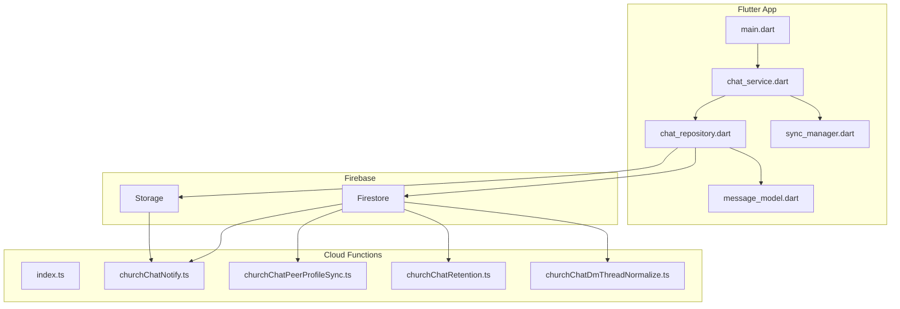
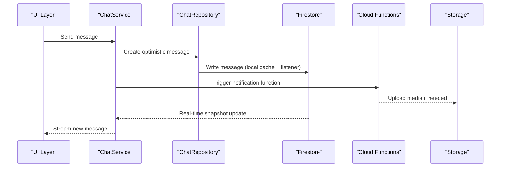
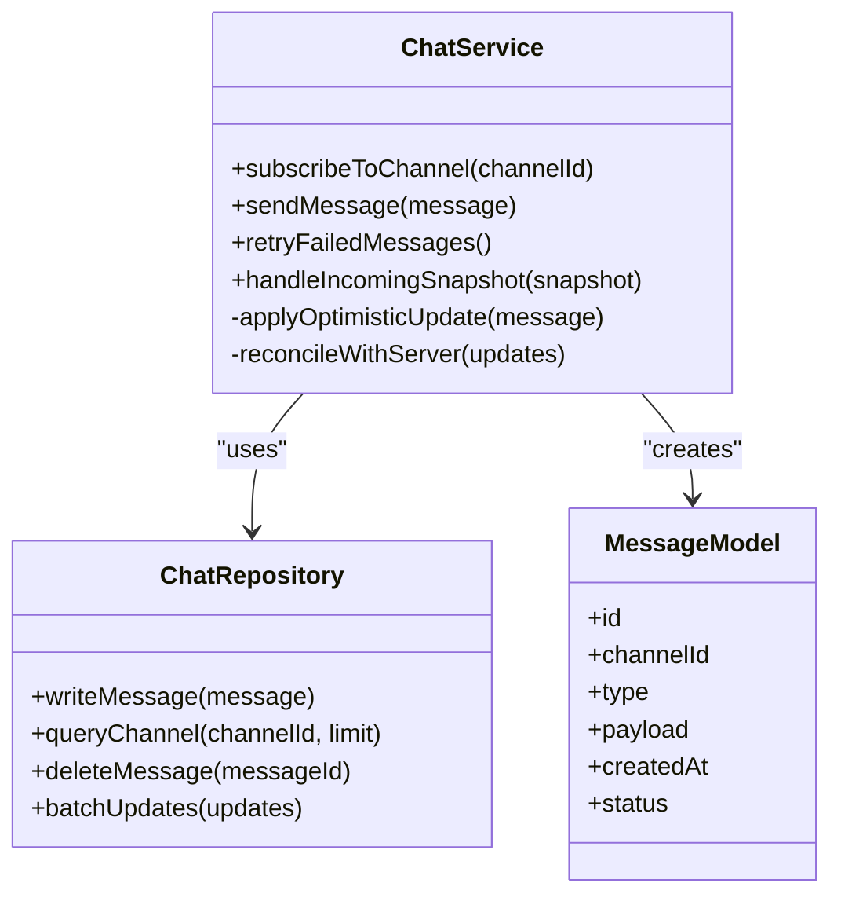
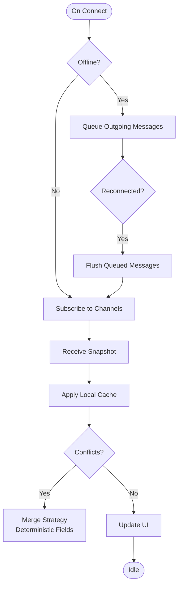
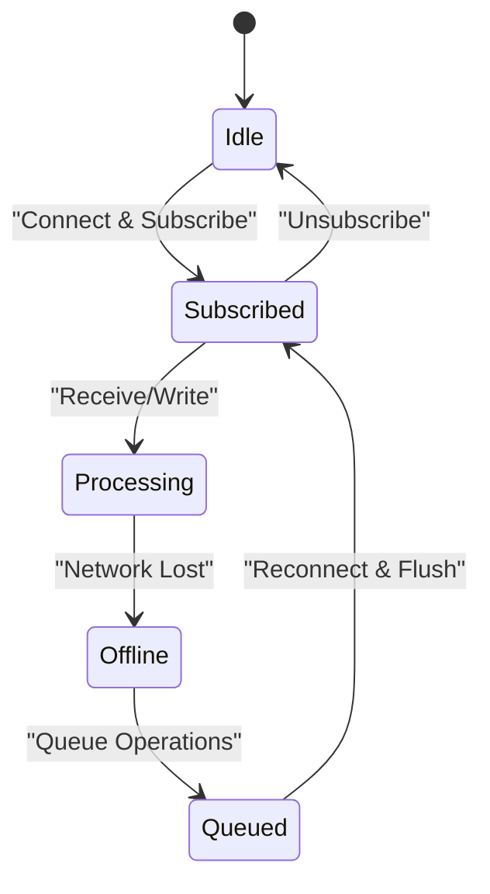
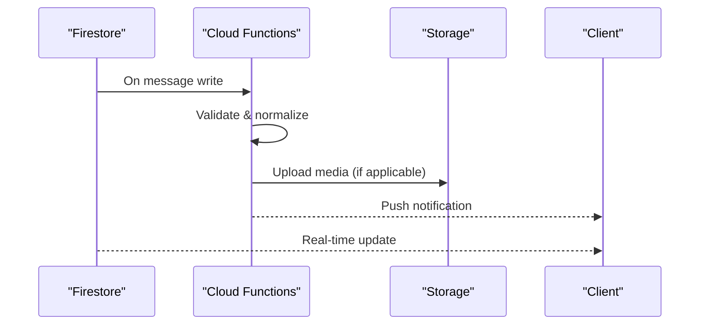
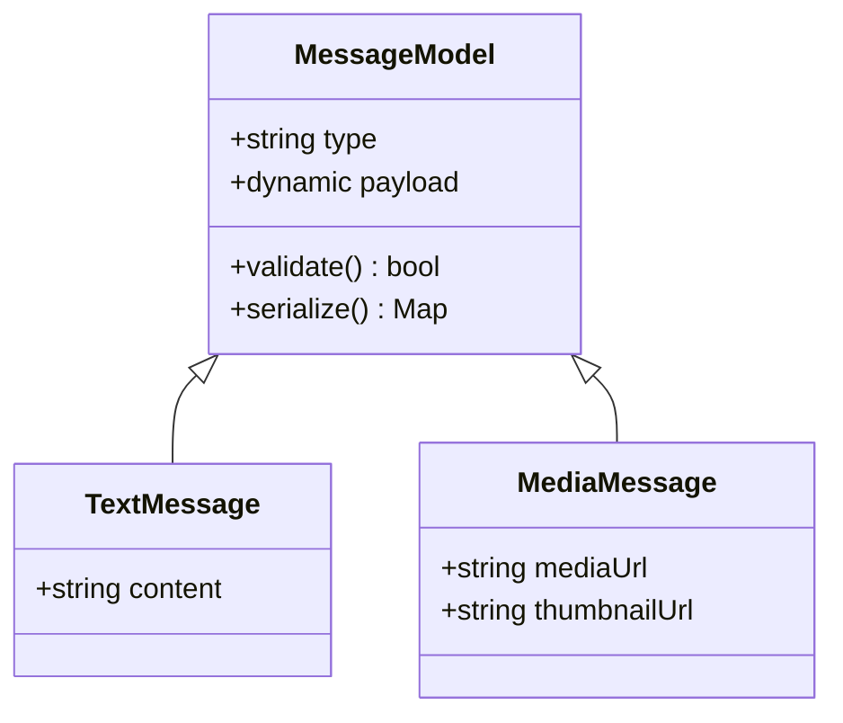
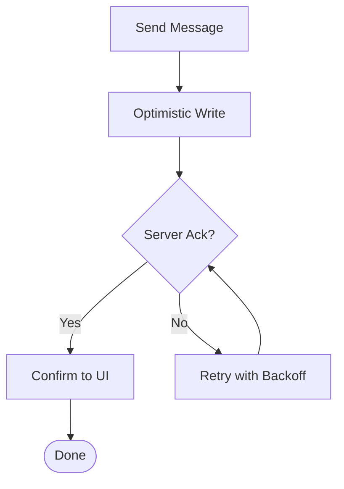
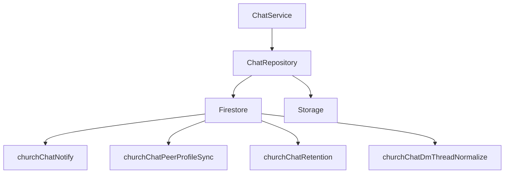

# Real-Time Messaging Engine

<cite>
**Referenced Files in This Document**
- [CHAT_ENGINE.md](file://CHAT_ENGINE.md)
- [functions/index.ts](file://functions/src/index.ts)
- [functions/churchChatNotify.ts](file://functions/src/churchChatNotify.ts)
- [functions/churchChatPeerProfileSync.ts](file://functions/src/churchChatPeerProfileSync.ts)
- [functions/churchChatRetention.ts](file://functions/src/churchChatRetention.ts)
- [functions/churchChatDmThreadNormalize.ts](file://functions/src/churchChatDmThreadNormalize.ts)
- [flutter_app/lib/main.dart](file://flutter_app/lib/main.dart)
- [flutter_app/lib/services/chat_service.dart](file://flutter_app/lib/services/chat_service.dart)
- [flutter_app/lib/repositories/chat_repository.dart](file://flutter_app/lib/repositories/chat_repository.dart)
- [flutter_app/lib/models/message_model.dart](file://flutter_app/lib/models/message_model.dart)
- [flutter_app/lib/controle_total_sync/sync_manager.dart](file://flutter_app/lib/controle_total_sync/sync_manager.dart)
- [firestore.rules](file://firestore.rules)
- [storage.rules](file://storage.rules)
</cite>

## Table of Contents
1. [Introduction](#introduction)
2. [Project Structure](#project-structure)
3. [Core Components](#core-components)
4. [Architecture Overview](#architecture-overview)
5. [Detailed Component Analysis](#detailed-component-analysis)
6. [Dependency Analysis](#dependency-analysis)
7. [Performance Considerations](#performance-considerations)
8. [Troubleshooting Guide](#troubleshooting-guide)
9. [Conclusion](#conclusion)
10. [Appendices](#appendices)

## Introduction
This document explains the real-time messaging engine used by Gestão Yahweh Premium. It covers how connections are managed, how messages are synchronized across devices, and how offline-first behavior is implemented. It also documents the chat service layer, message queue processing, conflict resolution strategies, delivery guarantees, custom message types, performance optimization techniques, connection pooling, and error recovery mechanisms.

The system combines a Flutter client with Firebase Cloud Functions for server-side orchestration and Firestore/Storage for persistence and media handling. While the app uses Firestore listeners for real-time updates, the documentation focuses on the patterns and components that implement reliable, scalable messaging.

## Project Structure
At a high level:
- The Flutter application implements the chat UI, local persistence, and synchronization logic.
- Firebase Cloud Functions handle notifications, profile sync, retention policies, and thread normalization.
- Firestore rules enforce access control; Storage rules govern media assets.

**Diagram sources**
- [flutter_app/lib/main.dart](file://flutter_app/lib/main.dart)
- [flutter_app/lib/services/chat_service.dart](file://flutter_app/lib/services/chat_service.dart)
- [flutter_app/lib/repositories/chat_repository.dart](file://flutter_app/lib/repositories/chat_repository.dart)
- [flutter_app/lib/models/message_model.dart](file://flutter_app/lib/models/message_model.dart)
- [flutter_app/lib/controle_total_sync/sync_manager.dart](file://flutter_app/lib/controle_total_sync/sync_manager.dart)
- [functions/src/index.ts](file://functions/src/index.ts)
- [functions/src/churchChatNotify.ts](file://functions/src/churchChatNotify.ts)
- [functions/src/churchChatPeerProfileSync.ts](file://functions/src/churchChatPeerProfileSync.ts)
- [functions/src/churchChatRetention.ts](file://functions/src/churchChatRetention.ts)
- [functions/src/churchChatDmThreadNormalize.ts](file://functions/src/churchChatDmThreadNormalize.ts)

**Section sources**
- [CHAT_ENGINE.md](file://CHAT_ENGINE.md)
- [flutter_app/lib/main.dart](file://flutter_app/lib/main.dart)
- [functions/src/index.ts](file://functions/src/index.ts)

## Core Components
- Chat Service Layer: Orchestrates sending, receiving, and caching messages; manages subscriptions to channels or threads; exposes APIs to the UI.
- Repository Layer: Encapsulates Firestore queries and mutations; handles batching, retries, and optimistic updates.
- Message Model: Defines the canonical structure for messages, including metadata, timestamps, and type-specific payloads.
- Sync Manager: Coordinates background synchronization, conflict resolution, and offline queues.
- Cloud Functions: Implement cross-cutting concerns such as notifications, peer profile synchronization, retention, and thread normalization.

Key responsibilities:
- Establish and maintain persistent listeners for real-time updates.
- Persist messages locally for offline use.
- Queue outgoing messages when offline and reconcile upon reconnection.
- Normalize and validate incoming data via functions.
- Enforce security through Firestore and Storage rules.

**Section sources**
- [flutter_app/lib/services/chat_service.dart](file://flutter_app/lib/services/chat_service.dart)
- [flutter_app/lib/repositories/chat_repository.dart](file://flutter_app/lib/repositories/chat_repository.dart)
- [flutter_app/lib/models/message_model.dart](file://flutter_app/lib/models/message_model.dart)
- [flutter_app/lib/controle_total_sync/sync_manager.dart](file://flutter_app/lib/controle_total_sync/sync_manager.dart)
- [functions/src/churchChatNotify.ts](file://functions/src/churchChatNotify.ts)
- [functions/src/churchChatPeerProfileSync.ts](file://functions/src/churchChatPeerProfileSync.ts)
- [functions/src/churchChatRetention.ts](file://functions/src/churchChatRetention.ts)
- [functions/src/churchChatDmThreadNormalize.ts](file://functions/src/churchChatDmThreadNormalize.ts)

## Architecture Overview
The messaging architecture follows an offline-first pattern with Firestore listeners for real-time updates and Cloud Functions for event-driven side effects.

**Diagram sources**
- [flutter_app/lib/services/chat_service.dart](file://flutter_app/lib/services/chat_service.dart)
- [flutter_app/lib/repositories/chat_repository.dart](file://flutter_app/lib/repositories/chat_repository.dart)
- [functions/src/churchChatNotify.ts](file://functions/src/churchChatNotify.ts)

## Detailed Component Analysis

### Chat Service Layer
Responsibilities:
- Manage subscriptions to channels/threads.
- Apply optimistic updates and reconcile with server state.
- Handle retry/backoff for failed sends.
- Expose typed methods for different message types.

**Diagram sources**
- [flutter_app/lib/services/chat_service.dart](file://flutter_app/lib/services/chat_service.dart)
- [flutter_app/lib/repositories/chat_repository.dart](file://flutter_app/lib/repositories/chat_repository.dart)
- [flutter_app/lib/models/message_model.dart](file://flutter_app/lib/models/message_model.dart)

**Section sources**
- [flutter_app/lib/services/chat_service.dart](file://flutter_app/lib/services/chat_service.dart)
- [flutter_app/lib/repositories/chat_repository.dart](file://flutter_app/lib/repositories/chat_repository.dart)
- [flutter_app/lib/models/message_model.dart](file://flutter_app/lib/models/message_model.dart)

### Message Synchronization Protocols
- Real-time updates: Firestore listeners stream changes to the client.
- Optimistic writes: UI reflects changes immediately; conflicts resolved via snapshots.
- Offline queue: Outgoing messages queued locally and sent when connectivity resumes.
- Conflict resolution: Last-write-wins with deterministic fields (e.g., server timestamp) and idempotent operations.

**Diagram sources**
- [flutter_app/lib/controle_total_sync/sync_manager.dart](file://flutter_app/lib/controle_total_sync/sync_manager.dart)
- [flutter_app/lib/repositories/chat_repository.dart](file://flutter_app/lib/repositories/chat_repository.dart)

**Section sources**
- [flutter_app/lib/controle_total_sync/sync_manager.dart](file://flutter_app/lib/controle_total_sync/sync_manager.dart)
- [flutter_app/lib/repositories/chat_repository.dart](file://flutter_app/lib/repositories/chat_repository.dart)

### Offline-First Architecture Implementation
- Local persistence: Messages cached in memory and persisted to device storage.
- Background sync: Sync manager reconciles local state with server state.
- Connectivity monitoring: Detects network changes to pause/resume operations.
- Retry policy: Exponential backoff with jitter for transient failures.

**Diagram sources**
- [flutter_app/lib/controle_total_sync/sync_manager.dart](file://flutter_app/lib/controle_total_sync/sync_manager.dart)

**Section sources**
- [flutter_app/lib/controle_total_sync/sync_manager.dart](file://flutter_app/lib/controle_total_sync/sync_manager.dart)

### Cloud Functions Orchestration
Functions provide server-side logic for:
- Notifications: Emit push notifications on new messages.
- Peer profile sync: Keep user profiles consistent across clients.
- Retention: Purge old messages/media per policy.
- Thread normalization: Ensure consistent thread structures.

**Diagram sources**
- [functions/src/churchChatNotify.ts](file://functions/src/churchChatNotify.ts)
- [functions/src/churchChatPeerProfileSync.ts](file://functions/src/churchChatPeerProfileSync.ts)
- [functions/src/churchChatRetention.ts](file://functions/src/churchChatRetention.ts)
- [functions/src/churchChatDmThreadNormalize.ts](file://functions/src/churchChatDmThreadNormalize.ts)

**Section sources**
- [functions/src/index.ts](file://functions/src/index.ts)
- [functions/src/churchChatNotify.ts](file://functions/src/churchChatNotify.ts)
- [functions/src/churchChatPeerProfileSync.ts](file://functions/src/churchChatPeerProfileSync.ts)
- [functions/src/churchChatRetention.ts](file://functions/src/churchChatRetention.ts)
- [functions/src/churchChatDmThreadNormalize.ts](file://functions/src/churchChatDmThreadNormalize.ts)

### Custom Message Types
- Define a type discriminator field in the message model.
- Implement serialization/deserialization per type.
- Route handling in the service layer based on type.
- Validate payloads against schemas before writing.

**Diagram sources**
- [flutter_app/lib/models/message_model.dart](file://flutter_app/lib/models/message_model.dart)

**Section sources**
- [flutter_app/lib/models/message_model.dart](file://flutter_app/lib/models/message_model.dart)

### Connection Management and Delivery Guarantees
- Persistent listeners ensure continuous updates.
- Idempotent writes prevent duplicates.
- Acknowledgment via status fields and server timestamps.
- Backpressure handled by limiting concurrent operations and using batched writes.

**Diagram sources**
- [flutter_app/lib/repositories/chat_repository.dart](file://flutter_app/lib/repositories/chat_repository.dart)

**Section sources**
- [flutter_app/lib/repositories/chat_repository.dart](file://flutter_app/lib/repositories/chat_repository.dart)

## Dependency Analysis
The messaging engine depends on:
- Flutter services and repositories for client-side logic.
- Firestore for persistence and real-time streams.
- Cloud Functions for event-driven tasks.
- Storage for media assets.
- Rules files for access control.

**Diagram sources**
- [flutter_app/lib/services/chat_service.dart](file://flutter_app/lib/services/chat_service.dart)
- [flutter_app/lib/repositories/chat_repository.dart](file://flutter_app/lib/repositories/chat_repository.dart)
- [functions/src/churchChatNotify.ts](file://functions/src/churchChatNotify.ts)
- [functions/src/churchChatPeerProfileSync.ts](file://functions/src/churchChatPeerProfileSync.ts)
- [functions/src/churchChatRetention.ts](file://functions/src/churchChatRetention.ts)
- [functions/src/churchChatDmThreadNormalize.ts](file://functions/src/churchChatDmThreadNormalize.ts)

**Section sources**
- [flutter_app/lib/services/chat_service.dart](file://flutter_app/lib/services/chat_service.dart)
- [flutter_app/lib/repositories/chat_repository.dart](file://flutter_app/lib/repositories/chat_repository.dart)
- [functions/src/index.ts](file://functions/src/index.ts)

## Performance Considerations
- Use pagination and limits for channel queries to reduce payload size.
- Debounce rapid UI-triggered writes; batch where possible.
- Cache frequently accessed data in memory; persist only necessary state.
- Leverage Firestore indexes for efficient queries.
- Minimize function invocations by coalescing events server-side.
- Monitor memory usage and avoid long-lived heavy objects in listeners.

[No sources needed since this section provides general guidance]

## Troubleshooting Guide
Common issues and resolutions:
- No real-time updates: Verify Firestore listeners are active and permissions allow reads.
- Duplicate messages: Ensure idempotency keys and deduplication logic.
- Stale data: Force refresh or clear local cache; check sync manager state.
- Function errors: Inspect logs for validation failures or missing dependencies.
- Media upload failures: Validate Storage rules and file paths.

Checkpoints:
- Review Firestore rules for read/write permissions.
- Validate Storage rules for media access.
- Inspect Cloud Functions logs for errors during processing.

**Section sources**
- [firestore.rules](file://firestore.rules)
- [storage.rules](file://storage.rules)

## Conclusion
The real-time messaging engine in Gestão Yahweh Premium combines a robust Flutter client with Firebase Cloud Functions and Firestore to deliver reliable, offline-first messaging. By leveraging optimistic updates, background synchronization, and server-side normalization, it ensures consistency, scalability, and resilience under varying network conditions.

[No sources needed since this section summarizes without analyzing specific files]

## Appendices
- Setup instructions for connecting to channels and subscribing to updates.
- Examples of implementing custom message types and handlers.
- Guidelines for tuning performance and monitoring reliability.

[No sources needed since this section provides general guidance]