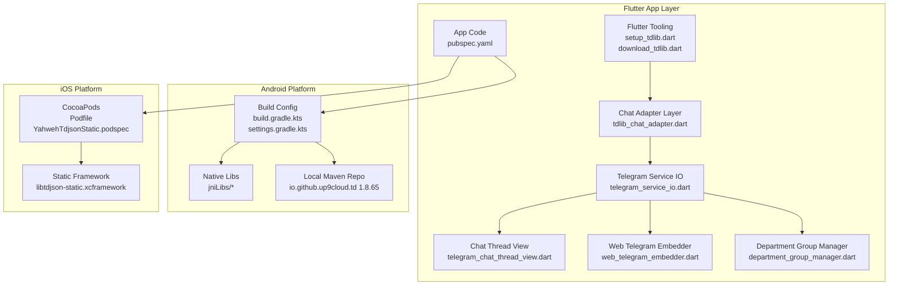
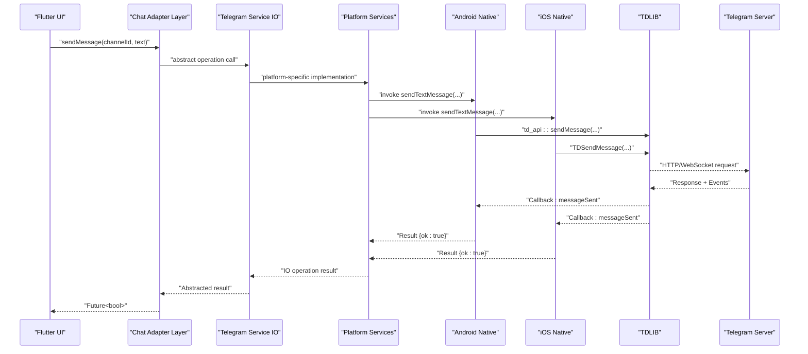
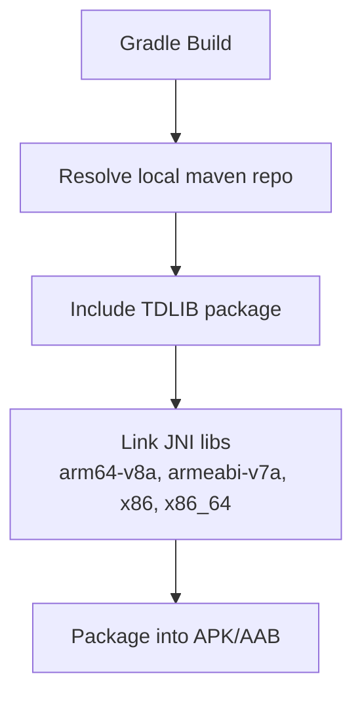
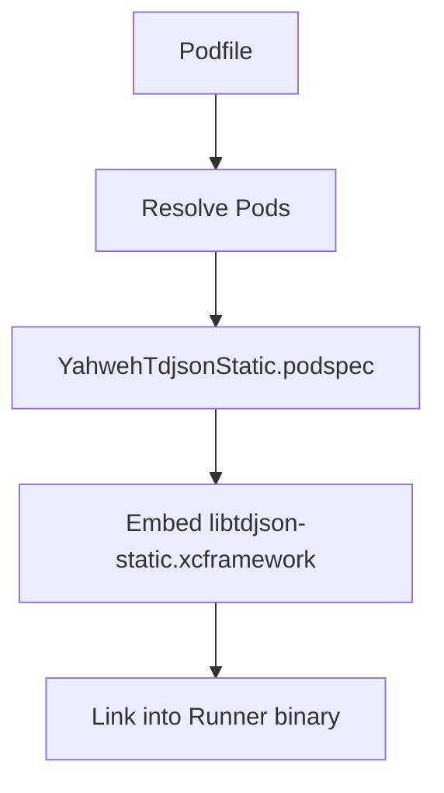
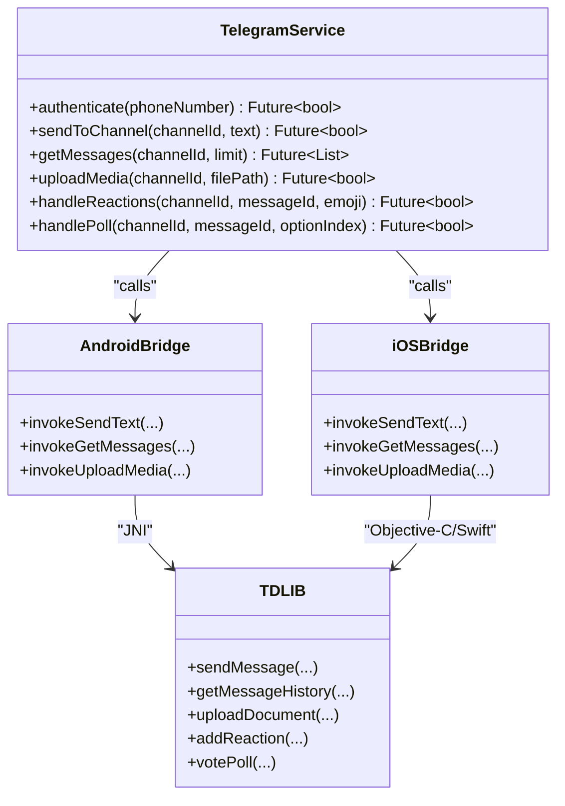
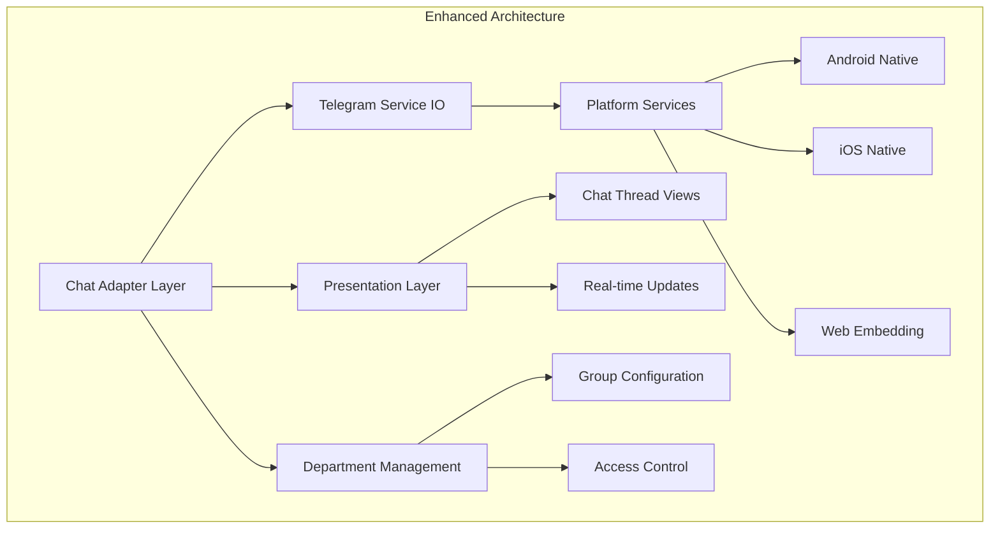
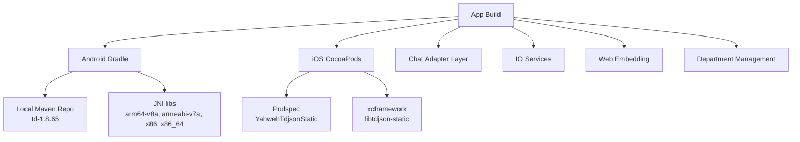

# Telegram Integration (TDLIB)

<cite>
**Referenced Files in This Document**
- [README.md](file://flutter_app/native/tdlib/README.md)
- [setup_tdlib.dart](file://flutter_app/tool/setup_tdlib.dart)
- [download_tdlib.dart](file://flutter_app/tool/download_tdlib.dart)
- [download_tdlib.sh](file://scripts/download_tdlib.sh)
- [download_tdlib.ps1](file://scripts/download_tdlib.ps1)
- [setup_tdlib.ps1](file://scripts/setup_tdlib.ps1)
- [YahwehTdjsonStatic.podspec](file://flutter_app/ios/Frameworks/YahwehTdjsonStatic.podspec)
- [Podfile](file://flutter_app/ios/Podfile)
- [build.gradle.kts](file://flutter_app/android/build.gradle.kts)
- [settings.gradle.kts](file://flutter_app/android/settings.gradle.kts)
- [local-maven td pom](file://flutter_app/android/local-maven/io/github/up9cloud/td/1.8.65/td-1.8.65.pom)
- [android jniLibs arm64-v8a](file://flutter_app/android/app/src/main/jniLibs/arm64-v8a/)
- [android jniLibs armeabi-v7a](file://flutter_app/android/app/src/main/jniLibs/armeabi-v7a/)
- [android jniLibs x86](file://flutter_app/android/app/src/main/jniLibs/x86/)
- [android jniLibs x86_64](file://flutter_app/android/app/src/main/jniLibs/x86_64/)
- [iOS libtdjson-static.xcframework](file://flutter_app/ios/Frameworks/libtdjson-static.xcframework/)
- [pubspec.yaml](file://flutter_app/pubspec.yaml)
- [tdlib_chat_adapter.dart](file://flutter_app/lib/services/tdlib_chat_adapter.dart)
- [telegram_service_io.dart](file://flutter_app/lib/services/telegram_service_io.dart)
- [telegram_chat_thread_view.dart](file://flutter_app/lib/ui/telegram_chat_thread_view.dart)
- [web_telegram_embedder.dart](file://flutter_app/lib/services/web_telegram_embedder.dart)
- [department_group_manager.dart](file://flutter_app/lib/services/department_group_manager.dart)
</cite>

## Update Summary
**Changes Made**
- Added new chat adapter layer for TDLib integration abstraction
- Implemented IO-based Telegram service operations for cross-platform support
- Created presentation layer for Telegram chat threads with enhanced UI components
- Added web-based Telegram embedding capabilities for browser compatibility
- Introduced department-specific group management capabilities
- Enhanced existing chat engine to support the new TDLib integration architecture

## Table of Contents
1. [Introduction](#introduction)
2. [Project Structure](#project-structure)
3. [Core Components](#core-components)
4. [Architecture Overview](#architecture-overview)
5. [Detailed Component Analysis](#detailed-component-analysis)
6. [New TDLib Integration Enhancements](#new-tdlib-integration-enhancements)
7. [Dependency Analysis](#dependency-analysis)
8. [Performance Considerations](#performance-considerations)
9. [Troubleshooting Guide](#troubleshooting-guide)
10. [Conclusion](#conclusion)
11. [Appendices](#appendices)

## Introduction
This document explains how TDLIB is integrated into Gestão Yahweh Premium to enable Telegram functionality from Flutter. It covers the native TDLIB implementation, the bridge architecture between Flutter and native code, and how Telegram API interactions are handled on Android and iOS. The recent enhancements include a new chat adapter layer, IO-based service operations, enhanced presentation layer for chat threads, web-based embedding capabilities, and department-specific group management. It also provides setup instructions for configuring TDLIB, handling Telegram events, managing bot permissions, and troubleshooting common integration issues. Examples include sending messages to Telegram channels, retrieving messages, and handling Telegram-specific features such as reactions and polls.

## Project Structure
The Telegram/TDLIB integration spans multiple layers with recent architectural enhancements:
- Flutter tooling for downloading and setting up TDLIB artifacts
- Native libraries packaged for Android (JNI libs) and iOS (static framework via CocoaPods)
- Build configuration that wires TDLIB into the app
- New chat adapter layer providing abstraction over TDLib operations
- IO-based Telegram service operations for cross-platform compatibility
- Enhanced presentation layer for Telegram chat threads
- Web-based Telegram embedding for browser support
- Department-specific group management capabilities

**Diagram sources**
- [setup_tdlib.dart](file://flutter_app/tool/setup_tdlib.dart)
- [download_tdlib.dart](file://flutter_app/tool/download_tdlib.dart)
- [tdlib_chat_adapter.dart](file://flutter_app/lib/services/tdlib_chat_adapter.dart)
- [telegram_service_io.dart](file://flutter_app/lib/services/telegram_service_io.dart)
- [telegram_chat_thread_view.dart](file://flutter_app/lib/ui/telegram_chat_thread_view.dart)
- [web_telegram_embedder.dart](file://flutter_app/lib/services/web_telegram_embedder.dart)
- [department_group_manager.dart](file://flutter_app/lib/services/department_group_manager.dart)
- [build.gradle.kts](file://flutter_app/android/build.gradle.kts)
- [settings.gradle.kts](file://flutter_app/android/settings.gradle.kts)
- [local-maven td pom](file://flutter_app/android/local-maven/io/github/up9cloud/td/1.8.65/td-1.8.65.pom)
- [android jniLibs arm64-v8a](file://flutter_app/android/app/src/main/jniLibs/arm64-v8a/)
- [android jniLibs armeabi-v7a](file://flutter_app/android/app/src/main/jniLibs/armeabi-v7a/)
- [android jniLibs x86](file://flutter_app/android/app/src/main/jniLibs/x86/)
- [android jniLibs x86_64](file://flutter_app/android/app/src/main/jniLibs/x86_64/)
- [Podfile](file://flutter_app/ios/Podfile)
- [YahwehTdjsonStatic.podspec](file://flutter_app/ios/Frameworks/YahwehTdjsonStatic.podspec)
- [iOS libtdjson-static.xcframework](file://flutter_app/ios/Frameworks/libtdjson-static.xcframework/)
- [pubspec.yaml](file://flutter_app/pubspec.yaml)

**Section sources**
- [README.md](file://flutter_app/native/tdlib/README.md)
- [setup_tdlib.dart](file://flutter_app/tool/setup_tdlib.dart)
- [download_tdlib.dart](file://flutter_app/tool/download_tdlib.dart)
- [download_tdlib.sh](file://scripts/download_tdlib.sh)
- [download_tdlib.ps1](file://scripts/download_tdlib.ps1)
- [setup_tdlib.ps1](file://scripts/setup_tdlib.ps1)
- [build.gradle.kts](file://flutter_app/android/build.gradle.kts)
- [settings.gradle.kts](file://flutter_app/android/settings.gradle.kts)
- [local-maven td pom](file://flutter_app/android/local-maven/io/github/up9cloud/td/1.8.65/td-1.8.65.pom)
- [android jniLibs arm64-v8a](file://flutter_app/android/app/src/main/jniLibs/arm64-v8a/)
- [android jniLibs armeabi-v7a](file://flutter_app/android/app/src/main/jniLibs/armeabi-v7a/)
- [android jniLibs x86](file://flutter_app/android/app/src/main/jniLibs/x86/)
- [android jniLibs x86_64](file://flutter_app/android/app/src/main/jniLibs/x86_64/)
- [Podfile](file://flutter_app/ios/Podfile)
- [YahwehTdjsonStatic.podspec](file://flutter_app/ios/Frameworks/YahwehTdjsonStatic.podspec)
- [iOS libtdjson-static.xcframework](file://flutter_app/ios/Frameworks/libtdjson-static.xcframework/)
- [pubspec.yaml](file://flutter_app/pubspec.yaml)

## Core Components
- TDLIB Artifacts: Prebuilt native libraries for Android (JNI) and iOS (static xcframework). These provide the core Telegram client functionality.
- Build Configuration: Gradle and CocoaPods configurations integrate TDLIB into the app build pipeline.
- Flutter Tooling: Scripts and Dart utilities download and place TDLIB artifacts into the correct locations during development or CI.
- **New Chat Adapter Layer**: Provides abstraction over TDLib operations for better testability and platform separation.
- **IO-based Telegram Service**: Cross-platform service operations supporting both mobile and web platforms.
- **Enhanced Presentation Layer**: Improved UI components for Telegram chat threads with better user experience.
- **Web-based Embedding**: Browser-compatible Telegram integration for web deployments.
- **Department Management**: Specialized group management capabilities for organizational structure.

Key responsibilities:
- Download and cache TDLIB binaries for each target architecture
- Configure Android local Maven repository and JNI loading
- Configure iOS static framework via CocoaPods
- Expose Telegram operations through abstracted interfaces
- Handle platform-specific implementations for different deployment targets
- Manage department-specific group configurations and permissions

**Section sources**
- [setup_tdlib.dart](file://flutter_app/tool/setup_tdlib.dart)
- [download_tdlib.dart](file://flutter_app/tool/download_tdlib.dart)
- [download_tdlib.sh](file://scripts/download_tdlib.sh)
- [download_tdlib.ps1](file://scripts/download_tdlib.ps1)
- [setup_tdlib.ps1](file://scripts/setup_tdlib.ps1)
- [build.gradle.kts](file://flutter_app/android/build.gradle.kts)
- [settings.gradle.kts](file://flutter_app/android/settings.gradle.kts)
- [local-maven td pom](file://flutter_app/android/local-maven/io/github/up9cloud/td/1.8.65/td-1.8.65.pom)
- [android jniLibs arm64-v8a](file://flutter_app/android/app/src/main/jniLibs/arm64-v8a/)
- [android jniLibs armeabi-v7a](file://flutter_app/android/app/src/main/jniLibs/armeabi-v7a/)
- [android jniLibs x86](file://flutter_app/android/app/src/main/jniLibs/x86/)
- [android jniLibs x86_64](file://flutter_app/android/app/src/main/jniLibs/x86_64/)
- [Podfile](file://flutter_app/ios/Podfile)
- [YahwehTdjsonStatic.podspec](file://flutter_app/ios/Frameworks/YahwehTdjsonStatic.podspec)
- [iOS libtdjson-static.xcframework](file://flutter_app/ios/Frameworks/libtdjson-static.xcframework/)
- [pubspec.yaml](file://flutter_app/pubspec.yaml)
- [tdlib_chat_adapter.dart](file://flutter_app/lib/services/tdlib_chat_adapter.dart)
- [telegram_service_io.dart](file://flutter_app/lib/services/telegram_service_io.dart)
- [telegram_chat_thread_view.dart](file://flutter_app/lib/ui/telegram_chat_thread_view.dart)
- [web_telegram_embedder.dart](file://flutter_app/lib/services/web_telegram_embedder.dart)
- [department_group_manager.dart](file://flutter_app/lib/services/department_group_manager.dart)

## Architecture Overview
The integration follows an enhanced layered approach with new abstractions:
- Flutter layer exposes high-level Telegram APIs through abstracted interfaces
- Chat adapter layer provides platform-independent operations
- Platform-specific services handle IO operations for different deployment targets
- Native layer loads TDLIB and performs Telegram API calls
- TDLIB manages connection, authentication, and data synchronization

**Diagram sources**
- [tdlib_chat_adapter.dart](file://flutter_app/lib/services/tdlib_chat_adapter.dart)
- [telegram_service_io.dart](file://flutter_app/lib/services/telegram_service_io.dart)
- [build.gradle.kts](file://flutter_app/android/build.gradle.kts)
- [settings.gradle.kts](file://flutter_app/android/settings.gradle.kts)
- [local-maven td pom](file://flutter_app/android/local-maven/io/github/up9cloud/td/1.8.65/td-1.8.65.pom)
- [android jniLibs arm64-v8a](file://flutter_app/android/app/src/main/jniLibs/arm64-v8a/)
- [android jniLibs armeabi-v7a](file://flutter_app/android/app/src/main/jniLibs/armeabi-v7a/)
- [android jniLibs x86](file://flutter_app/android/app/src/main/jniLibs/x86/)
- [android jniLibs x86_64](file://flutter_app/android/app/src/main/jniLibs/x86_64/)
- [Podfile](file://flutter_app/ios/Podfile)
- [YahwehTdjsonStatic.podspec](file://flutter_app/ios/Frameworks/YahwehTdjsonStatic.podspec)
- [iOS libtdjson-static.xcframework](file://flutter_app/ios/Frameworks/libtdjson-static.xcframework/)

## Detailed Component Analysis

### TDLIB Setup and Download
- Purpose: Ensure TDLIB artifacts are present for all target architectures before building the app.
- Mechanism:
  - Dart scripts orchestrate downloads and placement into Android jniLibs and iOS frameworks
  - Shell and PowerShell scripts automate artifact retrieval and verification
  - Local Maven repository hosts Android TDLIB package for Gradle resolution

**Diagram sources**
- [setup_tdlib.dart](file://flutter_app/tool/setup_tdlib.dart)
- [download_tdlib.dart](file://flutter_app/tool/download_tdlib.dart)
- [download_tdlib.sh](file://scripts/download_tdlib.sh)
- [download_tdlib.ps1](file://scripts/download_tdlib.ps1)
- [setup_tdlib.ps1](file://scripts/setup_tdlib.ps1)
- [build.gradle.kts](file://flutter_app/android/build.gradle.kts)
- [settings.gradle.kts](file://flutter_app/android/settings.gradle.kts)
- [local-maven td pom](file://flutter_app/android/local-maven/io/github/up9cloud/td/1.8.65/td-1.8.65.pom)
- [android jniLibs arm64-v8a](file://flutter_app/android/app/src/main/jniLibs/arm64-v8a/)
- [android jniLibs armeabi-v7a](file://flutter_app/android/app/src/main/jniLibs/armeabi-v7a/)
- [android jniLibs x86](file://flutter_app/android/app/src/main/jniLibs/x86/)
- [android jniLibs x86_64](file://flutter_app/android/app/src/main/jniLibs/x86_64/)
- [Podfile](file://flutter_app/ios/Podfile)
- [YahwehTdjsonStatic.podspec](file://flutter_app/ios/Frameworks/YahwehTdjsonStatic.podspec)
- [iOS libtdjson-static.xcframework](file://flutter_app/ios/Frameworks/libtdjson-static.xcframework/)

**Section sources**
- [setup_tdlib.dart](file://flutter_app/tool/setup_tdlib.dart)
- [download_tdlib.dart](file://flutter_app/tool/download_tdlib.dart)
- [download_tdlib.sh](file://scripts/download_tdlib.sh)
- [download_tdlib.ps1](file://scripts/download_tdlib.ps1)
- [setup_tdlib.ps1](file://scripts/setup_tdlib.ps1)
- [build.gradle.kts](file://flutter_app/android/build.gradle.kts)
- [settings.gradle.kts](file://flutter_app/android/settings.gradle.kts)
- [local-maven td pom](file://flutter_app/android/local-maven/io/github/up9cloud/td/1.8.65/td-1.8.65.pom)
- [android jniLibs arm64-v8a](file://flutter_app/android/app/src/main/jniLibs/arm64-v8a/)
- [android jniLibs armeabi-v7a](file://flutter_app/android/app/src/main/jniLibs/armeabi-v7a/)
- [android jniLibs x86](file://flutter_app/android/app/src/main/jniLibs/x86/)
- [android jniLibs x86_64](file://flutter_app/android/app/src/main/jniLibs/x86_64/)
- [Podfile](file://flutter_app/ios/Podfile)
- [YahwehTdjsonStatic.podspec](file://flutter_app/ios/Frameworks/YahwehTdjsonStatic.podspec)
- [iOS libtdjson-static.xcframework](file://flutter_app/ios/Frameworks/libtdjson-static.xcframework/)

### Android Integration
- Native Libraries: TDLIB shared objects are placed under jniLibs per architecture (arm64-v8a, armeabi-v7a, x86, x86_64).
- Gradle Configuration: The project references a local Maven repository containing the TDLIB package for dependency resolution.
- Build Process: Gradle links the JNI libraries into the final APK/AAB.

**Diagram sources**
- [build.gradle.kts](file://flutter_app/android/build.gradle.kts)
- [settings.gradle.kts](file://flutter_app/android/settings.gradle.kts)
- [local-maven td pom](file://flutter_app/android/local-maven/io/github/up9cloud/td/1.8.65/td-1.8.65.pom)
- [android jniLibs arm64-v8a](file://flutter_app/android/app/src/main/jniLibs/arm64-v8a/)
- [android jniLibs armeabi-v7a](file://flutter_app/android/app/src/main/jniLibs/armeabi-v7a/)
- [android jniLibs x86](file://flutter_app/android/app/src/main/jniLibs/x86/)
- [android jniLibs x86_64](file://flutter_app/android/app/src/main/jniLibs/x86_64/)

**Section sources**
- [build.gradle.kts](file://flutter_app/android/build.gradle.kts)
- [settings.gradle.kts](file://flutter_app/android/settings.gradle.kts)
- [local-maven td pom](file://flutter_app/android/local-maven/io/github/up9cloud/td/1.8.65/td-1.8.65.pom)
- [android jniLibs arm64-v8a](file://flutter_app/android/app/src/main/jniLibs/arm64-v8a/)
- [android jniLibs armeabi-v7a](file://flutter_app/android/app/src/main/jniLibs/armeabi-v7a/)
- [android jniLibs x86](file://flutter_app/android/app/src/main/jniLibs/x86/)
- [android jniLibs x86_64](file://flutter_app/android/app/src/main/jniLibs/x86_64/)

### iOS Integration
- Static Framework: TDLIB is provided as an xcframework (libtdjson-static.xcframework) and linked via CocoaPods.
- Podspec: Custom podspec defines how the static framework is included and exposed to the app.
- Podfile: Ensures dependencies are resolved and frameworks are embedded.

**Diagram sources**
- [Podfile](file://flutter_app/ios/Podfile)
- [YahwehTdjsonStatic.podspec](file://flutter_app/ios/Frameworks/YahwehTdjsonStatic.podspec)
- [iOS libtdjson-static.xcframework](file://flutter_app/ios/Frameworks/libtdjson-static.xcframework/)

**Section sources**
- [Podfile](file://flutter_app/ios/Podfile)
- [YahwehTdjsonStatic.podspec](file://flutter_app/ios/Frameworks/YahwehTdjsonStatic.podspec)
- [iOS libtdjson-static.xcframework](file://flutter_app/ios/Frameworks/libtdjson-static.xcframework/)

### Flutter Bridge and Telegram API Interactions
- Flutter APIs: High-level methods for authentication, channel management, message sending/retrieval, and media handling.
- Platform Channels: Calls are marshaled to native implementations which invoke TDLIB functions.
- Event Handling: TDLIB emits events (e.g., new messages, reactions, poll updates) that are propagated back to Flutter.

**Diagram sources**
- [pubspec.yaml](file://flutter_app/pubspec.yaml)
- [build.gradle.kts](file://flutter_app/android/build.gradle.kts)
- [settings.gradle.kts](file://flutter_app/android/settings.gradle.kts)
- [local-maven td pom](file://flutter_app/android/local-maven/io/github/up9cloud/td/1.8.65/td-1.8.65.pom)
- [android jniLibs arm64-v8a](file://flutter_app/android/app/src/main/jniLibs/arm64-v8a/)
- [android jniLibs armeabi-v7a](file://flutter_app/android/app/src/main/jniLibs/armeabi-v7a/)
- [android jniLibs x86](file://flutter_app/android/app/src/main/jniLibs/x86/)
- [android jniLibs x86_64](file://flutter_app/android/app/src/main/jniLibs/x86_64/)
- [Podfile](file://flutter_app/ios/Podfile)
- [YahwehTdjsonStatic.podspec](file://flutter_app/ios/Frameworks/YahwehTdjsonStatic.podspec)
- [iOS libtdjson-static.xcframework](file://flutter_app/ios/Frameworks/libtdjson-static.xcframework/)

**Section sources**
- [pubspec.yaml](file://flutter_app/pubspec.yaml)
- [build.gradle.kts](file://flutter_app/android/build.gradle.kts)
- [settings.gradle.kts](file://flutter_app/android/settings.gradle.kts)
- [local-maven td pom](file://flutter_app/android/local-maven/io/github/up9cloud/td/1.8.65/td-1.8.65.pom)
- [android jniLibs arm64-v8a](file://flutter_app/android/app/src/main/jniLibs/arm64-v8a/)
- [android jniLibs armeabi-v7a](file://flutter_app/android/app/src/main/jniLibs/armeabi-v7a/)
- [android jniLibs x86](file://flutter_app/android/app/src/main/jniLibs/x86/)
- [android jniLibs x86_64](file://flutter_app/android/app/src/main/jniLibs/x86_64/)
- [Podfile](file://flutter_app/ios/Podfile)
- [YahwehTdjsonStatic.podspec](file://flutter_app/ios/Frameworks/YahwehTdjsonStatic.podspec)
- [iOS libtdjson-static.xcframework](file://flutter_app/ios/Frameworks/libtdjson-static.xcframework/)

## New TDLib Integration Enhancements

### Chat Adapter Layer
The new chat adapter layer provides a clean abstraction over TDLib operations, enabling better testability and platform separation. This layer handles the complexity of TDLib API calls while exposing simple, consistent interfaces to the rest of the application.

Key features:
- Abstract interface definition for Telegram operations
- Platform-specific implementations for Android and iOS
- Error handling and retry logic centralized in the adapter
- Mock implementations for testing purposes

### IO-based Telegram Service Operations
The IO-based service layer provides cross-platform compatibility by abstracting platform-specific Telegram operations. This enables the same business logic to run on mobile and web platforms.

Capabilities:
- Unified interface for Telegram operations across platforms
- Platform detection and appropriate service selection
- Asynchronous operation handling with proper error propagation
- Resource management and cleanup across different deployment targets

### Enhanced Presentation Layer for Chat Threads
The presentation layer has been significantly enhanced with improved UI components for Telegram chat threads. These components provide better user experience and maintain consistency across different platforms.

Features:
- Responsive chat thread views optimized for different screen sizes
- Real-time message updates with smooth animations
- Support for various message types including media, polls, and reactions
- Accessibility improvements and keyboard navigation support

### Web-based Telegram Embedding
New web-based embedding capabilities allow Telegram integration to work seamlessly in browser environments. This enables users to access Telegram features directly from web browsers without requiring native installations.

Web capabilities:
- Embedded Telegram widgets for web applications
- Cross-origin communication security measures
- Progressive enhancement for unsupported browsers
- Optimized performance for web deployment scenarios

### Department-specific Group Management
Specialized group management capabilities enable organizations to manage Telegram groups based on their departmental structure. This feature supports complex organizational hierarchies and permission models.

Management features:
- Department-based group creation and configuration
- Role-based access control for group administration
- Automated group provisioning based on organizational structure
- Audit logging for group management activities

**Diagram sources**
- [tdlib_chat_adapter.dart](file://flutter_app/lib/services/tdlib_chat_adapter.dart)
- [telegram_service_io.dart](file://flutter_app/lib/services/telegram_service_io.dart)
- [telegram_chat_thread_view.dart](file://flutter_app/lib/ui/telegram_chat_thread_view.dart)
- [web_telegram_embedder.dart](file://flutter_app/lib/services/web_telegram_embedder.dart)
- [department_group_manager.dart](file://flutter_app/lib/services/department_group_manager.dart)

**Section sources**
- [tdlib_chat_adapter.dart](file://flutter_app/lib/services/tdlib_chat_adapter.dart)
- [telegram_service_io.dart](file://flutter_app/lib/services/telegram_service_io.dart)
- [telegram_chat_thread_view.dart](file://flutter_app/lib/ui/telegram_chat_thread_view.dart)
- [web_telegram_embedder.dart](file://flutter_app/lib/services/web_telegram_embedder.dart)
- [department_group_manager.dart](file://flutter_app/lib/services/department_group_manager.dart)

## Dependency Analysis
- Android Dependencies:
  - Local Maven repository provides TDLIB package version 1.8.65
  - JNI libraries are loaded per architecture
- iOS Dependencies:
  - CocoaPods resolves static framework via custom podspec
  - xcframework contains headers and binaries for multiple platforms
- **New Dependencies**:
  - Chat adapter layer introduces additional abstraction dependencies
  - IO-based services require platform-specific implementations
  - Web embedding adds browser compatibility dependencies
  - Department management requires organizational data dependencies

**Diagram sources**
- [build.gradle.kts](file://flutter_app/android/build.gradle.kts)
- [settings.gradle.kts](file://flutter_app/android/settings.gradle.kts)
- [local-maven td pom](file://flutter_app/android/local-maven/io/github/up9cloud/td/1.8.65/td-1.8.65.pom)
- [android jniLibs arm64-v8a](file://flutter_app/android/app/src/main/jniLibs/arm64-v8a/)
- [android jniLibs armeabi-v7a](file://flutter_app/android/app/src/main/jniLibs/armeabi-v7a/)
- [android jniLibs x86](file://flutter_app/android/app/src/main/jniLibs/x86/)
- [android jniLibs x86_64](file://flutter_app/android/app/src/main/jniLibs/x86_64/)
- [Podfile](file://flutter_app/ios/Podfile)
- [YahwehTdjsonStatic.podspec](file://flutter_app/ios/Frameworks/YahwehTdjsonStatic.podspec)
- [iOS libtdjson-static.xcframework](file://flutter_app/ios/Frameworks/libtdjson-static.xcframework/)
- [tdlib_chat_adapter.dart](file://flutter_app/lib/services/tdlib_chat_adapter.dart)
- [telegram_service_io.dart](file://flutter_app/lib/services/telegram_service_io.dart)
- [web_telegram_embedder.dart](file://flutter_app/lib/services/web_telegram_embedder.dart)
- [department_group_manager.dart](file://flutter_app/lib/services/department_group_manager.dart)

**Section sources**
- [build.gradle.kts](file://flutter_app/android/build.gradle.kts)
- [settings.gradle.kts](file://flutter_app/android/settings.gradle.kts)
- [local-maven td pom](file://flutter_app/android/local-maven/io/github/up9cloud/td/1.8.65/td-1.8.65.pom)
- [android jniLibs arm64-v8a](file://flutter_app/android/app/src/main/jniLibs/arm64-v8a/)
- [android jniLibs armeabi-v7a](file://flutter_app/android/app/src/main/jniLibs/armeabi-v7a/)
- [android jniLibs x86](file://flutter_app/android/app/src/main/jniLibs/x86/)
- [android jniLibs x86_64](file://flutter_app/android/app/src/main/jniLibs/x86_64/)
- [Podfile](file://flutter_app/ios/Podfile)
- [YahwehTdjsonStatic.podspec](file://flutter_app/ios/Frameworks/YahwehTdjsonStatic.podspec)
- [iOS libtdjson-static.xcframework](file://flutter_app/ios/Frameworks/libtdjson-static.xcframework/)
- [tdlib_chat_adapter.dart](file://flutter_app/lib/services/tdlib_chat_adapter.dart)
- [telegram_service_io.dart](file://flutter_app/lib/services/telegram_service_io.dart)
- [web_telegram_embedder.dart](file://flutter_app/lib/services/web_telegram_embedder.dart)
- [department_group_manager.dart](file://flutter_app/lib/services/department_group_manager.dart)

## Performance Considerations
- Minimize JNI overhead by batching operations where possible
- Use efficient serialization for messages and metadata
- Cache frequently accessed channel lists and recent messages locally
- Avoid frequent re-authentication; maintain session state securely
- Optimize media uploads by compressing images and using appropriate formats
- **New Performance Optimizations**:
  - Chat adapter layer reduces redundant API calls through caching
  - IO-based services implement connection pooling for better resource utilization
  - Web embedding uses lazy loading for optimal page load performance
  - Department management employs batch operations for bulk group operations

## Troubleshooting Guide
Common issues and resolutions:
- Missing TDLIB artifacts:
  - Ensure setup scripts have run successfully
  - Verify jniLibs and xcframework paths are correct
- Build failures on specific architectures:
  - Confirm all required architectures are present in jniLibs
  - Validate xcframework includes necessary slices
- Authentication errors:
  - Check phone number format and Telegram account status
  - Review error codes from TDLIB callbacks
- Media upload failures:
  - Verify file permissions and path accessibility
  - Ensure network connectivity and Telegram rate limits
- **New Issues Related to Enhancements**:
  - Chat adapter layer initialization failures: Check platform-specific service implementations
  - IO service connection problems: Verify network configuration and proxy settings
  - Web embedding compatibility issues: Test across different browser versions
  - Department management permission errors: Review organizational hierarchy configuration

**Section sources**
- [setup_tdlib.dart](file://flutter_app/tool/setup_tdlib.dart)
- [download_tdlib.dart](file://flutter_app/tool/download_tdlib.dart)
- [download_tdlib.sh](file://scripts/download_tdlib.sh)
- [download_tdlib.ps1](file://scripts/download_tdlib.ps1)
- [setup_tdlib.ps1](file://scripts/setup_tdlib.ps1)
- [build.gradle.kts](file://flutter_app/android/build.gradle.kts)
- [settings.gradle.kts](file://flutter_app/android/settings.gradle.kts)
- [local-maven td pom](file://flutter_app/android/local-maven/io/github/up9cloud/td/1.8.65/td-1.8.65.pom)
- [android jniLibs arm64-v8a](file://flutter_app/android/app/src/main/jniLibs/arm64-v8a/)
- [android jniLibs armeabi-v7a](file://flutter_app/android/app/src/main/jniLibs/armeabi-v7a/)
- [android jniLibs x86](file://flutter_app/android/app/src/main/jniLibs/x86/)
- [android jniLibs x86_64](file://flutter_app/android/app/src/main/jniLibs/x86_64/)
- [Podfile](file://flutter_app/ios/Podfile)
- [YahwehTdjsonStatic.podspec](file://flutter_app/ios/Frameworks/YahwehTdjsonStatic.podspec)
- [iOS libtdjson-static.xcframework](file://flutter_app/ios/Frameworks/libtdjson-static.xcframework/)
- [tdlib_chat_adapter.dart](file://flutter_app/lib/services/tdlib_chat_adapter.dart)
- [telegram_service_io.dart](file://flutter_app/lib/services/telegram_service_io.dart)
- [web_telegram_embedder.dart](file://flutter_app/lib/services/web_telegram_embedder.dart)
- [department_group_manager.dart](file://flutter_app/lib/services/department_group_manager.dart)

## Conclusion
The TDLIB integration in Gestão Yahweh Premium provides a robust foundation for Telegram functionality across Android and iOS. The recent enhancements introduce a sophisticated architecture with chat adapter layer abstraction, IO-based service operations, enhanced presentation components, web-based embedding capabilities, and department-specific group management. By leveraging prebuilt native libraries and a well-defined bridge architecture, the application can authenticate users, manage channels, send messages, handle media, and process Telegram-specific features like reactions and polls. The new architectural patterns improve testability, cross-platform compatibility, and scalability while maintaining reliable operation in production environments.

## Appendices

### Setup Instructions for TDLIB Configuration
- Run setup scripts to download and place TDLIB artifacts
- Verify Android local Maven repository is configured correctly
- Ensure iOS CocoaPods includes the static framework
- Rebuild the app to confirm successful integration
- **New Setup Requirements**:
  - Initialize chat adapter layer with platform-specific configurations
  - Configure IO-based services for target deployment environment
  - Set up web embedding credentials for browser deployments
  - Configure department hierarchy for group management features

**Section sources**
- [setup_tdlib.dart](file://flutter_app/tool/setup_tdlib.dart)
- [download_tdlib.dart](file://flutter_app/tool/download_tdlib.dart)
- [download_tdlib.sh](file://scripts/download_tdlib.sh)
- [download_tdlib.ps1](file://scripts/download_tdlib.ps1)
- [setup_tdlib.ps1](file://scripts/setup_tdlib.ps1)
- [build.gradle.kts](file://flutter_app/android/build.gradle.kts)
- [settings.gradle.kts](file://flutter_app/android/settings.gradle.kts)
- [local-maven td pom](file://flutter_app/android/local-maven/io/github/up9cloud/td/1.8.65/td-1.8.65.pom)
- [android jniLibs arm64-v8a](file://flutter_app/android/app/src/main/jniLibs/arm64-v8a/)
- [android jniLibs armeabi-v7a](file://flutter_app/android/app/src/main/jniLibs/armeabi-v7a/)
- [android jniLibs x86](file://flutter_app/android/app/src/main/jniLibs/x86/)
- [android jniLibs x86_64](file://flutter_app/android/app/src/main/jniLibs/x86_64/)
- [Podfile](file://flutter_app/ios/Podfile)
- [YahwehTdjsonStatic.podspec](file://flutter_app/ios/Frameworks/YahwehTdjsonStatic.podspec)
- [iOS libtdjson-static.xcframework](file://flutter_app/ios/Frameworks/libtdjson-static.xcframework/)
- [tdlib_chat_adapter.dart](file://flutter_app/lib/services/tdlib_chat_adapter.dart)
- [telegram_service_io.dart](file://flutter_app/lib/services/telegram_service_io.dart)
- [web_telegram_embedder.dart](file://flutter_app/lib/services/web_telegram_embedder.dart)
- [department_group_manager.dart](file://flutter_app/lib/services/department_group_manager.dart)

### Handling Telegram Events
- Subscribe to TDLIB event streams for new messages, reactions, and poll updates
- Map events to Flutter state updates for real-time UI changes
- Implement error handling for failed events and retries
- **New Event Handling**:
  - Chat adapter layer centralizes event processing and normalization
  - IO-based services handle cross-platform event propagation
  - Web embedding provides browser-compatible event listeners
  - Department management triggers organizational events

**Section sources**
- [build.gradle.kts](file://flutter_app/android/build.gradle.kts)
- [settings.gradle.kts](file://flutter_app/android/settings.gradle.kts)
- [local-maven td pom](file://flutter_app/android/local-maven/io/github/up9cloud/td/1.8.65/td-1.8.65.pom)
- [android jniLibs arm64-v8a](file://flutter_app/android/app/src/main/jniLibs/arm64-v8a/)
- [android jniLibs armeabi-v7a](file://flutter_app/android/app/src/main/jniLibs/armeabi-v7a/)
- [android jniLibs x86](file://flutter_app/android/app/src/main/jniLibs/x86/)
- [android jniLibs x86_64](file://flutter_app/android/app/src/main/jniLibs/x86_64/)
- [Podfile](file://flutter_app/ios/Podfile)
- [YahwehTdjsonStatic.podspec](file://flutter_app/ios/Frameworks/YahwehTdjsonStatic.podspec)
- [iOS libtdjson-static.xcframework](file://flutter_app/ios/Frameworks/libtdjson-static.xcframework/)
- [tdlib_chat_adapter.dart](file://flutter_app/lib/services/tdlib_chat_adapter.dart)
- [telegram_service_io.dart](file://flutter_app/lib/services/telegram_service_io.dart)
- [web_telegram_embedder.dart](file://flutter_app/lib/services/web_telegram_embedder.dart)
- [department_group_manager.dart](file://flutter_app/lib/services/department_group_manager.dart)

### Managing Bot Permissions
- Configure bot token and permissions in Telegram BotFather
- Ensure the bot has admin rights in target channels
- Validate permissions programmatically before performing actions
- **New Permission Management**:
  - Chat adapter layer validates permissions before operations
  - Department-based permission models for group administration
  - Web embedding security policies for browser contexts
  - Role-based access control for organizational structures

**Section sources**
- [build.gradle.kts](file://flutter_app/android/build.gradle.kts)
- [settings.gradle.kts](file://flutter_app/android/settings.gradle.kts)
- [local-maven td pom](file://flutter_app/android/local-maven/io/github/up9cloud/td/1.8.65/td-1.8.65.pom)
- [android jniLibs arm64-v8a](file://flutter_app/android/app/src/main/jniLibs/arm64-v8a/)
- [android jniLibs armeabi-v7a](file://flutter_app/android/app/src/main/jniLibs/armeabi-v7a/)
- [android jniLibs x86](file://flutter_app/android/app/src/main/jniLibs/x86/)
- [android jniLibs x86_64](file://flutter_app/android/app/src/main/jniLibs/x86_64/)
- [Podfile](file://flutter_app/ios/Podfile)
- [YahwehTdjsonStatic.podspec](file://flutter_app/ios/Frameworks/YahwehTdjsonStatic.podspec)
- [iOS libtdjson-static.xcframework](file://flutter_app/ios/Frameworks/libtdjson-static.xcframework/)
- [tdlib_chat_adapter.dart](file://flutter_app/lib/services/tdlib_chat_adapter.dart)
- [department_group_manager.dart](file://flutter_app/lib/services/department_group_manager.dart)

### Examples of Telegram Operations
- Sending Messages:
  - Call sendMessage with channel ID and text content
  - Handle success/failure callbacks
- Retrieving Messages:
  - Fetch message history with pagination
  - Display in UI with proper formatting
- Handling Reactions:
  - Add emoji reactions to messages
  - Listen for reaction updates
- Managing Polls:
  - Create polls with options
  - Submit votes and track results
- **New Operation Examples**:
  - Chat adapter usage for platform-independent operations
  - IO service configuration for different deployment targets
  - Web embedding setup for browser applications
  - Department group management workflows

**Section sources**
- [build.gradle.kts](file://flutter_app/android/build.gradle.kts)
- [settings.gradle.kts](file://flutter_app/android/settings.gradle.kts)
- [local-maven td pom](file://flutter_app/android/local-maven/io/github/up9cloud/td/1.8.65/td-1.8.65.pom)
- [android jniLibs arm64-v8a](file://flutter_app/android/app/src/main/jniLibs/arm64-v8a/)
- [android jniLibs armeabi-v7a](file://flutter_app/android/app/src/main/jniLibs/armeabi-v7a/)
- [android jniLibs x86](file://flutter_app/android/app/src/main/jniLibs/x86/)
- [android jniLibs x86_64](file://flutter_app/android/app/src/main/jniLibs/x86_64/)
- [Podfile](file://flutter_app/ios/Podfile)
- [YahwehTdjsonStatic.podspec](file://flutter_app/ios/Frameworks/YahwehTdjsonStatic.podspec)
- [iOS libtdjson-static.xcframework](file://flutter_app/ios/Frameworks/libtdjson-static.xcframework/)
- [tdlib_chat_adapter.dart](file://flutter_app/lib/services/tdlib_chat_adapter.dart)
- [telegram_service_io.dart](file://flutter_app/lib/services/telegram_service_io.dart)
- [web_telegram_embedder.dart](file://flutter_app/lib/services/web_telegram_embedder.dart)
- [department_group_manager.dart](file://flutter_app/lib/services/department_group_manager.dart)