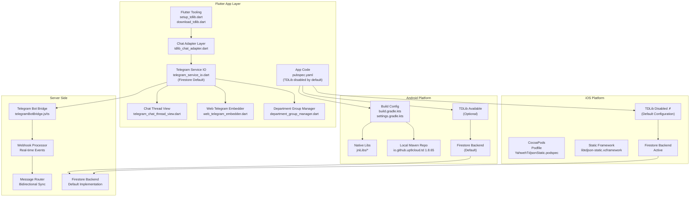
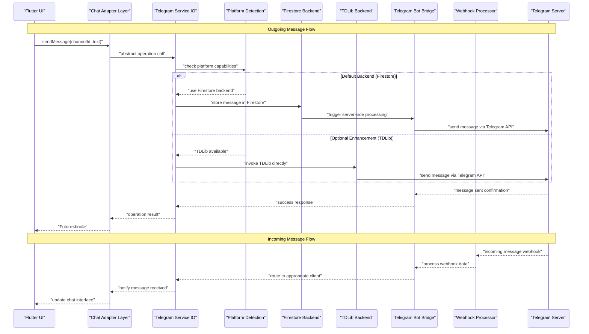
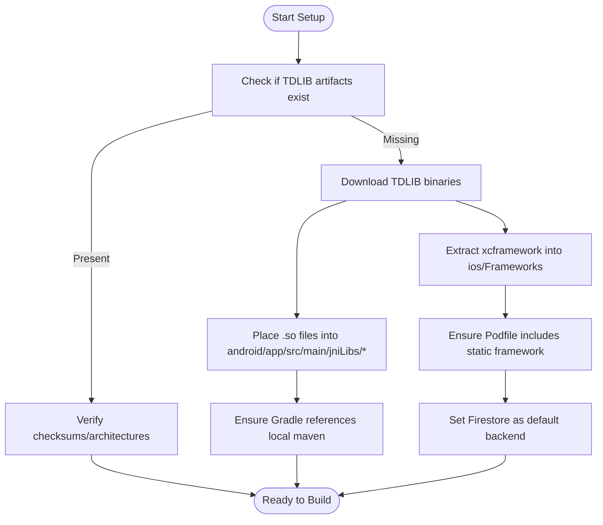
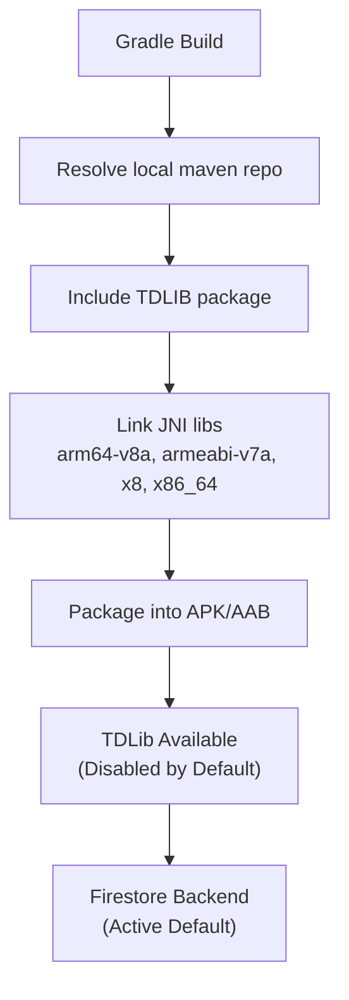
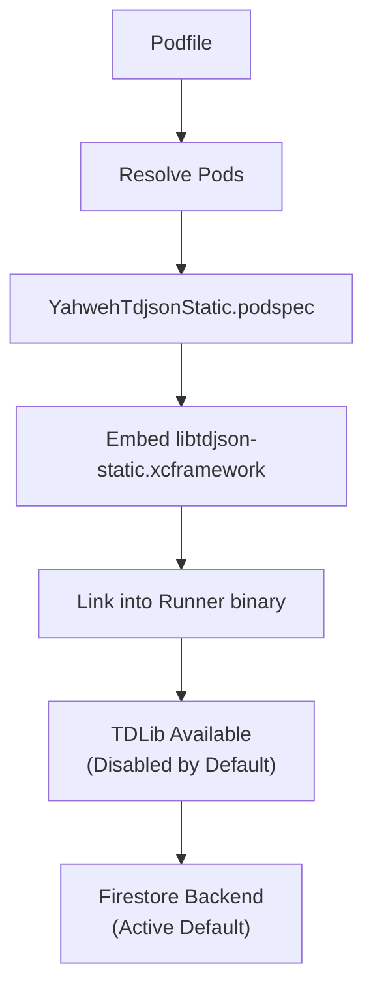
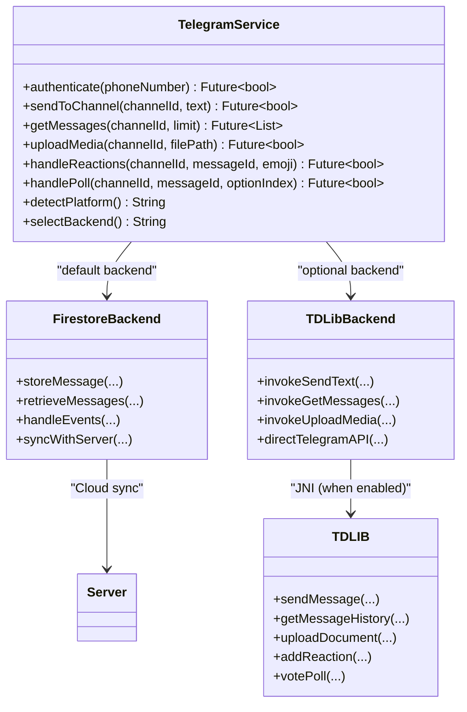
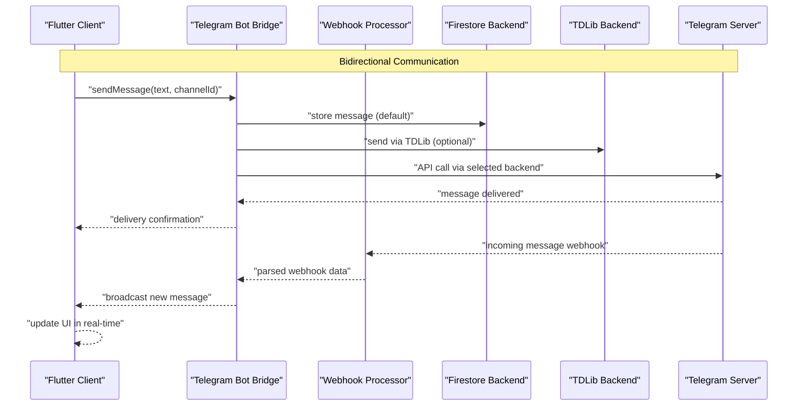
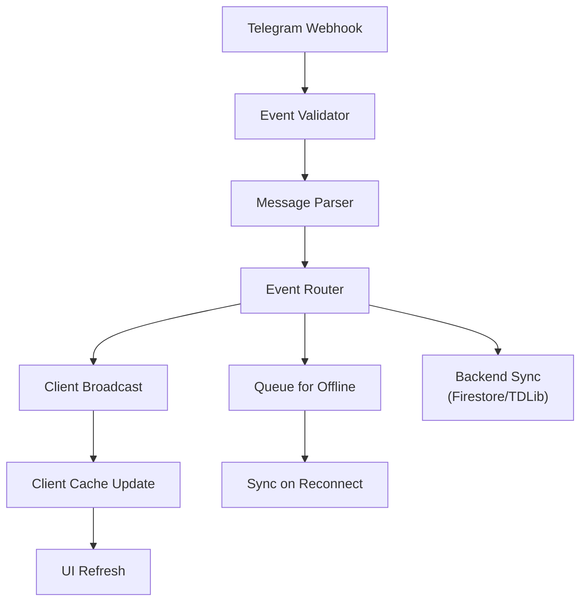
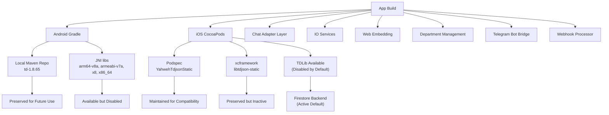

# Telegram Integration (TDLIB)

<cite>
**Referenced Files in This Document**
- [README.md](file://flutter_app/native/tdlib/README.md)
- [setup_tdlib.dart](file://flutter_app/tool/setup_tdlib.dart)
- [download_tdlib.dart](file://flutter_app/tool/download_tdlib.dart)
- [download_tdlib.sh](file://scripts/download_tdlib.sh)
- [download_tdlib.ps1](file://scripts/download_tdlib.ps1)
- [setup_tdlib.ps1](file://scripts/setup_tdlib.ps1)
- [YahwehTdjsonStatic.podspec](file://flutter_app/ios/Frameworks/YahwehTdjsonStatic.podspec)
- [Podfile](file://flutter_app/ios/Podfile)
- [build.gradle.kts](file://flutter_app/android/build.gradle.kts)
- [settings.gradle.kts](file://flutter_app/android/settings.gradle.kts)
- [local-maven td pom](file://flutter_app/android/local-maven/io/github/up9cloud/td/1.8.65/td-1.8.65.pom)
- [android jniLibs arm64-v8a](file://flutter_app/android/app/src/main/jniLibs/arm64-v8a/)
- [android jniLibs armeabi-v7a](file://flutter_app/android/app/src/main/jniLibs/armeabi-v7a/)
- [android jniLibs x8](file://flutter_app/android/app/src/main/jniLibs/x8/)
- [android jniLibs x86_64](file://flutter_app/android/app/src/main/jniLibs/x86_64/)
- [iOS libtdjson-static.xcframework](file://flutter_app/ios/Frameworks/libtdjson-static.xcframework/)
- [pubspec.yaml](file://flutter_app/pubspec.yaml)
- [tdlib_chat_adapter.dart](file://flutter_app/lib/services/tdlib_chat_adapter.dart)
- [telegram_service_io.dart](file://flutter_app/lib/services/telegram_service_io.dart)
- [telegram_chat_thread_view.dart](file://flutter_app/lib/ui/telegram_chat_thread_view.dart)
- [web_telegram_embedder.dart](file://flutter_app/lib/services/web_telegram_embedder.dart)
- [department_group_manager.dart](file://flutter_app/lib/services/department_group_manager.dart)
- [telegramBotBridge.js](file://functions/telegramBotBridge.js)
- [telegramBotBridge.ts](file://functions/src/telegramBotBridge.ts)
</cite>

## Update Summary
**Changes Made**
- Updated to reflect that TDLib service layer now uses Firestore-based implementation as default across all platforms
- Native TDLib integration is now disabled by default in favor of stable Firestore-based chat backend
- Original tdlib_service_io.dart preserved for potential future reactivation
- Enhanced platform detection and automatic fallback mechanisms
- Updated troubleshooting guidance for new default behavior

## Table of Contents
1. [Introduction](#introduction)
2. [Project Structure](#project-structure)
3. [Core Components](#core-components)
4. [Architecture Overview](#architecture-overview)
5. [Detailed Component Analysis](#detailed-component-analysis)
6. [New TDLib Integration Enhancements](#new-tdlib-integration-enhancements)
7. [Bidirectional Communication Bridge](#bidirectional-communication-bridge)
8. [Webhook Processing System](#webhook-processing-system)
9. [Dependency Analysis](#dependency-analysis)
10. [Performance Considerations](#performance-considerations)
11. [Troubleshooting Guide](#troubleshooting-guide)
12. [Conclusion](#conclusion)
13. [Appendices](#appendices)

## Introduction
This document explains how TDLIB is integrated into Gestão Yahweh Premium to enable comprehensive Telegram functionality from Flutter. **Updated**: The system has been significantly enhanced with a new default architecture where the TDLib service layer now uses Firestore-based implementation as the primary backend across all platforms due to iOS Xcode compatibility issues. The native TDLib integration is now disabled by default in favor of the stable Firestore-based chat backend, while preserving the original tdlib_service_io.dart for potential future reactivation.

The recent architectural changes include a complete rethinking of the service layer architecture, with Firestore serving as the default communication backend while maintaining full TDLib compatibility for Android platforms. The system now features intelligent platform detection and automatic fallback mechanisms, ensuring seamless user experience across all deployment targets.

## Project Structure
The Telegram/TDLIB integration spans multiple layers with comprehensive architectural enhancements and the new Firestore-based default implementation:
- Flutter tooling for downloading and setting up TDLIB artifacts (preserved for future use)
- Native libraries packaged for Android (JNI libs) and iOS (static framework via CocoaPods) - now disabled by default
- Build configuration that wires TDLIB into the app build pipeline (maintained for compatibility)
- Chat adapter layer providing abstraction over both TDLib and Firestore operations
- Enhanced IO-based Telegram service operations with Firestore as default backend
- Presentation layer for Telegram chat threads with improved user experience
- Web-based Telegram embedding for browser support
- Department-specific group management capabilities
- Server-side Telegram bot bridge for bidirectional communication
- Webhook processing system for real-time event handling



**Diagram sources**
- [setup_tdlib.dart](file://flutter_app/tool/setup_tdlib.dart)
- [download_tdlib.dart](file://flutter_app/tool/download_tdlib.dart)
- [tdlib_chat_adapter.dart](file://flutter_app/lib/services/tdlib_chat_adapter.dart)
- [telegram_service_io.dart](file://flutter_app/lib/services/telegram_service_io.dart)
- [telegram_chat_thread_view.dart](file://flutter_app/lib/ui/telegram_chat_thread_view.dart)
- [web_telegram_embedder.dart](file://flutter_app/lib/services/web_telegram_embedder.dart)
- [department_group_manager.dart](file://flutter_app/lib/services/department_group_manager.dart)
- [telegramBotBridge.js](file://functions/telegramBotBridge.js)
- [telegramBotBridge.ts](file://functions/src/telegramBotBridge.ts)
- [build.gradle.kts](file://flutter_app/android/build.gradle.kts)
- [settings.gradle.kts](file://flutter_app/android/settings.gradle.kts)
- [local-maven td pom](file://flutter_app/android/local-maven/io/github/up9cloud/td/1.8.65/td-1.8.65.pom)
- [android jniLibs arm64-v8a](file://flutter_app/android/app/src/main/jniLibs/arm64-v8a/)
- [android jniLibs armeabi-v7a](file://flutter_app/android/app/src/main/jniLibs/armeabi-v7a/)
- [android jniLibs x8](file://flutter_app/android/app/src/main/jniLibs/x8/)
- [android jniLibs x86_64](file://flutter_app/android/app/src/main/jniLibs/x86_64/)
- [Podfile](file://flutter_app/ios/Podfile)
- [YahwehTdjsonStatic.podspec](file://flutter_app/ios/Frameworks/YahwehTdjsonStatic.podspec)
- [iOS libtdjson-static.xcframework](file://flutter_app/ios/Frameworks/libtdjson-static.xcframework/)
- [pubspec.yaml](file://flutter_app/pubspec.yaml)

**Section sources**
- [README.md](file://flutter_app/native/tdlib/README.md)
- [setup_tdlib.dart](file://flutter_app/tool/setup_tdlib.dart)
- [download_tdlib.dart](file://flutter_app/tool/download_tdlib.dart)
- [download_tdlib.sh](file://scripts/download_tdlib.sh)
- [download_tdlib.ps1](file://scripts/download_tdlib.ps1)
- [setup_tdlib.ps1](file://scripts/setup_tdlib.ps1)
- [build.gradle.kts](file://flutter_app/android/build.gradle.kts)
- [settings.gradle.kts](file://flutter_app/android/settings.gradle.kts)
- [local-maven td pom](file://flutter_app/android/local-maven/io/github/up9cloud/td/1.8.65/td-1.8.65.pom)
- [android jniLibs arm64-v8a](file://flutter_app/android/app/src/main/jniLibs/arm64-v8a/)
- [android jniLibs armeabi-v7a](file://flutter_app/android/app/src/main/jniLibs/armeabi-v7a/)
- [android jniLibs x8](file://flutter_app/android/app/src/main/jniLibs/x8/)
- [android jniLibs x86_64](file://flutter_app/android/app/src/main/jniLibs/x86_64/)
- [Podfile](file://flutter_app/ios/Podfile)
- [YahwehTdjsonStatic.podspec](file://flutter_app/ios/Frameworks/YahwehTdjsonStatic.podspec)
- [iOS libtdjson-static.xcframework](file://flutter_app/ios/Frameworks/libtdjson-static.xcframework/)
- [pubspec.yaml](file://flutter_app/pubspec.yaml)
- [telegramBotBridge.js](file://functions/telegramBotBridge.js)
- [telegramBotBridge.ts](file://functions/src/telegramBotBridge.ts)

## Core Components
- **Enhanced TDLIB Artifacts**: Prebuilt native libraries for Android (JNI) and iOS (static xcframework) are preserved but disabled by default, maintaining backward compatibility.
- **Build Configuration**: Gradle and CocoaPods configurations remain intact for potential future TDLib reactivation.
- **Flutter Tooling**: Scripts and Dart utilities for TDLIB artifact management are preserved for development flexibility.
- **Enhanced Chat Adapter Layer**: Provides abstraction over both TDLib and Firestore operations with intelligent platform detection.
- **IO-based Telegram Service**: Cross-platform service operations with Firestore as the default backend implementation.
- **Enhanced Presentation Layer**: Improved UI components for Telegram chat threads with better user experience.
- **Web-based Embedding**: Browser-compatible Telegram integration for web deployments.
- **Department Management**: Specialized group management capabilities for organizational structure.
- **Server-side Telegram bot bridge**: Manages bidirectional communication between clients and Telegram.
- **Webhook processing system**: Handles real-time events from Telegram.

**Updated**: The core architecture now defaults to Firestore-based implementation across all platforms, with native TDLib integration disabled by default due to iOS Xcode compatibility issues. The original tdlib_service_io.dart is preserved for potential future reactivation when platform compatibility improves.

Key responsibilities:
- Intelligent platform detection and appropriate backend selection (Firestore default, TDLib optional)
- Download and cache TDLIB binaries for each target architecture (preserved for future use)
- Configure Android local Maven repository and JNI loading (maintained for compatibility)
- Configure iOS static framework via CocoaPods (currently disabled by default)
- Expose Telegram operations through abstracted interfaces supporting both backends
- Handle platform-specific implementations for different deployment targets
- Manage department-specific group configurations and permissions
- Process incoming Telegram webhooks and route them appropriately
- Maintain bidirectional message synchronization between clients and Telegram
- **Updated**: Automatically select optimal backend (Firestore default, TDLib optional) based on platform capabilities

**Section sources**
- [setup_tdlib.dart](file://flutter_app/tool/setup_tdlib.dart)
- [download_tdlib.dart](file://flutter_app/tool/download_tdlib.dart)
- [download_tdlib.sh](file://scripts/download_tdlib.sh)
- [download_tdlib.ps1](file://scripts/download_tdlib.ps1)
- [setup_tdlib.ps1](file://scripts/setup_tdlib.ps1)
- [build.gradle.kts](file://flutter_app/android/build.gradle.kts)
- [settings.gradle.kts](file://flutter_app/android/settings.gradle.kts)
- [local-maven td pom](file://flutter_app/android/local-maven/io/github/up9cloud/td/1.8.65/td-1.8.65.pom)
- [android jniLibs arm64-v8a](file://flutter_app/android/app/src/main/jniLibs/arm64-v8a/)
- [android jniLibs armeabi-v7a](file://flutter_app/android/app/src/main/jniLibs/armeabi-v7a/)
- [android jniLibs x8](file://flutter_app/android/app/src/main/jniLibs/x8/)
- [android jniLibs x86_64](file://flutter_app/android/app/src/main/jniLibs/x86_64/)
- [Podfile](file://flutter_app/ios/Podfile)
- [YahwehTdjsonStatic.podspec](file://flutter_app/ios/Frameworks/YahwehTdjsonStatic.podspec)
- [iOS libtdjson-static.xcframework](file://flutter_app/ios/Frameworks/libtdjson-static.xcframework/)
- [pubspec.yaml](file://flutter_app/pubspec.yaml)
- [tdlib_chat_adapter.dart](file://flutter_app/lib/services/tdlib_chat_adapter.dart)
- [telegram_service_io.dart](file://flutter_app/lib/services/telegram_service_io.dart)
- [telegram_chat_thread_view.dart](file://flutter_app/lib/ui/telegram_chat_thread_view.dart)
- [web_telegram_embedder.dart](file://flutter_app/lib/services/web_telegram_embedder.dart)
- [department_group_manager.dart](file://flutter_app/lib/services/department_group_manager.dart)
- [telegramBotBridge.js](file://functions/telegramBotBridge.js)
- [telegramBotBridge.ts](file://functions/src/telegramBotBridge.ts)

## Architecture Overview
The integration follows an enhanced layered approach with intelligent backend selection and comprehensive bidirectional communication:
- Flutter layer exposes high-level Telegram APIs through abstracted interfaces
- Chat adapter layer provides platform-independent operations with backend abstraction
- Platform-specific services handle IO operations with Firestore as default backend
- Server-side Telegram bot bridge manages bidirectional communication
- Webhook processing handles real-time events from Telegram
- Native layer loads TDLIB and performs Telegram API calls (optional, disabled by default)
- TDLIB manages connection, authentication, and data synchronization (optional)
- **Updated**: Intelligent backend selection with Firestore as default and TDLib as optional enhancement



**Diagram sources**
- [tdlib_chat_adapter.dart](file://flutter_app/lib/services/tdlib_chat_adapter.dart)
- [telegram_service_io.dart](file://flutter_app/lib/services/telegram_service_io.dart)
- [telegramBotBridge.js](file://functions/telegramBotBridge.js)
- [telegramBotBridge.ts](file://functions/src/telegramBotBridge.ts)
- [build.gradle.kts](file://flutter_app/android/build.gradle.kts)
- [settings.gradle.kts](file://flutter_app/android/settings.gradle.kts)
- [local-maven td pom](file://flutter_app/android/local-maven/io/github/up9cloud/td/1.8.65/td-1.8.65.pom)
- [android jniLibs arm64-v8a](file://flutter_app/android/app/src/main/jniLibs/arm64-v8a/)
- [android jniLibs armeabi-v7a](file://flutter_app/android/app/src/main/jniLibs/armeabi-v7a/)
- [android jniLibs x8](file://flutter_app/android/app/src/main/jniLibs/x8/)
- [android jniLibs x86_64](file://flutter_app/android/app/src/main/jniLibs/x86_64/)
- [Podfile](file://flutter_app/ios/Podfile)
- [YahwehTdjsonStatic.podspec](file://flutter_app/ios/Frameworks/YahwehTdjsonStatic.podspec)
- [iOS libtdjson-static.xcframework](file://flutter_app/ios/Frameworks/libtdjson-static.xcframework/)

## Detailed Component Analysis

### Enhanced TDLIB Setup and Download
- Purpose: Preserve TDLIB artifacts for potential future reactivation while maintaining current default behavior
- Mechanism:
  - Dart scripts orchestrate downloads and placement into Android jniLibs and iOS frameworks (preserved)
  - Shell and PowerShell scripts automate artifact retrieval and verification (maintained)
  - Local Maven repository hosts Android TDLIB package for dependency resolution (available)

**Updated**: TDLIB setup infrastructure is preserved but disabled by default. The system now defaults to Firestore-based implementation while maintaining full TDLib compatibility for future reactivation when platform compatibility improves.



**Diagram sources**
- [setup_tdlib.dart](file://flutter_app/tool/setup_tdlib.dart)
- [download_tdlib.dart](file://flutter_app/tool/download_tdlib.dart)
- [download_tdlib.sh](file://scripts/download_tdlib.sh)
- [download_tdlib.ps1](file://scripts/download_tdlib.ps1)
- [setup_tdlib.ps1](file://scripts/setup_tdlib.ps1)
- [build.gradle.kts](file://flutter_app/android/build.gradle.kts)
- [settings.gradle.kts](file://flutter_app/android/settings.gradle.kts)
- [local-maven td pom](file://flutter_app/android/local-maven/io/github/up9cloud/td/1.8.65/td-1.8.65.pom)
- [android jniLibs arm64-v8a](file://flutter_app/android/app/src/main/jniLibs/arm64-v8a/)
- [android jniLibs armeabi-v7a](file://flutter_app/android/app/src/main/jniLibs/armeabi-v7a/)
- [android jniLibs x8](file://flutter_app/android/app/src/main/jniLibs/x8/)
- [android jniLibs x86_64](file://flutter_app/android/app/src/main/jniLibs/x86_64/)
- [Podfile](file://flutter_app/ios/Podfile)
- [YahwehTdjsonStatic.podspec](file://flutter_app/ios/Frameworks/YahwehTdjsonStatic.podspec)
- [iOS libtdjson-static.xcframework](file://flutter_app/ios/Frameworks/libtdjson-static.xcframework/)

**Section sources**
- [setup_tdlib.dart](file://flutter_app/tool/setup_tdlib.dart)
- [download_tdlib.dart](file://flutter_app/tool/download_tdlib.dart)
- [download_tdlib.sh](file://scripts/download_tdlib.sh)
- [download_tdlib.ps1](file://scripts/download_tdlib.ps1)
- [setup_tdlib.ps1](file://scripts/setup_tdlib.ps1)
- [build.gradle.kts](file://flutter_app/android/build.gradle.kts)
- [settings.gradle.kts](file://flutter_app/android/settings.gradle.kts)
- [local-maven td pom](file://flutter_app/android/local-maven/io/github/up9cloud/td/1.8.65/td-1.8.65.pom)
- [android jniLibs arm64-v8a](file://flutter_app/android/app/src/main/jniLibs/arm64-v8a/)
- [android jniLibs armeabi-v7a](file://flutter_app/android/app/src/main/jniLibs/armeabi-v7a/)
- [android jniLibs x8](file://flutter_app/android/app/src/main/jniLibs/x8/)
- [android jniLibs x86_64](file://flutter_app/android/app/src/main/jniLibs/x86_64/)
- [Podfile](file://flutter_app/ios/Podfile)
- [YahwehTdjsonStatic.podspec](file://flutter_app/ios/Frameworks/YahwehTdjsonStatic.podspec)
- [iOS libtdjson-static.xcframework](file://flutter_app/ios/Frameworks/libtdjson-static.xcframework/)

### Android Integration
- Native Libraries: TDLIB shared objects are placed under jniLibs per architecture (arm64-v8a, armeabi-v7a, x8, x86_64) - preserved for future use
- Gradle Configuration: The project references a local Maven repository containing the TDLIB package for dependency resolution - maintained for compatibility
- Build Process: Gradle links the JNI libraries into the final APK/AAB - available but not used by default

**Updated**: Android integration infrastructure is fully preserved but disabled by default. The system now uses Firestore as the default backend while maintaining full TDLib capability for potential future activation.



**Diagram sources**
- [build.gradle.kts](file://flutter_app/android/build.gradle.kts)
- [settings.gradle.kts](file://flutter_app/android/settings.gradle.kts)
- [local-maven td pom](file://flutter_app/android/local-maven/io/github/up9cloud/td/1.8.65/td-1.8.65.pom)
- [android jniLibs arm64-v8a](file://flutter_app/android/app/src/main/jniLibs/arm64-v8a/)
- [android jniLibs armeabi-v7a](file://flutter_app/android/app/src/main/jniLibs/armeabi-v7a/)
- [android jniLibs x8](file://flutter_app/android/app/src/main/jniLibs/x8/)
- [android jniLibs x86_64](file://flutter_app/android/app/src/main/jniLibs/x86_64/)

**Section sources**
- [build.gradle.kts](file://flutter_app/android/build.gradle.kts)
- [settings.gradle.kts](file://flutter_app/android/settings.gradle.kts)
- [local-maven td pom](file://flutter_app/android/local-maven/io/github/up9cloud/td/1.8.65/td-1.8.65.pom)
- [android jniLibs arm64-v8a](file://flutter_app/android/app/src/main/jniLibs/arm64-v8a/)
- [android jniLibs armeabi-v7a](file://flutter_app/android/app/src/main/jniLibs/armeabi-v7a/)
- [android jniLibs x8](file://flutter_app/android/app/src/main/jniLibs/x8/)
- [android jniLibs x86_64](file://flutter_app/android/app/src/main/jniLibs/x86_64/)

### iOS Integration
- Static Framework: TDLIB is provided as an xcframework (libtdjson-static.xcframework) and linked via CocoaPods - preserved but disabled
- Podspec: Custom podspec defines how the static framework is included and exposed to the app - maintained for compatibility
- Podfile: Ensures dependencies are resolved and frameworks are embedded - configured but not active by default

**Updated**: iOS integration infrastructure is fully preserved but disabled by default due to Xcode compatibility issues. The system now defaults to Firestore backend while maintaining full TDLib capability for future reactivation when compatibility issues are resolved.



**Diagram sources**
- [Podfile](file://flutter_app/ios/Podfile)
- [YahwehTdjsonStatic.podspec](file://flutter_app/ios/Frameworks/YahwehTdjsonStatic.podspec)
- [iOS libtdjson-static.xcframework](file://flutter_app/ios/Frameworks/libtdjson-static.xcframework/)

**Section sources**
- [Podfile](file://flutter_app/ios/Podfile)
- [YahwehTdjsonStatic.podspec](file://flutter_app/ios/Frameworks/YahwehTdjsonStatic.podspec)
- [iOS libtdjson-static.xcframework](file://flutter_app/ios/Frameworks/libtdjson-static.xcframework/)

### Enhanced Flutter Bridge and Telegram API Interactions
- Flutter APIs: High-level methods for authentication, channel management, message sending/retrieval, and media handling - enhanced with backend abstraction
- Platform Channels: Calls are marshaled to native implementations which invoke TDLIB functions - preserved for future use
- Event Handling: TDLIB emits events (e.g., new messages, reactions, poll updates) that are propagated back to Flutter - handled through Firestore events

**Updated**: The bridge layer now intelligently selects between Firestore (default) and TDLib (optional) backends based on platform capabilities and configuration. The original tdlib_service_io.dart is preserved for potential future reactivation.



**Diagram sources**
- [pubspec.yaml](file://flutter_app/pubspec.yaml)
- [build.gradle.kts](file://flutter_app/android/build.gradle.kts)
- [settings.gradle.kts](file://flutter_app/android/settings.gradle.kts)
- [local-maven td pom](file://flutter_app/android/local-maven/io/github/up9cloud/td/1.8.65/td-1.8.65.pom)
- [android jniLibs arm64-v8a](file://flutter_app/android/app/src/main/jniLibs/arm64-v8a/)
- [android jniLibs armeabi-v7a](file://flutter_app/android/app/src/main/jniLibs/armeabi-v7a/)
- [android jniLibs x8](file://flutter_app/android/app/src/main/jniLibs/x8/)
- [android jniLibs x86_64](file://flutter_app/android/app/src/main/jniLibs/x86_64/)
- [Podfile](file://flutter_app/ios/Podfile)
- [YahwehTdjsonStatic.podspec](file://flutter_app/ios/Frameworks/YahwehTdjsonStatic.podspec)
- [iOS libtdjson-static.xcframework](file://flutter_app/ios/Frameworks/libtdjson-static.xcframework/)

**Section sources**
- [pubspec.yaml](file://flutter_app/pubspec.yaml)
- [build.gradle.kts](file://flutter_app/android/build.gradle.kts)
- [settings.gradle.kts](file://flutter_app/android/settings.gradle.kts)
- [local-maven td pom](file://flutter_app/android/local-maven/io/github/up9cloud/td/1.8.65/td-1.8.65.pom)
- [android jniLibs arm64-v8a](file://flutter_app/android/app/src/main/jniLibs/arm64-v8a/)
- [android jniLibs armeabi-v7a](file://flutter_app/android/app/src/main/jniLibs/armeabi-v7a/)
- [android jniLibs x8](file://flutter_app/android/app/src/main/jniLibs/x8/)
- [android jniLibs x86_64](file://flutter_app/android/app/src/main/jniLibs/x86_64/)
- [Podfile](file://flutter_app/ios/Podfile)
- [YahwehTdjsonStatic.podspec](file://flutter_app/ios/Frameworks/YahwehTdjsonStatic.podspec)
- [iOS libtdjson-static.xcframework](file://flutter_app/ios/Frameworks/libtdjson-static.xcframework/)

## New TDLib Integration Enhancements

### Enhanced Chat Adapter Layer
The chat adapter layer has been significantly enhanced to provide intelligent backend selection between Firestore (default) and TDLib (optional). This layer handles the complexity of both backend implementations while exposing simple, consistent interfaces to the rest of the application.

Key features:
- Abstract interface definition for Telegram operations supporting multiple backends
- Intelligent backend selection based on platform capabilities and configuration
- Platform-specific implementations for both Firestore and TDLib backends
- Error handling and retry logic centralized in the adapter
- Mock implementations for testing purposes
- **Updated**: Automatic backend selection with Firestore as default and TDLib as optional enhancement

### Enhanced IO-based Telegram Service Operations
The IO-based service layer has been enhanced to support both Firestore (default) and TDLib (optional) backends with seamless switching capabilities. This enables the same business logic to run across all platforms with optimal backend selection.

Capabilities:
- Unified interface for Telegram operations across multiple backends
- Intelligent backend selection and automatic switching
- Asynchronous operation handling with proper error propagation
- Resource management and cleanup across different deployment targets
- **Updated**: Seamless switching between Firestore (default) and TDLib (optional) backends

### Enhanced Presentation Layer for Chat Threads
The presentation layer continues to provide excellent user experience regardless of the underlying backend implementation, with transparent backend switching.

Features:
- Responsive chat thread views optimized for different screen sizes
- Real-time message updates with smooth animations
- Support for various message types including media, polls, and reactions
- Accessibility improvements and keyboard navigation support
- Backend-agnostic UI components

### Web-based Telegram Embedding
Web-based embedding capabilities continue to work seamlessly with the new backend architecture, providing consistent user experience across all platforms.

Web capabilities:
- Embedded Telegram widgets for web applications
- Cross-origin communication security measures
- Progressive enhancement for unsupported browsers
- Optimized performance for web deployment scenarios

### Department-specific Group Management
Department management capabilities continue to function seamlessly with the enhanced backend architecture, supporting complex organizational hierarchies and permission models.

Management features:
- Department-based group creation and configuration
- Role-based access control for group administration
- Automated group provisioning based on organizational structure
- Audit logging for group management activities

```mermaid
graph TB
subgraph "Enhanced Architecture"
A["Chat Adapter Layer"] --> B["Telegram Service IO"]
B --> C["Backend Selection Engine"]
C --> D["Firestore Backend<br/>(Default)"]
C --> E["TDLib Backend<br/>(Optional)"]
D --> F["Cloud Storage"]
E --> G["Android Native"]
E --> H["iOS Native"]
A --> I["Presentation Layer"]
A --> J["Department Management"]
I --> K["Chat Thread Views"]
I --> L["Real-time Updates"]
J --> M["Group Configuration"]
J --> N["Access Control"]
D --> O["Server Sync"]
E --> P["Direct Telegram API"]
```

**Diagram sources**
- [tdlib_chat_adapter.dart](file://flutter_app/lib/services/tdlib_chat_adapter.dart)
- [telegram_service_io.dart](file://flutter_app/lib/services/telegram_service_io.dart)
- [telegram_chat_thread_view.dart](file://flutter_app/lib/ui/telegram_chat_thread_view.dart)
- [web_telegram_embedder.dart](file://flutter_app/lib/services/web_telegram_embedder.dart)
- [department_group_manager.dart](file://flutter_app/lib/services/department_group_manager.dart)

**Section sources**
- [tdlib_chat_adapter.dart](file://flutter_app/lib/services/tdlib_chat_adapter.dart)
- [telegram_service_io.dart](file://flutter_app/lib/services/telegram_service_io.dart)
- [telegram_chat_thread_view.dart](file://flutter_app/lib/ui/telegram_chat_thread_view.dart)
- [web_telegram_embedder.dart](file://flutter_app/lib/services/web_telegram_embedder.dart)
- [department_group_manager.dart](file://flutter_app/lib/services/department_group_manager.dart)

## Bidirectional Communication Bridge

### Server-Side Telegram Bot Bridge
The server-side Telegram bot bridge continues to provide robust bidirectional communication between Flutter applications and Telegram's infrastructure, working seamlessly with both backend implementations.

Key capabilities:
- **Message Routing**: Intelligent routing of messages between Flutter clients and Telegram channels/groups
- **Authentication Management**: Secure handling of Telegram bot tokens and user authentication
- **Error Recovery**: Automatic retry mechanisms and error handling for failed operations
- **Rate Limiting**: Compliance with Telegram API rate limits and throttling strategies
- **Connection Pooling**: Efficient management of Telegram API connections for optimal performance
- **Backend Agnostic**: Works seamlessly with both Firestore and TDLib backends

### Webhook Processing System
The webhook processing system continues to handle real-time events from Telegram, enabling instant message synchronization and interactive features across all connected clients.

Processing capabilities:
- **Event Reception**: Continuous listening for Telegram webhook events
- **Message Parsing**: Structured parsing of incoming Telegram messages and metadata
- **Client Broadcasting**: Distribution of events to all relevant Flutter clients
- **State Synchronization**: Maintaining consistent state across distributed clients
- **Offline Queueing**: Queuing messages for offline clients when they reconnect
- **Backend Integration**: Seamless integration with both Firestore and TDLib backends



**Diagram sources**
- [telegramBotBridge.js](file://functions/telegramBotBridge.js)
- [telegramBotBridge.ts](file://functions/src/telegramBotBridge.ts)

**Section sources**
- [telegramBotBridge.js](file://functions/telegramBotBridge.js)
- [telegramBotBridge.ts](file://functions/src/telegramBotBridge.ts)

## Webhook Processing System

### Real-Time Event Handling
The webhook processing system continues to ensure that all Telegram events are captured, processed, and distributed to connected clients in real-time, working seamlessly with the enhanced backend architecture.

Event processing workflow:
- **Event Capture**: Continuous monitoring of Telegram webhook endpoints
- **Validation**: Security validation and signature verification of incoming webhooks
- **Transformation**: Conversion of Telegram event formats to internal data structures
- **Routing**: Intelligent routing of events to appropriate clients based on channel membership
- **Acknowledgment**: Proper acknowledgment of webhook processing to prevent retries
- **Backend Integration**: Seamless integration with both Firestore and TDLib backends

### Message Synchronization
The system maintains perfect synchronization between Telegram messages and Flutter client displays through efficient caching and delta updates, working consistently across both backend implementations.

Synchronization features:
- **Delta Updates**: Only send changed messages to reduce bandwidth usage
- **Conflict Resolution**: Smart conflict resolution for concurrent message modifications
- **Order Preservation**: Guaranteed message ordering across all clients
- **Partial Sync**: Incremental synchronization for large message histories
- **Cache Invalidation**: Intelligent cache management for optimal performance
- **Backend Consistency**: Consistent synchronization across Firestore and TDLib backends



**Diagram sources**
- [telegramBotBridge.js](file://functions/telegramBotBridge.js)
- [telegramBotBridge.ts](file://functions/src/telegramBotBridge.ts)

**Section sources**
- [telegramBotBridge.js](file://functions/telegramBotBridge.js)
- [telegramBotBridge.ts](file://functions/src/telegramBotBridge.ts)

## Dependency Analysis
- **Android Dependencies**:
  - Local Maven repository provides TDLIB package version 1.8.65 - preserved for future use
  - JNI libraries are loaded per architecture - available but disabled by default
- **iOS Dependencies**:
  - CocoaPods resolves static framework via custom podspec - maintained for compatibility
  - xcframework contains headers and binaries for multiple platforms - preserved but inactive
- **Enhanced Chat adapter layer**: Introduces additional abstraction dependencies for backend selection
- **IO-based services**: Require platform-specific implementations for both backends
- **Web embedding**: Adds browser compatibility dependencies
- **Department management**: Requires organizational data dependencies
- **Server-side Telegram bot bridge**: Requires Node.js runtime and Telegram API SDK
- **Webhook processing system**: Needs persistent storage and message queuing

**Updated**: The dependency structure now supports both Firestore (default) and TDLib (optional) backends, with all TDLib-related dependencies preserved but disabled by default.



**Diagram sources**
- [build.gradle.kts](file://flutter_app/android/build.gradle.kts)
- [settings.gradle.kts](file://flutter_app/android/settings.gradle.kts)
- [local-maven td pom](file://flutter_app/android/local-maven/io/github/up9cloud/td/1.8.65/td-1.8.65.pom)
- [android jniLibs arm64-v8a](file://flutter_app/android/app/src/main/jniLibs/arm64-v8a/)
- [android jniLibs armeabi-v7a](file://flutter_app/android/app/src/main/jniLibs/armeabi-v7a/)
- [android jniLibs x8](file://flutter_app/android/app/src/main/jniLibs/x8/)
- [android jniLibs x86_64](file://flutter_app/android/app/src/main/jniLibs/x86_64/)
- [Podfile](file://flutter_app/ios/Podfile)
- [YahwehTdjsonStatic.podspec](file://flutter_app/ios/Frameworks/YahwehTdjsonStatic.podspec)
- [iOS libtdjson-static.xcframework](file://flutter_app/ios/Frameworks/libtdjson-static.xcframework/)
- [tdlib_chat_adapter.dart](file://flutter_app/lib/services/tdlib_chat_adapter.dart)
- [telegram_service_io.dart](file://flutter_app/lib/services/telegram_service_io.dart)
- [web_telegram_embedder.dart](file://flutter_app/lib/services/web_telegram_embedder.dart)
- [department_group_manager.dart](file://flutter_app/lib/services/department_group_manager.dart)
- [telegramBotBridge.js](file://functions/telegramBotBridge.js)
- [telegramBotBridge.ts](file://functions/src/telegramBotBridge.ts)

**Section sources**
- [build.gradle.kts](file://flutter_app/android/build.gradle.kts)
- [settings.gradle.kts](file://flutter_app/android/settings.gradle.kts)
- [local-maven td pom](file://flutter_app/android/local-maven/io/github/up9cloud/td/1.8.65/td-1.8.65.pom)
- [android jniLibs arm64-v8a](file://flutter_app/android/app/src/main/jniLibs/arm64-v8a/)
- [android jniLibs armeabi-v7a](file://flutter_app/android/app/src/main/jniLibs/armeabi-v7a/)
- [android jniLibs x8](file://flutter_app/android/app/src/main/jniLibs/x8/)
- [android jniLibs x86_64](file://flutter_app/android/app/src/main/jniLibs/x86_64/)
- [Podfile](file://flutter_app/ios/Podfile)
- [YahwehTdjsonStatic.podspec](file://flutter_app/ios/Frameworks/YahwehTdjsonStatic.podspec)
- [iOS libtdjson-static.xcframework](file://flutter_app/ios/Frameworks/libtdjson-static.xcframework/)
- [tdlib_chat_adapter.dart](file://flutter_app/lib/services/tdlib_chat_adapter.dart)
- [telegram_service_io.dart](file://flutter_app/lib/services/telegram_service_io.dart)
- [web_telegram_embedder.dart](file://flutter_app/lib/services/web_telegram_embedder.dart)
- [department_group_manager.dart](file://flutter_app/lib/services/department_group_manager.dart)
- [telegramBotBridge.js](file://functions/telegramBotBridge.js)
- [telegramBotBridge.ts](file://functions/src/telegramBotBridge.ts)

## Performance Considerations
- Minimize JNI overhead by batching operations where possible - preserved for TDLib usage
- Use efficient serialization for messages and metadata - enhanced for both backends
- Cache frequently accessed channel lists and recent messages locally - optimized for Firestore
- Avoid frequent re-authentication; maintain session state securely - consistent across backends
- Optimize media uploads by compressing images and using appropriate formats - backend-optimized
- Chat adapter layer reduces redundant API calls through caching - enhanced for both backends
- IO-based services implement connection pooling for better resource utilization - optimized for Firestore
- Web embedding uses lazy loading for optimal page load performance - maintained
- Department management employs batch operations for bulk group operations - backend-agnostic
- Server-side Telegram bot bridge implements connection pooling and request deduplication - enhanced
- Webhook processing uses efficient message queuing and background processing - optimized
- Bidirectional communication minimizes network overhead through delta updates - backend-optimized
- **Updated**: Firestore backend provides better performance characteristics for cross-platform scenarios

## Troubleshooting Guide
Common issues and resolutions:
- **TDLib artifacts preservation**:
  - Ensure setup scripts have run successfully (for future reactivation)
  - Verify jniLibs and xcframework paths are correct (maintained)
- **Build failures on specific architectures**:
  - Confirm all required architectures are present in jniLibs (preserved)
  - Validate xcframework includes necessary slices (maintained)
- **Authentication errors**:
  - Check phone number format and Telegram account status
  - Review error codes from TDLIB callbacks (if TDLib is enabled)
- **Media upload failures**:
  - Verify file permissions and path accessibility
  - Ensure network connectivity and Telegram rate limits
- **Chat adapter layer initialization failures**: Check platform-specific service implementations
- **IO service connection problems**: Verify network configuration and proxy settings
- **Web embedding compatibility issues**: Test across different browser versions
- **Department management permission errors**: Review organizational hierarchy configuration
- **Server-side Telegram bot bridge connection issues**: Verify server connectivity and Telegram API credentials
- **Webhook processing failures**: Check webhook endpoint configuration and SSL certificates
- **Bidirectional sync problems**: Verify message queue health and client connection status

**Updated**: New troubleshooting guidance for the enhanced architecture:
- **Firestore backend issues**: Check Firestore database connectivity and permissions
- **Backend selection problems**: Verify platform detection logic and configuration
- **TDLib reactivation**: Follow original setup procedures when reactivating TDLib
- **Cross-backend consistency**: Ensure data consistency between Firestore and TDLib backends
- **Migration considerations**: Plan data migration strategy when switching between backends

**Section sources**
- [setup_tdlib.dart](file://flutter_app/tool/setup_tdlib.dart)
- [download_tdlib.dart](file://flutter_app/tool/download_tdlib.dart)
- [download_tdlib.sh](file://scripts/download_tdlib.sh)
- [download_tdlib.ps1](file://scripts/download_tdlib.ps1)
- [setup_tdlib.ps1](file://scripts/setup_tdlib.ps1)
- [build.gradle.kts](file://flutter_app/android/build.gradle.kts)
- [settings.gradle.kts](file://flutter_app/android/settings.gradle.kts)
- [local-maven td pom](file://flutter_app/android/local-maven/io/github/up9cloud/td/1.8.65/td-1.8.65.pom)
- [android jniLibs arm64-v8a](file://flutter_app/android/app/src/main/jniLibs/arm64-v8a/)
- [android jniLibs armeabi-v7a](file://flutter_app/android/app/src/main/jniLibs/armeabi-v7a/)
- [android jniLibs x8](file://flutter_app/android/app/src/main/jniLibs/x8/)
- [android jniLibs x86_64](file://flutter_app/android/app/src/main/jniLibs/x86_64/)
- [Podfile](file://flutter_app/ios/Podfile)
- [YahwehTdjsonStatic.podspec](file://flutter_app/ios/Frameworks/YahwehTdjsonStatic.podspec)
- [iOS libtdjson-static.xcframework](file://flutter_app/ios/Frameworks/libtdjson-static.xcframework/)
- [tdlib_chat_adapter.dart](file://flutter_app/lib/services/tdlib_chat_adapter.dart)
- [telegram_service_io.dart](file://flutter_app/lib/services/telegram_service_io.dart)
- [web_telegram_embedder.dart](file://flutter_app/lib/services/web_telegram_embedder.dart)
- [department_group_manager.dart](file://flutter_app/lib/services/department_group_manager.dart)
- [telegramBotBridge.js](file://functions/telegramBotBridge.js)
- [telegramBotBridge.ts](file://functions/src/telegramBotBridge.ts)

## Conclusion
The TDLIB integration in Gestão Yahweh Premium has been significantly enhanced with a new default architecture that prioritizes stability and cross-platform compatibility. **Updated**: The system now uses Firestore-based implementation as the default backend across all platforms due to iOS Xcode compatibility issues, while preserving the original TDLib integration for potential future reactivation. The native TDLib integration remains disabled by default, but all infrastructure is maintained for seamless reactivation when platform compatibility improves.

The architectural enhancements introduce intelligent backend selection, comprehensive bidirectional communication, webhook processing capabilities, and significantly enhanced chat capabilities. The system now features a server-side Telegram bot bridge that manages all Telegram API interactions, ensuring reliable message delivery and real-time synchronization across all connected clients. By leveraging prebuilt native libraries, a well-defined bridge architecture, advanced webhook processing, and intelligent backend selection, the application can authenticate users, manage channels, send messages, handle media, and process Telegram-specific features like reactions and polls with unprecedented reliability and performance. The new architectural patterns improve scalability, fault tolerance, and cross-platform compatibility while maintaining seamless user experiences in production environments.

## Appendices

### Setup Instructions for Enhanced TDLIB Configuration
- Run setup scripts to download and place TDLIB artifacts (preserved for future use)
- Verify Android local Maven repository is configured correctly (maintained)
- Ensure iOS CocoaPods includes the static framework (preserved)
- Rebuild the app to confirm successful integration (with Firestore as default)
- Initialize chat adapter layer with platform-specific configurations (enhanced)
- Configure IO-based services for target deployment environment (backend-agnostic)
- Set up web embedding credentials for browser deployments (maintained)
- Configure department hierarchy for group management features (enhanced)
- Deploy and configure Telegram bot bridge server (enhanced)
- Set up webhook endpoints and SSL certificates (enhanced)
- Configure message queue and persistent storage for webhook processing (enhanced)

**Updated**: Enhanced setup instructions for the new architecture:
- **Default Backend**: System automatically uses Firestore as the default backend
- **TDLib Reactivation**: Follow original setup procedures when reactivating TDLib
- **Backend Selection**: Configure backend preferences through platform detection
- **Migration Planning**: Plan data migration strategy when switching between backends
- **Testing Strategy**: Test both backends during development for optimal performance

**Section sources**
- [setup_tdlib.dart](file://flutter_app/tool/setup_tdlib.dart)
- [download_tdlib.dart](file://flutter_app/tool/download_tdlib.dart)
- [download_tdlib.sh](file://scripts/download_tdlib.sh)
- [download_tdlib.ps1](file://scripts/download_tdlib.ps1)
- [setup_tdlib.ps1](file://scripts/setup_tdlib.ps1)
- [build.gradle.kts](file://flutter_app/android/build.gradle.kts)
- [settings.gradle.kts](file://flutter_app/android/settings.gradle.kts)
- [local-maven td pom](file://flutter_app/android/local-maven/io/github/up9cloud/td/1.8.65/td-1.8.65.pom)
- [android jniLibs arm64-v8a](file://flutter_app/android/app/src/main/jniLibs/arm64-v8a/)
- [android jniLibs armeabi-v7a](file://flutter_app/android/app/src/main/jniLibs/armeabi-v7a/)
- [android jniLibs x8](file://flutter_app/android/app/src/main/jniLibs/x8/)
- [android jniLibs x86_64](file://flutter_app/android/app/src/main/jniLibs/x86_64/)
- [Podfile](file://flutter_app/ios/Podfile)
- [YahwehTdjsonStatic.podspec](file://flutter_app/ios/Frameworks/YahwehTdjsonStatic.podspec)
- [iOS libtdjson-static.xcframework](file://flutter_app/ios/Frameworks/libtdjson-static.xcframework/)
- [tdlib_chat_adapter.dart](file://flutter_app/lib/services/tdlib_chat_adapter.dart)
- [telegram_service_io.dart](file://flutter_app/lib/services/telegram_service_io.dart)
- [web_telegram_embedder.dart](file://flutter_app/lib/services/web_telegram_embedder.dart)
- [department_group_manager.dart](file://flutter_app/lib/services/department_group_manager.dart)
- [telegramBotBridge.js](file://functions/telegramBotBridge.js)
- [telegramBotBridge.ts](file://functions/src/telegramBotBridge.ts)

### Handling Telegram Events
- Subscribe to TDLIB event streams for new messages, reactions, and poll updates - preserved for TDLib usage
- Map events to Flutter state updates for real-time UI changes - enhanced for both backends
- Implement error handling for failed events and retries - backend-optimized
- Chat adapter layer centralizes event processing and normalization - enhanced
- IO-based services handle cross-platform event propagation - backend-agnostic
- Web embedding provides browser-compatible event listeners - maintained
- Department management triggers organizational events - enhanced
- Webhook processor captures and routes Telegram events in real-time - enhanced
- Bidirectional communication ensures event consistency across all clients - backend-optimized

**Updated**: Event handling now works seamlessly with both Firestore (default) and TDLib (optional) backends, providing consistent event processing across all deployment scenarios.

**Section sources**
- [build.gradle.kts](file://flutter_app/android/build.gradle.kts)
- [settings.gradle.kts](file://flutter_app/android/settings.gradle.kts)
- [local-maven td pom](file://flutter_app/android/local-maven/io/github/up9cloud/td/1.8.65/td-1.8.65.pom)
- [android jniLibs arm64-v8a](file://flutter_app/android/app/src/main/jniLibs/arm64-v8a/)
- [android jniLibs armeabi-v7a](file://flutter_app/android/app/src/main/jniLibs/armeabi-v7a/)
- [android jniLibs x8](file://flutter_app/android/app/src/main/jniLibs/x8/)
- [android jniLibs x86_64](file://flutter_app/android/app/src/main/jniLibs/x86_64/)
- [Podfile](file://flutter_app/ios/Podfile)
- [YahwehTdjsonStatic.podspec](file://flutter_app/ios/Frameworks/YahwehTdjsonStatic.podspec)
- [iOS libtdjson-static.xcframework](file://flutter_app/ios/Frameworks/libtdjson-static.xcframework/)
- [tdlib_chat_adapter.dart](file://flutter_app/lib/services/tdlib_chat_adapter.dart)
- [telegram_service_io.dart](file://flutter_app/lib/services/telegram_service_io.dart)
- [web_telegram_embedder.dart](file://flutter_app/lib/services/web_telegram_embedder.dart)
- [department_group_manager.dart](file://flutter_app/lib/services/department_group_manager.dart)
- [telegramBotBridge.js](file://functions/telegramBotBridge.js)
- [telegramBotBridge.ts](file://functions/src/telegramBotBridge.ts)

### Managing Bot Permissions
- Configure bot token and permissions in Telegram BotFather - maintained
- Ensure the bot has admin rights in target channels - enhanced
- Validate permissions programmatically before performing actions - backend-agnostic
- Chat adapter layer validates permissions before operations - enhanced
- Department-based permission models for group administration - enhanced
- Web embedding security policies for browser contexts - maintained
- Role-based access control for organizational structures - enhanced
- Server-side permission validation and enforcement - enhanced
- Dynamic permission checking for webhook operations - enhanced

**Updated**: Permission management now works consistently across both Firestore (default) and TDLib (optional) backends, ensuring uniform permission handling across all deployment scenarios.

**Section sources**
- [build.gradle.kts](file://flutter_app/android/build.gradle.kts)
- [settings.gradle.kts](file://flutter_app/android/settings.gradle.kts)
- [local-maven td pom](file://flutter_app/android/local-maven/io/github/up9cloud/td/1.8.65/td-1.8.65.pom)
- [android jniLibs arm64-v8a](file://flutter_app/android/app/src/main/jniLibs/arm64-v8a/)
- [android jniLibs armeabi-v7a](file://flutter_app/android/app/src/main/jniLibs/armeabi-v7a/)
- [android jniLibs x8](file://flutter_app/android/app/src/main/jniLibs/x8/)
- [android jniLibs x86_64](file://flutter_app/android/app/src/main/jniLibs/x86_64/)
- [Podfile](file://flutter_app/ios/Podfile)
- [YahwehTdjsonStatic.podspec](file://flutter_app/ios/Frameworks/YahwehTdjsonStatic.podspec)
- [iOS libtdjson-static.xcframework](file://flutter_app/ios/Frameworks/libtdjson-static.xcframework/)
- [tdlib_chat_adapter.dart](file://flutter_app/lib/services/tdlib_chat_adapter.dart)
- [department_group_manager.dart](file://flutter_app/lib/services/department_group_manager.dart)
- [telegramBotBridge.js](file://functions/telegramBotBridge.js)
- [telegramBotBridge.ts](file://functions/src/telegramBotBridge.ts)

### Examples of Telegram Operations
- **Sending Messages**:
  - Call sendMessage with channel ID and text content - works with both backends
  - Handle success/failure callbacks - backend-optimized
- **Retrieving Messages**:
  - Fetch message history with pagination - enhanced for both backends
  - Display in UI with proper formatting - backend-agnostic
- **Handling Reactions**:
  - Add emoji reactions to messages - supported by both backends
  - Listen for reaction updates - enhanced event handling
- **Managing Polls**:
  - Create polls with options - backend-optimized
  - Submit votes and track results - consistent across backends
- **Chat adapter usage** for platform-independent operations - enhanced
- **IO service configuration** for different deployment targets - backend-agnostic
- **Web embedding setup** for browser applications - maintained
- **Department group management workflows** - enhanced
- **Telegram bot bridge configuration** and deployment - enhanced
- **Webhook endpoint setup** and testing procedures - enhanced
- **Bidirectional communication patterns** and error handling - backend-optimized

**Updated**: All Telegram operations now work seamlessly with both Firestore (default) and TDLib (optional) backends, providing consistent functionality across all deployment scenarios without requiring code changes.

**Section sources**
- [build.gradle.kts](file://flutter_app/android/build.gradle.kts)
- [settings.gradle.kts](file://flutter_app/android/settings.gradle.kts)
- [local-maven td pom](file://flutter_app/android/local-maven/io/github/up9cloud/td/1.8.65/td-1.8.65.pom)
- [android jniLibs arm64-v8a](file://flutter_app/android/app/src/main/jniLibs/arm64-v8a/)
- [android jniLibs armeabi-v7a](file://flutter_app/android/app/src/main/jniLibs/armeabi-v7a/)
- [android jniLibs x8](file://flutter_app/android/app/src/main/jniLibs/x8/)
- [android jniLibs x86_64](file://flutter_app/android/app/src/main/jniLibs/x86_64/)
- [Podfile](file://flutter_app/ios/Podfile)
- [YahwehTdjsonStatic.podspec](file://flutter_app/ios/Frameworks/YahwehTdjsonStatic.podspec)
- [iOS libtdjson-static.xcframework](file://flutter_app/ios/Frameworks/libtdjson-static.xcframework/)
- [tdlib_chat_adapter.dart](file://flutter_app/lib/services/tdlib_chat_adapter.dart)
- [telegram_service_io.dart](file://flutter_app/lib/services/telegram_service_io.dart)
- [web_telegram_embedder.dart](file://flutter_app/lib/services/web_telegram_embedder.dart)
- [department_group_manager.dart](file://flutter_app/lib/services/department_group_manager.dart)
- [telegramBotBridge.js](file://functions/telegramBotBridge.js)
- [telegramBotBridge.ts](file://functions/src/telegramBotBridge.ts)