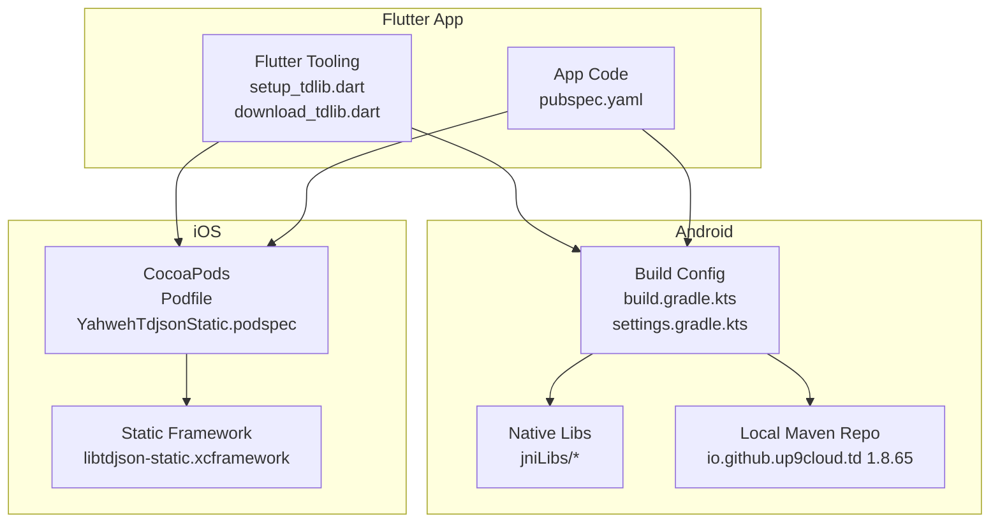
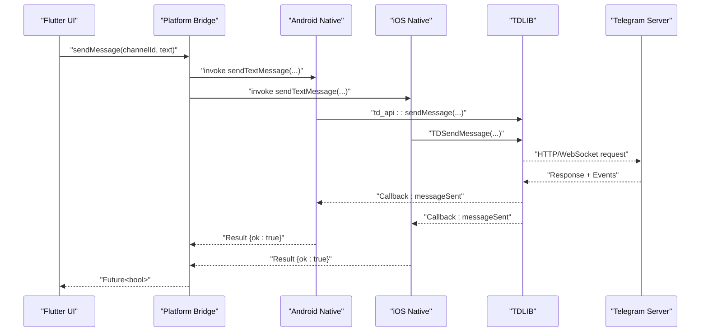
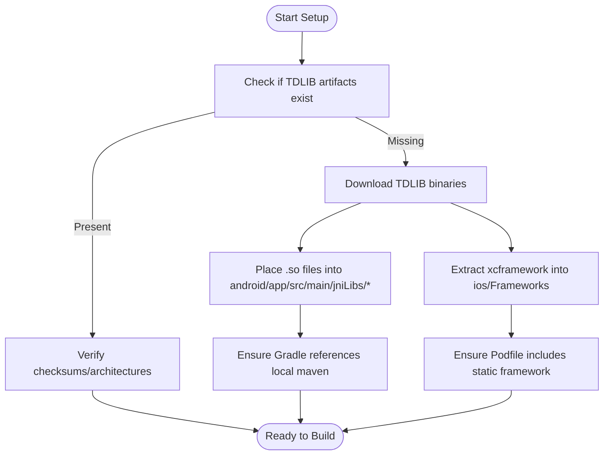
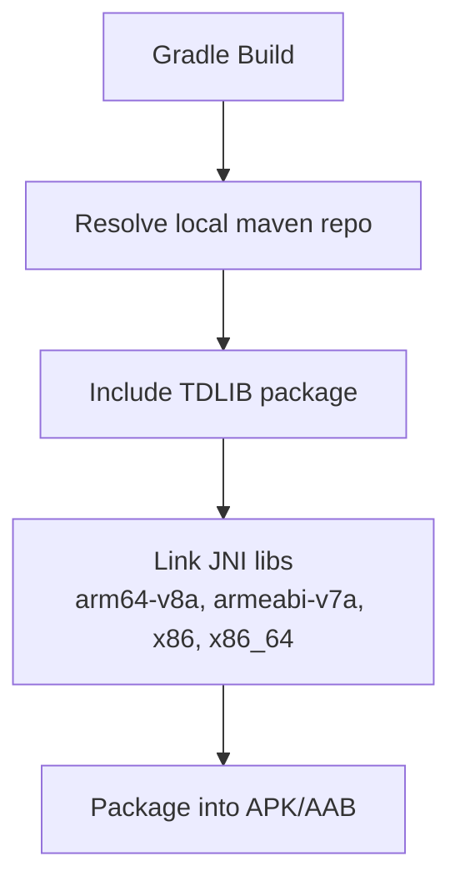
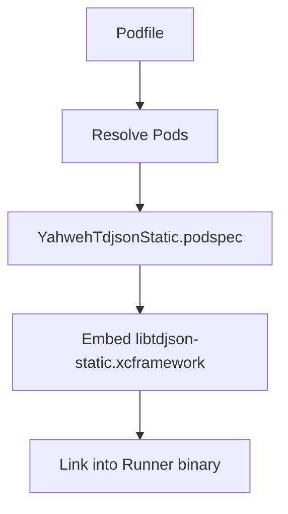
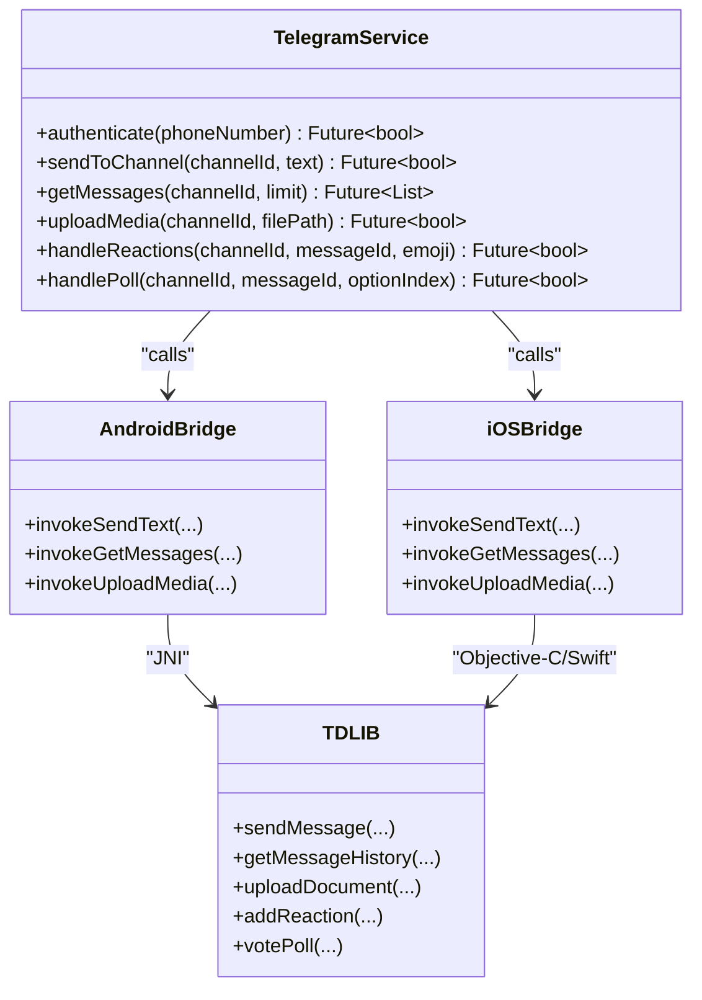
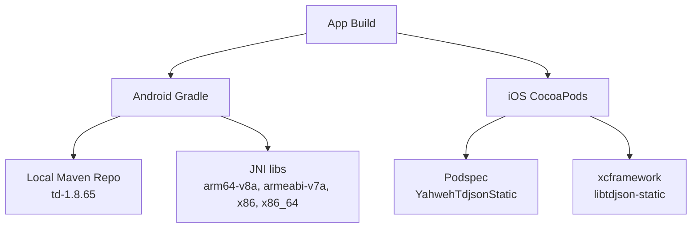

# Telegram Integration (TDLIB)

<cite>
**Referenced Files in This Document**
- [README.md](file://flutter_app/native/tdlib/README.md)
- [setup_tdlib.dart](file://flutter_app/tool/setup_tdlib.dart)
- [download_tdlib.dart](file://flutter_app/tool/download_tdlib.dart)
- [download_tdlib.sh](file://scripts/download_tdlib.sh)
- [download_tdlib.ps1](file://scripts/download_tdlib.ps1)
- [setup_tdlib.ps1](file://scripts/setup_tdlib.ps1)
- [YahwehTdjsonStatic.podspec](file://flutter_app/ios/Frameworks/YahwehTdjsonStatic.podspec)
- [Podfile](file://flutter_app/ios/Podfile)
- [build.gradle.kts](file://flutter_app/android/build.gradle.kts)
- [settings.gradle.kts](file://flutter_app/android/settings.gradle.kts)
- [local-maven td pom](file://flutter_app/android/local-maven/io/github/up9cloud/td/1.8.65/td-1.8.65.pom)
- [android jniLibs arm64-v8a](file://flutter_app/android/app/src/main/jniLibs/arm64-v8a/)
- [android jniLibs armeabi-v7a](file://flutter_app/android/app/src/main/jniLibs/armeabi-v7a/)
- [android jniLibs x86](file://flutter_app/android/app/src/main/jniLibs/x86/)
- [android jniLibs x86_64](file://flutter_app/android/app/src/main/jniLibs/x86_64/)
- [iOS libtdjson-static.xcframework](file://flutter_app/ios/Frameworks/libtdjson-static.xcframework/)
- [pubspec.yaml](file://flutter_app/pubspec.yaml)
</cite>

## Table of Contents
1. [Introduction](#introduction)
2. [Project Structure](#project-structure)
3. [Core Components](#core-components)
4. [Architecture Overview](#architecture-overview)
5. [Detailed Component Analysis](#detailed-component-analysis)
6. [Dependency Analysis](#dependency-analysis)
7. [Performance Considerations](#performance-considerations)
8. [Troubleshooting Guide](#troubleshooting-guide)
9. [Conclusion](#conclusion)
10. [Appendices](#appendices)

## Introduction
This document explains how TDLIB is integrated into Gestão Yahweh Premium to enable Telegram functionality from Flutter. It covers the native TDLIB implementation, the bridge architecture between Flutter and native code, and how Telegram API interactions are handled on Android and iOS. It also provides setup instructions for configuring TDLIB, handling Telegram events, managing bot permissions, and troubleshooting common integration issues. Examples include sending messages to Telegram channels, retrieving messages, and handling Telegram-specific features such as reactions and polls.

## Project Structure
The Telegram/TDLIB integration spans multiple layers:
- Flutter tooling for downloading and setting up TDLIB artifacts
- Native libraries packaged for Android (JNI libs) and iOS (static framework via CocoaPods)
- Build configuration that wires TDLIB into the app
- Optional Dart utilities to bootstrap TDLIB at runtime

**Diagram sources**
- [setup_tdlib.dart](file://flutter_app/tool/setup_tdlib.dart)
- [download_tdlib.dart](file://flutter_app/tool/download_tdlib.dart)
- [download_tdlib.sh](file://scripts/download_tdlib.sh)
- [download_tdlib.ps1](file://scripts/download_tdlib.ps1)
- [setup_tdlib.ps1](file://scripts/setup_tdlib.ps1)
- [build.gradle.kts](file://flutter_app/android/build.gradle.kts)
- [settings.gradle.kts](file://flutter_app/android/settings.gradle.kts)
- [local-maven td pom](file://flutter_app/android/local-maven/io/github/up9cloud/td/1.8.65/td-1.8.65.pom)
- [android jniLibs arm64-v8a](file://flutter_app/android/app/src/main/jniLibs/arm64-v8a/)
- [android jniLibs armeabi-v7a](file://flutter_app/android/app/src/main/jniLibs/armeabi-v7a/)
- [android jniLibs x86](file://flutter_app/android/app/src/main/jniLibs/x86/)
- [android jniLibs x86_64](file://flutter_app/android/app/src/main/jniLibs/x86_64/)
- [Podfile](file://flutter_app/ios/Podfile)
- [YahwehTdjsonStatic.podspec](file://flutter_app/ios/Frameworks/YahwehTdjsonStatic.podspec)
- [iOS libtdjson-static.xcframework](file://flutter_app/ios/Frameworks/libtdjson-static.xcframework/)
- [pubspec.yaml](file://flutter_app/pubspec.yaml)

**Section sources**
- [README.md](file://flutter_app/native/tdlib/README.md)
- [setup_tdlib.dart](file://flutter_app/tool/setup_tdlib.dart)
- [download_tdlib.dart](file://flutter_app/tool/download_tdlib.dart)
- [download_tdlib.sh](file://scripts/download_tdlib.sh)
- [download_tdlib.ps1](file://scripts/download_tdlib.ps1)
- [setup_tdlib.ps1](file://scripts/setup_tdlib.ps1)
- [build.gradle.kts](file://flutter_app/android/build.gradle.kts)
- [settings.gradle.kts](file://flutter_app/android/settings.gradle.kts)
- [local-maven td pom](file://flutter_app/android/local-maven/io/github/up9cloud/td/1.8.65/td-1.8.65.pom)
- [android jniLibs arm64-v8a](file://flutter_app/android/app/src/main/jniLibs/arm64-v8a/)
- [android jniLibs armeabi-v7a](file://flutter_app/android/app/src/main/jniLibs/armeabi-v7a/)
- [android jniLibs x86](file://flutter_app/android/app/src/main/jniLibs/x86/)
- [android jniLibs x86_64](file://flutter_app/android/app/src/main/jniLibs/x86_64/)
- [Podfile](file://flutter_app/ios/Podfile)
- [YahwehTdjsonStatic.podspec](file://flutter_app/ios/Frameworks/YahwehTdjsonStatic.podspec)
- [iOS libtdjson-static.xcframework](file://flutter_app/ios/Frameworks/libtdjson-static.xcframework/)
- [pubspec.yaml](file://flutter_app/pubspec.yaml)

## Core Components
- TDLIB Artifacts: Prebuilt native libraries for Android (JNI) and iOS (static xcframework). These provide the core Telegram client functionality.
- Build Configuration: Gradle and CocoaPods configurations integrate TDLIB into the app build pipeline.
- Flutter Tooling: Scripts and Dart utilities download and place TDLIB artifacts into the correct locations during development or CI.
- Runtime Bridge: The app uses platform channels or a plugin mechanism to call into native TDLIB functions from Flutter.

Key responsibilities:
- Download and cache TDLIB binaries for each target architecture
- Configure Android local Maven repository and JNI loading
- Configure iOS static framework via CocoaPods
- Expose Telegram operations (authentication, channel management, messaging, media) through Flutter APIs

**Section sources**
- [setup_tdlib.dart](file://flutter_app/tool/setup_tdlib.dart)
- [download_tdlib.dart](file://flutter_app/tool/download_tdlib.dart)
- [download_tdlib.sh](file://scripts/download_tdlib.sh)
- [download_tdlib.ps1](file://scripts/download_tdlib.ps1)
- [setup_tdlib.ps1](file://scripts/setup_tdlib.ps1)
- [build.gradle.kts](file://flutter_app/android/build.gradle.kts)
- [settings.gradle.kts](file://flutter_app/android/settings.gradle.kts)
- [local-maven td pom](file://flutter_app/android/local-maven/io/github/up9cloud/td/1.8.65/td-1.8.65.pom)
- [android jniLibs arm64-v8a](file://flutter_app/android/app/src/main/jniLibs/arm64-v8a/)
- [android jniLibs armeabi-v7a](file://flutter_app/android/app/src/main/jniLibs/armeabi-v7a/)
- [android jniLibs x86](file://flutter_app/android/app/src/main/jniLibs/x86/)
- [android jniLibs x86_64](file://flutter_app/android/app/src/main/jniLibs/x86_64/)
- [Podfile](file://flutter_app/ios/Podfile)
- [YahwehTdjsonStatic.podspec](file://flutter_app/ios/Frameworks/YahwehTdjsonStatic.podspec)
- [iOS libtdjson-static.xcframework](file://flutter_app/ios/Frameworks/libtdjson-static.xcframework/)
- [pubspec.yaml](file://flutter_app/pubspec.yaml)

## Architecture Overview
The integration follows a layered approach:
- Flutter layer exposes high-level Telegram APIs
- Platform channel invokes native methods
- Native layer loads TDLIB and performs Telegram API calls
- TDLIB manages connection, authentication, and data synchronization

**Diagram sources**
- [build.gradle.kts](file://flutter_app/android/build.gradle.kts)
- [settings.gradle.kts](file://flutter_app/android/settings.gradle.kts)
- [local-maven td pom](file://flutter_app/android/local-maven/io/github/up9cloud/td/1.8.65/td-1.8.65.pom)
- [android jniLibs arm64-v8a](file://flutter_app/android/app/src/main/jniLibs/arm64-v8a/)
- [android jniLibs armeabi-v7a](file://flutter_app/android/app/src/main/jniLibs/armeabi-v7a/)
- [android jniLibs x86](file://flutter_app/android/app/src/main/jniLibs/x86/)
- [android jniLibs x86_64](file://flutter_app/android/app/src/main/jniLibs/x86_64/)
- [Podfile](file://flutter_app/ios/Podfile)
- [YahwehTdjsonStatic.podspec](file://flutter_app/ios/Frameworks/YahwehTdjsonStatic.podspec)
- [iOS libtdjson-static.xcframework](file://flutter_app/ios/Frameworks/libtdjson-static.xcframework/)

## Detailed Component Analysis

### TDLIB Setup and Download
- Purpose: Ensure TDLIB artifacts are present for all target architectures before building the app.
- Mechanism:
  - Dart scripts orchestrate downloads and placement into Android jniLibs and iOS frameworks
  - Shell and PowerShell scripts automate artifact retrieval and verification
  - Local Maven repository hosts Android TDLIB package for Gradle resolution

**Diagram sources**
- [setup_tdlib.dart](file://flutter_app/tool/setup_tdlib.dart)
- [download_tdlib.dart](file://flutter_app/tool/download_tdlib.dart)
- [download_tdlib.sh](file://scripts/download_tdlib.sh)
- [download_tdlib.ps1](file://scripts/download_tdlib.ps1)
- [setup_tdlib.ps1](file://scripts/setup_tdlib.ps1)
- [build.gradle.kts](file://flutter_app/android/build.gradle.kts)
- [settings.gradle.kts](file://flutter_app/android/settings.gradle.kts)
- [local-maven td pom](file://flutter_app/android/local-maven/io/github/up9cloud/td/1.8.65/td-1.8.65.pom)
- [android jniLibs arm64-v8a](file://flutter_app/android/app/src/main/jniLibs/arm64-v8a/)
- [android jniLibs armeabi-v7a](file://flutter_app/android/app/src/main/jniLibs/armeabi-v7a/)
- [android jniLibs x86](file://flutter_app/android/app/src/main/jniLibs/x86/)
- [android jniLibs x86_64](file://flutter_app/android/app/src/main/jniLibs/x86_64/)
- [Podfile](file://flutter_app/ios/Podfile)
- [YahwehTdjsonStatic.podspec](file://flutter_app/ios/Frameworks/YahwehTdjsonStatic.podspec)
- [iOS libtdjson-static.xcframework](file://flutter_app/ios/Frameworks/libtdjson-static.xcframework/)

**Section sources**
- [setup_tdlib.dart](file://flutter_app/tool/setup_tdlib.dart)
- [download_tdlib.dart](file://flutter_app/tool/download_tdlib.dart)
- [download_tdlib.sh](file://scripts/download_tdlib.sh)
- [download_tdlib.ps1](file://scripts/download_tdlib.ps1)
- [setup_tdlib.ps1](file://scripts/setup_tdlib.ps1)
- [build.gradle.kts](file://flutter_app/android/build.gradle.kts)
- [settings.gradle.kts](file://flutter_app/android/settings.gradle.kts)
- [local-maven td pom](file://flutter_app/android/local-maven/io/github/up9cloud/td/1.8.65/td-1.8.65.pom)
- [android jniLibs arm64-v8a](file://flutter_app/android/app/src/main/jniLibs/arm64-v8a/)
- [android jniLibs armeabi-v7a](file://flutter_app/android/app/src/main/jniLibs/armeabi-v7a/)
- [android jniLibs x86](file://flutter_app/android/app/src/main/jniLibs/x86/)
- [android jniLibs x86_64](file://flutter_app/android/app/src/main/jniLibs/x86_64/)
- [Podfile](file://flutter_app/ios/Podfile)
- [YahwehTdjsonStatic.podspec](file://flutter_app/ios/Frameworks/YahwehTdjsonStatic.podspec)
- [iOS libtdjson-static.xcframework](file://flutter_app/ios/Frameworks/libtdjson-static.xcframework/)

### Android Integration
- Native Libraries: TDLIB shared objects are placed under jniLibs per architecture (arm64-v8a, armeabi-v7a, x86, x86_64).
- Gradle Configuration: The project references a local Maven repository containing the TDLIB package for dependency resolution.
- Build Process: Gradle links the JNI libraries into the final APK/AAB.

**Diagram sources**
- [build.gradle.kts](file://flutter_app/android/build.gradle.kts)
- [settings.gradle.kts](file://flutter_app/android/settings.gradle.kts)
- [local-maven td pom](file://flutter_app/android/local-maven/io/github/up9cloud/td/1.8.65/td-1.8.65.pom)
- [android jniLibs arm64-v8a](file://flutter_app/android/app/src/main/jniLibs/arm64-v8a/)
- [android jniLibs armeabi-v7a](file://flutter_app/android/app/src/main/jniLibs/armeabi-v7a/)
- [android jniLibs x86](file://flutter_app/android/app/src/main/jniLibs/x86/)
- [android jniLibs x86_64](file://flutter_app/android/app/src/main/jniLibs/x86_64/)

**Section sources**
- [build.gradle.kts](file://flutter_app/android/build.gradle.kts)
- [settings.gradle.kts](file://flutter_app/android/settings.gradle.kts)
- [local-maven td pom](file://flutter_app/android/local-maven/io/github/up9cloud/td/1.8.65/td-1.8.65.pom)
- [android jniLibs arm64-v8a](file://flutter_app/android/app/src/main/jniLibs/arm64-v8a/)
- [android jniLibs armeabi-v7a](file://flutter_app/android/app/src/main/jniLibs/armeabi-v7a/)
- [android jniLibs x86](file://flutter_app/android/app/src/main/jniLibs/x86/)
- [android jniLibs x86_64](file://flutter_app/android/app/src/main/jniLibs/x86_64/)

### iOS Integration
- Static Framework: TDLIB is provided as an xcframework (libtdjson-static.xcframework) and linked via CocoaPods.
- Podspec: Custom podspec defines how the static framework is included and exposed to the app.
- Podfile: Ensures dependencies are resolved and frameworks are embedded.

**Diagram sources**
- [Podfile](file://flutter_app/ios/Podfile)
- [YahwehTdjsonStatic.podspec](file://flutter_app/ios/Frameworks/YahwehTdjsonStatic.podspec)
- [iOS libtdjson-static.xcframework](file://flutter_app/ios/Frameworks/libtdjson-static.xcframework/)

**Section sources**
- [Podfile](file://flutter_app/ios/Podfile)
- [YahwehTdjsonStatic.podspec](file://flutter_app/ios/Frameworks/YahwehTdjsonStatic.podspec)
- [iOS libtdjson-static.xcframework](file://flutter_app/ios/Frameworks/libtdjson-static.xcframework/)

### Flutter Bridge and Telegram API Interactions
- Flutter APIs: High-level methods for authentication, channel management, message sending/retrieval, and media handling.
- Platform Channels: Calls are marshaled to native implementations which invoke TDLIB functions.
- Event Handling: TDLIB emits events (e.g., new messages, reactions, poll updates) that are propagated back to Flutter.

**Diagram sources**
- [pubspec.yaml](file://flutter_app/pubspec.yaml)
- [build.gradle.kts](file://flutter_app/android/build.gradle.kts)
- [settings.gradle.kts](file://flutter_app/android/settings.gradle.kts)
- [local-maven td pom](file://flutter_app/android/local-maven/io/github/up9cloud/td/1.8.65/td-1.8.65.pom)
- [android jniLibs arm64-v8a](file://flutter_app/android/app/src/main/jniLibs/arm64-v8a/)
- [android jniLibs armeabi-v7a](file://flutter_app/android/app/src/main/jniLibs/armeabi-v7a/)
- [android jniLibs x86](file://flutter_app/android/app/src/main/jniLibs/x86/)
- [android jniLibs x86_64](file://flutter_app/android/app/src/main/jniLibs/x86_64/)
- [Podfile](file://flutter_app/ios/Podfile)
- [YahwehTdjsonStatic.podspec](file://flutter_app/ios/Frameworks/YahwehTdjsonStatic.podspec)
- [iOS libtdjson-static.xcframework](file://flutter_app/ios/Frameworks/libtdjson-static.xcframework/)

**Section sources**
- [pubspec.yaml](file://flutter_app/pubspec.yaml)
- [build.gradle.kts](file://flutter_app/android/build.gradle.kts)
- [settings.gradle.kts](file://flutter_app/android/settings.gradle.kts)
- [local-maven td pom](file://flutter_app/android/local-maven/io/github/up9cloud/td/1.8.65/td-1.8.65.pom)
- [android jniLibs arm64-v8a](file://flutter_app/android/app/src/main/jniLibs/arm64-v8a/)
- [android jniLibs armeabi-v7a](file://flutter_app/android/app/src/main/jniLibs/armeabi-v7a/)
- [android jniLibs x86](file://flutter_app/android/app/src/main/jniLibs/x86/)
- [android jniLibs x86_64](file://flutter_app/android/app/src/main/jniLibs/x86_64/)
- [Podfile](file://flutter_app/ios/Podfile)
- [YahwehTdjsonStatic.podspec](file://flutter_app/ios/Frameworks/YahwehTdjsonStatic.podspec)
- [iOS libtdjson-static.xcframework](file://flutter_app/ios/Frameworks/libtdjson-static.xcframework/)

## Dependency Analysis
- Android Dependencies:
  - Local Maven repository provides TDLIB package version 1.8.65
  - JNI libraries are loaded per architecture
- iOS Dependencies:
  - CocoaPods resolves static framework via custom podspec
  - xcframework contains headers and binaries for multiple platforms

**Diagram sources**
- [build.gradle.kts](file://flutter_app/android/build.gradle.kts)
- [settings.gradle.kts](file://flutter_app/android/settings.gradle.kts)
- [local-maven td pom](file://flutter_app/android/local-maven/io/github/up9cloud/td/1.8.65/td-1.8.65.pom)
- [android jniLibs arm64-v8a](file://flutter_app/android/app/src/main/jniLibs/arm64-v8a/)
- [android jniLibs armeabi-v7a](file://flutter_app/android/app/src/main/jniLibs/armeabi-v7a/)
- [android jniLibs x86](file://flutter_app/android/app/src/main/jniLibs/x86/)
- [android jniLibs x86_64](file://flutter_app/android/app/src/main/jniLibs/x86_64/)
- [Podfile](file://flutter_app/ios/Podfile)
- [YahwehTdjsonStatic.podspec](file://flutter_app/ios/Frameworks/YahwehTdjsonStatic.podspec)
- [iOS libtdjson-static.xcframework](file://flutter_app/ios/Frameworks/libtdjson-static.xcframework/)

**Section sources**
- [build.gradle.kts](file://flutter_app/android/build.gradle.kts)
- [settings.gradle.kts](file://flutter_app/android/settings.gradle.kts)
- [local-maven td pom](file://flutter_app/android/local-maven/io/github/up9cloud/td/1.8.65/td-1.8.65.pom)
- [android jniLibs arm64-v8a](file://flutter_app/android/app/src/main/jniLibs/arm64-v8a/)
- [android jniLibs armeabi-v7a](file://flutter_app/android/app/src/main/jniLibs/armeabi-v7a/)
- [android jniLibs x86](file://flutter_app/android/app/src/main/jniLibs/x86/)
- [android jniLibs x86_64](file://flutter_app/android/app/src/main/jniLibs/x86_64/)
- [Podfile](file://flutter_app/ios/Podfile)
- [YahwehTdjsonStatic.podspec](file://flutter_app/ios/Frameworks/YahwehTdjsonStatic.podspec)
- [iOS libtdjson-static.xcframework](file://flutter_app/ios/Frameworks/libtdjson-static.xcframework/)

## Performance Considerations
- Minimize JNI overhead by batching operations where possible
- Use efficient serialization for messages and metadata
- Cache frequently accessed channel lists and recent messages locally
- Avoid frequent re-authentication; maintain session state securely
- Optimize media uploads by compressing images and using appropriate formats

[No sources needed since this section provides general guidance]

## Troubleshooting Guide
Common issues and resolutions:
- Missing TDLIB artifacts:
  - Ensure setup scripts have run successfully
  - Verify jniLibs and xcframework paths are correct
- Build failures on specific architectures:
  - Confirm all required architectures are present in jniLibs
  - Validate xcframework includes necessary slices
- Authentication errors:
  - Check phone number format and Telegram account status
  - Review error codes from TDLIB callbacks
- Media upload failures:
  - Verify file permissions and path accessibility
  - Ensure network connectivity and Telegram rate limits

**Section sources**
- [setup_tdlib.dart](file://flutter_app/tool/setup_tdlib.dart)
- [download_tdlib.dart](file://flutter_app/tool/download_tdlib.dart)
- [download_tdlib.sh](file://scripts/download_tdlib.sh)
- [download_tdlib.ps1](file://scripts/download_tdlib.ps1)
- [setup_tdlib.ps1](file://scripts/setup_tdlib.ps1)
- [build.gradle.kts](file://flutter_app/android/build.gradle.kts)
- [settings.gradle.kts](file://flutter_app/android/settings.gradle.kts)
- [local-maven td pom](file://flutter_app/android/local-maven/io/github/up9cloud/td/1.8.65/td-1.8.65.pom)
- [android jniLibs arm64-v8a](file://flutter_app/android/app/src/main/jniLibs/arm64-v8a/)
- [android jniLibs armeabi-v7a](file://flutter_app/android/app/src/main/jniLibs/armeabi-v7a/)
- [android jniLibs x86](file://flutter_app/android/app/src/main/jniLibs/x86/)
- [android jniLibs x86_64](file://flutter_app/android/app/src/main/jniLibs/x86_64/)
- [Podfile](file://flutter_app/ios/Podfile)
- [YahwehTdjsonStatic.podspec](file://flutter_app/ios/Frameworks/YahwehTdjsonStatic.podspec)
- [iOS libtdjson-static.xcframework](file://flutter_app/ios/Frameworks/libtdjson-static.xcframework/)

## Conclusion
The TDLIB integration in Gestão Yahweh Premium provides a robust foundation for Telegram functionality across Android and iOS. By leveraging prebuilt native libraries and a well-defined bridge architecture, the application can authenticate users, manage channels, send messages, handle media, and process Telegram-specific features like reactions and polls. Proper setup, configuration, and troubleshooting ensure reliable operation in production environments.

[No sources needed since this section summarizes without analyzing specific files]

## Appendices

### Setup Instructions for TDLIB Configuration
- Run setup scripts to download and place TDLIB artifacts
- Verify Android local Maven repository is configured correctly
- Ensure iOS CocoaPods includes the static framework
- Rebuild the app to confirm successful integration

**Section sources**
- [setup_tdlib.dart](file://flutter_app/tool/setup_tdlib.dart)
- [download_tdlib.dart](file://flutter_app/tool/download_tdlib.dart)
- [download_tdlib.sh](file://scripts/download_tdlib.sh)
- [download_tdlib.ps1](file://scripts/download_tdlib.ps1)
- [setup_tdlib.ps1](file://scripts/setup_tdlib.ps1)
- [build.gradle.kts](file://flutter_app/android/build.gradle.kts)
- [settings.gradle.kts](file://flutter_app/android/settings.gradle.kts)
- [local-maven td pom](file://flutter_app/android/local-maven/io/github/up9cloud/td/1.8.65/td-1.8.65.pom)
- [android jniLibs arm64-v8a](file://flutter_app/android/app/src/main/jniLibs/arm64-v8a/)
- [android jniLibs armeabi-v7a](file://flutter_app/android/app/src/main/jniLibs/armeabi-v7a/)
- [android jniLibs x86](file://flutter_app/android/app/src/main/jniLibs/x86/)
- [android jniLibs x86_64](file://flutter_app/android/app/src/main/jniLibs/x86_64/)
- [Podfile](file://flutter_app/ios/Podfile)
- [YahwehTdjsonStatic.podspec](file://flutter_app/ios/Frameworks/YahwehTdjsonStatic.podspec)
- [iOS libtdjson-static.xcframework](file://flutter_app/ios/Frameworks/libtdjson-static.xcframework/)

### Handling Telegram Events
- Subscribe to TDLIB event streams for new messages, reactions, and poll updates
- Map events to Flutter state updates for real-time UI changes
- Implement error handling for failed events and retries

**Section sources**
- [build.gradle.kts](file://flutter_app/android/build.gradle.kts)
- [settings.gradle.kts](file://flutter_app/android/settings.gradle.kts)
- [local-maven td pom](file://flutter_app/android/local-maven/io/github/up9cloud/td/1.8.65/td-1.8.65.pom)
- [android jniLibs arm64-v8a](file://flutter_app/android/app/src/main/jniLibs/arm64-v8a/)
- [android jniLibs armeabi-v7a](file://flutter_app/android/app/src/main/jniLibs/armeabi-v7a/)
- [android jniLibs x86](file://flutter_app/android/app/src/main/jniLibs/x86/)
- [android jniLibs x86_64](file://flutter_app/android/app/src/main/jniLibs/x86_64/)
- [Podfile](file://flutter_app/ios/Podfile)
- [YahwehTdjsonStatic.podspec](file://flutter_app/ios/Frameworks/YahwehTdjsonStatic.podspec)
- [iOS libtdjson-static.xcframework](file://flutter_app/ios/Frameworks/libtdjson-static.xcframework/)

### Managing Bot Permissions
- Configure bot token and permissions in Telegram BotFather
- Ensure the bot has admin rights in target channels
- Validate permissions programmatically before performing actions

**Section sources**
- [build.gradle.kts](file://flutter_app/android/build.gradle.kts)
- [settings.gradle.kts](file://flutter_app/android/settings.gradle.kts)
- [local-maven td pom](file://flutter_app/android/local-maven/io/github/up9cloud/td/1.8.65/td-1.8.65.pom)
- [android jniLibs arm64-v8a](file://flutter_app/android/app/src/main/jniLibs/arm64-v8a/)
- [android jniLibs armeabi-v7a](file://flutter_app/android/app/src/main/jniLibs/armeabi-v7a/)
- [android jniLibs x86](file://flutter_app/android/app/src/main/jniLibs/x86/)
- [android jniLibs x86_64](file://flutter_app/android/app/src/main/jniLibs/x86_64/)
- [Podfile](file://flutter_app/ios/Podfile)
- [YahwehTdjsonStatic.podspec](file://flutter_app/ios/Frameworks/YahwehTdjsonStatic.podspec)
- [iOS libtdjson-static.xcframework](file://flutter_app/ios/Frameworks/libtdjson-static.xcframework/)

### Examples of Telegram Operations
- Sending Messages:
  - Call sendMessage with channel ID and text content
  - Handle success/failure callbacks
- Retrieving Messages:
  - Fetch message history with pagination
  - Display in UI with proper formatting
- Handling Reactions:
  - Add emoji reactions to messages
  - Listen for reaction updates
- Managing Polls:
  - Create polls with options
  - Submit votes and track results

**Section sources**
- [build.gradle.kts](file://flutter_app/android/build.gradle.kts)
- [settings.gradle.kts](file://flutter_app/android/settings.gradle.kts)
- [local-maven td pom](file://flutter_app/android/local-maven/io/github/up9cloud/td/1.8.65/td-1.8.65.pom)
- [android jniLibs arm64-v8a](file://flutter_app/android/app/src/main/jniLibs/arm64-v8a/)
- [android jniLibs armeabi-v7a](file://flutter_app/android/app/src/main/jniLibs/armeabi-v7a/)
- [android jniLibs x86](file://flutter_app/android/app/src/main/jniLibs/x86/)
- [android jniLibs x86_64](file://flutter_app/android/app/src/main/jniLibs/x86_64/)
- [Podfile](file://flutter_app/ios/Podfile)
- [YahwehTdjsonStatic.podspec](file://flutter_app/ios/Frameworks/YahwehTdjsonStatic.podspec)
- [iOS libtdjson-static.xcframework](file://flutter_app/ios/Frameworks/libtdjson-static.xcframework/)