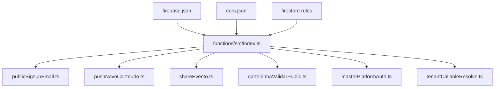
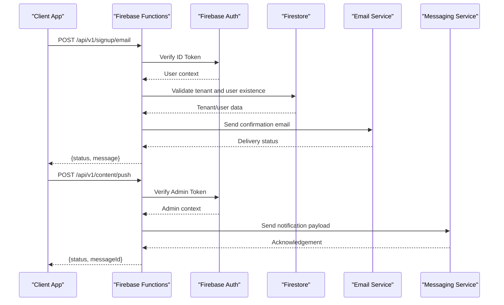
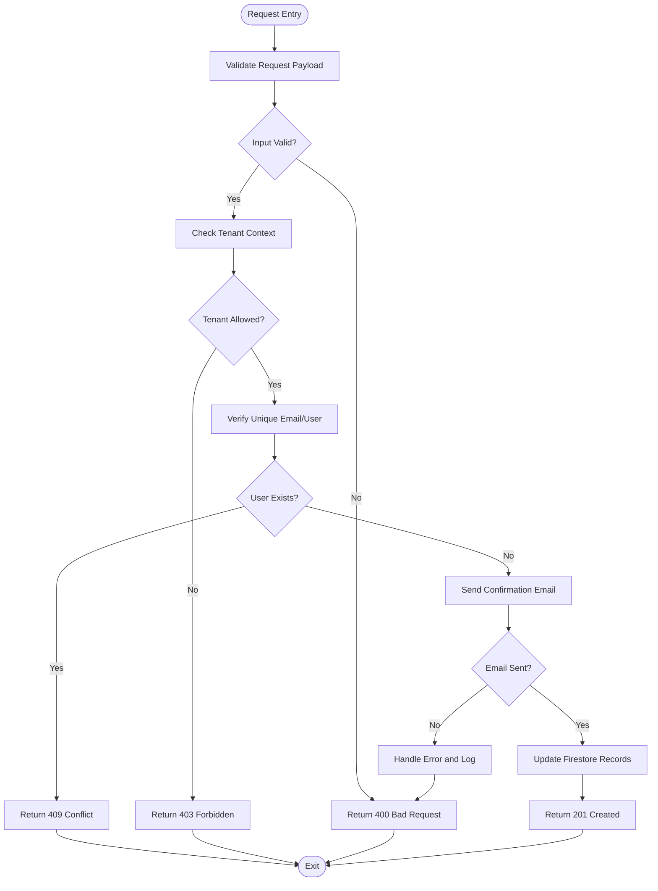
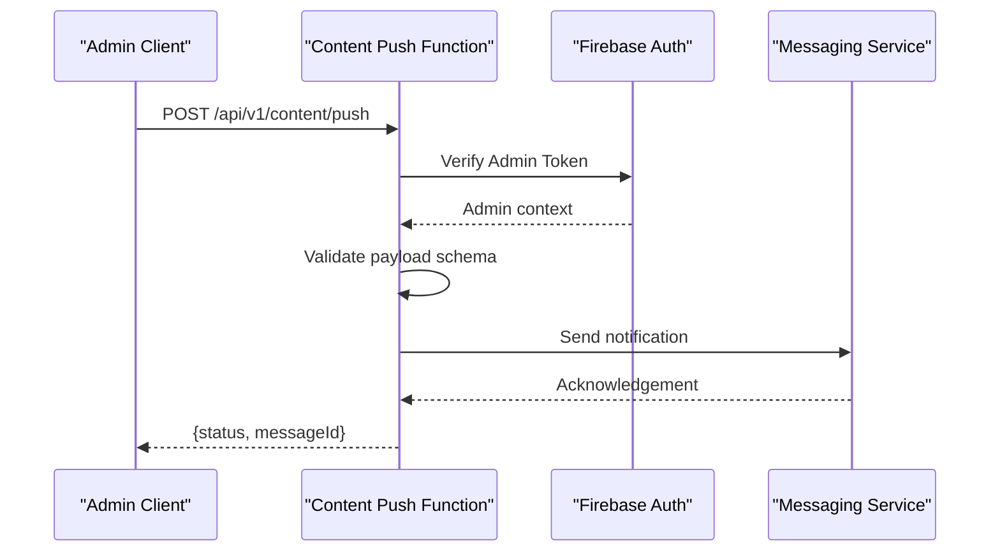
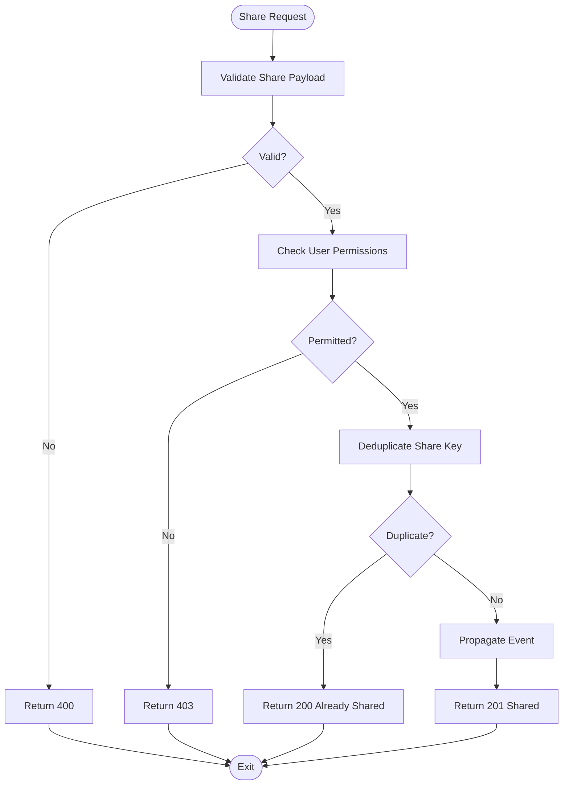
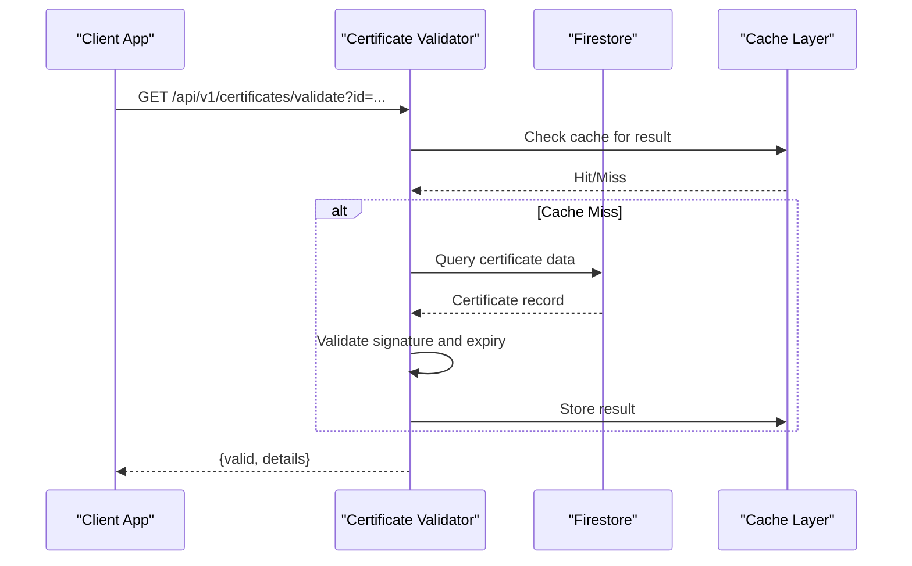
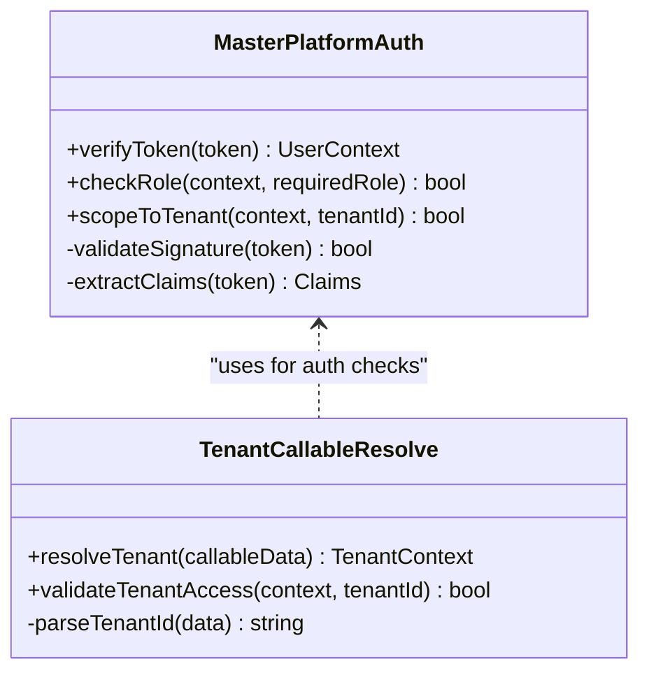
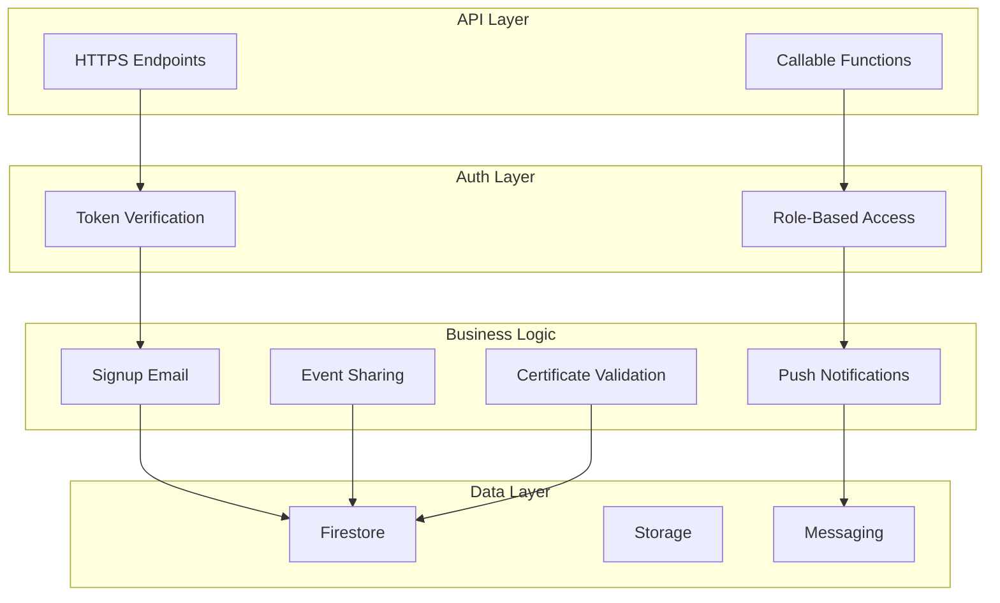
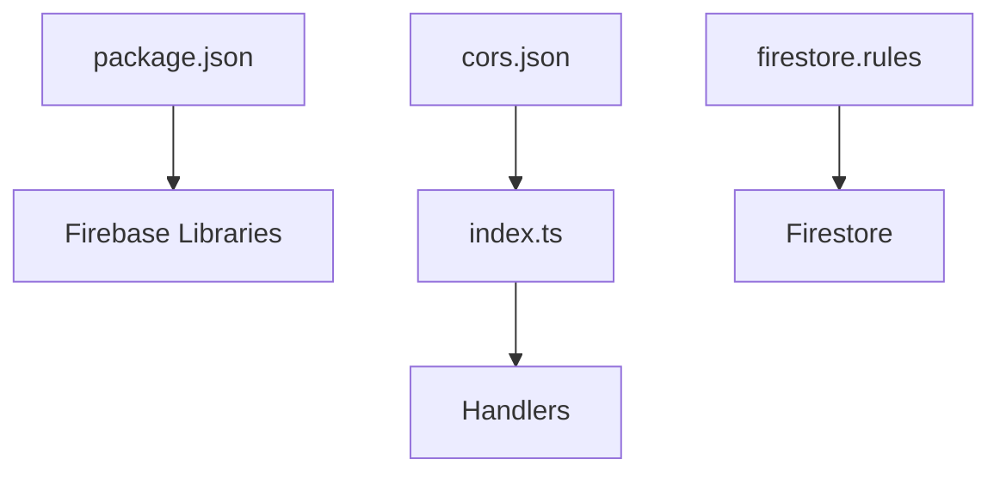

# API Endpoints & Webhooks

<cite>
**Referenced Files in This Document**
- [functions/src/index.ts](file://functions/src/index.ts)
- [functions/src/publicSignupEmail.ts](file://functions/src/publicSignupEmail.ts)
- [functions/src/pushNovoConteudo.ts](file://functions/src/pushNovoConteudo.ts)
- [functions/src/shareEvento.ts](file://functions/src/shareEvento.ts)
- [functions/src/carteirinhaValidarPublic.ts](file://functions/src/carteirinhaValidarPublic.ts)
- [functions/src/masterPlatformAuth.ts](file://functions/src/masterPlatformAuth.ts)
- [functions/src/tenantCallableResolve.ts](file://functions/src/tenantCallableResolve.ts)
- [functions/package.json](file://functions/package.json)
- [firebase.json](file://firebase.json)
- [cors.json](file://cors.json)
- [firestore.rules](file://firestore.rules)
</cite>

## Table of Contents
1. [Introduction](#introduction)
2. [Project Structure](#project-structure)
3. [Core Components](#core-components)
4. [Architecture Overview](#architecture-overview)
5. [Detailed Component Analysis](#detailed-component-analysis)
6. [Dependency Analysis](#dependency-analysis)
7. [Performance Considerations](#performance-considerations)
8. [Troubleshooting Guide](#troubleshooting-guide)
9. [Conclusion](#conclusion)
10. [Appendices](#appendices)

## Introduction
This document provides a comprehensive guide to the REST API endpoints and webhook handlers implemented as Firebase Cloud Functions. It explains HTTP request/response patterns, authentication methods, and security considerations across key services: public signup email processing, content push notifications, event sharing mechanisms, and certificate validation services. It also includes guidance on creating new endpoints, handling different HTTP methods, input validation, error responses, rate limiting, CORS configuration, API versioning, and testing strategies for webhooks.

## Project Structure
The cloud functions are organized under the functions directory with TypeScript sources compiled to JavaScript. The entry point registers all callable and HTTPS functions. Configuration files manage deployment, CORS policies, and Firestore rules.

**Diagram sources**
- [functions/src/index.ts](file://functions/src/index.ts)
- [functions/src/publicSignupEmail.ts](file://functions/src/publicSignupEmail.ts)
- [functions/src/pushNovoConteudo.ts](file://functions/src/pushNovoConteudo.ts)
- [functions/src/shareEvento.ts](file://functions/src/shareEvento.ts)
- [functions/src/carteirinhaValidarPublic.ts](file://functions/src/carteirinhaValidarPublic.ts)
- [functions/src/masterPlatformAuth.ts](file://functions/src/masterPlatformAuth.ts)
- [functions/src/tenantCallableResolve.ts](file://functions/src/tenantCallableResolve.ts)
- [firebase.json](file://firebase.json)
- [cors.json](file://cors.json)
- [firestore.rules](file://firestore.rules)

**Section sources**
- [functions/src/index.ts](file://functions/src/index.ts)
- [functions/package.json](file://functions/package.json)
- [firebase.json](file://firebase.json)
- [cors.json](file://cors.json)
- [firestore.rules](file://firestore.rules)

## Core Components
- Public Signup Email Handler: Processes user registration requests, validates inputs, triggers email delivery, and updates tenant-specific records.
- Content Push Notification Handler: Accepts content metadata and pushes notifications to targeted audiences.
- Event Sharing Mechanism: Handles event share requests, validates permissions, and propagates events across tenants or channels.
- Certificate Validation Service: Validates certificates (e.g., membership cards) against authoritative data stores and returns verification results.
- Platform Authentication Helper: Centralizes token verification and authorization checks for platform-level operations.
- Tenant Callable Resolver: Resolves tenant context and routes callable function calls based on tenant identifiers.

Key responsibilities include input validation, secure authentication, error handling, logging, and integration with Firebase services (Firestore, Storage, Messaging).

**Section sources**
- [functions/src/publicSignupEmail.ts](file://functions/src/publicSignupEmail.ts)
- [functions/src/pushNovoConteudo.ts](file://functions/src/pushNovoConteudo.ts)
- [functions/src/shareEvento.ts](file://functions/src/shareEvento.ts)
- [functions/src/carteirinhaValidarPublic.ts](file://functions/src/carteirinhaValidarPublic.ts)
- [functions/src/masterPlatformAuth.ts](file://functions/src/masterPlatformAuth.ts)
- [functions/src/tenantCallableResolve.ts](file://functions/src/tenantCallableResolve.ts)

## Architecture Overview
The system exposes both HTTPS endpoints and callable functions. HTTPS endpoints handle REST-style requests with explicit HTTP methods and headers. Callable functions leverage Firebase’s built-in authentication and payload parsing. Security is enforced via token verification and Firestore rules. CORS is configured to allow cross-origin requests from authorized domains.

**Diagram sources**
- [functions/src/index.ts](file://functions/src/index.ts)
- [functions/src/publicSignupEmail.ts](file://functions/src/publicSignupEmail.ts)
- [functions/src/pushNovoConteudo.ts](file://functions/src/pushNovoConteudo.ts)
- [functions/src/masterPlatformAuth.ts](file://functions/src/masterPlatformAuth.ts)

## Detailed Component Analysis

### Public Signup Email Endpoint
Handles user registration by validating inputs, checking tenant constraints, sending confirmation emails, and updating Firestore records.

**Diagram sources**
- [functions/src/publicSignupEmail.ts](file://functions/src/publicSignupEmail.ts)

**Section sources**
- [functions/src/publicSignupEmail.ts](file://functions/src/publicSignupEmail.ts)

### Content Push Notification Endpoint
Accepts content metadata and sends push notifications to targeted users or groups. Enforces admin-level authentication and validates payload structure.

**Diagram sources**
- [functions/src/pushNovoConteudo.ts](file://functions/src/pushNovoConteudo.ts)
- [functions/src/masterPlatformAuth.ts](file://functions/src/masterPlatformAuth.ts)

**Section sources**
- [functions/src/pushNovoConteudo.ts](file://functions/src/pushNovoConteudo.ts)
- [functions/src/masterPlatformAuth.ts](file://functions/src/masterPlatformAuth.ts)

### Event Sharing Mechanism
Processes event share requests, validates permissions, and propagates events across tenants or channels. Supports idempotency and audit logging.

**Diagram sources**
- [functions/src/shareEvento.ts](file://functions/src/shareEvento.ts)

**Section sources**
- [functions/src/shareEvento.ts](file://functions/src/shareEvento.ts)

### Certificate Validation Service
Validates certificates (e.g., membership cards) against authoritative data stores and returns verification results. Supports batch validation and caching.

**Diagram sources**
- [functions/src/carteirinhaValidarPublic.ts](file://functions/src/carteirinhaValidarPublic.ts)

**Section sources**
- [functions/src/carteirinhaValidarPublic.ts](file://functions/src/carteirinhaValidarPublic.ts)

### Platform Authentication Helper
Centralizes token verification and authorization checks for platform-level operations. Supports role-based access control and tenant scoping.

**Diagram sources**
- [functions/src/masterPlatformAuth.ts](file://functions/src/masterPlatformAuth.ts)
- [functions/src/tenantCallableResolve.ts](file://functions/src/tenantCallableResolve.ts)

**Section sources**
- [functions/src/masterPlatformAuth.ts](file://functions/src/masterPlatformAuth.ts)
- [functions/src/tenantCallableResolve.ts](file://functions/src/tenantCallableResolve.ts)

### Conceptual Overview
The architecture follows a modular design where each endpoint or handler encapsulates specific business logic. Authentication and authorization are centralized to ensure consistent security policies. Data flows are validated at each step, and errors are handled uniformly to provide clear feedback to clients.

[No sources needed since this diagram shows conceptual workflow, not actual code structure]

## Dependency Analysis
Cloud functions depend on Firebase libraries for authentication, database access, and messaging. External dependencies are managed via package.json. CORS configuration allows cross-origin requests from specified domains. Firestore rules enforce data access policies.

**Diagram sources**
- [functions/package.json](file://functions/package.json)
- [functions/src/index.ts](file://functions/src/index.ts)
- [cors.json](file://cors.json)
- [firestore.rules](file://firestore.rules)

**Section sources**
- [functions/package.json](file://functions/package.json)
- [firebase.json](file://firebase.json)
- [cors.json](file://cors.json)
- [firestore.rules](file://firestore.rules)

## Performance Considerations
- Use caching for frequently accessed data (e.g., certificate validation results).
- Implement idempotency for write operations to prevent duplicate processing.
- Optimize database queries by indexing relevant fields.
- Limit payload sizes and validate inputs early to reduce processing overhead.
- Leverage background tasks for long-running operations like email delivery.

[No sources needed since this section provides general guidance]

## Troubleshooting Guide
Common issues include invalid tokens, missing permissions, malformed payloads, and service unavailability. Logging should capture request IDs, user contexts, and error traces. Use structured logs for easier debugging and monitoring.

**Section sources**
- [functions/src/masterPlatformAuth.ts](file://functions/src/masterPlatformAuth.ts)
- [functions/src/publicSignupEmail.ts](file://functions/src/publicSignupEmail.ts)

## Conclusion
The cloud functions provide a robust set of APIs and webhooks for managing user registrations, content notifications, event sharing, and certificate validation. By following the outlined patterns for authentication, validation, and error handling, developers can extend the system securely and efficiently. Proper CORS configuration, API versioning, and testing strategies ensure reliability and maintainability.

[No sources needed since this section summarizes without analyzing specific files]

## Appendices

### Creating New Endpoints
- Define an HTTPS function in a new file under functions/src.
- Register the function in index.ts with appropriate path and method.
- Implement input validation, authentication, and business logic.
- Return standardized JSON responses with appropriate HTTP status codes.

### Handling Different HTTP Methods
- GET: Retrieve resources with query parameters.
- POST: Create new resources with JSON payloads.
- PUT/PATCH: Update existing resources with partial or full payloads.
- DELETE: Remove resources by ID or identifier.

### Input Validation
- Use schema validation libraries (e.g., Zod, Joi) to enforce payload structure.
- Sanitize inputs to prevent injection attacks.
- Provide clear error messages for invalid inputs.

### Error Responses
- Use standard HTTP status codes (400, 401, 403, 404, 409, 500).
- Include error codes and messages in JSON responses.
- Log detailed error information for debugging.

### Rate Limiting
- Implement rate limiting using Firebase Extensions or external services.
- Monitor usage patterns and adjust limits dynamically.
- Return 429 Too Many Requests when limits are exceeded.

### CORS Configuration
- Configure allowed origins, methods, and headers in cors.json.
- Ensure sensitive endpoints restrict CORS to trusted domains.
- Test CORS settings across browsers and platforms.

### API Versioning
- Prefix endpoints with version numbers (e.g., /api/v1/).
- Maintain backward compatibility when possible.
- Deprecate old versions with clear migration guides.

### Testing Strategies for Webhooks
- Use mock servers to simulate webhook payloads.
- Validate response codes and bodies.
- Test error scenarios and retry logic.
- Integrate with CI/CD pipelines for automated testing.