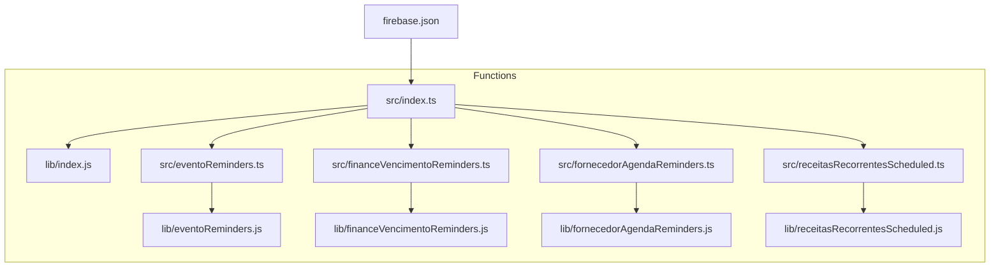
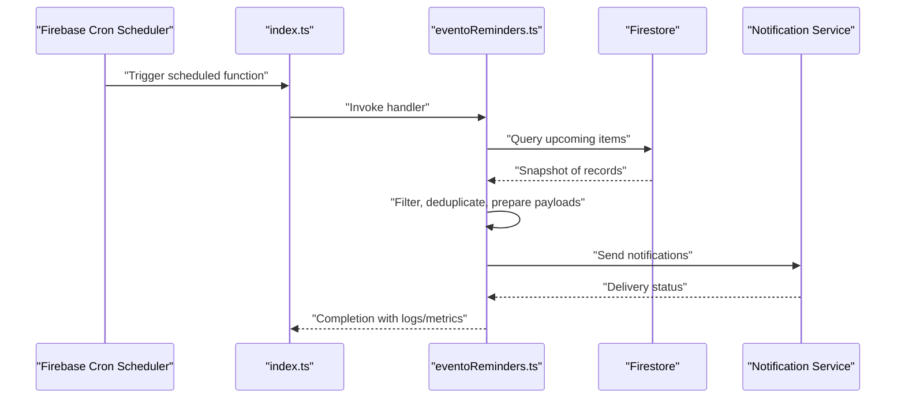
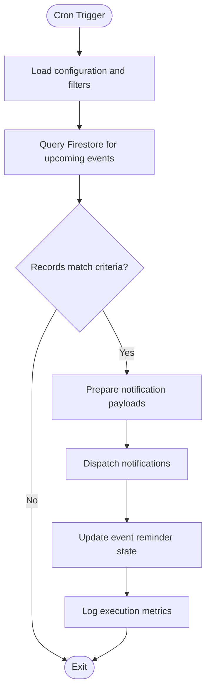
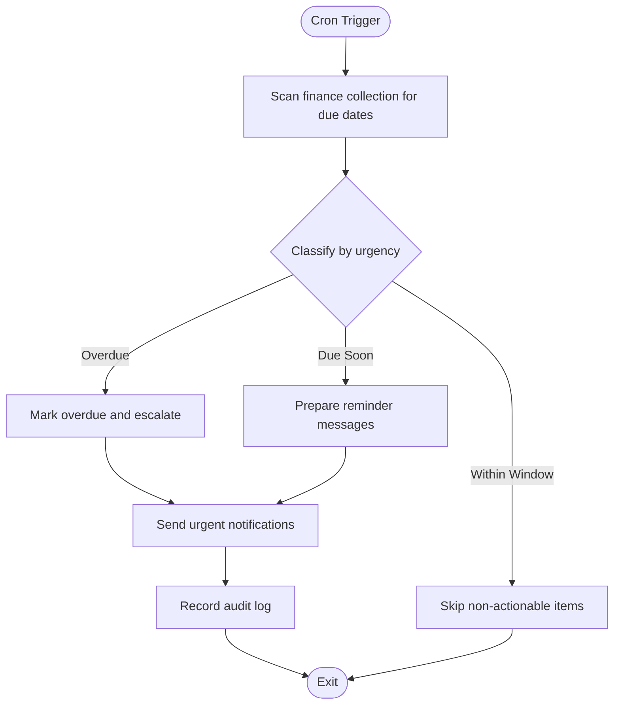
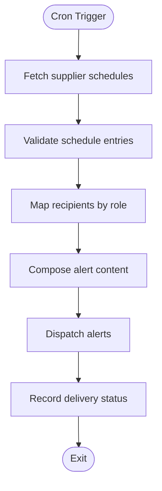
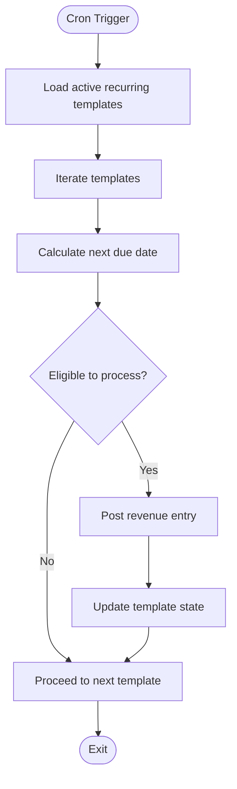
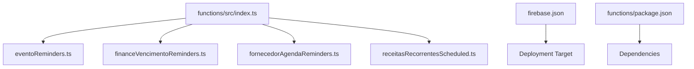

# Background Jobs & Scheduled Tasks

<cite>
**Referenced Files in This Document**
- [functions/src/index.ts](file://functions/src/index.ts)
- [functions/lib/index.js](file://functions/lib/index.js)
- [functions/package.json](file://functions/package.json)
- [firebase.json](file://firebase.json)
- [functions/src/eventoReminders.ts](file://functions/src/eventoReminders.ts)
- [functions/lib/eventoReminders.js](file://functions/lib/eventoReminders.js)
- [functions/src/financeVencimentoReminders.ts](file://functions/src/financeVencimentoReminders.ts)
- [functions/lib/financeVencimentoReminders.js](file://functions/lib/financeVencimentoReminders.js)
- [functions/src/fornecedorAgendaReminders.ts](file://functions/src/fornecedorAgendaReminders.ts)
- [functions/lib/fornecedorAgendaReminders.js](file://functions/lib/fornecedorAgendaReminders.js)
- [functions/src/receitasRecorrentesScheduled.ts](file://functions/src/receitasRecorrentesScheduled.ts)
- [functions/lib/receitasRecorrentesScheduled.js](file://functions/lib/receitasRecorrentesScheduled.js)
</cite>

## Table of Contents
1. [Introduction](#introduction)
2. [Project Structure](#project-structure)
3. [Core Components](#core-components)
4. [Architecture Overview](#architecture-overview)
5. [Detailed Component Analysis](#detailed-component-analysis)
6. [Dependency Analysis](#dependency-analysis)
7. [Performance Considerations](#performance-considerations)
8. [Troubleshooting Guide](#troubleshooting-guide)
9. [Conclusion](#conclusion)
10. [Appendices](#appendices)

## Introduction
This document explains how background jobs and scheduled tasks are implemented using Firebase Cloud Functions for the project. It focuses on cron-based scheduling, task queuing patterns, and job execution strategies across reminder systems (events, financial due dates, supplier schedules) and recurring revenue processing. It also covers setting up scheduled functions, handling failures, implementing retry logic, monitoring execution, scaling considerations, cost optimization for long-running jobs, and debugging techniques.

## Project Structure
The cloud functions are organized under the functions directory with TypeScript sources compiled to JavaScript outputs:
- Source files live in functions/src
- Compiled outputs live in functions/lib
- The entry point exports all scheduled and callable functions
- firebase.json configures hosting and functions deployment targets

**Diagram sources**
- [functions/src/index.ts](file://functions/src/index.ts)
- [functions/lib/index.js](file://functions/lib/index.js)
- [firebase.json](file://firebase.json)

**Section sources**
- [functions/src/index.ts](file://functions/src/index.ts)
- [functions/lib/index.js](file://functions/lib/index.js)
- [firebase.json](file://firebase.json)

## Core Components
The system implements four primary scheduled reminders and one recurring revenue processor:
- Event reminders: triggers periodic checks to notify upcoming events
- Financial due date reminders: scans for payments or obligations nearing due dates
- Supplier schedule reminders: alerts based on supplier delivery or service schedules
- Recurring revenue processing: automates generation and posting of recurring income entries

These components follow a consistent pattern:
- Cron-triggered entry points
- Querying relevant Firestore collections with tenant scoping
- Batch processing with idempotency markers
- Notification dispatch via messaging/email services
- Error logging and metrics emission

**Section sources**
- [functions/src/eventoReminders.ts](file://functions/src/eventoReminders.ts)
- [functions/src/financeVencimentoReminders.ts](file://functions/src/financeVencimentoReminders.ts)
- [functions/src/fornecedorAgendaReminders.ts](file://functions/src/fornecedorAgendaReminders.ts)
- [functions/src/receitasRecorrentesScheduled.ts](file://functions/src/receitasRecorrentesScheduled.ts)

## Architecture Overview
The scheduled tasks are orchestrated by Firebase Cloud Functions with cron triggers. Each function is responsible for a specific domain (events, finance, suppliers, recurring revenue). They read from Firestore, perform business logic, and write results back or trigger notifications.

**Diagram sources**
- [functions/src/index.ts](file://functions/src/index.ts)
- [functions/src/eventoReminders.ts](file://functions/src/eventoReminders.ts)

## Detailed Component Analysis

### Event Reminders
Purpose: Periodically scan event records to identify upcoming occurrences and send reminders to attendees or organizers.

Key behaviors:
- Cron-driven execution window
- Tenant-scoped queries to isolate data per church/tenant
- Idempotent updates using state fields to avoid duplicate notifications
- Batched notification dispatch to reduce API calls

**Diagram sources**
- [functions/src/eventoReminders.ts](file://functions/src/eventoReminders.ts)

**Section sources**
- [functions/src/eventoReminders.ts](file://functions/src/eventoReminders.ts)
- [functions/lib/eventoReminders.js](file://functions/lib/eventoReminders.js)

### Financial Due Date Reminders
Purpose: Monitor financial obligations and payment deadlines, generating reminders for overdue or soon-to-due items.

Key behaviors:
- Time-window scanning for due dates within a threshold
- Aggregation of outstanding balances and statuses
- Conditional branching based on payment rules and grace periods
- Integration with notification channels and audit logging

**Diagram sources**
- [functions/src/financeVencimentoReminders.ts](file://functions/src/financeVencimentoReminders.ts)

**Section sources**
- [functions/src/financeVencimentoReminders.ts](file://functions/src/financeVencimentoReminders.ts)
- [functions/lib/financeVencimentoReminders.js](file://functions/lib/financeVencimentoReminders.js)

### Supplier Schedule Reminders
Purpose: Alert stakeholders about upcoming supplier deliveries, services, or contract milestones.

Key behaviors:
- Query supplier schedules filtered by tenant and date range
- Deduplication to prevent repeated alerts
- Mapping of supplier roles to recipients
- Logging and error handling for failed dispatches

**Diagram sources**
- [functions/src/fornecedorAgendaReminders.ts](file://functions/src/fornecedorAgendaReminders.ts)

**Section sources**
- [functions/src/fornecedorAgendaReminders.ts](file://functions/src/fornecedorAgendaReminders.ts)
- [functions/lib/fornecedorAgendaReminders.js](file://functions/lib/fornecedorAgendaReminders.js)

### Recurring Revenue Processing
Purpose: Automate the creation and posting of recurring revenue entries according to predefined schedules.

Key behaviors:
- Iteration over recurring revenue templates
- Deterministic date calculations for next occurrence
- Idempotent posting using unique identifiers
- Error isolation per template to avoid cascading failures

**Diagram sources**
- [functions/src/receitasRecorrentesScheduled.ts](file://functions/src/receitasRecorrentesScheduled.ts)

**Section sources**
- [functions/src/receitasRecorrentesScheduled.ts](file://functions/src/receitasRecorrentesScheduled.ts)
- [functions/lib/receitasRecorrentesScheduled.js](file://functions/lib/receitasRecorrentesScheduled.js)

## Dependency Analysis
The functions depend on Firebase SDKs for Firestore and messaging, and they are deployed through firebase.json. The index file aggregates and exports scheduled functions.

**Diagram sources**
- [functions/src/index.ts](file://functions/src/index.ts)
- [firebase.json](file://firebase.json)
- [functions/package.json](file://functions/package.json)

**Section sources**
- [functions/src/index.ts](file://functions/src/index.ts)
- [firebase.json](file://firebase.json)
- [functions/package.json](file://functions/package.json)

## Performance Considerations
- Batch operations: Group Firestore reads/writes to minimize round trips and reduce costs
- Idempotency: Use stable IDs and state flags to avoid duplicate work and reprocessing
- Pagination: Process large datasets in chunks to respect function timeouts and memory limits
- Selective queries: Narrow query scopes by tenant and time windows to limit data volume
- Cold starts: Keep dependencies minimal and leverage pre-warming where appropriate
- Long-running jobs: Offload heavy tasks to background workers or queues when necessary

[No sources needed since this section provides general guidance]

## Troubleshooting Guide
Common issues and resolutions:
- Missing or incorrect cron configuration: Verify firebase.json and function definitions
- Permission errors: Ensure Firestore security rules allow reads/writes for service accounts
- Rate limiting: Implement backoff and retry policies for external APIs
- Data inconsistencies: Add validation and reconciliation steps; use audit logs
- Monitoring gaps: Emit structured logs and metrics; set up alerts for failure rates

Debugging tips:
- Inspect function logs in Google Cloud Console
- Use test harnesses to simulate cron triggers locally
- Add tracing spans around critical sections
- Validate tenant scoping and query filters

**Section sources**
- [functions/src/index.ts](file://functions/src/index.ts)
- [firebase.json](file://firebase.json)

## Conclusion
The background job and scheduled task system leverages Firebase Cloud Functions to automate reminders and recurring processes across events, finances, suppliers, and revenue. By following consistent patterns—cron triggers, tenant-scoped queries, idempotent updates, and robust logging—the system remains scalable, observable, and maintainable. Proper configuration, monitoring, and optimization ensure reliable operation and cost efficiency.

[No sources needed since this section summarizes without analyzing specific files]

## Appendices

### Setting Up Scheduled Functions
- Define cron expressions in firebase.json or function metadata
- Export handlers from index.ts with proper decorators
- Test locally using Firebase CLI emulators
- Deploy with firebase deploy --only functions

### Handling Job Failures and Retry Logic
- Implement exponential backoff for transient errors
- Use dead-letter queues for unrecoverable tasks
- Track retry counts and mark failed jobs for manual review

### Monitoring Job Execution
- Centralize logs with structured formats
- Emit custom metrics for success/failure rates and durations
- Set up dashboards and alerts for anomalies

### Scaling Considerations
- Partition workloads by tenant or region
- Use concurrency controls to avoid overload
- Profile and optimize database queries

### Cost Optimization for Long-Running Jobs
- Prefer streaming and incremental processing
- Cache frequently accessed data
- Reduce payload sizes and network calls

[No sources needed since this section provides general guidance]