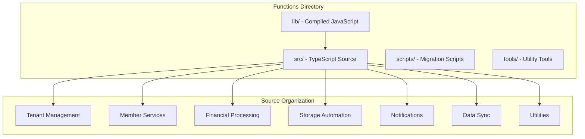
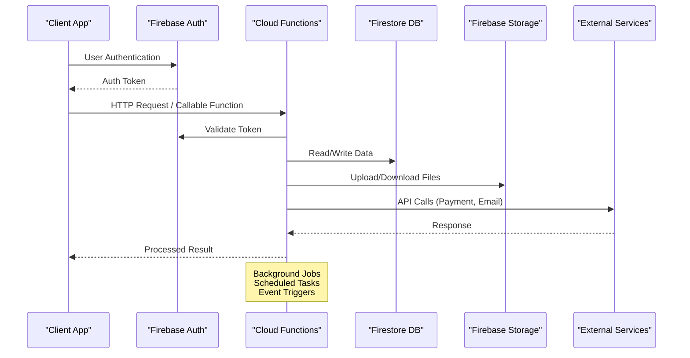
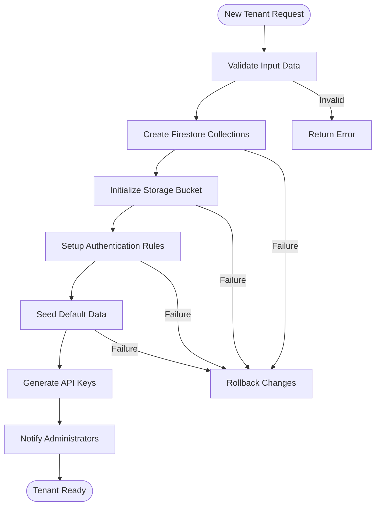
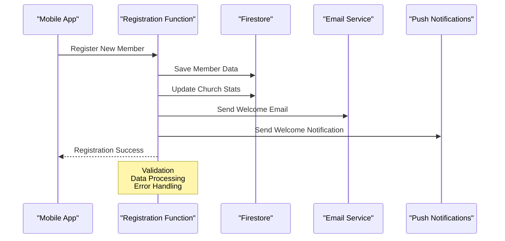
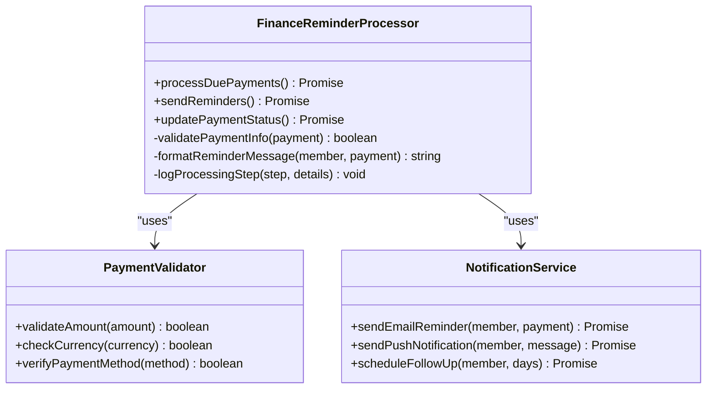
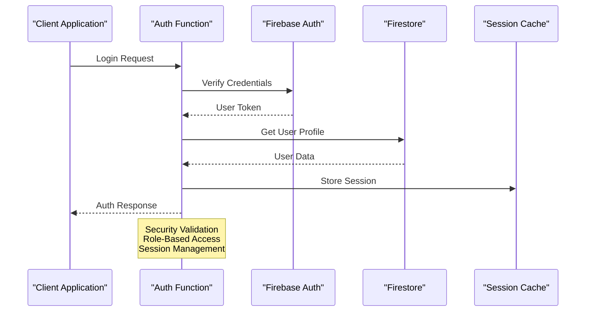
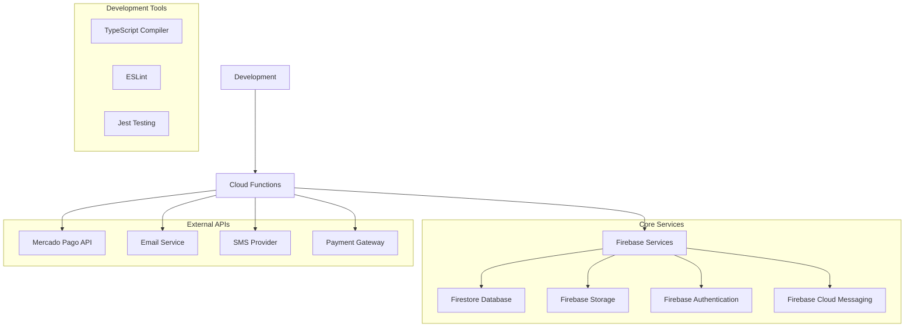
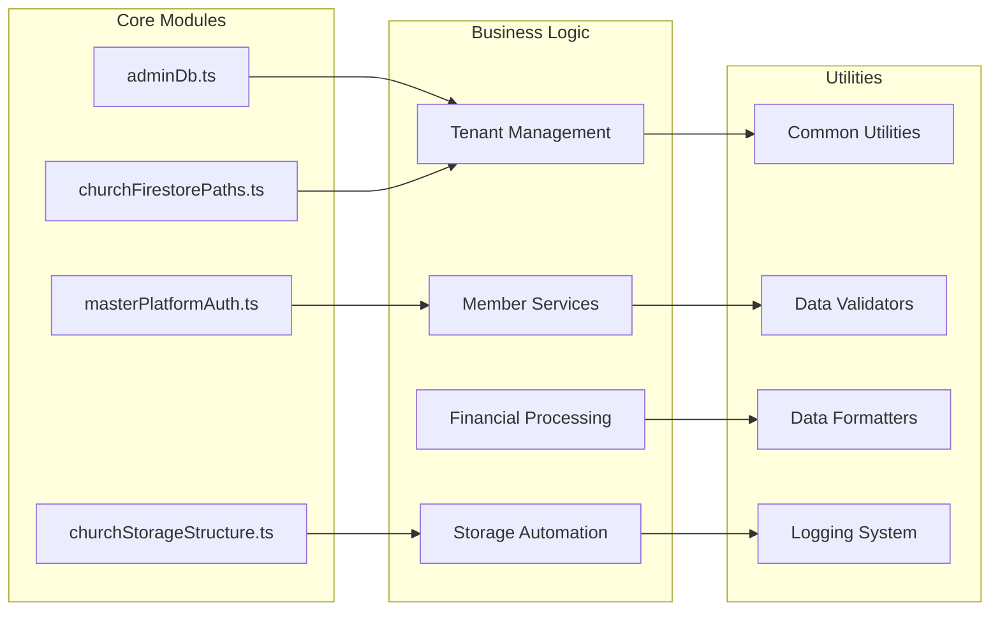

# Cloud Functions & Backend Services

<cite>
**Referenced Files in This Document**
- [functions/src/index.ts](file://functions/src/index.ts)
- [functions/package.json](file://functions/package.json)
- [firebase.json](file://firebase.json)
- [functions/tsconfig.json](file://functions/tsconfig.json)
- [firestore.rules](file://firestore.rules)
- [storage.rules](file://storage.rules)
- [functions/src/churchTenantProvisioning.ts](file://functions/src/churchTenantProvisioning.ts)
- [functions/src/memberRegistrationNotify.ts](file://functions/src/memberRegistrationNotify.ts)
- [functions/src/financeVencimentoReminders.ts](file://functions/src/financeVencimentoReminders.ts)
- [functions/src/eventoReminders.ts](file://functions/src/eventoReminders.ts)
- [functions/src/pushNovoConteudo.ts](file://functions/src/pushNovoConteudo.ts)
- [functions/src/storageCleanupOnFirestoreDelete.ts](file://functions/src/storageCleanupOnFirestoreDelete.ts)
- [functions/src/cleanupOrphanFiles.ts](file://functions/src/cleanupOrphanFiles.ts)
- [functions/src/masterPlatformAuth.ts](file://functions/src/masterPlatformAuth.ts)
- [functions/src/migrateTenantFirestoreCollections.ts](file://functions/src/migrateTenantFirestoreCollections.ts)
</cite>

## Table of Contents
1. [Introduction](#introduction)
2. [Project Structure](#project-structure)
3. [Core Components](#core-components)
4. [Architecture Overview](#architecture-overview)
5. [Detailed Component Analysis](#detailed-component-analysis)
6. [Dependency Analysis](#dependency-analysis)
7. [Performance Considerations](#performance-considerations)
8. [Troubleshooting Guide](#troubleshooting-guide)
9. [Conclusion](#conclusion)
9. [Appendices](#appendices)

## Introduction

The Gestão Yahweh Premium backend services are built using Google Cloud Functions (Firebase Functions) as a serverless architecture. This system provides scalable, event-driven processing for church management operations including member registration, financial reminders, content distribution, storage cleanup, and multi-tenant data synchronization.

The cloud functions architecture supports:
- **Multi-tenant church management** with isolated data per organization
- **Real-time notifications** via Firebase Cloud Messaging
- **Scheduled background jobs** for recurring tasks like payment reminders
- **Storage automation** for media processing and cleanup
- **External integrations** with payment processors and email services
- **Data synchronization** across multiple Firestore collections
- **Webhook handlers** for third-party service callbacks

## Project Structure

The cloud functions are organized in a TypeScript-based structure within the `functions` directory, following Firebase Functions best practices:

**Diagram sources**
- [functions/src/index.ts:1-50](file://functions/src/index.ts#L1-L50)
- [functions/package.json:1-30](file://functions/package.json#L1-L30)

**Section sources**
- [functions/src/index.ts:1-100](file://functions/src/index.ts#L1-L100)
- [functions/package.json:1-50](file://functions/package.json#L1-L50)

## Core Components

### Function Categories

The cloud functions are organized into several key categories:

#### 1. Tenant Management Functions
- **churchTenantProvisioning**: Automated setup of new church tenants
- **churchTenantConsolidation**: Data consolidation across tenant boundaries
- **churchTenantFields**: Field validation and backfill operations

#### 2. Member Services
- **memberRegistrationNotify**: Email notifications for new member registrations
- **memberAccessPolicy**: Access control validation
- **memberNotificationEmail**: Bulk email notification processing

#### 3. Financial Processing
- **financeVencimentoReminders**: Payment due date reminders
- **receitasRecorrentesScheduled**: Recurring revenue processing
- **churchMercadoPago**: Payment gateway integration

#### 4. Storage Automation
- **storageCleanupOnFirestoreDelete**: Automatic file cleanup when documents are deleted
- **cleanupOrphanFiles**: Cleanup of orphaned storage files
- **processChurchStorageMedia**: Media processing pipeline

#### 5. Notification System
- **pushNovoConteudo**: Push notifications for new content
- **eventoReminders**: Event reminder notifications
- **fornecedorAgendaReminders**: Vendor schedule reminders

#### 6. Data Synchronization
- **syncChurchClusterData**: Cross-collection data synchronization
- **migrateTenantFirestoreCollections**: Database migration utilities
- **consolidateBpcCluster**: Data consolidation operations

**Section sources**
- [functions/src/churchTenantProvisioning.ts:1-100](file://functions/src/churchTenantProvisioning.ts#L1-L100)
- [functions/src/memberRegistrationNotify.ts:1-80](file://functions/src/memberRegistrationNotify.ts#L1-L80)
- [functions/src/financeVencimentoReminders.ts:1-90](file://functions/src/financeVencimentoReminders.ts#L1-L90)

## Architecture Overview

The cloud functions architecture follows a modular, event-driven design pattern:

**Diagram sources**
- [functions/src/masterPlatformAuth.ts:1-100](file://functions/src/masterPlatformAuth.ts#L1-L100)
- [functions/src/churchTenantProvisioning.ts:1-150](file://functions/src/churchTenantProvisioning.ts#L1-L150)

### Function Types and Triggers

The system implements various function types:

1. **HTTP Functions**: REST API endpoints for external integrations
2. **Callable Functions**: Secure client-side function calls
3. **Firestore Triggers**: Real-time database event handlers
4. **Storage Triggers**: File upload/download event handlers
5. **Scheduled Functions**: Cron-based background processing
6. **Pub/Sub Functions**: Message queue processing

### Multi-Tenant Architecture

Each church organization operates as an isolated tenant with:
- Separate Firestore collections under tenant-specific paths
- Isolated storage buckets per organization
- Custom domain support for public sites
- Tenant-specific configuration and branding

**Section sources**
- [functions/src/churchTenantProvisioning.ts:1-200](file://functions/src/churchTenantProvisioning.ts#L1-L200)
- [functions/src/syncChurchClusterData.ts:1-120](file://functions/src/syncChurchClusterData.ts#L1-L120)

## Detailed Component Analysis

### Church Tenant Provisioning

The tenant provisioning system automates the setup of new church organizations:

**Diagram sources**
- [functions/src/churchTenantProvisioning.ts:1-250](file://functions/src/churchTenantProvisioning.ts#L1-L250)

**Section sources**
- [functions/src/churchTenantProvisioning.ts:1-300](file://functions/src/churchTenantProvisioning.ts#L1-L300)

### Member Registration Notification System

The member registration workflow includes automated notifications:

**Diagram sources**
- [functions/src/memberRegistrationNotify.ts:1-150](file://functions/src/memberRegistrationNotify.ts#L1-L150)

**Section sources**
- [functions/src/memberRegistrationNotify.ts:1-200](file://functions/src/memberRegistrationNotify.ts#L1-L200)

### Financial Reminder System

The payment reminder system processes recurring financial tasks:

**Diagram sources**
- [functions/src/financeVencimentoReminders.ts:1-200](file://functions/src/financeVencimentoReminders.ts#L1-L200)

**Section sources**
- [functions/src/financeVencimentoReminders.ts:1-250](file://functions/src/financeVencimentoReminders.ts#L1-L250)

### Storage Cleanup Automation

Automated storage cleanup prevents orphaned files and manages disk space:

**Diagram sources**
- [functions/src/storageCleanupOnFirestoreDelete.ts:1-150](file://functions/src/storageCleanupOnFirestoreDelete.ts#L1-L150)
- [functions/src/cleanupOrphanFiles.ts:1-120](file://functions/src/cleanupOrphanFiles.ts#L1-L120)

**Section sources**
- [functions/src/storageCleanupOnFirestoreDelete.ts:1-200](file://functions/src/storageCleanupOnFirestoreDelete.ts#L1-L200)
- [functions/src/cleanupOrphanFiles.ts:1-180](file://functions/src/cleanupOrphanFiles.ts#L1-L180)

### Platform Authentication

The master platform authentication system handles cross-platform user management:

**Diagram sources**
- [functions/src/masterPlatformAuth.ts:1-200](file://functions/src/masterPlatformAuth.ts#L1-L200)

**Section sources**
- [functions/src/masterPlatformAuth.ts:1-250](file://functions/src/masterPlatformAuth.ts#L1-L250)

## Dependency Analysis

### External Dependencies

The cloud functions rely on several key external services:

**Diagram sources**
- [functions/package.json:1-100](file://functions/package.json#L1-L100)

### Internal Module Dependencies

Functions are organized with clear separation of concerns:

**Diagram sources**
- [functions/src/index.ts:1-100](file://functions/src/index.ts#L1-L100)

**Section sources**
- [functions/package.json:1-150](file://functions/package.json#L1-L150)
- [functions/src/index.ts:1-200](file://functions/src/index.ts#L1-L200)

## Performance Considerations

### Function Optimization Strategies

1. **Cold Start Optimization**
   - Use connection pooling for database connections
   - Implement lazy loading for large dependencies
   - Optimize bundle size through tree shaking

2. **Memory Management**
   - Process large datasets in chunks
   - Implement proper error handling to prevent memory leaks
   - Use streaming for large file operations

3. **Database Query Optimization**
   - Use composite indexes for complex queries
   - Implement pagination for large result sets
   - Cache frequently accessed data

4. **Network Optimization**
   - Implement request caching for external APIs
   - Use retry logic with exponential backoff
   - Batch multiple API calls when possible

### Scaling Considerations

The serverless architecture automatically scales based on demand:
- **Horizontal scaling**: Functions scale out automatically
- **Resource allocation**: Dynamic CPU and memory allocation
- **Concurrency handling**: Parallel processing of independent requests
- **Cost optimization**: Pay only for actual usage time

### Monitoring and Observability

Key metrics to monitor:
- Function execution duration
- Memory usage patterns
- Error rates and types
- Cold start frequency
- Database query performance
- External API response times

**Section sources**
- [functions/src/churchPerformancePack.ts:1-100](file://functions/src/churchPerformancePack.ts#L1-L100)
- [functions/src/panelDashboardCache.ts:1-80](file://functions/src/panelDashboardCache.ts#L1-L80)

## Troubleshooting Guide

### Common Issues and Solutions

#### 1. Function Timeout Errors
- **Symptoms**: Function execution exceeds timeout limits
- **Solutions**: 
  - Break large operations into smaller chunks
  - Implement async processing for long-running tasks
  - Optimize database queries and add proper indexing

#### 2. Memory Limit Exceeded
- **Symptoms**: Functions crash due to insufficient memory
- **Solutions**:
  - Process data in streams instead of loading entire datasets
  - Implement proper garbage collection
  - Optimize data structures and reduce object creation

#### 3. Database Connection Issues
- **Symptoms**: Connection timeouts or pool exhaustion
- **Solutions**:
  - Implement connection pooling
  - Add retry logic with exponential backoff
  - Monitor connection usage and optimize query patterns

#### 4. External API Failures
- **Symptoms**: Third-party service errors or timeouts
- **Solutions**:
  - Implement circuit breaker patterns
  - Add fallback mechanisms
  - Log detailed error information for debugging

### Debugging Techniques

1. **Structured Logging**
   - Use consistent log formats
   - Include correlation IDs for request tracing
   - Implement log levels (debug, info, warn, error)

2. **Error Tracking**
   - Centralized error reporting
   - Stack trace analysis
   - User context preservation

3. **Performance Profiling**
   - Function execution timing
   - Memory usage monitoring
   - Database query profiling

**Section sources**
- [functions/src/adminDb.ts:1-100](file://functions/src/adminDb.ts#L1-L100)
- [functions/src/reportsSnapshot.ts:1-80](file://functions/src/reportsSnapshot.ts#L1-L80)

## Conclusion

The Gestão Yahweh Premium cloud functions architecture provides a robust, scalable foundation for church management operations. The modular design, comprehensive error handling, and performance optimizations ensure reliable operation at scale.

Key strengths of the implementation include:
- **Multi-tenant isolation** for secure data separation
- **Comprehensive automation** for routine administrative tasks
- **Robust error handling** and logging for operational visibility
- **Scalable architecture** that adapts to varying workloads
- **Extensible design** supporting future feature additions

The system successfully balances complexity with maintainability, providing a solid foundation for ongoing development and expansion of church management capabilities.

## Appendices

### A. Function Deployment Checklist

1. **Pre-deployment Validation**
   - TypeScript compilation successful
   - Unit tests passing
   - Integration tests completed
   - Security rules updated

2. **Deployment Process**
   - Environment variables configured
   - Database migrations executed
   - Cache cleared if necessary
   - Monitoring alerts configured

3. **Post-deployment Verification**
   - Function health checks passing
   - Error rates within acceptable limits
   - Performance metrics normal
   - User-facing functionality verified

### B. Development Best Practices

1. **Code Organization**
   - Single responsibility principle
   - Clear module boundaries
   - Consistent naming conventions
   - Comprehensive documentation

2. **Testing Strategy**
   - Unit tests for business logic
   - Integration tests for external dependencies
   - End-to-end tests for critical workflows
   - Performance testing for scalability

3. **Security Considerations**
   - Input validation and sanitization
   - Proper authentication and authorization
   - Secure secret management
   - Regular security audits

**Section sources**
- [functions/scripts/README-bulk-member-auth.md:1-50](file://functions/scripts/README-bulk-member-auth.md#L1-L50)
- [functions/tools/backfill_church_tenant_fields.cjs:1-100](file://functions/tools/backfill_church_tenant_fields.cjs#L1-L100)