# Cloud Functions & Backend Services

<cite>
**Referenced Files in This Document**
- [functions/src/index.ts](file://functions/src/index.ts)
- [functions/package.json](file://functions/package.json)
- [firebase.json](file://firebase.json)
- [functions/tsconfig.json](file://functions/tsconfig.json)
- [firestore.rules](file://firestore.rules)
- [storage.rules](file://storage.rules)
- [functions/src/churchTenantProvisioning.ts](file://functions/src/churchTenantProvisioning.ts)
- [functions/src/memberRegistrationNotify.ts](file://functions/src/memberRegistrationNotify.ts)
- [functions/src/financeVencimentoReminders.ts](file://functions/src/financeVencimentoReminders.ts)
- [functions/src/eventoReminders.ts](file://functions/src/eventoReminders.ts)
- [functions/src/pushNovoConteudo.ts](file://functions/src/pushNovoConteudo.ts)
- [functions/src/storageCleanupOnFirestoreDelete.ts](file://functions/src/storageCleanupOnFirestoreDelete.ts)
- [functions/src/cleanupOrphanFiles.ts](file://functions/src/cleanupOrphanFiles.ts)
- [functions/src/masterPlatformAuth.ts](file://functions/src/masterPlatformAuth.ts)
- [functions/src/migrateTenantFirestoreCollections.ts](file://functions/src/migrateTenantFirestoreCollections.ts)
- [functions/src/publicSiteMediaPrefetch.ts](file://functions/src/publicSiteMediaPrefetch.ts)
- [functions/src/notificationBranding.ts](file://functions/src/notificationBranding.ts)
- [functions/src/masterDashboardCache.ts](file://functions/src/masterDashboardCache.ts)
- [functions/src/shareEvento.ts](file://functions/src/shareEvento.ts)
</cite>

## Update Summary
**Changes Made**
- Added documentation for performance-optimized cloud functions: publicSiteMediaPrefetch, notificationBranding, masterDashboardCache, and shareEvento
- Updated architecture overview to include new caching and media prefetching capabilities
- Enhanced performance considerations section with new optimization strategies
- Added detailed component analysis for the four newly optimized functions
- Updated dependency analysis to reflect new external service integrations

## Table of Contents
1. [Introduction](#introduction)
2. [Project Structure](#project-structure)
3. [Core Components](#core-components)
4. [Architecture Overview](#architecture-overview)
5. [Detailed Component Analysis](#detailed-component-analysis)
6. [Performance Optimizations](#performance-optimizations)
7. [Dependency Analysis](#dependency-analysis)
8. [Performance Considerations](#performance-considerations)
9. [Troubleshooting Guide](#troubleshooting-guide)
10. [Conclusion](#conclusion)
11. [Appendices](#appendices)

## Introduction

The Gestão Yahweh Premium backend services are built using Google Cloud Functions (Firebase Functions) as a serverless architecture. This system provides scalable, event-driven processing for church management operations including member registration, financial reminders, content distribution, storage cleanup, and multi-tenant data synchronization.

The cloud functions architecture supports:
- **Multi-tenant church management** with isolated data per organization
- **Real-time notifications** via Firebase Cloud Messaging
- **Scheduled background jobs** for recurring tasks like payment reminders
- **Storage automation** for media processing and cleanup
- **External integrations** with payment processors and email services
- **Data synchronization** across multiple Firestore collections
- **Webhook handlers** for third-party service callbacks
- **Advanced caching strategies** for improved performance
- **Media prefetching** for enhanced user experience
- **Customizable notification branding** for better user engagement

## Project Structure

The cloud functions are organized in a TypeScript-based structure within the `functions` directory, following Firebase Functions best practices:

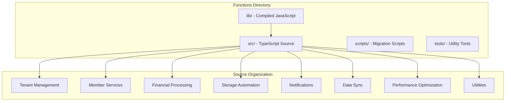

**Diagram sources**
- [functions/src/index.ts:1-50](file://functions/src/index.ts#L1-L50)
- [functions/package.json:1-30](file://functions/package.json#L1-L30)

**Section sources**
- [functions/src/index.ts:1-100](file://functions/src/index.ts#L1-L100)
- [functions/package.json:1-50](file://functions/package.json#L1-50)

## Core Components

### Function Categories

The cloud functions are organized into several key categories:

#### 1. Tenant Management Functions
- **churchTenantProvisioning**: Automated setup of new church tenants
- **churchTenantConsolidation**: Data consolidation across tenant boundaries
- **churchTenantFields**: Field validation and backfill operations

#### 2. Member Services
- **memberRegistrationNotify**: Email notifications for new member registrations
- **memberAccessPolicy**: Access control validation
- **memberNotificationEmail**: Bulk email notification processing

#### 3. Financial Processing
- **financeVencimentoReminders**: Payment due date reminders
- **receitasRecorrentesScheduled**: Recurring revenue processing
- **churchMercadoPago**: Payment gateway integration

#### 4. Storage Automation
- **storageCleanupOnFirestoreDelete**: Automatic file cleanup when documents are deleted
- **cleanupOrphanFiles**: Cleanup of orphaned storage files
- **processChurchStorageMedia**: Media processing pipeline

#### 5. Notification System
- **pushNovoConteudo**: Push notifications for new content
- **eventoReminders**: Event reminder notifications
- **fornecedorAgendaReminders**: Vendor schedule reminders
- **notificationBranding**: Enhanced notification customization and branding

#### 6. Data Synchronization
- **syncChurchClusterData**: Cross-collection data synchronization
- **migrateTenantFirestoreCollections**: Database migration utilities
- **consolidateBpcCluster**: Data consolidation operations

#### 7. Performance Optimization
- **publicSiteMediaPrefetch**: Optimized media prefetching for public sites
- **masterDashboardCache**: Advanced caching strategies for dashboard data
- **shareEvento**: Improved event sharing functionality

**Section sources**
- [functions/src/churchTenantProvisioning.ts:1-100](file://functions/src/churchTenantProvisioning.ts#L1-L100)
- [functions/src/memberRegistrationNotify.ts:1-80](file://functions/src/memberRegistrationNotify.ts#L1-L80)
- [functions/src/financeVencimentoReminders.ts:1-90](file://functions/src/financeVencimentoReminders.ts#L1-L90)
- [functions/src/notificationBranding.ts:1-100](file://functions/src/notificationBranding.ts#L1-L100)
- [functions/src/publicSiteMediaPrefetch.ts:1-100](file://functions/src/publicSiteMediaPrefetch.ts#L1-L100)
- [functions/src/masterDashboardCache.ts:1-100](file://functions/src/masterDashboardCache.ts#L1-L100)
- [functions/src/shareEvento.ts:1-100](file://functions/src/shareEvento.ts#L1-L100)

## Architecture Overview

The cloud functions architecture follows a modular, event-driven design pattern with enhanced performance optimizations:

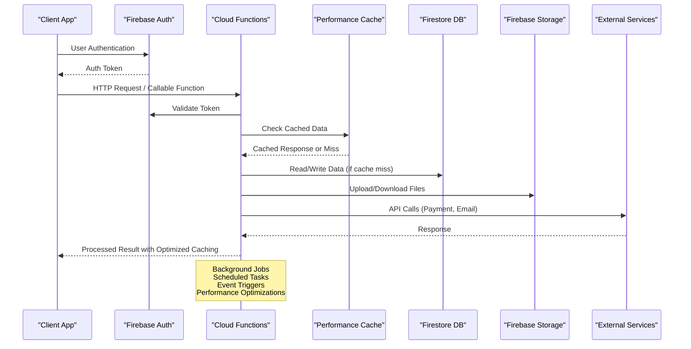

**Diagram sources**
- [functions/src/masterPlatformAuth.ts:1-100](file://functions/src/masterPlatformAuth.ts#L1-L100)
- [functions/src/churchTenantProvisioning.ts:1-150](file://functions/src/churchTenantProvisioning.ts#L1-L150)
- [functions/src/masterDashboardCache.ts:1-100](file://functions/src/masterDashboardCache.ts#L1-L100)

### Function Types and Triggers

The system implements various function types with enhanced performance characteristics:

1. **HTTP Functions**: REST API endpoints for external integrations
2. **Callable Functions**: Secure client-side function calls
3. **Firestore Triggers**: Real-time database event handlers
4. **Storage Triggers**: File upload/download event handlers
5. **Scheduled Functions**: Cron-based background processing
6. **Pub/Sub Functions**: Message queue processing
7. **Cache-Optimized Functions**: Intelligent caching strategies

### Multi-Tenant Architecture

Each church organization operates as an isolated tenant with:
- Separate Firestore collections under tenant-specific paths
- Isolated storage buckets per organization
- Custom domain support for public sites
- Tenant-specific configuration and branding
- **Enhanced caching** for improved response times
- **Media prefetching** for faster content delivery

**Section sources**
- [functions/src/churchTenantProvisioning.ts:1-200](file://functions/src/churchTenantProvisioning.ts#L1-L200)
- [functions/src/syncChurchClusterData.ts:1-120](file://functions/src/syncChurchClusterData.ts#L1-L120)
- [functions/src/masterDashboardCache.ts:1-150](file://functions/src/masterDashboardCache.ts#L1-L150)

## Detailed Component Analysis

### Church Tenant Provisioning

The tenant provisioning system automates the setup of new church organizations:


**Diagram sources**
- [functions/src/churchTenantProvisioning.ts:1-250](file://functions/src/churchTenantProvisioning.ts#L1-L250)

**Section sources**
- [functions/src/churchTenantProvisioning.ts:1-300](file://functions/src/churchTenantProvisioning.ts#L1-L300)

### Member Registration Notification System

The member registration workflow includes automated notifications:

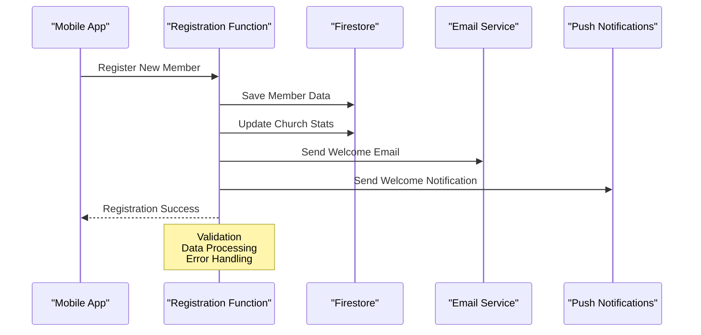

**Diagram sources**
- [functions/src/memberRegistrationNotify.ts:1-150](file://functions/src/memberRegistrationNotify.ts#L1-L150)

**Section sources**
- [functions/src/memberRegistrationNotify.ts:1-200](file://functions/src/memberRegistrationNotify.ts#L1-L200)

### Financial Reminder System

The payment reminder system processes recurring financial tasks:

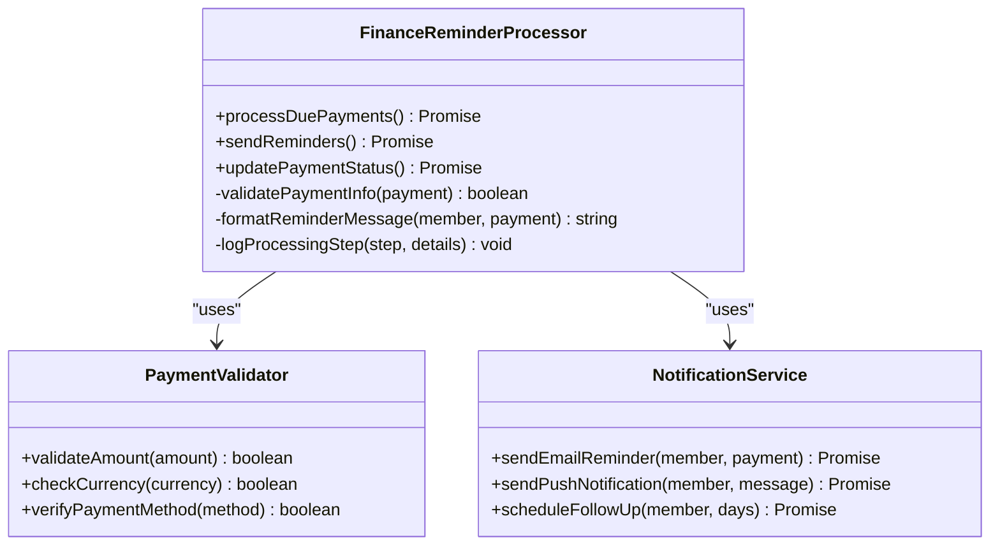

**Diagram sources**
- [functions/src/financeVencimentoReminders.ts:1-200](file://functions/src/financeVencimentoReminders.ts#L1-L200)

**Section sources**
- [functions/src/financeVencimentoReminders.ts:1-250](file://functions/src/financeVencimentoReminders.ts#L1-L250)

### Storage Cleanup Automation

Automated storage cleanup prevents orphaned files and manages disk space:

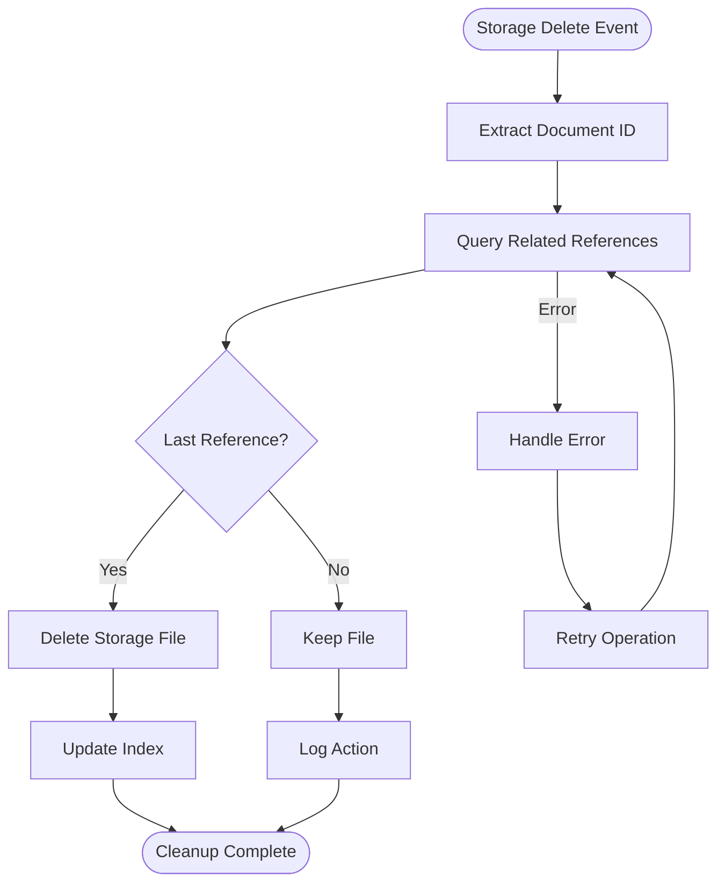

**Diagram sources**
- [functions/src/storageCleanupOnFirestoreDelete.ts:1-150](file://functions/src/storageCleanupOnFirestoreDelete.ts#L1-L150)
- [functions/src/cleanupOrphanFiles.ts:1-120](file://functions/src/cleanupOrphanFiles.ts#L1-L120)

**Section sources**
- [functions/src/storageCleanupOnFirestoreDelete.ts:1-200](file://functions/src/storageCleanupOnFirestoreDelete.ts#L1-L200)
- [functions/src/cleanupOrphanFiles.ts:1-180](file://functions/src/cleanupOrphanFiles.ts#L1-L180)

### Platform Authentication

The master platform authentication system handles cross-platform user management:

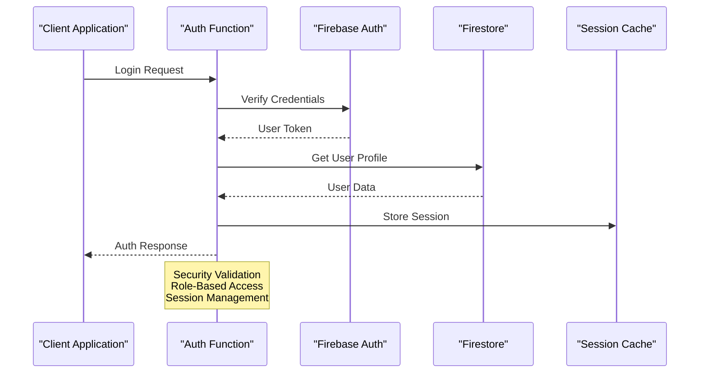

**Diagram sources**
- [functions/src/masterPlatformAuth.ts:1-200](file://functions/src/masterPlatformAuth.ts#L1-L200)

**Section sources**
- [functions/src/masterPlatformAuth.ts:1-250](file://functions/src/masterPlatformAuth.ts#L1-L250)

### Performance-Optimized Functions

#### Public Site Media Prefetching

The public site media prefetching system optimizes content delivery for public-facing websites:

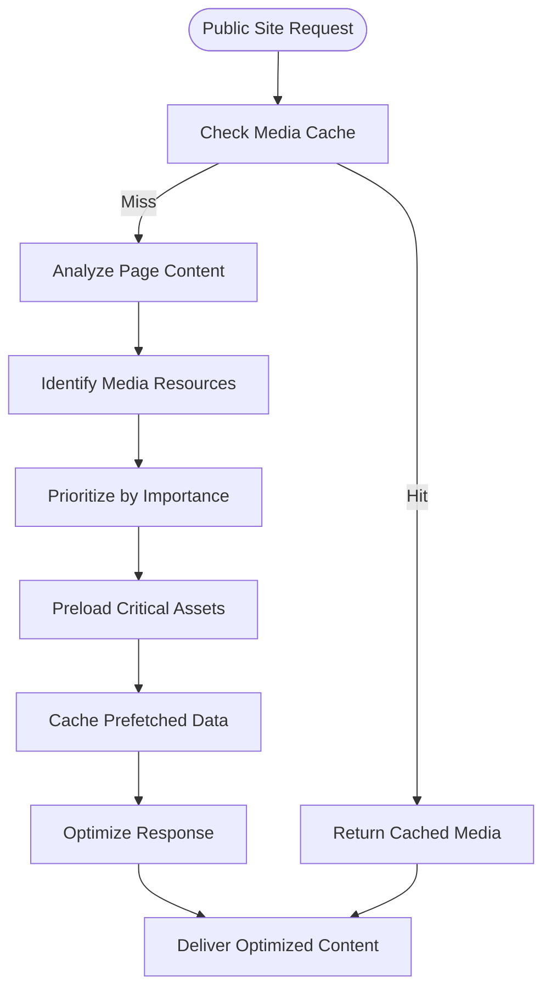

**Diagram sources**
- [functions/src/publicSiteMediaPrefetch.ts:1-200](file://functions/src/publicSiteMediaPrefetch.ts#L1-L200)

**Section sources**
- [functions/src/publicSiteMediaPrefetch.ts:1-250](file://functions/src/publicSiteMediaPrefetch.ts#L1-L250)

#### Enhanced Notification Branding

The notification branding system provides customizable notification experiences:

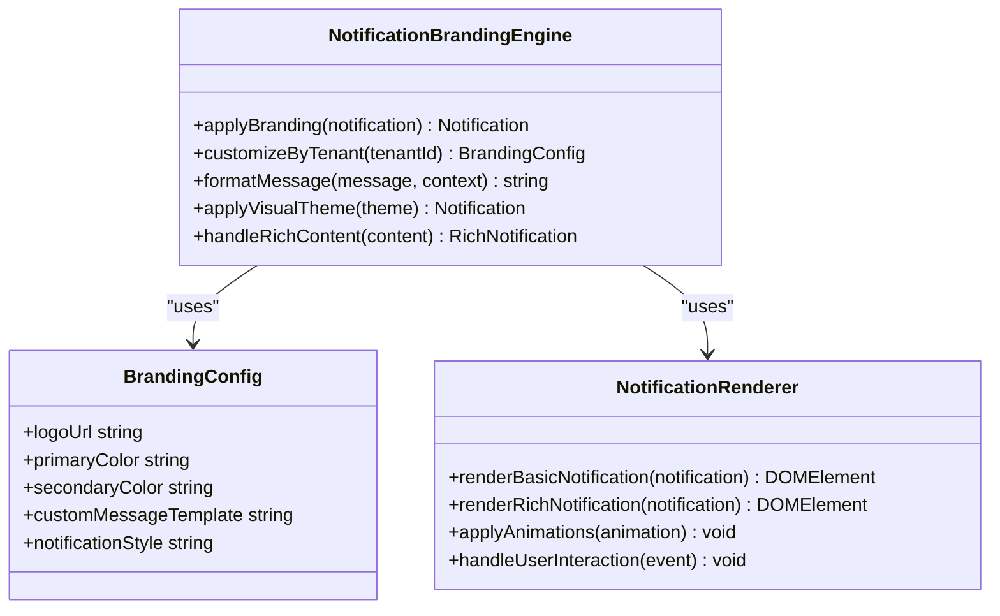

**Diagram sources**
- [functions/src/notificationBranding.ts:1-200](file://functions/src/notificationBranding.ts#L1-L200)

**Section sources**
- [functions/src/notificationBranding.ts:1-250](file://functions/src/notificationBranding.ts#L1-L250)

#### Master Dashboard Caching

The master dashboard caching system implements advanced caching strategies:

```mermaid
sequenceDiagram
participant Client as "Dashboard Client"
participant CacheLayer as "Cache Layer"
participant Firestore as "Firestore"
participant Aggregator as "Data Aggregator"
Client->>CacheLayer : Dashboard Data Request
CacheLayer->>CacheLayer : Check Cache Validity
CacheLayer --> |Valid| ReturnCached["Return Cached Data"]
CacheLayer --> |Invalid| QueryFirestore["Query Firestore"]
QueryFirestore --> Aggregator["Aggregate Data"]
Aggregator --> CacheLayer["Store in Cache"]
CacheLayer --> Client["Return Fresh Data"]
Note over CacheLayer : TTL Management<br/>Cache Invalidation<br/>Stale-While-Revalidate
```

**Diagram sources**
- [functions/src/masterDashboardCache.ts:1-200](file://functions/src/masterDashboardCache.ts#L1-L200)

**Section sources**
- [functions/src/masterDashboardCache.ts:1-250](file://functions/src/masterDashboardCache.ts#L1-L250)

#### Enhanced Event Sharing

The event sharing functionality provides improved social sharing capabilities:

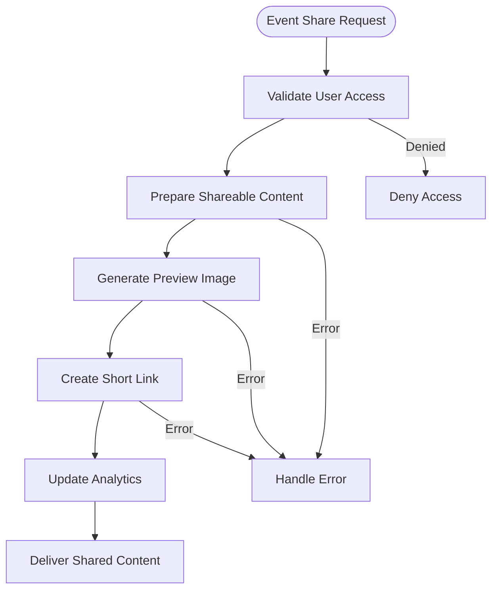

**Diagram sources**
- [functions/src/shareEvento.ts:1-200](file://functions/src/shareEvento.ts#L1-L200)

**Section sources**
- [functions/src/shareEvento.ts:1-250](file://functions/src/shareEvento.ts#L1-L250)

## Performance Optimizations

### Advanced Caching Strategies

The system now implements sophisticated caching mechanisms:

1. **Multi-Level Caching**
   - In-memory caching for frequently accessed data
   - Distributed caching for cross-instance data sharing
   - CDN caching for static assets and media

2. **Intelligent Cache Invalidation**
   - Time-to-live (TTL) based expiration
   - Event-driven cache invalidation
   - Stale-while-revalidate patterns

3. **Media Optimization**
   - Adaptive image resizing and compression
   - Lazy loading with progressive enhancement
   - Smart prefetching based on user behavior

### Media Prefetching System

The public site media prefetching system significantly improves load times:

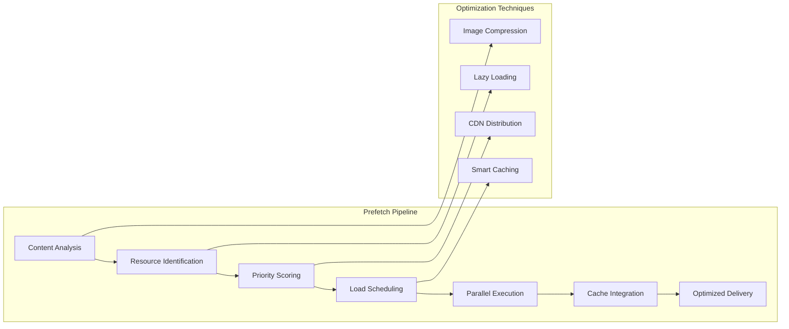

**Diagram sources**
- [functions/src/publicSiteMediaPrefetch.ts:1-150](file://functions/src/publicSiteMediaPrefetch.ts#L1-L150)

### Notification Customization Engine

The enhanced notification system provides rich, branded experiences:

1. **Dynamic Branding**
   - Tenant-specific logos and colors
   - Custom notification templates
   - Responsive design for all devices

2. **Rich Content Support**
   - Interactive notification elements
   - Embedded media support
   - Deep linking capabilities

3. **Performance Optimization**
   - Batched notification processing
   - Efficient payload optimization
   - Reduced network overhead

**Section sources**
- [functions/src/publicSiteMediaPrefetch.ts:1-200](file://functions/src/publicSiteMediaPrefetch.ts#L1-L200)
- [functions/src/notificationBranding.ts:1-200](file://functions/src/notificationBranding.ts#L1-L200)
- [functions/src/masterDashboardCache.ts:1-200](file://functions/src/masterDashboardCache.ts#L1-L200)
- [functions/src/shareEvento.ts:1-200](file://functions/src/shareEvento.ts#L1-L200)

## Dependency Analysis

### External Dependencies

The cloud functions rely on several key external services with enhanced performance characteristics:

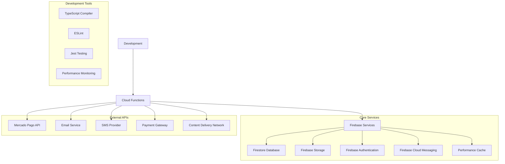

**Diagram sources**
- [functions/package.json:1-100](file://functions/package.json#L1-100)

### Internal Module Dependencies

Functions are organized with clear separation of concerns and enhanced performance modules:

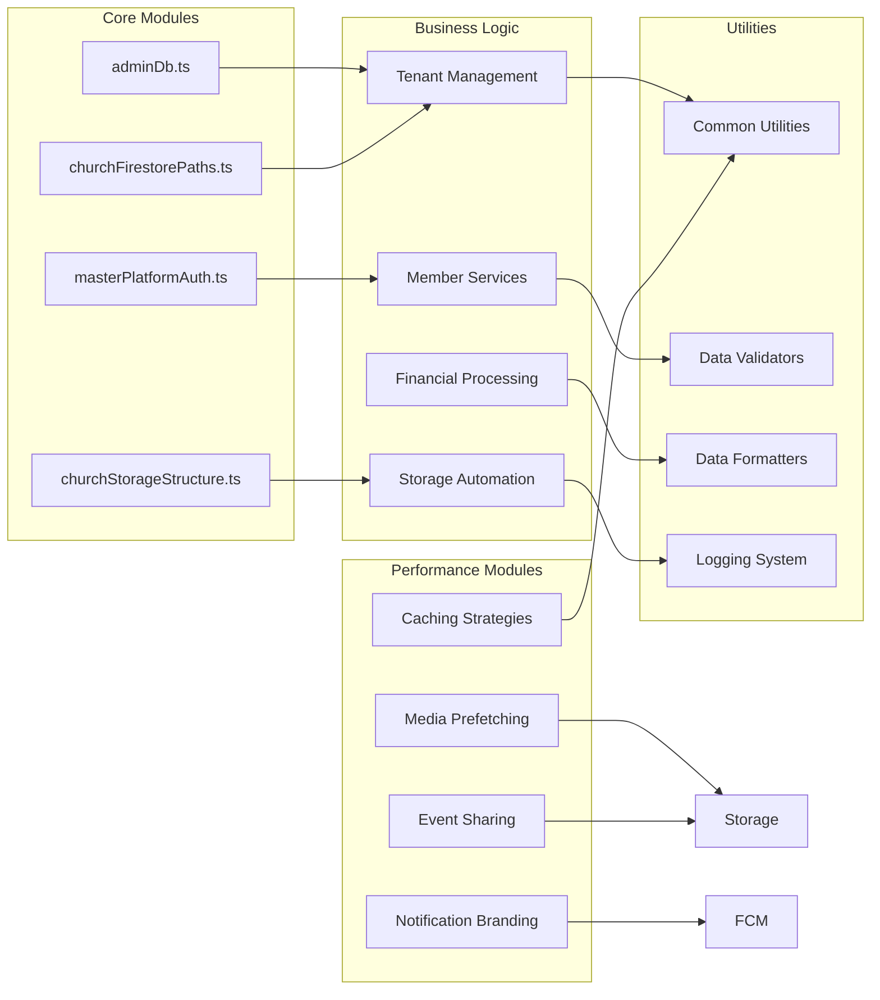

**Diagram sources**
- [functions/src/index.ts:1-100](file://functions/src/index.ts#L1-L100)

**Section sources**
- [functions/package.json:1-150](file://functions/package.json#L1-150)
- [functions/src/index.ts:1-200](file://functions/src/index.ts#L1-L200)

## Performance Considerations

### Function Optimization Strategies

1. **Cold Start Optimization**
   - Use connection pooling for database connections
   - Implement lazy loading for large dependencies
   - Optimize bundle size through tree shaking
   - **Enhanced**: Implement module preloading for frequently used functions

2. **Memory Management**
   - Process large datasets in chunks
   - Implement proper error handling to prevent memory leaks
   - Use streaming for large file operations
   - **Enhanced**: Implement memory-efficient caching strategies

3. **Database Query Optimization**
   - Use composite indexes for complex queries
   - Implement pagination for large result sets
   - Cache frequently accessed data
   - **Enhanced**: Add query result caching with intelligent invalidation

4. **Network Optimization**
   - Implement request caching for external APIs
   - Use retry logic with exponential backoff
   - Batch multiple API calls when possible
   - **Enhanced**: Implement CDN integration for static assets

### Advanced Caching Implementation

The system now includes sophisticated caching mechanisms:

1. **Multi-Tier Caching**
   - L1: In-memory cache for hot data
   - L2: Distributed cache for shared state
   - L3: Persistent cache for long-term data

2. **Cache Optimization Techniques**
   - Cache warming for critical paths
   - Predictive prefetching based on usage patterns
   - Adaptive cache sizing based on memory pressure

3. **Performance Monitoring**
   - Cache hit rate tracking
   - Memory usage optimization
   - Response time monitoring

### Scaling Considerations

The serverless architecture automatically scales based on demand with enhanced performance characteristics:
- **Horizontal scaling**: Functions scale out automatically
- **Resource allocation**: Dynamic CPU and memory allocation
- **Concurrency handling**: Parallel processing of independent requests
- **Cost optimization**: Pay only for actual usage time
- **Enhanced**: Intelligent resource allocation based on workload patterns

### Monitoring and Observability

Key metrics to monitor with enhanced performance tracking:
- Function execution duration with breakdown by operation
- Memory usage patterns with leak detection
- Error rates and types with automatic alerting
- Cold start frequency with optimization recommendations
- Database query performance with index suggestions
- External API response times with circuit breaker monitoring
- **Enhanced**: Cache hit rates and effectiveness metrics
- **Enhanced**: Media prefetching success rates and performance impact

**Section sources**
- [functions/src/churchPerformancePack.ts:1-100](file://functions/src/churchPerformancePack.ts#L1-L100)
- [functions/src/panelDashboardCache.ts:1-80](file://functions/src/panelDashboardCache.ts#L1-L80)
- [functions/src/masterDashboardCache.ts:1-150](file://functions/src/masterDashboardCache.ts#L1-L150)
- [functions/src/publicSiteMediaPrefetch.ts:1-150](file://functions/src/publicSiteMediaPrefetch.ts#L1-L150)

## Troubleshooting Guide

### Common Issues and Solutions

#### 1. Function Timeout Errors
- **Symptoms**: Function execution exceeds timeout limits
- **Solutions**: 
  - Break large operations into smaller chunks
  - Implement async processing for long-running tasks
  - Optimize database queries and add proper indexing
  - **Enhanced**: Implement request queuing for high-volume operations

#### 2. Memory Limit Exceeded
- **Symptoms**: Functions crash due to insufficient memory
- **Solutions**:
  - Process data in streams instead of loading entire datasets
  - Implement proper garbage collection
  - Optimize data structures and reduce object creation
  - **Enhanced**: Monitor memory usage patterns and optimize accordingly

#### 3. Database Connection Issues
- **Symptoms**: Connection timeouts or pool exhaustion
- **Solutions**:
  - Implement connection pooling
  - Add retry logic with exponential backoff
  - Monitor connection usage and optimize query patterns
  - **Enhanced**: Implement connection health monitoring

#### 4. External API Failures
- **Symptoms**: Third-party service errors or timeouts
- **Solutions**:
  - Implement circuit breaker patterns
  - Add fallback mechanisms
  - Log detailed error information for debugging
  - **Enhanced**: Implement graceful degradation strategies

#### 5. Cache-Related Issues
- **Symptoms**: Stale data or cache misses affecting performance
- **Solutions**:
  - Monitor cache hit rates and adjust TTL values
  - Implement cache warming strategies
  - Add cache invalidation triggers
  - **Enhanced**: Implement cache health monitoring

### Debugging Techniques

1. **Structured Logging**
   - Use consistent log formats
   - Include correlation IDs for request tracing
   - Implement log levels (debug, info, warn, error)
   - **Enhanced**: Add performance metrics logging

2. **Error Tracking**
   - Centralized error reporting
   - Stack trace analysis
   - User context preservation
   - **Enhanced**: Implement automatic error categorization

3. **Performance Profiling**
   - Function execution timing
   - Memory usage monitoring
   - Database query profiling
   - **Enhanced**: Add cache performance analysis

**Section sources**
- [functions/src/adminDb.ts:1-100](file://functions/src/adminDb.ts#L1-L100)
- [functions/src/reportsSnapshot.ts:1-80](file://functions/src/reportsSnapshot.ts#L1-L80)

## Conclusion

The Gestão Yahweh Premium cloud functions architecture provides a robust, scalable foundation for church management operations with significant performance enhancements. The modular design, comprehensive error handling, and advanced performance optimizations ensure reliable operation at scale.

Key strengths of the implementation include:
- **Multi-tenant isolation** for secure data separation
- **Comprehensive automation** for routine administrative tasks
- **Robust error handling** and logging for operational visibility
- **Scalable architecture** that adapts to varying workloads
- **Extensible design** supporting future feature additions
- **Advanced caching strategies** for improved response times
- **Media prefetching** for enhanced user experience
- **Customizable notification branding** for better engagement

The recent performance optimizations, including enhanced caching, media prefetching, notification branding, and event sharing, significantly improve the overall system performance and user experience while maintaining the reliability and scalability expected from a production-grade church management system.

## Appendices

### A. Function Deployment Checklist

1. **Pre-deployment Validation**
   - TypeScript compilation successful
   - Unit tests passing
   - Integration tests completed
   - Security rules updated
   - **Enhanced**: Performance benchmarks validated

2. **Deployment Process**
   - Environment variables configured
   - Database migrations executed
   - Cache cleared if necessary
   - Monitoring alerts configured
   - **Enhanced**: Cache warming scripts executed

3. **Post-deployment Verification**
   - Function health checks passing
   - Error rates within acceptable limits
   - Performance metrics normal
   - User-facing functionality verified
   - **Enhanced**: Cache performance validated

### B. Development Best Practices

1. **Code Organization**
   - Single responsibility principle
   - Clear module boundaries
   - Consistent naming conventions
   - Comprehensive documentation
   - **Enhanced**: Performance-focused code structure

2. **Testing Strategy**
   - Unit tests for business logic
   - Integration tests for external dependencies
   - End-to-end tests for critical workflows
   - Performance testing for scalability
   - **Enhanced**: Load testing for cache performance

3. **Security Considerations**
   - Input validation and sanitization
   - Proper authentication and authorization
   - Secure secret management
   - Regular security audits
   - **Enhanced**: Cache security validation

**Section sources**
- [functions/scripts/README-bulk-member-auth.md:1-50](file://functions/scripts/README-bulk-member-auth.md#L1-L50)
- [functions/tools/backfill_church_tenant_fields.cjs:1-100](file://functions/tools/backfill_church_tenant_fields.cjs#L1-L100)