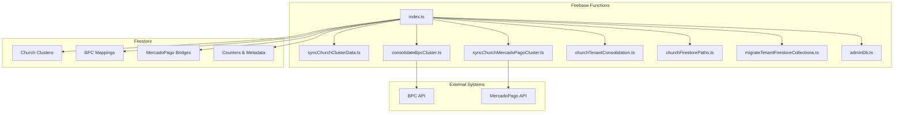
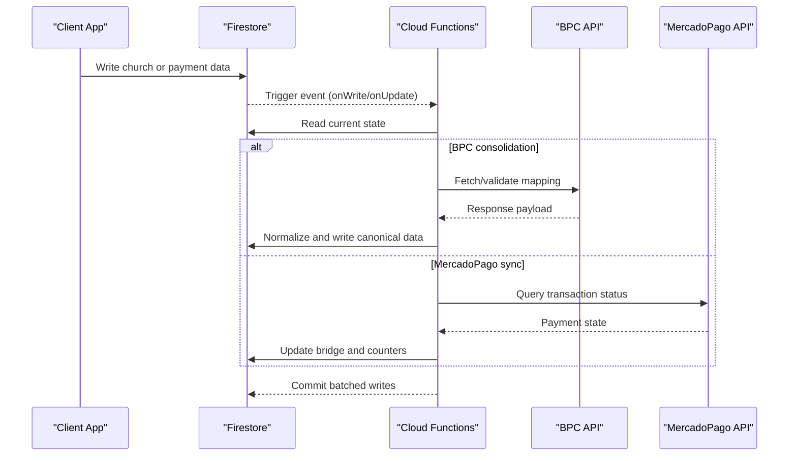
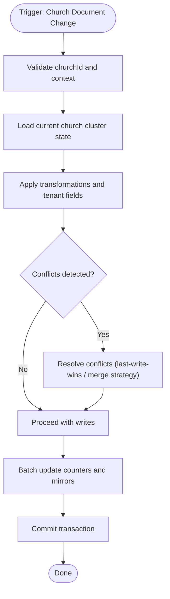
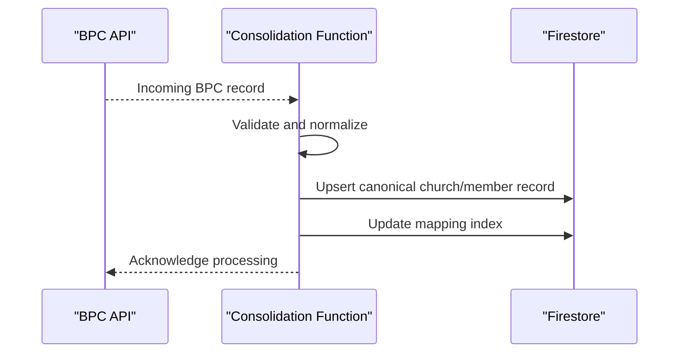
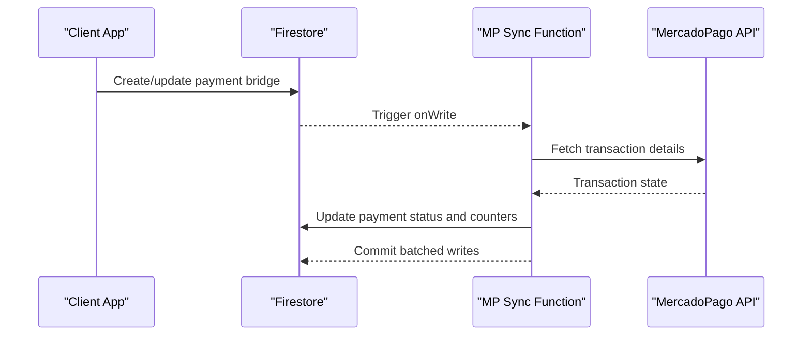
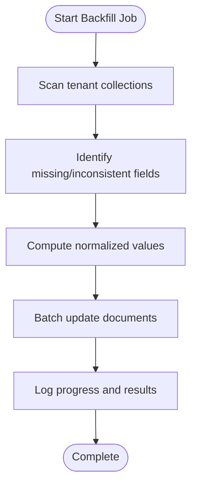
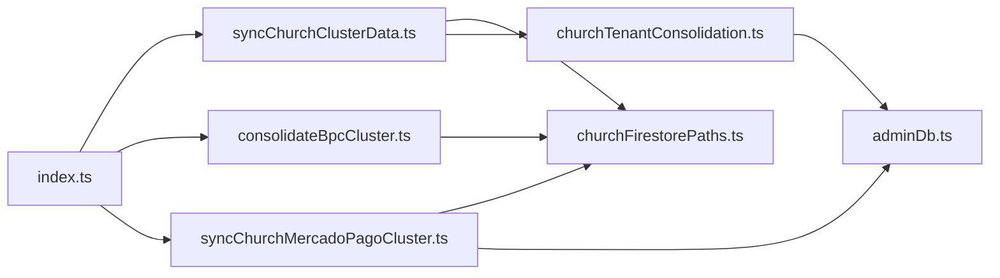

# Data Synchronization Triggers

<cite>
**Referenced Files in This Document**
- [functions/src/index.ts](file://functions/src/index.ts)
- [functions/src/syncChurchClusterData.ts](file://functions/src/syncChurchClusterData.ts)
- [functions/src/consolidateBpcCluster.ts](file://functions/src/consolidateBpcCluster.ts)
- [functions/src/syncChurchMercadoPagoCluster.ts](file://functions/src/syncChurchMercadoPagoCluster.ts)
- [functions/src/churchTenantConsolidation.ts](file://functions/src/churchTenantConsolidation.ts)
- [functions/src/churchFirestorePaths.ts](file://functions/src/churchFirestorePaths.ts)
- [functions/src/churchStorageStructure.ts](file://functions/src/churchStorageStructure.ts)
- [functions/src/migrateTenantFirestoreCollections.ts](file://functions/src/migrateTenantFirestoreCollections.ts)
- [functions/src/adminDb.ts](file://functions/src/adminDb.ts)
- [functions/package.json](file://functions/package.json)
- [firestore.rules](file://firestore.rules)
</cite>

## Table of Contents
1. [Introduction](#introduction)
2. [Project Structure](#project-structure)
3. [Core Components](#core-components)
4. [Architecture Overview](#architecture-overview)
5. [Detailed Component Analysis](#detailed-component-analysis)
6. [Dependency Analysis](#dependency-analysis)
7. [Performance Considerations](#performance-considerations)
8. [Troubleshooting Guide](#troubleshooting-guide)
9. [Conclusion](#conclusion)

## Introduction
This document explains the real-time data synchronization triggers and cluster consolidation processes that keep Firestore collections consistent across multiple tenants (churches) and external systems. It focuses on:
- Firestore-triggered sync functions for church clusters
- BPC (Brazilian Church Platform) integration patterns
- MercadoPago payment system synchronization
- Handling concurrent updates, conflict resolution, and transformation pipelines
- Performance optimization, retry mechanisms, and monitoring approaches

The goal is to provide both a high-level architectural view and detailed component analysis so developers can understand, extend, and operate these systems reliably.

## Project Structure
The relevant code resides primarily under the Firebase Functions directory with TypeScript sources compiled to JavaScript. Key areas include:
- Trigger registration and exports
- Church cluster synchronization logic
- BPC cluster consolidation
- MercadoPago cluster synchronization
- Tenant consolidation and path utilities
- Admin database access helpers
- Firestore rules governing read/write permissions

**Diagram sources**
- [functions/src/index.ts](file://functions/src/index.ts)
- [functions/src/syncChurchClusterData.ts](file://functions/src/syncChurchClusterData.ts)
- [functions/src/consolidateBpcCluster.ts](file://functions/src/consolidateBpcCluster.ts)
- [functions/src/syncChurchMercadoPagoCluster.ts](file://functions/src/syncChurchMercadoPagoCluster.ts)
- [functions/src/churchTenantConsolidation.ts](file://functions/src/churchTenantConsolidation.ts)
- [functions/src/churchFirestorePaths.ts](file://functions/src/churchFirestorePaths.ts)
- [functions/src/migrateTenantFirestoreCollections.ts](file://functions/src/migrateTenantFirestoreCollections.ts)
- [functions/src/adminDb.ts](file://functions/src/adminDb.ts)

**Section sources**
- [functions/src/index.ts](file://functions/src/index.ts)
- [functions/package.json](file://functions/package.json)

## Core Components
- Trigger Registration: Centralized export of Cloud Functions and scheduled tasks that listen to Firestore events and execute background jobs.
- Church Cluster Sync: Ensures canonical church data is mirrored and normalized across related collections and counters.
- BPC Consolidation: Maps and consolidates BPC member and entity records into canonical church structures.
- MercadoPago Sync: Bridges payment state between Firestore and MercadoPago, reconciling transactions and receipts.
- Tenant Consolidation: Applies tenant-specific field normalization and backfills as needed.
- Path Utilities: Provides canonical paths and storage structure conventions used by triggers and migrations.
- Admin DB Access: Secure admin operations for cross-tenant writes and batch updates.

**Section sources**
- [functions/src/index.ts](file://functions/src/index.ts)
- [functions/src/syncChurchClusterData.ts](file://functions/src/syncChurchClusterData.ts)
- [functions/src/consolidateBpcCluster.ts](file://functions/src/consolidateBpcCluster.ts)
- [functions/src/syncChurchMercadoPagoCluster.ts](file://functions/src/syncChurchMercadoPagoCluster.ts)
- [functions/src/churchTenantConsolidation.ts](file://functions/src/churchTenantConsolidation.ts)
- [functions/src/churchFirestorePaths.ts](file://functions/src/churchFirestorePaths.ts)
- [functions/src/migrateTenantFirestoreCollections.ts](file://functions/src/migrateTenantFirestoreCollections.ts)
- [functions/src/adminDb.ts](file://functions/src/adminDb.ts)

## Architecture Overview
The architecture follows an event-driven pattern where Firestore triggers invoke serverless functions to maintain consistency across collections and external APIs. The flow emphasizes idempotency, retries, and clear separation of concerns.

**Diagram sources**
- [functions/src/index.ts](file://functions/src/index.ts)
- [functions/src/syncChurchClusterData.ts](file://functions/src/syncChurchClusterData.ts)
- [functions/src/consolidateBpcCluster.ts](file://functions/src/consolidateBpcCluster.ts)
- [functions/src/syncChurchMercadoPagoCluster.ts](file://functions/src/syncChurchMercadoPagoCluster.ts)

## Detailed Component Analysis

### Church Cluster Synchronization
Purpose: Maintain canonical church data across related collections, counters, and metadata. Handles concurrent updates and ensures eventual consistency.

Key behaviors:
- Listens to church document changes
- Normalizes fields using tenant-aware schemas
- Updates counters and mirrors for performance
- Uses batched writes to minimize round-trips

**Diagram sources**
- [functions/src/syncChurchClusterData.ts](file://functions/src/syncChurchClusterData.ts)
- [functions/src/churchTenantConsolidation.ts](file://functions/src/churchTenantConsolidation.ts)
- [functions/src/churchFirestorePaths.ts](file://functions/src/churchFirestorePaths.ts)

**Section sources**
- [functions/src/syncChurchClusterData.ts](file://functions/src/syncChurchClusterData.ts)
- [functions/src/churchTenantConsolidation.ts](file://functions/src/churchTenantConsolidation.ts)
- [functions/src/churchFirestorePaths.ts](file://functions/src/churchFirestorePaths.ts)

### BPC Integration and Consolidation
Purpose: Map BPC entities to canonical church structures, ensuring consistent membership and organizational data.

Key behaviors:
- Ingests BPC payloads via trigger or scheduled job
- Validates and normalizes fields against canonical schema
- Writes consolidated records to church collections
- Maintains mapping indexes for quick lookups

**Diagram sources**
- [functions/src/consolidateBpcCluster.ts](file://functions/src/consolidateBpcCluster.ts)

**Section sources**
- [functions/src/consolidateBpcCluster.ts](file://functions/src/consolidateBpcCluster.ts)

### MercadoPago Payment System Synchronization
Purpose: Bridge payment state between Firestore and MercadoPago, ensuring accurate financial records and receipts.

Key behaviors:
- Listens to payment-related document changes
- Queries MercadoPago for transaction status
- Updates bridge documents and counters
- Handles retries and error states

**Diagram sources**
- [functions/src/syncChurchMercadoPagoCluster.ts](file://functions/src/syncChurchMercadoPagoCluster.ts)

**Section sources**
- [functions/src/syncChurchMercadoPagoCluster.ts](file://functions/src/syncChurchMercadoPagoCluster.ts)

### Tenant Consolidation and Backfill
Purpose: Apply tenant-specific field normalization and backfill missing fields across existing documents.

Key behaviors:
- Scans tenant collections for missing or inconsistent fields
- Applies default values and transformations
- Uses admin DB access for efficient batch updates

**Diagram sources**
- [functions/src/churchTenantConsolidation.ts](file://functions/src/churchTenantConsolidation.ts)
- [functions/src/migrateTenantFirestoreCollections.ts](file://functions/src/migrateTenantFirestoreCollections.ts)
- [functions/src/adminDb.ts](file://functions/src/adminDb.ts)

**Section sources**
- [functions/src/churchTenantConsolidation.ts](file://functions/src/churchTenantConsolidation.ts)
- [functions/src/migrateTenantFirestoreCollections.ts](file://functions/src/migrateTenantFirestoreCollections.ts)
- [functions/src/adminDb.ts](file://functions/src/adminDb.ts)

### Path Utilities and Storage Structure
Purpose: Provide canonical paths and storage conventions used by triggers and migrations to ensure consistent data organization.

Key behaviors:
- Defines standard Firestore paths for church clusters
- Encapsulates storage folder structure rules
- Exposes helpers for building safe and predictable paths

**Section sources**
- [functions/src/churchFirestorePaths.ts](file://functions/src/churchFirestorePaths.ts)
- [functions/src/churchStorageStructure.ts](file://functions/src/churchStorageStructure.ts)

## Dependency Analysis
Triggers depend on:
- Firestore SDK for reads/writes and transactions
- External APIs (BPC, MercadoPago) for data reconciliation
- Admin DB helper for privileged operations
- Shared utilities for path construction and validation

**Diagram sources**
- [functions/src/index.ts](file://functions/src/index.ts)
- [functions/src/syncChurchClusterData.ts](file://functions/src/syncChurchClusterData.ts)
- [functions/src/consolidateBpcCluster.ts](file://functions/src/consolidateBpcCluster.ts)
- [functions/src/syncChurchMercadoPagoCluster.ts](file://functions/src/syncChurchMercadoPagoCluster.ts)
- [functions/src/churchFirestorePaths.ts](file://functions/src/churchFirestorePaths.ts)
- [functions/src/churchTenantConsolidation.ts](file://functions/src/churchTenantConsolidation.ts)
- [functions/src/adminDb.ts](file://functions/src/adminDb.ts)

**Section sources**
- [functions/src/index.ts](file://functions/src/index.ts)
- [functions/package.json](file://functions/package.json)

## Performance Considerations
- Use batched writes to reduce Firestore round-trips and improve throughput.
- Implement idempotent operations to safely handle retries and duplicate events.
- Leverage counters and mirrors for read-heavy queries to avoid expensive aggregations.
- Minimize external API calls by caching responses when appropriate and respecting rate limits.
- Monitor function execution time and adjust concurrency settings based on observed latency.

[No sources needed since this section provides general guidance]

## Troubleshooting Guide
Common issues and resolutions:
- Trigger not firing: Verify Firestore rules and trigger bindings; check function logs for errors.
- Duplicate writes: Ensure idempotency keys and conditional updates are applied.
- External API failures: Implement exponential backoff and circuit breakers; log failure reasons.
- Inconsistent counters: Re-run backfill jobs and reconcile counts against source data.
- Permission errors: Confirm admin credentials and Firestore security rules allow required operations.

**Section sources**
- [firestore.rules](file://firestore.rules)
- [functions/src/adminDb.ts](file://functions/src/adminDb.ts)

## Conclusion
The synchronization and consolidation system leverages Firestore triggers to maintain data consistency across church clusters, BPC integrations, and MercadoPago payments. By emphasizing idempotency, batching, and robust error handling, the system achieves reliable, scalable synchronization. Continuous monitoring and periodic backfills ensure long-term data integrity and performance.

[No sources needed since this section summarizes without analyzing specific files]